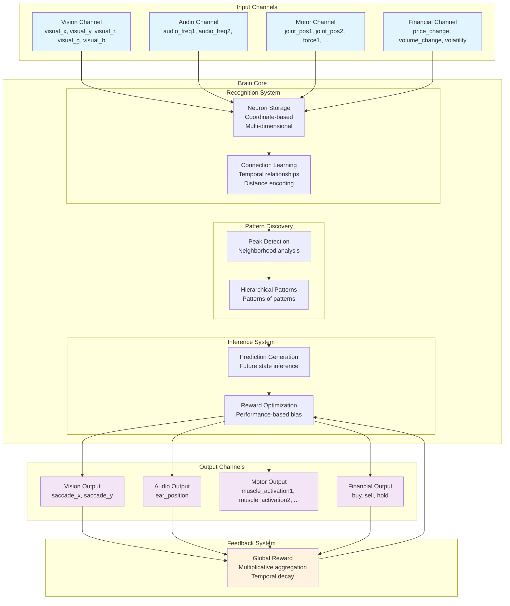
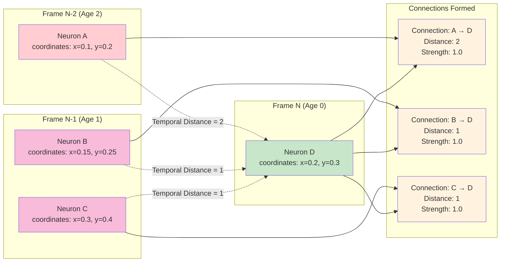
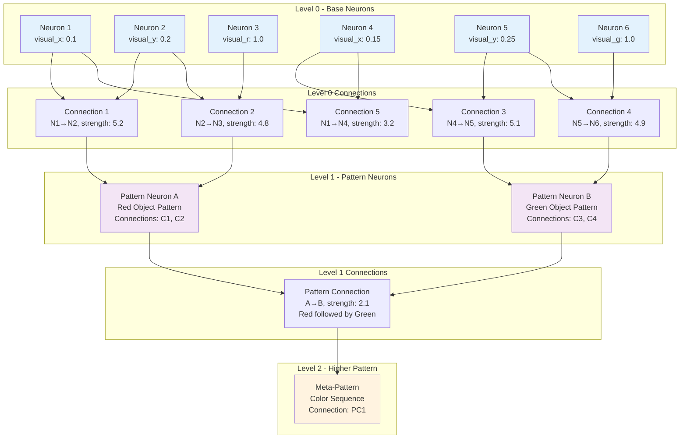
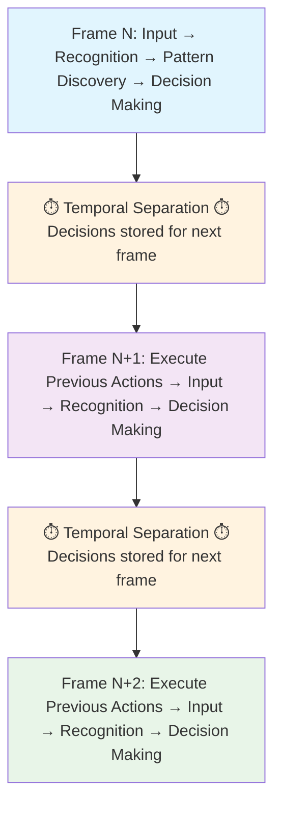
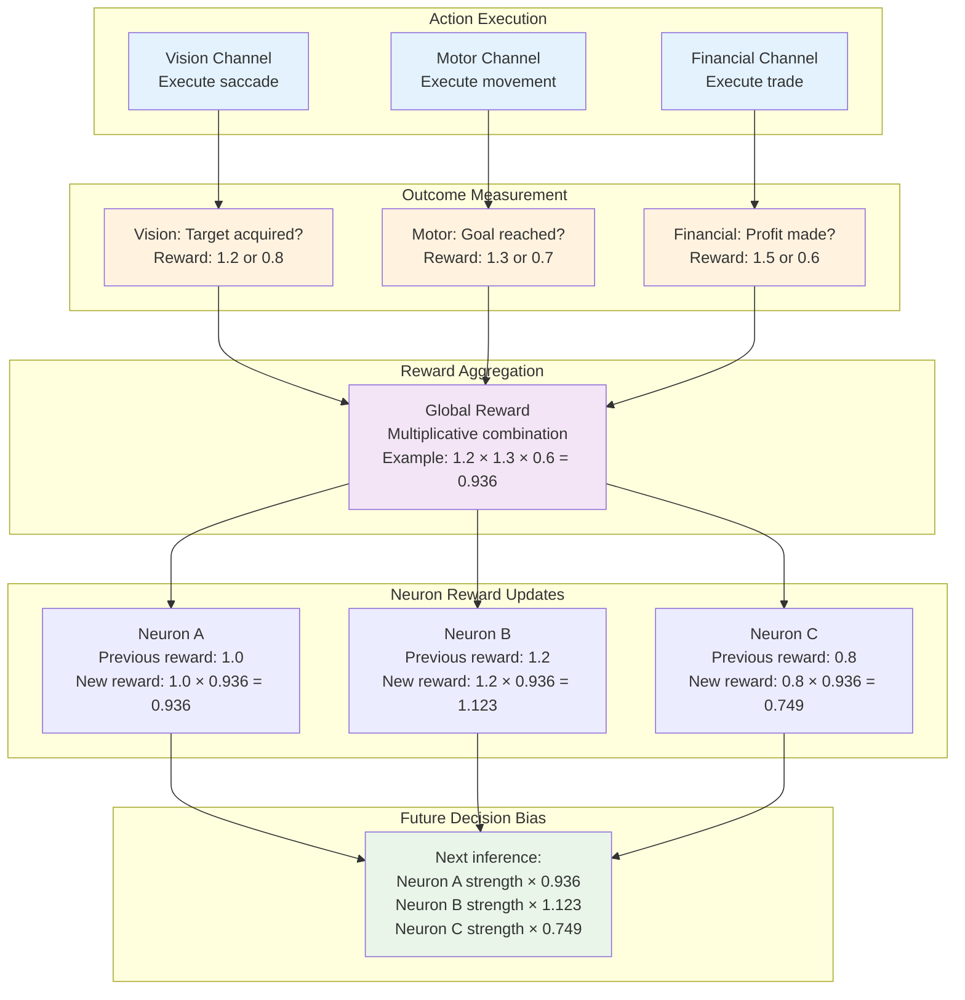

# Artificial Brain Architecture - Patent Disclosure Document

**Confidential - Subject to NDA**

## Executive Summary

This document describes a novel **Artificial Brain Architecture** that mimics biological neural learning through a unique combination of:

1. **Hierarchical Pattern Recognition** - Automatically discovers patterns at multiple levels of abstraction
2. **Temporal Sequence Learning** - Learns and predicts time-based sequences and behaviors  
3. **Multi-Modal Integration** - Processes multiple types of sensory and motor data simultaneously
4. **Reward-Based Adaptation** - Continuously improves performance based on outcome feedback
5. **Autonomous Exploration** - Discovers new behaviors when existing knowledge is insufficient

The system represents a significant advancement over existing AI approaches by providing a unified architecture that can learn, predict, and act across multiple domains without requiring separate training for each task.

## Key Innovations

### 1. Unified Neural Representation
- **Single neuron storage system** that handles both sensory inputs and abstract patterns
- **Coordinate-based encoding** where each neuron represents a point in multi-dimensional space
- **Automatic dimension discovery** from input channels (vision, audio, motor, financial, etc.)

### 2. Temporal Connection Architecture  
- **Directed temporal connections** between neurons based on timing relationships
- **Distance encoding** that captures immediate sequences (distance=1) vs. longer-term patterns (distance=2+)
- **Strength-based learning** where frequently observed connections become stronger

### 3. Hierarchical Pattern Discovery
- **Automatic pattern detection** using peak detection algorithms in connection neighborhoods
- **Multi-level abstraction** where patterns of patterns form higher-level concepts
- **Connection-based patterns** that capture relationships rather than just static features

### 4. Temporal Separation Architecture
- **Decision-Action separation** where decisions made in frame N are executed in frame N+1
- **Prediction validation** system that tracks whether predictions come true
- **Sliding window memory** that maintains context while preventing information overload

### 5. Channel-Based Integration
- **Modular sensory/motor interfaces** that can be combined for complex behaviors
- **Automatic dimension registration** where each channel defines its input/output space
- **Unified feedback system** where all channels contribute to learning signals

## Technical Architecture Overview

The system consists of several key components working together:

### Core Database Schema
- **Neurons Table**: Universal storage for all neural entities
- **Coordinates Table**: Multi-dimensional position data for each neuron
- **Connections Table**: Directed temporal relationships between neurons
- **Patterns Table**: Higher-level abstractions linking pattern neurons to connection signatures
- **Active Memory Tables**: Sliding window of currently relevant information

### Processing Pipeline
1. **Input Processing**: Channels provide multi-dimensional coordinate data
2. **Recognition**: System finds/creates neurons matching input patterns
3. **Connection Learning**: Temporal relationships are reinforced between active neurons
4. **Pattern Discovery**: Peak detection identifies significant connection clusters
5. **Prediction Generation**: System predicts future states based on learned patterns
6. **Action Execution**: Predicted outputs are executed through appropriate channels
7. **Feedback Integration**: Results modify future behavior through reward signals

### Learning Mechanisms
- **Reinforcement Learning**: Successful predictions strengthen associated patterns
- **Negative Learning**: Failed predictions weaken associated patterns  
- **Reward Optimization**: Performance feedback biases future decision-making
- **Forgetting Cycles**: Unused patterns decay to prevent overfitting

## Competitive Advantages

### Versus Traditional Neural Networks
- **No pre-training required** - learns continuously from experience
- **Unified architecture** - single system handles multiple modalities
- **Explainable decisions** - can trace predictions back to learned patterns
- **Real-time adaptation** - immediately incorporates new information

### Versus Reinforcement Learning Systems
- **Hierarchical abstraction** - automatically discovers high-level strategies
- **Multi-modal integration** - combines different types of sensors/actuators
- **Temporal sequence modeling** - naturally handles time-dependent behaviors
- **Pattern reuse** - learned behaviors transfer to new situations

### Versus Expert Systems
- **Automatic knowledge acquisition** - no manual rule programming required
- **Adaptive behavior** - continuously improves performance
- **Uncertainty handling** - gracefully manages incomplete information
- **Scalable complexity** - handles increasingly sophisticated behaviors

## Application Domains

### Autonomous Systems
- **Robotics**: Sensorimotor learning for manipulation and navigation
- **Autonomous Vehicles**: Multi-sensor fusion for driving decisions
- **Drones**: Adaptive flight control and mission planning

### Financial Systems  
- **Algorithmic Trading**: Pattern recognition in market data
- **Risk Management**: Multi-factor analysis and prediction
- **Portfolio Optimization**: Dynamic strategy adaptation

### Industrial Control
- **Process Optimization**: Learning optimal control parameters
- **Predictive Maintenance**: Pattern recognition in sensor data
- **Quality Control**: Adaptive inspection and classification

### Human-Computer Interaction
- **Adaptive Interfaces**: Learning user preferences and behaviors
- **Natural Language Processing**: Context-aware conversation systems
- **Personalization**: Customizing experiences based on user patterns

## Patent Claims Overview

The following aspects represent potentially patentable innovations:

### System Architecture Claims
1. **Unified neural storage system** with coordinate-based multi-dimensional representation
2. **Temporal connection architecture** with distance-based relationship encoding
3. **Hierarchical pattern discovery** using connection neighborhood analysis
4. **Temporal separation mechanism** between decision-making and action execution
5. **Channel-based integration system** for multi-modal learning

### Method Claims  
1. **Process for automatic pattern discovery** in temporal neural networks
2. **Method for hierarchical abstraction** through recursive pattern formation
3. **Technique for reward-based neural optimization** with temporal decay
4. **Process for autonomous exploration** in multi-modal learning systems
5. **Method for real-time adaptation** in continuous learning environments

### Application Claims
1. **System for multi-modal robotic learning** combining vision, touch, and motor control
2. **Method for adaptive financial trading** using temporal pattern recognition
3. **Process for autonomous vehicle control** through hierarchical sensorimotor learning
4. **System for industrial process optimization** via continuous pattern adaptation

## Implementation Details

### Database Architecture
The system uses a MySQL database with both persistent and memory-based tables:
- **Persistent tables** store learned knowledge (neurons, connections, patterns)
- **Memory tables** maintain active context (current activations, predictions, inferences)
- **Optimized indexing** enables real-time processing of large pattern databases

### Processing Performance
- **Real-time operation** suitable for control applications (millisecond response times)
- **Scalable architecture** that handles increasing complexity gracefully
- **Memory efficiency** through sliding window and forgetting mechanisms
- **Parallel processing** capabilities for high-throughput applications

### Integration Capabilities
- **Modular channel system** allows easy addition of new sensor/actuator types
- **Standard interfaces** for common data types (vision, audio, motor, financial)
- **Job-based configuration** enables rapid deployment of new applications
- **API compatibility** with existing systems and frameworks

## Visual Architecture Diagrams

The following diagrams illustrate the key architectural concepts:

### System Architecture Overview

- Shows the complete flow from input channels through brain processing to output channels
- Illustrates the feedback loop that enables continuous learning
- Demonstrates multi-modal integration capabilities

### Temporal Connection Learning

- Shows how neurons form directed connections based on temporal relationships
- Illustrates the distance encoding mechanism (distance=1 for immediate sequences, distance=2+ for longer patterns)
- Demonstrates strength-based learning where repeated observations increase connection strength

### Hierarchical Pattern Discovery

- Shows how base neurons (Level 0) form connections that become patterns (Level 1)
- Illustrates recursive pattern formation where patterns of patterns create higher abstractions (Level 2+)
- Demonstrates the connection-based pattern representation that captures relationships rather than static features

### Temporal Separation Architecture

- Shows the critical innovation of separating decision-making from action execution
- Illustrates how decisions made in Frame N are executed in Frame N+1
- Demonstrates the feedback loop where action results inform future decisions

### Reward-Based Learning System

- Shows how multiple channels provide individual reward signals
- Illustrates multiplicative reward aggregation across channels
- Demonstrates how reward factors bias future decision-making through strength optimization

## Detailed Technical Innovations

### 1. Coordinate-Based Neural Representation
**Innovation**: Unlike traditional neural networks that use abstract weight matrices, this system represents each neuron as a point in multi-dimensional coordinate space.

**Technical Details**:
- Each neuron has explicit coordinates in named dimensions (e.g., visual_x=0.1, visual_y=0.2, visual_r=1.0)
- Dimensions are automatically registered by channels during system initialization
- Same neuron storage system handles both sensory inputs and abstract pattern representations
- Enables direct mapping between neural activations and real-world coordinate systems

**Patent Significance**: This coordinate-based approach enables explainable AI where decisions can be traced back to specific coordinate patterns, unlike black-box neural networks.

### 2. Distance-Encoded Temporal Connections
**Innovation**: Connections between neurons explicitly encode temporal distance, enabling sophisticated sequence learning.

**Technical Details**:
- Distance=0: Spatial co-occurrence (simultaneous activation)
- Distance=1: Immediate temporal sequence (A followed by B)
- Distance=2+: Longer-term temporal patterns (A followed by B after delay)
- Connection strength increases with repeated observations
- Higher hierarchical levels use bucketed distances for temporal abstraction

**Patent Significance**: This distance encoding enables the system to learn and predict sequences at multiple time scales simultaneously, from immediate reactions to long-term behavioral patterns.

### 3. Peak Detection Pattern Discovery
**Innovation**: Automatic pattern discovery using neighborhood analysis and peak detection algorithms.

**Technical Details**:
- Builds bidirectional connectivity graphs from temporal connections
- Calculates neighborhood strength averages for each neuron
- Identifies "peak" neurons whose strength exceeds neighborhood average
- Groups peak connections into pattern signatures
- Matches observed patterns to existing patterns using overlap thresholds (default 66%)
- Creates new pattern neurons for novel connection signatures

**Patent Significance**: This enables unsupervised learning of hierarchical abstractions without requiring pre-defined pattern templates or training data.

### 4. Temporal Separation Mechanism
**Innovation**: Separates decision-making from action execution by one time frame to enable stable learning.

**Technical Details**:
- Decisions made in frame N (age=0) are stored in `inferred_neurons` table
- Actions are executed in frame N+1 when neurons reach age=1
- Results of actions inform frame N+1 decision-making
- Prevents feedback loops that could destabilize learning
- Enables prediction validation and reinforcement learning

**Patent Significance**: This temporal separation solves the stability problem that affects many real-time learning systems, enabling continuous adaptation without oscillation.

### 5. Multi-Modal Channel Integration
**Innovation**: Unified architecture that seamlessly integrates multiple sensory and motor modalities.

**Technical Details**:
- Each channel defines input dimensions (sensors) and output dimensions (actuators)
- Channels automatically register dimensions with brain during initialization
- Single neural representation handles all modalities simultaneously
- Cross-modal pattern discovery enables sensorimotor integration
- Unified reward system aggregates feedback from all channels

**Patent Significance**: This enables single systems to learn complex behaviors spanning multiple modalities (vision + motor + audio) without requiring separate training for each modality.

## Commercial Applications and Market Potential

### Robotics Market ($147B by 2025)
- **Autonomous manipulation**: Learning to grasp and manipulate objects through vision-motor integration
- **Navigation systems**: Multi-sensor fusion for autonomous movement in complex environments
- **Human-robot interaction**: Adaptive behavior based on visual, audio, and tactile feedback

### Autonomous Vehicles Market ($556B by 2026)
- **Sensor fusion**: Integration of camera, lidar, radar, and GPS data for driving decisions
- **Adaptive control**: Learning optimal driving behaviors for different conditions
- **Predictive systems**: Anticipating traffic patterns and pedestrian behavior

### Financial Technology Market ($324B by 2026)
- **Algorithmic trading**: Multi-factor pattern recognition in market data
- **Risk assessment**: Temporal pattern analysis for credit and investment decisions
- **Fraud detection**: Real-time behavioral pattern analysis

### Industrial Automation Market ($296B by 2025)
- **Process optimization**: Learning optimal control parameters through continuous feedback
- **Predictive maintenance**: Pattern recognition in sensor data to predict equipment failures
- **Quality control**: Adaptive inspection systems that improve with experience

## Conclusion

This Artificial Brain Architecture represents a significant advancement in machine learning and artificial intelligence, providing a unified approach to multi-modal learning, temporal prediction, and adaptive behavior. The system's novel combination of hierarchical pattern recognition, temporal sequence learning, and reward-based adaptation creates new possibilities for autonomous systems across multiple domains.

The architecture's key innovations in neural representation, connection modeling, pattern discovery, and multi-modal integration provide strong foundations for patent protection while offering substantial commercial value across robotics, finance, industrial control, and human-computer interaction applications.

**Key Patent Strengths**:
1. **Novel technical approach** that differs significantly from existing neural network and AI architectures
2. **Broad applicability** across multiple high-value commercial markets
3. **Demonstrable technical advantages** over current state-of-the-art systems
4. **Clear implementation pathway** with working prototype demonstrating feasibility
5. **Strong defensive value** against competitors in autonomous systems markets
