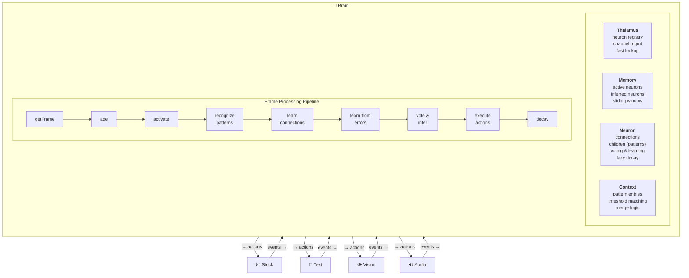
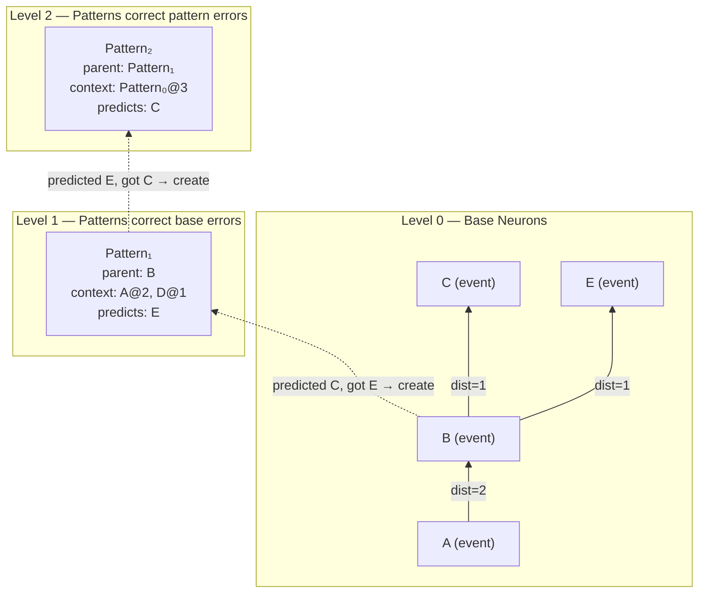

# Robot Brain

A hierarchical temporal neural network that learns patterns from raw sequential data, builds its own neuron hierarchy on demand, and makes predictions through a voting mechanism inspired by how cortical columns reach consensus.

No training epochs. No backpropagation. No labeled data.

You feed it streams of events — stock prices, text characters, sensor data — and it self-organizes. Neurons form, compete, decay, and die. The ones that make good predictions survive.

This is the Node.js reference implementation. A high-performance C++ core with Python and Node.js bindings is in development.

## How It Works

The brain is a **prediction machine**. Every neuron exists to predict what comes next. Learning happens when predictions fail.

### The Core Loop

Each frame, the brain:

1. **Observes** — receives events from input channels (prices, characters, pixels, etc.)
2. **Activates** — finds or creates neurons for the observations
3. **Recognizes** — checks if any learned patterns match the current context
4. **Learns connections** — strengthens links between co-occurring neurons
5. **Learns from errors** — when a confident prediction fails, creates a pattern to remember the context
6. **Votes** — all active neurons vote on what happens next, weighted by level and recency
7. **Acts** — executes the winning action predictions through output channels
8. **Decays** — unused connections and patterns weaken over time

### What Makes It Different

**Hierarchy emerges from failure.** When a base neuron's prediction fails, a level-1 pattern is created. When that pattern's prediction fails, a level-2 pattern is created. Abstraction isn't designed — it's earned.

**Voting enables consensus.** There's no central controller. Every active neuron contributes its prediction, weighted by its level in the hierarchy and how recently it was activated. Higher-level patterns carry more weight because they represent more context.

**Patterns override connections.** When a pattern activates on a parent neuron, it suppresses the parent's raw connection predictions. This is how the brain corrects itself — patterns exist specifically to fix prediction errors.

**Time is structural.** Temporal distance is encoded directly in connections. A connection doesn't just say "A predicts B" — it says "A predicts B at distance 3" (three frames later). This makes sequences first-class citizens.

**Multiple channels converge.** One data stream is mediocre. Many streams together is where it gets powerful — cross-modal patterns emerge naturally when multiple channels feed into the same brain.

## Quick Start

```bash
# Clone the repository
git clone https://github.com/cucar/robot_brain.git
cd robot_brain

# Install dependencies
npm install
```

## Demo 1: Stock Trading

The brain learns to trade stocks from historical price and volume data. Each stock is a separate channel — the brain discovers cross-stock patterns and makes buy/sell/hold decisions optimized by reward feedback.

**The included 3-hour timeframe data is ready to use** — no API key needed for this demo.

```bash
node run-brain.js stock-test --timeframe 3H
```

**Expected output:**
```
Final Training Results (1 episodes):
============================================================
📈 Overall Performance:
   Starting Capital: $15000.00
   Total Net Profit: $152419.94
   Average per Episode: $152419.94
   Average ROI: +1016.13%
   Average Per-Frame ROI: +0.096352%
   Total Trades: 2947
   Average Trades per Episode: 2947.0

💰 Net Profit & ROI by Episode:
   Episode 1: $152419.94 | ROI: +1016.13%, +0.096352%/frame (2947 trades)

📊 Base Level Accuracy by Episode:
   Episode 1: 50.88%
```

The brain achieves ~50% base-level prediction accuracy on price movements (which is expected — markets are noisy), but the **reward-weighted action selection** turns that into profitable trading by learning which contexts produce better outcomes.

### Downloading Fresh Stock Data

To download new data or different timeframes, you need a free [Alpaca](https://alpaca.markets) account:

1. Sign up at [alpaca.markets](https://alpaca.markets) (free paper trading account)
2. Get your API key and secret from the dashboard
3. Copy `.env.example` to `.env` and fill in your credentials:
   ```
   ALPACA_KEY_ID=your_key_here
   ALPACA_SECRET_KEY=your_secret_here
   ```
4. Download data:
   ```bash
   node stock-download.js --timeframe=3H
   ```
5. Process and run:
   ```bash
   node run-setup.js stock-test --timeframe 3H
   node run-brain.js stock-test --timeframe 3H
   ```

## Demo 2: Text Sequence Learning

The brain learns to predict character sequences. Feed it a string, and it memorizes the pattern — reaching 100% prediction accuracy within a few episodes.

**Before running**, adjust the hyperparameters for text learning (the defaults are tuned for stock data):

In `brain/context.js`, change `mergeThreshold` to `0.8`:
```javascript
static mergeThreshold = 0.8;
```

In `brain/neuron.js`, change the forget rates to `0.001`:
```javascript
static connectionForgetRate = 0.001;
static contextForgetRate = 0.001;
static patternForgetRate = 0.001;
```

Then run:
```bash
node run-brain.js text-test
```

**Expected output:**
```
Accuracy by Episode:
   Episode 1: 23.58% (127 frames)
   Episode 2: 89.60% (127 frames)
   Episode 3: 98.40% (127 frames)
   Episode 4: 98.40% (127 frames)
   Episode 5: 100.00% (127 frames)
```

The brain goes from ~24% accuracy (random) to 100% in 5 episodes — it has fully memorized the character sequence and can predict every next character correctly.

> **Remember to change the hyperparameters back** to their stock defaults (`mergeThreshold = 0.5`, forget rates = `0.009`/`0.009`/`0.011`) if you want to run stock tests afterward.

## Demo 3: Multi-Channel Learning

The brain learns to trade 3 stocks simultaneously (KGC, GLD, SPY), each as a separate channel. A repeating 12-day price cycle is presented 20 times — the brain discovers cross-stock patterns and converges on optimal buy/sell timing.

```bash
node run-brain.js multi-channel-test
```

**Expected output:**
```
🎯 Overall Optimal Rate: 93%+
```

The brain learns when to own vs. not own each stock based on upcoming price movements, achieving 93%+ optimal trade decisions across all three channels. This demonstrates how multiple input streams converge to improve inference — one of the architecture's core strengths.

## Architecture



### How Hierarchy Emerges



### Core Components

| File | Role | Description |
|------|------|-------------|
| `brain/brain.js` | Orchestrator | Frame processing loop, pattern recognition, learning, inference |
| `brain/thalamus.js` | Relay station | Neuron registry, channel management, dimension mappings |
| `brain/memory.js` | Short-term memory | Temporal sliding window of active neurons indexed by age |
| `brain/neuron.js` | Neuron | Connections, patterns, voting, learning, lazy decay |
| `brain/context.js` | Pattern context | Context representation, threshold-based matching, merge logic |
| `brain/database.js` | Persistence | Optional MySQL backup/restore (not used during processing) |
| `brain/diagnostics.js` | Metrics | Performance tracking and debug output |
| `brain/dump.js` | Debugging | Brain state dumps |

### Channels

Channels are adapters between the brain and external data. Each channel defines its input dimensions (events) and output dimensions (actions):

| Channel | Inputs (Events) | Outputs (Actions) | Reward Signal |
|---------|-----------------|-------------------|---------------|
| `StockChannel` | Price change, volume change, position | Buy, sell, hold | Profit/loss |
| `TextChannel` | Character code | Next character | Prediction accuracy |
| `VisionChannel` | x, y, r, g, b | Saccade direction | Target acquisition |
| `AudioChannel` | Frequency bands | — | — |
| `ArmChannel` | Joint positions, touch | Muscle contractions | Goal reaching |
| `TongueChannel` | Taste dimensions | Tongue movements | — |

### Jobs

Jobs define learning scenarios — which channels to use, how to configure them, and how to run episodes:

| Job | Description |
|-----|-------------|
| `stock-test` | Multi-stock trading with historical data |
| `text-test` | Character sequence memorization |
| `vision1` | Visual pattern learning with saccadic eye movements |
| `arm1` | Motor control with proprioceptive feedback |
| `multisensory1` | Multi-channel integration |

## Hyperparameters

All hyperparameters are configured as static properties on their respective classes:

| Parameter | Default | Class | Description |
|-----------|---------|-------|-------------|
| `contextLength` | 20 | Memory | Frames a neuron stays active in the sliding window |
| `maxStrength` | 100 | Neuron/Context | Maximum connection/pattern strength |
| `levelVoteMultiplier` | 4.25 | Neuron | Vote weight increase per pattern level |
| `rewardSmoothing` | 0.8 | Neuron | Exponential smoothing factor for reward updates |
| `eventErrorMinStrength` | 1 | Neuron | Min prediction strength to trigger error pattern creation |
| `actionRegretMinStrength` | 3 | Neuron | Min action strength to trigger regret pattern creation |
| `actionRegretMinPain` | 0 | Neuron | Min negative reward to trigger action regret |
| `mergeThreshold` | 0.5 | Context | Min context match ratio for pattern recognition (0.8 for text) |
| `negativeReinforcement` | 0.1 | Context | Weakening rate for missing context entries |
| `connectionForgetRate` | 0.009 | Neuron | Connection strength decay rate per frame (0.001 for text) |
| `contextForgetRate` | 0.009 | Neuron | Pattern context decay rate per frame (0.001 for text) |
| `patternForgetRate` | 0.011 | Neuron | Pattern prediction decay rate per frame (0.001 for text) |

## Command Line Options

```bash
node run-brain.js <job-name> [options]
```

| Option | Description |
|--------|-------------|
| `--timeframe <tf>` | Data timeframe for stock jobs (e.g., `1D`, `1H`, `3H`, `1Min`) |
| `--episodes <n>` | Number of training episodes |
| `--holdout <n>` | Hold out last N rows from training |
| `--offset <n>` | Skip first N rows |
| `--debug` | Show detailed frame-by-frame processing |
| `--diagnostic` | Show inference and conflict resolution details |
| `--database` | Enable MySQL backup/restore |
| `--no-summary` | Suppress per-frame summary output |
| `--start <date>` | Start date for data (YYYY-MM-DD) |
| `--end <date>` | End date for data (YYYY-MM-DD) |

## Creating Custom Jobs

```javascript
import { Job } from './jobs/job.js';
import { TextChannel } from './channels/text.js';

export default class MyJob extends Job {

    getChannels() {
        return [{ name: 'text', channelClass: TextChannel }];
    }

    async configureChannels() {
        this.brain.getChannel('text').setTraining('hello world', 3);
    }

    async executeJob() {
        this.brain.resetContext();
        while (await this.brain.processFrame()) {}
    }

    async showResults() {
        console.log(this.brain.getEpisodeSummary());
    }
}
```

Save as `jobs/my-job.js` and run with `node run-brain.js my-job`.

## Documentation

- **[Architecture Design](docs/architecture.md)** — detailed design document covering voting, patterns, frame processing, and data structures
- **[Error-Driven Learning](docs/error-driven-learning.md)** — deep dive on how patterns are created from prediction errors
- **[Technical Foundations](docs/TECHNICAL_FOUNDATIONS.md)** — architectural ideas, biological inspirations, and comparison with conventional approaches

## Optional: MySQL Persistence

The brain runs entirely in-memory. MySQL is optional — used only for saving/restoring brain state between sessions.

```bash
# Apply schema (requires MySQL running)
mysql -u root -p < db/db.sql

# Run with database backup enabled
node run-brain.js stock-test --timeframe 3H --database
```

## License

Copyright 2025-2026 Cagdas Ucar. Licensed under the [Apache License 2.0](LICENSE).
