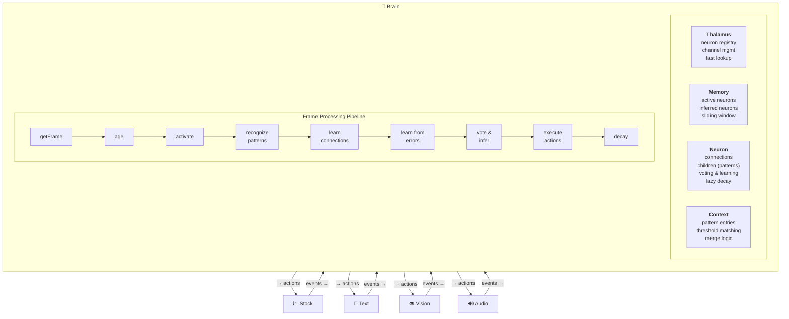
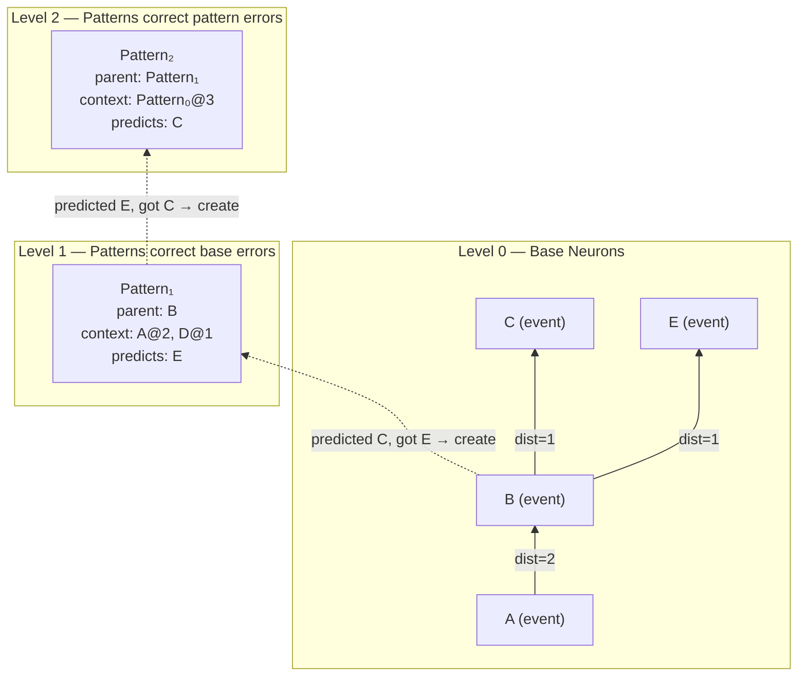

# Robot Brain

A hierarchical temporal neural network that learns patterns from raw sequential data, builds its own neuron hierarchy on demand, and makes predictions through a voting mechanism inspired by how neurons reach consensus.

No training epochs. No backpropagation. No labeled data.

You feed it streams of events — stock prices, text characters, sensor data — and it self-organizes. Neurons form, compete, decay, and die. The ones that make good predictions survive.

This is the Node.js reference implementation. A high-performance C++ core with Python and Node.js bindings is in development.

## How It Works

The brain is a **prediction machine**. Every neuron exists to predict what comes next. Learning happens when predictions fail.

### The Core Loop

Each frame, the brain:

1. **Observes** — receives events from input channels (prices, characters, pixels, etc.)
2. **Activates** — finds or creates neurons for the observations
3. **Recognizes** — checks if any learned patterns match the current context
4. **Learns connections** — strengthens links between co-occurring neurons
5. **Learns from errors** — when a confident prediction fails, creates a pattern to remember the context
6. **Votes** — all active neurons vote on what happens next, weighted by level and recency
7. **Acts** — executes the winning action predictions through output channels
8. **Decays** — unused connections and patterns weaken over time

### What Makes It Different

**Hierarchy emerges from failure.** When a base neuron's prediction fails, a level-1 pattern is created. When that pattern's prediction fails, a level-2 pattern is created. Abstraction isn't designed — it's earned.

**Voting enables consensus.** There's no central controller. Every active neuron contributes its prediction, weighted by its level in the hierarchy and how recently it was activated. Higher-level patterns carry more weight because they represent more context.

**Patterns override connections.** When a pattern activates on a parent neuron, it suppresses the parent's raw connection predictions. This is how the brain corrects itself — patterns exist specifically to fix prediction errors.

**Time is structural.** Temporal distance is encoded directly in connections. A connection doesn't just say "A predicts B" — it says "A predicts B at distance 3" (three frames later). This makes sequences first-class citizens.

**Multiple channels converge.** One data stream is mediocre. Many streams together is where it gets powerful — cross-modal patterns emerge naturally when multiple channels feed into the same brain.

## Quick Start

```bash
# Clone the repository
git clone https://github.com/cucar/robot_brain.git
cd robot_brain

# Install dependencies
npm install
```

## Demo 1: Synthetic Cycle Memorization

The brain learns to trade 3 stocks simultaneously (KGC, GLD, SPY), each as a separate channel. A repeating 12-day price cycle is presented 20 times — the brain discovers cross-stock patterns and converges on optimal buy/sell timing.

Run the multi-channel test with customized hyperparameters:

```bash
node run-brain.js multi-channel-test --error-threshold 0.3 --merge-threshold 0.9
```

**Expected output:**
```
🎯 Overall Optimal Rate: 97.1%
```

The brain learns when to own vs. not own each stock based on upcoming price movements, achieving 96%+ optimal trade decisions across all three channels. This demonstrates how multiple input streams converge to improve inference — one of the architecture's core strengths.

## Demo 2: Stock Trading

The brain learns to trade stocks from historical price and volume data. Each stock is a separate channel — the brain discovers cross-stock patterns and makes buy/sell/hold decisions optimized by reward feedback.

**The included 3-hour timeframe data is ready to use** — no API key needed for this demo.

```bash
node run-brain.js stock-test --timeframe 3H
```

**Expected output:**
```
Final Training Results (1 episodes):
============================================================
📈 Overall Performance:
   Starting Capital: $15000.00
   Total Net Profit: $107401.29
   Average per Episode: $107401.29
   Average ROI: +716.01%
   Average Per-Frame ROI: +0.083838%
   Total Trades: 2508
   Average Trades per Episode: 2508.0

💰 Net Profit & ROI by Episode:
   Episode 1: $107401.29 | ROI: +716.01%, +0.083838%/frame (2508 trades)

📊 Base Level Accuracy by Episode:
   Episode 1: 56.81%
```

The brain achieves 56% base-level prediction accuracy on price movements (which is expected — markets are noisy), but the **reward-weighted action selection** turns that into profitable trading by learning which contexts produce better outcomes.

## Demo 3: Action Learning in Low Accuracy

The brain learns the best actions to perform in each situation over repeated episodes, even when base prediction accuracy is low.

Run the test:
```bash
node run-brain.js stock-test --timeframe 3H --no-summary --episodes 20
```

**Expected output:**
```
💰 Net Profit & ROI by Episode:
Episode 1: $107401.29 | ROI: +716.01%, +0.083838%/frame (2508 trades)
Episode 2: $50513.88 | ROI: +336.76%, +0.058868%/frame (2052 trades)
Episode 3: $74285.76 | ROI: +495.24%, +0.071235%/frame (1772 trades)
Episode 4: $125251.11 | ROI: +835.01%, +0.089277%/frame (1982 trades)
Episode 5: $73772.97 | ROI: +491.82%, +0.071005%/frame (2151 trades)
Episode 6: $146496.99 | ROI: +976.65%, +0.094913%/frame (2057 trades)
Episode 7: $90108.51 | ROI: +600.72%, +0.077752%/frame (2529 trades)
Episode 8: $166326.18 | ROI: +1108.84%, +0.099540%/frame (2178 trades)
Episode 9: $67012.18 | ROI: +446.75%, +0.067840%/frame (2291 trades)
Episode 10: $134242.76 | ROI: +894.95%, +0.091760%/frame (1934 trades)
Episode 11: $145834.55 | ROI: +972.23%, +0.094748%/frame (2079 trades)
Episode 12: $278734.23 | ROI: +1858.23%, +0.118818%/frame (2008 trades)
Episode 13: $129134.28 | ROI: +860.90%, +0.090368%/frame (1914 trades)
Episode 14: $98759.76 | ROI: +658.40%, +0.080913%/frame (1888 trades)
Episode 15: $136488.92 | ROI: +909.93%, +0.092356%/frame (1691 trades)
Episode 16: $166297.29 | ROI: +1108.65%, +0.099534%/frame (2047 trades)
Episode 17: $155024.76 | ROI: +1033.50%, +0.096969%/frame (1624 trades)
Episode 18: $200176.61 | ROI: +1334.51%, +0.106380%/frame (1838 trades)
Episode 19: $154778.76 | ROI: +1031.86%, +0.096911%/frame (1789 trades)
Episode 20: $174850.74 | ROI: +1165.67%, +0.101376%/frame (1810 trades)

📊 Base Level Accuracy by Episode:
Episode 1: 56.81%
Episode 2: 56.62%
Episode 3: 56.65%
Episode 4: 56.69%
Episode 5: 56.64%
Episode 6: 56.59%
Episode 7: 56.57%
Episode 8: 56.57%
Episode 9: 56.46%
Episode 10: 56.42%
Episode 11: 56.40%
Episode 12: 56.39%
Episode 13: 56.32%
Episode 14: 56.25%
Episode 15: 56.21%
Episode 16: 56.18%
Episode 17: 56.14%
Episode 18: 56.07%
Episode 19: 56.03%
Episode 20: 56.00%
```

## Demo 4: Stock Sequence Memorization

The brain memorizes a repeating stock price sequence across 5 episodes, reaching 95%+ prediction accuracy. This demonstrates convergence on financial data — the same learning curve seen in text memorization.

Run the stock test with customized hyperparameters for sequence memorization:

```bash
node run-brain.js stock-test --timeframe 3H --episodes 5 --no-summary --symbols KGC,GLD,SPY --context-length 3 --forget-rate 0.0001 --error-threshold 0.3
```

**Expected output:**
```
🎯 Final Training Results (5 episodes):
============================================================
📈 Overall Performance:
   Starting Capital: $15000.00
   Total Net Profit: $2121028909597.97
   Average per Episode: $424205781919.59
   Average ROI: +2828038546.13%
   Average Per-Frame ROI: +0.491773%
   Total Trades: 14167
   Average Trades per Episode: 2833.4

💰 Net Profit & ROI by Episode:
   Episode 1: $6498.38 | ROI: +43.32%, +0.014369%/frame (2824 trades)
   Episode 2: $260055925.54 | ROI: +1733706.17%, +0.390407%/frame (2858 trades)
   Episode 3: $67697038480.94 | ROI: +451313589.87%, +0.613551%/frame (2836 trades)
   Episode 4: $672437972564.51 | ROI: +4482919817.10%, +0.705807%/frame (2797 trades)
   Episode 5: $1380633836128.60 | ROI: +9204225574.19%, +0.734732%/frame (2852 trades)

📊 Base Level Accuracy by Episode:
   Episode 1: 58.63%
   Episode 2: 72.19%
   Episode 3: 88.77%
   Episode 4: 93.67%
   Episode 5: 95.56%
```

The brain goes from 50% accuracy (random) to 96% in 5 episodes on 3 stocks × 2505 frames of real market data. With more episodes it continues climbing toward 99%+. The low forget rate (0.0001) allows patterns to survive the full 2505-frame sequence, and the short context (3 frames) reduces noise from coincidental connections.

## Demo 5: Text Sequence Learning

The brain learns to predict character sequences. Feed it a string, and it memorizes the pattern — reaching 100% prediction accuracy within a few episodes.

Run the text test with customized hyperparameters for text learning (the defaults are tuned for stock data):

```bash
node run-brain.js text-test --error-threshold 0.3 --context-length 20 --merge-threshold 0.9 --forget-rate 0.001
```

**Expected output:**
```
📊 Accuracy by Episode:
   Episode 1: 41.46% (127 frames)
   Episode 2: 96.80% (127 frames)
   Episode 3: 100.00% (127 frames)
   Episode 4: 100.00% (127 frames)
   Episode 5: 100.00% (127 frames)
```

The brain goes from low accuracy to 100% in 5 episodes — it has fully memorized the character sequence and can predict every next character correctly.

### Downloading Fresh Stock Data

To download new data or different timeframes, you need a free [Alpaca](https://alpaca.markets) account:

1. Sign up at [alpaca.markets](https://alpaca.markets) (free paper trading account)
2. Get your API key and secret from the dashboard
3. Copy `.env.example` to `.env` and fill in your credentials:
   ```
   ALPACA_KEY_ID=your_key_here
   ALPACA_SECRET_KEY=your_secret_here
   ```
4. Download data:
   ```bash
   node stock-download.js --timeframe=3H
   ```
5. Process and run:
   ```bash
   node run-setup.js stock-test --timeframe 3H
   node run-brain.js stock-test --timeframe 3H
   ```

## Architecture



### How Hierarchy Emerges



### Core Components

| File | Role | Description |
|------|------|-------------|
| `brain/brain.js` | Orchestrator | Frame processing loop, pattern recognition, learning, inference |
| `brain/thalamus.js` | Relay station | Neuron registry, channel management, dimension mappings |
| `brain/memory.js` | Short-term memory | Temporal sliding window of active neurons indexed by age |
| `brain/neuron.js` | Neuron | Connections, patterns, voting, learning, lazy decay |
| `brain/context.js` | Pattern context | Context representation, threshold-based matching, merge logic |
| `brain/database.js` | Persistence | Optional MySQL backup/restore (not used during processing) |
| `brain/diagnostics.js` | Metrics | Performance tracking and debug output |
| `brain/dump.js` | Debugging | Brain state dumps |

### Channels

Channels are adapters between the brain and external data. Each channel defines its input dimensions (events) and output dimensions (actions):

| Channel | Inputs (Events) | Outputs (Actions) | Reward Signal |
|---------|-----------------|-------------------|---------------|
| `StockChannel` | Price change, volume change, position | Buy, sell, hold | Profit/loss |
| `TextChannel` | Character code | Next character | Prediction accuracy |
| `VisionChannel` | x, y, r, g, b | Saccade direction | Target acquisition |
| `AudioChannel` | Frequency bands | — | — |
| `ArmChannel` | Joint positions, touch | Muscle contractions | Goal reaching |
| `TongueChannel` | Taste dimensions | Tongue movements | — |

### Jobs

Jobs define learning scenarios — which channels to use, how to configure them, and how to run episodes:

| Job | Description |
|-----|-------------|
| `stock-test` | Multi-stock trading with historical data |
| `text-test` | Character sequence memorization |
| `vision1` | Visual pattern learning with saccadic eye movements |
| `arm1` | Motor control with proprioceptive feedback |
| `multisensory1` | Multi-channel integration |

## Hyperparameters

All hyperparameters are configured via the Brain constructor options and can be passed as command-line arguments:

| Parameter | Default | Command Line Option | Description |
|-----------|---------|---------------------|-------------|
| `errorCorrectionThreshold` | 0.65 | `--error-threshold` | Prediction error threshold for creating patterns |
| `contextLength` | 10 | `--context-length` | Frames a neuron stays active in the sliding window |
| `mergeThreshold` | 0.5 | `--merge-threshold` | Min context match ratio for pattern recognition |
| `patternForgetRate` | 0.01 | `--forget-rate` | Pattern prediction decay rate per frame |

## Command Line Options

```bash
node run-brain.js <job-name> [options]
```

| Option | Description |
|--------|-------------|
| `--timeframe <tf>` | Data timeframe for stock jobs (e.g., `1D`, `1H`, `3H`, `1Min`) |
| `--episodes <n>` | Number of training episodes |
| `--holdout <n>` | Hold out last N rows from training |
| `--offset <n>` | Skip first N rows |
| `--symbols <list>` | Comma-separated list of stock tickers (e.g. `KGC,GLD,SPY`) |
| `--max-positions <n>`| Maximum number of stock positions to hold at once |
| `--max-price <n>` | Maximum price limit for stocks |
| `--initial-capital <n>`| Starting capital for the portfolio |
| `--context-length <n>`| Sliding window size (frames) |
| `--forget-rate <n>` | Pattern activation decay rate per frame |
| `--error-threshold <n>`| Prediction error threshold |
| `--merge-threshold <n>`| Threshold for pattern context matching |
| `--debug` | Show detailed frame-by-frame processing |
| `--diagnostic` | Show inference and conflict resolution details |
| `--database` | Enable MySQL backup/restore |
| `--no-summary` | Suppress per-frame summary output |
| `--start <date>` | Start date for data (YYYY-MM-DD) |
| `--end <date>` | End date for data (YYYY-MM-DD) |

## Creating Custom Jobs

```javascript
import { Job } from './jobs/job.js';
import { TextChannel } from './channels/text.js';

export default class MyJob extends Job {

    getChannels() {
        return [{ name: 'text', channelClass: TextChannel }];
    }

    async configureChannels() {
        this.brain.getChannel('text').setTraining('hello world', 3);
    }

    async executeJob() {
        this.brain.resetContext();
        while (await this.brain.processFrame()) {}
    }

    async showResults() {
        console.log(this.brain.getEpisodeSummary());
    }
}
```

Save as `jobs/my-job.js` and run with `node run-brain.js my-job`.

## Documentation

- **[Architecture Design](docs/architecture.md)** — detailed design document covering voting, patterns, frame processing, and data structures
- **[Error-Driven Learning](docs/error-driven-learning.md)** — deep dive on how patterns are created from prediction errors
- **[Technical Foundations](docs/TECHNICAL_FOUNDATIONS.md)** — architectural ideas, biological inspirations, and comparison with conventional approaches

## Optional: MySQL Persistence

The brain runs entirely in-memory. MySQL is optional — used only for saving/restoring brain state between sessions.

```bash
# Apply schema (requires MySQL running)
mysql -u root -p < db/db.sql

# Run with database backup enabled
node run-brain.js stock-test --timeframe 3H --database
```

## License

Copyright 2025-2026 Cagdas Ucar. Licensed under the [Apache License 2.0](LICENSE).
