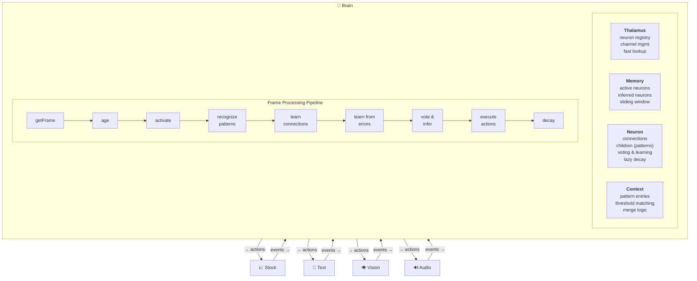
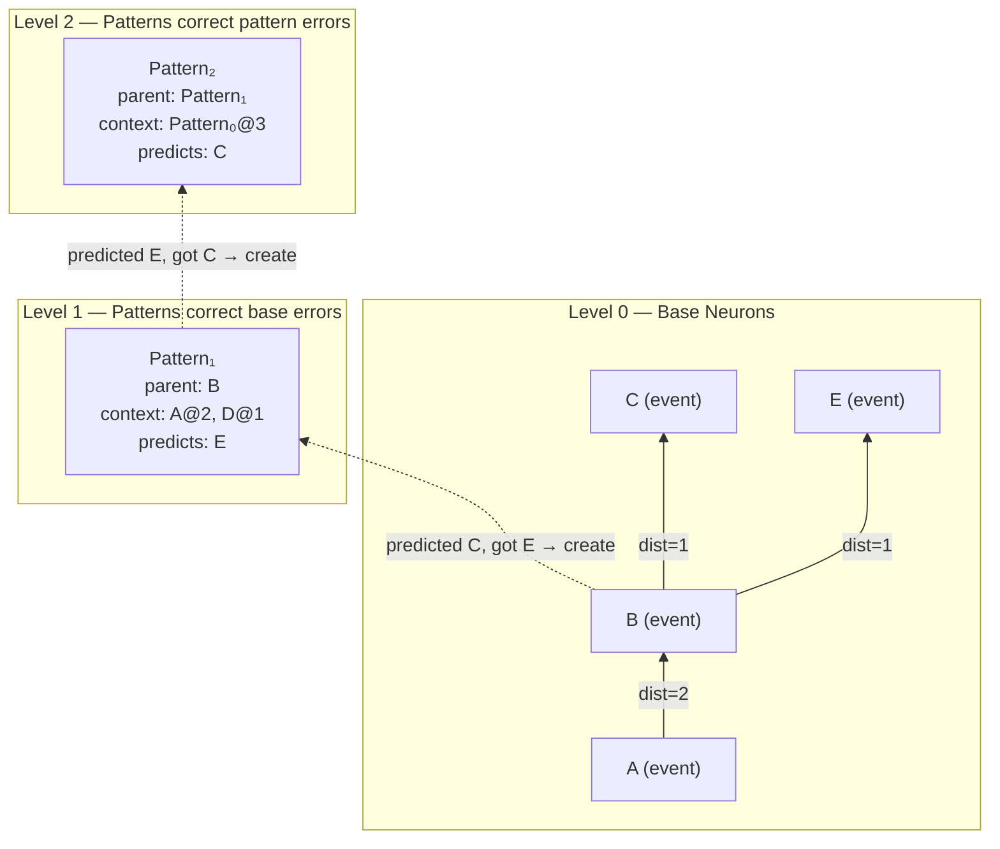

# Robot Brain

A hierarchical temporal neural network that learns patterns from raw sequential data, builds its own neuron hierarchy on demand, and makes predictions through a voting mechanism inspired by how neurons reach consensus.

No training epochs. No backpropagation. No labeled data.

You feed it streams of events — stock prices, text characters, sensor data — and it self-organizes. Neurons form, compete, decay, and die. The ones that make good predictions survive.

The brain core is implemented in Rust (with Rayon multi-threading) and exposed to Node.js via N-API. Python bindings are planned.

## How It Works

The brain is a **prediction machine**. Every neuron exists to predict what fires alongside it (in space) and what comes next (in time). Learning happens when predictions fail.

Processing is **spatio-temporal**. Each frame runs two sweeps: a **spatial** sweep over inputs that co-fire in the same frame (distance 0 — e.g. neighboring pixels, co-moving stocks), and a **temporal** sweep over sequences across frames (distance ≥ 1 — what predicts what N frames later). Each builds its own hierarchy of patterns.

### The Core Loop

Each frame, the brain:

1. **Observes** — receives events from input channels (prices, characters, pixels, etc.)
2. **Activates** — finds or creates neurons for the observations
3. **Recognizes** — checks if learned patterns match: **spatial** patterns (inputs co-firing this frame) and **temporal** patterns (sequences across frames)
4. **Learns connections** — strengthens links between neurons that co-fire (spatial, distance 0) and that follow one another (temporal, distance ≥ 1)
5. **Learns from errors** — when a confident prediction fails, creates a correction pattern to remember the context — in the spatial or temporal hierarchy, whichever erred
6. **Votes** — all active neurons vote on what happens next, weighted by level and recency
7. **Acts** — executes the winning action predictions through output channels
8. **Decays** — unused connections and patterns weaken over time

### What Makes It Different

**Hierarchy emerges from failure.** When a neuron's prediction fails, a correction pattern is created one level up; when that pattern's prediction fails, another level forms above it. This happens independently in two hierarchies — a **spatial** one (same-frame co-activation) and a **temporal** one (cross-frame sequences). Abstraction isn't designed — it's earned.

**Voting enables consensus.** There's no central controller. Every active neuron contributes its prediction, weighted by its level in the hierarchy and how recently it was activated. Higher-level patterns carry more weight because they represent more context.

**Patterns override connections.** When a pattern activates on a parent neuron, it suppresses the parent's raw connection predictions. This is how the brain corrects itself — patterns exist specifically to fix prediction errors.

**Space and time are structural.** Every connection carries a distance. **Distance 0 is spatial** — inputs that fire together in the same frame (neighboring pixels, co-moving stocks), which the brain composes into a spatial feature hierarchy (the basis of the MNIST vision result). **Distance ≥ 1 is temporal** — a connection says "A predicts B at distance 3" (three frames later), making sequences first-class. The same machinery learns both: co-activation in space and prediction in time.

**Multiple channels converge.** One data stream is mediocre. Many streams together is where it gets powerful — cross-modal patterns emerge naturally when multiple channels feed into the same brain.

## Quick Start

**Prerequisites:** [Node.js](https://nodejs.org/) (with [pnpm](https://pnpm.io/)) and the [Rust toolchain](https://rustup.rs/) (the brain core is compiled from Rust into a native Node.js addon).

```bash
# Clone the repository
git clone https://github.com/cucar/robot_brain.git
cd robot_brain

# Install dependencies (pnpm workspace — links robot-brain into each app)
pnpm install
```

### Build the native addon

The demos load a compiled native addon (`brain/brain-napi/brain-napi.node`) built from the Rust core. Build it once before running any demo (and again after changing Rust code). The build script compiles `brain-napi` in release mode and copies the platform artifact into place.

**Linux / macOS:**

```bash
cd brain
./build.sh
```

**Windows (PowerShell):**

```powershell
cd brain
./build.ps1
```

## Demos

The brain is a general architecture; these demos apply it to three different domains. Each lives in its
own document with runnable commands and expected output.

- **[MNIST Demos](docs/mnist-demos.md)** — vision and continual learning. A sensory-only digit
  classifier reaching **96.44%** on the held-out test set with no backpropagation and no labels for
  feature learning, plus class-incremental **Split-MNIST** where naive backprop nets collapse to ~20%.
- **[Text Demos](docs/text-demos.md)** — character-sequence prediction, memorizing a text to ~99.96%
  accuracy in two passes.
- **[Stock & Time-Series Demos](docs/stock-demos.md)** — synthetic cycles, trading on ~21 years of real
  price/volume data, and sequence memorization on market data.

Every demo runs on included data with no API key.

## Architecture


```mermaid
graph TB
    subgraph Brain["🧠 Brain"]
        direction TB
        subgraph Components[" "]
            direction LR
            TH["<b>Thalamus</b><br/>neuron registry<br/>channel mgmt<br/>fast lookup"]
            MEM["<b>Memory</b><br/>active neurons<br/>inferred neurons<br/>sliding window"]
            NEU["<b>Neuron</b><br/>connections<br/>children (patterns)<br/>voting & learning<br/>lazy decay"]
            CTX["<b>Context</b><br/>pattern entries<br/>threshold matching<br/>merge logic"]
        end
        subgraph Pipeline["Frame Processing Pipeline"]
            direction LR
            P1["getFrame"] --> P2["age"] --> P3["activate"] --> P4["recognize<br/>patterns"]
            P4 --> P5["learn<br/>connections"] --> P6["learn from<br/>errors"] --> P7["vote &<br/>infer"]
            P7 --> P8["execute<br/>actions"] --> P9["decay"]
        end
    end
    CH1["📈 Stock"] -- "events →" --> Brain
    CH2["📝 Text"] -- "events →" --> Brain
    CH3["👁 Vision"] -- "events →" --> Brain
    CH4["🔊 Audio"] -- "events →" --> Brain
    Brain -- "→ actions" --> CH1
    Brain -- "→ actions" --> CH2
    Brain -- "→ actions" --> CH3
    Brain -- "→ actions" --> CH4
```

### How Hierarchy Emerges


```mermaid
graph BT
    subgraph L0["Level 0 — Base Neurons"]
        A["A (event)"]
        B["B (event)"]
        C["C (event)"]
        E["E (event)"]
    end
    subgraph L1["Level 1 — Patterns correct base errors"]
        P1["Pattern₁<br/>parent: B<br/>context: A@2, D@1<br/>predicts: E"]
    end
    subgraph L2["Level 2 — Patterns correct pattern errors"]
        P2["Pattern₂<br/>parent: Pattern₁<br/>context: Pattern₀@3<br/>predicts: C"]
    end
    A -- "dist=2" --> B
    B -- "dist=1" --> C
    B -- "dist=1" --> E
    B -. "predicted C, got E → create" .-> P1
    P1 -. "predicted E, got C → create" .-> P2
```

### Core Components

The brain core is a Rust workspace (`brain/`) with two crates:

| Crate / File | Role | Description |
|------|------|-------------|
| `brain-core/src/brain.rs` | Orchestrator | Frame processing loop, pattern recognition, learning, inference |
| `brain-core/src/thalamus.rs` | Relay station | Neuron registry, channel management, dimension mappings, quantizer |
| `brain-core/src/region.rs` | Parallelism | Column partitioner, Rayon-based multi-threaded dispatch |
| `brain-core/src/column.rs` | Worker | Owns a neuron partition, batch operations (becomes a thread in multi-column mode) |
| `brain-core/src/memory.rs` | Short-term memory | Temporal sliding window of active neurons indexed by age |
| `brain-core/src/neuron.rs` | Neuron | Connections, routing table, voting, learning, lazy decay |
| `brain-core/src/context.rs` | Pattern context | Context representation, threshold-based matching, merge logic |
| `brain-core/src/quantizer.rs` | Quantization | Scalar-to-bucket discretization (static, dynamic, passthrough) |
| `brain-core/src/backup.rs` | Persistence | File-based backup/restore (CSVs under `<jobDir>/backups/<label>/`) |
| `brain-core/src/diagnostics.rs` | Metrics | Accuracy tracking and continuous error measurement |
| `brain-napi/` | N-API bridge | Exposes Rust Brain as a native Node.js addon |
| `libs/node` | Node bindings | Re-exports the native addon + Job runner; published to npm as `robot-brain` |

### Apps

Each app owns an encoder (and optionally a trader) that describes its channels to the brain via a spec (`registerChannelSpec`). The spec lists the channel's dimensions, their bucket resolutions, and whether each dim is an input (event) or output (action). Base neurons carry exactly one `(dimId, bucketId)` pair — multi-dim observations emit multiple base neurons per frame.

| App | Inputs (Events) | Outputs (Actions) | Reward Signal |
|-----|-----------------|-------------------|---------------|
| `apps/stocks` | One neuron per dim: price change, volume change | One neuron: position (own/out) | Profit/loss |
| `apps/text`   | One neuron: character code | — | — |
| `apps/db`     | MySQL utilities (import/export) — not a brain channel; loads/exports backup folders for analysis | — | — |

### Jobs

Jobs define learning scenarios — which encoders to register, how to configure them, and how to run episodes:

| Job | Description |
|-----|-------------|
| `apps/stocks/jobs/test.js` | Multi-stock trading with historical data |
| `apps/stocks/jobs/multi-channel-test.js` | Multi-symbol trading across shared brain |
| `apps/stocks/jobs/synthetic-cycle-test.js` | Cycle-learning synthetic stress test |
| `apps/stocks/jobs/synthetic-extended-test.js` | Extended cycle synthetic with optimality analysis |
| `apps/text/jobs/test.js` | Character sequence memorization (default `data/test.txt`; override with `--file`) |
| `apps/db/import.js` | Bulk-load a backup folder into MySQL via `LOAD DATA LOCAL INFILE` |
| `apps/db/export.js` | Dump current MySQL state to `./backups/<timestamp>/` in cwd |

## Hyperparameters

All hyperparameters are configured via the Brain constructor options and can be passed as command-line arguments:

| Parameter | Default | Command Line Option | Description |
|-----------|---------|---------------------|-------------|
| `groupThreshold` | 0.5 | `--group-threshold` | The single grouping coefficient θ: recognition / reuse fires when context similarity ≥ θ, correction mints when error > 1 − θ. Shared by spatial and temporal. Under dynamic `groupMode`, this is the per-unit seed/fallback. |
| `groupMode` | `'neutral'` | `--group-mode` | How the live grouping threshold adapts from each unit's error stats: `static` (pinned at the θ seed), `conservative` (mean + σ — generalize), `neutral` (mean), `aggressive` (mean − σ — memorize). Per-unit error rates tracked online via Welford's algorithm. |
| `contextLength` | 10 | `--context-length` | Frames a neuron stays active in the sliding window |
| `patternForgetRate` | 0.01 | `--forget-rate` | Pattern prediction decay rate per frame |

## Command Line Options

```bash
node <path-to-job.js> [options]
```

| Option | Description |
|--------|-------------|
| `--timeframe <tf>` | Data timeframe for stock jobs (e.g., `1D`, `1H`, `3H`, `1Min`) |
| `--episodes <n>` | Number of training episodes |
| `--holdout <n>` | Hold out last N rows from training |
| `--offset <n>` | Skip first N rows |
| `--symbols <list>` | Comma-separated list of stock tickers (e.g. `KGC,GLD,SPY`) |
| `--max-positions <n>`| Maximum number of stock positions to hold at once |
| `--max-price <n>` | Maximum price limit for stocks |
| `--initial-capital <n>`| Starting capital for the portfolio |
| `--transaction-cost <n>`| Simulated transaction cost per trade, as a percentage (e.g. `0.01` = 0.01%). Buys pay more, sells receive less. Reports total cost at end of run |
| `--context-length <n>`| Sliding window size (frames) |
| `--forget-rate <n>` | Pattern activation decay rate per frame |
| `--group-threshold <n>`| Grouping coefficient θ (recognition ≥ θ, correction > 1 − θ); shared spatial + temporal |
| `--group-mode <m>` | Grouping-threshold adaptation: `static`, `conservative`, `neutral`, `aggressive` |
| `--debug` | Show detailed frame-by-frame processing |
| `--diagnostic` | Show inference and conflict resolution details |
| `--save-brain <label>` | Save a CSV backup on shutdown (incl. crash) under `<jobDir>/backups/<label>/` |
| `--load-brain <label>` | Load a labeled backup before the first frame (errors if none exists) |
| `--save-context <label>` | Save the memory context window on shutdown under `<jobDir>/contexts/<label>/` |
| `--load-context <label>` | Restore the memory context window (active neurons, votes, rewards) |
| `--save-session <label>` | Save trader/portfolio state on shutdown under `<jobDir>/sessions/<label>/` |
| `--load-session <label>` | Restore trader/portfolio state (positions, cash, prices) |
| `--no-summary` | Suppress per-frame summary output |
| `--start <date>` | Start date for data (YYYY-MM-DD) |
| `--end <date>` | End date for data (YYYY-MM-DD) |
| `--random-baseline` | Skip the brain entirely; pick own/out + symbol uniformly at random (sanity-check baseline for stock test) |

## Creating Custom Jobs

```javascript
import { Job, runJob } from 'robot-brain';
import { TextEncoder } from '../encoder.js';

export default class MyJob extends Job {

    constructor() {
        super();
        this.encoders = [];
    }

    async initialize() {
        const encoder = new TextEncoder('text');
        const ids = this.brain.registerChannelSpec(encoder.getChannelSpec());
        encoder.bindIds(ids);
        this.encoders.push(encoder);
    }

    async configureChannels() {
        for (const encoder of this.encoders) encoder.setData('hello world');
    }

    async executeJob() {
        this.brain.resetContext();
        while (true) {
            const inputs = new Map();
            let any = false;
            for (const encoder of this.encoders) {
                const frame = encoder.nextFrame();
                if (!frame) continue;
                any = true;
                inputs.set(encoder.channelId, encoder.encode(frame));
            }
            if (!any) break;
            this.brain.processFrame(inputs, new Map());
        }
    }

    async showResults() {
        console.log(this.brain.getEpisodeSummary());
    }
}

await runJob(import.meta, MyJob);
```

Save as `apps/text/jobs/my-job.js` and run with `node apps/text/jobs/my-job.js`.

## Documentation

**Demos** (runnable, with expected output):

- **[MNIST Demos](docs/mnist-demos.md)** — vision and class-incremental continual learning
- **[Text Demos](docs/text-demos.md)** — character-sequence prediction
- **[Stock & Time-Series Demos](docs/stock-demos.md)** — synthetic cycles, trading, sequence memorization

**Design**:

- **[Architecture Design](docs/architecture.md)** — detailed design document covering voting, patterns, frame processing, and data structures
- **[Error-Driven Learning](docs/error-driven-learning.md)** — deep dive on how patterns are created from prediction errors
- **[Technical Foundations](docs/TECHNICAL_FOUNDATIONS.md)** — architectural ideas, biological inspirations, and comparison with conventional approaches
- **[Hippocampus Design](docs/hippocampus.md)** — design and implementation plan for the hippocampal region (long-term memory, thinking, metacognition)
- **[Future Work](docs/future-work.md)** — Python bindings, MPI distribution, and other planned work

## Persistence

The brain runs entirely in-memory. Three labeled save/load pairs let you snapshot
and resume across sessions:

| Pair | What it persists | Storage path |
|------|-----------------|--------------|
| `--save-brain` / `--load-brain` | Learned neurons and connections | `<jobDir>/backups/<label>/` |
| `--save-context` / `--load-context` | Memory context window (active neurons, votes, rewards) | `<jobDir>/contexts/<label>/` |
| `--save-session` / `--load-session` | Trader/portfolio state (positions, cash, prices) | `<jobDir>/sessions/<label>/` |

```bash
# Run the first half and save everything
node apps/stocks/jobs/test.js --episodes 1 --frames 1250 --save-brain day1 --save-context day1 --save-session day1

# Resume from where we left off
node apps/stocks/jobs/test.js --episodes 1 --offset 1251 --load-brain day1 --load-context day1 --load-session day1
```

Each save is a folder of CSVs under the label you choose. Brain backups are also
written on crash (uncaught error / SIGINT) when `--save-brain` is set.

For MySQL-based analysis tooling — bulk-loading a backup into a queryable database
or exporting MySQL state back to a backup folder — see the [`apps/db`](apps/db)
app. It is not part of the brain core; the brain has no DB dependency.

### Backup → MySQL → Backup Round-Trip

Take a backup, push it through MySQL, pull it back out, and verify the rehydrated
brain reproduces the same result. Uses the Demo 6 stock sequence memorization
config (KGC,GLD,SPY) — a single episode here ends around `$22,675,481.59`.

```bash
# 1. Run one episode and save a backup
node apps/stocks/jobs/test.js --no-summary --symbols KGC,GOLD,SPY --context-length 3 --group-mode static --group-threshold 0.7 --forget-rate 0.001 --save-brain roundtrip

# 2. Import that backup folder into MySQL
node apps/db/import.js apps/stocks/jobs/test/backups/roundtrip

# 3. Delete the original backup, then export MySQL back to the same label
Remove-Item -Recurse -Force apps/stocks/jobs/test/backups/roundtrip
node apps/db/export.js apps/stocks/jobs/test/backups/roundtrip

# 4. Load the round-tripped backup and run another episode — should reach
#    ~$8,441,629.32, matching what a continuous two-episode run produces
node apps/stocks/jobs/test.js --no-summary --symbols KGC,GOLD,SPY --context-length 3 --group-mode static --group-threshold 0.7 --forget-rate 0.001 --load-brain roundtrip
```

The `apps/db` import uses `LOAD DATA LOCAL INFILE`, which needs `local_infile=ON`
server-side; the import script enables it automatically (`SET GLOBAL local_infile = 1`)
as long as the connecting user has `SYSTEM_VARIABLES_ADMIN` (or `SUPER` on older
MySQL) — root has this by default. DB credentials live in [`apps/db/.env`](apps/db/.env.example).

## License

Copyright 2025-2026 Cagdas Ucar. Licensed under the [Apache License 2.0](LICENSE).
