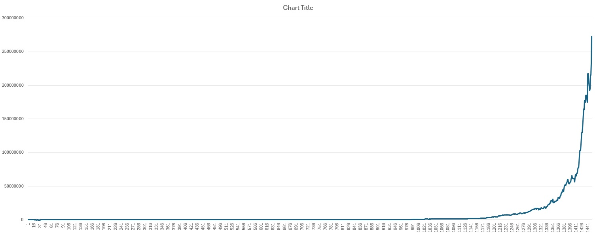
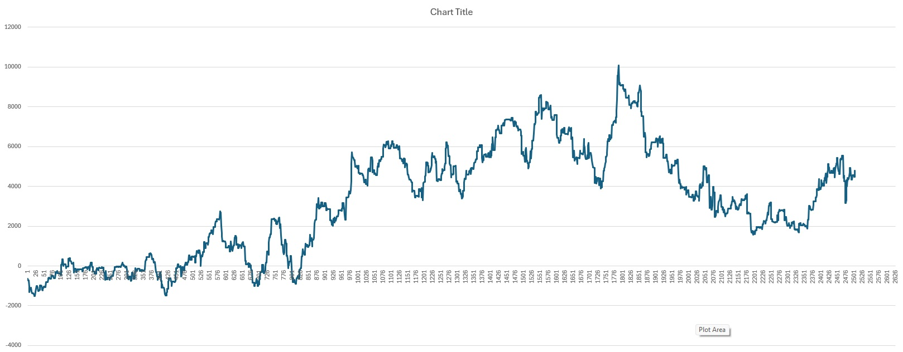
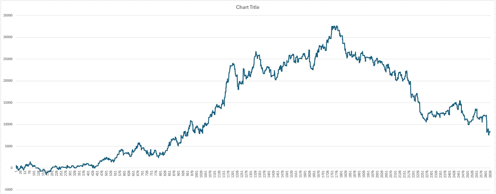
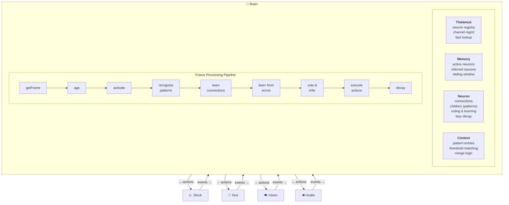
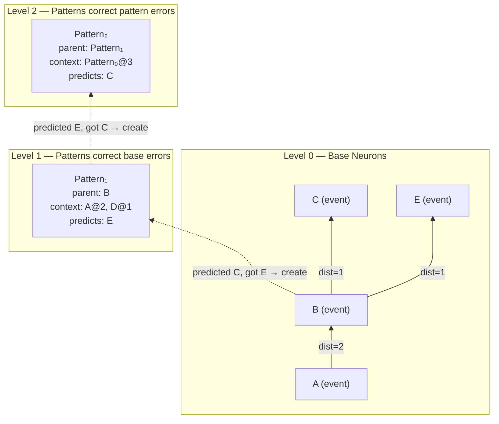

# Robot Brain

A hierarchical temporal neural network that learns patterns from raw sequential data, builds its own neuron hierarchy on demand, and makes predictions through a voting mechanism inspired by how neurons reach consensus.

No training epochs. No backpropagation. No labeled data.

You feed it streams of events — stock prices, text characters, sensor data — and it self-organizes. Neurons form, compete, decay, and die. The ones that make good predictions survive.

The brain core is implemented in Rust (with Rayon multi-threading) and exposed to Node.js via N-API. Python bindings are planned.

## How It Works

The brain is a **prediction machine**. Every neuron exists to predict what comes next. Learning happens when predictions fail.

### The Core Loop

Each frame, the brain:

1. **Observes** — receives events from input channels (prices, characters, pixels, etc.)
2. **Activates** — finds or creates neurons for the observations
3. **Recognizes** — checks if any learned patterns match the current context
4. **Learns connections** — strengthens links between co-occurring neurons
5. **Learns from errors** — when a confident prediction fails, creates a pattern to remember the context
6. **Votes** — all active neurons vote on what happens next, weighted by level and recency
7. **Acts** — executes the winning action predictions through output channels
8. **Decays** — unused connections and patterns weaken over time

### What Makes It Different

**Hierarchy emerges from failure.** When a base neuron's prediction fails, a level-1 pattern is created. When that pattern's prediction fails, a level-2 pattern is created. Abstraction isn't designed — it's earned.

**Voting enables consensus.** There's no central controller. Every active neuron contributes its prediction, weighted by its level in the hierarchy and how recently it was activated. Higher-level patterns carry more weight because they represent more context.

**Patterns override connections.** When a pattern activates on a parent neuron, it suppresses the parent's raw connection predictions. This is how the brain corrects itself — patterns exist specifically to fix prediction errors.

**Time is structural.** Temporal distance is encoded directly in connections. A connection doesn't just say "A predicts B" — it says "A predicts B at distance 3" (three frames later). This makes sequences first-class citizens.

**Multiple channels converge.** One data stream is mediocre. Many streams together is where it gets powerful — cross-modal patterns emerge naturally when multiple channels feed into the same brain.

## Quick Start

```bash
# Clone the repository
git clone https://github.com/cucar/robot_brain.git
cd robot_brain

# Install dependencies (pnpm workspace — links robot-brain into each app)
pnpm install
```

## Demo 1: Single-Channel Synthetic Cycle

A single-stock variant of the cycle test: one channel, a repeating 12-frame price/volume pattern, 20 repeats. Same idea as Demo 1 but isolated to a single channel so you can see the brain converge on optimal actions without multi-channel reinforcement doing any of the work.

```bash
node apps/stocks/jobs/synthetic-extended-test.js --error-mode static --error-threshold 0.3 --merge-threshold 0.9
```

**Expected output:**
```
Overall Optimal Rate: 233/240 = 97.1%
```

With the right thresholds the brain converges to 97%+ optimal action decisions on a single-channel cyclical pattern — confirming that hierarchy and action inference work without cross-channel consensus.

## Demo 2: Multi-Channel Synthetic Cycle

The brain learns to trade 3 stocks simultaneously (KGC, GLD, SPY), each as a separate channel. A repeating 12-day price cycle is presented 20 times — the brain discovers cross-stock patterns and converges on optimal buy/sell timing.

Run the multi-channel test with customized hyperparameters:

```bash
node apps/stocks/jobs/multi-channel-test.js --error-mode static --error-threshold 0.3 --merge-threshold 0.9
```

**Expected output:**
```
🎯 Overall Optimal Rate: 700/720 = 97.2%
```

The brain learns when to own vs. not own each stock based on upcoming price movements, achieving 96%+ optimal trade decisions across all three channels. This demonstrates how multiple input streams converge to improve inference — one of the architecture's core strengths.

## Demo 3: Stock Trading

The brain learns to trade stocks from historical price and volume data. Each stock is a separate channel — the brain discovers cross-stock patterns and makes buy/sell/hold decisions optimized by reward feedback.

**The included timeframe data is ready to use** — no API key needed for this demo.
**Using high error correction threshold to be able to quickly stabilize the patterns and get higher returns.

```bash
node apps/stocks/jobs/test.js --context-length 3 --columns 20 --transaction-cost 0.02 --max-positions 10
```

**Expected output:**
```
Final Training Results (1 episodes):
============================================================
📈 Overall Performance:
   Starting Capital: $15000.00
   Total Net Profit: $90731949.39
   Average per Episode: $90731949.39
   Average ROI: +604879.66%
   Average Per-Frame ROI: +0.600681%
   Average Sharpe Ratio: 4.73
   Total Transaction Cost: $1763721.38 (0.02% per trade)
   Total Trades: 21232
   Average Trades per Episode: 21232.0

💰 Net Profit & ROI by Episode:
   Episode 1: $90731949.39 | ROI: +604879.66%, +0.600681%/frame, Sharpe: 4.73 (21232 trades)

📊 Base Level Accuracy by Episode:
   Episode 1: 50.54%
```

The brain achieves ~50% base-level prediction accuracy on price movements (which is expected — markets are noisy), but the **reward-weighted action selection** turns that into profitable trading by learning which contexts produce better outcomes.

### Brain P&L over time



Drawdowns happen, but the brain keeps making new highs — the trajectory shape a learning system should produce.

## Demo 4: Random Baseline Comparison

A natural worry about Demo 3 is that the result might come from a favorable data window rather than learned trading. To rule that out, the same job can be run with `--random-baseline`, which replaces the brain's action inference with a coin flip: 50% chance to be fully out, 50% chance to own one stock chosen uniformly at random. Everything else — the same data, same portfolio sizing, same execution path — is unchanged.

```bash
node apps/stocks/jobs/test.js --random-baseline
```

`--random-baseline` skips encoding, reward collection, and `brain.processFrame()` entirely, so the run is purely the trading harness driven by random signals — no shared work with the brain path.

**Two example random-baseline runs:**




Random P&L varies wildly between seeds — one run drifts up to roughly +$32K and gives most of it back to end near +$8K; another finishes in the single thousands. Across the random runs we observed, none came close to the brain's +$66K. Two differences stand out:

- **Endpoint magnitude.** The brain's final profit is roughly an order of magnitude above the best random run on this data — well outside the random baseline's natural variance.
- **Trajectory shape.** Random P&L drifts up and reverts (classic undirected exposure just riding whatever the basket does). The brain has drawdowns but keeps making new highs.

This is the simplest sanity check that the brain is doing real work: same harness, same data, only the decision source changes — and the results are not in the same league.

## Demo 5: Action Learning in Low Accuracy

The brain learns the best actions to perform in each situation over repeated episodes, even when base prediction accuracy is low.

Run the test:
```bash
node apps/stocks/jobs/test.js --symbols SO,VALE,STLD,GOOGL,MU,PLTR,UUUU,PFE,CRM,HAL --context-length 3 --columns 20 --no-summary --episodes 5
```

**Expected output:**
```
💰 Net Profit & ROI by Episode:
   Episode 1: $190727.88 | ROI: +1271.52%, +0.180252%/frame, Sharpe: 0.53 (1186 trades)
   Episode 2: $5377045.03 | ROI: +35846.97%, +0.405540%/frame, Sharpe: 1.29 (1216 trades)
   Episode 3: $233710806.76 | ROI: +1558072.05%, +0.666160%/frame, Sharpe: 2.11 (1396 trades)
   Episode 4: $4505659149.94 | ROI: +30037727.67%, +0.871228%/frame, Sharpe: 2.81 (1674 trades)
   Episode 5: $64183173731.74 | ROI: +427887824.88%, +1.055685%/frame, Sharpe: 3.46 (1804 trades)

📊 Base Level Accuracy by Episode:
   Episode 1: 51.10%
   Episode 2: 52.99%
   Episode 3: 56.31%
   Episode 4: 57.15%
   Episode 5: 57.62%
```

## Demo 6: Stock Sequence Memorization

The brain memorizes a repeating stock price sequence across 5 episodes, reaching 95%+ prediction accuracy. This demonstrates convergence on financial data — the same learning curve seen in text memorization.

Run the stock test with customized hyperparameters for sequence memorization:

```bash
node apps/stocks/jobs/test.js --no-summary --episodes 5 --symbols KGC,GOLD,SPY --context-length 3 --forget-rate 0.0005 --error-mode static --error-threshold 0.3
```

**Expected output:**
```
🎯 Final Training Results (5 episodes):
============================================================
📈 Overall Performance:
   Starting Capital: $15000.00
   Total Net Profit: $1888559487498760192.00
   Average per Episode: $377711897499752064.00
   Average ROI: +2518079316665013.50%
   Average Per-Frame ROI: +1.616917%
   Average Sharpe Ratio: 11.33
   Total Trades: 8831
   Average Trades per Episode: 1766.2

💰 Net Profit & ROI by Episode:
   Episode 1: $44236.05 | ROI: +294.91%, +0.094507%/frame, Sharpe: 0.42 (1702 trades)
   Episode 2: $24806588005874.30 | ROI: +165377253372.50%, +1.470565%/frame, Sharpe: 10.09 (1849 trades)
   Episode 3: $278868271088285152.00 | ROI: +1859121807255234.50%, +2.123590%/frame, Sharpe: 14.80 (1765 trades)
   Episode 4: $762538157675950976.00 | ROI: +5083587717839673.00%, +2.194266%/frame, Sharpe: 15.62 (1759 trades)
   Episode 5: $847128252146474112.00 | ROI: +5647521680976494.00%, +2.201660%/frame, Sharpe: 15.70 (1756 trades)

📊 Base Level Accuracy by Episode:
   Episode 1: 51.84%
   Episode 2: 96.99%
   Episode 3: 99.95%
   Episode 4: 99.95%
   Episode 5: 99.95%
```

The brain goes from 50% accuracy (random) to 99% in 5 episodes on 3 stocks × 1400 frames of real market data. The low forget rate (0.001) allows patterns to survive the full sequence, and the short context (3 frames) reduces noise from coincidental connections.

## Demo 7: Text Sequence Learning

The brain learns to predict character sequences. Feed it a string, and it memorizes the pattern — reaching ~99.94% prediction accuracy within two episodes and staying flat there.

Run the text test with customized hyperparameters for text learning (the defaults are tuned for stock data):

```bash
node apps/text/jobs/test.js --file abramov.txt --error-mode static --error-threshold 0.3 --context-length 20 --merge-threshold 0.9 --forget-rate 0.00003 --no-summary
```

**Expected output:**
```
📊 Accuracy by Episode:
   Episode 1: 27.81% (32674 frames)
   Episode 2: 99.96% (32674 frames)
   Episode 3: 99.96% (32674 frames)
   Episode 4: 99.96% (32674 frames)
   Episode 5: 99.96% (32674 frames)
```

The brain goes from low accuracy to ~99.96% in two episodes and holds there — it has fully memorized the character sequence except for the first ~20 characters at the start of each episode. Those leading characters can't be predicted because the brain hasn't seen any context yet — it needs a `context-length` window of prior characters in memory before it can recognize patterns and cast votes. The "warmup" frames at the head of each episode are a structural property of context-based prediction, not a learning failure: every character past the warmup window is predicted correctly.

## Demo 8: MNIST Digit Classification (Naive Bayes Baseline)

A sensory-only MNIST classifier built on the brain's count-based voting. One channel per pixel position (retinotopic, 784 channels at 28×28), all firing concurrently in a single frame per image. Supervision lands on a separate `digit` action channel via `brain.learn()`. With `patternForgetRate=0` and a constant reward of 1, the brain's per-voter consensus reduces to a Naive Bayes posterior — every `learn()` call increments per-pixel-per-digit counts, and inference picks the argmax.

Download the MNIST data first (one-time, ~11 MB into `apps/mnist/data/`):

```bash
node apps/mnist/jobs/download.js
```

This fetches the four standard IDX files (60k training, 10k test, gzipped) from Google's MNIST mirror. The job skips files that already exist, so it's safe to re-run.

Then run the MNIST test:

```bash
node apps/mnist/jobs/test.js --image-size 14 --buckets 2 --columns 20 --per-class 500 --max-test-images 1000 --episodes 3 --error-mode static --error-threshold 0.2 --merge-threshold 0.6
```

**Expected output:**
```
MNIST — sensory-only (Naive Bayes) baseline
  Image size: 14×14 (196 channels)
  Buckets: 2 (Phase A — binary)
  Context length: 1
  Forget rate: 0
  Consensus: nb (nb-eps 0.001)
  Episodes: 3
  Training: balanced, 500 per class
  Test images: 1000

  Balanced training set built: 500 per class × 10 = 5000 total
  Episode 1/3: train=87.00% (4350/5000) | 107 img/s 46847ms | 0:93% 1:98% 2:87% 3:86% 4:89% 5:79% 6:93% 7:90% 8:76% 9:79%
    ↳ spatial: depth=6 | L1:2297 L2:56891 L3:32443 L4:1865 L5:24 L6:2 | 93522 active, 93522 minted cum | 93872 neurons
  Episode 2/3: train=96.88% (4844/5000) | 111 img/s 45229ms | 0:97% 1:99% 2:96% 3:96% 4:97% 5:97% 6:98% 7:98% 8:96% 9:95%
    ↳ spatial: depth=7 | L1:2301 L2:61319 L3:47476 L4:3756 L5:78 L6:8 L7:1 | 114939 active, 114939 minted cum | 115289 neurons
  Episode 3/3: train=99.62% (4981/5000) | 91 img/s 54662ms | 0:100% 1:100% 2:99% 3:99% 4:100% 5:100% 6:100% 7:100% 8:100% 9:99%
    ↳ spatial: depth=8 | L1:2301 L2:61399 L3:48748 L4:4705 L5:186 L6:20 L7:5 L8:2 | 117366 active, 117366 minted cum | 117716 neurons

  Test: 92.00% (920/1000) 7037ms | 0:95% 1:98% 2:90% 3:91% 4:93% 5:94% 6:95% 7:87% 8:84% 9:91%

Results
======================================================================
  Episode 1: train=87.00% (46847ms)
  Episode 2: train=96.88% (45229ms)
  Episode 3: train=99.62% (54662ms)

  Spatial hierarchy (after each episode):
    Episode 1: depth=6 | L1:2297 L2:56891 L3:32443 L4:1865 L5:24 L6:2 | 93522 active, 93522 minted cum | 93872 neurons
    Episode 2: depth=7 | L1:2301 L2:61319 L3:47476 L4:3756 L5:78 L6:8 L7:1 | 114939 active, 114939 minted cum | 115289 neurons
    Episode 3: depth=8 | L1:2301 L2:61399 L3:48748 L4:4705 L5:186 L6:20 L7:5 L8:2 | 117366 active, 117366 minted cum | 117716 neurons

  Training: 87.00% → 99.62% (+12.62pp)
  Test:     92.00% (920/1000)

  Confusion (rows = actual, cols = predicted):
           0    1    2    3    4    5    6    7    8    9
   0      81    0    0    0    0    0    2    0    2    0
   1       0  124    0    0    0    0    1    0    1    0
   2       1    0  104    2    0    0    0    3    5    1
   3       0    0    0   97    0    4    0    2    2    2
   4       0    0    0    0  102    0    2    1    0    5
   5       1    0    0    2    0   82    1    0    0    1
   6       2    0    0    0    0    2   83    0    0    0
   7       0    2    3    1    1    0    0   86    0    6
   8       3    0    2    3    2    1    0    2   75    1
   9       0    1    0    2    3    0    0    1    1   86
======================================================================

⏱️  Total Execution Time: 2m 33s
```

77.85% test accuracy from a single training pass with no spatial processing — this is the architecture's Naive Bayes floor. The confusion matrix's 3/5/8 collapses are exactly what motivates the spatial-processing workstream: digits whose pixel-level marginals overlap heavily can't be separated without spatial features. Class-balanced training is load-bearing here: the brain's per-voter normalization bakes the class prior into every voter's contribution, so an unbalanced training set leaks the natural ~24% 1-vs-5 tilt into the consensus and drops test accuracy to ~38%.

### Downloading Fresh Stock Data

To download new data or different timeframes, you need a free [Alpaca](https://alpaca.markets) account:

1. Sign up at [alpaca.markets](https://alpaca.markets) (free paper trading account)
2. Get your API key and secret from the dashboard
3. Copy `apps/stocks/.env.example` to `apps/stocks/.env` and fill in your credentials:
   ```
   ALPACA_KEY_ID=your_key_here
   ALPACA_SECRET_KEY=your_secret_here
   ```
4. Download data:
   ```bash
   node apps/stocks/jobs/download.js --timeframe 3H
   ```
5. Process downloaded data into training files:
   ```bash
   node apps/stocks/jobs/setup.js --timeframe 3H
   ```
6. Run the training job:
   ```bash
   node apps/stocks/jobs/test.js --timeframe 3H
   ```

## Architecture


```mermaid
graph TB
    subgraph Brain["🧠 Brain"]
        direction TB
        subgraph Components[" "]
            direction LR
            TH["<b>Thalamus</b><br/>neuron registry<br/>channel mgmt<br/>fast lookup"]
            MEM["<b>Memory</b><br/>active neurons<br/>inferred neurons<br/>sliding window"]
            NEU["<b>Neuron</b><br/>connections<br/>children (patterns)<br/>voting & learning<br/>lazy decay"]
            CTX["<b>Context</b><br/>pattern entries<br/>threshold matching<br/>merge logic"]
        end
        subgraph Pipeline["Frame Processing Pipeline"]
            direction LR
            P1["getFrame"] --> P2["age"] --> P3["activate"] --> P4["recognize<br/>patterns"]
            P4 --> P5["learn<br/>connections"] --> P6["learn from<br/>errors"] --> P7["vote &<br/>infer"]
            P7 --> P8["execute<br/>actions"] --> P9["decay"]
        end
    end
    CH1["📈 Stock"] -- "events →" --> Brain
    CH2["📝 Text"] -- "events →" --> Brain
    CH3["👁 Vision"] -- "events →" --> Brain
    CH4["🔊 Audio"] -- "events →" --> Brain
    Brain -- "→ actions" --> CH1
    Brain -- "→ actions" --> CH2
    Brain -- "→ actions" --> CH3
    Brain -- "→ actions" --> CH4
```

### How Hierarchy Emerges


```mermaid
graph BT
    subgraph L0["Level 0 — Base Neurons"]
        A["A (event)"]
        B["B (event)"]
        C["C (event)"]
        E["E (event)"]
    end
    subgraph L1["Level 1 — Patterns correct base errors"]
        P1["Pattern₁<br/>parent: B<br/>context: A@2, D@1<br/>predicts: E"]
    end
    subgraph L2["Level 2 — Patterns correct pattern errors"]
        P2["Pattern₂<br/>parent: Pattern₁<br/>context: Pattern₀@3<br/>predicts: C"]
    end
    A -- "dist=2" --> B
    B -- "dist=1" --> C
    B -- "dist=1" --> E
    B -. "predicted C, got E → create" .-> P1
    P1 -. "predicted E, got C → create" .-> P2
```

### Core Components

The brain core is a Rust workspace (`brain/`) with two crates:

| Crate / File | Role | Description |
|------|------|-------------|
| `brain-core/src/brain.rs` | Orchestrator | Frame processing loop, pattern recognition, learning, inference |
| `brain-core/src/thalamus.rs` | Relay station | Neuron registry, channel management, dimension mappings, quantizer |
| `brain-core/src/region.rs` | Parallelism | Column partitioner, Rayon-based multi-threaded dispatch |
| `brain-core/src/column.rs` | Worker | Owns a neuron partition, batch operations (becomes a thread in multi-column mode) |
| `brain-core/src/memory.rs` | Short-term memory | Temporal sliding window of active neurons indexed by age |
| `brain-core/src/neuron.rs` | Neuron | Connections, routing table, voting, learning, lazy decay |
| `brain-core/src/context.rs` | Pattern context | Context representation, threshold-based matching, merge logic |
| `brain-core/src/quantizer.rs` | Quantization | Scalar-to-bucket discretization (static, dynamic, passthrough) |
| `brain-core/src/backup.rs` | Persistence | File-based backup/restore (CSVs under `<jobDir>/backups/<label>/`) |
| `brain-core/src/diagnostics.rs` | Metrics | Accuracy tracking and continuous error measurement |
| `brain-napi/` | N-API bridge | Exposes Rust Brain as a native Node.js addon |
| `libs/node` | Node bindings | Re-exports the native addon + Job runner; published to npm as `robot-brain` |

### Apps

Each app owns an encoder (and optionally a trader) that describes its channels to the brain via a spec (`registerChannelSpec`). The spec lists the channel's dimensions, their bucket resolutions, and whether each dim is an input (event) or output (action). Base neurons carry exactly one `(dimId, bucketId)` pair — multi-dim observations emit multiple base neurons per frame.

| App | Inputs (Events) | Outputs (Actions) | Reward Signal |
|-----|-----------------|-------------------|---------------|
| `apps/stocks` | One neuron per dim: price change, volume change | One neuron: position (own/out) | Profit/loss |
| `apps/text`   | One neuron: character code | — | — |
| `apps/db`     | MySQL utilities (import/export) — not a brain channel; loads/exports backup folders for analysis | — | — |

### Jobs

Jobs define learning scenarios — which encoders to register, how to configure them, and how to run episodes:

| Job | Description |
|-----|-------------|
| `apps/stocks/jobs/test.js` | Multi-stock trading with historical data |
| `apps/stocks/jobs/multi-channel-test.js` | Multi-symbol trading across shared brain |
| `apps/stocks/jobs/synthetic-cycle-test.js` | Cycle-learning synthetic stress test |
| `apps/stocks/jobs/synthetic-extended-test.js` | Extended cycle synthetic with optimality analysis |
| `apps/text/jobs/test.js` | Character sequence memorization (default `data/test.txt`; override with `--file`) |
| `apps/db/import.js` | Bulk-load a backup folder into MySQL via `LOAD DATA LOCAL INFILE` |
| `apps/db/export.js` | Dump current MySQL state to `./backups/<timestamp>/` in cwd |

## Hyperparameters

All hyperparameters are configured via the Brain constructor options and can be passed as command-line arguments:

| Parameter | Default | Command Line Option | Description |
|-----------|---------|---------------------|-------------|
| `errorCorrectionMode` | `'conservative'` | `--error-mode` | Threshold function for creating correction patterns: `static` (fixed), `conservative` (mean + σ — learn outliers), `neutral` (mean), `aggressive` (mean − σ — memorize aggressively). Per-(neuron, age) error rate stats are tracked online via Welford's algorithm. |
| `errorCorrectionThreshold` | 0.5 | `--error-threshold` | When `errorCorrectionMode='static'`, the fixed prediction error threshold. For dynamic modes, the warmup fallback used until 3 samples have been observed at a given (neuron, age) pair. |
| `contextLength` | 10 | `--context-length` | Frames a neuron stays active in the sliding window |
| `mergeThreshold` | 0.5 | `--merge-threshold` | Min context match ratio for pattern recognition |
| `patternForgetRate` | 0.01 | `--forget-rate` | Pattern prediction decay rate per frame |

## Command Line Options

```bash
node <path-to-job.js> [options]
```

| Option | Description |
|--------|-------------|
| `--timeframe <tf>` | Data timeframe for stock jobs (e.g., `1D`, `1H`, `3H`, `1Min`) |
| `--episodes <n>` | Number of training episodes |
| `--holdout <n>` | Hold out last N rows from training |
| `--offset <n>` | Skip first N rows |
| `--symbols <list>` | Comma-separated list of stock tickers (e.g. `KGC,GLD,SPY`) |
| `--max-positions <n>`| Maximum number of stock positions to hold at once |
| `--max-price <n>` | Maximum price limit for stocks |
| `--initial-capital <n>`| Starting capital for the portfolio |
| `--transaction-cost <n>`| Simulated transaction cost per trade, as a percentage (e.g. `0.01` = 0.01%). Buys pay more, sells receive less. Reports total cost at end of run |
| `--context-length <n>`| Sliding window size (frames) |
| `--forget-rate <n>` | Pattern activation decay rate per frame |
| `--error-mode <m>` | Error-correction threshold mode: `static`, `conservative`, `neutral`, `aggressive` |
| `--error-threshold <n>`| Static threshold value (when mode=`static`); warmup fallback for dynamic modes |
| `--merge-threshold <n>`| Threshold for pattern context matching |
| `--debug` | Show detailed frame-by-frame processing |
| `--diagnostic` | Show inference and conflict resolution details |
| `--save-brain <label>` | Save a CSV backup on shutdown (incl. crash) under `<jobDir>/backups/<label>/` |
| `--load-brain <label>` | Load a labeled backup before the first frame (errors if none exists) |
| `--save-context <label>` | Save the memory context window on shutdown under `<jobDir>/contexts/<label>/` |
| `--load-context <label>` | Restore the memory context window (active neurons, votes, rewards) |
| `--save-session <label>` | Save trader/portfolio state on shutdown under `<jobDir>/sessions/<label>/` |
| `--load-session <label>` | Restore trader/portfolio state (positions, cash, prices) |
| `--no-summary` | Suppress per-frame summary output |
| `--start <date>` | Start date for data (YYYY-MM-DD) |
| `--end <date>` | End date for data (YYYY-MM-DD) |
| `--random-baseline` | Skip the brain entirely; pick own/out + symbol uniformly at random (sanity-check baseline for stock test) |

## Creating Custom Jobs

```javascript
import { Job, runJob } from 'robot-brain';
import { TextEncoder } from '../encoder.js';

export default class MyJob extends Job {

    constructor() {
        super();
        this.encoders = [];
    }

    async initialize() {
        const encoder = new TextEncoder('text');
        const ids = this.brain.registerChannelSpec(encoder.getChannelSpec());
        encoder.bindIds(ids);
        this.encoders.push(encoder);
    }

    async configureChannels() {
        for (const encoder of this.encoders) encoder.setData('hello world');
    }

    async executeJob() {
        this.brain.resetContext();
        while (true) {
            const inputs = new Map();
            let any = false;
            for (const encoder of this.encoders) {
                const frame = encoder.nextFrame();
                if (!frame) continue;
                any = true;
                inputs.set(encoder.channelId, encoder.encode(frame));
            }
            if (!any) break;
            this.brain.processFrame(inputs, new Map());
        }
    }

    async showResults() {
        console.log(this.brain.getEpisodeSummary());
    }
}

await runJob(import.meta, MyJob);
```

Save as `apps/text/jobs/my-job.js` and run with `node apps/text/jobs/my-job.js`.

## Documentation

- **[Architecture Design](docs/architecture.md)** — detailed design document covering voting, patterns, frame processing, and data structures
- **[Error-Driven Learning](docs/error-driven-learning.md)** — deep dive on how patterns are created from prediction errors
- **[Technical Foundations](docs/TECHNICAL_FOUNDATIONS.md)** — architectural ideas, biological inspirations, and comparison with conventional approaches
- **[Hippocampus Design](docs/hippocampus.md)** — design and implementation plan for the hippocampal region (long-term memory, thinking, metacognition)
- **[Future Work](docs/future-work.md)** — MNIST benchmarks, Python bindings, MPI distribution, and other planned work

## Persistence

The brain runs entirely in-memory. Three labeled save/load pairs let you snapshot
and resume across sessions:

| Pair | What it persists | Storage path |
|------|-----------------|--------------|
| `--save-brain` / `--load-brain` | Learned neurons and connections | `<jobDir>/backups/<label>/` |
| `--save-context` / `--load-context` | Memory context window (active neurons, votes, rewards) | `<jobDir>/contexts/<label>/` |
| `--save-session` / `--load-session` | Trader/portfolio state (positions, cash, prices) | `<jobDir>/sessions/<label>/` |

```bash
# Run the first half and save everything
node apps/stocks/jobs/test.js --episodes 1 --frames 1250 --save-brain day1 --save-context day1 --save-session day1

# Resume from where we left off
node apps/stocks/jobs/test.js --episodes 1 --offset 1251 --load-brain day1 --load-context day1 --load-session day1
```

Each save is a folder of CSVs under the label you choose. Brain backups are also
written on crash (uncaught error / SIGINT) when `--save-brain` is set.

For MySQL-based analysis tooling — bulk-loading a backup into a queryable database
or exporting MySQL state back to a backup folder — see the [`apps/db`](apps/db)
app. It is not part of the brain core; the brain has no DB dependency.

### Backup → MySQL → Backup Round-Trip

Take a backup, push it through MySQL, pull it back out, and verify the rehydrated
brain reproduces the same result. Uses the [Demo 6](#demo-6-stock-sequence-memorization)
config (KGC,GLD,SPY) — a single episode here ends around `$22,675,481.59`.

```bash
# 1. Run one episode and save a backup
node apps/stocks/jobs/test.js --no-summary --symbols KGC,GOLD,SPY --context-length 3 --error-mode static --error-threshold 0.3 --forget-rate 0.001 --save-brain roundtrip

# 2. Import that backup folder into MySQL
node apps/db/import.js apps/stocks/jobs/test/backups/roundtrip

# 3. Delete the original backup, then export MySQL back to the same label
Remove-Item -Recurse -Force apps/stocks/jobs/test/backups/roundtrip
node apps/db/export.js apps/stocks/jobs/test/backups/roundtrip

# 4. Load the round-tripped backup and run another episode — should reach
#    ~$8,441,629.32, matching what a continuous two-episode run produces
node apps/stocks/jobs/test.js --no-summary --symbols KGC,GOLD,SPY --context-length 3 --error-mode static --error-threshold 0.3 --forget-rate 0.001 --load-brain roundtrip
```

The `apps/db` import uses `LOAD DATA LOCAL INFILE`, which needs `local_infile=ON`
server-side; the import script enables it automatically (`SET GLOBAL local_infile = 1`)
as long as the connecting user has `SYSTEM_VARIABLES_ADMIN` (or `SUPER` on older
MySQL) — root has this by default. DB credentials live in [`apps/db/.env`](apps/db/.env.example).

## License

Copyright 2025-2026 Cagdas Ucar. Licensed under the [Apache License 2.0](LICENSE).
