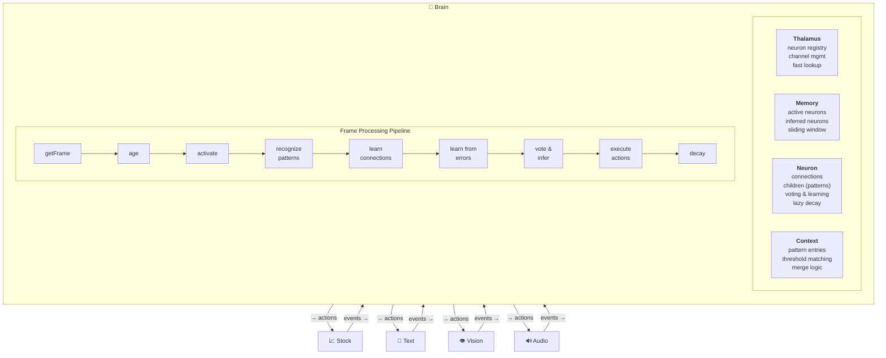
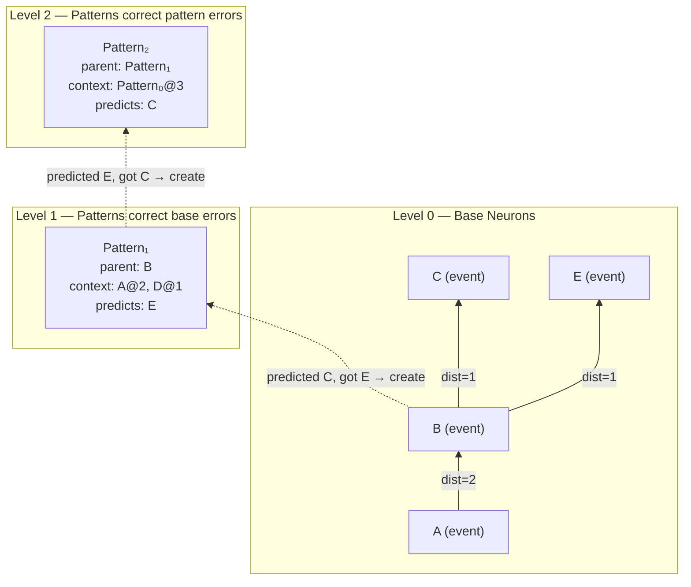

# Robot Brain

A hierarchical temporal neural network that learns patterns from raw sequential data, builds its own neuron hierarchy on demand, and makes predictions through a voting mechanism inspired by how neurons reach consensus.

No training epochs. No backpropagation. No labeled data.

You feed it streams of events — stock prices, text characters, sensor data — and it self-organizes. Neurons form, compete, decay, and die. The ones that make good predictions survive.

The brain core is implemented in Rust (with Rayon multi-threading) and exposed to Node.js via N-API. Python bindings are planned.

## How It Works

The brain is a **prediction machine**. Every neuron exists to predict what comes next. Learning happens when predictions fail.

### The Core Loop

Each frame, the brain:

1. **Observes** — receives events from input channels (prices, characters, pixels, etc.)
2. **Activates** — finds or creates neurons for the observations
3. **Recognizes** — checks if any learned patterns match the current context
4. **Learns connections** — strengthens links between co-occurring neurons
5. **Learns from errors** — when a confident prediction fails, creates a pattern to remember the context
6. **Votes** — all active neurons vote on what happens next, weighted by level and recency
7. **Acts** — executes the winning action predictions through output channels
8. **Decays** — unused connections and patterns weaken over time

### What Makes It Different

**Hierarchy emerges from failure.** When a base neuron's prediction fails, a level-1 pattern is created. When that pattern's prediction fails, a level-2 pattern is created. Abstraction isn't designed — it's earned.

**Voting enables consensus.** There's no central controller. Every active neuron contributes its prediction, weighted by its level in the hierarchy and how recently it was activated. Higher-level patterns carry more weight because they represent more context.

**Patterns override connections.** When a pattern activates on a parent neuron, it suppresses the parent's raw connection predictions. This is how the brain corrects itself — patterns exist specifically to fix prediction errors.

**Time is structural.** Temporal distance is encoded directly in connections. A connection doesn't just say "A predicts B" — it says "A predicts B at distance 3" (three frames later). This makes sequences first-class citizens.

**Multiple channels converge.** One data stream is mediocre. Many streams together is where it gets powerful — cross-modal patterns emerge naturally when multiple channels feed into the same brain.

## Quick Start

```bash
# Clone the repository
git clone https://github.com/cucar/robot_brain.git
cd robot_brain

# Install dependencies (pnpm workspace — links robot-brain into each app)
pnpm install
```

## Demo 1: Single-Channel Synthetic Cycle

A single-stock variant of the cycle test: one channel, a repeating 12-frame price/volume pattern, 20 repeats. Same idea as Demo 1 but isolated to a single channel so you can see the brain converge on optimal actions without multi-channel reinforcement doing any of the work.

```bash
node apps/stocks/jobs/synthetic-extended-test.js --error-mode static --error-threshold 0.3 --merge-threshold 0.9
```

**Expected output:**
```
Overall Optimal Rate: 233/240 = 97.1%
```

With the right thresholds the brain converges to 97%+ optimal action decisions on a single-channel cyclical pattern — confirming that hierarchy and action inference work without cross-channel consensus.

## Demo 2: Multi-Channel Synthetic Cycle

The brain learns to trade 3 stocks simultaneously (KGC, GLD, SPY), each as a separate channel. A repeating 12-day price cycle is presented 20 times — the brain discovers cross-stock patterns and converges on optimal buy/sell timing.

Run the multi-channel test with customized hyperparameters:

```bash
node apps/stocks/jobs/multi-channel-test.js --error-mode static --error-threshold 0.3 --merge-threshold 0.9
```

**Expected output:**
```
🎯 Overall Optimal Rate: 696/720 = 96.7%
```

The brain learns when to own vs. not own each stock based on upcoming price movements, achieving 96%+ optimal trade decisions across all three channels. This demonstrates how multiple input streams converge to improve inference — one of the architecture's core strengths.

## Demo 3: Stock Trading

The brain learns to trade stocks from historical price and volume data. Each stock is a separate channel — the brain discovers cross-stock patterns and makes buy/sell/hold decisions optimized by reward feedback.

**The included timeframe data is ready to use** — no API key needed for this demo.

```bash
node apps/stocks/jobs/test.js --symbols SO,VALE,STLD,GOOGL,MU,PLTR,UUUU,PFE,CRM,HAL,AWR,GM,EQIX,RTX,KGC,ALB,AAPL,CVX,HD,WPM,BEP,AREC,JNJ,SLB,PLD,EXK,NVDA,CAT,WFC,RGLD,WEAT,OXY,CEG,LOW,PAAS,MP,LMT,GS,COST,AG,TECK,MRK,INTC,BIP,PSA,DVN,AVAV,PEP,CDE,TSM --context-length 3 --max-positions 3 --transaction-cost 0.02 --columns 20 --spatial --spatial-error-mode conservative --spatial-merge-threshold 0.5 --temporal-error-mode static --temporal-error-threshold 0.4 --temporal-merge-threshold 0.9
```

**Expected output:**
```
🎯 Final Training Results (1 episodes):
============================================================
📈 Overall Performance:
   Starting Capital: $15000.00
   Total Net Profit: $22500477.56
   Average per Episode: $22500477.56
   Average ROI: +150003.18%
   Average Per-Frame ROI: +0.136216%
   Average Sharpe Ratio: 0.58
   Total Transaction Cost: $3034820.81 (0.02% per trade)
   Total Trades: 25999
   Average Trades per Episode: 25999.0

💰 Net Profit & ROI by Episode:
   Episode 1: $22500477.56 | ROI: +150003.18%, +0.136216%/frame, Sharpe: 0.58 (25999 trades)

📊 Base Level Accuracy by Episode:
   Episode 1: 43.43%
```

The complete frame-by-frame run log (all 5,373 days) is saved in [docs/demo3.log](docs/demo3.log).

The brain achieves only ~43% base-level prediction accuracy on price movements — below a coin flip — yet the 
**reward-weighted action selection** still turns a profit by learning which contexts produce better outcomes. With 
spatial co-activation enabled (`--spatial`), the brain trades direction accuracy for far more aggressive, 
concentrated position sizing: it is wrong about direction more often than not, but sizes the contexts that pay off.

> **Reading this number honestly.** The +150,003% headline is a *total* return over ~21 years of daily data
> (~5,370 frames) — it compounds to **roughly +42%/year**, strong but far less dramatic than the raw percentage
> looks. It is also measured on a *curated* 50-symbol universe of names that survived and performed well over the
> period (a survivorship bias), with low simulated friction and hyperparameters tuned in-sample. Crucially, the
> base accuracy is **below 50%** and most of the edge comes from large, concentrated bets on a handful of volatile,
> low-priced names — restrict the universe to stable, higher-priced names (e.g. via `--min-price 10`) and the
> headline collapses to a far more sober ~+20%/year. The big number is a high-variance, in-sample artifact, not a
> reliable forward return.
>
> A more rigorous measurement uses a neutral, sector-diversified universe and a proper train/test split — train on
> the first ~80% of history, then evaluate on the **held-out final ~4.3 years** the brain never trained on.
> Out-of-sample performance peaks at **two training passes**, returning **~+20%/year at a real Sharpe of ~0.76**;
> additional passes push in-sample return higher while held-out return decays (textbook overfitting). The execution
> path has no look-ahead — the brain decides and trades at each day's close and is scored by the next day's move.

### Brain P&L through the years

Plotted on a single axis, 21 years of compounding flatten the early years into an invisible sliver, so the
trajectory is broken into five windows (net profit is cumulative, from $0 on $15,000 of capital). The single most
useful thing to know when reading these charts is **what the brain is actually holding**: this universe is
dominated by uranium (`UUUU`), precious-metals and silver miners (`EXK`, `CDE`, `AG`, `AREC`, `PAAS`, `KGC`,
`WPM`, `RGLD`), and other materials/energy (`TECK`, `MP`, `ALB`, `HAL`, `SLB`, `OXY`, `DVN`), with cyclical
semiconductors (`MU`) and a few momentum names (`PLTR`, `NVDA`) layered on top. So the brain's P&L behaves far less
like the S&P 500 and far more like **a leveraged, concentrated bet on the commodity cycle** — and almost every bump
below lines up with a commodity boom, a commodity bust, or a single concentrated position.

**2005–2009 — learning, then the first reflation**


The brain starts tiny (a few hundred neurons) with small positions, so the 2007–2008 financial crisis barely
registers — there isn't much capital at risk yet. The first real gains come in 2009, when the post-crash reflation
lifts commodities and the brain's miners/uranium with them (~$0 → ~$110K).

**2010–2014 — supercycle peak, then the commodity bear**


2010–2011 rides the commodity *supercycle* (silver ran to ~$49 in 2011) up toward ~$320K. Then comes the stretch
that looks like underperformance but isn't the brain's fault: the **2012–2015 commodity bear market.** Gold fell
from ~$1,900 (2011) toward ~$1,050, silver collapsed from ~$49 to ~$15, and mining stocks were gutted — so a
miner-heavy book simply churns sideways for years (~$240K–$300K through 2012–2013) before a 2014 bounce. The flat
patch is the sector in a multi-year drawdown, not a learning failure.

**2015–2019 — the 2016 miner rally and the 2018 Micron spike**


Two distinct events. First, the sharp **2016 precious-metals rally** (gold/silver miners doubled off the late-2015
bottom) lifts the brain on `UUUU`/`EXK`/`AG`. Then the violent strike you can see late in the window: a concentrated
**Micron (`MU`)** position during the 2017–18 memory-chip supercycle (MU ran ~$12 → ~$60) spikes P&L to ~$2.9M —
which the Q4-2018 market crash and memory-cycle bust (MU back to ~$30) then erases, ending the window near $1.7M. A
textbook concentrated-cyclical round trip.

**2020–2024 — COVID, the reflation boom, then the AI-market lull**


The COVID crash dips it to ~$0.8M, then the 2020–2021 reflation/EV-materials boom drives a sharp recovery into
`PLTR` (post-IPO moonshot), `MP` (rare earth), and uranium. The **2023–2024 stretch looks flat** for a specific
reason: that was the "Magnificent-7" mega-cap-tech market, and a commodity-tilted book was on the wrong side of it —
gold was rangebound, energy fell from its 2022 highs, lithium/materials crashed. The brain only keeps pace because
of its AI-adjacent holdings (`PLTR`, `NVDA`, and `CEG` as a nuclear/AI-power play); the resource majority caps it,
so it grinds gently up toward the mid-single-digit millions instead of exploding.

**2025–2026 — everything fires, then gives back**


The window the whole basket was built for: in 2025 uranium ripped (`UUUU` ~$5 → ~$25), gold and silver printed
records, and `PLTR` went parabolic — all at once — carrying P&L to an all-time high near **$46.8M**, helped by a
giant `AREC` position (millions of shares of a sub-$1 stock, the penny-stock lottery ticket). Then it **gives back
to ~$22.5M**: the same concentrated 2025 winners (`PLTR`, `UUUU`, `CEG`) pull back into 2026, and a book this
concentrated halves on an ordinary sector retreat. The ending value is essentially wherever the last day lands in
that volatility — which is exactly why the headline is a high-variance artifact, not a steady-state return.

The throughline: the brain is doing real, learned position-taking, but what it has *learned to ride* is the
commodity/hard-asset cycle of this particular universe. Its best years are commodity bull markets (2009–2011, 2016,
2020–2021, 2025) and its worst are commodity bears and tech-led markets where resources lag (2012–2015, 2023–2024) —
amplified at every turn by concentrated sizing.

### Random Baseline Comparison

A natural worry about Demo 3 is that the result might come from a favorable data window rather than learned trading. To rule that out, the same job can be run with `--random-baseline`, which replaces the brain's action inference with a coin flip: 50% chance to be fully out, 50% chance to own one stock chosen uniformly at random. Everything else — the same data, same portfolio sizing, same execution path — is unchanged.

```bash
node apps/stocks/jobs/test.js --random-baseline
```

`--random-baseline` skips encoding, reward collection, and `brain.processFrame()` entirely, so the run is purely the trading harness driven by random signals — no shared work with the brain path.

**Example random-baseline run:**


Random coin-flips don't just underperform the brain — they *lose money*. A representative run ends at **−$1,839.36 (−12.26% ROI, Sharpe −0.19)** over the full 5,373 days: undirected exposure drifts up and down with whatever the basket does, pays transaction costs on every flip, and finishes underwater. The trajectory has no direction — it wanders and reverts, never making sustained new highs. Swap that random decision source for the brain — same data, same portfolio sizing, same execution path — and the result turns solidly positive.

This is the simplest sanity check that the brain is doing real work: identical harness, identical data, only the decision source changes — and one bleeds capital while the other compounds.

## Demo 4: Action Learning in Low Accuracy

The brain learns the best actions to perform in each situation over repeated episodes, even when base prediction accuracy is low.

Run the test:
```bash
node apps/stocks/jobs/test.js --symbols SO,VALE,STLD,GOOGL,MU,PLTR,UUUU,PFE,CRM,HAL --context-length 3 --columns 20 --no-summary --episodes 5 --spatial
```

**Expected output:**
```
💰 Net Profit & ROI by Episode:
   Episode 1: $6763932.45 | ROI: +45092.88%, +0.113847%/frame, Sharpe: 0.40 (8592 trades)
   Episode 2: $119125247028800.97 | ROI: +794168313525.34%, +0.425159%/frame, Sharpe: 1.66 (8591 trades)
   Episode 3: $1.2343509826638645e+25 | ROI: +8.22900655109243e+22%, +0.900351%/frame, Sharpe: 3.07 (8084 trades)
   Episode 4: $1.135473988104428e+28 | ROI: +7.569826587362853e+25%, +1.028586%/frame, Sharpe: 3.44 (7820 trades)
   Episode 5: $5.143569772643019e+29 | ROI: +3.4290465150953454e+27%, +1.100313%/frame, Sharpe: 3.68 (7728 trades)

📊 Base Level Accuracy by Episode:
   Episode 1: 10.51%
   Episode 2: 5.66%
   Episode 3: 7.31%
   Episode 4: 8.01%
   Episode 5: 8.65%
```

## Demo 5: Stock Sequence Memorization

The brain memorizes a repeating stock price sequence across 5 episodes, reaching 95%+ prediction accuracy. This demonstrates convergence on financial data — the same learning curve seen in text memorization.

Run the stock test with customized hyperparameters for sequence memorization:

```bash
node apps/stocks/jobs/test.js --no-summary --episodes 5 --symbols KGC,GOLD,SPY --context-length 3 --forget-rate 0.0005 --error-mode static --error-threshold 0.3
```

**Expected output:**
```
🎯 Final Training Results (5 episodes):
============================================================
📈 Overall Performance:
   Starting Capital: $15000.00
   Total Net Profit: $1.5513007606400312e+24
   Average per Episode: $3.1026015212800625e+23
   Average ROI: +2.0684010141867086e+21%
   Average Per-Frame ROI: +0.629456%
   Average Sharpe Ratio: 3.79
   Total Trades: 31372
   Average Trades per Episode: 6274.4

💰 Net Profit & ROI by Episode:
   Episode 1: $1065294.34 | ROI: +7101.96%, +0.079632%/frame, Sharpe: 0.37 (5850 trades)
   Episode 2: $615519461507821056.00 | ROI: +4103463076718807.00%, +0.585093%/frame, Sharpe: 3.67 (6461 trades)
   Episode 3: $2.876735760514998e+22 | ROI: +191782384034333196288.00%, +0.786582%/frame, Sharpe: 4.76 (6433 trades)
   Episode 4: $6.996816768276702e+23 | ROI: +4.664544512184468e+21%, +0.846464%/frame, Sharpe: 5.08 (6342 trades)
   Episode 5: $8.228511106877497e+23 | ROI: +5.485674071251665e+21%, +0.849508%/frame, Sharpe: 5.06 (6286 trades)

📊 Base Level Accuracy by Episode:
   Episode 1: 52.47%
   Episode 2: 55.46%
   Episode 3: 58.72%
   Episode 4: 59.81%
   Episode 5: 60.33%
```

The brain goes from 50% accuracy (random) to 60% in 5 episodes on 3 stocks × 5300 frames of real market data. 
The low forget rate allows patterns to survive the full sequence. Short context (3 frames) needed because of computation limitations.

## Demo 6: Text Sequence Learning

The brain learns to predict character sequences. Feed it a string, and it memorizes the pattern — reaching ~99.94% prediction accuracy within two episodes and staying flat there.

Run the text test with customized hyperparameters for text learning (the defaults are tuned for stock data):

```bash
node apps/text/jobs/test.js --file abramov.txt --error-mode static --error-threshold 0.3 --context-length 20 --merge-threshold 0.9 --forget-rate 0.00003 --no-summary
```

**Expected output:**
```
📊 Accuracy by Episode:
   Episode 1: 27.81% (32674 frames)
   Episode 2: 99.96% (32674 frames)
   Episode 3: 99.96% (32674 frames)
   Episode 4: 99.96% (32674 frames)
   Episode 5: 99.96% (32674 frames)
```

The brain goes from low accuracy to ~99.96% in two episodes and holds there — it has fully memorized the character sequence except for the first ~20 characters at the start of each episode. Those leading characters can't be predicted because the brain hasn't seen any context yet — it needs a `context-length` window of prior characters in memory before it can recognize patterns and cast votes. The "warmup" frames at the head of each episode are a structural property of context-based prediction, not a learning failure: every character past the warmup window is predicted correctly.

## Demo 7: MNIST Digit Classification (Naive Bayes Baseline)

A sensory-only MNIST classifier built on the brain's count-based voting. One channel per pixel position (retinotopic, 784 channels at 28×28), all firing concurrently in a single frame per image. Supervision lands on a separate `digit` action channel via `brain.learn()`. With `patternForgetRate=0` and a constant reward of 1, the brain's per-voter consensus reduces to a Naive Bayes posterior — every `learn()` call increments per-pixel-per-digit counts, and inference picks the argmax.

Download the MNIST data first (one-time, ~11 MB into `apps/mnist/data/`):

```bash
node apps/mnist/jobs/download.js
```

This fetches the four standard IDX files (60k training, 10k test, gzipped) from Google's MNIST mirror. The job skips files that already exist, so it's safe to re-run.

Then run the MNIST test:

```bash
node apps/mnist/jobs/test.js --image-size 14 --buckets 2 --columns 20 --per-class 0 --max-test-images 0 --episodes 1 --error-mode static --error-threshold 0.1 --merge-threshold 0.9
```

**Expected output:**
```
MNIST — sensory-only (Naive Bayes) baseline
  Image size: 14×14 (196 channels)
  Buckets: 2 (Phase A — binary)
  Context length: 1
  Forget rate: 0
  Consensus: nb
  Episodes: 1
  Training: balanced,
  Test images: all

  Balanced training set built: 5421 per class × 10 = 54210 total
  Episode 1/1: train=92.85% (50332/54210) | 130 img/s 418150ms | 0:96% 1:98% 2:93% 3:93% 4:92% 5:86% 6:96% 7:94% 8:89% 9:91%
    ↳ spatial: depth=1 | L1:31834 | 31834 active, 31834 minted cum | 32202 neurons

  Test: 94.88% (9488/10000) 51638ms | 0:98% 1:98% 2:94% 3:95% 4:95% 5:94% 6:96% 7:92% 8:93% 9:93%

Results
======================================================================
  Episode 1: train=92.85% (418150ms)

  Spatial hierarchy (after each episode):
    Episode 1: depth=1 | L1:31834 | 31834 active, 31834 minted cum | 32202 neurons
  Test:     94.88% (9488/10000)

  Confusion (rows = actual, cols = predicted):
           0    1    2    3    4    5    6    7    8    9
   0     960    0    0    1    0    5    6    1    7    0
   1       0 1116    3    3    0    0    5    0    8    0
   2      10    1  971    7    7    1    2    8   24    1
   3       1    0   11  955    0   15    0   12   11    5
   4       0    2    2    0  935    0   10    0    3   30
   5       5    3    0   20    1  840    8    2    8    5
   6       7    4    1    0    4   16  919    0    7    0
   7       1   17   17    2    5    0    0  944    7   35
   8      11    0    3   16    5    8    5    6  910   10
   9      10    7    2    7   18    6    0   10   11  938
======================================================================

⏱️  Total Execution Time: 7m 50s
```

94.88% test accuracy from a single training pass. The confusion matrix errors are digits whose pixel-level marginals overlap heavily. 
Class-balanced training is helps here - when trained on full data, the result is 94.56%.

### Downloading Fresh Stock Data

To download new data or different timeframes, you need a free [Alpaca](https://alpaca.markets) account:

1. Sign up at [alpaca.markets](https://alpaca.markets) (free paper trading account)
2. Get your API key and secret from the dashboard
3. Copy `apps/stocks/.env.example` to `apps/stocks/.env` and fill in your credentials:
   ```
   ALPACA_KEY_ID=your_key_here
   ALPACA_SECRET_KEY=your_secret_here
   ```
4. Download data (Alpaca, or `download-yahoo.js` for longer daily history):
   ```bash
   node apps/stocks/jobs/download-alpaca.js --timeframe 3H
   ```
5. Process downloaded data into training files:
   ```bash
   node apps/stocks/jobs/setup.js --timeframe 3H
   ```
6. Run the training job:
   ```bash
   node apps/stocks/jobs/test.js --timeframe 3H
   ```

## Architecture


```mermaid
graph TB
    subgraph Brain["🧠 Brain"]
        direction TB
        subgraph Components[" "]
            direction LR
            TH["<b>Thalamus</b><br/>neuron registry<br/>channel mgmt<br/>fast lookup"]
            MEM["<b>Memory</b><br/>active neurons<br/>inferred neurons<br/>sliding window"]
            NEU["<b>Neuron</b><br/>connections<br/>children (patterns)<br/>voting & learning<br/>lazy decay"]
            CTX["<b>Context</b><br/>pattern entries<br/>threshold matching<br/>merge logic"]
        end
        subgraph Pipeline["Frame Processing Pipeline"]
            direction LR
            P1["getFrame"] --> P2["age"] --> P3["activate"] --> P4["recognize<br/>patterns"]
            P4 --> P5["learn<br/>connections"] --> P6["learn from<br/>errors"] --> P7["vote &<br/>infer"]
            P7 --> P8["execute<br/>actions"] --> P9["decay"]
        end
    end
    CH1["📈 Stock"] -- "events →" --> Brain
    CH2["📝 Text"] -- "events →" --> Brain
    CH3["👁 Vision"] -- "events →" --> Brain
    CH4["🔊 Audio"] -- "events →" --> Brain
    Brain -- "→ actions" --> CH1
    Brain -- "→ actions" --> CH2
    Brain -- "→ actions" --> CH3
    Brain -- "→ actions" --> CH4
```

### How Hierarchy Emerges


```mermaid
graph BT
    subgraph L0["Level 0 — Base Neurons"]
        A["A (event)"]
        B["B (event)"]
        C["C (event)"]
        E["E (event)"]
    end
    subgraph L1["Level 1 — Patterns correct base errors"]
        P1["Pattern₁<br/>parent: B<br/>context: A@2, D@1<br/>predicts: E"]
    end
    subgraph L2["Level 2 — Patterns correct pattern errors"]
        P2["Pattern₂<br/>parent: Pattern₁<br/>context: Pattern₀@3<br/>predicts: C"]
    end
    A -- "dist=2" --> B
    B -- "dist=1" --> C
    B -- "dist=1" --> E
    B -. "predicted C, got E → create" .-> P1
    P1 -. "predicted E, got C → create" .-> P2
```

### Core Components

The brain core is a Rust workspace (`brain/`) with two crates:

| Crate / File | Role | Description |
|------|------|-------------|
| `brain-core/src/brain.rs` | Orchestrator | Frame processing loop, pattern recognition, learning, inference |
| `brain-core/src/thalamus.rs` | Relay station | Neuron registry, channel management, dimension mappings, quantizer |
| `brain-core/src/region.rs` | Parallelism | Column partitioner, Rayon-based multi-threaded dispatch |
| `brain-core/src/column.rs` | Worker | Owns a neuron partition, batch operations (becomes a thread in multi-column mode) |
| `brain-core/src/memory.rs` | Short-term memory | Temporal sliding window of active neurons indexed by age |
| `brain-core/src/neuron.rs` | Neuron | Connections, routing table, voting, learning, lazy decay |
| `brain-core/src/context.rs` | Pattern context | Context representation, threshold-based matching, merge logic |
| `brain-core/src/quantizer.rs` | Quantization | Scalar-to-bucket discretization (static, dynamic, passthrough) |
| `brain-core/src/backup.rs` | Persistence | File-based backup/restore (CSVs under `<jobDir>/backups/<label>/`) |
| `brain-core/src/diagnostics.rs` | Metrics | Accuracy tracking and continuous error measurement |
| `brain-napi/` | N-API bridge | Exposes Rust Brain as a native Node.js addon |
| `libs/node` | Node bindings | Re-exports the native addon + Job runner; published to npm as `robot-brain` |

### Apps

Each app owns an encoder (and optionally a trader) that describes its channels to the brain via a spec (`registerChannelSpec`). The spec lists the channel's dimensions, their bucket resolutions, and whether each dim is an input (event) or output (action). Base neurons carry exactly one `(dimId, bucketId)` pair — multi-dim observations emit multiple base neurons per frame.

| App | Inputs (Events) | Outputs (Actions) | Reward Signal |
|-----|-----------------|-------------------|---------------|
| `apps/stocks` | One neuron per dim: price change, volume change | One neuron: position (own/out) | Profit/loss |
| `apps/text`   | One neuron: character code | — | — |
| `apps/db`     | MySQL utilities (import/export) — not a brain channel; loads/exports backup folders for analysis | — | — |

### Jobs

Jobs define learning scenarios — which encoders to register, how to configure them, and how to run episodes:

| Job | Description |
|-----|-------------|
| `apps/stocks/jobs/test.js` | Multi-stock trading with historical data |
| `apps/stocks/jobs/multi-channel-test.js` | Multi-symbol trading across shared brain |
| `apps/stocks/jobs/synthetic-cycle-test.js` | Cycle-learning synthetic stress test |
| `apps/stocks/jobs/synthetic-extended-test.js` | Extended cycle synthetic with optimality analysis |
| `apps/text/jobs/test.js` | Character sequence memorization (default `data/test.txt`; override with `--file`) |
| `apps/db/import.js` | Bulk-load a backup folder into MySQL via `LOAD DATA LOCAL INFILE` |
| `apps/db/export.js` | Dump current MySQL state to `./backups/<timestamp>/` in cwd |

## Hyperparameters

All hyperparameters are configured via the Brain constructor options and can be passed as command-line arguments:

| Parameter | Default | Command Line Option | Description |
|-----------|---------|---------------------|-------------|
| `errorCorrectionMode` | `'conservative'` | `--error-mode` | Threshold function for creating correction patterns: `static` (fixed), `conservative` (mean + σ — learn outliers), `neutral` (mean), `aggressive` (mean − σ — memorize aggressively). Per-(neuron, age) error rate stats are tracked online via Welford's algorithm. |
| `errorCorrectionThreshold` | 0.5 | `--error-threshold` | When `errorCorrectionMode='static'`, the fixed prediction error threshold. For dynamic modes, the warmup fallback used until 3 samples have been observed at a given (neuron, age) pair. |
| `contextLength` | 10 | `--context-length` | Frames a neuron stays active in the sliding window |
| `mergeThreshold` | 0.5 | `--merge-threshold` | Min context match ratio for pattern recognition |
| `patternForgetRate` | 0.01 | `--forget-rate` | Pattern prediction decay rate per frame |

## Command Line Options

```bash
node <path-to-job.js> [options]
```

| Option | Description |
|--------|-------------|
| `--timeframe <tf>` | Data timeframe for stock jobs (e.g., `1D`, `1H`, `3H`, `1Min`) |
| `--episodes <n>` | Number of training episodes |
| `--holdout <n>` | Hold out last N rows from training |
| `--offset <n>` | Skip first N rows |
| `--symbols <list>` | Comma-separated list of stock tickers (e.g. `KGC,GLD,SPY`) |
| `--max-positions <n>`| Maximum number of stock positions to hold at once |
| `--max-price <n>` | Maximum price limit for stocks |
| `--initial-capital <n>`| Starting capital for the portfolio |
| `--transaction-cost <n>`| Simulated transaction cost per trade, as a percentage (e.g. `0.01` = 0.01%). Buys pay more, sells receive less. Reports total cost at end of run |
| `--context-length <n>`| Sliding window size (frames) |
| `--forget-rate <n>` | Pattern activation decay rate per frame |
| `--error-mode <m>` | Error-correction threshold mode: `static`, `conservative`, `neutral`, `aggressive` |
| `--error-threshold <n>`| Static threshold value (when mode=`static`); warmup fallback for dynamic modes |
| `--merge-threshold <n>`| Threshold for pattern context matching |
| `--debug` | Show detailed frame-by-frame processing |
| `--diagnostic` | Show inference and conflict resolution details |
| `--save-brain <label>` | Save a CSV backup on shutdown (incl. crash) under `<jobDir>/backups/<label>/` |
| `--load-brain <label>` | Load a labeled backup before the first frame (errors if none exists) |
| `--save-context <label>` | Save the memory context window on shutdown under `<jobDir>/contexts/<label>/` |
| `--load-context <label>` | Restore the memory context window (active neurons, votes, rewards) |
| `--save-session <label>` | Save trader/portfolio state on shutdown under `<jobDir>/sessions/<label>/` |
| `--load-session <label>` | Restore trader/portfolio state (positions, cash, prices) |
| `--no-summary` | Suppress per-frame summary output |
| `--start <date>` | Start date for data (YYYY-MM-DD) |
| `--end <date>` | End date for data (YYYY-MM-DD) |
| `--random-baseline` | Skip the brain entirely; pick own/out + symbol uniformly at random (sanity-check baseline for stock test) |

## Creating Custom Jobs

```javascript
import { Job, runJob } from 'robot-brain';
import { TextEncoder } from '../encoder.js';

export default class MyJob extends Job {

    constructor() {
        super();
        this.encoders = [];
    }

    async initialize() {
        const encoder = new TextEncoder('text');
        const ids = this.brain.registerChannelSpec(encoder.getChannelSpec());
        encoder.bindIds(ids);
        this.encoders.push(encoder);
    }

    async configureChannels() {
        for (const encoder of this.encoders) encoder.setData('hello world');
    }

    async executeJob() {
        this.brain.resetContext();
        while (true) {
            const inputs = new Map();
            let any = false;
            for (const encoder of this.encoders) {
                const frame = encoder.nextFrame();
                if (!frame) continue;
                any = true;
                inputs.set(encoder.channelId, encoder.encode(frame));
            }
            if (!any) break;
            this.brain.processFrame(inputs, new Map());
        }
    }

    async showResults() {
        console.log(this.brain.getEpisodeSummary());
    }
}

await runJob(import.meta, MyJob);
```

Save as `apps/text/jobs/my-job.js` and run with `node apps/text/jobs/my-job.js`.

## Documentation

- **[Architecture Design](docs/architecture.md)** — detailed design document covering voting, patterns, frame processing, and data structures
- **[Error-Driven Learning](docs/error-driven-learning.md)** — deep dive on how patterns are created from prediction errors
- **[Technical Foundations](docs/TECHNICAL_FOUNDATIONS.md)** — architectural ideas, biological inspirations, and comparison with conventional approaches
- **[Hippocampus Design](docs/hippocampus.md)** — design and implementation plan for the hippocampal region (long-term memory, thinking, metacognition)
- **[Future Work](docs/future-work.md)** — MNIST benchmarks, Python bindings, MPI distribution, and other planned work

## Persistence

The brain runs entirely in-memory. Three labeled save/load pairs let you snapshot
and resume across sessions:

| Pair | What it persists | Storage path |
|------|-----------------|--------------|
| `--save-brain` / `--load-brain` | Learned neurons and connections | `<jobDir>/backups/<label>/` |
| `--save-context` / `--load-context` | Memory context window (active neurons, votes, rewards) | `<jobDir>/contexts/<label>/` |
| `--save-session` / `--load-session` | Trader/portfolio state (positions, cash, prices) | `<jobDir>/sessions/<label>/` |

```bash
# Run the first half and save everything
node apps/stocks/jobs/test.js --episodes 1 --frames 1250 --save-brain day1 --save-context day1 --save-session day1

# Resume from where we left off
node apps/stocks/jobs/test.js --episodes 1 --offset 1251 --load-brain day1 --load-context day1 --load-session day1
```

Each save is a folder of CSVs under the label you choose. Brain backups are also
written on crash (uncaught error / SIGINT) when `--save-brain` is set.

For MySQL-based analysis tooling — bulk-loading a backup into a queryable database
or exporting MySQL state back to a backup folder — see the [`apps/db`](apps/db)
app. It is not part of the brain core; the brain has no DB dependency.

### Backup → MySQL → Backup Round-Trip

Take a backup, push it through MySQL, pull it back out, and verify the rehydrated
brain reproduces the same result. Uses the Demo 6 stock sequence memorization
config (KGC,GLD,SPY) — a single episode here ends around `$22,675,481.59`.

```bash
# 1. Run one episode and save a backup
node apps/stocks/jobs/test.js --no-summary --symbols KGC,GOLD,SPY --context-length 3 --error-mode static --error-threshold 0.3 --forget-rate 0.001 --save-brain roundtrip

# 2. Import that backup folder into MySQL
node apps/db/import.js apps/stocks/jobs/test/backups/roundtrip

# 3. Delete the original backup, then export MySQL back to the same label
Remove-Item -Recurse -Force apps/stocks/jobs/test/backups/roundtrip
node apps/db/export.js apps/stocks/jobs/test/backups/roundtrip

# 4. Load the round-tripped backup and run another episode — should reach
#    ~$8,441,629.32, matching what a continuous two-episode run produces
node apps/stocks/jobs/test.js --no-summary --symbols KGC,GOLD,SPY --context-length 3 --error-mode static --error-threshold 0.3 --forget-rate 0.001 --load-brain roundtrip
```

The `apps/db` import uses `LOAD DATA LOCAL INFILE`, which needs `local_infile=ON`
server-side; the import script enables it automatically (`SET GLOBAL local_infile = 1`)
as long as the connecting user has `SYSTEM_VARIABLES_ADMIN` (or `SUPER` on older
MySQL) — root has this by default. DB credentials live in [`apps/db/.env`](apps/db/.env.example).

## License

Copyright 2025-2026 Cagdas Ucar. Licensed under the [Apache License 2.0](LICENSE).
