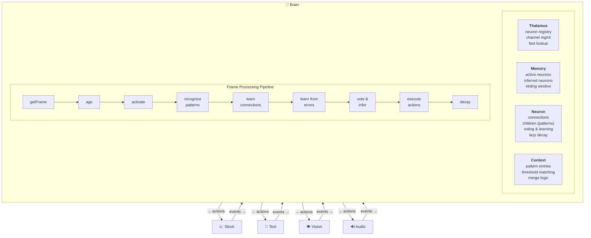
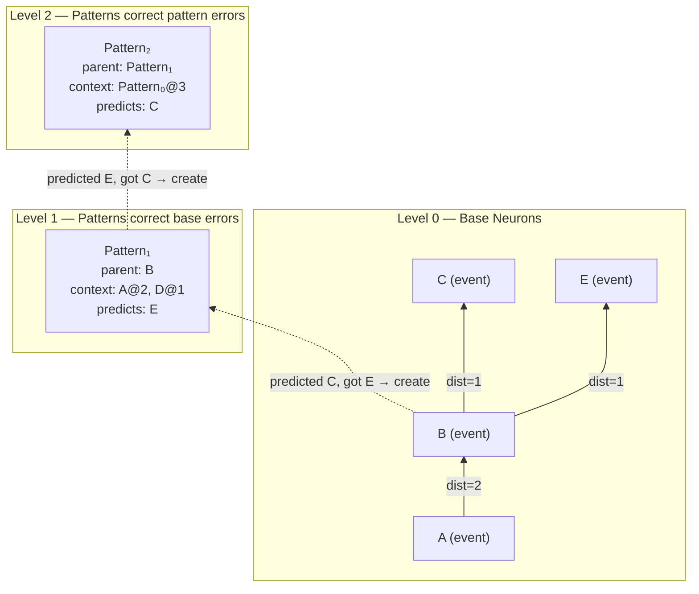

# Robot Brain

A hierarchical temporal neural network that learns patterns from raw sequential data, builds its own neuron hierarchy on demand, and makes predictions through a voting mechanism inspired by how neurons reach consensus.

No training epochs. No backpropagation. No labeled data.

You feed it streams of events — stock prices, text characters, sensor data — and it self-organizes. Neurons form, compete, decay, and die. The ones that make good predictions survive.

This is the Node.js reference implementation. A high-performance C++ core with Python and Node.js bindings is in development.

## How It Works

The brain is a **prediction machine**. Every neuron exists to predict what comes next. Learning happens when predictions fail.

### The Core Loop

Each frame, the brain:

1. **Observes** — receives events from input channels (prices, characters, pixels, etc.)
2. **Activates** — finds or creates neurons for the observations
3. **Recognizes** — checks if any learned patterns match the current context
4. **Learns connections** — strengthens links between co-occurring neurons
5. **Learns from errors** — when a confident prediction fails, creates a pattern to remember the context
6. **Votes** — all active neurons vote on what happens next, weighted by level and recency
7. **Acts** — executes the winning action predictions through output channels
8. **Decays** — unused connections and patterns weaken over time

### What Makes It Different

**Hierarchy emerges from failure.** When a base neuron's prediction fails, a level-1 pattern is created. When that pattern's prediction fails, a level-2 pattern is created. Abstraction isn't designed — it's earned.

**Voting enables consensus.** There's no central controller. Every active neuron contributes its prediction, weighted by its level in the hierarchy and how recently it was activated. Higher-level patterns carry more weight because they represent more context.

**Patterns override connections.** When a pattern activates on a parent neuron, it suppresses the parent's raw connection predictions. This is how the brain corrects itself — patterns exist specifically to fix prediction errors.

**Time is structural.** Temporal distance is encoded directly in connections. A connection doesn't just say "A predicts B" — it says "A predicts B at distance 3" (three frames later). This makes sequences first-class citizens.

**Multiple channels converge.** One data stream is mediocre. Many streams together is where it gets powerful — cross-modal patterns emerge naturally when multiple channels feed into the same brain.

## Quick Start

```bash
# Clone the repository
git clone https://github.com/cucar/robot_brain.git
cd robot_brain

# Install dependencies (pnpm workspace — links robot-brain into each app)
pnpm install
```

## Demo 1: Single-Channel Synthetic Cycle

A single-stock variant of the cycle test: one channel, a repeating 12-frame price/volume pattern, 20 repeats. Same idea as Demo 1 but isolated to a single channel so you can see the brain converge on optimal actions without multi-channel reinforcement doing any of the work.

```bash
node apps/stocks/jobs/synthetic-extended-test.js --error-mode static --error-threshold 0.3 --merge-threshold 0.9
```

**Expected output:**
```
Overall Optimal Rate: 233/240 = 97.1%
```

With the right thresholds the brain converges to 97%+ optimal action decisions on a single-channel cyclical pattern — confirming that hierarchy and action inference work without cross-channel consensus.

## Demo 2: Multi-Channel Synthetic Cycle

The brain learns to trade 3 stocks simultaneously (KGC, GLD, SPY), each as a separate channel. A repeating 12-day price cycle is presented 20 times — the brain discovers cross-stock patterns and converges on optimal buy/sell timing.

Run the multi-channel test with customized hyperparameters:

```bash
node apps/stocks/jobs/multi-channel-test.js --error-mode static --error-threshold 0.3 --merge-threshold 0.9
```

**Expected output:**
```
🎯 Overall Optimal Rate: 96.5%
```

The brain learns when to own vs. not own each stock based on upcoming price movements, achieving 96%+ optimal trade decisions across all three channels. This demonstrates how multiple input streams converge to improve inference — one of the architecture's core strengths.

## Demo 3: Stock Trading

The brain learns to trade stocks from historical price and volume data. Each stock is a separate channel — the brain discovers cross-stock patterns and makes buy/sell/hold decisions optimized by reward feedback.

**The included 3-hour timeframe data is ready to use** — no API key needed for this demo.
**Using high error correction threshold to be able to quickly stabilize the patterns and get higher returns.

```bash
node apps/stocks/jobs/test.js
```

**Expected output:**
```
Final Training Results (1 episodes):
============================================================
📈 Overall Performance:
   Starting Capital: $15000.00
   Total Net Profit: $66575.27
   Average per Episode: $66575.27
   Average ROI: +443.84%
   Average Per-Frame ROI: +0.067627%
   Total Trades: 2257
   Average Trades per Episode: 2257.0

💰 Net Profit & ROI by Episode:
   Episode 1: $66575.27 | ROI: +443.84%, +0.067627%/frame (2257 trades)

📊 Base Level Accuracy by Episode:
   Episode 1: 56.97%
```

The brain achieves 56% base-level prediction accuracy on price movements (which is expected — markets are noisy), but the **reward-weighted action selection** turns that into profitable trading by learning which contexts produce better outcomes.

## Demo 4: Action Learning in Low Accuracy

The brain learns the best actions to perform in each situation over repeated episodes, even when base prediction accuracy is low.

Run the test:
```bash
node apps/stocks/jobs/test.js --no-summary --episodes 5
```

**Expected output:**
```
💰 Net Profit & ROI by Episode:
   Episode 1: $66575.27 | ROI: +443.84%, +0.067627%/frame (2257 trades)
   Episode 2: $566290.43 | ROI: +3775.27%, +0.146103%/frame (1565 trades)
   Episode 3: $5205145.07 | ROI: +34700.97%, +0.233895%/frame (3647 trades)
   Episode 4: $4538587.37 | ROI: +30257.25%, +0.228429%/frame (4217 trades)
   Episode 5: $10599480.49 | ROI: +70663.20%, +0.262296%/frame (3851 trades)

📊 Base Level Accuracy by Episode:
   Episode 1: 56.97%
   Episode 2: 57.76%
   Episode 3: 58.31%
   Episode 4: 58.64%
   Episode 5: 58.77%
```

## Demo 5: Stock Sequence Memorization

The brain memorizes a repeating stock price sequence across 5 episodes, reaching 95%+ prediction accuracy. This demonstrates convergence on financial data — the same learning curve seen in text memorization.

Run the stock test with customized hyperparameters for sequence memorization:

```bash
node apps/stocks/jobs/test.js --no-summary --episodes 5 --symbols KGC,GLD,SPY --context-length 3 --forget-rate 0.001 --error-mode static --error-threshold 0.3
```

**Expected output:**
```
🎯 Final Training Results (5 episodes):
============================================================
📈 Overall Performance:
   Starting Capital: $15000.00
   Total Net Profit: $1472265729577.45
   Average per Episode: $294453145915.49
   Average ROI: +1963020972.77%
   Average Per-Frame ROI: +0.457990%
   Total Trades: 14207
   Average Trades per Episode: 2841.4

💰 Net Profit & ROI by Episode:
   Episode 1: $18933.81 | ROI: +126.23%, +0.032595%/frame (3176 trades)
   Episode 2: $22675481.59 | ROI: +151169.88%, +0.292709%/frame (2998 trades)
   Episode 3: $21427022933.80 | ROI: +142846819.56%, +0.567356%/frame (2712 trades)
   Episode 4: $267523297963.51 | ROI: +1783488653.09%, +0.668760%/frame (2696 trades)
   Episode 5: $1183292714264.74 | ROI: +7888618095.10%, +0.728530%/frame (2625 trades)

📊 Base Level Accuracy by Episode:
   Episode 1: 58.66%
   Episode 2: 70.56%
   Episode 3: 84.66%
   Episode 4: 89.79%
   Episode 5: 91.40%
```

The brain goes from 50% accuracy (random) to 96% in 5 episodes on 3 stocks × 2505 frames of real market data. With more episodes it continues climbing toward 99%+. The low forget rate (0.0001) allows patterns to survive the full 2505-frame sequence, and the short context (3 frames) reduces noise from coincidental connections.

## Demo 6: Text Sequence Learning

The brain learns to predict character sequences. Feed it a string, and it memorizes the pattern — reaching 100% prediction accuracy within a few episodes.

Run the text test with customized hyperparameters for text learning (the defaults are tuned for stock data):

```bash
node apps/text/jobs/test.js --file abramov.txt --error-mode static --error-threshold 0.3 --context-length 20 --merge-threshold 0.9 --forget-rate 0.001 --no-summary
```

**Expected output:**
```
📊 Accuracy by Episode:
   Episode 1: 20.56% (32674 frames)
   Episode 2: 99.96% (32674 frames)
   Episode 3: 99.99% (32674 frames)
   Episode 4: 100.00% (32674 frames)
   Episode 5: 100.00% (32674 frames)
```

The brain goes from low accuracy to 100% in 5 episodes — it has fully memorized the character sequence and can predict every next character correctly.

### Downloading Fresh Stock Data

To download new data or different timeframes, you need a free [Alpaca](https://alpaca.markets) account:

1. Sign up at [alpaca.markets](https://alpaca.markets) (free paper trading account)
2. Get your API key and secret from the dashboard
3. Copy `apps/stocks/.env.example` to `apps/stocks/.env` and fill in your credentials:
   ```
   ALPACA_KEY_ID=your_key_here
   ALPACA_SECRET_KEY=your_secret_here
   ```
4. Download data:
   ```bash
   node apps/stocks/jobs/download.js --timeframe 3H
   ```
5. Process downloaded data into training files:
   ```bash
   node apps/stocks/jobs/setup.js --timeframe 3H
   ```
6. Run the training job:
   ```bash
   node apps/stocks/jobs/test.js --timeframe 3H
   ```

## Architecture


```mermaid
graph TB
    subgraph Brain["🧠 Brain"]
        direction TB
        subgraph Components[" "]
            direction LR
            TH["<b>Thalamus</b><br/>neuron registry<br/>channel mgmt<br/>fast lookup"]
            MEM["<b>Memory</b><br/>active neurons<br/>inferred neurons<br/>sliding window"]
            NEU["<b>Neuron</b><br/>connections<br/>children (patterns)<br/>voting & learning<br/>lazy decay"]
            CTX["<b>Context</b><br/>pattern entries<br/>threshold matching<br/>merge logic"]
        end
        subgraph Pipeline["Frame Processing Pipeline"]
            direction LR
            P1["getFrame"] --> P2["age"] --> P3["activate"] --> P4["recognize<br/>patterns"]
            P4 --> P5["learn<br/>connections"] --> P6["learn from<br/>errors"] --> P7["vote &<br/>infer"]
            P7 --> P8["execute<br/>actions"] --> P9["decay"]
        end
    end
    CH1["📈 Stock"] -- "events →" --> Brain
    CH2["📝 Text"] -- "events →" --> Brain
    CH3["👁 Vision"] -- "events →" --> Brain
    CH4["🔊 Audio"] -- "events →" --> Brain
    Brain -- "→ actions" --> CH1
    Brain -- "→ actions" --> CH2
    Brain -- "→ actions" --> CH3
    Brain -- "→ actions" --> CH4
```

### How Hierarchy Emerges


```mermaid
graph BT
    subgraph L0["Level 0 — Base Neurons"]
        A["A (event)"]
        B["B (event)"]
        C["C (event)"]
        E["E (event)"]
    end
    subgraph L1["Level 1 — Patterns correct base errors"]
        P1["Pattern₁<br/>parent: B<br/>context: A@2, D@1<br/>predicts: E"]
    end
    subgraph L2["Level 2 — Patterns correct pattern errors"]
        P2["Pattern₂<br/>parent: Pattern₁<br/>context: Pattern₀@3<br/>predicts: C"]
    end
    A -- "dist=2" --> B
    B -- "dist=1" --> C
    B -- "dist=1" --> E
    B -. "predicted C, got E → create" .-> P1
    P1 -. "predicted E, got C → create" .-> P2
```

### Core Components

| File | Role | Description |
|------|------|-------------|
| `brain/src/brain.js` | Orchestrator | Frame processing loop, pattern recognition, learning, inference |
| `brain/src/thalamus.js` | Relay station | Neuron registry, channel management, dimension mappings |
| `brain/src/memory.js` | Short-term memory | Temporal sliding window of active neurons indexed by age |
| `brain/src/neuron.js` | Neuron | Connections, patterns, voting, learning, lazy decay |
| `brain/src/context.js` | Pattern context | Context representation, threshold-based matching, merge logic |
| `brain/src/backup.js` | Persistence | File-based backup/restore (CSVs under `<jobDir>/backups/<timestamp>/`) |
| `brain/src/diagnostics.js` | Metrics | Performance tracking and debug output |
| `libs/node` | Node bindings | Re-exports the brain core + Job runner; published to npm as `robot-brain` |

### Apps

Each app owns an encoder (and optionally a trader) that describes its channels to the brain via a spec (`registerChannelSpec`). The spec lists the channel's dimensions, their bucket resolutions, and whether each dim is an input (event) or output (action). Base neurons carry exactly one `(dimId, bucketId)` pair — multi-dim observations emit multiple base neurons per frame.

| App | Inputs (Events) | Outputs (Actions) | Reward Signal |
|-----|-----------------|-------------------|---------------|
| `apps/stocks` | One neuron per dim: price change, volume change | One neuron: position (own/out) | Profit/loss |
| `apps/text`   | One neuron: character code | — | — |
| `apps/db`     | MySQL utilities (import/export) — not a brain channel; loads/exports backup folders for analysis | — | — |

### Jobs

Jobs define learning scenarios — which encoders to register, how to configure them, and how to run episodes:

| Job | Description |
|-----|-------------|
| `apps/stocks/jobs/test.js` | Multi-stock trading with historical data |
| `apps/stocks/jobs/multi-channel-test.js` | Multi-symbol trading across shared brain |
| `apps/stocks/jobs/synthetic-cycle-test.js` | Cycle-learning synthetic stress test |
| `apps/stocks/jobs/synthetic-extended-test.js` | Extended cycle synthetic with optimality analysis |
| `apps/text/jobs/test.js` | Character sequence memorization (default `data/test.txt`; override with `--file`) |
| `apps/db/import.js` | Bulk-load a backup folder into MySQL via `LOAD DATA LOCAL INFILE` |
| `apps/db/export.js` | Dump current MySQL state to `./backups/<timestamp>/` in cwd |

## Hyperparameters

All hyperparameters are configured via the Brain constructor options and can be passed as command-line arguments:

| Parameter | Default | Command Line Option | Description |
|-----------|---------|---------------------|-------------|
| `errorCorrectionMode` | `'conservative'` | `--error-mode` | Threshold function for creating correction patterns: `static` (fixed), `conservative` (mean + σ — learn outliers), `neutral` (mean), `aggressive` (mean − σ — memorize aggressively). Per-(neuron, age) error rate stats are tracked online via Welford's algorithm. |
| `errorCorrectionThreshold` | 0.5 | `--error-threshold` | When `errorCorrectionMode='static'`, the fixed prediction error threshold. For dynamic modes, the warmup fallback used until 3 samples have been observed at a given (neuron, age) pair. |
| `contextLength` | 10 | `--context-length` | Frames a neuron stays active in the sliding window |
| `mergeThreshold` | 0.5 | `--merge-threshold` | Min context match ratio for pattern recognition |
| `patternForgetRate` | 0.01 | `--forget-rate` | Pattern prediction decay rate per frame |

## Command Line Options

```bash
node <path-to-job.js> [options]
```

| Option | Description |
|--------|-------------|
| `--timeframe <tf>` | Data timeframe for stock jobs (e.g., `1D`, `1H`, `3H`, `1Min`) |
| `--episodes <n>` | Number of training episodes |
| `--holdout <n>` | Hold out last N rows from training |
| `--offset <n>` | Skip first N rows |
| `--symbols <list>` | Comma-separated list of stock tickers (e.g. `KGC,GLD,SPY`) |
| `--max-positions <n>`| Maximum number of stock positions to hold at once |
| `--max-price <n>` | Maximum price limit for stocks |
| `--initial-capital <n>`| Starting capital for the portfolio |
| `--context-length <n>`| Sliding window size (frames) |
| `--forget-rate <n>` | Pattern activation decay rate per frame |
| `--error-mode <m>` | Error-correction threshold mode: `static`, `conservative`, `neutral`, `aggressive` |
| `--error-threshold <n>`| Static threshold value (when mode=`static`); warmup fallback for dynamic modes |
| `--merge-threshold <n>`| Threshold for pattern context matching |
| `--debug` | Show detailed frame-by-frame processing |
| `--diagnostic` | Show inference and conflict resolution details |
| `--save` | Save a CSV backup on shutdown (incl. crash) under `<jobDir>/backups/<timestamp>/` |
| `--load` | Load the most recent backup before the first frame (errors if none exists) |
| `--no-summary` | Suppress per-frame summary output |
| `--start <date>` | Start date for data (YYYY-MM-DD) |
| `--end <date>` | End date for data (YYYY-MM-DD) |

## Creating Custom Jobs

```javascript
import { Job, runJob } from 'robot-brain';
import { TextEncoder } from '../encoder.js';

export default class MyJob extends Job {

    constructor() {
        super();
        this.encoders = [];
    }

    async registerBrainChannels() {
        const encoder = new TextEncoder('text');
        const ids = this.brain.registerChannelSpec(encoder.getChannelSpec());
        encoder.bindIds(ids);
        this.encoders.push(encoder);
    }

    async configureChannels() {
        for (const encoder of this.encoders) encoder.setData('hello world');
    }

    async executeJob() {
        this.brain.resetContext();
        while (true) {
            const inputs = new Map();
            let any = false;
            for (const encoder of this.encoders) {
                const frame = encoder.nextFrame();
                if (!frame) continue;
                any = true;
                inputs.set(encoder.channelId, encoder.encode(frame));
            }
            if (!any) break;
            this.brain.processInputs(inputs, new Map());
        }
    }

    async showResults() {
        console.log(this.brain.getEpisodeSummary());
    }
}

await runJob(import.meta, MyJob);
```

Save as `apps/text/jobs/my-job.js` and run with `node apps/text/jobs/my-job.js`.

## Documentation

- **[Architecture Design](docs/architecture.md)** — detailed design document covering voting, patterns, frame processing, and data structures
- **[Error-Driven Learning](docs/error-driven-learning.md)** — deep dive on how patterns are created from prediction errors
- **[Technical Foundations](docs/TECHNICAL_FOUNDATIONS.md)** — architectural ideas, biological inspirations, and comparison with conventional approaches

## Persistence

The brain runs entirely in-memory. Use `--save` and `--load` to snapshot state
between sessions:

```bash
# Run an episode and save a backup on shutdown
node apps/stocks/jobs/test.js --episodes 1 --save

# Resume from the latest backup in a fresh session
node apps/stocks/jobs/test.js --episodes 1 --load
```

A backup is a folder of CSVs under `<jobDir>/backups/<YYYY-MM-DD_HH-mm-ss>/`. The
Job runner keeps the 10 most recent backups; older ones are pruned automatically.
Backups are also written on crash (uncaught error / SIGINT) when `--save` is set.

For MySQL-based analysis tooling — bulk-loading a backup into a queryable database
or exporting MySQL state back to a backup folder — see the [`apps/db`](apps/db)
app. It is not part of the brain core; the brain has no DB dependency.

### Backup → MySQL → Backup Round-Trip

Take a backup, push it through MySQL, pull it back out, and verify the rehydrated
brain reproduces the same result. Uses the [Demo 5](#demo-5-stock-sequence-memorization)
config (KGC,GLD,SPY) — a single episode here ends around `$22,675,481.59`.

```bash
# 1. Run one episode and save a backup
node apps/stocks/jobs/test.js --no-summary --symbols KGC,GLD,SPY --context-length 3 --error-mode static --error-threshold 0.3 --forget-rate 0.001 --save

# 2. Import that backup folder into MySQL (replace <ts> with the timestamp printed above)
node apps/db/import.js apps/stocks/jobs/test/backups/<ts>

# 3. Delete the original backup so the export is the only one left,
#    then export MySQL back to a fresh backup folder under the job dir
cd apps/stocks/jobs/test
Remove-Item -Recurse -Force backups/<ts>
node ../../../../apps/db/export.js
cd ../../../../

# 4. Load the round-tripped backup and run another episode — should reach
#    ~$22,675,481.59, matching what a continuous two-episode run produces
node apps/stocks/jobs/test.js --no-summary --symbols KGC,GLD,SPY --context-length 3 --error-mode static --error-threshold 0.3 --forget-rate 0.001 --load
```

The `apps/db` import uses `LOAD DATA LOCAL INFILE`, which needs `local_infile=ON`
server-side; the import script enables it automatically (`SET GLOBAL local_infile = 1`)
as long as the connecting user has `SYSTEM_VARIABLES_ADMIN` (or `SUPER` on older
MySQL) — root has this by default. DB credentials live in [`apps/db/.env`](apps/db/.env.example).

## License

Copyright 2025-2026 Cagdas Ucar. Licensed under the [Apache License 2.0](LICENSE).
