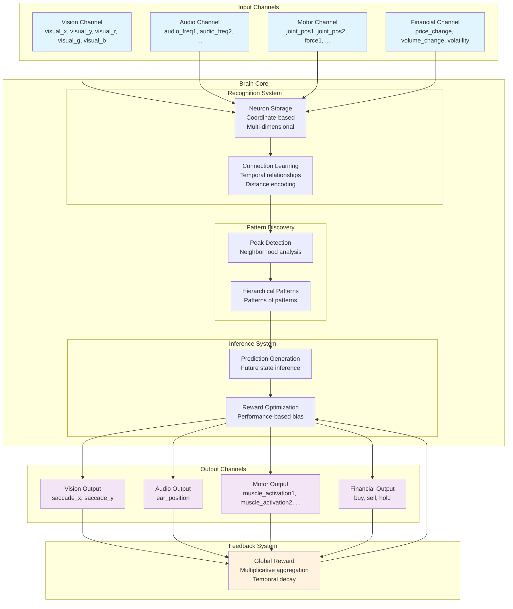
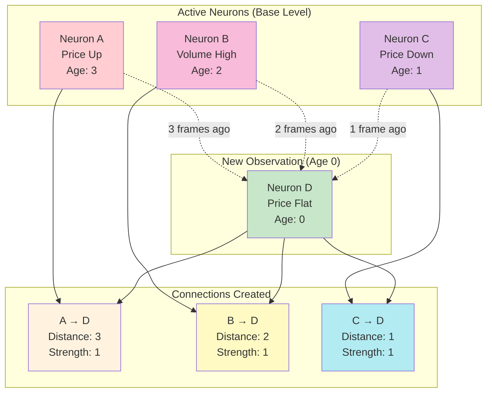
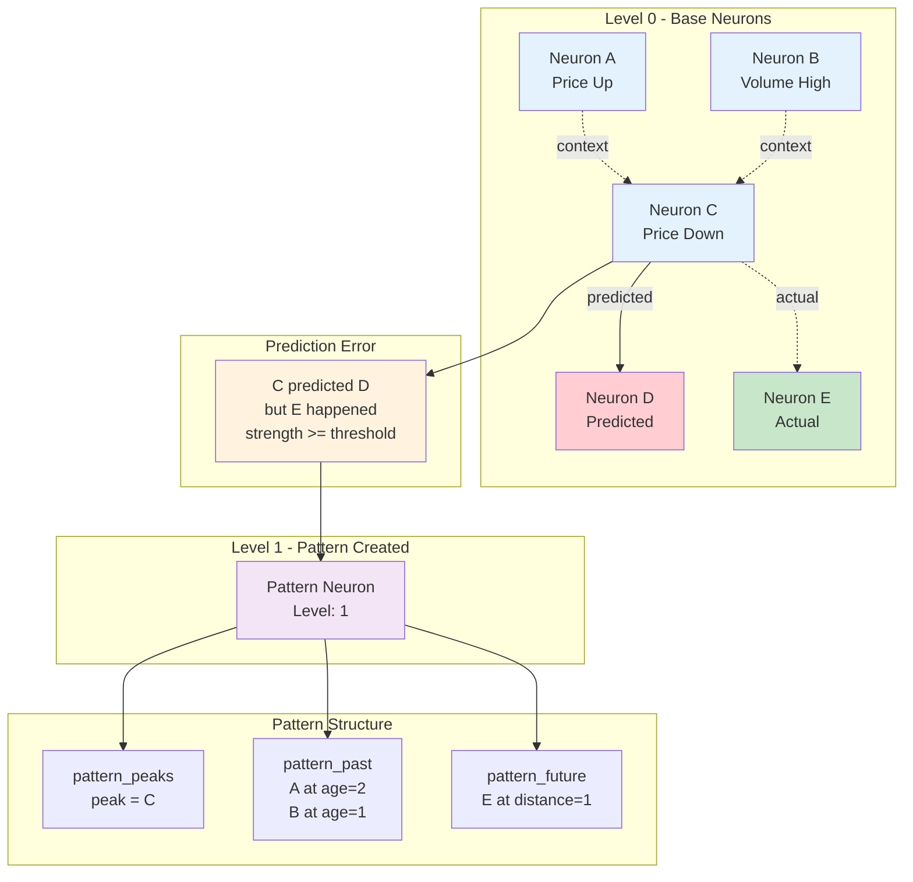
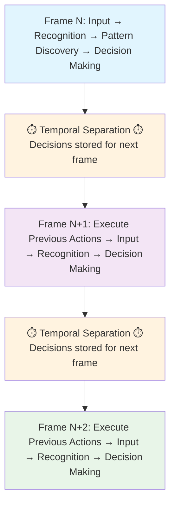
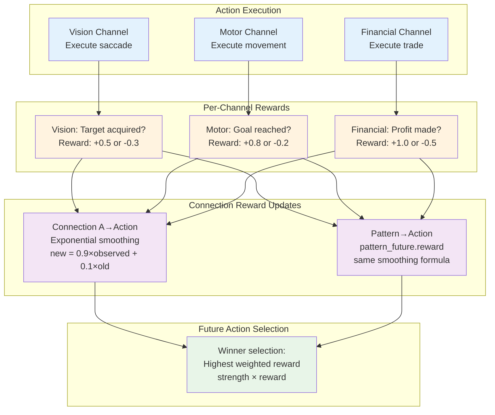

# Artificial Brain Architecture - Patent Disclosure Document

**Confidential - Subject to NDA**

## Executive Summary

This document describes a novel **Artificial Brain Architecture** that mimics biological neural learning through a unique combination of:

1. **Hierarchical Pattern Recognition** - Automatically discovers patterns at multiple levels of abstraction
2. **Temporal Sequence Learning** - Learns and predicts time-based sequences and behaviors  
3. **Multi-Modal Integration** - Processes multiple types of sensory and motor data simultaneously
4. **Reward-Based Adaptation** - Continuously improves performance based on outcome feedback
5. **Autonomous Exploration** - Discovers new behaviors when existing knowledge is insufficient

The system represents a significant advancement over existing AI approaches by providing a unified architecture that can learn, predict, and act across multiple domains without requiring separate training for each task.

## Key Innovations

### 1. Unified Neural Representation
- **Single neuron storage system** that handles both sensory inputs and abstract patterns
- **Coordinate-based encoding** where base neurons represent points in multi-dimensional space
- **Automatic dimension discovery** from input channels (vision, audio, motor, financial, etc.)
- **Type-aware neurons** distinguishing events (observations) from actions (decisions)

### 2. Temporal Connection Architecture
- **Distance-encoded connections** between base neurons capturing temporal sequences
- **Strength-based learning** where frequently observed connections become stronger
- **Reward-based learning** for action connections using exponential smoothing
- **Distance-weighted inference** where recent connections have greater influence than distant ones
- **Event-only sources** - only event neurons can predict; actions cannot be connection sources

### 3. Hierarchical Pattern Discovery
- **Error-driven pattern creation** - patterns emerge only when confident predictions fail
- **Multi-level abstraction** where patterns of patterns form higher-level concepts
- **Context-based patterns** using pattern_past (context neurons with relative ages)
- **Prediction-based patterns** using pattern_future (predicted base neurons with distances)
- **Pattern override mechanism** where pattern votes supersede connection votes from peak neurons

### 4. Temporal Separation Architecture
- **Decision-Action separation** where decisions made in frame N are executed in frame N+1
- **Prediction validation** system that tracks whether predictions come true
- **Sliding window memory** (active_neurons with ages) that maintains context while preventing overload

### 5. Channel-Based Integration
- **Modular sensory/motor interfaces** that can be combined for complex behaviors
- **Automatic dimension registration** where each channel defines its input/output space
- **Per-channel reward system** where each channel provides its own feedback signal
- **Exploration mechanism** that triggers when no action winners exist for a channel

## Technical Architecture Overview

The system consists of several key components working together:

### Core Database Schema
- **Neurons Table**: Universal storage for all neural entities (base and pattern neurons)
- **Base Neurons Table**: Metadata for base neurons (channel, type: event/action)
- **Coordinates Table**: Multi-dimensional position data for base neurons
- **Connections Table**: Directed temporal relationships between base neurons (with distance, strength, reward)
- **Pattern Tables**: Higher-level abstractions:
  - **pattern_peaks**: Maps pattern neurons to their peak neurons
  - **pattern_past**: Context neurons with relative ages (defines when pattern activates)
  - **pattern_future**: Predicted base neurons with distances (defines what pattern predicts)
- **Active Memory Tables**: Sliding window of currently relevant information (active_neurons, matched_patterns, inference_votes, inferred_neurons)

### Processing Pipeline
1. **Frame I/O**: Get events from channels, execute previous actions, collect rewards
2. **Aging**: Increment ages of all active neurons (sliding temporal window)
3. **Base Neuron Processing**: Find/create neurons, reinforce connections, apply rewards
4. **Pattern Recognition**: Match and activate patterns level by level
5. **Pattern Refinement**: Update pattern_past and pattern_future based on observations
6. **Pattern Learning**: Create new patterns from prediction errors and action regret
7. **Inference**: Collect votes, apply pattern override, determine winners, explore
8. **Forget Cycle**: Periodic decay and cleanup of unused connections/patterns

### Learning Mechanisms
- **Hebbian Learning**: Observed connections strengthen through co-occurrence
- **Error-Driven Learning**: Failed predictions create new patterns to correct future behavior
- **Reward Learning**: Action connections/patterns update rewards via exponential smoothing
- **Negative Reinforcement**: Missing context weakens pattern_past entries
- **Forgetting Cycles**: Unused connections and patterns decay to prevent overfitting

## Competitive Advantages

### Versus Traditional Neural Networks
- **No pre-training required** - learns continuously from experience
- **Unified architecture** - single system handles multiple modalities
- **Explainable decisions** - can trace predictions back to learned patterns
- **Real-time adaptation** - immediately incorporates new information

### Versus Reinforcement Learning Systems
- **Hierarchical abstraction** - automatically discovers high-level strategies
- **Multi-modal integration** - combines different types of sensors/actuators
- **Temporal sequence modeling** - naturally handles time-dependent behaviors
- **Pattern reuse** - learned behaviors transfer to new situations

### Versus Expert Systems
- **Automatic knowledge acquisition** - no manual rule programming required
- **Adaptive behavior** - continuously improves performance
- **Uncertainty handling** - gracefully manages incomplete information
- **Scalable complexity** - handles increasingly sophisticated behaviors

## Application Domains

### Autonomous Systems
- **Robotics**: Sensorimotor learning for manipulation and navigation
- **Autonomous Vehicles**: Multi-sensor fusion for driving decisions
- **Drones**: Adaptive flight control and mission planning

### Financial Systems  
- **Algorithmic Trading**: Pattern recognition in market data
- **Risk Management**: Multi-factor analysis and prediction
- **Portfolio Optimization**: Dynamic strategy adaptation

### Industrial Control
- **Process Optimization**: Learning optimal control parameters
- **Predictive Maintenance**: Pattern recognition in sensor data
- **Quality Control**: Adaptive inspection and classification

### Human-Computer Interaction
- **Adaptive Interfaces**: Learning user preferences and behaviors
- **Natural Language Processing**: Context-aware conversation systems
- **Personalization**: Customizing experiences based on user patterns

## Patent Claims Overview

The following aspects represent potentially patentable innovations:

### System Architecture Claims
1. **Unified neural storage system** with coordinate-based multi-dimensional representation for base neurons
2. **Temporal connection architecture** with distance-encoded connections between base neurons
   - Connections store strength (observation frequency) and reward (expected outcome)
   - Only event neurons can be connection sources; actions cannot predict
3. **Error-driven pattern discovery** creating patterns only when confident predictions fail
4. **Context-based pattern matching** using pattern_past with relative ages and threshold-based matching
5. **Pattern override mechanism** where pattern votes supersede connection votes from peak neurons
6. **Temporal separation mechanism** between decision-making and action execution
7. **Channel-based integration system** for multi-modal learning with per-channel rewards

### Method Claims
1. **Process for error-driven pattern creation** from prediction failures and action regret
2. **Method for hierarchical abstraction** through recursive pattern formation at increasing levels
3. **Technique for voting-based inference** with level weighting and time decay
4. **Method for pattern override** deleting connection votes from neurons that are peaks of voting patterns
5. **Technique for reward-based optimization** using exponential smoothing for action connections/patterns
6. **Process for autonomous exploration** when no action winners exist for a channel
7. **Method for real-time adaptation** in continuous learning environments

### Application Claims
1. **System for multi-modal robotic learning** combining vision, touch, and motor control
2. **Method for adaptive financial trading** using temporal pattern recognition
3. **Process for autonomous vehicle control** through hierarchical sensorimotor learning
4. **System for industrial process optimization** via continuous pattern adaptation

## Implementation Details

### Database Architecture
The system uses a MySQL database with both persistent and memory-based tables:
- **Persistent tables** store learned knowledge (neurons, connections, patterns)
- **Memory tables** maintain active context (current activations, predictions, inferences)
- **Optimized indexing** enables real-time processing of large pattern databases

### Processing Performance
- **Real-time operation** suitable for control applications (millisecond response times)
- **Scalable architecture** that handles increasing complexity gracefully
- **Memory efficiency** through sliding window and forgetting mechanisms
- **Parallel processing** capabilities for high-throughput applications

### Integration Capabilities
- **Modular channel system** allows easy addition of new sensor/actuator types
- **Standard interfaces** for common data types (vision, audio, motor, financial)
- **Job-based configuration** enables rapid deployment of new applications
- **API compatibility** with existing systems and frameworks

## Visual Architecture Diagrams

The following diagrams illustrate the key architectural concepts:

### System Architecture Overview

- Shows the complete flow from input channels through brain processing to output channels
- Illustrates the feedback loop that enables continuous learning
- Demonstrates multi-modal integration capabilities

### Temporal Connection Learning

- Shows how base neurons form connections at multiple temporal distances
- **Distance encoding**: Connection distance = source neuron age when target activated
- **Strength learning**: Each co-occurrence increments connection strength
- Connections from event neurons to both event and action neurons

### Error-Driven Pattern Discovery

- Shows how prediction errors trigger pattern creation
- Pattern captures the context (pattern_past) when the error occurred
- Pattern stores the correct prediction (pattern_future) for future use
- Patterns form a hierarchy where pattern errors create higher-level patterns

### Temporal Separation Architecture

- Shows the critical innovation of separating decision-making from action execution
- Illustrates how decisions made in Frame N are executed in Frame N+1
- Demonstrates the feedback loop where action results inform future decisions

### Reward-Based Learning System

- Shows how each channel provides its own reward signal (additive, 0 = neutral)
- Illustrates exponential smoothing for reward updates on connections and patterns
- Demonstrates how reward-weighted selection picks the best action

## Detailed Technical Innovations

### 1. Coordinate-Based Neural Representation
**Innovation**: Unlike traditional neural networks that use abstract weight matrices, this system represents base neurons as points in multi-dimensional coordinate space.

**Technical Details**:
- Each base neuron has explicit coordinates in named dimensions (e.g., price_change=0.5, volume_change=-0.2)
- Dimensions are automatically registered by channels during system initialization
- Base neurons are typed as 'event' (observations) or 'action' (decisions)
- Pattern neurons (level > 0) have no coordinates - they represent learned contexts
- Enables direct mapping between neural activations and real-world coordinate systems

**Patent Significance**: This coordinate-based approach enables explainable AI where decisions can be traced back to specific coordinate patterns, unlike black-box neural networks.

### 2. Temporal Connection Architecture
**Innovation**: Connections between base neurons encode temporal relationships with distance, strength, and reward.

**Technical Details**:
- **Distance encoding**: Connections store the temporal gap between source and target activation
  - Distance = source neuron age when target was activated
  - Enables prediction at specific temporal offsets
- **Strength learning**: Connections strengthen through Hebbian-style observation
  - Each co-occurrence increments strength by 1
  - Clamped between minConnectionStrength and maxConnectionStrength
- **Reward learning**: Action connections track expected outcomes via exponential smoothing
  - `new_reward = smooth * observed + (1 - smooth) * old_reward`
  - Enables reward-weighted action selection
- **Event-only sources**: Only event neurons can be connection sources
  - Actions cannot predict - they are predicted by events
- **Distance-weighted inference**: Linear weighting `1 - (distance - 1) * (1 / contextLength)`
  - Recent predictions weighted more than distant ones

**Patent Significance**: This temporal connection architecture enables learning of multi-step sequences with reward-based action optimization, combining Hebbian learning for events with reinforcement learning for actions.

### 3. Error-Driven Pattern Discovery
**Innovation**: Patterns are created only when confident predictions fail, not during normal recognition.

**Technical Details**:
- **Error detection**: Predictions with strength >= threshold that don't come true trigger pattern creation
- **Action regret**: Painful action outcomes (negative reward) trigger alternative action patterns
- **Pattern structure**:
  - pattern_peaks: Maps pattern neuron to peak neuron (the predictor that made the error)
  - pattern_past: Context neurons with relative ages (what was active when peak appeared)
  - pattern_future: Predicted base neurons with distances (what the pattern predicts)
- **Pattern matching**: Threshold-based matching (default 50% of context must match)
- **Winner selection**: Among matching patterns for a peak, highest total strength wins
- **Pattern refinement**: Matched patterns update pattern_past (novel/common/missing) and pattern_future

**Patent Significance**: Error-driven pattern creation produces sparse, meaningful patterns focused on prediction failures rather than noise. This mimics biological error-driven learning and enables efficient hierarchical abstraction.

### 4. Temporal Separation Mechanism
**Innovation**: Separates decision-making from action execution by one time frame to enable stable learning.

**Technical Details**:
- Decisions made in frame N (age=0) are stored in `inferred_neurons` table
- Actions are executed in frame N+1 when neurons reach age=1
- Results of actions inform frame N+1 decision-making
- Prevents feedback loops that could destabilize learning
- Enables prediction validation and reinforcement learning

**Patent Significance**: This temporal separation solves the stability problem that affects many real-time learning systems, enabling continuous adaptation without oscillation.

### 5. Multi-Modal Channel Integration
**Innovation**: Unified architecture that seamlessly integrates multiple sensory and motor modalities.

**Technical Details**:
- Each channel defines input dimensions (events) and output dimensions (actions)
- Channels automatically register dimensions with brain during initialization
- Single neural representation handles all modalities simultaneously
- Cross-modal pattern discovery enables sensorimotor integration
- Per-channel reward system where each channel provides its own feedback signal
- Exploration mechanism triggers when no action winners exist for a channel

**Patent Significance**: This enables single systems to learn complex behaviors spanning multiple modalities (vision + motor + audio) without requiring separate training for each modality.

### 6. Voting-Based Inference with Pattern Override
**Innovation**: A distributed voting architecture where all active neurons contribute predictions, with pattern votes overriding connection votes.

**Technical Details**:
- **Vote collection**: Both connection votes (from base neurons) and pattern votes (from pattern neurons)
- **Level weighting**: Higher-level patterns have more influence: `1 + level * levelVoteMultiplier`
- **Time decay**: Recent predictions weighted more: `1 - (distance - 1) * (1 / contextLength)`
- **Pattern override**: Connection votes from neurons that are peaks of voting patterns are deleted
  - Patterns exist to correct connection predictions
  - When a pattern is active, its predictions supersede the peak's connection predictions
- **Winner selection**:
  - Events: Highest total strength wins (deterministic)
  - Actions: Highest weighted reward wins (reward-based selection)
- **Exploration**: When no action winners exist, channel provides unexplored action

**Patent Significance**: This voting architecture enables distributed decision-making where multiple levels of abstraction contribute to predictions. The pattern override mechanism ensures that learned corrections take precedence over raw connection predictions, enabling hierarchical error correction.

### 7. Hierarchical Pattern Architecture
**Innovation**: Patterns form a hierarchy where patterns of patterns create higher-level abstractions.

**Technical Details**:
- **Level progression**: Base neurons at level 0, patterns at level 1+
- **Recursive recognition**: After matching level N patterns, check for level N+1 patterns
- **Context at each level**: pattern_past contains same-level context neurons
- **Predictions to base**: pattern_future always predicts base neurons (events or actions)
- **Error propagation**: Pattern prediction errors create patterns at the next level up
- **Maximum depth**: Configurable maxLevels prevents infinite recursion

**Patent Significance**: This hierarchical pattern architecture enables the system to learn abstractions at multiple timescales. Higher-level patterns represent longer temporal contexts and more abstract concepts, while lower-level patterns capture immediate sequences.

## Commercial Applications and Market Potential

### Robotics Market ($147B by 2025)
- **Autonomous manipulation**: Learning to grasp and manipulate objects through vision-motor integration
- **Navigation systems**: Multi-sensor fusion for autonomous movement in complex environments
- **Human-robot interaction**: Adaptive behavior based on visual, audio, and tactile feedback

### Autonomous Vehicles Market ($556B by 2026)
- **Sensor fusion**: Integration of camera, lidar, radar, and GPS data for driving decisions
- **Adaptive control**: Learning optimal driving behaviors for different conditions
- **Predictive systems**: Anticipating traffic patterns and pedestrian behavior

### Financial Technology Market ($324B by 2026)
- **Algorithmic trading**: Multi-factor pattern recognition in market data
- **Risk assessment**: Temporal pattern analysis for credit and investment decisions
- **Fraud detection**: Real-time behavioral pattern analysis

### Industrial Automation Market ($296B by 2025)
- **Process optimization**: Learning optimal control parameters through continuous feedback
- **Predictive maintenance**: Pattern recognition in sensor data to predict equipment failures
- **Quality control**: Adaptive inspection systems that improve with experience

## Conclusion

This Artificial Brain Architecture represents a significant advancement in machine learning and artificial intelligence, providing a unified approach to multi-modal learning, temporal prediction, and adaptive behavior. The system's novel combination of error-driven pattern learning, temporal sequence modeling, and reward-based adaptation creates new possibilities for autonomous systems across multiple domains.

The architecture's key innovations in neural representation, temporal connections, error-driven pattern discovery, voting-based inference, and multi-modal integration provide strong foundations for patent protection while offering substantial commercial value across robotics, finance, industrial control, and human-computer interaction applications.

**Key Patent Strengths**:
1. **Novel technical approach** - error-driven pattern creation differs from traditional neural networks
2. **Unified learning** - combines Hebbian learning for events with reinforcement learning for actions
3. **Hierarchical abstraction** - patterns of patterns enable multi-scale temporal reasoning
4. **Pattern override mechanism** - learned corrections supersede raw predictions
5. **Broad applicability** across multiple high-value commercial markets
6. **Clear implementation pathway** with working prototype demonstrating feasibility
