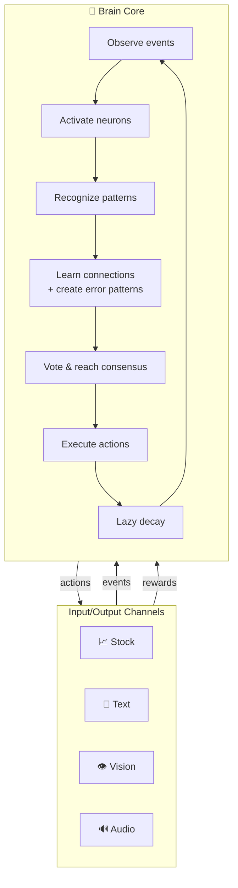
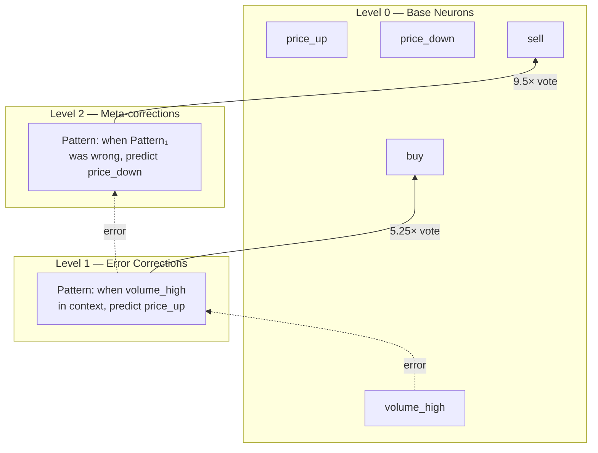
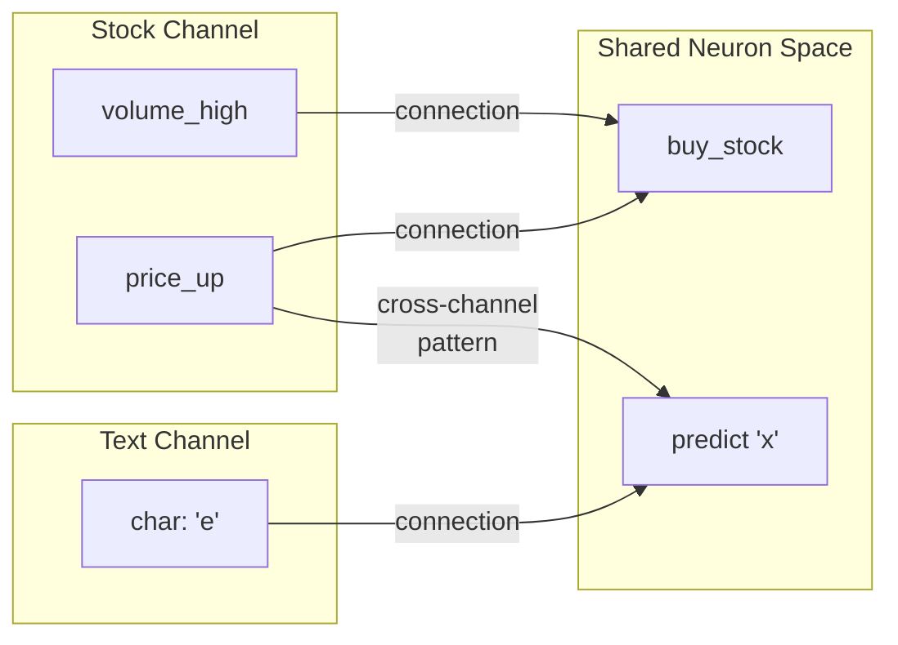
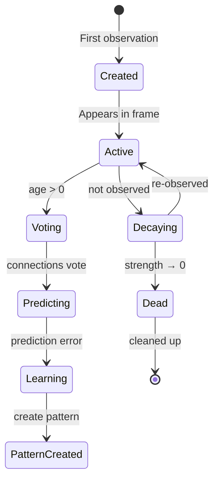

# Robot Brain — Technical Foundations

**Last Updated**: March 2026

## Overview

This document describes the technical foundations of the Robot Brain architecture — a biologically-inspired learning system that discovers patterns from raw sequential data through prediction and error correction.

The architecture differs from conventional neural networks in several fundamental ways:

- **No training epochs** — learns continuously from streaming data
- **No backpropagation** — patterns are created directly from prediction errors
- **No labeled data** — structure emerges from temporal co-occurrence and reward signals
- **Sparse activation** — only relevant neurons participate in each frame
- **Explainable decisions** — predictions are traceable to specific learned patterns and contexts

## System Overview



## Key Architectural Ideas

### 1. Spatio-Temporal Neural Representation

Neurons represent points in multi-dimensional coordinate space. Base neurons (level 0) have explicit coordinates in named dimensions — a vision neuron might encode `(x=12, y=5, r=200, g=50, b=30)`, while a financial neuron encodes `(price_change=up, volume_change=high)`.

- **Coordinate-based encoding** — base neurons are identified by their position in dimension space
- **Type-aware neurons** — `event` neurons observe the world; `action` neurons represent decisions
- **Pattern neurons** (level > 0) have no coordinates — they represent learned contexts
- **O(1) neuron lookup** via hash map using coordinate JSON strings as keys

### 2. Temporal Connections with Distance Encoding

Connections between neurons encode temporal relationships with explicit time gaps:

- **Distance encoding** — connection distance = source neuron age when target was activated
- **Hebbian learning** — event connections strengthen through co-occurrence
- **Reward learning** — action connections track expected outcomes via exponential smoothing
- **Event-only sources** — only event neurons can be connection sources (actions are predicted, not predictors)
- **Lazy decay** — strengths decay continuously based on frames elapsed since last activation, computed on-demand rather than through periodic forget cycles

### 3. Error-Driven Pattern Discovery

Patterns are created **only** when confident predictions fail — not during normal recognition. This produces sparse, meaningful structure focused on correcting errors rather than memorizing noise.

- **Prediction error patterns** — created when a strong event prediction doesn't come true
- **Action regret patterns** — created when an action produces a painful outcome
- **Pattern structure**: each pattern has a parent (the neuron that made the error), a context (what was active when the error occurred), and predictions (the correct outcome)
- **Fuzzy context matching** — patterns activate when observed context matches stored context above a configurable threshold
- **Pattern override** — when a pattern activates, it suppresses its parent's connection votes, ensuring learned corrections take precedence

### 4. Hierarchical Abstraction

Hierarchy emerges from failure, not by design. When a level-1 pattern makes a prediction error, a level-2 pattern is created to correct it. This recurses up to arbitrary depth.

- **Level 0**: Base sensory/action neurons with connections
- **Level 1**: Patterns created from base neuron prediction errors
- **Level N**: Patterns created from level N-1 prediction errors
- **Temporal extension**: each level effectively extends the context window exponentially



### 5. Voting-Based Inference

There is no central controller. Every active neuron contributes predictions weighted by level and temporal proximity. Intelligence emerges from consensus.

- **Vote collection**: active neurons at all ages cast votes for what they predict next
- **Level weighting**: higher-level patterns carry more weight (they represent more context)
- **Time decay**: recent predictions weighted more than distant ones
- **Winner selection**: events win by highest strength; actions win by highest weighted reward
- **Exploration**: when no action is inferred for a channel, a deterministic exploration action is selected

### 6. Temporal Separation

Decisions made in frame N are executed in frame N+1. This separation prevents feedback loops and enables stable learning — the brain can observe the consequences of its actions before making new decisions.

### 7. Multi-Modal Channel Integration

The channel system provides a modular interface between the brain and external data sources:

- Each channel defines its own input dimensions (events) and output dimensions (actions)
- Multiple channels converge in a single brain — cross-modal patterns emerge naturally
- Each channel provides its own reward signal
- Available channels: text, stock/financial, vision, audio, motor control, taste



Cross-modal patterns emerge naturally when neurons from different channels form connections and patterns in the same brain — no explicit fusion mechanism needed.

### 8. Lazy Decay (Continuous Forgetting)

Instead of periodic forget cycles, the system uses lazy decay — strengths are computed on-demand based on frames elapsed since last activation:

```
effectiveStrength = strength - (currentFrame - lastActivationFrame) × decayRate
```

This eliminates the need for batch cleanup passes and provides smooth, continuous forgetting that prevents the curse of dimensionality.

## Neuron Lifecycle



## Biological Inspirations

The architecture draws from several neuroscience concepts:

| Concept | Biological Basis | Implementation |
|---------|-----------------|----------------|
| Regions | 6-layer hierarchical processing | Multi-level pattern hierarchy |
| Hebbian learning | "Neurons that fire together wire together" | Connection strengthening through co-occurrence |
| Error-driven plasticity | Prediction error signals in cortex | Patterns created from prediction failures |
| Sparse coding | Only ~1-5% of neurons active at any time | Only relevant neurons participate per frame |
| Thalamic relay | Thalamus routes sensory information | Thalamus class manages neuron registry and channel coordination |
| Temporal context | Working memory maintains recent history | Sliding window of active neurons indexed by age |

## Comparison with Conventional Approaches

| Aspect | Robot Brain | Neural Networks | Reinforcement Learning |
|--------|------------|-----------------|----------------------|
| Learning mode | Online, continuous | Batch epochs | Episode-based |
| Error signal | Prediction failure → pattern creation | Gradient descent on loss | Reward signal |
| Data efficiency | Learns from single errors | Requires many examples | Requires many episodes |
| Catastrophic forgetting | Gradual decay, no overwriting | Major problem | Less severe |
| Explainability | Traceable to specific patterns | Black box | Policy is opaque |
| Time representation | Built into connections (distance) | Learned (attention/RNN) | Discount factor |
| Architecture | Emerges from data | Designed (layers, heads) | Designed (policy/value networks) |

## Current Limitations

- **No transfer learning** — patterns are context-specific to the data stream
- **No pre-training** — must learn from scratch (though it learns quickly)
- **Discrete time steps** — processes frames, not continuous time
- **Single-threaded reference implementation** — the architecture is parallelizable but this Node.js implementation is sequential
- **No spiking neurons** — uses simplified activation model

## Future Directions

- **High-performance C++ core** with Python and Node.js bindings
- **Spatial connection encoding** (dx, dy alongside temporal distance) for vision and motion tracking
- **Hardware implementation** (FPGA/ASIC) leveraging the architecture's inherent parallelism
- **Metacognitive feedback** — thinking channel where the brain reads its own outputs as inputs
