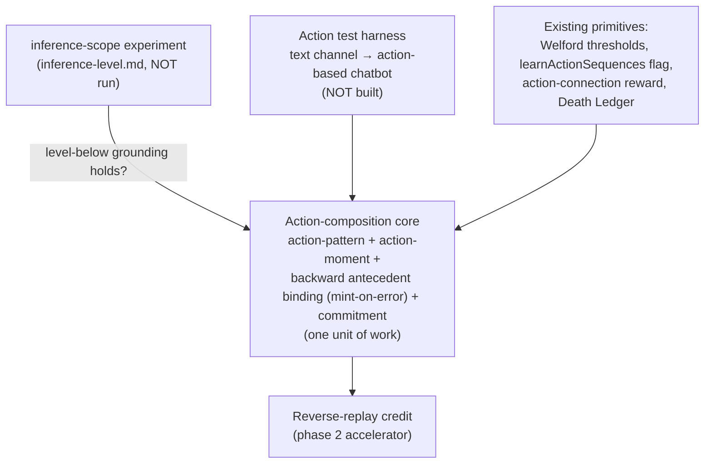

# Action Composition

How the action hierarchy grows by the same machinery as the event hierarchy, run backward in time (`d<0`). This is **design, not yet built**, and is **gated on the inference-scope experiment** ([inference-level.md](./inference-level.md)): the action tower grounds `level-below` in the same units as the event tower with the arrow reversed, so the scope rule that wins there is the default here too. If `base` wins outright — predicting raw sensory beats predicting your own substrate — "levels infer levels" is undercut and this needs rethinking before any of it is built. Not all questions are answered; several are listed open at the end.

The reward-distribution / **global-rewards** design is the independent companion to this one — see [global-rewards.md](./global-rewards.md). The two meet at exactly **one** point: reward targets the apex action, not base neurons.

> **Status: design only. Not built. Gated on the inference-scope experiment ([inference-level.md](./inference-level.md)).**
> Recorded so the design isn't lost. Open questions are listed at the end; several are unresolved.

## The organizing principle: actions are inference run backward

All neurons do the same thing — they fire on a context match, vote, decay, and mint a pattern when their inference error crosses threshold. The only axis that distinguishes them is the **temporal direction of the inference**, the sign of the distance `d`:

- **`d = 0` — spatial.** What *is*. Co-activation in the present. Every neuron does this.
- **`d > 0` — event.** What *will* be. Forward prediction. The existing, validated event hierarchy.
- **`d < 0` — action.** What *was*. Backward retrodiction — the antecedent that preceded this.

So the action hierarchy composes by the **same** machinery the event hierarchy already uses (co-activation, sequence, mint-on-error), run in the opposite temporal direction. There is no separate operator and no event-side asymmetry. This corrects the earlier framing, which treated action composition as a fundamentally different problem requiring a bolted-on outcome gate.

How it grows: once an action fires, it looks back at the events and actions that were active **before** it, builds connections to them, and strengthens them on repetition — becoming a backward predictor of its own antecedents. When that backward inference's error crosses the Welford threshold (the *identical* mint trigger events use forward), an **action pattern** is minted, and it then binds backward to *its* antecedents one level up. The action tower grows backward the way the event tower grows forward.

**The credit/composition distinction still holds — only its resolution changes.** The original "it'll emerge naturally" conjecture conflated two things:

- **Credit assignment** — a node grows an action connection and accumulates reward ([column.rs](../brain/brain-core/src/column.rs) `learn_action_connections`). This emerges for free and is **forward**: which action pays, scored by reward landing next frame.
- **Composition** — primitive actions fuse into one higher action. This does **not** emerge from *forward* correlation ("which action pays" never says "these three are one thing"). It emerges from **backward** inference-error — the same route events use to compose, reversed.

**Why this isn't the "habits, not skills" trap.** Chunking by *forward* policy-frequency — how often you do A-then-B — does calcify present behavior into macros and freeze exploration. That objection survives, but only against forward chunking. Backward inference escapes it because a chunk is defined as *what reliably preceded a given antecedent*, anchored on that endpoint rather than on how often it is performed. Outcome-anchoring is automatic in backward inference — it is what `d < 0` *means* — so the "special operator" the old design reached for was the backward direction all along.

**Two mechanisms, two jobs.** Forward carries **value** (which action pays). Backward carries **structure** (which actions are one thing). They are not competing accounts of one process; they run simultaneously and feed each other (see [Causality](#causality-correlation-filtered-by-reward) below).

## An action's level is set by the antecedents it binds to

Actions are **not** a parallel, independent tower mirroring events. They are **grounded in the same hierarchy**, the same way `level-below` event prediction grounds transitively down to sensory — except the grounding points backward in time:

- A **primitive action** binds backward to sensory-level (L=0) context.
- A **sub-sequence of actions** earns chunkhood when its **backward inference over its antecedents** stabilizes — i.e. it reliably retrodicts the events/actions that preceded it, and that backward prediction's error crosses the mint threshold. It binds at the level of the antecedents it predicts.

This is the *options* idea (Sutton/Precup/Singh) routed through the brain's own predictive machinery rather than bolted on. The commensurability principle from the inference-scope experiment transfers verbatim, arrow reversed: an action belongs at level N because the antecedent it retrodicts lives in level-N's units. **Mint by structure (backward error), survive by value (reward on the connection, Death Ledger pruning)** — the outcome itself never enters the chunk's structure; it enters only as forward reward on the action connection.

## How a high event comes to invoke a high action (the "treasure")

For a high-level event **E** to invoke a high-level action chunk **P**, two links exist at opposite ends of the action, and they are built differently:

- **Antecedent end (E → P), backward, structural.** This is the composition link. When P fires, it retrodicts the context that preceded it; if E was that context, the backward connection forms and strengthens on repetition. This is the same backward-inference mechanism that mints P in the first place — the binding is not a separate wiring step, it is what backward inference *does*.
- **Outcome end, forward, value.** P's reward lands forward, on its action connection, scored next frame. The outcome never enters P's structure; it only weights the connection.

**Why E and not a flickering base event wins the antecedent link** — the commensurability argument from the inference-scope experiment, now in the time domain. P has temporal extent. Across its span, base events flick on and off, but E is the one token whose activation **co-extends with the chunk's entire span** (that is what made E apex). So mean-based backward connection strength gives E → P the cleanest, lowest-variance association, while base → P links are noisy edge-effects. Actions bind to the event level whose temporal extent matches their own — automatically, because only same-extent tokens reliably co-occur across the whole span.

> **Under-designed (flagged).** The exact wiring is not yet resolved: whether the antecedent binding is seeded when the action fires and reinforced, or accrues purely post-hoc; how `context_refs` ([neuron.rs](../brain/brain-core/src/neuron.rs)) carries the backward index; and how a freshly-minted moment connects to a chunk that may not exist yet (likely a primitive sequence at coarse Δt first, upgraded to the chunk later). See open questions 11–12.

## Why the high action beats its own constituents (load-bearing)

This concern lives on the **forward / value** side — it is about exploitation, not formation. Formation is handled by backward inference above; here the question is why a *formed* chunk `P` ever out-votes its parts. A high event E migrates its vote from base action `a` to chunk `P` only if `P` earns **higher conditional reward** than `a`-repeated, and it does so through **commitment**, not bookkeeping: if E re-decides every tick, the full sequence never reliably assembles and the chunk's reward never lands cleanly. `P` beats its parts only because it commits to the whole sequence.

So commitment / call-stack discipline is the source of the chunk's *reward advantage at exploitation time*. Note this is distinct from formation: the chunk can **form** (backward error mints it) before it has any reward advantage; commitment is what later lets it **win**. This is the piece most likely to be under-built.

## Direction of learning: value forward, structure backward

Two distinct things run in two temporal directions, and they are not competing accounts of one process:

- **Value, forward.** Apex events vote actions; with no action connection the channel default fires; reward lands on the connection next frame. This is selection — *which action pays* — and it is unchanged from the current system.
- **Structure, backward.** After an action fires, it binds to its antecedents and mints chunks when backward error crosses threshold. This is composition — *which actions are one thing*.

They feed each other: backward inference proposes structure (chunks), forward reward scores it (which chunks are worth keeping). At rollout the arrows meet — events run forward to a high-value predicted event, and the chunk reaches it forward — but they were *learned* from opposite ends.

Two clarifications that keep this honest:

- **Learn backward, execute forward.** A chunk is minted from the antecedent end (it retrodicts C←B←A) but traversed from the start (A→B→C). Keep the two read directions explicit or consolidation and rollout will be confused.
- **Reverse replay is an optimization, not a precondition.** The baseline cortical mechanism — backward connections strengthening on repetition — already builds structure (slowly). Reverse replay propagates credit in its native direction (outcome → cause) faster and cleaner, but composition can *form* without it. **Build the core first; add reverse replay only once chunks demonstrably mint.**

The biology rhymes (forward prediction ≈ System 1 cortical reflex; backward chaining ≈ System 2 / hippocampal reverse replay), but resemblance to biology is orientation, not justification.

## Causality: correlation filtered by reward

Backward binding on its own yields **correlation**, not cause — it captures whatever tended to precede an action, including antecedents that were merely co-present. What refactors correlation into causality is the forward reward channel acting as a filter on the (bushy) backward graph: a spurious antecedent does not reliably track reward across contexts, so its connection stays weak and the Death Ledger thins it, while a genuine cause persists. **Retrodiction becomes causation by surviving the reward filter, not by getting the backward inference right on its own.** This is also the answer to the reverse-graph branching-factor problem (open question #3): the reverse graph *is* bushy — many pasts per outcome — and reward is the pressure that prunes the bush toward the causal skeleton.

## Minimal implementation, reusing what exists

| Piece | New or existing | Notes |
|---|---|---|
| Adaptive mint threshold | **Exists — reuse for `d<0`** | `error_stats` Welford + `errorCorrectionMode` (`conservative = mean+σ`), per-(neuron, age). This is now the **action mint gate too**: actions mint on *backward* inference error using the same threshold. No separate operator. |
| Action participation toggle | **Exists (dormant)** | `learnActionSequences` channel flag — `false` in every encoder today. The on-ramp for action pattern learning. |
| Action-connection reward | **Exists** | `learn_action_connections`, never-weakened, reward-smoothed. The **forward / value** channel. Reward targets the **apex** action, not base neurons — see [global-rewards.md](./global-rewards.md). |
| Death Ledger pruning | **Exists — now also the advantage filter** | Prunes chunks that stop paying. With the advantage test removed from the mint gate, this is where value selection happens (mint by structure, survive by value), and where the backward graph is pruned toward causality. |
| **Action-pattern neuron** | **New** | Temporal sequence of actions, `d<0`. Content-hash by action sequence for reuse/dedup. |
| **Action-moment neuron** | **New** | Simultaneous action bundle (`d=0` "chord", e.g. turn-and-accelerate). Completes the moment/pattern table on the action side. |
| **Backward antecedent binding** | **New** | After an action fires, connect it to active preceding events/actions and strengthen on repetition. Mint a chunk when backward error crosses the existing Welford threshold. (Replaces the old "outcome-and-advantage mint gate": minting is backward-error-gated, *not* outcome-and-advantage-gated; advantage moves to the Death Ledger.) |
| **Commitment / call-stack arbitration** | **New** | Forward / value side. Active chunk holds the action channel down to its level until its predicted outcome confirms (success) or its residual breaches (abort, hand control up). Interruptible only by residual breach or a strictly higher-value option. |
| **Reverse-replay credit pass** | **New (phase 2)** | Accelerator on the backward graph, in its native outcome→cause direction. Build after the core forms chunks. |

## Expected developmental order (curriculum, not a bug)

A chunk cannot bind backward to antecedents that do not yet exist, so structure lags the event hierarchy it grounds on:

1. Events abstract (the forward hierarchy grows — provides the antecedents to bind to).
2. Apex events vote actions; actions fire and collect forward reward on their connections (value).
3. Fired actions bind backward to their active antecedents; on repetition the backward error falls, and when it crosses threshold an action chunk mints (structure).
4. The chunk binds backward to *its* antecedents one level up; the E → P link strengthens, and high-to-high invocation takes over from base routing.
5. Forward reward and Death Ledger pruning thin spurious antecedents, refactoring the backward graph toward causality.

Do not expect (or force) action composition before the antecedents it grounds on exist.

## Dependencies

- **Hard gate — inference-scope result** ([inference-level.md](./inference-level.md)). Composition assumes levels meaningfully predict levels (`level-below` or better). If `base` wins everywhere, rethink before building.
- **Test harness — the real long pole.** No current domain exercises action composition. Stocks have one binary action per channel (`actions: [-1, 1]`) — a "chunk" of buy-buy-buy is trivial, no hierarchy to compose. MNIST runs actions off. **Plan: convert the text channel from passive next-token prediction to action-based output — effectively a chatbot — so that emitting tokens becomes a multi-step action sequence with consequences.** Whether next-token-as-action actually produces a *composable* action hierarchy (vs. still one-action-per-frame) is itself an open question (below).
- **Co-dependent core.** Action-pattern + action-moment + backward antecedent binding (mint-on-error) + commitment are not separable — none is meaningfully testable without the others. Build and test as one unit, behind `learnActionSequences`.
- **Reverse replay is downstream of the core**, not a precondition.

## Open questions

1. **Does `level-below` actually win the inference-scope experiment?** Everything here stacks on it. Unrun.
2. **Goal seeding: value, not predictability — resolved by the value/structure split.** The original worry was a closed loop: a forward model seeds a goal by *predictability*, the backward model reaches whatever it's seeded with, and you hallucinate goals you can hit. The value/structure separation (structure from backward inference, value from reward — "mint by structure, survive by value") plus the independence of the [global-rewards](./global-rewards.md) policy close this by construction: a state being predictable never makes it valuable, because value enters only through the reward channel. **Residual:** confirm in code that no path lets inference confidence feed the reward-seeded goal value — that single canary is all that's left of this question.
3. **Reverse-graph branching factor — the causality crux.** Forward, there's one actual next event; backward, an outcome has many predecessors, so the reverse graph is bushier and will try to explode (the same point a commenter raised on the public post). The design answer is [Causality](#causality-correlation-filtered-by-reward): reward-weighting + Death Ledger prune the bush toward the causal skeleton. Open empirically: does the pruning actually converge, or does the backward graph stay bushy enough to swamp compression? Instrument it.
4. **Arbitration under Democratic voting.** A committed chunk must suppress its own constituent primitives' votes within its scope, or the option and its parts fight over the channel. Exact call-stack discipline — who holds the floor, what counts as a "strictly higher-value option" interrupt, how residual breach is detected — is unspecified.
5. **What is an "action moment" in the text/chatbot domain?** A single output channel emits one token per frame — is there a simultaneous action bundle at all, or does the moment/pattern symmetry degenerate for single-channel output? May only matter for multi-channel (robot) actuation.
6. **Does next-token-as-action actually compose?** The criterion for "this token sequence is one action chunk" is now defined — backward-inference error crossing threshold — but whether single-channel text *exercises* it (vs degenerating to one action per frame) is open. A short-credit-latency control domain may exercise composition far more cleanly than a chatbot; see #8.
7. **Antecedent definition.** Backward inference needs an operational target: which preceding level counts as the chunk's antecedent, and how is the backward residual thresholded (reuse the Welford `error_stats` on `d<0`?). This replaces the old "outcome definition" question — the outcome is no longer part of the chunk's structure, only its forward reward.
8. **Credit latency in the chatbot setting.** Reward may arrive many tokens after the actions that earned it. The [global-rewards](./global-rewards.md) policy's linear (not exponential) decay is chosen partly for this — it keeps nonzero credit on distant frames — but the core question stands: how far back does credit usefully propagate, and does reverse replay become a precondition (not just an accelerator) once latency is large?
9. **Canary metrics against pattern explosion / memorization.** Higher levels minting aggressively erodes compression and drifts toward memorization (the brain will happily memorize — ~3 episodes to 100% on text). **The stakes rose with the reframe:** the advantage test moved out of the mint gate (mint by structure, survive by value), so minting is no longer reward-throttled — nothing slows aggressive minting except pruning. Instrument **top-level action mint rate** and **Death Ledger churn** as the early-warning signals before trusting any of this.
10. **Can the expected developmental order be observed?** If the curriculum (events abstract → actions fire and earn reward → backward binding crystallizes a chunk → E→P strengthens → causality pruning) doesn't appear in instrumentation, the mechanism isn't doing what the design claims.
11. **Moment → action connection: granularity and upgrade.** A cortical pattern measures action-distance in frames (its "immediate" `d=−1` credits a primitive); a moment measures it in moment-hops (its "immediate" `d=−1` spans an inter-salience interval and should credit a *chunk*). But at mint time the chunk may not exist, so a fresh moment likely binds a primitive sequence at coarse Δt first and must **upgrade** to the chunk once it exists. The upgrade trigger and re-pointing rule are unspecified — this is where the action-formation timeline and the hippocampal-connection timeline must be made to agree.
12. **Two "immediate" regimes.** Short-term immediate (cortical frame distances) and long-term immediate (hippocampal moment distances) are both `d=−1` in their native clock; the clock is the only difference. Confirm the binning reuses the moment graph's Δt machinery, signed, rather than a separate scheme.
