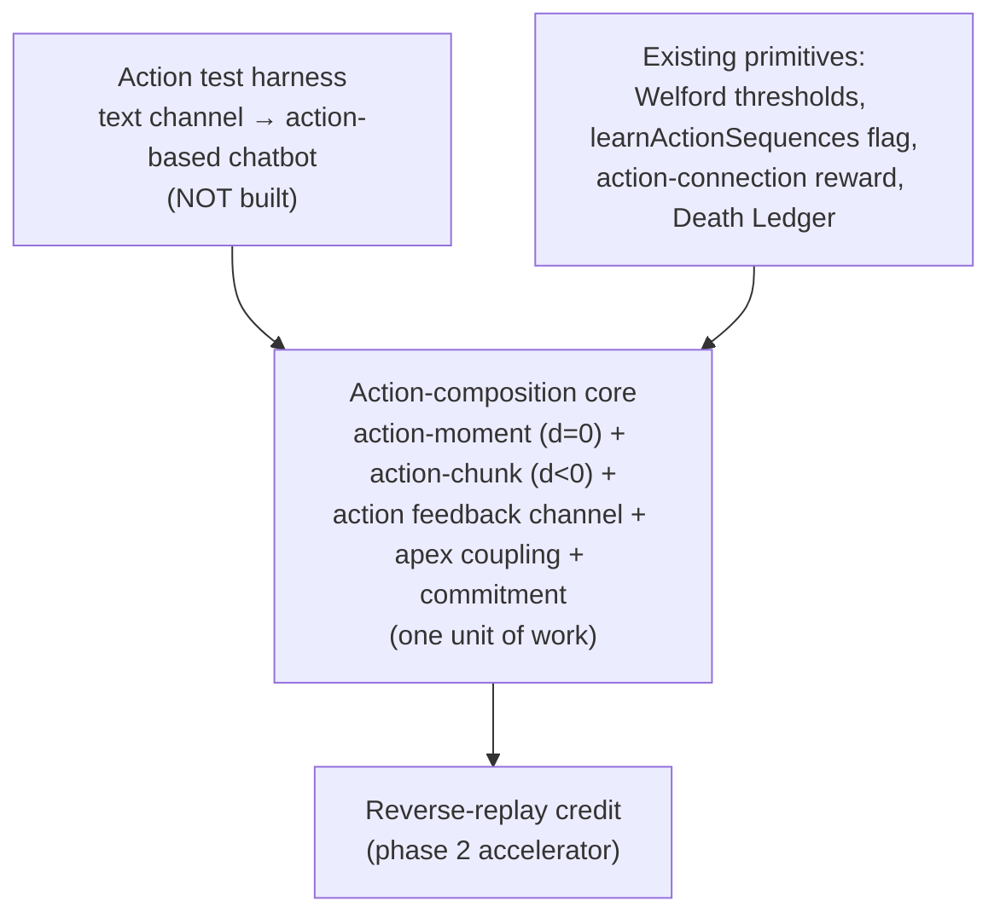

# Action Composition

How the action hierarchy grows by the **same machinery** as the event hierarchy, with two principles
held together: the inference runs backward in time (`d<0`), and **structure forms within a modality
while the two modalities couple only at the apex**. This is **design, not yet built**.

**The inference-scope gate is resolved, not pending** ([inference-level.md](./inference-level.md), since
superseded by the UCAR design's uniform same-level rule — [algorithm.md](./algorithm.md)). The earlier
framing made this design wait on a `level-below` win in an event-side experiment. That gate is gone in
both directions: this design does **not** depend on how the event tower's inference scope is set. It rests
on **action→action** backward composition plus **apex event ↔ apex action** coupling — and both are
anchored to reality the way sensory grounds events: emitted primitives are real (execution grounds the
action hierarchy at the bottom), and the reward filter prunes the backward graph toward causality. UCAR's
lateral rule arriving on the event tower changes nothing here; under the staged rollout, actions are the
last port (spatial validation first, then events, then this design).

The reward-distribution / **global-rewards** design is the independent companion to this one — see
[global-rewards.md](./global-rewards.md). The two meet at exactly **one** point: reward targets the apex
action, not base neurons.

> **Status: design only. Not built. The inference-scope gate is resolved — this design is independent of
> the event tower's inference scope (formerly `base` per [inference-level.md](./inference-level.md), now
> same-level per the UCAR design, [algorithm.md](./algorithm.md)) — because composition is action→action
> plus apex coupling, not events predicting events. Scheduled as the last port in UCAR's staged rollout.**
> Recorded so the design isn't lost. Open questions are listed at the end; several are unresolved.

---

## Two organizing principles

### Principle 1 — direction of inference is the only axis

All neurons do the same thing: fire on a context match, vote, decay, and mint a pattern when their
inference error crosses threshold. The only axis that distinguishes them is the **temporal direction of
the inference**, the sign of the distance `d`:

- **`d = 0` — spatial.** What *is*. Co-activation in the present. Every neuron does this.
- **`d > 0` — event.** What *will* be. Forward prediction. The existing, validated event hierarchy.
- **`d < 0` — action.** What *was*. Backward retrodiction — the antecedent that preceded this.

So the action hierarchy composes by the **same** machinery the event hierarchy already uses
(co-activation, sequence, mint-on-error), run in the opposite temporal direction. There is no separate
operator and no event-side asymmetry.

### Principle 2 — structure within a modality, coupling at the apex

This is the spine of the design and it mirrors the event side exactly:

- **Event patterns are built from events only.** An event pattern is a spatial/temporal composition of
  *lower events* (down to sensory). It never mints from actions. Separately, once the sweep settles,
  **apex events vote actions**.
- **By symmetry, action patterns are built from actions only.** An action chunk is a spatial/temporal
  composition of *lower actions*. It never mints from events. Separately, **apex events couple to apex
  actions** so a high event can invoke a high action.

So *structure* forms inside each modality, and the two modalities touch **only at the apex**, through the
event→action vote. This is the central correction to the earlier design, which minted action chunks from
a **mixed** bag of "events and actions" as antecedents — that broke the symmetry, because event patterns
never retrodict actions. Chunk identity is action structure; chunk relevance is the apex vote. Keep them
separate.

---

## The three regimes, per modality

Each modality runs the full `d=0` / temporal pair. Spatial (`d=0`) produces the temporal-level-0 apex
set at age 0; temporal builds patterns from there.

| | `d = 0` spatial | temporal | temporal-level-0 input |
|---|---|---|---|
| **Events** | sensory co-activation → **event moments / spatial corrections** | `d>0` forward prediction → **event patterns** | apex events |
| **Actions** | action co-activation → **action moments** | `d<0` backward retrodiction → **action chunks** | apex actions |

The action side has been missing its `d=0` pass. It needs one, for the same reason events do.

---

## Action spatial processing (`d=0` action moments)

Just as event spatial processing groups co-firing sensory pixels into spatial corrections, **action
spatial processing groups co-firing actions into action moments** — a simultaneous action bundle
(`d=0` "chord", e.g. turn-and-accelerate). The output is the apex action set: every action-fired neuron
not subsumed by a higher-level action activation this frame. These apex actions **are the
action-temporal-level-0 neurons at age 0**, and `d<0` chunk formation builds on them — exactly
symmetric to how apex events seed the event temporal sweep.

**Single-channel degeneracy (flagged).** When the action output is a single channel emitting one token
per frame (the chatbot harness), action spatial is trivial — one action is its own apex, no bundle to
form. Action moments are only a meaningful pass for **multi-channel actuation** (a robot with several
actuators firing together). The symmetry is fully realized only there; in single-channel text the
interesting structure is purely `d<0` chunk formation. See open question 5.

---

## Action chunk formation: action → action, backward

Once the apex actions exist, chunks form by backward inference **over actions only**:

- An apex action looks back at the apex actions that were active **before** it, builds connections to
  them, and strengthens them on repetition — becoming a backward predictor of its own action
  antecedents.
- When that backward inference's error crosses the Welford threshold — the *identical* mint trigger
  events use forward — an **action chunk** is minted. It then binds backward to *its* action antecedents
  one level up. The action tower grows backward the way the event tower grows forward.

**This must be genuinely backward to escape the "habits, not skills" trap.** Chunking by *forward*
policy-frequency — how often you do A-then-B — calcifies present behavior into macros and freezes
exploration. Backward inference escapes it because a chunk is defined as *what action reliably preceded a
given action*, anchored on that endpoint rather than on how often it is performed. The mint must be
implemented as retrodiction (`d<0`), not forward co-occurrence. If someone builds it as "A frequently
followed by B," it is the habit trap, not composition.

**Mint by structure, survive by value.** Minting is gated purely by backward inference error — the
outcome never enters the chunk's structure. Value enters only later, as forward reward on the action
connection, and pruning happens in the Death Ledger. (This replaces the old "outcome-and-advantage mint
gate.")

---

## Coupling: apex event ⇄ apex action (the "treasure")

For a high event **E** to invoke a high action chunk **P**, there is exactly one link, and it is the
**existing apex-event → action vote**, pointed at a higher-level target. There is no separate backward
"event→action structural binding" — that was the earlier design's invented mechanism, and it is cut.

- **E → P is the forward value vote.** Apex events already vote actions ([column.rs](../brain/brain-core/src/column.rs)
  `learn_action_connections`, reward-smoothed). Once a chunk `P` exists as a votable target, an apex
  event forms an action connection to it the same way it forms one to a base action. Nothing new.
- **The outcome never enters P's structure.** It only weights the connection, forward, scored by reward.

**Why the apex event wins the link (and not a flickering base event).** This is the commensurability
argument, now in the time domain. `P` has temporal extent. Across its span, base events flick on and off,
but `E` is the one token whose activation **co-extends with the chunk's entire span** — that is what made
`E` apex. So the reward-scored association `E → P` is the cleanest, lowest-variance one, while `base → P`
links are noisy edge-effects the Death Ledger thins. Actions bind to the event level whose temporal
extent matches their own, automatically, because only same-extent tokens reliably co-occur across the
whole span.

### The coupling offset (load-bearing timing detail)

An emitted action does not couple to its event in the same frame, because **an action is observed one
frame after it is chosen**: `aₜ` is emitted at the end of frame `t` and feeds back as an active input at
frame `t+1` (efference copy). This produces a one-frame offset between the apex event that *voted* an
action and the frame where that action is *processed*:

- **E → base action: immediate.** The vote `Eₜ → aₜ` is recorded at the end of frame `t` — existing
  machinery, no offset problem.
- **E → chunk: deferred and span-accumulated.** A chunk `a₁a₂a₃` is not *recognized* until its last
  action feeds back and action temporal retrodicts the whole sequence. By then the voting events are
  1–3 frames in the past. The binding lands on the correct event **only because the apex event
  co-extends the chunk's span** — it is still identifiable across the offset, so the same `E` that voted
  the parts is present to bind the whole. Transient events that happened to be apex on some frame do not
  span the chunk, so they get weak, noisy links the Death Ledger prunes.

So "when do we connect apex actions to apex events" has a precise answer: **continuously — every frame the
fed-back apex action co-occurs with its co-extending apex event the link strengthens — but the
chunk-level binding only finalizes once action temporal recognizes the chunk, and it is correct only
because co-extension carries the right event across the one-frame feedback offset.** It is a
span-accumulated binding, not a single-frame wiring.

---

## Per-frame processing order

The two modalities run as a **pipeline offset by one frame**. The event chain processes "now" and
produces this frame's action; the action chain processes the action emitted last frame, now fed back. In
the pure action→action view, action spatial and action temporal need *nothing* from this frame's event
temporal — they depend only on the fed-back action plus action history — so they are independent of the
event chain within the frame.

```
frame t:    event spatial  (d=0)   sensory_t            → apex events
            action spatial (d=0)   a_{t-1} (fed back)   → apex actions
            event temporal (d>0)   apex events + ctx    → settle, mint event patterns
              → vote: apex events vote actions → emit a_t  (feeds back at t+1)
            action temporal (d<0)  apex actions + ctx   → backward retrodiction, mint action chunks
              → coupling: co-extending apex event ⇄ apex action, span-accumulated,
                          finalized when the chunk is recognized
```

**The fed-back action stays on action channels — it is never mixed into the sensory stream.** This is
required by the modality symmetry: if the action fed back as a sensory activation, event spatial could
group it with pixels and the two spatial passes would cross-contaminate. Keeping it on action channels
guarantees event spatial only ever groups events, and action spatial only ever groups actions.

Note the inherent asymmetry: event spatial is **within-frame**, but action temporal is `d<0` / backward,
so it reaches across prior frames — and it retrodicts **prior actions only**, never events.

---

## Why the high action beats its constituents (value side)

Formation (above) is structural and backward. This concern is the opposite end — exploitation, forward,
value — and it is about why a *formed* chunk `P` ever out-votes its parts. A high event `E` migrates its
vote from base action `a` to chunk `P` only if `P` earns **higher conditional reward** than `a`-repeated,
and it does so through **commitment**, not bookkeeping: if `E` re-decides every tick, the full sequence
never reliably assembles and the chunk's reward never lands cleanly.

**Commitment partly falls out of the apex event's co-extension.** Because `E` co-extends `P`'s span, `E`
persisting across the span naturally holds `P` across the span — the per-frame primitive emission is just
the parent chain unrolling under a stable apex. So commitment *to a single chunk* is largely a
consequence of the apex event's temporal extent, not a separate arbiter. What does **not** fall out is
**arbitration between competing chunks** — who holds the floor, what counts as a "strictly higher-value
option" interrupt, how a residual breach hands control up the call stack. That part still needs explicit
call-stack discipline.

Note this is distinct from formation: the chunk can **form** (backward error mints it) before it has any
reward advantage; commitment is what later lets it **win**.

---

## Direction of learning: value forward, structure backward

Two distinct things run in two temporal directions, and they are not competing accounts of one process:

- **Value, forward.** Apex events vote actions; with no action connection the channel default fires;
  reward lands on the connection next frame. This is selection — *which action pays* — unchanged from the
  current system, and it is also the E → P coupling once `P` exists.
- **Structure, backward.** Apex actions bind to their action antecedents and mint chunks when backward
  error crosses threshold. This is composition — *which actions are one thing* — and it is action→action
  only.

They feed each other: backward inference proposes structure (chunks), forward reward scores it (which
chunks are worth keeping).

Two clarifications that keep this honest:

- **Learn backward, execute forward.** A chunk is minted from the antecedent end (it retrodicts C←B←A)
  but traversed from the start (A→B→C). The coupling `E → P` is likewise *learned* backward
  (span-accumulated, after recognition) but *used* forward (next time `E` fires it votes `P` and unrolls
  to base). Keep the two read directions explicit or consolidation and rollout will be confused.
- **Reverse replay is an optimization, not a precondition.** Backward connections strengthening on
  repetition already build structure (slowly). Reverse replay propagates credit in its native direction
  (outcome → cause) faster and cleaner, but composition can *form* without it. Build the core first; add
  reverse replay only once chunks demonstrably mint.

The biology rhymes (forward prediction ≈ System 1 cortical reflex; backward chaining ≈ System 2 /
hippocampal reverse replay), but resemblance to biology is orientation, not justification.

---

## Causality: correlation filtered by reward

Backward binding on its own yields **correlation**, not cause — it captures whatever tended to precede an
action, including antecedents that were merely co-present. What refactors correlation into causality is
the forward reward channel acting as a filter on the (bushy) backward graph: a spurious antecedent does
not reliably track reward across contexts, so its connection stays weak and the Death Ledger thins it,
while a genuine cause persists. **Retrodiction becomes causation by surviving the reward filter, not by
getting the backward inference right on its own.** This is also the answer to the reverse-graph
branching-factor problem (open question #3): the reverse graph *is* bushy — many pasts per outcome — and
reward is the pressure that prunes the bush toward the causal skeleton.

---

## Minimal implementation, reusing what exists

| Piece | New or existing | Notes |
|---|---|---|
| Adaptive mint threshold | **Exists — reuse for `d<0`** | `error_stats` Welford + `groupMode` (`neutral = mean`), per-(neuron, age). Action chunks mint on *backward* inference error using the same threshold. No separate operator. |
| Action participation toggle | **Exists (dormant)** | `learnActionSequences` channel flag — `false` in every encoder today. The on-ramp for action pattern learning. |
| Action-connection reward / **E → P coupling** | **Exists** | `learn_action_connections`, never-weakened, reward-smoothed. The **forward / value** channel — and the apex-event→apex-action coupling is this same vote pointed at a higher-level target. Reward targets the **apex** action, not base neurons — see [global-rewards.md](./global-rewards.md). |
| Death Ledger pruning | **Exists — also the advantage filter** | Prunes chunks that stop paying (mint by structure, survive by value) and prunes the backward graph toward causality. |
| **Action-moment neuron (`d=0`)** | **New** | Simultaneous action bundle. The action side's spatial pass; produces apex actions = action-temporal-level-0. Trivial for single-channel output; real for multi-channel actuation. |
| **Action-pattern / chunk neuron (`d<0`)** | **New** | Temporal sequence of actions. Minted by backward inference **over actions only**. Content-hash by action sequence for reuse/dedup. |
| **Action feedback channel** | **New** | The emitted action `aₜ` re-enters as an active input at `t+1` **on action channels** (not mixed into sensory), so the two spatial passes never cross-contaminate. |
| **Commitment / call-stack arbitration** | **New (narrowed)** | Single-chunk commitment largely falls out of apex-event co-extension. What remains new is **arbitration between competing chunks**: an active chunk holds the action channel down to its level until its predicted outcome confirms or its residual breaches, interruptible only by residual breach or a strictly higher-value option. |
| **Reverse-replay credit pass** | **New (phase 2)** | Accelerator on the backward graph, in its native outcome→cause direction. Build after the core forms chunks. |

---

## Expected developmental order (curriculum, not a bug)

A chunk cannot bind to action antecedents that do not yet exist, and cannot couple to an event that has
not abstracted, so structure lags the hierarchies it grounds on:

1. Events abstract (the forward hierarchy grows — provides the apex events that will couple).
2. Apex events vote actions; actions fire, feed back, and collect forward reward on their connections
   (value).
3. Fed-back apex actions bind backward to their **action** antecedents; on repetition the backward error
   falls, and when it crosses threshold an action chunk mints (structure).
4. The chunk binds backward to *its* action antecedents one level up; meanwhile the co-extending apex
   event accumulates the `E → P` coupling, and high-to-high invocation takes over from base routing.
5. Forward reward and Death Ledger pruning thin spurious antecedents, refactoring the backward graph
   toward causality.

Do not expect (or force) action composition before the antecedents and apex events it grounds on exist.

---

## Dependencies



- **Inference-scope gate — resolved, no longer blocking** ([inference-level.md](./inference-level.md),
  superseded by UCAR's uniform same-level rule — [algorithm.md](./algorithm.md)). The earlier "composition
  needs `level-below` to win or rethink" gate is closed in both directions: this design grounds on
  **action→action** composition plus apex coupling (anchored by execution and reward), not on events
  predicting events, so it is independent of the event tower's inference scope. No experiment blocks the
  build; in UCAR's staged rollout it is the last port (spatial, then events, then actions).
- **Test harness — the real long pole.** No current domain exercises action composition. Stocks have one
  binary action per channel (`actions: [-1, 1]`) — a "chunk" of buy-buy-buy is trivial. MNIST runs
  actions off. **Plan: convert the text channel from passive next-token prediction to action-based output
  — effectively a chatbot — so emitting tokens becomes a multi-step action sequence with consequences.**
  Whether next-token-as-action actually produces a *composable* hierarchy (vs still one action per frame)
  is itself an open question (below).
- **Co-dependent core.** Action-moment + action-chunk + feedback channel + apex coupling + commitment are
  not separable — none is meaningfully testable without the others. Build and test as one unit, behind
  `learnActionSequences`.
- **Reverse replay is downstream of the core**, not a precondition.

---

## Open questions

1. **Reverse-graph branching factor — the causality crux.** Backward, an outcome has many predecessors,
   so the reverse graph is bushy and will try to explode. The design answer is
   [Causality](#causality-correlation-filtered-by-reward): reward-weighting + Death Ledger prune the bush
   toward the causal skeleton. Open empirically: does the pruning actually converge? Instrument it.
2. **Arbitration under Democratic voting.** Single-chunk commitment falls out of apex co-extension, but a
   committed chunk must still suppress competing chunks and its own constituent primitives' votes within
   its scope. Exact call-stack discipline — who holds the floor, what counts as a "strictly higher-value
   option" interrupt, how residual breach is detected — is unspecified.
3. **What is an "action moment" in the text/chatbot domain?** A single output channel emits one token per
   frame, so action spatial degenerates (one action is its own apex). Is there a simultaneous action
   bundle at all, or does the moment pass only matter for multi-channel (robot) actuation?
4. **Does next-token-as-action actually compose?** The criterion for "this token sequence is one chunk"
   is defined — backward-inference error crossing threshold over actions — but whether single-channel
   text *exercises* it (vs degenerating to one action per frame) is open. A short-credit-latency control
   domain may exercise composition far more cleanly than a chatbot; see #8.
5. **Antecedent definition — now narrowed.** Backward inference retrodicts **prior apex actions** (not
   events), and the residual is thresholded with the Welford `error_stats` on `d<0`. The event coupling
   is the separate forward apex vote. Confirm the action-temporal context window and the `d<0` binning
   reuse the event-side machinery, signed.
6. **Credit latency in the chatbot setting.** Reward may arrive many tokens after the actions that earned
   it. The [global-rewards](./global-rewards.md) linear (not exponential) decay keeps nonzero credit on
   distant frames, but: how far back does credit usefully propagate, and does reverse replay become a
   precondition (not just an accelerator) once latency is large?
7. **Canary metrics against pattern explosion / memorization.** Minting is no longer reward-throttled
   (mint by structure, survive by value), so nothing slows aggressive minting except pruning. Instrument
   **top-level action mint rate** and **Death Ledger churn** as early-warning signals before trusting any
   of this.
8. **Can the expected developmental order be observed?** If the curriculum (events abstract → actions
    fire and earn reward → backward binding crystallizes a chunk → E→P couples → causality pruning)
    doesn't appear in instrumentation, the mechanism isn't doing what the design claims.
9. **The coupling offset across the feedback delay.** The `E → P` binding must span the one-frame gap
    between the apex event voting an action and that action feeding back. The design relies on the apex
    event co-extending the chunk to carry the right event across the offset. Confirm in instrumentation
    that co-extending events win the coupling and transient events are pruned — if transient events
    capture couplings, the offset handling is wrong.
10. **Moment → chunk granularity and upgrade.** A cortical pattern measures action-distance in frames
    (its `d=−1` credits a primitive); a moment measures it in moment-hops (its `d=−1` spans an
    inter-salience interval and should credit a *chunk*). At mint time the chunk may not exist, so a
    fresh moment likely binds a primitive sequence at coarse Δt first and must **upgrade** to the chunk
    once it exists. The upgrade trigger and re-pointing rule are unspecified.
