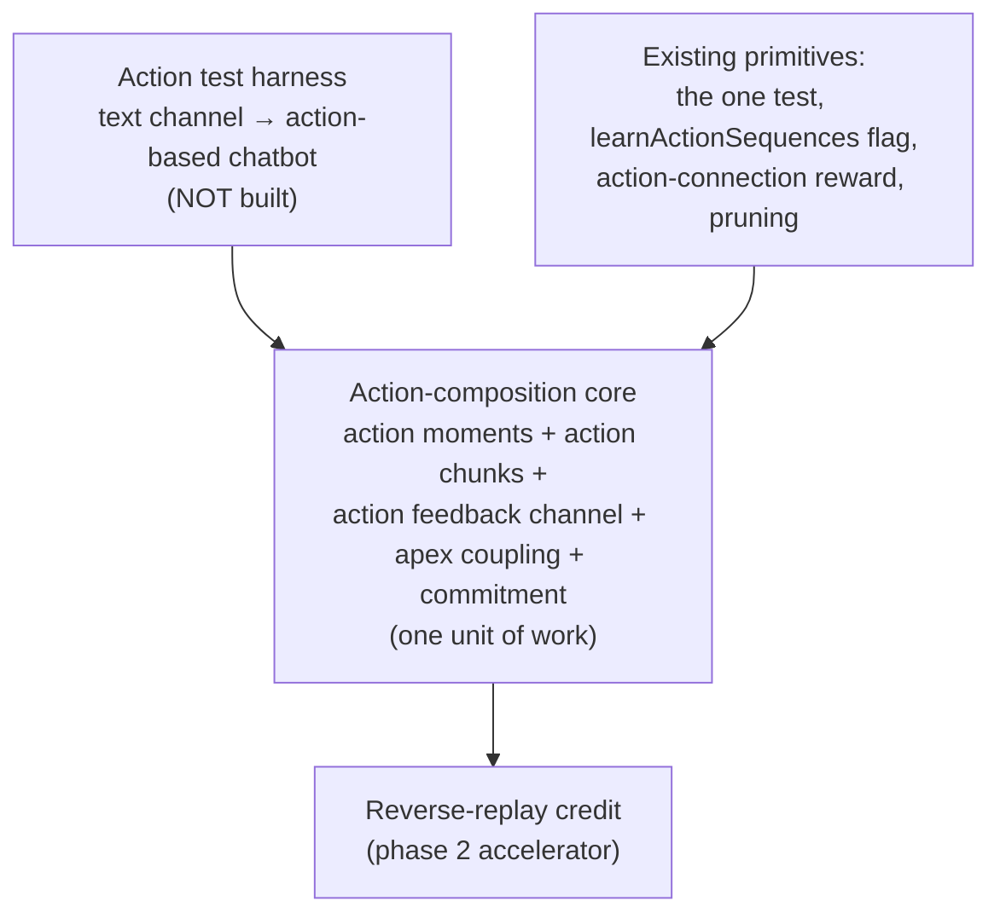

# Action Composition

How the action hierarchy grows by the **same machinery** as the event hierarchy, with two principles held
together: patterns are learned identically on both sides, and **structure forms within a modality while the
two modalities couple only at the apex**. This is **design, not yet built**.

The reward-distribution design is the independent companion to this one — see
[global-rewards.md](./global-rewards.md). The two meet at exactly **one** point: reward targets the apex
action, not base neurons.

> **Status: design only. Not built.** In the staged rollout it is the last port: spatial, then events, then
> this. Open questions are listed at the end; several are unresolved.

---

## Two organizing principles

### Principle 1 — one pattern mechanism, one asymmetry

Every neuron does the same thing: route on the half of its window that has already happened, describe that
window with an entry, and mint a child where the description fails and the child pays for its own storage
([algorithm.md](./algorithm.md), the one test). Actions are not a different kind of learning. The machine
**observes its own actions** — each action dimension carries what was executed — so an action is a symbol
read back the way a pixel is, and a pattern over actions is counted, collapsed and priced exactly like a
pattern over events. A dictionary line does not record which kind it is.

**The one asymmetry sits outside the pattern: events infer actions, and actions never infer events.** That
inference runs on reward, not on fit. Nothing else distinguishes the two hierarchies.

### Principle 2 — structure within a modality, coupling at the apex

This is the spine of the design, and it is symmetric:

- **Event patterns are built from events only.** An event pattern is a spatial or temporal composition of
  lower events, down to sensory. It never mints from actions. Separately, once the level loop settles,
  **apex events vote actions**.
- **Action patterns are built from actions only.** An action chunk is a spatial or temporal composition of
  lower actions. It never mints from events. Separately, **apex events couple to apex actions**, so a high
  event can invoke a high action.

*Structure* forms inside each modality; the modalities touch **only at the apex**, through the event→action
vote. Chunk identity is action structure. Chunk relevance is the apex vote. Keeping them apart is what lets
a chunk form before it has any reward advantage, and lets a well-formed chunk be abandoned when its reward
stops paying.

---

## The two regimes, per modality

Each modality runs the spatial pass and then the temporal one. Spatial (offsets all zero) produces the apex
set that seeds temporal; temporal builds patterns over chunks of spacetime from there.

| | spatial (offsets all 0) | temporal (offsets spanning) | temporal input |
|---|---|---|---|
| **Events** | sensory co-activation → **event moments / spatial corrections** | chunks across frames → **event patterns** | apex events |
| **Actions** | action co-activation → **action moments** | chunks across frames → **action chunks** | apex actions |

The action side has been missing its spatial pass. It needs one, for the same reason events do.

---

## Action spatial processing (action moments)

Just as event spatial processing groups co-firing sensory pixels, **action spatial processing groups
co-firing actions into action moments** — a simultaneous action bundle, e.g. turn-and-accelerate. The output
is the apex action set: every action-fired neuron not subsumed by a higher-level action activation this
frame. These apex actions **are the action-temporal level-0 neurons**, exactly symmetric to how apex events
seed event temporal processing.

**Single-channel degeneracy (flagged).** When the action output is a single channel emitting one token per
frame, action spatial is trivial — one action is its own apex, no bundle to form. Action moments are a
meaningful pass only for **multi-channel actuation**, a robot with several actuators firing together. In
single-channel text the interesting structure is purely temporal chunk formation. See open question 3.

---

## Action chunk formation: action → action

Once the apex actions exist, chunks form over actions only, by the ordinary mechanism:

- An apex action's window holds the apex actions around it — those in the frames behind it and those in the
  frames ahead of it, at the offsets where they recur. It routes on the half that has happened, and its
  entry's description of the rest is scored as those frames arrive.
- Where the description keeps failing and a candidate chunk would save more than its storage costs, an
  **action chunk** is minted one level up. It then forms its own window over apex actions at that level. The
  action tower grows the way the event tower does.

**Chunking is not habit formation.** Grouping actions into a pattern is compression and nothing else: a
recurring action sequence costs less as one symbol than as its parts, and that saving is the entire reason a
chunk exists. A habit is a different object living on the value side — an event→action connection
strengthened by repeated exposure. Structure says *which actions are one thing*; value says *which of them
is worth doing*. A chunk that forms is not thereby preferred, and a chunk that is preferred did not thereby
form.

**Mint by structure, survive by value.** Minting is gated purely by description error and the one test — the
outcome never enters the chunk's structure. Value enters only afterwards, as reward on the action
connection, and a chunk that stops paying for its storage is deleted by the ordinary margin test.

---

## Coupling: apex event ⇄ apex action

For a high event **E** to invoke a high action chunk **P**, there is exactly one link, and it is the
**apex-event → action vote** pointed at a higher-level target. There is no structural binding from events
into action patterns.

- **E → P is the forward value vote.** Apex events vote actions
  ([column.rs](../brain/brain-core/src/column.rs), `learn_action_connections`, reward-smoothed). Once a chunk
  `P` exists as a votable target, an apex event forms an action connection to it the same way it forms one
  to a base action.
- **The outcome never enters P's structure.** It only weights the connection, scored by reward.

**Why the apex event wins the link, and not a flickering base event.** `P` has temporal extent. Across its
span base events flick on and off, but `E` is the one token whose activation **co-extends with the chunk's
entire span** — that is what made `E` apex. So the reward-scored association `E → P` is the lowest-variance
one available, while `base → P` links are noisy boundary artifacts that stop paying and are pruned. Actions
bind to the event level whose temporal extent matches their own, automatically, because only same-extent
tokens reliably co-occur across the whole span.

### The coupling offset (load-bearing timing detail)

An emitted action does not couple to its event in the same frame, because **an action is observed one frame
after it is chosen**: `aₜ` is emitted at the end of frame `t` and feeds back as an active input at frame
`t+1`. This produces a one-frame offset between the apex event that *voted* an action and the frame where
that action is *processed*:

- **E → base action: immediate.** The vote `Eₜ → aₜ` is recorded at the end of frame `t`.
- **E → chunk: deferred and span-accumulated.** A chunk `a₁a₂a₃` is not recognized until its constituents
  have fed back and action temporal has described the whole sequence. By then the voting events are several
  frames in the past. The binding lands on the correct event **only because the apex event co-extends the
  chunk's span** — it is still identifiable across the offset, so the same `E` that voted the parts is
  present to bind the whole. Transient events that happened to be apex on some frame do not span the chunk,
  so they get weak, noisy links that get pruned.

So "when do we connect apex actions to apex events" has a precise answer: **continuously — every frame the
fed-back apex action co-occurs with its co-extending apex event the link strengthens — but the chunk-level
binding only finalizes once action temporal recognizes the chunk, and it is correct only because
co-extension carries the right event across the one-frame feedback offset.** It is a span-accumulated
binding, not a single-frame wiring.

---

## Per-frame processing order

The two modalities run as a **pipeline offset by one frame**. The event chain processes "now" and produces
this frame's action; the action chain processes the action emitted last frame, now fed back. Action spatial
and action temporal need *nothing* from this frame's event temporal — they depend only on the fed-back
action plus action history — so they are independent of the event chain within the frame.

```
frame t:    event spatial            sensory_t            → apex events
            action spatial           a_{t-1} (fed back)   → apex actions
            event temporal           apex events + ctx    → settle, mint event patterns
              → vote: apex events vote actions → emit a_t  (feeds back at t+1)
            action temporal          apex actions + ctx   → settle, mint action chunks
              → coupling: co-extending apex event ⇄ apex action, span-accumulated,
                          finalized when the chunk is recognized
```

**The fed-back action stays on action channels — it is never mixed into the sensory stream.** This is
required by the modality symmetry: if the action fed back as a sensory activation, event spatial could group
it with pixels and the two spatial passes would cross-contaminate. Keeping it on action channels guarantees
event spatial only ever groups events, and action spatial only ever groups actions.

---

## Why the high action beats its constituents (value side)

Formation is structural. This is the opposite end — exploitation, value — and it is about why a *formed*
chunk `P` ever out-votes its parts. A high event `E` migrates its vote from base action `a` to chunk `P` only
if `P` earns **higher conditional reward** than `a`-repeated, and it does so through **commitment**: if `E`
re-decides every tick, the full sequence never reliably assembles and the chunk's reward never lands cleanly.

**Commitment partly falls out of the apex event's co-extension.** Because `E` co-extends `P`'s span, `E`
persisting across the span naturally holds `P` across the span — the per-frame primitive emission is the
parent chain unrolling under a stable apex. So commitment *to a single chunk* is largely a consequence of the
apex event's temporal extent, not a separate arbiter. What does **not** fall out is **arbitration between
competing chunks**: who holds the floor, what counts as a strictly higher-value interrupt, how a breach hands
control back up. That part still needs explicit call-stack discipline.

This is distinct from formation: a chunk can **form** before it has any reward advantage; commitment is what
later lets it **win**.

---

## Structure and value are two different learnings

They run on different evidence and must not be collapsed into one account:

- **Structure, within a modality.** Apex actions describe their action windows and mint chunks where
  description fails and the chunk pays. This is composition — *which actions are one thing* — and it is
  action→action only, priced in symbols.
- **Value, across modalities.** Apex events vote actions; with no action connection the channel default
  fires; reward lands on the connection. This is selection — *which action pays* — and it is the `E → P`
  coupling once `P` exists.

They feed each other: description proposes structure, reward scores it.

Two clarifications that keep this honest:

- **Recognize bottom-up, execute top-down.** A chunk is recognized from its constituents but performed by
  expanding into them, at the time distances its structure recorded. The coupling `E → P` is likewise
  *learned* after recognition, span-accumulated, but *used* forward: next time `E` fires it votes `P`, which
  unrolls to base. Keep the two read directions explicit or consolidation and rollout will be confused.
- **Reverse replay is an optimization, not a precondition.** Ordinary exposure already builds structure,
  slowly. Reverse replay propagates credit in its native direction, outcome → cause, faster and cleaner, but
  composition can form without it. Build the core first; add reverse replay only once chunks demonstrably
  mint.

The biology rhymes, but resemblance to biology is orientation, not justification.

---

## Causality: correlation filtered by reward

Structure on its own yields **correlation**, not cause. An action chunk names whatever reliably co-occurred
with an action, including antecedents that were merely co-present — the description is honest about the data
and says nothing about what made what happen. What refactors correlation into causality is the reward channel
acting as a filter: a spurious antecedent does not reliably track reward across contexts, so its connection
stays weak and is pruned, while a genuine cause persists. **Structure becomes causation by surviving the
reward filter, not by being the right description on its own.** This is also the answer to the
branching-factor problem in open question 1: the graph of what-preceded-what is bushy, and reward is the
pressure that prunes it toward the causal skeleton.

---

## Minimal implementation, reusing what exists

| Piece | New or existing | Notes |
|---|---|---|
| Mint trigger | **Exists — same test, both modalities** | A child is requested on nonzero served error and minted when its benefit exceeds `1 + \|C\|`. Action chunks use it unchanged. No separate operator, no action-specific threshold. |
| Action participation toggle | **Exists (dormant)** | `learnActionSequences` channel flag — `false` in every encoder today. The on-ramp for action pattern learning. |
| Action-connection reward / **E → P coupling** | **Exists** | `learn_action_connections`, reward-smoothed. The **value** channel — and the apex-event→apex-action coupling is this same vote pointed at a higher-level target. Reward targets the **apex** action, not base neurons — see [global-rewards.md](./global-rewards.md). |
| Pruning | **Exists — also the causality filter** | Entries whose benefit stops covering their storage are deleted, and the same pressure thins spurious antecedents toward causality. |
| **Action-moment neuron (spatial)** | **New** | Simultaneous action bundle. The action side's spatial pass; produces apex actions. Trivial for single-channel output; real for multi-channel actuation. |
| **Action-chunk neuron (temporal)** | **New** | A chunk of action spacetime, minted over actions only. |
| **Action feedback channel** | **New** | The emitted action `aₜ` re-enters as an active input at `t+1` **on action channels**, not mixed into sensory, so the two spatial passes never cross-contaminate. |
| **Commitment / call-stack arbitration** | **New (narrowed)** | Single-chunk commitment largely falls out of apex-event co-extension. What remains new is **arbitration between competing chunks**: an active chunk holds the action channel down to its level, interruptible only by breach or a strictly higher-value option. |
| **Reverse-replay credit pass** | **New (phase 2)** | Accelerator on credit propagation, in its native outcome→cause direction. Build after the core forms chunks. |

---

## Expected developmental order (curriculum, not a bug)

A chunk cannot bind to action antecedents that do not yet exist, and cannot couple to an event that has not
abstracted, so structure lags the hierarchies it grounds on:

1. Events abstract — the event hierarchy grows and provides the apex events that will couple.
2. Apex events vote actions; actions fire, feed back, and collect reward on their connections (value).
3. Fed-back apex actions describe their action windows; on repetition the description sharpens, and where a
   chunk pays for its storage it mints (structure).
4. The chunk forms its own window one level up; meanwhile the co-extending apex event accumulates the
   `E → P` coupling, and high-to-high invocation takes over from base routing.
5. Reward and pruning thin spurious antecedents, refactoring the structure toward causality.

Do not expect, or force, action composition before the antecedents and apex events it grounds on exist.

---

## Dependencies



- **Test harness — the real long pole.** No current domain exercises action composition. Stocks have one
  binary action per channel (`actions: [-1, 1]`) — a chunk of buy-buy-buy is trivial. MNIST runs actions off.
  **Plan: convert the text channel from passive next-token prediction to action-based output — effectively a
  chatbot — so emitting tokens becomes a multi-step action sequence with consequences.** Whether
  next-token-as-action produces a *composable* hierarchy, versus still one action per frame, is itself an
  open question below.
- **Co-dependent core.** Action moments, action chunks, the feedback channel, apex coupling and commitment
  are not separable — none is meaningfully testable without the others. Build and test as one unit, behind
  `learnActionSequences`.
- **Reverse replay is downstream of the core**, not a precondition.

---

## Open questions

1. **Branching factor — the causality crux.** Many things precede any given action, so the graph of
   antecedents is bushy and will try to explode. The design answer is
   [Causality](#causality-correlation-filtered-by-reward): reward-weighting plus pruning thin the bush toward
   the causal skeleton. Open empirically: does the pruning actually converge? Instrument it.
2. **Arbitration between competing chunks.** Single-chunk commitment falls out of apex co-extension, but a
   committed chunk must still suppress competing chunks and its own constituents' votes within its scope.
   The call-stack discipline — who holds the floor, what counts as a strictly higher-value interrupt, how a
   breach is detected — is unspecified. This is the largest hole in the design.
3. **What is an action moment in the text domain?** A single output channel emits one token per frame, so
   action spatial degenerates. Is there a simultaneous action bundle at all, or does the moment pass only
   matter for multi-channel actuation?
4. **Does next-token-as-action actually compose?** The criterion for "this token sequence is one chunk" is
   defined — the one test over actions — but whether single-channel text *exercises* it, versus degenerating
   to one action per frame, is open. A short-credit-latency control domain may exercise composition far more
   cleanly than a chatbot; see 5.
5. **Credit latency in the chatbot setting.** Reward may arrive many tokens after the actions that earned it.
   The [global-rewards](./global-rewards.md) linear decay keeps nonzero credit on distant frames, but: how
   far back does credit usefully propagate, and does reverse replay become a precondition rather than an
   accelerator once latency is large?
6. **Canary metrics against pattern explosion.** Minting is not reward-throttled — mint by structure, survive
   by value — so nothing slows aggressive minting except pruning. Instrument **top-level action mint rate**
   and **deletion churn** as early-warning signals before trusting any of this.
7. **Can the developmental order be observed?** If the curriculum — events abstract, actions fire and earn
   reward, chunks mint, `E → P` couples, causality pruning — doesn't appear in instrumentation, the mechanism
   isn't doing what the design claims.
8. **The coupling offset across the feedback delay.** The `E → P` binding must span the one-frame gap between
   the apex event voting an action and that action feeding back. The design relies on the apex event
   co-extending the chunk to carry the right event across the offset. Confirm in instrumentation that
   co-extending events win the coupling and transient events are pruned — if transient events capture
   couplings, the offset handling is wrong.
9. **Moment → chunk granularity and upgrade.** A pattern measures action-distance in frames; a moment
   measures it in moment-hops, spanning an inter-salience interval, and should credit a *chunk*. At mint time
   the chunk may not exist, so a fresh moment likely binds a primitive sequence at coarse Δt first and must
   **upgrade** to the chunk once it exists. The upgrade trigger and re-pointing rule are unspecified.
