# UCAR — theorems and commentary

Everything here elaborates [algorithm.md](algorithm.md) and none of it is normative. **T** is a theorem: a
claim that follows from the definitions and rules, stated with its argument. Everything else is commentary —
why the design is shaped the way it is, what the alternative would have cost, and worked examples. Items are
keyed by the D, R or section they belong to, in the order the specification introduces them.

---

# 1. The machine

**On D2 — why a child sits at offset zero.** A neighborhood is written relative to the parent's firing, so the
child sits at offset zero by construction. A centroid over what the child covers would leave the level above
differencing coordinates from origins its neighbors were never measured against.

**On D4 — a neighborhood is a box.** Adjacency is a conjunction, so something far away in one dimension is not
a neighbor however close it is in another, and no dimension can rescue what another has ruled out.

**On D4 — receptive fields grow with depth two ways at once.** Through composition, because a neighbor is itself
a chunk. And through the reach, because each level's units are sparser than the one below and have to reach
further to find each other at all. Neither is declared per level: the first is what a pattern *is*, and D14
derives the second from the first.

**On D4 — why adjacency is not declared.** A conjunction over shared activation dimensions already says
everything a visibility declaration would, and it says it without a table to maintain: what a channel is laid
out over settles which channels it can be adjacent to.

**On D5 — many firings per coordinate.** The base bound is the input's: one symbol per channel at each point
of its layout. Above the base there is no bound at all, because a neuron covers its firing with a set of
patterns and each of them may promote a child (R18). What replaced the bound is not a weaker version of it but
a different kind of rule — the only exclusivity left is credit (D7), and credit is about paying, not naming.

**On D5 — the two halves are simultaneous, not sequential.** An action is not a reply appended to a frame.
Reading it as one puts the action a frame later than it is and breaks every offset measured across the two
sides.

**On D6 — ages in a single neuron.** A neuron active at frames 10 and 12 is at ages 0 and 2 in frame 10 + 2,
then 1 and 3 in the next, and so on.

**On D6 — an activation is one firing, not a state.** It decides everything it will ever decide in the frame
it fires, on a backward half that is already whole (D17). What it does afterwards is accrue and speak. Accrual
is transcription rather than judgement — the arriving neighbors and rewards go into the firing, where the
*next* expansion reads them. Speaking is reading the neuron's own forward record, and it changes nothing the
neuron holds.

**On D6 — why one extra frame.** The window is `reach_t` frames of forward neighbors, and the activation is
open one frame longer than that for a single reason: the action recorded at offset `reach_t` is paid for at
`reach_t + 1` (R29), and a reward that lands after the activation closed would have nowhere to go. The extra
frame is derived from the three-frame chain, not chosen.

**On D7 — three consequences of having no rest value.**

- **Blank regions cost nothing** — no activation, no history, no dictionary, no compute.
- **A frame is a set** — variable-size, containing only what happened.
- **Absence discriminates in one direction only** — a pattern naming a filled disk is measurably wrong on a
  hollow circle, because the interior neurons it names did not fire and each is charged (D16). The reverse is
  not an error: a circle-pattern on a filled disk covers what it names and leaves the interior in the residual,
  where it costs the same lines it always would. **What separates them is coverage, not penalty** — the
  disk-pattern covers more of the disk, so it wins the disk, and the circle-pattern is not charged for losing
  it.

**On D7 — where sparsity comes from.** Whether a 0 pixel is a black event or nothing-to-see is the encoder's
choice, made where the input is produced. A dimension where something always happens is simply always active;
nothing depends on sparsity, it only profits from it.

**On D7 — two units naming one neuron is not a defect.** The decoder expanding both gets the neuron twice and
the neuron fires once; a set does not care how many times it is told a member. What would be a defect is
paying two lines where one would do, and that is what exclusive credit prevents: a bid is worth only what
would otherwise stand as its own line (R23), so a unit whose only contribution is a neuron another unit already
delivers cannot clear its price. Naming is free, paying is exclusive.

**On D8 — what position-specificity would buy is fit, and that is what it costs.** One pattern serving every
position describes statistics that differ by position, so it fits each worse than a position-tuned pattern
would, and the neighbors it names wrongly are literally the charges in the file (D16). The dictionary half of
`L` falls and the history half rises. **R12 adjudicates exactly that trade**, pattern by pattern, and no price
anywhere changes for it to do so: an activation costs 1 before and after, because the alphabet loses precisely
the factor the coordinate gains.

# 2. The objective

**On D9 — why the file holds nothing about the future.** The forward half of a pattern used to be a claim the
file scored: a unit asserted what would follow, a wrong assertion was a correction, and the corrections were a
term of `L`. Three things were wrong with it. Nothing priced the corrections — no test read them and nothing
was ever retired for predicting badly — so the term sat in the objective and decided nothing. The bid had to
carry a half it could not be scored on. And a slot two units both predicted needed an owner, which needed a
resolution, which needed a second exclusivity beside coverage. Removing the claim removes all three. What is
left is a dictionary coder over the backward window, and what the machine expects next is an output it hands
to whoever is reading, scored there or not at all.

**On D9 — the file is not a log of how the machine got there.** A pattern that goes is not a line the file must
keep alive: the run is simply re-encoded without that symbol, and the frames it used to cover are expressed by
whatever the dictionary now offers, with charges where that is worse. An unbounded file costs nothing because
nothing was ever going to write it.

**On D11 — where compression is actually paid out.** A unit firing at `h` names `[h − reach_t, h]`, so writing
it discharges up to `reach_t + 1` frames of the run at once. That is why a wider reach is worth paying a wider
line for, and it is why the residual is free and a child is not.

**On D12 — why `covers` counts what turned up rather than what the pattern names.** Take a neuron `x` whose
pattern names `{a, b, c}` backward, in a frame where `a` and `b` fired, `c` did not, and an unnamed `m` did.

```
without the unit   state x, a, b, m                                            4 symbols
with the unit      1 for the unit, which expands to x, a, b, c
                   charges: turn off c;  m stands as its own line              3 symbols
                                                              true saving      1
```

`|O| − d = 3 − 2 = 1`, which is the saving. Now let only `a` fire, so `O = {a}` and `d = 2`: the file states
`x, a` for 2 symbols without the unit and pays `1 + 2` with it, a saving of `−1`, and `|O| − d = 1 − 2` gives
exactly that. **Counting what the pattern names would give `|e| − d = 3 − 2 = +1` and report a saving where the
file got longer** — `b` and `c` would be credited as delivered *and* charged as absent, netting nothing, so a
name that never fires would be free to hold. The two error types are the ones being told apart: naming wrongly
costs a symbol and delivers nothing, while a neighbor left unnamed costs its own line where stating it flat
cost a line, so it is free either way.

> **T1 — A fixed-length code is not a real file length, and no test can tell.** D10 prices a symbol at one
> however often it is used. That is not what a decoder pays: naming a symbol out of a dictionary that grows
> without bound (D3) costs about `log |alphabet|` bits, and that rises over the run. Write the true length as
> `c · L`, with `c` the bits one symbol name currently costs.
>
> **Every test reads the sign of a difference, never a length.** `margin = benefit − cost` (R12), and both
> terms are counted in the same symbols, so the true margin is `c · margin`. `c > 0`, so the sign is the same
> one. The dictionary term and the history term scale together because both are counts of the same symbols —
> if they did not, the constant would not cancel and this would fail.
>
> **So counting symbols and counting bits answer every question the machine asks the same way.** That is what
> buys the integer arithmetic: no estimator, no smoothing, no boundary correction anywhere that decides what
> structure exists. It is a property of a *fixed-length* code, and re-pricing the file by how often each symbol
> occurs gives it up — the constant stops cancelling and probabilities do set costs, which is why
> [forgetting.md](forgetting.md) is a document of its own.

**On D12 — the two sums are what the two mechanisms work against, and that is the whole division of labor.**
The election works on the history half over a given dictionary — it is priced in exactly that sum, for the
frames it can see, though it does not minimize it (§11.3). The one test decides the dictionary half, pattern
by pattern (R12). Neither can do the other's job: the election cannot create or destroy a symbol, and a neuron
cannot see what its symbol saved.

**On D12 — two readers, two numbers, and why that is economics rather than an inconsistency.** The neuron is
deciding what to hold and what to offer, over every situation it has been in; the machine is deciding what to
buy, for the one window in front of it. The neuron's number says whether a pattern pays over its own history;
the machine's says whether a bid pays on a board where earlier frames' credit stands and other neurons' bids
contend. A pattern the neuron holds because it pays in most of its firings can lose at the election in this
one, and a pattern the neuron's own cover passed over can be the machine's best purchase, because the machine's
residual is not the neuron's (R18, R22). An earlier draft tried to make the two numbers agree — the bid was
worth "exactly what its entry was taken on" — and the claim was false the moment a past neighbor was already
covered. The two are different by design, and the honest statement is that neither ever reads the other's.

**On D12 — why the neuron can compute what a pattern is worth.** It knows what the file pays for a firing with
the pattern in its cover and what it would pay without: both are counts over the firing, and the neuron holds
what every firing gives every pattern it has (D21). The difference between the two is the whole of the benefit,
and it is a fit against the neuron's own evidence. What it never needs is the file — a length nothing computes
cancels out of a difference (R12).

**On D12 — conservative, and in a stated direction.** The line is paid once over the whole run, so a pattern
that pays for itself within `H` of its neuron's own firings pays for itself many times over in the file. The
test asks for the stronger thing. What it therefore drops is structure that still describes the run but has
stopped describing the neuron's recent situation — which is the adaptation D24 is for, not an error in the
estimate.

**On D12 — one baseline, two populations.** Every test asks what the file pays with the neighborhood against
what it pays without. Without it, each neuron it held goes to whatever else names it — another pattern of the
same cover, or another accepted bid one level up — and otherwise into the residual, where it costs the line it
would always have cost. **The flat file is not a second baseline**; it is what that question returns when
nothing else names the neuron.

What is left between the two tests is the population and the line. R12 sums over the `H` firings in the ring
and charges `1 + |e|`; R21 sums over one frame and charges nothing, because the line was already weighed where
the pattern lives.

**On D12 — why `L` never appears in the arithmetic.** `L` is what the differences are differences *in*; it is
the reason the arithmetic is the arithmetic, and it is never a term in it.

**Why a neuron's history states nothing.** It is evidence, not an encoding: it records what was seen so the
collapse can center on it (R4), and a decoder never reads it. The one place a price is needed — does this
pattern earn its dictionary line — is a drop in `L` the neuron works out for itself, over its own evidence, and
nothing crosses between scopes to correct it. What that costs is stated in
[algorithm-evaluation.md](algorithm-evaluation.md): a neuron whose territory another unit reliably takes keeps
pricing its patterns as if it did not.

# 4. Neighborhoods and distance

**On D13 — a pattern is a name for a chunk of spacetime.** One pattern-learning algorithm and one kind of
pattern. There are four types only in the sense that two declarations cross: an **offset** may be zero or
spanning in any activation dimension, which is spatial against temporal, and a **neuron dimension** is event or
action. Neither is a separate mechanism. Spatial is a setting of the reach, and an offset does not know which
kind it is. Event and action are not separate for a plainer reason than it looks — the machine observes its
own actions, since each action dimension carries what was executed, so an action is a symbol read back the way
a pixel is and a pattern over it is learned by the same counting. **You could not tell from a dictionary line
which of the four you were holding.** The one asymmetry lives outside the pattern: an action is chosen and an
event is only expected (R35).

**On D13 — siblings at offset zero.** Several children promoted at one coordinate are activations of different
neurons at the same place, and above the base they see each other at offset zero in every component. That is
what lets the level above chunk them: two patterns of one neuron that keep being bought together are, one
level up, two neighbors that keep co-occurring, and a pattern over the pair is the merge the neuron itself
cannot build (R14).

**On D14 — why the reach doubles.** Each level holds at most half the activations of the one below (T11), so
its units stand twice as far apart, and the box has to double for the expected number of neighbors — a level's
density times the volume of its box — to stand still.

**On D14 — both ends are pinned by what is already given.** The declared alphabet fixes the bottom.
`log₂N₀` levels of halving take `N₀` active neurons down to one, and at that depth the reach expression returns
a reach spanning the whole active region — so nothing has to state that the apex should see everything.

**On D14 — why every dimension grows by the same factor.** The thinning factor comes from a level's activation
count, and a level has one of those, so the schedule cannot tell the axes apart. Growing them all by the same
factor is the isotropic solution and the right default when nothing distinguishes them. Data that chunks harder
along one dimension than another thins faster there and would want that dimension's reach to grow faster;
measuring spacing per dimension instead of one count per level is what that would take, and whether it is
worth it is open ([algorithm-evaluation.md](algorithm-evaluation.md)).

**On D14 — the buffer, walked through.** With a reach of 1 — the base — a firing at frame 10:

```
                 frame 10        frame 11        frame 12
   buffer        [ 9 10]        [10 11]         [11 12]
                      ▲              ▲
   activation       fires        +1 lands       reward for +1
   at frame 10   newest edge    into the firing  lands, closes
                   sees −1
```

The backward half is read at the newest edge and never again; the buffer's only other job is to be the
frames the next firings read their own backward halves from.

**On D15 — what made coarse offsets safe.** One neighbor per offset was a consequence of atomic offsets,
never a rule. Logarithmic offsets make reach exponential in the alphabet, which is what makes the reaches D14
schedules affordable to write down at all. Neither end of the offset alphabet is told which to use, and
neither declares anything (R4).

**On D15 — how the decay plays out.** A level whose units stand one position apart uses the exact end and
votes the coarse offsets away for want of a majority; a level whose units stand twenty apart does the reverse.

**On D16 — the price is not a notion invented for matching.** It is literally the symbols that would follow
the activation in the file: a neuron named and absent has to be turned off, and that turn-off is the whole of
what a neighborhood is charged. A neuron that fired and nothing named costs one line whether or not the
neighborhood exists, so it is charged to nobody — which is why the residual is a term of the firing and not of
any pattern.

**On D17 — the split is availability, not meaning.** A firing sees both directions, and a pattern is minted
after its chunk has been seen. Covering is simply what cannot wait. This binds action neurons no less than
event ones: an action neuron fires when its action executes and accrues its forward half the same way.

**On D17 — the forward half is the child's, not the parent pattern's.** An earlier draft kept the forward half
on the pattern: the collapse over what followed every firing the pattern covered, read by the child when the
child stood on the apex. Three things argued for moving it to the child's own ring. The child exists in
exactly one situation — its parent's pattern was bought — so its ring is already the record of what that
situation was followed by, with no pattern needed to condition it. The child's record is in its own level's
alphabet at its own reach, so the top of a stack expects at the widest reach the stack has, where reading the
parent's pattern would have it expect at the reach of the level below. And the pattern's population was
looser: it summed every firing where the pattern applied in the parent's own cover, bought or not, and
applied-but-not-bought usually means something else described the chunk better, which is a different
situation. What it costs is that a newly minted child's record starts empty and fills only as it is bought,
where the pattern would have carried a future over from before the mint; but under the earlier draft that
future was never read until the child was bought either, so the head start was small.

**On D17 — the base speaks its marginal.** A base neuron on the apex has been recognized as nothing more
specific than itself, so its own record — what follows the symbol over every situation it fires in — is the
best expectation anything has for it in that frame. It is coarse, and it is silenced the moment something
more specific is bought over it (D7). The alternative, the base expecting nothing, left the machine mute and
its exploration stalled until the first pattern was bought, which was a real gap.

**On D17 — siblings.** Two children promoted at one coordinate are two neurons with two rings. While they are
always bought together their rings see the same forward neighbors and their records agree; the first time one
is bought without the other, they diverge. Where they never diverge, the level above sees them as two
neighbors at offset zero that always co-occur and merges them (§4).

**At `R_t = 1` the vocabulary collapses.** `O⁻` **is** `O` backward, nothing is in flight, and the forward call
delivers one frame. Contraction loses its cross-frame contention, since every bid spans one frame. Read the
document with the temporal parts struck out and it is the spatial algorithm, unchanged — the whole machine, not
a stage of it, which is what makes a reach a configuration rather than an architecture.

**On R1 — nothing waits.** An earlier design held every structural decision open until the forward half had
landed, on the argument that a child names a whole span and half of it had not happened. But the half that had
not happened was never a term in either test. A neighborhood's forward half is measured rather than chosen
(D17), so waiting for it bought nothing and cost the entire apparatus of commitments, horizons and provisional
answers that used to sit between the two ages.

**On R2 — prices and structure move at the same moment and are still different kinds of thing.** Both move
when a neuron fires, because that is where counts move and where both tests run (R13). But a price is
re-derived from whatever the table currently says, while a structural move — adding, retiring (R15, R17) — is a
decision that stands until something reverses it.

# 5. State

**On D18 — why the two objects can never be one.** Being a center (T2), a neighborhood is typically a set no
firing ever was.

**On D20 — why the record holds no absolute time.** Expiry was the frame number's only reader and expiry is a
FIFO depth (R9), so the record has nothing absolute in it but the `position`, which the machine supplied when
it called — and which no comparison, price, count or vote ever reads.

**On D20 — why there are no bins.** An earlier design grouped firings by identical backward half and gave the
group one cover, on the grounds that R18 reads the backward half and nothing else, so equal inputs get equal
covers. R6 breaks that: a firing keeps the cover it has unless a re-derived one is strictly cheaper, so two
firings with one backward half can hold different covers depending on what the table was when each was folded.
The group could no longer share, so the group is gone. Nothing was lost but a cache — every sum the tests need
is a sum over firings either way (T3).

**On D20 — why two records became one, on the neuron.** The design used to keep forward tallies on the
pattern and connections on the neuron: per-slot counts of what followed, and per-age estimates of what an
action was worth. Both were indexed by a forward offset and a neighbor, and the distance a connection was held
at was exactly the offset the action fired at. So the connection was a forward neighbor that happened to be an
action, carrying one more number. D20 says so: an action slot is a forward neighbor with a strength and an
estimate, the event slots sit beside it in one record, and the record is the neuron's over its own ring — which
is where the connections always were.

**On D20 — sets, not weights.** An event slot is in the expected set or not, by majority over the ring, and
the count behind it is a count over H firings. A record that instead kept every neighbor that ever followed,
with a weight that only ever grew, would answer a changed world at the rate the weights could be outgrown,
which is unbounded; a majority over the ring answers within H of the neuron's own firings, because everything
older has left. The count still travels down with the expansion as the vote's strength (§13), but it is read
off the ring and it leaves with the ring.

**On D21 — why handover is arithmetic.** What a firing holds against each pattern is the index R6 says nothing
has to be added to — a pattern that moved recomputes what it covers in each of them, and every firing reaching
for it is current again. A firing's share moves whole, so a pattern joining or leaving a cover transfers its
share in `O(offsets)`. The offset grid grows with the level, since D14's reach does, while the number of
neighbors in it stays fixed by construction — that is the invariant the reach is chosen to hold.

# 6. Counts, the collapse, re-centering

> **T2 — The collapse is the per-slot minimizer of the pattern's margin over its population.** Over the
> firings a pattern covers, naming a neighbor moves the summed margin by `+1` wherever that neighbor was in the
> residual — one more neuron covered — by `−1` wherever it did not fire — one more symbol charged (D16) — and by
> `−1` once, for its place in the line (D10). Where another pattern of the same cover already holds it,
> nothing moves at all: no `covers` to gain, no `price` to pay. So the population for that slot is the firings
> of the first two kinds, and the neighbor pays exactly when `2 · count − n − 1 > 0`, which is R4's rule. The
> slots are independent, so the per-slot rule minimizes the sum. It is a *center*, not a medoid: synthesized,
> possibly a set the neuron has never seen. That is the point — it is the typical neighborhood, not a sample
> of one.

**On T2 — why a centroid will not do.** A centroid over sets is a fractional vector, which is not a set, cannot
be written into the file, and has no symmetric difference. The counts **are** the fractional object; the
collapse is how the design gets from it to something the decoder can expand.

**On R4 — why the line is in the slot rule.** An earlier draft took a slot at a bare majority and charged the
dictionary line only in the add and retire tests. That left the per-slot decision off the objective by exactly
one: a neighbor present in half the population plus one was named, and cost the line a symbol for a net of
zero. Charging the line where the slot is decided makes every slot decision a strict descent on the margin,
which is what T6 needs, and it removes the last place a neighborhood could grow at no gain.

**On R4 — why the slot holds at equality.** With the line charged the boundary is `2 · count = n + 1`, and at
that boundary naming and not naming cost the same. A rule that dropped the slot there could re-add it next
bill when one firing moved and drop it again the bill after, walking a plateau forever without ever lowering
the file. Holding what it had makes a plateau a fixed point, so a pattern that has stopped improving stops
moving.

**On R4 — the third case is why abstention exists here and nowhere else.** A firing is never allowed to sit
out a question the design is asking it; this one it has already answered, for that slot, by having the
neighbor covered.

**On R4 — why the forward rule is different.** A forward event slot is charged nothing: it is not in the line
and not in the history (D9). So there is no line to break even against, a bare majority is the whole of the
question, and there is nothing to hold at equality because nothing rests on it. An action slot is not
collapsed because selection wants the whole set, estimates included, and a majority would throw away exactly
the alternatives the walk is for (R37).

**On R4 — uniqueness is not assumed and is no longer guaranteed.** At the base, an offset naming one position
holds one neuron of a dimension (D5), so those counts sum to at most `n` and only one can clear the half. Above
the base several units may fire at one coordinate, so several can clear it and the neighborhood names them all
— which is D15's coarse-offset case arriving for a second reason. `|e|` counts them, and nothing else in the
design had to change for it.

**On R5 — three consequences, and they are the point of the design.**

- **Neighborhoods track their demand.** A pattern created on thin evidence is pulled toward its cluster.
- **Coincidence is voted out.** A neighbor present once loses its majority to silence and drops out.
- **Reach emerges.** Offsets where nothing recurs fall away. How far a pattern reaches is discovered, not
  declared. The radius bounds it; it does not set it.

**On R5 — why once per bill and not twice.** An earlier draft re-centered after the fold and again after the
add and retire, because the cover was a partition R18 made fresh every time, and a pattern joining or leaving
moved every other pattern's share. R6 holds covers, so a pattern added this bill joins a firing's cover only
where that is cheaper, and a retired pattern's firings re-derive once. What those moves do to other patterns'
counts is real, and it is re-centered at the next bill. Re-centering it now would decide the center on the
order the two moves happened to run in, which nothing else in the design is allowed to read.

**On R6 — why covers are held.** R18 is greedy, and a greedy cover re-derived after a pattern moved can cost
more than the one that stood. In Lloyd's algorithm the assignment step is exact, so re-assigning after the
centers move can only help. Here it cannot be exact — an exact cover is set cover — so the design keeps the
old assignment unless the new one is strictly better. That is one comparison over numbers the neuron already
holds, and it is the difference between a bill that descends `L` and one that can raise it (T6).

**On R6 — why nothing is indexed the other way.** What each firing holds against each pattern is already the
index (D21), so a reverse map from pattern to the firings it covers would be a second copy of the same fact.

**On §6.2 — why a set and not a distribution.** Covering needs a set. So does the file: every slot it states
holds one symbol or nothing.

# 7. The history

**On D24 — one count, so one denominator.** What R12 needs is not a shared clock but a shared divisor: a
pattern's benefit is a sum over the firings it covers, and for two neurons' tests to mean the same thing that
sum must be over comparably much evidence. A uniform `H` gives that directly. A shared *window* gave it only
for neurons firing at similar rates, and gave a rare neuron almost nothing to decide on.

**On D24 — this is adaptation, not forgetting.** A neuron that keeps firing sheds its old firings as new ones
arrive, so patterns describing a situation that has passed stop being taken into covers, drain their benefit
and are retired (R17). A neuron that falls silent sheds nothing: it holds its `H` firings and its patterns
intact, indefinitely, and resumes from them when its situation returns. An active neuron adapts exactly as
fast as its evidence turns over, and a silent one simply waits.

**On D24 — `H` does three jobs.** It is the memory, it is R12's selectivity — double it and every pattern's
benefit roughly doubles against an unchanged line, so more survive — and it is the rate at which the stack
deepens (T13). One number, three effects, all monotone in it, and it should be tuned knowing that.

**On R7 — duplicates die in the table, not the market.** Two patterns with one neighborhood are taken into a
cover older first, so the younger holds nothing anywhere and retires. The market would kill the younger too —
the election ties to the older symbol (R23) — but the neuron never hears the election's verdict, so the table
has to be able to do it alone, and it can.

> **T3 — Counts are sums over firings, and nothing reads a firing whole but eviction.** Re-centering sums a
> pattern's assigned neighbors over the firings it covers, both tests sum margins over firings, and the
> candidate collapses over a population of firings — every one of these is a per-slot count, and the per-slot
> counts are what a pattern keeps (D23). Forward, the same: a slot's count and an action slot's estimate are
> per-slot sums. Nothing asks whether `c` at `+1` came with `d` at `+2`. The one operation that needs a firing
> as a unit is removing it (R8), because a sum cannot say which of its terms was the oldest.

> **T4 — What covers is what was priced.** An earlier design chose a cover on the backward half and then priced
> the firing on the whole span, so the pattern that won the prefix could end up a worse describer than one that
> lost it, and no pass could reconcile them.
>
> There is nothing left to reconcile. The cover is chosen on `O⁻` and priced on `O⁻` (D17), so the pattern that
> took a neuron is the pattern charged for it, at every reading and for the life of the firing. **The forward
> half is never a term in that comparison**, so it cannot contradict it.

**On R8 — why records and not a summary.** A total cannot answer retirement: when a pattern goes, its neighbors
have to be re-covered from the table, which needs the firings and what each holds against each pattern — a
single number per pattern could not produce it. Keeping the ring is not a storage saving; it buys that both
tests scan distinct backward contexts and read pre-summed counts.

> **T5 — Every loop in the design is bounded, and none is capped.** A bill is five passes, each over a fixed
> set — the ring, the table, the slots — and none of them repeats until a condition holds (R19): one candidate
> is built by one seed and one collapse, one pattern retires at most. The election is two decisions and a
> settling, none of them repeated (R23). A retirement is collected within `reach_t(D) + 1` frames and takes
> its whole subtree in one step (R17). The level stack is bounded by the base activity behind a frame (T12) and
> by the run so far against `H` (T13), which together also bound the settlement walk (R24) and the depth of an
> expansion (R27). Every bound falls out of a quantity the design already counts, so nothing has to be chosen
> to make the machine halt.

**On R11 — the trade, stated plainly.** Structure is not dropped for being old; it is dropped for having
stopped paying against the last `H` things its neuron saw. A neuron in a changed situation restructures at the
pace of its own new evidence, and one whose situation has simply gone quiet keeps what it had. Absence of
evidence is no longer read as evidence the structure died.

**On R10 — why the alphabet is not a parameter.** A resolution defines what a base symbol *is*, so it states
the problem rather than tuning the algorithm. Everything about depth is derived: adjacency is the reach read
conjunctively, and the reach per level comes out of one expression.

**On R11 — there is no floor relating `H` to the reach.** There is no window for a span to be wider than: the
file is the run (D9), so every symbol is priceable at any reach.

# 8. The one test

**On R12 — the tests a symbol passes through, in one place.** The line brackets the symbol's life and the
elections fill in the middle. Every row is stated by the rule it cites; this is a reading aid, not a rule.

```
build     would what C takes out of the residual sum past 1 + |C|?      the line, prospectively   (R15)
cover     does this PATTERN take more of the residual than it costs?    one firing, no line       (R18)
offer     does more than half of this PATTERN fire?                     one firing, no price      (R18)
elect     does this BID cover more than it costs, once slots are split? one bid, no line          (R23)
retire    does what e still keeps out of the residual pass 1 + |e|?     the line, retrospectively (R17)
```

**Cover and elect are one expression** (D12) — what a neighborhood covers against what it costs to state —
asked over one firing and over the board. Build and retire are that same expression summed over the history
with the dictionary line added, read in opposite directions: what an absent pattern would take out of the
residual, and what a present one is still keeping out of it. The offer is the one row that is not a price, and
§10 says why.

**On R12 — a benefit can be zero for two different reasons**, and both are the signal. Zero because the
neighbors are already covered by another pattern of the same cover — no sharper child here would shorten the
file. Zero because the next pattern in line fits the firing just as well — the pattern duplicates something the
table already holds. A pattern accumulating either drags itself toward retirement, and neither needs a
mechanism aimed at it.

**On R12 — the movement of benefit is cheap.** A pattern gaining or losing a firing and a firing joining or
being evicted are `O(offsets)` off the counts; a re-center is the walk the scan is already making (R19).

**On R12 — a newborn needs exactly the bracket and nothing more.** Where its territory was residual, the slots
are free and it is bought on its first recurrence — no line at the election means no deadlock at birth. Where
its territory turns out to be another neuron's, the election declines it and the neuron never learns why; the
pattern stays as long as it pays on the neuron's own books, which is the trade
[algorithm-evaluation.md](algorithm-evaluation.md) records.

> **T6 — On a fixed history, the bill descends the neuron's file and stops.** Write the neuron's file over its
> ring as
> ```
> L_N  =  Σ over firings f  [ |residual(f)|  +  Σ over the cover of f ( 1 + |e⁻ \ f⁻| ) ]
>      +  Σ over patterns  ( 1 + |e| )
> ```
> the uncovered neurons, a line and its charges per covering pattern per firing, and the dictionary — D12 read
> over one neuron's evidence. Freeze the ring. Then each pass of R19 is non-increasing on `L_N`:
>
> - **Build.** Adding `C` changes `L_N` by exactly the negative of R15's margin: over the firings whose cover
>   `C` joins it removes what it takes from the residual and adds its line and its charges, and it adds one
>   dictionary line. `C` is added only when that margin is strictly positive, so `L_N` falls by at least one.
> - **Retire.** Removing `e` changes `L_N` by exactly R17's margin, with the sign reversed: its neighbors that
>   no other pattern of the cover names return to the residual, its lines and charges leave, its dictionary
>   line leaves. `e` is retired only when that is strictly negative, so `L_N` falls by at least one.
> - **Re-center.** For a fixed cover and assignment, `L_N` is a sum over slots of independent terms, and R4's
>   rule takes each slot exactly when its term falls (T2), holding at equality. So a re-center is non-increasing
>   and strictly decreasing whenever a slot changes.
> - **Re-derive covers.** R6 replaces a firing's cover only by a strictly cheaper one, which is the cost of
>   that firing in `L_N` falling. Nothing else moves.
>
> `L_N` is a non-negative integer, so the strict moves are finite, and the process reaches a state where no
> candidate pays, no pattern is negative, no slot moves and no cover is cheaper. That is a local optimum with
> respect to exactly the moves the neuron has. On a sliding history it tracks one, which is all that can be
> asked.
>
> **What the theorem rests on, and what happens without it.** Two things. The partition: with each present
> neighbor credited to one pattern of the cover, `L_N` decomposes over patterns and the re-center is a descent
> step. Without it a pattern's own fit and the file disagree wherever two patterns name one neuron — a
> candidate born on unmet ground can re-center onto ground another pattern holds, look better and better to
> itself, be worth less and less to the file, be retired, and be rebuilt from the same residual by the same
> seed. On a frozen history that cycles forever. And the hold on covers (R6): without it the greedy cover can
> cost more after a re-center than before, and `L_N` can rise. One more detail sits inside the hold: when a
> candidate is installed, a firing must be offered its held cover with the newcomer appended, not only the held
> cover and a fresh re-derivation, because the appended cover is what R15 priced and a fresh re-derivation can
> land between the two — cheaper than what stood, dearer than what was counted, with the dictionary line
> charged in full. With all three, the descent is monotone.
>
> **What it does not say.** Not that the optimum is global — choosing the pattern set is set cover, and the
> concrete local optimum is a history where `a, b, c, d` always fire together held by `{a, b}` and `{c, d}`,
> each paying, neither retirable, the merge never proposed because nothing is ever unmet (R14). That merge is
> the level above's (§4). And not that `L`, the file over the run, descends: `L_N` is one neuron's reading of
> it, and what the election does with the neuron's patterns is not in `L_N` at all.

---

# 9. The two moves

**On R14 — the build, worked through.** Five firings in the ring, an empty table, so every neuron of every
firing is in the residual.

```
o₁⁻ = {a,b,c}   o₂⁻ = {a,b,d}   o₃⁻ = {a,b,c}   o₄⁻ = {a,b,e}   o₅⁻ = {x,y}

seed        a and b are each in four residuals; a is earlier in declaration order, so a
population  o₁ … o₄, the firings whose residual holds a       n = 4,  2·count > 5 to name

collapse    a: 4 → 8 > 5  named      b: 4 → named      c: 2 → 4 > 5?  no
            d: 1  no      e: 1  no

C⁻ = {a,b}      reach   2, 2, 2, 2  over o₁…o₄;  o₅ names nothing C holds, so R18 would not take it
                saving  1, 1, 1, 1, 0        benefit 4  >  line 1 + 2 = 3     requested
```

By hand. `o₁` used to pay three lines. With `C` in its cover it pays `1` for `C`, which names both `a` and `b`
and gets neither wrong, plus one line for `c` in the residual — two symbols instead of three. So do `o₂`, `o₃`
and `o₄`. `o₅` shares nothing with `C`: taking it would cost `1 + |{a,b}| = 3` against two neurons it does not
even name, so R18 never puts `C` in that cover and `o₅` pays its two lines exactly as before.

**On R14 — what the loop was doing, and why a seed does it in one step.** The earlier build grew `C` a
neighbor at a time, taking the largest net gain each round and stopping when none paid. Every round was a
majority in disguise — the neighbors in the residual against the neighbors absent, over the whole ring — but
over a population that changed as `C` grew, which is the only reason it took a round to add one neighbor.
Fixing the population first removes the rounds. The seed is the neighbor the table is failing on most; the
population is the firings where it is failing; the collapse over that population settles every other slot at
once by exactly the majority the loop was computing. The machine already works this way: resolve every slot
independently, then tally (R23). Nothing in either place grows anything.

**On R14 — what "the same history" means.** Covers are held rather than derived (R6), so two neurons with
identical rings can carry different covers if their tables moved under them in a different order, and the
residual — and so the seed — is a function of the ring and its covers together. The build is deterministic in
that pair, which is what a fixed-pass construction can promise; it is not a function of the ring alone, and
an earlier draft said it was.

**On R14 — why the candidate is not one of the firings.** A neighbor enters `C` only while more of the
population hold it than not, so what a single firing carried alone never gets in — and over a span
`reach_t + 1` frames wide a single firing carries every coincidence in the window. Minting one raw would charge
a line for those coincidences and then re-center them away at the next bill.

**On R14 — why nothing stands in front of the build.** A gate would have to be a threshold on how badly
something was being covered, and the design settles nothing on a count of mismatched neurons. It is also
unnecessary: where the table already describes its firings well, the residual is thin, the seed's population
is small, the collapse over it names little, and the price refuses it (R15). **The signal goes quiet by
itself** once every pattern's slots sit near `0` or near `n`, which is exactly when there is no work left.

**On R14 — what a candidate costs to build.** One tally over the ring for the seed — how many residuals hold
each neighbor — and one collapse over the seed's population, per slot. Both are the walk a re-center makes.
The whole construction is `O(H · w̄)` with `w̄` the neighbors a firing holds, and it is the reach that sets `w̄`
(D14).

**This is facility location.** Firings are customers, patterns are facilities, opening one costs `1 + |e|`,
serving costs what the neighborhood names wrongly, and the cover pass is the assignment. The opening cost is
the only thing standing between the design and memorizing every frame: if opening were free you would put a
warehouse on every customer. The local search is usually given four moves; here **split**, **merge** and
**swap** need no machinery of their own. Split is what build does — a candidate takes the part of a pattern's
demand that shares a seed — merge is what retire does to redundant patterns, and swap is a build followed by a
retire over two bills — the child takes the firings, and the pattern it stranded fails the retire test at the
next one.

**On R15 — the test asks the question R18 will answer.** It prices `C` on the residual of the firings in the
ring, and R18 will take `C` into a cover on the residual of a firing — the same quantity, over the same
evidence. **There is no bet left for the retire pass to collect on**, and nothing can hand `C` less than the
test counted except the history moving on, which is the retire test's ordinary business.

**On R15 — a candidate rejected today is not lost.** Every later bill builds one again, over a residual the
fold and the eviction have moved, so what does not pay for its line today is minted as soon as the firings
behind it recur enough to pay for it. Re-centering then means a child that does get minted improves with
exposure rather than freezing at the shape it was cut to.

**On R15 — one per bill is not a limit on how much structure a neuron can build.** A neuron fires once per
frame per position, and every firing is a bill. What one bill leaves unmet is the next bill's seed. A neuron
that needs three patterns builds them over three of its own firings, which is the same rhythm the machine
keeps: one election per frame, and the level above built from what it bought.

**On R16 — what makes release safe** is R17's condition rather than any wait: a pattern is deleted only when
its child has nothing open, so the neuron released has no open activations, and by the same argument neither
does anything beneath it. R13's "never pays off on the evidence that created it" is about the neuron; the
pattern covering that firing is not the same claim.

**On R17 — why one and not every negative margin.** Two patterns straddling one cluster are each worth nothing
while the other stands: whichever is removed, the other picks up its neighbors for free, so each margin reads
as if the other were doing the work. A pass that retired both on one reading would return the whole cluster to
the residual with nothing left to cover it, and the next bill would rebuild one of them. Retiring the worst
alone lets the survivor's margin, read next bill, carry the whole cluster. The earlier design did the same
thing inside one bill by re-checking after each retirement; doing it across bills is the same sequence with no
loop.

**On R17 — a candidate cannot be retired by the pass that follows it.** After a build, what the add test priced
and what the retire test reads are the same set counted the same way — the residual `C` took, measured against
the same table. The margin the retire pass reads is the one the add test just found strictly positive, and one
retirement can only hand `C` more neurons or remove a competitor. A pattern only ever falls below its line by
losing neurons to another pattern of its cover or by having its firings evicted.

**On R17 — what two sequential tests cannot reach.** A candidate that would pay *only* if some incumbent's line
were refunded fails the add test and is never put to the retire pass — two patterns straddling one cluster,
each carrying its weight while the other stands, neither individually deletable. Pricing that case would need a
third move with a formula of its own, joint over an add and a retirement. It is not worth one. Re-centering
pulls an off-center pattern to its cluster without being asked, and a straddling pair survives only until drift
or eviction starves one of them. **The miss is in the safe direction**: what a greedy build-then-retire gives
up is a compression not taken, where a build priced against the flat file gives up a file made longer.

**On R17 — why the subtree needs no cascade.** A retired pattern's child cannot fire again, so by the death
frame it has no open activations; if it has not fired, none of its children has fired either, so none of them
has open activations, and so on to the bottom. **Children outlive their parents** — reach grows with the
level, so an activation above is still open when the one that fed it has closed — and the death frame waits on
the child's last activation for exactly that reason.

**On R17 — nothing irreplaceable dies.** A pattern retired while its evidence is still in the ring is rebuilt by
the build the moment that evidence pays again.

**On R17 — why the death ledger needs no back-pointers.** A back-pointer from a child to whatever is naming it
would be structure the file does not hold, and the machine already holds the open activations that answer the
question.

# 10. The frame, per neuron

**On R18 — why the cover is a set and the criterion is a ratio.** A neuron picking one pattern has a nearest
neighbor problem; a neuron picking several has a covering problem, and covering is where a ratio belongs. A
line is paid once per pattern however many neurons it accounts for, so what matters is not which pattern is
closest but which buys the most residual per line. That is the same criterion R23 uses one level up, for the
same reason — and the two differ in who does the choosing and over what.

**On R18 — why the offer is wider than the cover.** The cover is the neuron's own partition, chosen on the
neuron's residual. Take a firing `a, b, c, d, e` with patterns `E1` naming `a, b, c, d` and `E2` naming
`c, d, e`. The cover takes `E1` first and leaves `E2` with `e` alone, one neuron against a price of one, so
`E2` is not in the cover. Now let the machine already hold `a` and `b` from a past frame's unit. `E1` is worth
`c, d` less its line, one; `E2` is worth `c, d, e` less its line, two; and `E2` was the better purchase. An
offer restricted to the cover never shows it to the machine. The offer is therefore every pattern that
applies, and the machine ranks.

**On R18 — why the apply test is a majority and not a price.** The offer needs a filter that drops nothing
the machine could buy and sends nothing it could not. A pattern whose present neighbors do not outnumber its
absent ones has `covers ≤ price − 1` on any board, since the board can only take present neighbors away, so it
can never clear R23 and there is no reason to send it. A pattern whose present neighbors do outnumber its
absent ones might clear, depending on what the board has already paid for, and the neuron cannot know. So the
loosest safe filter is exactly the majority, and it is the collapse read backwards: a pattern is a majority
statement over the firings it covers, and a firing is one the pattern describes when it agrees with the
majority of the statement. The price belongs to the buyer.

**On R18 — why the cover keeps its own test.** The cover is not an offer; it is where the neuron's counts come
from. Taking a pattern into a cover on a bare majority would credit it neighbors it does not pay for on the
neuron's own books, and T6 needs the neuron's books to be the file's. So the cover keeps `covers > price` and
the offer takes the majority, and the two sets differ exactly where the neuron's residual and the machine's
would.

**On R18 — why nothing comes back.** The neuron has already decided everything, on a whole backward half, and
the election settles who the machine paid. An earlier design reported the election back as a fact per
neighbor — which of this activation's neighbors another bid was credited — so the neuron could price its
patterns on what it actually sold. The report is gone because the accrual it needed was the most involved
machinery in the design and the case it guarded against was judged rare: a neuron consistently outbid on the
same ground. What replaces it is nothing. The neuron prices on what it saw, and a pattern that sells poorly
stays as long as it describes the neuron's own firings.

**On §10.2 — why the bill runs before the offer.** The bill used to follow the election, because it read what
the election had credited. With nothing to read, the only reason to split the call is gone, and the natural
order is the one that lets this frame's firing count before this frame's offer is made: fold, restructure,
offer. The candidate requested in the call is not offered in it (R13), so the order changes what the table
holds and never what the election sees early.

**On §10.2 — why the bill's decisions are once, not once per activation.** Deciding per activation would impose
an order on firings that are simultaneous — the pixel at one position did not happen before the pixel at
another — and the structure that came out would depend on it, which is the defect R23 removes one level up.

**On §10.3 — why the forward call carries no decision.** Its jobs are transcription: arriving neighbors into
the firing, a reward beside the action it paid for. Neither feeds a test that is waiting. What the call does
carry out is speech — what the neuron on the apex expects and infers — and speech reads the record without
touching it.

> **T7 — The tests are the assignment.** The only consumer of a table-wide picture of covers is the build's
> residual (R14), and the retire test reads it only through the firings a pattern covers. Both scan the whole
> table anyway. Everything else wants one firing's cover: the cover pass computes it for the firing in hand
> (R18), eviction reads it per departing firing. **So no pass exists to keep a global assignment current, and
> none is needed** — the scan that prices a move is the scan that makes it.

> **T8 — Nothing between firings is read.** Counts move when a firing is folded, when one is evicted, or when a
> cover changes (R3), and all three happen in a firing frame. Between firings the forward call does write —
> forward neighbors and rewards land in firings (D6) — but **nothing prices them until the neuron next
> fires**, and no neighborhood, cost or cover is recomputed in between. The forward half is read between
> firings, by the apex, and reading it moves nothing.
>
> **So accrual is evidence in escrow.** It changes what the next answer will be and never an answer already
> given.

**This is Lloyd's algorithm, interleaved with the data.** Assign points to the nearest center, move each center
to the minimizer over its assigned points: Lloyd 1957, better known as k-means. This is its variant over sets
with the file as the distance, the collapse as the minimizer (T2), and `k` moving as build and retire change
the pattern count — which is why those moves exist alongside it, since Lloyd only optimizes assignment for a
given set of centers. Where it departs from Lloyd is that the assignment step is not exact and so is held
rather than redone (R6), and that is what T6 turns on.

**What the design does not do is alternate to stability.** A bill absorbs its evidence, makes at most one
structural decision of each kind and re-centers once: one improvement step, not a fixed point. Iterating would
settle the table against counts the next bill moves anyway, and every bill moves them. The table is never
optimal over the ring and does not need to be. It needs to be current for the next cover, and that is one
firing's costs.

## One activation, across its frames

Take `R_t = 3` and a neuron whose table holds two patterns, `K` and `M`:

```
K names  {(a,−2), (b,−1)}
M names  {(g,−1), (h,0)}
the neuron's own record so far:  an event slot (c,+1), and an action slot (u,+1) at estimate 0
```

**Frame 10 — the neuron fires, and everything is decided.** Its backward half is `{(a,−2), (b,−1), (g,−1),
(z,0)}` — whole, because backward is what a firing already has. The bill runs first.

The cover pass runs over the residual, which starts as all four neurons plus the neuron itself.

```
K⁻ = {a,b}   covers 2 of the residual, plus the bidder    price 1 + |{}|  = 1     ratio 3
M⁻ = {g,h}   covers g;  h did not fire                    price 1 + |{h}| = 2     ratio 1
```

`K` goes first and takes `a`, `b` and the bidder. On the second round `M` is measured against what is left:
it now covers only `g`, at a price of 2, so it does not pay and is not taken. **The cover is `{K}`**, `g` and
`z` are the residual, and `K` counts `a` and `b` from this firing.

Then the rest of the bill: the firing joins the ring and the oldest leaves; `K` re-centers; a candidate is
seeded on the neighbor most often in the residual — `g` and `z` are in it this time — and priced; the worst
margin is read and retired if negative.

Then the offer. `K` applies: both of its neighbors are present. `M` applies too: one of its two neighbors is
present, and `2 · 1 > 2` fails — so `M` does not apply, and the neuron returns **one bid**, `K`'s neighborhood
and `K`'s child. Had `M` named `g` alone, it would have applied and been offered beside `K`, cover or no cover.

**The election runs.** Say a neighbor's accepted bid takes `a`, and `K`'s bid is bought on `b` and the bidder.
The neuron is told none of this. `K`'s child is promoted at frame 10 and expands to `a` and `b` both.

**That is the whole of the neuron's frame.** Nothing is held open, nothing is committed for later, nothing will
be asked again about frame 10.

**Frames 11 through 14 — the forward call.** At 11, `c` does not come; `e` fires in that dimension instead,
and the action `u` runs. The machine calls the activation at age 1 with `(e, +1)` and `(u, +1)`, and the neuron
writes both into the firing and its record. This neuron is covered — `K`'s child was bought — so it writes and
does not speak. `K`'s child, on the apex at level 1, is called at its own age with the level-1 neighbors that
fired, writes them into its own ring, and returns what its own record expects and infers at `+2`. At 12, a
reward for `u` arrives and is written beside `(u, +1)` in both rings; `(?, +2)` lands the same way. At 14 the
base activation closes.

**The neuron is not asked again, and nothing about frame 10 is revisited.** `K` was not wrong to be in the
cover: it was priced on what fired beside the neuron, and `e` arriving instead of `c` is not a charge against
it (D17). What `e` does is move the neuron's count at `+1`, so the next time this neuron is on the apex its
expectation may have flipped `c → e`, or lost the slot to silence if its firings are split. **That is reach
emerging** — and it arrives as evidence for the next expansion, never as a verdict on the last one.

```
   frame 10                                  frames 11 … 14
   ────────────────────────────────────────  ───────────────────────────────
   fire — the backward half is whole         (e,+1), (u,+1) land, then +2, +3
   cover, fold, evict, re-center             written into the firing
   build one, retire one
   offer every pattern that applies          the reward for u lands beside it
   ── the level elects, and says nothing ──
                                             the apex child expects and infers
                                             THE NEURON DECIDES NOTHING
   ────────────────────────────────────────  ───────────────────────────────
   EVERYTHING IS DECIDED HERE ───────────────── evidence for next time ────▶
```

## One frame, as a diagram

The order §3 states, drawn. Every node names where it is specified.

```mermaid
flowchart TD
    A["THE MACHINE holds every open activation, one per<br/>(neuron, age, position), and calls each neuron once<br/>in its firing frame — §10"]
    A --> B["THE BILL — age 0<br/>cover and fold, evict, re-center once — R19 steps 1–2"]
    B --> M["BUILD ONE candidate<br/>seed, population, collapse, price — R19 step 3"]
    M --> DEL["RETIRE ONE<br/>the worst margin, if strictly negative — R19 step 4"]
    DEL --> P["OFFER, and one request<br/>a bid for every pattern that applies — R19 step 5"]
    P -.->|"bids: child id + backward neighborhood"| X["THE ELECTION<br/>credit each slot to one bid, accept the bids that cover<br/>more than they cost, settle the rest — R23"]
    X --> O["THE NEXT LEVEL UP, built out of what the election<br/>bought, at the reach D14 gives it — §12"]
    O --> Z["LEDGER PASS, after the last level has run<br/>delete everything due, subtree and all — §9.2"]
    Z --> W["PROCESS ACTIONS, every open activation at its own age<br/>forward neighbors and rewards in; from the apex,<br/>expectations and inferences out — §10.3"]
    W --> Y["PREDICT — expand the apex's expectations to base symbols,<br/>one winner per event dimension by share of voters — §13"]
    Y --> S["SELECT — expand the inferences to base actions,<br/>one winner per action dimension by estimate; it executes at f+1 — §16"]
```



# 11. Contraction

**On the objective — the machine executes it, it does not evaluate it.** The file over one frame is the units
promoted plus what they got wrong. An earlier draft stated that as a rule of its own — accept a subset `S`,
minimize `cost(S)` — and named it prize-collecting set cover, which is the right classification and the wrong
picture: it reads as though something somewhere forms subsets and scores them, and the classification is only
interesting if you are choosing a search. Nothing searches. R23 resolves every slot in parallel on
profitability, drops the bids that do not clear their price, and hands their slots back to the accepted bids
that named them. **What the objective describes is the outcome of that procedure, not an instruction to
anyone**, which is why it belongs here and not in the spec.

**On R20 — why the bid carries no forward half.** Nothing at `Δt > 0` has fired, so the machine could settle
nothing against it; the file holds no line for it, so nothing would be priced on it; and it would make the bid
a claim about a frame nobody has seen, which is what the assertion was and what §13 says was removed. A bid is
a dictionary line and a name, and a dictionary line is backward.

**On R21 — why a named neuron another unit covers is free in both directions.** It fired, so it is not among
the neurons named and absent, and no assignment can put it there. It is already paid for, so it is not among
the neurons this bid saves. Zero on both sides, and the two zeros are independent: coverage moves credit and
nothing else. The one case that looks as if it should be different — this bid names the slot *wrongly* while
the other unit names it rightly — is not different, because a decoder expanding this unit still turns on the
wrong symbol and needs it turned off. Being right somewhere else does not make being wrong here free.

**On R21 — with the line in this price, promotion would be impossible outright.** A cover is at most the named
backward neighbors plus the bidder, so it never exceeds `|e| + 1`; a price carrying the line starts at
`1 + |e|`. `cover > price` could then never hold — not on a perfect match with nothing contested, let alone
under overlap. A test that asks one bid to pay an aggregate charge declines every bid.

**On R21 — there are not two clocks to reconcile.** R12 optimizes the dictionary against a neuron's own
history; this price optimizes one bid against the board's coverage. They answer different questions over
different evidence, and neither needs the other's span. What R12 does need is a denominator, and `H` is that
directly (D24).

**On R22 — what earlier-bidder priority costs, and why re-electing the past would cost more.** A bid at `f`
that wins a neuron at `f − 2` keeps it, and a better bid at `f + 1` for the same neuron is credited nothing
for it. The alternative is letting the later bid take it back, which re-scores an election that has already
promoted a unit, and the unit is already a neighbor at the level above. Every re-score would ripple upward. The
bias is real and it is stated; the cases where it bites are boundary neurons between two chunks, and the bid
that loses one counts one fewer.

> **T9 — Coverage settles at `g + reach_t`, and nothing has to wait for it.** An activation firing at `g` names
> backward neighbors across `[g − reach_t, g]`. A neighbor at `f` can be covered by a bid firing anywhere in
> `[f, f + reach_t]`, so the last bid that can touch any of them fires at `g + reach_t` — and the neuron itself,
> at `g`, is coverable until exactly the same frame. Every bid in the argument is at this neuron's own level,
> so one `reach_t` governs throughout.
>
> Coverage is acquired and never revoked (R26), so the frontier over a frame only shrinks. **Nothing in the
> design needs it at a particular frame**: the neuron's bill has already run, and what coverage decides is who
> speaks for the frame — in the file, in the prediction and in selection — which is read live at every frame
> from the coverage set as it stands.
>
> It is also the last frame at which the coverage set holds the activation. The set spans `reach_t + 1` frames
> and ages with the clock, so at `g + reach_t` it holds `[g, g + reach_t]` — the activation sits on its oldest
> frame. One frame later it is gone.

## The election

**Why per slot rather than by ratio, repeatedly.** A greedy pass over the ratio makes the same *kind* of
assignment — every covered neuron ends up credited to whichever bid the queue reached first — but it makes it
implicitly, by processing order, which is why it needs a tie-break clause to be deterministic at all and why it
cannot be run in parallel. Resolving each slot on its own merits makes the assignment explicit,
order-independent by construction, and parallel across slots. It also makes contraction the third use of one
primitive rather than a mechanism of its own (§6.2): resolve every slot at once, then tally.

**On R23 — why the third step is not optional.** A promoted unit's neighborhood *is* its dictionary line
(R20), so expanding it recovers every neighbor it names, whether or not that neighbor was credited to it.
Coverage is therefore a fact about what the accepted units expand to, and the assignment has no power over it:
writing a line for a neuron some accepted unit already names would write a symbol the file already contains.
Step 3 makes the bookkeeping match what expansion already did. Without it, a slot held by a rejected bid reads
as uncovered and stands as its own line beside a unit that already delivers it.

**On R23 — nothing iterates, and the pass can only under-accept.** Steps 1 and 2 decide; step 3 only allocates
credit among decisions already made, so no acceptance can flip and there is nothing to converge to. A bid whose
territory is taken stops clearing its price on its own. The consequence is that the election can leave a neuron
as its own line where a second look would have covered it, and can never pay two units for one chunk — which
is the failure contraction exists to prevent.

**On R23 — a ratio that ranks is not a price.** `cover / price` is a selection score over two counts: it
estimates nothing, prices nothing, and no cost anywhere is set by it, so T1 is untouched. Both are counts and a
price is at least 1, so the score is a ratio of positive integers and the winner is simply the largest.

**On R23 — why the coordinate tie-break is not decoration.** Two activations of one neuron bid with one
creation order, and in a solid region that is the common case, so without it the pass would have nothing left
to decide with.

**On R23 — why the election says nothing back.** It could report, per bid, bought or not, and per neighbor,
credited or not; an earlier design did the second. The first would let a neuron retire a pattern that never
sells; the second would let it stop naming neighbors it never gets paid for. Both are feedback from the
customer to the business, and both were dropped on one judgment: a neuron finds itself in many situations, wins
some and loses some, and a pattern consistently outbid on the same ground is not expected to be common. If it
is, [algorithm-evaluation.md](algorithm-evaluation.md) says what to measure.

**What is given up.** Greedy is the classical approximation for set cover, with slack against the optimum
bounded by `ln n`. Two fixed passes have no such guarantee, so the slack becomes unmeasured rather than
bounded. The case it loses is a boundary one — a bid that sheds most of its territory to better ratios, falls
under its price, and takes down a neighbor that would have cleared with the slot it took. Accepted
deliberately: **contraction mints nothing that lasts**, so a marginal cover costs a bounded handful of lines
and nothing structural. Two chunks sharing a boundary neuron is how a stream tiles, and the bid that loses that
neuron simply counts one fewer.

> **T10 — What settles is a slot, and the settled ones are not a prefix.** Each slot settles once and stays
> settled: settlement is the absence of any live unit that could reach it, and units only ever fall out of
> reach. But the depth over one region is data, so a slot whose stack stayed shallow settles while a deeper
> predecessor is still open. **The edge is ragged and does not sweep.**
>
> **It is ragged in space as well as in time**, since reach is bounded in every activation dimension: a slot
> far from anything active settles while one in a busy region, at the same frame, is still open.
>
> Nothing depends on the order, because nothing is streamed. The file is re-derived whole from current
> structure (D9), so an unsettled frame is not a gap — it has an encoding like any other, one still liable to
> change. "Settled" says what can no longer move, never what has been emitted.

**What settlement settles is the election, not the file.** It marks the point past which no further bid can
reach a frame. What the winning units then *expand to* is the current dictionary's business (D9):
neighborhoods keep re-centering underneath them, and a unit whose pattern has been deleted stops being
available at all, so the run is re-encoded from what remains. **Contraction settles who covers what; D9
settles what that costs to say.**

**On R24 — since the reach grows with the level (D14), the levels that settle last are also the ones that reach
furthest.** A bid accepted at `g + reach_t` can add a level after the fact, so `D` is not available at `g` — and
nothing needs it in advance.

> **T11 — Each level halves, over a span that widens by that level's reach.** An accepted bid holds more slots
> than it costs, and a price is at least 1, so it holds at least 2. **The assignment is a partition** (R23), so
> no two accepted bids hold the same slot — disjointness is definitional here. One accepted bid promotes
> exactly one unit, firing at the bid's own coordinate. Writing `A_k[a, b]` for the level-`k` activations in
> frames `[a, b]`, and `reach_t(k)` for D14's reach at that level:
> ```
> A_{k+1}[a, b]   ≤   ½ · A_k[a − reach_k, b]
> ```
> A bid holding only its own slot can never clear its price, which is what forces the halving. **This halving
> is what D14's schedule is derived from**, so the two are one statement read in opposite directions: the count
> falls because bids must cover more than they cost, and the reach grows because the count fell.
>
> **The span widens because coverage reaches back.** A bid firing at `b` covers activations as far back as
> `b − reach_t(k)`, so the ones that pay for a unit inside `[a, b]` need not lie inside `[a, b]` themselves. At
> `a = b` the right-hand side spans more than one frame, so **a single frame's count need not halve**.

> **T12 — How deep a frame can build.** Unroll T11 from `a = b = f`, widening by each level's own reach:
> ```
> A_D[f, f]   ≤   2^(−D) · A_0[ f − Σ_(k<D) reach_k , f ]
> ```
> Level `D` is active at `f` only if `A_D[f, f] ≥ 1`, so **a frame reaches depth `D` only when the base fired
> at least `2^D` times inside the span feeding it.** Since a frame holds at most one firing per
> `(dimension, position)` (D5) the base rate is bounded by the declared **slot** count `B` — dimensions times
> the extent they are laid out over. **Nothing is declared or capped: the bound is read off the alphabet and
> the reach, both already given.**
>
> **Whether it binds depends on `dim`.** With D14's schedule the span grows as `2^(D/dim)`, so for `dim ≥ 2` it
> grows slower than the `2^D` opposite it and the inequality resolves. For `dim = 1` the two sides grow
> together and this stops binding; T13 bounds depth there.
>
> **At `R_t = 1` the temporal span collapses and the spatial box carries it.** `2^D ≤ A_0[box]`, where
> the box is the region D14's reaches admit around `f`. MNIST is this case — `dim = 2`, one event dimension
> laid out over 28×28, so `B = 784` and `2^D ≤ 784` gives `D ≤ 9` once the box covers the frame. On real
> digits it binds tighter still, since about a fifth of the frame is ever active.
>
> **Deeper levels cost proportionally more base activity**, since each one adds its own reach to the span that
> has to supply the doubling. That is why a rich frame in a quiet stretch does not build deep: the exponent
> needs extent, not just breadth.

> **T13 — Depth is bounded by the run, logarithmically.** A neuron decides nothing until it has evidence, and
> `H` is how much (D24, R12). A level-`D` neuron fires at `2^(−D)` of the base rate (T11), so filling its ring
> takes `H · 2^D` of its channel's frames. After `F` frames the stack has therefore reached at most
> ```
> D   ≤   log₂( F / H )
> ```
> **This holds at every `dim`, and it is what bounds the temporal case where T12 does not.** It is the reason
> an unbounded file does not license an unbounded stack. Raising `H` makes the machine both more selective and
> shallower for a given run, which is one of the three effects D24 attributes to it.

**What contraction builds.** Each surviving bid contributes one unit above. The reduction is set by the data,
not the topology: a neighborhood the patterns describe well collapses hard; one full of surprise barely
collapses at all, which is the correct outcome for it.

**On R23 — why a proved minimum is not needed.** Choosing the accepted set that genuinely minimizes the frame's
sum is prize-collecting set cover. The file is never finished, and an election improves it the way a bill
improves a table — one step, taken against evidence that has already moved on.

**On D25 — an uncovered neuron does not make the file approximate.** It is stated, just not by a unit above.
Reading coverage as fidelity turns a pricing question into a correctness one.

**On R24 — the delay stacks and the memory does not.** Each level needs only its own coverage set,
`reach(k) + 1` wide in time and one box wide in every other activation dimension (D14, D26), and nothing global
is held for the prediction, which is an output and not a map.

# 12. The order of a frame

> **T14 — One pass resolves inside the frame.** A bid carries only backward neighbors (R20), so every election
> runs on frames already in hand, and the bill that fed it ran before it — bill, offer and election are all
> inside the level and inside the frame, which is why nothing in the loop costs latency in the stack. A unit
> promoted at `f` is available as an offset-0 neighbor to the level above at `f`, and its own forward half
> completing later gates nothing. **Spanning patterns therefore cost no latency in the stack**; the only thing
> that settles late anywhere is R24's accounting, and nothing waits on it.

**Why there is no phase boundary.** Splitting the stack would declare a schedule of a different kind — one
reach below the boundary, another above it, and a transition wherever the lower half happened to stop firing
children. D14's reach also varies with level, but it is not that: it is one expression applied uniformly to
every activation dimension of every channel at every level, with the level entering only as the exponent T11
puts there. **The distinction is between a boundary and a formula.** A boundary has to be placed, and nothing
places this one; a formula is evaluated wherever it is read.

**Which makes the distinction emergent, which is the point.** Reach already emerges from the vote (R5) —
offsets where nothing recurs lose their slots. Under one stack a pattern *discovers* whether it is spatial,
temporal or mixed, rather than being whichever the phase that minted it allowed. A level-1 pattern naming one
neighbor in its own frame and one two frames back is an ordinary pattern, and there is no stage at which it
would have been unrepresentable.

**On R25 — there is no spatial stack that resolves before a temporal one.** A neighborhood names offsets, and
nothing in the rule distinguishes a spatial component from a temporal one, so the two are compressed together
by construction rather than in sequence.

**On R26 — why a flat top level would be none of those things.** The history writes exactly the frontier,
rewards credit exactly the frontier, the prediction is expanded from exactly the frontier and the next action
is chosen by exactly the frontier. In the worked drawing, `i` and `j` are covered by nothing, so they stand in
the frontier beside a level-3 pattern — whether that is because they offered no child or because the child
they offered lost its election makes no difference to the file.

**On R26 — why coverage silences.** A covered neuron is recoverable solely by expanding its coverer, and the
coverer's expansion already reaches everything the covered neuron names. So in the file it is a symbol already
written; in the prediction it is an expectation already placed, since the coverer's record is the same future
over a narrower situation; and in selection it is the general case the coverer was minted to escape (R35). One rule, three readings, and all three are the same rule against saying one thing twice.

# 13. The prediction

**Why the assertion went, and what the prediction is instead.** The assertion was the machine's forward claim
about the run: every uncovered unit's forward half, expanded, resolved to one owner per base slot by a vote
within a level and a cascade across levels, then scored against what arrived, with the misses written into the
file. It was the second most involved mechanism in the design after the adjustment, and it decided nothing —
no test read the corrections, no pattern was ever retired for them, and the election never saw a completed
span. What survived it is the part that is useful to whoever is downstream: the expansion. An apex unit's
record says what it was followed by; expanding that through dictionary lines lands base symbols in frames
ahead; one winner per dimension over the apex is what the machine expects. It goes out. It is not a line in
the file, and it is never wrong in any sense the machine keeps.

**On R27 — why one winner per dimension and not a union.** A union is more information, and for a while the
design emitted one and left the reduction to the consumer. Two things argued against it. Every consumer the
machine is built for — a readout, an environment, a scorer — wants one symbol per dimension, so the reduction
would have been written on every side of the output instead of once inside it. And a vote across the apex is
already needed on the action side, where one action per dimension has to run, so the event side gets the same
vote for free with a different winning key. What the union was protecting against — a wrong pick being
scored — no longer exists, since nothing scores the output.

**On R27 — why the vote is by share and not by level.** The assertion used to give the higher level first
refusal on a slot and step down only when that level could not decide. That ranked descriptions: a unit that
chunked more of the frame spoke first about a slot inside it, whether or not it was the better predictor of
that slot. The vote reads no level. Every apex activation is one voter, normalized to one unit per dimension
so a voter hedging between two symbols is not two voters, and the symbol most voters expect wins. A coarse
unit that is usually right where a fine unit is usually wrong wins by being right, not by rank — and the
same is true in reverse. Nesting is already handled before the vote by D7: a covered activation does not vote,
so no unit ever votes beside the unit that subsumes it, and the double-counting the precedence rule was
guarding against cannot happen.

**On R27 — why the count travels down and nothing else.** An expected level-3 symbol expands to many base
symbols, each placed at the count the level-3 slot had. Re-weighting them — dividing the count among the
constituents, say — would make a unit that names more say less about each, which is backwards: the unit
expects the whole chunk, and each constituent is as expected as the chunk. What the normalization at the base
then does is per voter and per dimension, so a unit whose expansion lands two symbols in one dimension splits
one unit between them by their counts and no more.

> **T15 — Reach compounds.** A unit expected at `+2` may name something at `−1` of its own line, so expansion
> places a base symbol at `+1`, and one expected at `+2` from a unit whose pattern reaches `+2` places its line
> at `+4`. A reach bounds what a single pattern may **name**; it does not bound how far the machine can see.

# 14–16. Actions, reward, and selection

**On R29 — why the action cannot be at offset 0.** The events at `f` are recognized before the action is
chosen, so an action in their own column would be part of a backward half that is not yet in hand when they
are covered (D17), and a bid could name a neighbor the election has not picked yet (R20).

**On R31 — why the connection is a neighbor after all.** An earlier design held it apart: it crossed kinds, it
was temporal only, its ends need not sit at one level, and it was formed after every level had settled. Every
one of those is true of a forward neighbor in an action dimension. A forward neighbor crosses kinds whenever
an event neuron's record holds an action; it is temporal because `Δt > 0` is temporal; its two ends are the
neuron and whatever fired, at whatever level fired it; and the forward half of every activation is written
after every level has run (§10.3). What the connection had that a neighbor did not was an estimate, and an
estimate is one more number beside a count. So it is a slot with a strength and an estimate, and the neuron
holds one forward record instead of two.

**On R31 — why the frontier is not enough.** Structure is recoverable by expansion, which is what lets the
file record the frontier alone; policy is not. Holding action slots at every level is also what makes the
ladder work: a level-1 pattern fires in many contexts and averages coarsely across all of them, a level-4
pattern fires rarely and averages sharply over one, and the estimate is waiting at whichever level ends up
uncovered.

**On R31 — why a covered neuron keeps learning.** Its estimates are the general case, the average over every
firing in its ring. Learning only while uncovered would make that average run over whatever no higher pattern
has differentiated yet, shifting with every new pattern.

**On R32 — why credit lands on the apex.** A committed higher action holds the dimension and suppresses its
constituents, so crediting the base would reward suppressed subordinates and calcify primitive-level policy.

**On R32 — why credit lands on the pattern and not its first step.** The estimate that selects a pattern has to
be what the pattern earned, which is the only reading that makes a multi-frame candidate comparable to a
single-frame one.

**On R33 — linear, not exponential.** An exponential fall reaches zero within a few frames, which leaves a
reward that arrives late attributable to nothing — and a reward that arrives late is the case an unscoped
reward exists for. A linear fall keeps a nonzero share at the far end of the span. The cost is that frames
which had nothing to do with the outcome take a share as well; those shares are the smallest ones, they
average out over exposures, and no structure is priced on them.

**On R33 — why the scope is the environment's to give and not the machine's to infer.** An environment that
can name the channel and the frame is reporting something it already knows, and there is nothing for the
machine to work out. One that cannot is not withholding information — it does not have it, and no amount of
machinery on this side would recover it. So the scope is an input with a default, and the default is the
honest statement of ignorance rather than a fallback path: the same arithmetic runs either way, over a wider
span and more channels.

**On R34 — why estimates are not forgotten.** A pattern says something recurs, so a stretch without it proves
the pattern wrong, and its evidence expires on the ring (D24). An action slot says what an action is worth,
and never taking that action proves nothing about its worth: the machine is sampling a number the environment
holds fixed, and every sample is as good as the last.

**On R34 — why reward cannot price structure.** A policy is not a description: the decoder replays the actions
the file records rather than choosing any, so nothing a reward says about an action changes what it costs to
state one.

**On R35 — recognition and execution run in opposite directions.** Events compose bottom-up; actions unfold
top-down, and selecting a high-level action pattern is a commitment to perform it. The two hierarchies connect
at every level, so an event neuron's record can name an action pattern — a high-level situation joined to a
high-level response by a single slot, which is how a complex action sequence is learned as the answer to a
complex event sequence.

**On R35 — why the default is a slot on every neuron.** Every neuron is born holding the declared default at
every forward offset, base neurons included, so from the first frame every apex activation has an inference
and the walk (R37) can begin on the first negative reward. An earlier draft held slots on patterns only, which
left the base mute and exploration waiting for the first bought pattern. The rule that an unreached dimension
runs the default survives as a safety, and it fires only when nothing at all is on the apex, which is an empty
frame.

**On R36 — why there is no confidence correction.** The correction would be a parameter with nothing to
derive it from, and R37's walk is what buys the thin estimates their exposures.

**On R36 — why a covered neuron supplies nothing.** A pattern exists to tell one situation apart from the
general case its members fire in, and a member's estimate is that general case: an average over every
situation it has ever fired in, the pattern's among them. Letting the two compete puts the average the pattern
was created to escape back into the decision it was created for. The specific situation was recognized;
nothing general is allowed to speak into it. That a new pattern starts with only the default's estimate and
explores is right — the general answer is precisely the one just judged too coarse.

**On R36 — why a thin estimate displacing a worn habit is not a defect.** It is the exploration: a situation
only gets sampled by something being tried in it.

**On R36 — why level is not read.** An earlier draft resolved inferences by level first and estimate second,
on the argument that a higher action pattern decides more of the timeline. That let compression override
reward outright: a level-4 slot at a small negative estimate beat a level-1 slot at a large positive one,
which is a second place where the two objectives meet and the wrong one wins there (R34). The base-level vote
reads the estimate alone. A specific situation still tends to win, because a child's estimate is over one
situation and a base neuron's over many, so where the situation matters the child's number is the sharper one
— but it wins by being a better estimate, not by rank, and where the general case is the better predictor it
is allowed to be.

**On R36 — why the expansion carries the estimate unchanged.** A selected level-3 action expands to a program
of base actions, and each base action runs because the program was worth the estimate, so each carries it.
What the standing inference then does is hold the program's frames at that estimate against later frames'
fresh inferences, which is what "a plan holds because it keeps winning" means: the plan is a set of base
actions at one estimate, and any frame's fresh inference that beats it at one of those frames takes that
frame.

**On R37 — why always executing the best-known action is a problem.** An action that merely scores acceptably
can hold a situation forever. Thompson sampling over the action slots is the obvious probabilistic
alternative, and it drops into the same slot.

**On R37 — what the walk buys.** It is deterministic, so a run reproduces and a regression is a real
regression. Other strategies drop into the same slot, and swapping them changes no structure.
