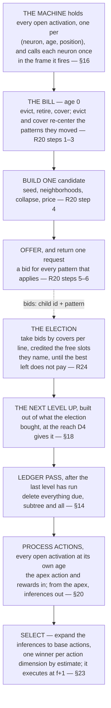

# UCAR — theorems and commentary

Everything here elaborates [algorithm.md](algorithm.md) and none of it is normative. **T** is a theorem: a
claim that follows from the definitions and rules, stated with its argument. Everything else is commentary —
why the design is shaped the way it is, what the alternative would have cost, and worked examples. Items are
keyed by the D, R or section they belong to, in the order the specification introduces them.

---

# 2. Frame processing

**On §2 — every decision in the frame is made on complete evidence.** A neighborhood is whole the frame the
neuron fires (D7), and nothing structural reads anything else — so no step is a bet, nothing is committed
early, and nothing is revisited (R1). What the remaining frames deliver is what action the situation was
followed by, and what it earned, and it is read only when a neuron on the apex infers (R36).

# 3. The machine

**On D2 — why a child sits at offset zero.** A pattern is written relative to the parent's activation, so the
child sits at offset zero by construction. A centroid over what the child covers would leave the level above
differencing coordinates from origins its neighbors were never measured against.

**On D4 — why the reach doubles.** Each level holds at most half the activations of the one below (T11), so
its neurons stand twice as far apart, and the box has to double for the expected number of neighbors — a level's
density times the volume of its box — to stand still.

**On D4 — both ends are pinned by what is already given.** The declared alphabet fixes the bottom.
`log₂N₀` levels of halving take `N₀` active neurons down to one, and at that depth the reach expression returns
a reach spanning the whole active region — so nothing has to state that the apex should see everything.

**On D4 — why every dimension grows by the same factor.** The thinning factor comes from a level's activation
count, and a level has one of those, so the schedule cannot tell the axes apart. Growing them all by the same
factor is the isotropic solution and the right default when nothing distinguishes them. Data that chunks harder
along one dimension than another thins faster there and would want that dimension's reach to grow faster;
measuring spacing per dimension instead of one count per level is what that would take, and whether it is
worth it is open ([algorithm-evaluation.md](algorithm-evaluation.md)).

**On D4 — the buffer, walked through.** With a reach of 1 — the base — an activation at frame 10:

```
                 frame 10        frame 11
   buffer        [ 9 10]        [10 11]
                      ▲              ▲
   activation       fires        +1 fires, with its reward
   at frame 10   newest edge    connects, closes
                   sees −1
```

The neighborhood is read at the newest edge and never again; the buffer's only other job is to be the
frames the next activations read their own neighborhoods from.

**On D5 — a neighborhood is a box.** Adjacency is a conjunction, so something far away in one dimension is not
a neighbor however close it is in another, and no dimension can rescue what another has ruled out.

**On D5 — receptive fields grow with depth two ways at once.** Through composition, because a neighbor is itself
a chunk. And through the reach, because each level's neurons are sparser than the one below and have to reach
further to find each other at all. Neither is declared per level: the first is what a pattern *is*, and D4
derives the second from the first.

**On D5 — why adjacency is not declared.** A conjunction over shared activation dimensions already says
everything a visibility declaration would, and it says it without a table to maintain: what a channel is laid
out over settles which channels it can be adjacent to.

**On D6 — what made coarse offsets safe.** One neighbor per offset was a consequence of atomic offsets,
never a rule. Logarithmic offsets make reach exponential in the alphabet, which is what makes the reaches D4
schedules affordable to write down at all. Neither end of the offset alphabet is told which to use, and
neither declares anything (D27).

**On D6 — nothing is cut off; precision decays instead.** Near offsets come out exact and distant ones are
named coarsely: an offset `2^g` stands for any distance in `[2^g, 2^(g+1))`, since those are the differences
that round down to it. The true distance is not in the file, the decoder places the neighbor at `2^g` (R28),
and nothing charges the difference, because the price counts symbols named and absent (D13), never where a
present one landed. What the file guarantees is the symbol, its dimension, and its place to within its offset's
group — and that is the placement loss of §1.1.

**On D6 — how the decay plays out.** A level whose neurons stand one position apart uses the exact end and
votes the coarse offsets away for want of a majority; a level whose neurons stand twenty apart does the reverse.

**On D7 — a pattern is a name for a chunk of spacetime.** One pattern-learning algorithm and one kind of
pattern. There are four types only in the sense that two declarations cross: an **offset** may be zero or
spanning in any activation dimension, which is spatial against temporal, and a **neuron dimension** is event or
action. Neither is a separate mechanism. Spatial is a setting of the reach, and an offset does not know which
kind it is. Event and action are not separate for a plainer reason than it looks — the machine observes its
own actions, since each action dimension carries what was executed, so an action is a symbol read back the way
a pixel is and a pattern over it is learned by the same counting. **You could not tell from a dictionary line
which of the four you were holding.** The one asymmetry lives outside the pattern: an action is chosen and an
event is only observed (R35).

**On D7 — siblings at offset zero.** Several children promoted at one coordinate are activations of different
neurons at the same place, and above the base they see each other at offset zero in every component. That is
what lets the level above chunk them: two patterns of one neuron that keep being bought together are, one
level up, two neighbors that keep co-occurring, and a pattern over the pair is the merge the neuron itself
cannot build (R14).

**On D8 — many activations per coordinate.** The base bound is the input's: one symbol per channel at each point
of its layout. Above the base there is no bound at all, because a neuron covers its activation with a set of
patterns and each of them may promote a child (D28). What replaced the bound is not a weaker version of it but
a different kind of rule — the only exclusivity left is credit (D28, R24), and credit is about paying, not
naming.

**On D8 — the two halves are simultaneous, not sequential.** An action is not a reply appended to a frame.
Reading it as one puts the action a frame later than it is and breaks every offset measured across the two
sides.

**On D9 — ages in a single neuron.** A neuron active at frames 10 and 12 is at ages 0 and 2 in frame 10 + 2,
then 1 and 3 in the next, and so on.

**On D9 — an activation is an event, not a state.** It decides everything it will ever decide in the frame it
fires, on a neighborhood that is already whole (D7). What it does afterwards is connect and speak. Connecting is
transcription rather than judgement — the action that ran and the reward with it strengthen the neuron's
connections, where the *next* inference reads them. Speaking is reading the neuron's own connections, and it
changes nothing the neuron holds.

**On D9 — why the window is exactly `reach_t`.** The last action an activation can connect to runs at offset `reach_t`, and an
action's reward arrives in the frame the action runs in (R29), so nothing can land after that frame and there
is no frame to hold open for. An earlier draft paid the reward one frame after the action and had to keep every
activation open one frame longer for that single arrival; the two-frame cycle removes the frame and the reason.

**On D10 — three consequences of having no rest value.**

- **Blank regions cost nothing** — no activation, no history, no dictionary, no compute.
- **A frame is a set** — variable-size, containing only what happened.
- **Absence discriminates in one direction only** — a pattern naming a filled disk is measurably wrong on a
  hollow circle, because the interior neurons it names did not fire and each is charged (D22). The reverse is
  not an error: a circle-pattern on a filled disk covers what it names and leaves the interior in the residual,
  where it costs the same lines it always would. **What separates them is coverage, not penalty** — the
  disk-pattern covers more of the disk, so it wins the disk, and the circle-pattern is not charged for losing
  it.

**On D10 — where sparsity comes from.** Whether a 0 pixel is a black event or nothing-to-see is the encoder's
choice, made where the input is produced. A dimension where something always happens is simply always active;
nothing depends on sparsity, it only profits from it.

**On D10 — two children naming one neuron is not a defect.** The decoder expanding both gets the neuron twice and
the neuron fires once; a set does not care how many times it is told a member. What would be a defect is
paying two lines where one would do, and that is what exclusive credit prevents: a bid is worth only what
would otherwise stand as its own line (R24), so a child whose only contribution is a neuron another child already
delivers cannot clear its price. Naming is free, paying is exclusive.

**On D11 — what position-specificity would buy is fit, and that is what it costs.** One pattern serving every
position describes statistics that differ by position, so it fits each worse than a position-tuned pattern
would, and the neighbors it names wrongly are literally the charges in the file (D22). The dictionary half of
`L` falls and the body half rises. **D30 adjudicates exactly that trade**, pattern by pattern, and no price
anywhere changes for it to do so: an activation costs 1 before and after, because the alphabet loses precisely
the factor the coordinate gains.

## 3.4 The file

**On D12 — why the file holds nothing about the future.** The forward half of a pattern used to be a claim the
file scored: a child asserted what would follow, a wrong assertion was a correction, and the corrections were a
term of `L`. Three things were wrong with it. Nothing priced the corrections — no test read them and nothing
was ever retired for predicting badly — so the term sat in the objective and decided nothing. The bid had to
carry a half it could not be scored on. And a slot two children both predicted needed an owner, which needed a
resolution, which needed a second exclusivity beside coverage. Removing the claim removes all three. What is
left is a dictionary coder over the backward window, and nothing the machine holds about what follows is a
claim: the action that followed, and what it earned, is a connection, read for the next action and scored by
nothing (D25).

**On D12 — the file is not a log of how the machine got there.** A pattern that goes is not a line the file must
keep alive: the run is simply re-encoded without that symbol, and the frames it used to cover are expressed by
whatever the dictionary now offers, with charges where that is worse. An unbounded file costs nothing because
nothing was ever going to write it.

**On D13 — where compression is actually paid out.** A neuron firing at `h` names `[h − reach_t, h]`, so writing
it discharges up to `reach_t + 1` frames of the run at once. That is why a wider reach is worth paying a wider
line for, and it is why the residual is free and a child is not.

**On D14 — why `L` never appears in the arithmetic.** `L` is what the differences are differences *in*; it is
the reason the arithmetic is the arithmetic, and it is never a term in it.

> **T1 — A fixed-length code is not a real file length, and no test can tell.** D13 prices a symbol at one
> however often it is used. That is not what a decoder pays: naming a symbol out of a dictionary that grows
> without bound (D3) costs about `log |alphabet|` bits, and that rises over the run. Write the true length as
> `c · L`, with `c` the bits one symbol name currently costs.
>
> **Every test reads the sign of a difference, never a length.** `margin = benefit − cost` (D30), and both
> terms are counted in the same symbols, so the true margin is `c · margin`. `c > 0`, so the sign is the same
> one. The dictionary term and the body term scale together because both are counts of the same symbols —
> if they did not, the constant would not cancel and this would fail.
>
> **So counting symbols and counting bits answer every question the machine asks the same way.** That is what
> buys the integer arithmetic: no estimator, no smoothing, no boundary correction anywhere that decides what
> structure exists. It is a property of a *fixed-length* code, and re-pricing the file by how often each symbol
> occurs gives it up — the constant stops cancelling and probabilities do set costs, which is why
> [forgetting.md](forgetting.md) is a document of its own.

**Why a neuron's history states nothing.** It is evidence, not an encoding: it records what was seen so the
collapse can center on it (D27), and a decoder never reads it. The one place a price is needed — does this
pattern earn its dictionary line — is a drop in `L` the neuron works out for itself, over its own evidence, and
nothing crosses between scopes to correct it. What that costs is stated in
[algorithm-evaluation.md](algorithm-evaluation.md): a neuron whose territory another neuron reliably takes keeps
pricing its patterns as if it did not.

# 4. The interface

**On R1 — there is nothing to wait for.** `O` is complete when the neuron fires (D7), so no decision in the call
is made on partial evidence, none is committed for later, and none is revisited. The neuron remembers nothing
between one activation and the next beyond what is in its table and its history.

**At `R_t = 1` the vocabulary collapses.** `O` is whole at once, nothing is in flight, and the forward call
delivers one frame. Contraction loses its cross-frame contention, since every bid spans one frame. Read the
document with the temporal parts struck out and it is the spatial algorithm, unchanged — the whole machine, not
a stage of it, which is what makes a reach a configuration rather than an architecture.

# 5. The pattern

**On D15 — why the two objects can never be one.** Being a center (T5), a pattern is typically a set no
neighborhood ever was.

# 6. The history

**On D18 — one count, so one denominator.** What D30 needs is not a shared clock but a shared divisor: a
pattern's benefit is a sum over the activations it covers, and for two neurons' tests to mean the same thing that
sum must be over comparably much evidence. A uniform `H` gives that directly. A shared *window* gave it only
for neurons firing at similar rates, and gave a rare neuron almost nothing to decide on.

**On D18 — this is adaptation, not forgetting.** A neuron that keeps firing sheds its old activations as new ones
arrive, so patterns describing a situation that has passed stop being taken into covers, drain their benefit
and are retired (R18). A neuron that falls silent sheds nothing: it holds its `H` activations and its patterns
intact, indefinitely, and resumes from them when its situation returns. An active neuron adapts exactly as
fast as its evidence turns over, and a silent one simply waits. Structure is not dropped for being old; it is
dropped for having stopped paying against the last `H` things its neuron saw, so absence of evidence is never
read as evidence the structure died.

**On D18 — aging is by count, so nothing sweeps.** Eviction happens on arrival and at no other time: nothing
compares a frame number, nothing accumulates arrears, and nothing walks the population per frame, so a neuron
that does not fire evicts nothing. Eviction reaches no connection, since the action that followed the
activation was written to the neuron's connections and saved nowhere in the ring (R31). And eviction does not
close the activation: the open activation is the machine's (D9), and it keeps connecting and speaking from the
apex until its window ends or coverage arrives, whether or not its neuron still holds it.

**On D18 — `H` does three jobs.** It is the structural memory — connections are outside it (R31) — it
is D30's selectivity — double it and every pattern's
benefit roughly doubles against an unchanged line, so more survive — and it is the rate at which the stack
deepens (T13). One number, three effects, all monotone in it, and it should be tuned knowing that.

> **T2 — Counts are sums over activations, and nothing reads an activation whole but eviction.** Re-centering
> counts the population and the namers per neighbor over the activations a pattern covers (D27), both tests sum margins
> over activations, and the candidate collapses over a population of activations — every one of these is a per-neighbor
> count, and per-neighbor counts are what the implementation keeps on a pattern. Forward, there are no activations to
> sum over at all: a connection is a total on the neuron, strengthened as actions run and never read back per
> activation (R31). Nothing asks whether `u` at `+1` came with `v` at `+2`. The one operation that needs an
> activation as a whole is removing it (D18), because a sum cannot say which of its terms was the oldest.

> **T3 — What covers is what was priced.** An earlier design chose a cover on the neighborhood and then priced
> the activation on the whole span, so the pattern that won the prefix could end up a worse describer than one that
> lost it, and no pass could reconcile them.
>
> There is nothing left to reconcile. The cover is chosen on `O` and priced on `O` (D25), so the pattern that
> took a neuron is the pattern charged for it, at every reading and for the life of the activation. **The forward
> half is never a term in that comparison**, so it cannot contradict it.

> **T4 — Every loop in the design is bounded, and none is capped.** A bill is five passes, each over a fixed
> set — the ring, the table, the offsets — and none of them repeats until a condition holds (R20): one candidate
> is built by one seed and one collapse, one pattern retires at most. The election is two decisions and a
> settling, none of them repeated (R24). A retirement is collected within `reach_t(D)` frames and takes
> its whole subtree in one step (R18). The level stack is bounded by the base activity behind a frame (T12) and
> by the run so far against `H` (T13), which together also bound the settlement walk (R25) and the depth of an
> expansion (R28). Every bound falls out of a quantity the design already counts, so nothing has to be chosen
> to make the machine halt.

**On R4 — why the alphabet is not a parameter.** A resolution defines what a base symbol *is*, so it states
the problem rather than tuning the algorithm. Everything about depth is derived: adjacency is the reach read
conjunctively, and the reach per level comes out of one expression.

**On D18 and D4 — `H` and the reach constrain nothing in each other.** `H` counts activations and the reach
sets how wide one activation is. There is no floor relating them: there is no window for a span to be wider
than, since the file is the run (D12), so every symbol is priceable at any reach. What the two share is the
collapse's evidence. D27 votes per neighbor over the same `H` activations, so every neighbor, innermost and
outermost alike, is decided on the same count, and a reach wider than the data supports finds no majority in
its outer neighbors and they drop.

**On D18 and D17 — what a neuron holds outright.** Two things are held because nothing else the neuron holds
could rebuild them: the history, which is the evidence itself, and the table of patterns, which is what the
neuron has decided over that evidence. The cover and owners an activation carries are what recognition chose
over those two, call by call, and they are held rather than recomputed because nothing ever re-derives a cover
(§12).

# 7. The cover

**On D17 — why there are no bins.** An earlier design grouped activations by identical neighborhood and gave the
group one cover, on the grounds that D28 reads the neighborhood and nothing else, so equal inputs get equal
covers. §12 breaks that: a cover is never re-derived, only grown by recognition and shed by re-centering and
retirement, so two activations with one neighborhood can hold different covers depending on what the table was
when each was saved.
The group could no longer share, so the group is gone. Nothing was lost but a cache — every sum the tests need
is a sum over activations either way (T2).

**On D21 — the residual is not a pattern.** It is not routed anywhere and has no line to pay: each neuron in it
stands in the file as its own line, at cost 1 (D13), exactly as it would if no pattern existed, so it is charged
to no pattern and credited to none. There is no default pattern, no fallback and no empty pattern: a table may
be empty, and an activation it covers nothing of costs `1 + |O|`, which is what an uncompressed chunk costs
(D22).

**On D21 — the residual is not an error.** A reader used to reconstruction loss will read the residual as the
part of the input the model failed to explain, and expect something to be minimized over it. Nothing is. A
neuron that fired and nothing named costs the one line it would have cost with no patterns at all, so leaving
it in the residual is free; the only thing a pattern is ever charged for is a neuron it names that did not
fire (D22). The design pays for false claims, not for unclaimed facts, and a pattern that names less is never
penalized for it beyond the coverage it forgoes.

**On D19 — why handover is arithmetic.** What an activation holds against each pattern is the index, and nothing
has to be added to it — a pattern that moved updates its owners in each activation it covers (D29), and every
activation reaching for it is current again. An activation's share moves whole, so a pattern joining or leaving a cover transfers its
share in `O(offsets)`. The offset grid grows with the level, since D4's reach does, while the number of
neighbors in it stays fixed by construction — that is the invariant the reach is chosen to hold.

# 8. The saving

**On D22 — the price is not a notion invented for matching.** It is literally the symbols that would follow
the activation in the file: a neuron named and absent has to be turned off, and that turn-off is the whole of
what a pattern is charged. A neuron that fired and nothing named costs one line whether or not the
pattern exists, so it is charged to nobody — which is why the residual is a term of the activation and not of
any pattern.

**On D22 — the saving is a distance, read against a subset baseline.** Where one pattern is measured against
the whole of an activation, `d(O, p) = |O △ p|` and `saving = |O| − d`: the identical number, written against
a flat baseline instead of a subset one. The design uses the subset form everywhere, because an activation's
cover is a set of patterns and only the subset form adds up over one.

**On D22 — why `coverage` counts what turned up rather than what the pattern names.** Take a neuron `x` whose
pattern names `{a, b, c}` backward, in a frame where `a` and `b` fired, `c` did not, and an unnamed `m` did.

```
without the child  state x, a, b, m                                            4 symbols
with the child     1 for the child, which expands to x, a, b, c
                   charges: turn off c;  m stands as its own line              3 symbols
                                                              true saving      1
```

`|O| − d = 3 − 2 = 1`, which is the saving, and the subset form agrees: coverage is `1 + 2`, the activation
itself and `a`, `b`, against a price of `1 + 1`. Now let only `a` fire, so `O = {a}` and `d = 2`: the file states
`x, a` for 2 symbols without the child and pays `1 + 2` with it, a saving of `−1`, and `|O| − d = 1 − 2` gives
exactly that. **Counting what the pattern names would give `|p| − d = 3 − 2 = +1` and report a saving where the
file got longer** — `b` and `c` would be credited as delivered *and* charged as absent, netting nothing, so a
name that never fires would be free to hold. The two error types are the ones being told apart: naming wrongly
costs a symbol and delivers nothing, while a neighbor left unnamed costs its own line where stating it flat
cost a line, so it is free either way.
**On D22 — the two sums are what the two mechanisms work against, and that is the whole division of labor.**
The election works on the body half over a given dictionary — it is priced in exactly that sum, for the
frames it can see, though it does not minimize it (§17.3). The margin decides the dictionary half, pattern
by pattern (D30). Neither can do the other's job: the election cannot create or destroy a symbol, and a neuron
cannot see what its symbol saved.

**On D22 — two readers, two numbers, and why that is economics rather than an inconsistency.** The neuron is
deciding what to hold and what to offer, over every situation it has been in; the machine is deciding what to
buy, for the one window in front of it. The neuron's number says whether a pattern pays over its own history;
the machine's says whether a bid pays on a board where earlier frames' credit stands and other neurons' bids
contend. A pattern the neuron holds because it pays in most of its activations can lose at the election in this
one, and a pattern the neuron's own cover passed over can be the machine's best purchase, because the machine's
residual is not the neuron's (D28, R23). An earlier draft tried to make the two numbers agree — the bid was
worth "exactly what its entry was taken on" — and the claim was false the moment a past neighbor was already
covered. The two are different by design, and the honest statement is that neither ever reads the other's.

**On D22 — why the neuron can compute what a pattern is worth.** It knows what the file pays for an activation with
the pattern in its cover and what it would pay without: both are counts over the activation, and the neuron holds
what every activation gives every pattern it has (D19). The difference between the two is the whole of the benefit,
and it is a fit against the neuron's own evidence. What it never needs is the file — a length nothing computes
cancels out of a difference (D30).

**On D22 — conservative, and in a stated direction.** The line is paid once over the whole run, so a pattern
that pays for itself within `H` of its neuron's own activations pays for itself many times over in the file. The
test asks for the stronger thing. What it therefore drops is structure that still describes the run but has
stopped describing the neuron's recent situation — which is the adaptation D18 is for, not an error in the
estimate.

**On D22 — one baseline, two populations.** Every test asks what the file pays with the pattern against
what it pays without. Without it, each neuron it held goes to whatever else names it — another pattern of the
same cover, or another accepted bid one level up — and otherwise into the residual, where it costs the line it
would always have cost. **The flat file is not a second baseline**; it is what that question returns when
nothing else names the neuron.

What is left between the two tests is the population and the line. D30 sums over the `H` activations in the ring
and charges `1 + |p|`; R22 sums over one frame and charges nothing, because the line was already weighed where
the pattern lives.

# 9. The greedy cover

**On D28 — why the cover is a set and the criterion is a ratio.** A neuron picking one pattern has a nearest
neighbor problem; a neuron picking several has a covering problem, and covering is where a ratio belongs. A
line is paid once per pattern however many neurons it accounts for, so what matters is not which pattern is
closest but which buys the most residual per line. **That is not merely the same criterion R24 uses one level
up; it is the same procedure**, run by the neuron over its table and by the machine over a frame's bids. What
differs is the population and the fact that only the neuron may mint or retire a symbol.

**On D28 — why the offer is wider than the cover.** The cover is the neuron's own partition, chosen on the
neuron's residual. Take an activation `a, b, c, d, e` with patterns `E1` naming `a, b, c, d` and `E2` naming
`c, d, e`. The cover takes `E1` first and leaves `E2` with `e` alone, one neuron against a price of one, so
`E2` is not in the cover. Now let the machine already hold `a` and `b` from a past frame's child. `E1` is worth
`c, d` less its line, one; `E2` is worth `c, d, e` less its line, two; and `E2` was the better purchase. An
offer restricted to the cover never shows it to the machine. The offer is therefore every pattern that
applies, and the machine ranks.

**On D28 — why the apply test is a majority and not a price.** The offer needs a filter that drops nothing
the machine could buy and sends nothing it could not. A pattern whose present neighbors do not outnumber its
absent ones has `covers ≤ price − 1` on any board, since the board can only take present neighbors away, so it
can never clear R24 and there is no reason to send it. A pattern whose present neighbors do outnumber its
absent ones might clear, depending on what the board has already paid for, and the neuron cannot know. So the
loosest safe filter is exactly the majority, and it is the collapse read backwards: a pattern is a majority
statement over the activations it covers, and an activation is one the pattern describes when it agrees with the
majority of the statement. The price belongs to the buyer.

**On D28 — why the cover keeps its own test.** The cover is not an offer; it is where the neuron's counts come
from. Taking a pattern into a cover on a bare majority would credit it neighbors it does not pay for on the
neuron's own books, and T7 needs the neuron's books to be the file's. So the cover keeps `coverage > price` and
the offer takes the majority, and the two sets differ exactly where the neuron's residual and the machine's
would.

**On D28 — why nothing comes back.** The neuron has already decided everything, on a whole neighborhood, and
the election settles who the machine paid. An earlier design reported the election back as a fact per
neighbor — which of this activation's neighbors another bid was credited — so the neuron could price its
patterns on what it actually sold. The report is gone because the accrual it needed was the most involved
machinery in the design and the case it guarded against was judged rare: a neuron consistently outbid on the
same ground. What replaces it is nothing. The neuron prices on what it saw, and a pattern that sells poorly
stays as long as it describes the neuron's own activations.

> **T6 — There is no ownership pass.** The only consumer of a table-wide picture of covers is R14's
> residual, and R18 reads it only through the activations a pattern covers. Both scan the whole
> table anyway. Everything else wants one activation's cover: the cover pass computes it for the activation in hand
> (D28), eviction reads it per departing activation. **So no pass exists to keep every owner current, and
> none is needed** — the scan that prices a move is the scan that makes it.

## The offer, and the one procedure

**The offer is not the cover.** The cover is one partition, chosen on the neuron's residual; the offer is
every pattern the machine could conceivably buy, because the machine's residual is not the neuron's (R23) and
a pattern the cover passed over may be the machine's best purchase. A pattern that does not apply cannot be
bought on any board: its present neighbors do not outnumber its absent ones, so `coverage − price ≤ −1` however
the board stands (R22). **The offer is the loosest set that drops nothing the machine could buy, and it is
the collapse read backwards**: a pattern is a majority statement over the activations it covers, and an activation
agrees with it when it agrees with the majority of it. The offer is not exclusive because the machine
chooses; two bids from one neuron can both be bought.

**The cover and R24 are one procedure over two populations.** The neuron runs it over its table against one
activation's residual; the machine runs it over a frame's bids against the free slots of the board. Both take
the best ratio, re-measure what is left, and stop when the best remaining does not pay. **The criterion is
the same in both** — what a pattern covers against what it costs to state (D22) — and the price is
the same expression on both sides, `1 + |p \ O|`.

**Two things differ, and neither is the procedure.** What is covered, so the numbers do (D22); every bid
covers the activation itself on both sides (R22). And what each side may do about a poor result: the neuron may mint a pattern and retire one (R14, R18), the machine may only
take what it is offered. **Recognition is one algorithm; only the neuron writes the dictionary.**

**A neuron with an empty table covers nothing**, offers nothing, and the whole of its activation is residual (D21).
That is the shortest file available to it, not a failure.

## One cover, worked

**On D28.** One pass over a table of three. `O` is what this activation saw; `x`, `y` and `z` are neurons the
patterns name that did not fire, and each is a symbol its pattern pays for.

```
O = { a b c d e f }

              names            itself + of the residual   price          ratio
   P          a b c x                1 + 3                1 + |x|  = 2    2.00
   Q          d e                    1 + 2                1 + 0    = 1    3.00
   R          f y z                  1 + 1                1 + |yz| = 3    0.67

   round 1    Q leads on ratio, and 3 > 1, so Q is taken     residual  a b c f
   round 2    P covers 1 + 3 now, and 4 > 2, so P is taken   residual  f
   round 3    R covers 1 + 1 and costs 3, so nothing pays    stop

   cover        { Q, P }              the patterns — this is what the activation holds
   owners       d,e → Q   a,b,c → P   which round took which; f has no owner
   covered      Q: { d e }   P: { a b c }
   residual     { f }                 nobody's: its own line, and evidence for both (D27)

   cost(O)  =  1 + 2 + 1  =  4        against 1 + |O| = 7 stated flat
```

**`f` is not an error and `x` is.** `f` fired and no pattern named it, so it costs the one line it would have
cost anyway; `x` was named and did not fire, so `P` pays for it. Only the second is charged to a pattern (D22).

**Why the cover has to be exclusive.** Two patterns credited one neuron would each re-center as though they had
earned it (D27, D29), so ownership is what keeps the collapse honest (D27).

# 10. The collapse

> **T5 — The collapse is the per-neighbor minimizer of the pattern's margin over its population.** Over the
> activations a pattern covers, naming a neighbor moves the summed margin by `+1` wherever that neighbor was in the
> residual — one more neuron covered — by `−1` wherever it did not fire — one more symbol charged (D22) — and by
> `−1` once, for its place in the line (D13). Where another pattern of the same cover already holds it,
> nothing moves at all: no `coverage` to gain, no `price` to pay. So the population for that neighbor is the activations
> of the first two kinds, and the neighbor pays exactly when `2 · count − s − 1 > 0`, which is D27's rule. The
> neighbors are independent, so the per-neighbor rule minimizes the sum. It is a *center*, not a medoid: synthesized,
> possibly a set the neuron has never seen. That is the point — it is the typical neighborhood, not a sample
> of one.

**On T5 — why a centroid will not do.** A centroid over sets is a fractional vector, which is not a set, cannot
be written into the file, and has no symmetric difference. The counts **are** the fractional object; the
collapse is how the design gets from it to something the decoder can expand.

**On D27 — why the line is in the neighbor rule, and why the rule is not `2 · count > n`.** The threshold is a
file-length statement, not a majority statement, and the dictionary line is part of the file (D12). Naming `s`
in a pattern that covers `s` activations, `count(n)` of which have `n` in the residual:

```
body       − count(n)          those residual lines are gone
body       + (s − count(n))    the activations without n now carry a wrong name
dictionary + 1                 the pattern's line is one symbol longer
```

Net change `s − 2 · count(n) + 1`; the neighbor is taken when that is negative, `2 · count(n) > s + 1`. Dropping it
is the mirror. **The plain majority counts the body and forgets the line**: at three of five, naming saves
one line of body and costs one of dictionary, and the file is the same length. An earlier draft took a neighbor
at that bare majority and charged the line only in the tests that add and retire (R15, R18), which left the
per-neighbor decision off the objective by exactly one. Charging it where the neighbor is decided makes every neighbor
decision a descent on the margin, which is what T7 needs, and it removes the last place a pattern could grow
at no gain. At equality naming saves exactly what it costs, and the neighbor is left out: the collapse is a
function of its population and of nothing the pattern already names.

**On D27 — why an owned neighbor is skipped, and nothing else is.** An activation is never left out of a question
the design is asking it; this one it has already answered, for that neighbor, by having the neighbor covered.
Skipping it is not an exception to counting everything but the recognition that there is nothing to count.

**On D27 — why there is no forward rule.** The collapse exists to turn counts into a set, and a set is needed
only because the file has to be expanded. A connection is charged nothing: it is not in the line and not in
the body (D12). So there is nothing to break even against and nothing that has to become a set. A connection
goes down as an inference at its strength and estimate (R36), and a majority would throw away exactly the
alternatives the walk is for (R37).

**On D27 — uniqueness is not assumed and is no longer guaranteed.** At the base, an offset naming one position
holds one neuron of a dimension (D8), so those counts sum to at most `n` and only one can clear the half. Above
the base several neurons may fire at one coordinate, so several can clear it and the pattern names them all
— which is D6's coarse-offset case arriving for a second reason. `|p|` counts them, and nothing else in the
design had to change for it.

**On §10 — why a set and not a distribution.** Covering needs a set. So does the file: every offset it states
holds one symbol or nothing.

# 11. Re-centering

**On D29 — three consequences, and they are the point of the design.**

- **Patterns track their demand.** A pattern created on thin evidence is pulled toward its cluster.
- **Coincidence is voted out.** A neighbor present once loses its majority to silence and drops out.
- **Reach emerges.** Offsets where nothing recurs fall away. How far a pattern reaches is discovered, not
  declared. The reach bounds it; it does not set it.

**On D29 — why re-centering rides evict and cover and has no step of its own.** An earlier draft re-centered
once per call, after the cover and before the tests, and deferred what the tests moved to the next call, so that
the center would never depend on the order two moves happened to run in. The order is not free: R20 fixes it, and
a pattern's covered activations change at exactly two of its steps — evict, which takes one away, and cover, where
recognition over the history gives or re-credits them — so each of those re-centers the patterns it moved, once.
Retirement re-centers nothing: the retired pattern's neighbors drop into the residual, and the recognition that
follows in the same call is what re-covers them with the patterns that remain. A re-center is one round because
what it does to covers is a cover question, and recognition is the only place covers are decided.

# 12. Recognition

**On §12 — why a cover is never re-derived.** D28 is greedy, and a greedy cover re-derived after a pattern moved
can cost more than the one that stood. In Lloyd's algorithm the assignment step is exact, so re-assigning after
the centers move can only help. Here it cannot be exact — an exact cover is set cover — so the design never
re-derives: recognition runs over the residual alone, and every pattern it takes pays strictly against what
stood, which is the difference between a call that descends `L` and one that can raise it (T7).

**On §12 — a pattern owning nothing in an activation is not in its cover.** It follows from the definitions:
a pattern is in a cover to explain neighbors (D17), and re-centering can leave it naming none the activation has,
so its owners there are empty (D29). It is then charged nothing there and credited nothing, and recognition can
take it again only if it pays (D28).

**On D19 — why nothing is indexed the other way.** What each activation holds against each pattern is already the
index (D19), so a reverse map from pattern to the activations it covers would be a second copy of the same fact.

**On §12 — prices and structure move at the same moment and are still different kinds of thing.** Both move
when a neuron fires, because that is where counts move and where both tests run (R1). But a price is read off
the cover as it now stands (D22) and never stored, while a structural move — adding, retiring (R15, R18) — is a
decision that stands until something reverses it.

# 13. The margin

**On D30 — `coverage` is what nothing else would have covered.** A pattern is worth what it saves over what
would account for those neurons if it were gone: the residual, where each stands as its own line (D21). A saving
some other pattern already delivers is not this one's, which is what owners (D19) enforce.

**On D30 — the same expression prices a bid over one frame** (R22). There is one valuation in the design (D22);
the two readings differ in what they sum it over and in whether the dictionary line is in the sum.

**On D30 — at equality nothing happens.** A pattern is added only on a strictly positive margin and retired only
on a strictly negative one (R15, R18), so a pattern at zero is neither, and the boundary cannot flip-flop.

**On D30 — the tests a symbol passes through, in one place.** The line brackets the symbol's life and the
elections fill in the middle. Every row is stated by the rule it cites; this is a reading aid, not a rule.

```
build     would what C takes out of the residual sum past 1 + |C|?      the line, prospectively   (R15)
cover     does this PATTERN take more of the residual than it costs?    one activation, no line       (D28)
offer     does more than half of this PATTERN fire?                     one activation, no price      (D28)
elect     does this BID cover more than it costs, once slots are split? one bid, no line          (R24)
retire    does what p still keeps out of the residual pass 1 + |p|?     the line, retrospectively (R18)
```

**Cover and elect are one expression** (D22) — what a pattern covers against what it costs to state —
asked over one activation and over the board. Build and retire are that same expression summed over the history
with the dictionary line added, read in opposite directions: what an absent pattern would take out of the
residual, and what a present one is still keeping out of it. The offer is the one row that is not a price, and
§9 says why.

**On D30 — a benefit can be zero for two different reasons**, and both are the signal. Zero because the
neighbors are already covered by another pattern of the same cover — no sharper child here would shorten the
file. Zero because the next pattern in line fits the activation just as well — the pattern duplicates something the
table already holds. A pattern accumulating either drags itself toward retirement, and neither needs a
mechanism aimed at it.

**On D30 — the movement of benefit is cheap.** A pattern gaining or losing an activation and an activation joining or
being evicted are `O(offsets)` off the counts; a re-center is the walk the scan is already making (R20).

**On D30 — a newborn needs exactly the bracket and nothing more.** Where its territory was residual, the neighbors
are free and it is bought on its first recurrence — no line at the election means no deadlock at birth. Where
its territory turns out to be another neuron's, the election declines it and the neuron never learns why; the
pattern stays as long as it pays on the neuron's own books, which is the trade
[algorithm-evaluation.md](algorithm-evaluation.md) records.

> **T7 — On a fixed history, the bill descends the neuron's file and stops.** Write the neuron's file over its
> ring as
> ```
> L_N  =  Σ over activations f  [ |residual(f)|  +  Σ over the cover of f ( 1 + |e \ f| ) ]
>      +  Σ over patterns  ( 1 + |p| )
> ```
> the uncovered neurons, a line and its charges per covering pattern per activation, and the dictionary — D22 read
> over one neuron's evidence. Freeze the ring. Then each pass of R20 is non-increasing on `L_N`:
>
> - **Build.** Adding `C` changes `L_N` by exactly the negative of R15's margin: over the activations whose cover
>   `C` joins it removes what it takes from the residual and adds its line and its charges, and it adds one
>   dictionary line. `C` is added only when that margin is strictly positive, so `L_N` falls by at least one.
> - **Retire.** Removing `p` changes `L_N` by exactly R18's margin, with the sign reversed: its neighbors that
>   no other pattern of the cover names return to the residual, its lines and charges leave, its dictionary
>   line leaves. `p` is retired only when that is strictly negative, so `L_N` falls by at least one.
> - **Re-center.** The covers stand and the pattern moves, its owners following it (D29). `L_N` is then a sum
>   over neighbors of independent terms, because an activation's residual at neighbor `n` depends on nothing but
>   neighbor `n`. Naming `n` takes it from the residual and changes `L_N` by exactly `−(2 · count(n) − s − 1)`
>   over the population the abstention leaves (T5); dropping `n` returns it to the residual and changes it by
>   exactly the negative of that. D27 takes a neighbor exactly when its term falls, so a re-center is
>   non-increasing and strictly decreasing whenever a neighbor enters. **It is a sum over the population**: an
>   individual activation can get dearer under the moved pattern while the total falls.
> - **Recognize.** D28 over the residual takes a pattern only when its coverage strictly exceeds its price
>   there, so each pattern taken lowers `L_N` by at least one, and nothing standing is disturbed (§12).
>
> `L_N` is a non-negative integer, so the strict moves are finite, and the process reaches a state where no
> candidate pays, no pattern is negative, no neighbor moves and nothing in the residual can be covered. That is a local optimum with
> respect to exactly the moves the neuron has. On a sliding history it tracks one, which is all that can be
> asked.
>
> **What the theorem rests on, and what happens without it.** Two things. The partition: with each present
> neighbor credited to one pattern of the cover, `L_N` decomposes over patterns and the re-center is a descent
> step. Without it a pattern's own fit and the file disagree wherever two patterns name one neuron — a
> candidate born on unmet ground can re-center onto ground another pattern holds, look better and better to
> itself, be worth less and less to the file, be retired, and be rebuilt from the same residual by the same
> seed. On a frozen history that cycles forever. And never re-deriving a cover (§12): a greedy cover derived
> fresh after a re-center can cost more than the one that stood, and `L_N` would rise with it, whereas
> recognition over the residual can only add a pattern that pays. With both, the descent is monotone.
>
> **What it does not say.** Not that the optimum is global — choosing the pattern set is set cover, and the
> concrete local optimum is a history where `a, b, c, d` always fire together held by `{a, b}` and `{c, d}`,
> each paying, neither retirable, the merge never proposed because nothing is ever unmet (R14). That merge is
> the level above's (§9). And not that `L`, the file over the run, descends: `L_N` is one neuron's reading of
> it, and what the election does with the neuron's patterns is not in `L_N` at all.

**On R1 — nothing waits.** An earlier design held every structural decision open until the forward half had
landed, on the argument that a child names a whole span and half of it had not happened. But the half that had
not happened was never a term in either test. What follows an activation is measured rather than chosen
(D25), so waiting for it bought nothing and cost the entire apparatus of commitments, horizons and provisional
answers that used to sit between the two ages.

---

# 14. Retire — pruning the table

**On R18 — why one and not every negative margin.** Two patterns straddling one cluster are each worth nothing
while the other stands: whichever is removed, the other picks up its neighbors for free, so each margin reads
as if the other were doing the work. A pass that retired both on one reading would return the whole cluster to
the residual with nothing left to cover it, and the next bill would rebuild one of them. Retiring the worst
alone lets the survivor's margin, read next bill, carry the whole cluster. The earlier design did the same
thing inside one bill by re-checking after each retirement; doing it across bills is the same sequence with no
loop.

**On R18 — a candidate cannot be retired by the pass that follows it.** After a candidate is added, what R15 priced
and what R18 reads are the same set counted the same way — the residual `C` took, measured against
the same table. The margin R18 reads is the one R15 just found strictly positive, and one
retirement can only hand `C` more neurons or remove a competitor. A pattern only ever falls below its line by
losing neurons to another pattern of its cover or by having its activations evicted.

**On R18 — what two sequential tests cannot reach.** A candidate that would pay *only* if some incumbent's line
were refunded fails R15 and is never put to R18 — two patterns straddling one cluster, each carrying its
weight while the other stands, neither individually deletable. Pricing that case would need a third move with
a formula of its own, joint over adding one pattern and retiring another. It is not worth one. Re-centering
pulls an off-center pattern to its cluster without being asked, and a straddling pair survives only until drift
or eviction starves one of them. **The miss is in the safe direction**: what a greedy build-then-retire gives
up is a compression not taken, where a candidate priced against the flat file gives up a file made longer.

**On R18 — why the subtree needs no cascade.** A retired pattern's child cannot fire again, so by the death
frame it has no open activations; if it has not fired, none of its children has fired either, so none of them
has open activations, and so on to the bottom. **Children outlive their parents** — reach grows with the
level, so an activation above is still open when the one that fed it has closed — and the death frame waits on
the child's last activation for exactly that reason.

**On R18 — nothing irreplaceable dies.** A pattern retired while its evidence is still in the ring is rebuilt by
R14 the moment that evidence pays again.

**On R18 — why the death ledger needs no back-pointers.** A back-pointer from a child to whatever is naming it
would be structure the file does not hold, and the machine already holds the open activations that answer the
question.

**On R19 — duplicates die in the table, not the market.** Two patterns with the same neighbors are taken into a
cover older first, so the younger holds nothing anywhere and retires. The market would kill the younger too —
the election ties to the older symbol (R24) — but the neuron never hears the election's verdict, so the table
has to be able to do it alone, and it can.

# 15. Add — creating a child

**On §15 and §14 — the two moves.** A neuron can do exactly two things to its table: **add** a pattern and
**retire** one. Re-centering is neither — it is what moving counts means (D29). So the whole of restructuring is two
tests, asked in that order, at a call and nowhere else, **and each is asked once per call: one candidate built and
priced, one pattern retired at most** (R20). **Both are D30 over different sets** — one margin, read over the
neurons a candidate would take out of the residual and over the neurons a pattern holds — and there is no second
currency anywhere in the design.

**On R14 — building a candidate, worked through.** Five activations in the ring, an empty table, so every
neuron of every activation is in the residual.

```
o₁ = {a,b,c}   o₂ = {a,b,d}   o₃ = {a,b,c}   o₄ = {a,b,e}   o₅ = {x,y}

seed        a and b are each in four residuals; a is earlier in declaration order, so a
population  o₁ … o₄, the activations whose residual holds a       n = 4,  2·count > 5 to name

collapse    a: 4 → 8 > 5  named      b: 4 → named      c: 2 → 4 > 5?  no
            d: 1  no      e: 1  no

C = {a,b}      saving  2, 2, 2, 2  over o₁…o₄;  o₅ names nothing C holds, so D28 would not take it: 0
                                             benefit 8  >  line 1 + 2 = 3     requested
```

By hand. `o₁` used to pay four lines: itself, `a`, `b` and `c`. With `C` in its cover it pays `1` for `C`,
which stands for it and names both `a` and `b` and gets neither wrong, plus one line for `c` in the residual —
two symbols instead of four. So do `o₂`, `o₃` and `o₄`. `o₅` shares nothing with `C`: taking it would cost `1 + |{a,b}| = 3` against two neurons it does not
even name, so D28 never puts `C` in that cover and `o₅` pays its two lines exactly as before.

**On R14 — what the loop was doing, and why a seed does it in one step.** The earlier build grew `C` a
neighbor at a time, taking the largest net gain each round and stopping when none paid. Every round was a
majority in disguise — the neighbors in the residual against the neighbors absent, over the whole ring — but
over a population that changed as `C` grew, which is the only reason it took a round to add one neighbor.
Fixing the population first removes the rounds. The seed is the neighbor the table is failing on most; the
population is the activations where it is failing; the collapse over that population settles every other neighbor at
once by exactly the majority the loop was computing. The seed chooses the population and the population
decides every neighbor. Nothing in either place grows anything.

**On R14 — what "the same history" means.** Covers are grown, never derived (§12), so two neurons with
identical rings can carry different covers if their tables moved under them in a different order, and the
residual — and so the seed — is a function of the ring and its covers together. The build is deterministic in
that pair, which is what a fixed-pass construction can promise; it is not a function of the ring alone, and
an earlier draft said it was.

**On R14 — why the candidate is not one of the activations.** A neighbor enters `C` only while more of the
population hold it than not, so what a single activation carried alone never gets in — and over a span
`reach_t + 1` frames wide a single activation carries every coincidence in the window. Minting one raw would charge
a line for those coincidences and then re-center them away at the next bill.

**On R14 — why nothing stands in front of building a candidate.** A gate would have to be a threshold on how badly
something was being covered, and the design settles nothing on a count of mismatched neurons. It is also
unnecessary: where the table already describes its activations well, the residual is thin, the seed's population
is small, the collapse over it names little, and the price refuses it (R15). **The signal goes quiet by
itself** once every pattern's neighbors sit near `0` or near `n`, which is exactly when there is no work left.

**On R14 — what a candidate costs to build.** One tally over the ring for the seed — how many residuals hold
each neighbor — and one collapse over the seed's population, per neighbor. Both are the walk a re-center makes.
The whole construction is `O(H · w̄)` with `w̄` the neighbors an activation holds, and it is the reach that sets
`w̄` (D4).

**This is facility location.** Activations are customers, patterns are facilities, opening one costs `1 + |p|`,
serving costs what the pattern names wrongly, and the cover pass is the assignment. The opening cost is
the only thing standing between the design and memorizing every frame: if opening were free you would put a
warehouse on every customer. The local search is usually given four moves; here **split**, **merge** and
**swap** need no machinery of their own. Split is what R14 does — a candidate takes the part of a pattern's
demand that shares a seed — merge is what retiring does to redundant patterns, and swap is a candidate built
at one bill and a pattern retired at the next — the child takes the activations, and the pattern it stranded fails
R18 at the next one.

**On R15 — the test asks the question D28 will answer.** It prices `C` on the residual of the activations in the
ring, and D28 will take `C` into a cover on the residual of an activation — the same quantity, over the same
evidence. **There is no bet left for R18 to collect on**, and nothing can hand `C` less than the
test counted except the history moving on, which is R18's ordinary business.

**On R15 — a candidate rejected today is not lost.** Every later bill builds one again, over a residual the
saving and the eviction have moved, so what does not pay for its line today is minted as soon as the activations
behind it recur enough to pay for it. Re-centering then means a child that does get minted improves with
exposure rather than freezing at the shape it was cut to.

**On R15 — one per bill is not a limit on how much structure a neuron can build.** A neuron fires once per
frame per position, and every activation is a bill. What one bill leaves unmet is the next bill's seed. A neuron
that needs three patterns builds them over three of its own activations, which is the same rhythm the machine
keeps: one election per frame, and the level above built from what it bought.

**On R16 — what makes release safe** is R18's condition rather than any wait: a pattern is deleted only when
its child has nothing open, so the neuron released has no open activations, and by the same argument neither
does anything beneath it.

**On R17 — why the child is offered in the frame that built it.** An earlier draft withheld the child for one
frame so that structure would pay off only on recurrence. R15 already prices the candidate on recurrence,
over the whole history, so the withholding protected nothing; what it did was activate the child by fiat,
beside the election's winners and outside the election, at the cost of one lost exposure and a page of
special cases. Offering the pattern through the election puts the child through the same test as every
other child, and its life begins at its first activation, bought or not.

# 16. The process frame call

**On §16 — why the bill runs before the offer.** The bill used to follow the election, because it read what
the election had credited. With nothing to read, the only reason to split the call is gone, and the natural
order is the one that lets this frame's activation count before this frame's offer is made: save, restructure,
offer. The candidate built in the call is offered in it (R17), which is the point: this frame's activation
counts before this frame's offer is made.

**On §16 — why the bill's decisions are once, not once per activation.** Deciding per activation would impose
an order on activations that are simultaneous — the pixel at one position did not happen before the pixel at
another — and the structure that came out would depend on it, which is the defect R24 removes one level up.

> **T8 — Nothing between activations is read.** Counts move when an activation is saved, when one is evicted, or
> when a cover changes (D29), and all three happen in the frame the neuron fires. Between activations the forward
> call does write — the action that runs next, and the reward with it, strengthen the neuron's connections (D9) — but **nothing prices
> them, ever**: no pattern, cost or cover reads a connection, and nothing is recomputed in between. The
> connections are read between activations, by the apex, and reading them moves nothing.
>
> **So connecting is evidence in escrow.** It changes what the next answer will be and never an answer already
> given.

**This is Lloyd's algorithm, interleaved with the data.** Assign points to the nearest center, move each center
to the minimizer over its assigned points: Lloyd 1957, better known as k-means. This is its variant over sets
with the file as the distance, the collapse as the minimizer (T5), and `k` moving as build and retire change
the pattern count — which is why those moves exist alongside it, since Lloyd only optimizes assignment for a
given set of centers. Where it departs from Lloyd is that the assignment step is not exact and so is never
redone — recognition only assigns what is still unassigned (§12) — and that is what T7 turns on.

**What the design does not do is alternate to stability.** A bill absorbs its evidence, makes at most one
structural decision of each kind and re-centers once: one improvement step, not a fixed point. Iterating would
settle the table against counts the next bill moves anyway, and every bill moves them. The table is never
optimal over the ring and does not need to be. It needs to be current for the next cover, and that is one
activation's costs.

## What pins the order of the call

**On R20 — the order is derived, not chosen.** Six constraints fix it; nothing else in the list is forced.
```
2 after 1   the retire test reads the history as it stands, re-centered without the evicted activation    R18
3 after 2   the new neighborhood is recognized against a table the retired pattern has already left       R18
4 after 3   a candidate is built out of the residual, which the cover has just set                       R14
5 after 3   the bid carries the pattern, so it must carry the re-centered one                            R21
5 after 4   the candidate is offered like any pattern, so it must exist before the offer                 R17
6 last      one request carries both moves, so sending it is what settles what they are                  R16
```

**On R20 — why the call learns nothing.** What an open activation learns of what followed names the apex
action, a frontier over the whole stack (R27), and no level knows it, so it is written after every level has
run (§20). Nothing in the call reads a connection either (R1, D25), so the call is structural from end to end,
and a new activation, at age 0, has nothing forward to learn in any case — a connection lives at `offset > 0`.

**On R20 — why the build precedes the offer.** A candidate is offered in the call that built it (R17), so the
offer waits for the build. The build reads the residual the cover has just set, and that residual already
reflects the retirement two steps earlier, so the hole a dying pattern leaves is the hole the seed is drawn
from.

**On R20 — why retirement runs before the new activation is admitted.** A pattern is judged on the history as
it stands, so the new activation neither rescues it nor condemns it this call; it is evidence at the next.
Retiring first means the new neighborhood is recognized against a table that has already lost the pattern,
so no cover is derived only to be re-derived a step later. A pattern one activation's margin would have kept
is gone, and if it was worth having it is rebuilt as a candidate on the evidence that says so.

## One activation, across its frames

Take `R_t = 3` and a neuron whose table holds two patterns, `K` and `M`:

```
K names  {(a,−2), (b,−1)}
M names  {(g,−1), (h,0)}
the neuron's connections so far:  one action connection, (u,+1), at estimate 0
```

**Frame 10 — the neuron fires, and everything is decided.** Its neighborhood is `{(a,−2), (b,−1), (g,−1),
(z,0)}` — whole, because backward is what an activation already has. The bill runs first.

The cover pass runs over the residual, which starts as all four neighbors, and every pattern covers the
activation itself as well, as every bid does on the board (R22).

```
K = {a,b}   covers the activation and 2 of the residual      price 1 + |{}|  = 1     ratio 3
M = {g,h}   covers the activation and g;  h did not fire     price 1 + |{h}| = 2     ratio 1
```

`K` goes first and takes `a` and `b`. On the second round `M` is re-measured against what is left: it covers
the activation and `g`, 2 against a price of 2, so it does not pay and is not taken. **The cover is `{K}`**, `g` and
`z` are the residual, and `g` and `z`, being residual, are in `K`'s neighborhoods at their offsets — evidence
for naming them (D27).

Then the rest of the bill: the activation joins the ring and the oldest leaves; `K` re-centers; a candidate is
seeded on the neighbor most often in the residual — `g` and `z` are in it this time — and priced; the worst
margin is read and retired if negative.

Then the offer. `K` applies: both of its neighbors are present. `M` applies too: one of its two neighbors is
present, and `2 · 1 > 2` fails — so `M` does not apply, and the neuron returns **one bid**, `K`'s neighbors
and `K`'s child. Had `M` named `g` alone, it would have applied and been offered beside `K`, cover or no cover.

**The election runs.** Say a neighbor's accepted bid takes `a`, and `K`'s bid is bought on `b` and the bidder.
The neuron is told none of this. `K`'s child is promoted at frame 10 and expands to `a` and `b` both.

**That is the whole of the neuron's frame.** Nothing is held open, nothing is committed for later, nothing will
be asked again about frame 10.

**Frames 11 through 13 — `process actions`.** This activation was covered at age 0 — `K`'s child was bought
over it — so it writes nothing and speaks nothing for the rest of its window (D10): the sample it would have
taken is its coverer's. `K`'s child, on the apex at level 1, is the one called. At 11 the action `u` runs; the
machine calls the child at age 1 with `u`, and the child strengthens its connection at `(u, +1)`, creating it at
strength 1 if it did not exist. The reward for `u` arrives with frame 11 and folds into that estimate in the same
write (R29). The child also speaks: it reads its connections at every offset beyond 1 and returns what lands at
`+2` as its inferences. At 12, `(u′, +2)` connects the same way. At 13 the base activation closes, having written
nothing since frame 10.

**The neuron is not asked again, and nothing about frame 10 is revisited.** `K` was not wrong to be in the
cover: it was priced on what fired beside the neuron, and what ran afterwards is not a charge against it (D25).
What the reward for `u` does is move the child's estimate at `(u, +1)`, so the next time the child is on the
apex at age 0 its inference of `u` carries that — a little better or a little worse than before (R36). **That
is policy emerging** — and it arrives as evidence for the next inference, never as a verdict on the last one.

```
   frame 10                                  frames 11 … 13
   ────────────────────────────────────────  ───────────────────────────────
   fire — the neighborhood is whole         u runs at +1, then +2, +3
   cover, save, evict, re-center             the apex child connects to it
   build one, retire one                     the reward for u lands beside it
   offer every pattern that applies
   ── the level elects, and says nothing ──  the apex child infers
                                             THIS NEURON WRITES NOTHING
   ────────────────────────────────────────  ───────────────────────────────
   EVERYTHING IS DECIDED HERE ───────────────── evidence for next time ────▶
```

## One frame, as a diagram

The order §2 states, drawn. Every node names where it is specified.



# 17. Contraction

**On the objective — the machine executes it, it does not evaluate it.** The file over one frame is the neurons
promoted plus what they got wrong. An earlier draft stated that as a rule of its own — accept a subset `S`,
minimize `cost(S)` — and named it prize-collecting set cover, which is the right classification and the wrong
picture: it reads as though something somewhere forms subsets and scores them, and the classification is only
interesting if you are choosing a search. Nothing searches. R24 takes the bid with the best ratio over the
free set, credits it what it names there, and asks the question again over what is left. **What the objective
describes is the outcome of that procedure, not an instruction to anyone**, which is why it belongs here and
not in the spec.

**On R21 — why the bid carries nothing forward.** Nothing at `Δt > 0` has fired, so the machine could settle
nothing against it; the file holds no line for it, so nothing would be priced on it; and it would make the bid
a claim about a frame nobody has seen, which is what the assertion was (D12). A bid is
a dictionary line and a name, and a dictionary line is backward.

**On R22 — why a named neuron another neuron covers is free in both directions.** It fired, so it is not among
the neurons named and absent, and no owner can put it there. It is already paid for, so it is not among
the neurons this bid saves. Zero on both sides, and the two zeros are independent: coverage moves credit and
nothing else. The one case that looks as if it should be different — this bid names the slot *wrongly* while
the other neuron names it rightly — is not different, because a decoder expanding this neuron still turns on the
wrong symbol and needs it turned off. Being right somewhere else does not make being wrong here free.

**On R22 — with the line in this price, promotion would be impossible outright.** A cover is at most the named
neighbors plus the bidder, so it never exceeds `|p| + 1`; a price carrying the line starts at
`1 + |p|`. `cover > price` could then never hold — not on a perfect match with nothing contested, let alone
under overlap. A test that asks one bid to pay an aggregate charge declines every bid.

**On R22 — there are not two clocks to reconcile.** D30 optimizes the dictionary against a neuron's own
history; this price optimizes one bid against the board's coverage. They answer different questions over
different evidence, and neither needs the other's span. What D30 does need is a denominator, and `H` is that
directly (D18).

**On R23 — what earlier-bidder priority costs, and why re-electing the past would cost more.** A bid at `f`
that wins a neuron at `f − 2` keeps it, and a better bid at `f + 1` for the same neuron is credited nothing
for it. The alternative is letting the later bid take it back, which re-scores an election that has already
promoted a child, and the child is already a neighbor at the level above. Every re-score would ripple upward. The
bias is real and it is stated; the cases where it bites are boundary neurons between two chunks, and the bid
that loses one counts one fewer.

> **T9 — Coverage settles at `g + reach_t`, and nothing has to wait for it.** An activation firing at `g` names
> neighbors across `[g − reach_t, g]`. A neighbor at `f` can be covered by a bid firing anywhere in
> `[f, f + reach_t]`, so the last bid that can touch any of them fires at `g + reach_t` — and the neuron itself,
> at `g`, is coverable until exactly the same frame. Every bid in the argument is at this neuron's own level,
> so one `reach_t` governs throughout.
>
> Coverage is acquired and never revoked (R27), so the frontier over a frame only shrinks. **Nothing in the
> design needs it at a particular frame**: the neuron's bill has already run, and what coverage decides is who
> speaks for the frame — in the file, in learning and in selection — which is read live at every frame
> from the coverage set as it stands.
>
> It is also the last frame at which the coverage set holds the activation. The set spans `reach_t + 1` frames
> and ages with the clock, so at `g + reach_t` it holds `[g, g + reach_t]` — the activation sits on its oldest
> frame. One frame later it is gone.

## The election

**On R24 — why the election is D28, and what the earlier rule got wrong.** An earlier R24 resolved every slot
once, on each bid's ratio over the whole free board, and then accepted each bid on what that resolution left
it. That is not the same procedure as D28, though the specification said it was: D28 re-measures after every
take and lets a bid that has fallen below its price take nothing, while the earlier R24 let a bid take slots on
its original ratio, fail its own test, and keep those slots away from the bids that failed *because* of it.

**Counterexample.** Three bids, every named slot fired:

```
A  names s1 s2 s3 s4      price 1   ratio 4
D  names s1 s2 s9         price 1   ratio 3
E  names s9 s10           price 1   ratio 2
```

Old R24: `s1, s2` to A; `s9` to D, since 3 > 2; `s10` to E. A holds 4 > 1 and is accepted. D holds 1, not > 1,
rejected. E holds 1, rejected. The old step 3 moved slots only among accepted bids, so `s9` and `s10` stood as
residual: body term `1 + 2 = 3`. D28 over the board: take A; the free set is `{s9, s10}`; D covers 1 at price
1 and E covers 2 at price 1, so take E. History term `1 + 1 = 2`.

**The frozen ratio is the whole defect.** D's claim on `s9` was worth something only if D was going to pay, and
whether D would pay was not known until after the claim had been honored. Re-measuring per round asks the two
questions in the right order.

**Why the loop is not the variable loop the design avoids.** Every accepted bid subsumes at least two free
slots (`covered > price ≥ 1`), so the rounds are bounded both by half the free set and by the number of bids.
And because `price` is fixed by the frame while `coverage` can only fall as the free set shrinks, a bid's ratio
is monotone non-increasing through the election: the top bid can be re-measured alone, and if it still leads
the others' stale ratios it is the true maximum. **The election is a heap pop with one re-measure per round,
not a re-scan.**

**What the rewrite does not touch.** R23's priority for earlier frames — the greedy runs over the free set,
which already excludes everything an earlier election credited. D24's board. R27's frontier. And the fact that
the election delivers nothing to any neuron.

**On R24 — why nothing has to be handed back.** A promoted neuron's pattern *is* its dictionary line (R21),
so expanding it recovers every neighbor it names, credited or not: coverage is a fact about what the accepted
neurons expand to, and ownership has no power over it. The old pass needed a third step to make the
bookkeeping match that, because a slot held by a rejected bid would otherwise read as uncovered and stand as
its own line beside a neuron that already delivers it. **The greedy never creates that state** — a bid that never
reached the top holds nothing, so a slot it named is either credited to a bid that did pay or was never claimed
by one at all.

**On R24 — a ratio that ranks is not a price.** `cover / price` is a selection score over two counts: it
estimates nothing, prices nothing, and no cost anywhere is set by it, so T1 is untouched. Both are counts and a
price is at least 1, so the score is a ratio of positive integers and the winner is simply the largest.

**On R24 — why the coordinate tie-break is not decoration.** Two activations of one neuron bid with one
creation order, and in a solid region that is the common case, so without it the pass would have nothing left
to decide with.

**On R24 — why the election says nothing back.** It could report, per bid, bought or not, and per neighbor,
credited or not; an earlier design did the second. The first would let a neuron retire a pattern that never
sells; the second would let it stop naming neighbors it never gets paid for. Both are feedback from the
customer to the business, and both were dropped on one judgment: a neuron finds itself in many situations, wins
some and loses some, and a pattern consistently outbid on the same ground is not expected to be common. If it
is, [algorithm-evaluation.md](algorithm-evaluation.md) says what to measure.

**What is given up.** Greedy is the classical approximation for weighted set cover, and its slack against the
optimum is bounded — `H(n)`, where `n` is the largest pattern offered (§24). What it does not give is the
optimum itself, and the case it loses is a boundary one: two chunks sharing a boundary neuron is how a stream
tiles, and the bid that loses that neuron simply counts one fewer. Accepted deliberately, and cheaply —
**contraction mints nothing that lasts**, so a marginal cover costs a bounded handful of lines and nothing
structural.

> **T10 — What settles is a slot, and the settled ones are not a prefix.** Each slot settles once and stays
> settled: settlement is the absence of any open activation that could reach it, and activations only ever fall out of
> reach. But the depth over one region is data, so a slot whose stack stayed shallow settles while a deeper
> predecessor is still open. **The edge is ragged and does not sweep.**
>
> **It is ragged in space as well as in time**, since reach is bounded in every activation dimension: a slot
> far from anything active settles while one in a busy region, at the same frame, is still open.
>
> Nothing depends on the order, because nothing is streamed. The file is whatever current structure gives, so
> an unsettled frame is not a gap — it has an encoding like any other, one still liable to
> change. "Settled" says what can no longer move, never what has been emitted.

**What settlement settles is the election, not the file.** It marks the point past which no further bid can
reach a frame. What the winning neurons then *expand to* is the current dictionary's business:
patterns keep re-centering underneath them, and a child whose pattern has been deleted stops being
available at all, so the run is re-encoded from what remains. **Contraction settles who covers what; D12
settles what that costs to say.**

**On R25 — since the reach grows with the level (D4), the levels that settle last are also the ones that reach
furthest.** A bid accepted at `g + reach_t` can add a level after the fact, so `D` is not available at `g` — and
nothing needs it in advance.

> **T11 — Each level halves, over a span that widens by that level's reach.** An accepted bid holds more slots
> than it costs, and a price is at least 1, so it holds at least 2. **Ownership is a partition** (R24), so
> no two accepted bids hold the same slot — disjointness is definitional here. One accepted bid promotes
> exactly one neuron, firing at the bid's own coordinate. Writing `A_k[a, b]` for the level-`k` activations in
> frames `[a, b]`, and `reach_t(k)` for D4's reach at that level:
> ```
> A_{k+1}[a, b]   ≤   ½ · A_k[a − reach_k, b]
> ```
> A bid holding only its own slot can never clear its price, which is what forces the halving. **This halving
> is what D4's schedule is derived from**, so the two are one statement read in opposite directions: the count
> falls because bids must cover more than they cost, and the reach grows because the count fell.
>
> **The span widens because coverage reaches back.** A bid firing at `b` covers activations as far back as
> `b − reach_t(k)`, so the ones that pay for a neuron inside `[a, b]` need not lie inside `[a, b]` themselves. At
> `a = b` the right-hand side spans more than one frame, so **a single frame's count need not halve**.

> **T12 — How deep a frame can build.** Unroll T11 from `a = b = f`, widening by each level's own reach:
> ```
> A_D[f, f]   ≤   2^(−D) · A_0[ f − Σ_(k<D) reach_k , f ]
> ```
> Level `D` is active at `f` only if `A_D[f, f] ≥ 1`, so **a frame reaches depth `D` only when the base fired
> at least `2^D` times inside the span feeding it.** Since a frame holds at most one activation per
> `(dimension, position)` (D8) the base rate is bounded by the declared **slot** count `B` — dimensions times
> the extent they are laid out over. **Nothing is declared or capped: the bound is read off the alphabet and
> the reach, both already given.**
>
> **Whether it binds depends on `dim`.** With D4's schedule the span grows as `2^(D/dim)`, so for `dim ≥ 2` it
> grows slower than the `2^D` opposite it and the inequality resolves. For `dim = 1` the two sides grow
> together and this stops binding; T13 bounds depth there.
>
> **At `R_t = 1` the temporal span collapses and the spatial box carries it.** `2^D ≤ A_0[box]`, where
> the box is the region D4's reaches admit around `f`. MNIST is this case — `dim = 2`, one event dimension
> laid out over 28×28, so `B = 784` and `2^D ≤ 784` gives `D ≤ 9` once the box covers the frame. On real
> digits it binds tighter still, since about a fifth of the frame is ever active.
>
> **Deeper levels cost proportionally more base activity**, since each one adds its own reach to the span that
> has to supply the doubling. That is why a rich frame in a quiet stretch does not build deep: the exponent
> needs extent, not just breadth.

> **T13 — Depth is bounded by the run, logarithmically.** A neuron decides nothing until it has evidence, and
> `H` is how much (D18, D30). A level-`D` neuron fires at `2^(−D)` of the base rate (T11), so filling its ring
> takes `H · 2^D` of its channel's frames. After `F` frames the stack has therefore reached at most
> ```
> D   ≤   log₂( F / H )
> ```
> **This holds at every `dim`, and it is what bounds the temporal case where T12 does not.** It is the reason
> an unbounded file does not license an unbounded stack. Raising `H` makes the machine both more selective and
> shallower for a given run, which is one of the three effects D18 attributes to it.

**What contraction builds.** Each surviving bid contributes one neuron above. The reduction is set by the data,
not the topology: a neighborhood the patterns describe well collapses hard; one full of surprise barely
collapses at all, which is the correct outcome for it.

**On R24 — why a proved minimum is not needed.** Choosing the accepted set that genuinely minimizes the frame's
sum is prize-collecting set cover. The file is never finished, and an election improves it the way a bill
improves a table — one step, taken against evidence that has already moved on.

**On D23 — an uncovered neuron does not make the file approximate.** It is stated, just not by a neuron above.
Reading coverage as fidelity turns a pricing question into a correctness one.

**On R25 — the delay stacks and the memory does not.** Each level needs only its own coverage set,
`reach(k) + 1` wide in time and one box wide in every other activation dimension (D4, D24), and nothing global
is held for an inference, which is one frame's output and not a map.

# 18. The order of a frame

> **T14 — One pass resolves inside the frame.** A bid carries only neighbors (R21), so every election
> runs on frames already in hand, and the bill that fed it ran before it — bill, offer and election are all
> inside the level and inside the frame, which is why nothing in the loop costs latency in the stack. A neuron
> promoted at `f` is available as an offset-0 neighbor to the level above at `f`, and its own connections
> forming later gate nothing. **Spanning patterns therefore cost no latency in the stack**; the only thing
> that settles late anywhere is R25's accounting, and nothing waits on it.

**Why there is no phase boundary.** Splitting the stack would declare a schedule of a different kind — one
reach below the boundary, another above it, and a transition wherever the lower half happened to stop firing
children. D4's reach also varies with level, but it is not that: it is one expression applied uniformly to
every activation dimension of every channel at every level, with the level entering only as the exponent T11
puts there. **The distinction is between a boundary and a formula.** A boundary has to be placed, and nothing
places this one; a formula is evaluated wherever it is read.

**Which makes the distinction emergent, which is the point.** Reach already emerges from the vote (D29) —
offsets where nothing recurs lose their neighbors. Under one stack a pattern *discovers* whether it is spatial,
temporal or mixed, rather than being whichever the phase that minted it allowed. A level-1 pattern naming one
neighbor in its own frame and one two frames back is an ordinary pattern, and there is no stage at which it
would have been unrepresentable.

**On R26 — there is no spatial stack that resolves before a temporal one.** A pattern names offsets, and
nothing in the rule distinguishes a spatial component from a temporal one, so the two are compressed together
by construction rather than in sequence.

**On R27 — why a flat top level would be none of those things.** The body writes exactly the frontier,
the frontier alone learns what ran, and the next action is chosen by exactly the frontier. In the worked drawing, `i` and `j` are covered by nothing, so they stand in
the frontier beside a level-3 pattern — whether that is because they offered no child or because the child
they offered lost its election makes no difference to the file.

**On R27 — why coverage silences.** A covered neuron is recoverable solely by expanding its coverer, and the coverer's
expansion already reaches everything the covered neuron names. So in the file it is a symbol already written; in
learning it is a sample its coverer takes, over a narrower situation (D25); and in selection it is the general case
the coverer was minted to escape (R35). One rule, three readings, and all three are the same rule against saying
one thing twice.

# 19. Connections

**On D25 — why what follows is a different object.** An activation sees both directions; only one of them has
arrived when the neuron must decide. What preceded it is a set, whole and priceable, so it can be named in a
dictionary line. What follows it arrives a frame at a time and is never complete, so what is kept of it is kept
as a distribution instead, on the neuron.

**On D25 — why only the action is kept.** An earlier draft kept everything that followed: every neuron of the
level below that fired while an activation was open, as event connections beside the action connections, read
from the apex as what the machine expected next and handed out as a second output. It was the larger half of
the forward side, and nothing read it. No test priced an expectation (D12), no reward reached one, and nothing
downstream scored it. What the machine is for is acting well, and acting reads one thing: what action a
situation was followed by, and what it earned. The event connections also set the memory — every neuron of the
level below that fired in a window — where an action connection takes one exposure per frame per action
dimension. What is given up is a machine that says what it expects to observe. That was never its purpose, and
where an expectation is needed — in replay, to ask what an action leads to — it is read from what an action was
followed by, which is the hippocampus's object and not the machine's ([hippocampus.md](hippocampus.md)).

**On D25 — the connections are the child's, not the parent pattern's.** An earlier draft kept the forward half
on the pattern: the collapse over what followed every activation the pattern covered, read by the child when the
child stood on the apex. Three things argued for moving it to the child's own connections. The child exists in
exactly one situation — its parent's pattern was bought — so its connections are already the distribution of
what that situation was followed by, with no pattern needed to condition it. The child's connections are at its
own reach, so the top of a stack infers at the widest reach the stack has, where reading the parent's pattern
would have it infer at the reach of the level below. And the pattern's population was looser: it summed every
activation where the pattern applied in the parent's own cover, bought or not, and applied-but-not-bought
usually means something else described the chunk better, which is a different situation. What it costs is that
a newly minted child's connections start empty, where the pattern would have carried a future over from before
the mint. The cost is nothing: the child is activated at its mint when its bid wins and its connections form
from that frame on (R17).

**On D25 — the base speaks its marginal.** A base neuron on the apex has been recognized as nothing more
specific than itself, so its own connections — what action follows the symbol over every situation it fires in
— are the best estimate anything has for it in that frame. It is coarse, and it is silenced the moment
something more specific is bought over it (D10). The alternative, the base inferring nothing, left the machine
mute and its exploration stalled until the first pattern was bought, which was a real gap.

**On D25 — siblings.** Two children promoted at one coordinate are two neurons with two sets of connections.
While they are always bought together their activations see the same actions follow them and their connections
agree; the first time one is bought without the other, they diverge. Where they never diverge, the level above
sees them as two neighbors at offset zero that always co-occur and merges them (§9).

**On D25 — why a connection is one object.** The design used to keep forward tallies on the pattern and
connections on the neuron: per-offset counts of what followed, and per-age estimates of what an action was
worth. Both were indexed by an offset and a neighbor, and the distance a connection was held at was exactly the
offset the action ran at. So a connection is one object — an action at an offset, with a strength and an
estimate — and the set is the neuron's over its own life, which is where the connections always were.

**On D25 — weights, not sets, and no window.** The backward side needs a window and a majority because it is
written into the file: a pattern has to be a set, since a set is the only thing a decoder can expand, and the
ring is what the majority is taken over. The forward side is never written anywhere (D12), so it needs neither.
What a neuron keeps forward is every action that ever followed it, at every offset, with how often — the
empirical distribution of what action follows the symbol — and the sample mean of what each earned. That is the
maximum-likelihood statistic for a thing that is only ever read, and the vote at the base is a mixture of those
distributions with one vote per voter (R36). A majority would throw the minority away for no reason the file
gives, and a window would forget for no reason the file gives.

An earlier draft kept the connections as a majority over the ring, on the argument that a weight that only
ever grows answers a changed world at the rate it can be outgrown. It does; and that is not where the design
answers a changed world. A neuron's connections are the lifetime marginal of what action follows its symbol.
Specificity comes from the hierarchy: when the world changes the neuron's patterns turn over within `H` (D18), a
new child is minted, and that child's connections are over the new situation alone from its first exposure. The
old estimate is not wrong; it is the general case, which is what a base neuron is for (R35). Responsiveness is
bought with structure, not with forgetting, and the window stays where the file needs it.

**On D25 — why the frontier learns, frame by frame.** An earlier draft fixed at age 0 who would learn: an
activation uncovered in the frame it fired went on connecting to the action that ran until its window closed,
coverage at a later age notwithstanding, on the argument that coverage takes only the frontier that speaks and
never the population that learns. But a connection at a far offset is read only by a later activation of the
same neuron that is still uncovered at that age — a future in which the coverer's chunk did not recur. An
exposure written after coverage arrived describes the other future, the one the coverer holds and already
samples over its narrower situation. So the far offsets were being taught by the situations they would never be
read in. Learning at a frame iff uncovered at that frame gives each connection exposures from exactly the
situations it will be read in, loses nothing — the coverer took the sample — and needs one number per open
activation instead of a flag: the age coverage arrived at, since coverage is never revoked (R27). What coverage
does not stop is the reward: a share for a frame already written lands on its connection whether or not coverage
has arrived since, because the exposure was written and its mean is wrong without the outcome (R33).

# 20. The process actions call

**On §20 — why the call carries no decision.** Its jobs are transcription: the action that ran into the
neuron's connections, a reward into the estimate of the connection it paid for. Neither feeds a test that is
waiting. What the call does carry out is speech — what the neuron on the apex infers — and speech reads the
connections without touching them.

# 21–23. Actions, reward, and selection

**On R28 — why a coarse offset places at its rounded coordinate.** A connection at offset 8 pooled runs that
completed 8 to 15 frames out, and nothing in it says which. Placing at 8 is the reading D6 already gives a
neighbor — a neuron at distance 13 sits in the line at −8 and expands to −8 — so the two sides of an activation
carry one loss, not two. The alternative, reading the offset as the window it pools, leaves every step of a
program equally likely at the frame ahead once the window is wide, and a voter that proposes every step of a
program at once proposes nothing.

**On R28 — why an inference is placed at its completion.** A connection at offset `b` was written when the
action completed `b` frames after the situation opened, so `b − a` ahead of a voter at age `a` is where it
completes, and what the voter proposes for the frame ahead is whichever step of it falls there. An earlier draft
read every inference as a launch — start the program at the frame ahead, and look up the offset it would finish
at. That could never read an offset shorter than the program, which is written whenever the program was already
running when the situation opened and finished inside the window; and a situation whose reach is shorter than a
program could never read the program at all. Placing at completion reads every offset that is ever written. A
situation starts a program only from an offset at least as far out as the program is long, which is exactly as
far as it can see, and carries the tail of a longer one from any offset.

> **T15 — Reach compounds.** A connection at `+2` may name a pattern whose line reaches back to `−1`, so
> expansion places a base action at `+1`. A reach bounds what a single pattern may **name**; it does not bound
> how far a program reaches down through the levels below.

**On R29 — why the action cannot be at offset 0.** The events at `f` are recognized before the action is
chosen, so an action in their own column would be part of a neighborhood that is not yet in hand when they
are covered (D25), and a bid could name a neighbor the election has not picked yet (R21).

**On R31 — why the connection was never a special case.** An earlier design held the action connection apart
from the rest of what followed: it crossed kinds, it was temporal only, its ends need not sit at one level, and
it was formed after every level had settled. With nothing else forward, every one of those is simply what a
connection is. What it has beyond a count is an estimate, one more number, and the neuron holds one set.

**On R31 — why the frontier is not enough.** Structure is recoverable by expansion, which is what lets the
file record the frontier alone; policy is not. Holding action connections at every level is also what makes the
ladder work: a level-1 pattern fires in many contexts and averages coarsely across all of them, a level-4
pattern fires rarely and averages sharply over one, and the estimate is waiting at whichever level ends up
uncovered.

**On R32 — why the apex action and not the base.** A completed higher action holds the dimension and subsumes
its constituents, so connecting to the base would reward subsumed subordinates and calcify primitive-level policy.

**On R32 — why a pattern fires when its program completes and not when it starts.** Firing at the start would
give it a neighborhood not yet in hand (D25); firing at completion puts it where recognition would. What the
program earned reaches it through the reward span (R33), so the estimate that selects a pattern is what the
pattern earned, which is the only reading that makes a multi-frame candidate comparable to a single-frame one.

**On R33 — linear, not exponential.** An exponential fall reaches zero within a few frames, which leaves a
reward that arrives late attributable to nothing — and a reward that arrives late is the case an unscoped
reward exists for. A linear fall keeps a nonzero share at the far end of the span. The cost is that frames
which had nothing to do with the outcome take a share as well; those shares are the smallest ones, they
average out over exposures, and no structure is priced on them.

**On R33 — why the scope is the environment's to give and not the machine's to infer.** An environment that
can name the channel and the frame is reporting something it already knows, and there is nothing for the
machine to work out. One that cannot is not withholding information — it does not have it, and no amount of
machinery on this side would recover it. So the scope is an input with a default, and the default is the
honest statement of ignorance rather than a fallback path: the same arithmetic runs either way, over a wider
span and more channels.

**On R34 — why nothing weakens, and why nothing is windowed either.** Never taking an action proves nothing
about its worth, so an unchosen action must not be penalized, or the brain collapses onto whatever it tried
first. That is the first half. The second is that the estimate is a lifetime mean, and an earlier draft
rejected that on the argument that a lifetime is a second horizon beside `H`, which R4 forbids. It is not a
horizon: it is the absence of one, and it has no parameter. Under this rule `H` governs structure and nothing
else, which is one knob fewer. What a lifetime mean gives up is the rate at which one connection absorbs a changed
worth, which falls as `1 / strength`; what it gets is an estimate that is exactly the sample mean, and a distribution
that is specific because of who holds it rather than because of when it was written (R35). Attempts to buy
responsiveness inside the connection — decay, a window, a rate — were tried against the stock demos and lost to the
plain average every time.

**Three things this costs, stated plainly.** An action judged bad early stays judged: once every action in a
channel has a connection, nothing new is wired, and an action that was unlucky on its first samples is re-tried only
if it becomes the least bad (R37). That is the ordinary weakness of a greedy bandit, accepted for determinism.
A connection wired ahead of any exposure is one neutral pseudo-sample (R31): its strength is one higher than what
was seen, which is a prior of a single observation at zero, and the honest name for it. And a connection never
leaves: memory is bounded by distinct co-occurrences, which is the alphabet squared per offset at worst.

**On R34 — a neuron that fires rarely remembers exactly as long as one that fires often.** Both remember
everything. What differs is how many exposures each has, and so how far one new sample moves the mean. A
moment minted by replay (see [hippocampus.md](hippocampus.md)) holds its estimate across any stretch, at
whatever strength its few exposures gave it, with no aging law to argue with.

**On R34 — why reward cannot price structure.** A policy is not a description: the decoder replays the actions
the file records rather than choosing any, so nothing a reward says about an action changes what it costs to
state one.

**On R35 — recognition and execution run in opposite directions.** Events compose bottom-up; actions unfold
top-down, and selecting a high-level action pattern is a commitment to perform it. The two hierarchies connect
at every level, so an event neuron's connections can name an action pattern — a high-level situation joined to a
high-level response by a single connection, which is how a complex action sequence is learned as the answer to a
complex event sequence.

**On R35 — why the default runs rather than being wired.** An earlier draft wired the declared default on every
neuron at birth, at strength 1 and neutral estimate, so that every apex activation had an inference from the first
frame. It was a fiction twice over: a level-5 pattern born holding a base action it had never seen run, and a
strength counting an exposure nobody had. Under the apex rule it is also unnecessary. A dimension no inference
reaches runs the default, the default is then the apex action of that frame, and every uncovered activation
connects to it with its reward exactly as it would to any other action. Nothing is lost at cold start — the base
is not mute, it is silent for one frame and then holds what ran — and nothing pretends to have been judged. What
stands from the earlier draft is the other lesson: connections are held on the base as well as on patterns, or
exploration waits for the first bought pattern.

**On R35 — why action neurons do not choose.** An action's own-kind connections would say what the machine did
next after doing this: a policy conditioned on the last action and on nothing that was happening. That is either
a habit loop that reinforces itself without perception, or a chunk — and if A-then-B recurs the action hierarchy
writes it as a pattern, which the event that selects it runs whole. So an action neuron holds no connections at
all, and every inference is an event's.

**On R36 — why there is no confidence correction.** The correction would be a parameter with nothing to
derive it from, and R37's walk is what buys the thin estimates their exposures.

**On R36 — why a covered neuron supplies nothing.** A pattern exists to tell one situation apart from the
general case its members fire in, and a member's estimate is that general case: an average over every
situation it has ever fired in, the pattern's among them. Letting the two compete puts the average the pattern
was created to escape back into the decision it was created for. The specific situation was recognized;
nothing general is allowed to speak into it. That a new pattern starts with only the default's estimate and
explores is right — the general answer is precisely the one just judged too coarse.

**On R36 — why a thin estimate displacing a worn habit is not a defect.** It is the exploration: a situation
only gets sampled by something being tried in it.

**On R36 — why level is not read.** An earlier draft resolved inferences by level first and estimate second,
on the argument that a higher action pattern decides more of the timeline. That let compression override
reward outright: a level-4 connection at a small negative estimate beat a level-1 connection at a large positive one,
which is a second place where the two objectives meet and the wrong one wins there (R34). The base-level vote
reads the estimate alone. A specific situation still tends to win, because a child's estimate is over one
situation and a base neuron's over many, so where the situation matters the child's number is the sharper one
— but it wins by being a better estimate, not by rank, and where the general case is the better predictor it
is allowed to be.

**On R36 — why the expansion carries the estimate unchanged.** A selected level-3 action expands to a program
of base actions, and each base action runs because the program was worth the estimate, so each carries it.
What the standing inference then does is hold the program's frames at that estimate against later frames'
fresh inferences, which is what "a plan holds because it keeps winning" means: the plan is a set of base
actions at one estimate, and any frame's fresh inference that beats it at one of those frames takes that
frame.

**On R37 — why always executing the best-known action is a problem.** An action that merely scores acceptably
can hold a situation forever. Thompson sampling over the action connections is the obvious probabilistic
alternative, and it drops into the same place.

**On R37 — what the walk buys, and what it does not.** It is deterministic, so a run reproduces and a
regression is a real regression. Other strategies drop into the same place, and swapping them changes no
structure. What it does not buy is a second look: the walk wires each action once, and with no window nothing
is ever forgotten and wired again, so an action's first few samples are the only ones it gets unless it is
selected on its own merit afterwards. In a stationary world that is the right economy; in one where an
action's worth changes, the neuron that notices is a new child with fresh connections, not this connection.

---

# 24. What is provable about compression

The claim the specification can make, and the one it cannot, stated once.

## Provable, per move, on the evidence in hand

Each structural move is a non-increase on the file it is measured against, evaluated over the population it is
measured on at the moment it is made. Strict where marked.

- **Add (R15).** Strict. The candidate joins iff its summed saving exceeds `1 + |C|`, and it takes exactly the
  residual the test priced, so the ring's file shrinks by at least the margin the test found.
- **Retire (R18).** Strict. A pattern's margin *is* the change in the ring's file on its removal: the body
  term rises by `Σ (coverage − price)` and the dictionary term falls by `1 + |p|`, which is the margin with the
  sign reversed. Negative margin, shorter file.
- **Re-centering (D29).** Non-increase. Naming a neighbor changes the ring's file by `(s − 2 · count + 1)` over the
  pattern's population at that neighbor, dropping one by the negative of that, and D27 names only when the sign
  is right. This depends on D27's population at a neighbor holding the activations where the
  neighbor was residual: counted over the owned share alone, the count that decides entry is missing and the
  claim does not hold.
- **Cover (D28) and election (R24).** Each accepted pattern or bid names strictly more than it costs, so a
  covered activation or frame is strictly shorter than the same activation or frame stated flat, by at least one line
  per acceptance.

## Provable, per frame, against the best available

D28 and R24 are one procedure, and that procedure is ratio-greedy weighted set cover: each pattern or bid is a
set with cost `price`, and every neighbor also has a singleton set of cost 1, standing as its own line. Chvátal's
bound (1979) applies directly — the cover the greedy returns costs at most `H(n)` times the cheapest cover
buildable from the same sets, where `H(n) = 1 + 1/2 + … + 1/n ≈ ln n` and `n` is the largest set's size, here
the largest pattern offered. **So per frame the machine's body term is within `H(n)` of the best it
could have done with the bids it was offered**, and the one-pass election this replaced had no such bound.

## Not provable, and why

**Across frames.** Every frame adds an activation to each active neuron's ring, evicts one, and adds raw lines to
the machine's body before any election runs. Connections are outside all of this: they are in no file,
and no move is priced on them (R34). "The file is shorter after frame `f + 1` than after frame `f`"
is false of any compressor reading a stream, this one included. What holds is the statement above: never longer
than flat, and every structural move a descent on the evidence in hand.

**Across the two objectives.** D22 is explicit that the neuron prices over its ring and the machine over its
frames, that the numbers differ, and that they are meant to. A neuron's descent is therefore on its own
history, and a pattern that pays on the ring but is never bought is a dictionary line with no realized saving
at the machine's level. The design forbids the coupling that would close this — the election delivers nothing
to the neuron (R24, R26) — so **no single quantity is descended by the whole system**. Each side descends its
own file; nothing descends the sum, and a proof cannot be had without a rule the design deliberately does not
have.

**Beyond a local optimum.** Greedy cover plus coordinate descent — hold covers and take the majority, hold
patterns and re-derive covers — reaches a state in which no single move shortens the file. It does not
reach the shortest file. Weighted set cover is NP-hard and `ln n` is within a constant of the best any
polynomial-time procedure achieves in general, so the `H(n)` ceiling is where every practical design stops, not
a weakness of this one.

## The theorem, as it can be stated

> **T16 — Every move the system makes is a non-increase on the file it is measured against, evaluated on the
> evidence in hand; the machine's encoding of each frame is strictly shorter than the raw frame whenever
> anything is promoted, and within `H(n)` of the best encoding available from what was offered.**
