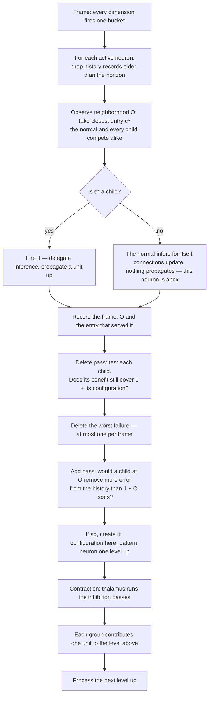

# Universal Compression with Actions and Rewards (UCAR)

UCAR is the design for the full pattern lifecycle: recognition of existing patterns, creation of new ones, and
their refinement after birth. The substrate is an online compression engine whose dictionary entries are
situations — "universal" in the sense that nothing in it assumes a particular source.

The structural unit is the **neighborhood configuration**. A neuron looks at its whole neighborhood, and a
recurring configuration that pays for itself becomes a pattern one level up. Resolution shrinks going up
by **contraction**: neighbors inhibit each other so only a spread-out subset propagates upward.

Every structural decision a neuron makes is [one test](#the-one-test), evaluated exactly against the
[frames it remembers](#the-history).

This document specifies the spatial axis (`d = 0`, same frame). The event axis (`d > 0`) and action axis (`d < 0`) 
are [open ports](#temporal-the-open-port).

## The substrate

The encoder declares **channels**; each channel declares **dimensions**; each dimension declares a resolution
(its bucket count). Every frame, every declared dimension quantizes its input to exactly one bucket, so:

> **Exactly one neuron is active per dimension per frame.**

A neuron's coordinate is `(dim_id, bucket_id)`; its channel is the channel owning that dimension. 
The "off" state of a binary pixel is its bucket-0 neuron firing, not an absence.

The encoder also declares which channels are neighbors of which. This declaration is for base level only. 
Neighborhood is detected dynamically in higher levels. Receptive fields grow with depth through composition. 
This is the only place topology enters the design.

## The unit: a neuron and its neighborhood

A neuron's **neighborhood** is the active neurons of its declared neighbor channels, and the assignment of values
it sees across them is its **configuration**. A spatial pattern is a **named configuration**: the neuron looks
around and reports what it sees upward.

**On the spatial axis, neighborhood, context, and inferences are one set.** The neurons a neuron infers are
exactly the neurons it uses as context, which are exactly its neighbors — there is no separate target set and no
separate conditioning set. Whether the inference comes from connections or from a fired child, it covers that one
set and nothing else. This document says **neighborhood** throughout.

**One configuration per neuron per frame.** The neighborhood is an assignment, so at any frame a neuron sees
exactly one configuration. At radius 1 with binary channels there are 2⁸ = 256 possible configurations — a
finite, small space.

At most one child can be activated, per neuron per frame. 
If a neuron could activate several children, each channel would carry several active
units, those would all become neighbors one level up, and the count would square at every level.

## The base model: what a neuron expects

Before any pattern exists, a neuron already has a cheap expectation about each neighbor, and it gets it by counting.

Every frame the neuron is active, it notes which bucket each neighbor dimension is in and adds one to a counter.
Those counters are its **connections**. After enough frames they answer, for each neighbor dimension separately:
how often is that dimension in each of its buckets, on the frames where I am active?

A pixel neuron that is on might find that across the 100 frames where it was on, its left neighbor was on in 60
and off in 40. Its connections hold 60/40 — a distribution, not a verdict. The neuron infers with the whole
distribution and never collapses it to a single expected value:

```
p(D = b | P) = strength(P → D_b) / Σ_b' strength(P → D_b')
```

Combining the per-neighbor favorites into one expected neighborhood would
build a joint out of parts that cannot express a joint, and the result need not be anything the neuron has ever
seen — if the left neighbor is usually on and the right neighbor is usually on but never both at once, that
combination is a neighborhood that never occurs. Connections are used as the distribution they are.

**What it cannot do.** The counters are one number per neighbor bucket, so the base model
is bounded at `neighbor dimensions × buckets` and never grows with experience. And it stores each neighbor
separately: it records that the left neighbor is usually on and that the right neighbor is usually on, but never
that they are on *together*. It cannot represent a joint at all.

That gap is what patterns exist to fill. 
A pattern is not a better version of the same thing, it is the only thing that can hold a configuration:

```
creation  → connections → child patterns
```

Connections are not free — they are part of the neuron's line in the dictionary and are counted in its [cost](#the-cost). 
What separates them from patterns is that their count is capped at `neighbor dimensions × buckets` and stops growing, 
while a neuron's children have no such ceiling. A neuron's dictionary line grows with the children it creates.

**A neuron updates its connections only on frames where no child fired.** 
The two are exclusive: a neuron either infers from its own connections or delegates to a child.
So, every frame is explained by exactly one of them and neither learns from the other's frames. 
Connections stay the model of the typical neighborhood; patterns hold what they cannot reach.

**Cold start is silence.** A neuron with no neighbors seen yet has no connections and infers nothing. 
That is the initial case, not an error.

### The normal

The neighborhood a neuron usually sees is its **normal**, and it is held as a routing table entry like any other:
a stored configuration, set to the first context the neuron observes and [refined](#refinement) from its own
context counts thereafter. The neuron measures distance from it exactly as it measures distance from a child.

The normal is **not a child**. It has no pattern neuron, it never propagates, and it is never deleted — a neuron
always has a normal, and its storage is the connections, which are paid for already. It competes for frames like
any other entry and it appears in the [history](#the-history) like any other server.

**On the spatial axis the normal and the connections are the same.** Because context and inference are the
same set here, counting how often each neighbor was present when the normal served *is* counting connection
strengths, and the normal's stored configuration is those counts resolved to a single neighborhood. The two names
describe one object from two sides — the connections as a per-neighbor distribution, the normal as the
configuration to measure against. Combining per-neighbor favorites into a configuration would be meaningless as an
*equality test*, since the result need not be anything the neuron has ever seen; as a *position to measure
distance from* it is exactly right, because that distance is the number of neurons the neuron got wrong.

On the temporal axis they come apart, which is the whole difference between the axes — see
[the open port](#temporal-the-open-port).

## What a neuron does with a frame

An active neuron routes its neighborhood `O` to the closest entry it has — one of its **children**, or its
[normal](#the-normal). That server does the inference: a **child** fires and delegates it to the pattern one level
up; the **normal** infers for itself and propagates nothing. The connections update only when the normal served —
the rule from [the base model](#the-base-model-what-a-neuron-expects).

Then the neuron writes the frame into its [history](#the-history) and reconsiders its structure: at most one entry
deleted, at most one child added, both by [the same test](#the-one-test). That is all a neuron ever does.

**There is no surprise gate.** Nothing asks whether a frame was surprising enough to be worth keeping. A
neighborhood the connections already predict well costs almost nothing to serve, no matter how often it recurs —
not because a threshold rejected it, but because there was nothing left to explain. A neighborhood they miss costs
a lot, and that cost is exactly what a new child would remove. Surprise is the size of the bill, not a gate on it.

That is also why connections learning is not a leak. Whatever pairwise can absorb it absorbs, and each frame it
absorbs makes that neighborhood cheaper to serve next time. What never shrinks is the part pairwise structurally
cannot reach — the joint — and that residual is exactly what a child is for.

## Recognition

A neuron's routing table holds its [normal](#the-normal) and its **children**, each a stored configuration. Every
child has a pattern neuron one level up. There is no probationary stage: a child is created only once the history
already shows it pays for itself, so there is nothing left for a trial period to establish.

**The neuron matches its neighborhood against every entry and the closest serves** — one algorithm over all of
them. Matching is partial: the observation need not equal a stored configuration exactly, and an entry goes on
serving variations of a shape for as long as it is [worth its storage](#the-one-test). That is the whole
tolerance; there is no separate threshold.

What serving means depends on the winner:

- **A child.** It fires — **delegation**: the neuron hands the job of describing this neighborhood to the pattern
  one level up, which propagates. **At most one child fires**, because the job goes to a single delegate, which is
  what preserves one-active-per-channel all the way up.
- **The normal.** The neuron recognizes its usual situation and infers for itself, from its connections. Nothing
  is delegated and nothing propagates, so **the neuron is the apex** — see
  [contraction](#contraction-building-the-level-above).

Either way the winner's stored configuration moves toward the core of what it actually serves — this is
[refinement](#refinement).

## The history

A neuron remembers the frames it was active for, one horizon back. Each record is the **neighborhood it observed**
and **which entry served it**:

```
history = [ (frame, O, server) ... ]      spanning the last horizon
```

On each activation the neuron drops records older than the horizon and appends the current one. Nothing else
accumulates — no balance, no running error, no rent. Every structural decision is read off this window directly.

**It is small.** Eight binary neighbors pack into a byte, so a neuron active through most of a thousand-frame
horizon carries on the order of a kilobyte. That is the whole of a neuron's memory beyond its connections and its
entries.

**It has to be the frames, not a summary.** A running error total cannot answer the question deletion asks: when
an entry goes, its frames fall to whoever is next closest, and only the frames themselves say who that is. Caching
each frame's second-best server does not rescue it either — the moment a deletion happens the second-best becomes
the best, and no third-best was recorded to take its place. Keeping the frames is what makes deletion decidable at
all, and having them makes every other decision exact rather than estimated.

At radius 1 binary there are 256 possible configurations, but only a small subset both recurs and stays
unexplained by the connections: for a neuron sitting on a "1", vertical, horizontal and cross configurations recur
far more than the rest. The others are served by whichever entry is closest and never justify one of their own.

## The routing table is a facility location problem

**The plain problem.** Customers are spread over a map. You may open warehouses. Opening one costs a fixed
amount; serving a customer costs in proportion to how far it is from the warehouse serving it. Minimize the sum.
Open too few and customers are served from far away; open too many and you pay to open them. The optimum balances
the two. The half that decides which customer is served by which warehouse is the **demand routing** problem —
the two are always solved together, because you cannot price a warehouse without knowing what it will serve.

**The mapping is direct:**

| Facility location | Here |
|---|---|
| A customer, i.e. one unit of demand | One frame's observed neighborhood, kept in the [history](#the-history) |
| A facility | A child |
| Opening a facility | Creating a child, and the pattern neuron it mints one level up |
| Opening cost | `1 + |O|` — the neuron created, plus the configuration stored |
| Serving a customer from a facility | Describing this frame's neighborhood through that child |
| Service cost, i.e. distance | What the mismatch costs — the neurons the child got wrong |
| The assignment of customers to facilities | The [match](#recognition) |

So **matching is the routing half and minting is the opening half**, and they are one problem. Every frame is a
customer arriving, served by the entry it matches, at a cost equal to how wrong that entry was.

**What the opening cost is here.** Serving badly is easy to picture — the child got some neurons wrong, and the
mismatch costs something. Opening is less obvious, because nothing is physically built. It costs two things: the
**pattern neuron minted one level up**, and the **configuration stored** in this neuron's routing table. Hence
`1 + |O|`. What that new neuron later grows — its own connections, its own children — is its own affair, judged by
its own tests at its own level. A neuron's *existence* is decided by its parent; a neuron's *structure* is decided
by itself.

The opening cost is not a tax bolted on — without it the problem has a trivial and useless answer. If opening were
free you would put a warehouse on top of every customer: perfect service, zero distance, and one facility per
frame ever seen. It is the only thing standing between the design and memorizing every frame.

### The distance

A child names a configuration; the neuron observed one. The distance between them is the number of neurons the
child would get wrong, counted in both directions:

```
d(O, c) = |O △ C(c)|     neurons present that the child does not name
                       + neurons the child names that are not present
```

This is Hamming distance over the neighborhood, and it is not a separate notion invented for matching — it is
literally the corrections that would follow this activation in the file. The service cost and the match distance
are the same number.

### The one test

There is exactly one structural rule in the design:

> **An entry earns its place when the errors it removes from the history exceed what it costs to store.**

Both halves are counts of neurons, and both are read off the [history](#the-history):

```
cost(e)     =  1 + |C(e)|                                  the neuron it mints, plus its configuration
benefit(e)  =  Σ over the history  [ d(O, next(O)) − d(O, e) ]   over the frames e wins
```

where `next(O)` is the best entry *other than* `e` — what that frame would fall back to if `e` did not exist.
Benefit is simply the total error `e` spares the window by existing.

**The same test runs at both moments.** Applied to a configuration not yet stored, it says whether to **add**.
Applied to one already stored, it says whether to **keep**. That identity is what makes the design stable: an
entry cannot fail the test and then immediately pass the identical test, so nothing can be deleted and re-added in
a loop. There is no separate opening rule, no threshold, and no accumulator — the question is asked directly of
real frames.

**Why this replaces a threshold.** A threshold asks *is this neighborhood within θ of that child?*, and θ is not
derivable from anything. This asks *is this entry worth what it costs?* — where the cost is a count of neurons the
neuron already knows and the benefit is measured against frames it already holds. Tolerance falls out rather than
being set: an entry absorbs variation for exactly as long as absorbing it is cheaper than storing a replacement.

### The normal is always in the comparison

The [normal](#the-normal) competes for every frame on the same footing as the children, and before a neuron has any
child it is the only candidate. **It is never deleted**: it is the neuron's own inference and the fallback when
nothing else fits, and its storage is the connections, which are already paid for. Every other entry faces the
test.

A neuron whose world is genuinely stable serves from its normal forever and creates nothing.

### The frame, step by step

For an active neuron with observed neighborhood `O`:

1. **Age.** Drop history records older than the horizon.
2. **Route.** Take the closest entry `e*` by `d(O, e*)`; the normal and every child compete alike.
3. **Serve.** `e*` serves. A child fires and delegates to its pattern one level up; the normal infers for itself,
   propagates nothing, and the connections update. At most one child fires.
4. **Record.** Append `(frame, O, e*)` to the history.
5. **Delete pass.** Test each child. Delete the one that fails by the widest margin — **at most one per frame**,
   because deletions interact: two children covering the same demand each look redundant while the other stands,
   and removing both at once would be wrong. Deleting one and re-testing next frame settles it correctly.
6. **Add pass.** Test a candidate child at `O`. If it passes, create it — the pattern neuron one level up, and the
   configuration in the routing table.

Steps 5 and 6 are the same test on different subjects. The delete pass folds into the routing scan of step 2,
since both need each entry's distance to the frames it serves.

### Merge and split need no machinery of their own

The standard local search for facility location has three moves, and each is already something the design does:

- **Close.** Shut a facility and reassign its demand — the delete pass, evaluated exactly, because the history
  says where each orphaned frame goes.
- **Move.** Relocate a facility toward the customers it serves — [refinement](#refinement).
- **Split.** Divide a facility serving two populations. This is **move plus add**: refinement pulls the child
  toward whichever population dominates, the other is then served badly, and the add pass finds that a child at
  the neglected demand point removes more error than it costs. Merge is likewise **close plus reassignment**.

So neither merge nor split is a move the design has to add; they are what the ordinary operations compose into.
Nearest-wins is safe because a badly-served frame is never absorbed silently — it stays in the history with its
error visible, and the add pass sees it.

## The cost

### It is all one file

Take the whole run — every frame the brain has seen — and write it as a single file a decoder could read back to
reproduce every frame exactly. The file has two parts:

1. **The dictionary.** For each neuron, what it is: itself, the neurons its connections reach, and the
   configuration of each of its children. An id alone reconstructs nothing, so the decoder has to be told what the
   neuron *does*, and what it does is infer its neighborhood two ways — through its connections and through its
   children.
2. **The frames.** For each frame, its apex neurons, followed by whatever those apex neurons got wrong about the
   level below them.

You could write the encoder and decoder, run them, and measure the result. Its length is one number, and **every
cost in this design is a part of it, counted in neurons** — one symbol is one neuron:

```
activating an apex neuron  =  1                             a line in the frames
the errors it made         =  the neurons it got wrong      the corrections after it
having a child             =  1 + |configuration|           a line in the dictionary
```

This is a **fixed-length code**: every neuron costs one symbol regardless of how often it is used. Pricing symbols
by actual occurrence is a variable-length code over the same file, an experiment rather than the design — see
[forgetting.md](forgetting.md).

### The window is what makes the two comparable

The dictionary is written once; the frames are written over and over. Those are not comparable until you fix a
stretch of frames to compare against, and that stretch is the **horizon**. Over one horizon the file is

```
L  =  Σ over entries (1 + |configuration|)        written once
   +  Σ over frames in the horizon (1 + errors)   written every frame
```

and [the one test](#the-one-test) is nothing more than the derivative of this: an entry belongs in `L` when
removing it would lengthen the file more than deleting its line would shorten it. Add and delete are the two
directions of that same difference. **Nothing is amortized and nothing is estimated** — the neuron holds the
frames, so it evaluates the sum.

`H` is the only number not fixed by counting. Offline it is simply how long the file is. Online there is no known
end and the source drifts, so `H` stands for how long the world is assumed to hold still. That is the single place
the horizon enters the design, and it is the design's only free parameter.

**A short horizon overfits.** Minimizing `L` over the window is not minimizing it over the run: with too few
frames in view, a neuron will build structure for coincidences that have not proven themselves beyond the window.
That is the cost of the honesty — there is no smoothing left to hide behind, so horizon sensitivity should be
expected to be sharp, and measured early.

### What shrinking the file actually looks like

The frame part of the file dominates, because it is written `H` times. Shortening it means **fewer apex neurons
per frame**: 784 names on a 28×28 input if nothing compressed, 200 if level 1 covers the frame with 200 apex
neurons, 50 if level 2 covers it with 50. That reduction is what the whole design is for.

But the frame part alone is not the objective, and taking it as one has a degenerate optimum: memorize each frame
as a single top-level pattern. One apex neuron, full coverage, the shortest possible frame part — and a dictionary
holding one line per frame ever seen, which is longer than the input it replaced. So 784 → 200 → 50 is a win only
when the patterns that achieved it are **reused across many frames** rather than opened per frame.

Every structural decision is the same question: does the move shorten the file, dictionary included?
**No similarity thresholds exist anywhere in the design.**

### Every decision is local

Each neuron evaluates `L` over its own neighborhood only, so the sum of local evaluations is not the length of the
file — the same base event is witnessed by every neuron whose neighborhood contains it. This is accepted: local
evaluations gate local decisions cheaply and in parallel, and
[contraction](#contraction-building-the-level-above) is what stops that redundancy from multiplying up the levels.

Nothing consults a global total. A neuron's costs scale with what it holds, never with the size of the brain,
which is why a naive neuron creates cheaply — its exploration budget, not a leak, since the same local test that
created a child deletes it when the demand moves away.

The global quantity is therefore measured directly rather than summed: **apex neurons per level per frame, and
the dictionary size that bought them.** That pair is the standing metric, and the local evaluations are only a
cheap parallel proxy for it.

## Creating a child

When [the test](#the-one-test) passes on a candidate, the neuron creates a child: a configuration in its own
routing table, and a **pattern neuron one level above its own level**. Both are what the `1 + |O|` paid for.

- The pattern **inherits its parent's channel**. That channel then infers its neighbor channels at the higher
  level.
- Its trigger is the child's configuration, which goes on moving under [refinement](#refinement).
- **It is created with no connections.** Its connections belong to its own level, which has not been observed at
  the moment of creation. As the level above populates, the newborn learns its connections there by ordinary
  co-occurrence counting.
- Its own structure — those connections, and any children of its own — is judged by its own tests at its own
  level. The parent decided that it should exist; nothing decides for it what it becomes.

Deletion is the same event run backwards: the configuration leaves the routing table and the pattern neuron is
released. Nothing irreplaceable goes with it, because the evidence lives in the [history](#the-history) rather
than in the entry — if the same configuration is justified again, the add pass rebuilds it from the same frames.

## Contraction: building the level above

A neuron firing a child is not yet compression. If all 49 neurons of a 7×7 grid fire a child, level 1 has 49
active units and nothing has been compressed. **Contraction is what makes the level above smaller than the level
below.**

Contraction runs **in the thalamus**, **dynamically between levels** during the level sweep: level 0 is
processed, contraction determines what propagates to level 1, level 1 is processed, and so on. It is this
frame's routing, recomputed each frame — patterns persist, owned by a channel; only which of them propagates
upward is decided here.

Each neuron carries an **activation strength**, and it is not a separate quantity: it is the
[benefit](#the-one-test) of the child that fired — the errors that child removes from the history. A child with a
large benefit is one whose demand keeps returning and which serves it well, so ranking by benefit ranks by how
established a pattern is.

A neuron that fired no child — one that served from its [normal](#the-normal) — has no such benefit and does not
take part. It delegated nothing and propagated nothing, so it is already the top of its own chain: **executing the
normal is what makes a neuron an apex.** Only neurons that delegated to a child are candidates here, which is
consistent with contraction being what turns fired children into the level above.

**The passes**, executed by the thalamus since these are cross-neuron comparisons:

1. **Survivors.** A neuron survives if its activation strength is the local maximum among its **immediate
   neighbors** — radius 1 only, never further. A survivor inhibits those neighbors.
2. **Coverage.** Among neurons that neither survived nor are adjacent to a survivor, take the local maxima of
   that remaining set; they survive too. Repeat until every neuron survives or touches a survivor.
3. **Groups.** Each inhibited neuron is absorbed by the adjacent survivor with the **highest activation
   strength**, ties broken by **neuron id**.

Nothing propagates. A survivor only ever inhibits its immediate neighbors, so a group is a survivor plus some of
its neighbors — **at most 9 cells**. The extra passes add survivors in uncovered areas; they never stretch an
existing group.

**The level above.** Each group contributes one unit. The adjacency at that level is **derived**: two units are
neighbors iff any of their members were neighbors below. The neighbor relation is declared once, at level 0, and
every level above computes its own.

**Termination is structural.** Because no two survivors can be adjacent, the survivor count is capped by the
maximum independent set of the grid — on 7×7 with 8-connectivity, every other row and column, i.e. 16:

```
49  →  ≤16  →  ≤4  →  1
```

The reduction is enforced by the topology, not by tuning and not by the data.

**Receptive fields grow by composition.** A level-1 unit covers its group; a level-2 unit covers a group of
groups. The declared radius stays 1 forever.

## Estimation

**No probability sets a cost.** Distance is a count of neurons, cost is a count of neurons, savings is a count of
neurons — the pricing never leaves whole numbers, so no estimator, smoothing, or boundary correction is needed.

The only frequencies in the design are the **connection counts**, and they are used raw. The base model predicts
each neighbor by the argmax of its counts; a prediction only has to name a bucket, not price one, so nothing is
smoothed. A new child's configuration is the exact observation that created it and it serves that observation with
zero error, so the old worry that a pattern could be created unable to fire on its own configuration cannot arise.

Estimators return only in [forgetting.md](forgetting.md), where the file is re-priced by how often each neuron
occurs — the one variable-length code in which probabilities set costs.

## Refinement

A child's configuration is the **median of the frames it serves**: for each neighbor, present in the configuration
iff it is present in more than half of those frames. Under Hamming distance that is exactly the point minimising
total distance to the frames served, so it is not an approximation of the right configuration — it is the right
configuration, computable directly from the [history](#the-history).

This is facility location's **move**: a child relocating onto the demand it serves. A shape whose boundary was
drawn wrong when it was created corrects as soon as the frames say so, and a neighbor that only sometimes appears
drops out of the configuration by falling under half, so no prune rule is needed.

Because the median is recomputed rather than drifted toward, it can shift the moment the history changes — and a
shifted configuration changes distances, so frames may change hands. That reassignment is what the delete and add
passes see on the following frame.

Connections carry no refinement — they are plain accumulated counts.

## One frame, in order



## Implementation plan

Each phase lands independently and is measured before the next. The headline metric is the objective itself:
**survivors per level per frame, paired with the dictionary size that bought them.** Alongside it: MNIST accuracy
(train and held-out), neuron counts per level, patterns per neuron, and wall-clock per frame.

**Phase 1 — the configuration loop at level 0.** The whole-neighborhood configuration; the normal and inference
from the pairwise connection distributions; the history window; the nearest entry serving, with at most one child
firing per neuron; the delete pass and the add pass, both running the one test against the history. Capped at one
level so the recursion is not a variable yet. Measure the history's size and the wall-clock of the add pass early —
they are what decide whether the exact evaluation is affordable.

**Phase 2 — contraction.** The inhibition passes, groups, derived adjacency, and the level-above construction.
Measured by the per-level reduction factor and the depth at which it terminates; the prediction is
49 → ≤16 → ≤4 → 1.

**Phase 3 — the readout gate.** Once growth is bounded and depth settles, compare held-out accuracy against
what the level counts justify. Do not build past this phase if the answer is no.

Variable-length pricing lands on its own track, specified in [forgetting.md](forgetting.md).

## Risks

- **The readout is unvalidated.** Compressing harder can produce a *worse* classifier, because a Naive-Bayes
  readout can be living on exactly the position-and-class-specific duplicates that compression deletes. Phase 3
  is the gate.
- **Cold-start churn.** With a nearly-empty history every configuration looks novel, so early tests are decided by
  very little evidence and children may be created and deleted in bursts. The tests correct themselves as the
  window fills, but measure churn over the first thousand frames rather than settled counts.
- **The add pass is the expensive step.** The delete pass can be kept cheap — the routing scan already touches
  every entry, and per-child sums can be maintained incrementally. The add pass cannot: scoring a candidate at `O`
  means measuring it against every frame in the history. Activation is not sparse where it matters, since with one
  bucket per dimension firing every frame the bucket-0 neuron of a mostly-off pixel is active almost always, so
  that history is long. Running the add pass only when the current frame was served with error above zero should
  make it rare for a settled neuron, since a perfectly served frame cannot justify a new child. That is an
  expectation, not a guarantee — instrument the wall-clock share of the add pass before trusting it.
- **Window overfitting.** Every decision is exact with respect to the horizon and blind beyond it. Too short a
  horizon and the neuron builds structure for coincidences; too long and it is slow to follow a drifting source.
  With rent gone there is no smoothing anywhere, so sensitivity to the horizon should be sharper than before.
- **Dictionary redundancy.** Contraction shrinks the width of each level; it does not shrink the dictionary. The
  same shape is learned separately at every position — this is the [reuse](#open-questions) question, and it is
  the largest source of waste the design does not yet address.

## Open questions

Ordered by when they should be settled: the routing table first, then level processing.

### Routing table

- **Ranking the normal against a child.** The closest entry serves, but a child propagates upward while the normal
  does not. When the normal is closest by a hair and a child is nearly as close, which serves — the strictly
  closest, or the one that propagates? The document assumes strictly closest; whether propagation should break
  near-ties is undecided.
- **Where a new child lands.** The add pass tests a candidate at the current observation `O`. A candidate placed at
  the [median](#refinement) of the frames it would win might pass where the raw observation fails, and would land
  better. Testing more than one candidate per frame costs more passes over the history.
- **Whether one delete and one add per frame is enough.** It bounds the work and lets interacting deletions settle
  one at a time, but it also caps how fast the structure can follow a shift. Whether that ceiling ever binds is
  empirical.

*Settled here:* partial matching needs no threshold — an entry serves variations for as long as it passes the one
test. The add and delete rules are the same test, so nothing can be deleted and immediately re-added. The
opening cost is `1 + |O|`: the pattern neuron minted one level up, plus the configuration stored here. And the
history is the exact frames rather than any summary, because deletion cannot be evaluated without them.

### Level processing

- **The level transition.** Contraction, grouping, reuse, and merging are one operation, run by the thalamus at
  the boundary between levels, and together they decide which neurons are active at the level above. §Contraction
  writes only the inhibition half. The two questions inside it: whether reuse is keyed on the group's shape rather
  than on any single neuron's configuration, and which unit earns the saving once a group collapses. This is the
  biggest gap in the document.
- **Configuration space beyond the small case.** Eight binary neighbors is 256 configurations — finite and
  countable. Radius 2 is 2²⁴, and more buckets multiply it further. Exact-configuration counting is bounded
  precisely in the regime where it is least needed. What replaces it when the neighborhood is larger?
- **Configuration space at higher levels.** Above level 0 the neighbors are patterns, and the per-channel
  alphabet grows as patterns are promoted, so the configuration space is not fixed. One-active-per-neuron holds
  each channel to a single state, but the space still expands with the structure. What bounds the child count there?
- **Reuse across positions.** Identity is keyed by absolute dimension, so nothing shares a shape across positions —
  the same configuration is learned separately everywhere it occurs. Contraction fixes the width of each level, not
  this redundancy of the dictionary. It is filed under Risks today and belongs with the level transition.

### Independent

- **Parallelism.** The inhibition passes are cross-neuron comparisons and run in the thalamus. Whether they can be
  parallelised, or pushed into neurons given a shipped view of neighbor strengths, is undetermined.

## Still to write

- **The level-transition section.** Contraction, reuse, grouping, and merging as one thalamic operation. Everything
  else in the document stands on top of it.
- **Terminology.** §Contraction says "survivor" and §The cost says "apex neuron" for the same set. Pick one.
- **Move dictionary redundancy out of Risks** and into the level-transition section once that exists.

## Temporal: the open port

The event axis (`d > 0`) is not specified here. Two things are known about where it lands:

- **The context is the active neurons at `d > 0`**, used to infer the next frame.
- **A temporal pattern infers its own level**, not the one below, so at the moment of its creation its event
  connections are empty — the next frame has not been observed yet. It learns them once that frame arrives, the
  same rule as the spatial side: a new child has no connections and learns them at its own level.

**The mechanism is the same on both axes.** A neuron holds a [normal](#the-normal) and children, keeps a
[history](#the-history) of the frames it was active for, routes each frame to the closest entry, and creates or
deletes children by [the one test](#the-one-test). Nothing in that needs the context and the inference to be the
same set — it needs only a distance and a storage cost.

What differs is **when the distance can be read**. On the spatial axis context and inference are one set, so the
error is known in the same frame and the history record is complete when it is written. On the event axis the
match is against a context at `d > 0` while what is inferred is the next frame, so a record cannot be scored until
that frame arrives and is completed one frame late. That is a bookkeeping delay, not a structural difference.

The one thing the event axis faces that the spatial axis does not is that **one context can lead to several
outcomes.** Spatially the demand point fully specifies the child, because the neighborhood is both the match and
the prediction. Temporally the demand point is a `(context, outcome)` pair, and two frames sharing a context but
differing in outcome cannot both be served by a context-keyed child. The economics degrades gracefully — the
normal predicts the dominant outcome, eats the error on the rest, and the test creates children until whatever
genuinely distinguishes the contexts is found. What remains after that is irreducible uncertainty, which no model
removes. Whether the event axis needs more than this — a tiebreak among same-context children, or a child carrying
several outcomes — is the open decision.
