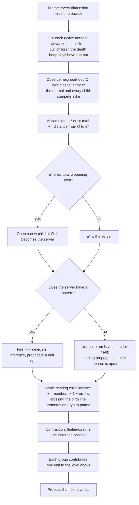

# Universal Compression with Actions and Rewards (UCAR)

UCAR is the design for the full pattern lifecycle: recognition of existing patterns, creation of new ones, and
their refinement after birth. The substrate is an online compression engine whose dictionary entries are
situations — "universal" in the sense that nothing in it assumes a particular source.

The structural unit is the **neighborhood configuration**. A neuron looks at its whole neighborhood, and a
recurring configuration that pays for itself is promoted to a pattern one level up. Resolution shrinks going up
by **contraction**: neighbors inhibit each other so only a spread-out subset propagates upward.

This document specifies the spatial axis (`d = 0`, same frame). The event axis (`d > 0`) and action axis (`d < 0`) 
are [open ports](#temporal-the-open-port).

## The substrate

The encoder declares **channels**; each channel declares **dimensions**; each dimension declares a resolution
(its bucket count). Every frame, every declared dimension quantizes its input to exactly one bucket, so:

> **Exactly one neuron is active per dimension per frame.**

A neuron's coordinate is `(dim_id, bucket_id)`; its channel is the channel owning that dimension. 
The "off" state of a binary pixel is its bucket-0 neuron firing, not an absence.

The encoder also declares which channels are neighbors of which. This declaration is for base level only. 
Neighborhood is detected dynamically in higher levels. Receptive fields grow with depth through composition. 
This is the only place topology enters the design.

## The unit: a neuron and its neighborhood

A neuron's **neighborhood** is the active neurons of its declared neighbor channels, and the assignment of values
it sees across them is its **configuration**. A spatial pattern is a **named configuration**: the neuron looks
around and reports what it sees upward.

**On the spatial axis, neighborhood, context, and inferences are one set.** The neurons a neuron infers are
exactly the neurons it uses as context, which are exactly its neighbors — there is no separate target set and no
separate conditioning set. Whether the inference comes from connections or from a fired child, it covers that one
set and nothing else. This document says **neighborhood** throughout.

**One configuration per neuron per frame.** The neighborhood is an assignment, so at any frame a neuron sees
exactly one configuration. At radius 1 with binary channels there are 2⁸ = 256 possible configurations — a
finite, small space.

At most one child can be activated, per neuron per frame. 
If a neuron could activate several children, each channel would carry several active
units, those would all become neighbors one level up, and the count would square at every level.

## The base model: what a neuron expects

Before any pattern exists, a neuron already has a cheap expectation about each neighbor, and it gets it by counting.

Every frame the neuron is active, it notes which bucket each neighbor dimension is in and adds one to a counter.
Those counters are its **connections**. After enough frames they answer, for each neighbor dimension separately:
how often is that dimension in each of its buckets, on the frames where I am active?

A pixel neuron that is on might find that across the 100 frames where it was on, its left neighbor was on in 60
and off in 40. Its connections hold 60/40 — a distribution, not a verdict. The neuron infers with the whole
distribution and never collapses it to a single expected value:

```
p(D = b | P) = strength(P → D_b) / Σ_b' strength(P → D_b')
```

Combining the per-neighbor favorites into one expected neighborhood would
build a joint out of parts that cannot express a joint, and the result need not be anything the neuron has ever
seen — if the left neighbor is usually on and the right neighbor is usually on but never both at once, that
combination is a neighborhood that never occurs. Connections are used as the distribution they are.

**What it cannot do.** The counters are one number per neighbor bucket, so the base model
is bounded at `neighbor dimensions × buckets` and never grows with experience. And it stores each neighbor
separately: it records that the left neighbor is usually on and that the right neighbor is usually on, but never
that they are on *together*. It cannot represent a joint at all.

That gap is what patterns exist to fill. 
A pattern is not a better version of the same thing, it is the only thing that can hold a configuration:

```
creation  → connections → child patterns
```

Connections are not free — they are part of the neuron's line in the dictionary and are counted in its [cost](#the-cost). 
What separates them from patterns is that their count is capped at `neighbor dimensions × buckets` and stops growing, 
while a neuron's children have no such ceiling. A neuron's rent cost rises with the patterns it creates.

**A neuron updates its connections only on frames where no child fired.** 
The two are exclusive: a neuron either infers from its own connections or delegates to a child.
So, every frame is explained by exactly one of them and neither learns from the other's frames. 
Connections stay the model of the typical neighborhood; patterns hold what they cannot reach.

**Cold start is silence.** A neuron with no neighbors seen yet has no connections and infers nothing. 
That is the initial case, not an error.

### The normal

The neighborhood a neuron usually sees is its **normal**, and it is held as a routing table entry like any other:
a stored configuration, set to the first context the neuron observes and [refined](#refinement) from its own
context counts thereafter. The neuron measures distance from it exactly as it measures distance from a child.

The normal is **not a child**. It has no pattern neuron, it never propagates, it is never promoted, and it does
not die — a neuron always has a normal. What it does have is an error accumulator, like everything else.

**On the spatial axis the normal and the connections are the same.** Because context and inference are the
same set here, counting how often each neighbor was present when the normal served *is* counting connection
strengths, and the normal's stored configuration is those counts resolved to a single neighborhood. The two names
describe one object from two sides — the connections as a per-neighbor distribution, the normal as the
configuration to measure against. Combining per-neighbor favorites into a configuration would be meaningless as an
*equality test*, since the result need not be anything the neuron has ever seen; as a *position to measure
distance from* it is exactly right, because that distance is the number of neurons the neuron got wrong.

On the temporal axis they come apart, which is the whole difference between the axes — see
[the open port](#temporal-the-open-port).

## What a neuron does with a frame

An active neuron routes its neighborhood `O` to the closest entry it has — one of its **children**, or its
[normal](#the-normal). That server does the inference: a **pattern** fires and delegates it to the child one level
up; the **normal**, or an **embryo**, infers for itself and propagates nothing. Either way the server banks what it
spared, accumulates what it got wrong, and every child pays its rent. The full accounting is
[facility location](#the-routing-table-is-a-facility-location-problem); this section is what it means. The
connections update only when no pattern fired — the rule from [the base model](#the-base-model-what-a-neuron-expects).

**There is no surprise gate.** Nothing tests whether a frame was surprising enough to be worth keeping. A
neighborhood the connections already predict well costs almost nothing to serve, no matter how often it recurs —
not because a threshold rejected it, but because there was nothing left to explain. A neighborhood they miss costs
a lot, and that cost is what accumulates toward opening a child. Surprise is the size of the bill, not a gate on it.

That is also why connections learning is not a leak. Whatever pairwise can absorb it absorbs, and each frame it
absorbs makes that neighborhood cheaper to serve next time. What never shrinks is the part pairwise structurally
cannot reach — the joint — and that residual is exactly what a child is for.

## Recognition

A neuron's routing table holds its [normal](#the-normal) and its **children** — each a stored configuration.
Children carry the two running tallies, [balance and accumulated error](#two-tallies); the normal
carries only the error. Some children have a pattern neuron; the rest are embryos. **An embryo is a child whose
pattern has not been created yet** — that is the only difference, and matching treats them alike.

**The neuron matches its neighborhood against every entry and the closest serves**, one algorithm over all of
them, normal or child, born or embryo. Matching is partial: the observation need not equal a stored configuration
exactly, and an entry keeps serving variations of a shape until its accumulated error would pay for a replacement.
That is the whole tolerance — there is no separate threshold.

What serving means depends on the winner:

- **Pattern.** It fires — **delegation**: the neuron hands the job of describing this neighborhood to the child one
  level up, which propagates. **At most one pattern fires**, because the job goes to a single delegate, which is
  what preserves one-active-per-channel all the way up.
- **Normal.** The neuron recognizes its usual situation and infers for itself, from its connections. Nothing is
  delegated and nothing propagates, so **the neuron is the apex** — see [contraction](#contraction-building-the-level-above).
- **Embryo.** The same as the normal for this frame — the neuron infers for itself and nothing propagates — but the
  child banks toward its birth line as well.

Either way the winner's stored configuration strengthens toward the core of what it actually serves — this is
[refinement](#refinement).

## The womb: the unborn children

The **womb** is a neuron's embryos — the children it has opened but not yet promoted. It is not a separate
structure and has no matching rule of its own; it is simply the children whose balance has not yet crossed the
birth line.

At radius 1 binary, 256 configurations are possible. Opening one child per configuration would be an explosion,
but only a small subset both recurs and stays unexplained by the connections: for a neuron sitting on a "1",
vertical, horizontal and cross configurations recur far more than the rest. The others are served by whichever
child is closest and never accumulate the error it would take to open one of their own.

**The womb holds configurations only.** It does not cluster connections.

**Promotion and demotion.** An embryo becomes a pattern when its [balance](#the-balance-is-the-whole-lifecycle)
crosses the birth line at one horizon of rent; it does not move, it stays where it is and gains a pattern neuron
one level up. The same crossing runs in reverse: a pattern whose balance falls back below the line is withdrawn to
an embryo, keeping everything it learned. How the balance is banked, and how a badly-served child opens a *new* one
at the demand point, is the [facility location](#the-routing-table-is-a-facility-location-problem) machinery below.

## The routing table is a facility location problem

**The plain problem.** Customers are spread over a map. You may open warehouses. Opening one costs a fixed
amount; serving a customer costs in proportion to how far it is from the warehouse serving it. Minimize the sum.
Open too few and customers are served from far away; open too many and you pay to open them. The optimum balances
the two. The half that decides which customer is served by which warehouse is the **demand routing** problem —
the two are always solved together, because you cannot price a warehouse without knowing what it will serve.

**The mapping is direct:**

| Facility location | Here |
|---|---|
| A customer, i.e. one unit of demand | One frame's observed neighborhood |
| A facility | A child |
| Opening a facility | Creating a child, and eventually a pattern for it |
| Opening cost | The child's rent over one horizon |
| Serving a customer from a facility | Describing this frame's neighborhood through that child |
| Service cost, i.e. distance | What the mismatch costs — the neurons the child got wrong |
| The assignment of customers to facilities | The [match](#recognition) |

So **matching is the routing half and minting is the opening half**, and they are one problem. Every frame is a
customer arriving. It is served by the child it matches, at a cost equal to how wrong that child was. When the
demand piling up on a poorly-served region would have paid for a warehouse, a warehouse opens there.

**What the opening cost is here.** Serving a customer badly is easy to picture — the child got some neurons wrong,
and the mismatch costs something. Opening is less obvious, because nothing is physically built. What it costs is
**holding the child**: recording the configuration once, and thereafter making it harder every frame to say which
child served that frame. Charged per frame that is rent; over a horizon it is what a warehouse cost to build.

It is not a tax bolted on — without it the problem has a trivial and useless answer. If opening were free you
would open a warehouse on top of every customer: perfect service, zero distance, and one facility per frame ever
seen. The opening cost is the only thing standing between the design and memorizing every frame.

### Why this replaces a threshold

A threshold asks: *is this neighborhood within θ of that child?* It needs θ, and θ is not derivable from anything.

Facility location never asks that. It asks: **is it cheaper to serve this neighborhood from a child that already
exists, or to open a new one?** That comparison has no free parameter — the opening cost is the child's own cost,
already defined, and the service cost is the mismatch, already measurable. The tolerance falls out of the
comparison rather than being set: a child absorbs error up to the price of a replacement.

Distance is the **number of neurons the child would get wrong** — the same count that appears in the file as the
corrections following an activation. Nothing weights one position above another.

### The distance

A child names a configuration; the neuron observed one. The distance between them is the number of neurons the
child would get wrong, counted in both directions:

```
d(O, c) = |O △ C(c)|     neurons present that the child does not name
                       + neurons the child names that are not present
```

This is Hamming distance over the neighborhood, and it is not a separate notion invented for matching — it is
literally the corrections that would follow this activation in the file. The service cost and the match distance
are the same number.

### Serve or open: one comparison

A neuron's routing table holds its [normal](#the-normal) and its **children** — each a stored configuration, each
child an embryo or a pattern. When the neuron is active it faces one question about its neighborhood `O`: serve it
from an entry it has, or open a new child?

**The closest entry always serves.** Serving from `e*` costs `d(O, e*)` this frame — the neurons it gets wrong.
Opening a new child at `O` costs `|O|`, the size of the neighborhood: a newborn starts just below the birth line
and takes one full horizon of rent to die unused, and one horizon of rent is `|O|`.

The two do not compare frame-to-frame — `d` is paid now, `|O|` is a horizon-long commitment — so bridge them by
**accumulation over the same horizon**. If `e*` keeps serving this demand it keeps paying `d`, so `e*` sums the
errors it makes, and that sum [decays over the horizon](#two-tallies) so it measures a rate rather than a lifetime:

> **Open a new child at `O` when `e*`'s accumulated error reaches `|O|`** — equivalently, when `e*`'s error rate
> exceeds the rent the new child would cost.

By then, serving from `e*` has cost as much as building would have, so the new child has provably paid for itself.
Below that line, tolerating `e*`'s imperfection is the cheaper option — **and that toleration is the partial
match.** No separate matching threshold exists: an entry absorbs variation up to exactly the point where a
replacement would be cheaper, and the tolerance `|O|` is a number the neuron already holds. Novelty is the same
rule at speed — an `O` far from everything makes `d ≈ |O|` in a single frame and opens a child at once. This is
the deterministic form of online facility location's randomized rule (open with probability `distance / cost`):
accumulate instead of gamble, and open once the sum arrives.

### The normal is always in the comparison

The [normal](#the-normal) is one of the entries, so it competes for every frame on the same footing as the
children. Before a neuron has any child it is the only candidate, and `O` is scored against it — the error being
how far reality fell from the neuron's usual neighborhood. That error accumulates exactly as a child's would, and
reaching `|O|` buys the first child. **The first child is opened by the same rule that later splits a crowded
one**; there is no separate bootstrap.

The normal never retires and never wins by default. Any frame where no child is closer is served, and scored, by
it — and a neuron whose world genuinely is stable simply serves from its normal forever and opens nothing.

### Two tallies

A child carries two running quantities, answering different questions:

- **Balance** — savings minus rent — decides what the child *is*. Each serve adds what it spared,
  `members − 1 − errors`; every frame drains rent. Crossing the birth line at one horizon of rent makes it a
  **pattern** that propagates a unit upward; below the line it is an **embryo**, recognized and banking toward
  birth but not yet propagating; at zero it is deleted. An embryo banks the savings it *would* deliver, which is
  how it climbs.
- **Accumulated error** decides whether the entry needs a *neighbor* — it sums the neurons the entry gets wrong,
  and reaching `|O|` opens one. A child can be solvent overall yet sloppy on part of its territory; balance and
  error are independent, and that independence is what lets a useful child shed its ill-fitting demand rather than
  die of it.

**The error accumulator is a sliding window one horizon wide**, not a lifetime total. This is not a detail. A
lifetime sum cannot tell noise from structure: an entry averaging a twentieth of a neuron wrong still reaches
`|O|` eventually, so given enough frames *every* entry spawns, however well it fits. Only the rate distinguishes
them, and a lifetime sum discards the rate.

Windowed, the accumulator holds the errors of the last horizon, which at a steady error rate `r` is `r × horizon`.
So it reaches `|O|` exactly when

```
r × horizon ≥ |O|     and since rent = |O| / horizon,     r ≥ rent
```

and **the opening test is that the entry's error rate exceeds the rent of the child it would open** — the honest
form of the comparison a single frame could never make. Errors below rent never open anything, no matter how long
the entry runs; errors above it open children at a rate proportional to the excess. Because the window holds the
actual errors rather than a decayed estimate of them, that threshold is exact.

The [normal](#the-normal) carries only the second tally. It has no balance because it has nothing to prove and
nothing to lose — it is never promoted and never deleted — but it accumulates error like anything else, and that
is what lets it open the neuron's first child.

### Holding the window

The window is a queue of `(frame, error)` records spanning one horizon, holding the errors themselves rather than
an estimate of them. Four things keep it small:

- **Only nonzero errors are recorded.** A clean serve adds nothing to the sum, so it needs no record. This is what
  the size scales with — error events, not activations — and it means a well-fitting entry keeps an empty queue and
  costs nothing. An entry with a long queue is by definition one about to open a child and shed that error.
- **Children do not multiply the records.** Exactly one entry serves per activation, so the union of a neuron's
  queues is that neuron's own error history over the horizon. Opening children redistributes records among
  entries; it never adds any.
- **A window is aged only when its entry serves.** The opening test reads the serving entry's total and nothing
  else, so a stale total elsewhere is never consulted. Each record is evicted exactly once, which is amortized
  constant work per activation rather than work proportional to the number of children.
- **The total is carried, not recomputed** — added on push, subtracted on eviction — so reading it is free and only
  eviction costs anything.

**The balance cannot be handled the same way**, because an entry whose balance has run out would otherwise go on
winning matches. Rent drains at a constant rate, so the frame an entry reaches zero is computable the moment its
balance changes; each neuron keeps those death frames in a heap and an activation touches only the entries that
actually died, not all of them.

### The frame, step by step

When a neuron becomes active it first **advances the clock** to the current frame: the death heap gives up every
child whose balance has drained to zero since it last fired, and those are culled. A child unused across a long
gap may already be dead when the neuron wakes. The error windows are not touched here — each is aged when its own
entry serves, since nothing else reads it.

Then, for observed neighborhood `O`:

1. **Route.** Take the closest entry `e*` by `d(O, e*)` — the normal and every child compete alike.
2. **Accumulate.** `e*` adds `d(O, e*)` to its error total.
3. **Open?** If that total reaches `|O|`, create a new child at `O`; it becomes this frame's server, and `e*`'s
   total drops by `|O|`.
4. **Serve.** The server serves. A pattern fires and delegates inference to its upward neuron; the normal or an
   embryo infers from the neighborhood itself, propagating nothing, and the connections update. At most one
   pattern fires.
5. **Bank.** A serving child's balance rises by `members − 1 − errors`, and crossing the birth line promotes an
   embryo to a pattern. The normal has no balance and banks nothing.

On an opening frame the new child is the server, so it banks its first serve — `|O| − 1`, landing just below the
birth line — while `e*`, which only triggered the split, banks nothing. This is facility location's split move
with nothing added to produce it: an entry accumulates its own error and spawns a child for the part it serves
worst. Where that child lands need not be representative; [refinement](#refinement) moves it toward the demand it
actually serves.

### Merge and split need no machinery of their own

The standard local search for facility location has three moves, and each one is already something the design
does for other reasons:

- **Close.** Shut a facility and reassign its demand. This is death: a child whose balance drains below zero is
  released, and the frames it used to serve match elsewhere or open something new. Rent is what makes the move
  affordable — the exact version would re-solve the whole assignment to ask whether closing helps, and rent asks
  the same question a little at a time, locally.
- **Move.** Relocate a facility toward the customers it actually serves. This is [refinement](#refinement): the
  stored configuration drifts toward the recurring core of the frames that match it.
- **Split.** Divide a facility serving two populations. This is **move plus open** — refinement pulls the child
  toward whichever population dominates, the other is then served badly, its accumulated error reaches `|O|`, and
  a sub-child opens. Merge is likewise **close plus reassignment**.

So neither merge nor split is a move the design has to add; they are what the ordinary operations compose into.
Nearest-wins is safe here precisely because the closest entry, even while serving, still tallies what it got
wrong — a badly-served frame is never absorbed silently, and the accumulated error eventually forces the split.

## The cost

### One file, one per-frame ledger

Take the whole run — every frame the brain has seen — and write it as a single file a decoder could read back to
reproduce every frame exactly. The file has two parts:

1. **The dictionary.** For each pattern, the configuration it holds — which neighbors it names.
2. **The history.** For each frame, its apex neurons, followed by whatever those apex neurons got wrong about the
   level below them.

You could write the encoder and decoder, run them, and measure the result. Its length is one number, and **every
cost in this design is a part of it, counted in neurons** — one symbol is one neuron:

```
activating an apex neuron  =  1                               a line in the history
the errors it made         =  the neurons it got wrong        the corrections after it
having a pattern           =  1 + |connections| + Σ over its born children |configuration|   a line in the dictionary
```

A pattern's dictionary line cannot be its id alone — an id reconstructs nothing. The decoder has to be told what
the neuron does, and what it does is infer its neighborhood two ways: through its connections, and through its
children. So its line is itself, the neurons its connections reach, and the members of each born child.

**The two parts look like different kinds of cost — one paid once, two paid every frame — but they are the same
unit.** Divide the whole file by the `H` frames it covers, and all three land in one per-frame ledger:

```
per-frame cost  =  Σ rent          having, spread: (pattern cost) / H, over every pattern held
                +  activations      1 per apex neuron this frame
                +  errors           neurons gotten wrong this frame
```

The dictionary does not sit outside the history; it **enters it as rent.** Rent is not a second kind of cost laid
over the design — it is the one-time having-cost seen from inside the per-frame ledger, which is the only place a
one-time cost and a recurring one can be compared. Every decision reads from this one ledger: serving pays
activation plus errors, holding pays rent, and a pattern earns its keep when the errors it removes per frame beat
the rent it adds.

**Cost is whatever the neuron currently is**, not what it was at birth: as a pattern grows its own connections and
opens its own children, its dictionary line lengthens and its rent rises with it. This is also why an established
neuron demands more before adding structure — a longer line means higher rent means the next child has more to
beat. There is no crowding term anywhere; there is just more structure to write down.

### The horizon is the one free choice

`H` is the only number not fixed by counting. Offline it is simply how long the file is. Online there is no known
end and the source drifts, so `H` stands for how long the world is assumed to hold still — the payback period a
pattern is bet to survive. Rent is how that bet is collected, one frame at a time. That is the single place the
horizon enters the design.

The bet can be lost, and losing it is not an accounting error. In the real file a pattern's dictionary line is
paid in full once, however briefly it lives; a pattern that dies after five frames still cost its whole line but
paid only five frames of rent. Being online means not knowing the future, so the design bets a horizon, charges
rent against the bet, and lets the balance delete what does not pay.

**Embryos are never in the file.** A child with no pattern is the neuron's own bookkeeping — nothing about it is
transmitted and a decoder never learns it existed. It is charged rent all the same, against the pattern it is
proposing, so an embryo has to earn like a pattern before it becomes one. This is a **fixed-length code**:
every neuron costs one symbol regardless of how often it is used. Pricing symbols by actual occurrence is a
variable-length code over the same file, an experiment rather than the design — see [forgetting.md](forgetting.md).

### The balance is the whole lifecycle

Rent is charged against every **child**, and each carries exactly one number: its **balance**. This is the same
quantity [contraction](#contraction-building-the-level-above) reads as activation strength.

- It **rises** when the child serves a frame, by what having it spared.
- It **drains** every frame by the child's rent.

Where the balance sits decides what the child is. It is one number climbing from zero toward a cap of **two
horizons of rent**, and the opening line at one horizon is the midpoint it crosses on the way:

```
2 horizons of rent                 the cap
[1 horizon, 2 horizons] of rent    the child has a pattern
(0, 1 horizon) of rent             the child is an embryo
0                                  the child is deleted
```

**Nothing happens to the balance at birth.** It accumulates continuously; crossing the midpoint simply changes
what the child is called, from embryo to pattern. There is no grant and no discontinuity — the second horizon is
headroom a pattern earns by continuing to serve, and the cap is what stops it banking more life than two horizons.

**The crossing is reversible.** A pattern near the midpoint that stops serving drains below it, is withdrawn, and
is an embryo again — holding everything it learned. Serving again re-crosses and it is reborn without having lost
its statistics. Flickering across the line is harmless because the crossing costs nothing; only draining all the
way to zero deletes it.

That is why a pattern never falls off a cliff. The old distinction between "not yet born" and "died" collapses:
both are the same child at different points on one axis, and the axis is the balance.

**Forgetting is not a separate mechanism.** Charging rent against children *is* aging. What
[forgetting.md](forgetting.md) still carries is only the question of whether this beats a uniform forget rate,
which is an experiment rather than a mechanism.

### What shrinking the file actually looks like

The frame part of the file dominates, because it is written `H` times. Shortening it means **fewer apex neurons
per frame**: 784 names on a 28×28 input if nothing compressed, 200 if level 1 covers the frame with 200 apex
neurons, 50 if level 2 covers it with 50. That reduction is what the whole design is for.

But the frame part alone is not the objective, and taking it as one has a degenerate optimum: memorize each frame
as a single top-level pattern. One apex neuron, full coverage, the shortest possible frame part — and a dictionary
holding one line per frame ever seen, which is longer than the input it replaced. So 784 → 200 → 50 is a win only
when the patterns that achieved it are **reused across many frames** rather than opened per frame.

Every structural decision is the same question: does the move shorten the file, dictionary included?
**No similarity thresholds exist anywhere in the design.**

### Every decision is local

Each neuron charges rent and measures service cost over its own neighborhood only, so the sum of local ledgers is
not the length of the file — the same base event is witnessed by every neuron whose neighborhood contains it.
This is accepted: local ledgers gate local decisions cheaply and in parallel, and [contraction](#contraction-building-the-level-above)
is what stops that redundancy from multiplying up the levels.

Nothing consults a global total. Rent scales with the neuron's own child count, never with the size of the brain,
which is why a naive neuron opens cheaply — its exploration budget, not a leak, since the same local comparison
that opened a child closes it when demand moves away.

The global quantity is therefore measured directly rather than summed: **apex neurons per level per frame, and
the dictionary size that bought them.** That pair is the standing metric, and the local ledgers are only a cheap
parallel proxy for it.

## Birth

A child whose balance crosses one horizon of rent gains a pattern neuron **one level above the neuron's own
level**. If the balance later falls back below that line the pattern is withdrawn and the child is an embryo
again, so this is a crossing rather than a one-way event.

- The pattern **inherits its parent's channel**. That channel then infers its neighbor channels at the higher
  level.
- Its trigger is the child's configuration, and the child keeps accumulating on it — what was banked toward birth
  becomes [refinement](#refinement) after.
- **It is born with no connections.** Its connections belong to its own level, which has not been observed at
  the moment of birth. As the level above populates, the newborn learns its connections there by ordinary
  co-occurrence counting.
- Its balance carries over from the crossing, which is what [forgetting.md](forgetting.md) charges against.

## Contraction: building the level above

A neuron firing a child is not yet compression. If all 49 neurons of a 7×7 grid fire a child, level 1 has 49
active units and nothing has been compressed. **Contraction is what makes the level above smaller than the level
below.**

Contraction runs **in the thalamus**, **dynamically between levels** during the level sweep: level 0 is
processed, contraction determines what propagates to level 1, level 1 is processed, and so on. It is this
frame's routing, recomputed each frame — patterns persist, owned by a channel; only which of them propagates
upward is decided here.

Each neuron carries an **activation strength**, and it is not a separate quantity: it is the
[balance](#the-balance-is-the-whole-lifecycle) of the child that fired. A child deep into solvency is one whose
demand keeps returning, so ranking by balance ranks by how established a pattern is.

A neuron that fired no pattern — one that served from its [normal](#the-normal) or an embryo — has no such balance
and does not take part. It delegated nothing and propagated nothing, so it is already the top of its own chain:
**executing the normal is what makes a neuron an apex.** Only neurons that delegated to a child are candidates
here, which is consistent with contraction being what turns fired children into the level above.

**The passes**, executed by the thalamus since these are cross-neuron comparisons:

1. **Survivors.** A neuron survives if its activation strength is the local maximum among its **immediate
   neighbors** — radius 1 only, never further. A survivor inhibits those neighbors.
2. **Coverage.** Among neurons that neither survived nor are adjacent to a survivor, take the local maxima of
   that remaining set; they survive too. Repeat until every neuron survives or touches a survivor.
3. **Groups.** Each inhibited neuron is absorbed by the adjacent survivor with the **highest activation
   strength**, ties broken by **neuron id**.

Nothing propagates. A survivor only ever inhibits its immediate neighbors, so a group is a survivor plus some of
its neighbors — **at most 9 cells**. The extra passes add survivors in uncovered areas; they never stretch an
existing group.

**The level above.** Each group contributes one unit. The adjacency at that level is **derived**: two units are
neighbors iff any of their members were neighbors below. The neighbor relation is declared once, at level 0, and
every level above computes its own.

**Termination is structural.** Because no two survivors can be adjacent, the survivor count is capped by the
maximum independent set of the grid — on 7×7 with 8-connectivity, every other row and column, i.e. 16:

```
49  →  ≤16  →  ≤4  →  1
```

The reduction is enforced by the topology, not by tuning and not by the data.

**Receptive fields grow by composition.** A level-1 unit covers its group; a level-2 unit covers a group of
groups. The declared radius stays 1 forever.

## Estimation

**No probability sets a cost.** Distance is a count of neurons, cost is a count of neurons, savings is a count of
neurons — the pricing never leaves whole numbers, so no estimator, smoothing, or boundary correction is needed.

The only frequencies in the design are the **connection counts**, and they are used raw. The base model predicts
each neighbor by the argmax of its counts; a prediction only has to name a bucket, not price one, so nothing is
smoothed. A newborn's configuration is the exact observation that opened it and it serves that observation with
zero error, so the old worry that a pattern could be born unable to fire on its own configuration cannot arise.

Estimators return only in [forgetting.md](forgetting.md), where the file is re-priced by how often each neuron
occurs — the one variable-length code in which probabilities set costs.

## Refinement

On each serve, the members present strengthen and the absent ones dilute relatively as the serve count grows.
This is an online mode collapse: the stored configuration converges to the recurring core of the frames the child
actually serves, so a shape whose boundary was drawn slightly wrong at birth converges to the right one through
ordinary use. Low-share members are born low and fade, so no explicit prune rule is needed. This is facility
location's **move**: a pattern relocating toward the demand it serves.

Connections carry no refinement — they are plain accumulated counts.

## One frame, in order



## Implementation plan

Each phase lands independently and is measured before the next. The headline metric is the objective itself:
**survivors per level per frame, paired with the dictionary size that bought them.** Alongside it: MNIST accuracy
(train and held-out), neuron counts per level, patterns per neuron, and wall-clock per frame.

**Phase 1 — the configuration loop at level 0.** The whole-neighborhood configuration; inference from the
pairwise connection distributions; the children with partial matching; the nearest child serving, banking to its
balance, and accumulating error to open new children; promotion when the balance crosses the opening line;
recognition as a match with at most one pattern firing per neuron. Capped at one level so the recursion is not a variable yet.

**Phase 2 — contraction.** The inhibition passes, groups, derived adjacency, and the level-above construction.
Measured by the per-level reduction factor and the depth at which it terminates; the prediction is
49 → ≤16 → ≤4 → 1.

**Phase 3 — the readout gate.** Once growth is bounded and depth settles, compare held-out accuracy against
what the level counts justify. Do not build past this phase if the answer is no.

Forgetting lands on its own track, specified and phased in [forgetting.md](forgetting.md).

## Risks

- **The readout is unvalidated.** Compressing harder can produce a *worse* classifier, because a Naive-Bayes
  readout can be living on exactly the position-and-class-specific duplicates that compression deletes. Phase 3
  is the gate.
- **Cold-start churn.** Early on nearly every neighborhood is novel, so patterns open in bursts. The balance
  drains the ones that do not recur, but the transient can be large. Measure churn in the first thousand frames,
  not just settled counts.
- **The densely-firing entry with persistent small error.** [Holding the window](#holding-the-window) is cheap
  because clean serves record nothing, but an entry that fires on most frames and is slightly wrong on each records
  on most of them. Activation is not sparse where it matters — with one bucket per dimension firing every frame,
  the bucket-0 neuron of a mostly-off pixel is active almost always. The saving grace should be that such an entry
  crosses its opening line quickly, sheds the error to a new child, and returns to recording nothing, making the
  long queue a transient. That is an expectation, not a guarantee. Instrument the longest queue over the first
  thousand frames rather than assuming it.
- **Dictionary redundancy.** Contraction shrinks the width of each level; it does not shrink the dictionary. The
  same shape is learned separately at every position — this is the [reuse](#open-questions) question, and it is
  the largest source of waste the design does not yet address.

## Open questions

Ordered by when they should be settled: the routing table first, then level processing.

### Routing table

- **Ranking born against unborn.** The closest entry serves, but a pattern propagates upward while the normal and
  an embryo do not. When the closest entry is an embryo or the normal while a slightly-worse-matching pattern
  exists, which serves — the strictly closest, or the closest pattern? The document assumes strictly closest;
  whether propagation should break ties toward a born child is undecided.
- **The opening cost constant.** Opening is priced at `|O|`, the neighborhood size. Whether the child's own name
  belongs in it — `1 + |O|` — shifts every break-even by one neuron. Small, but pick one.

*Settled here:* the match tolerance is the serve-or-open comparison itself — an entry absorbs variation until its
accumulated error reaches `|O|`, so partial matching needs no separate threshold. Birth-frame attribution: on an
opening frame the new child serves and banks, while `e*` only resets its accumulator. And the error tally is an
exact sliding window one horizon wide, not a decayed estimate, which makes the opening threshold exactly
`error rate ≥ rent`.

### Level processing

- **The level transition.** Contraction, grouping, reuse, and merging are one operation, run by the thalamus at
  the boundary between levels, and together they decide which neurons are active at the level above. §Contraction
  writes only the inhibition half. The two questions inside it: whether reuse is keyed on the group's shape rather
  than on any single neuron's configuration, and which unit earns the saving once a group collapses. This is the
  biggest gap in the document.
- **Configuration space beyond the small case.** Eight binary neighbors is 256 configurations — finite and
  countable. Radius 2 is 2²⁴, and more buckets multiply it further. Exact-configuration counting is bounded
  precisely in the regime where it is least needed. What replaces it when the neighborhood is larger?
- **Configuration space at higher levels.** Above level 0 the neighbors are patterns, and the per-channel
  alphabet grows as patterns are promoted, so the configuration space is not fixed. One-active-per-neuron holds
  each channel to a single state, but the space still expands with the structure. What bounds the child count there?
- **Reuse across positions.** Identity is keyed by absolute dimension, so nothing shares a shape across positions —
  the same configuration is learned separately everywhere it occurs. Contraction fixes the width of each level, not
  this redundancy of the dictionary. It is filed under Risks today and belongs with the level transition.

### Independent

- **Parallelism.** The inhibition passes are cross-neuron comparisons and run in the thalamus. Whether they can be
  parallelised, or pushed into neurons given a shipped view of neighbor strengths, is undetermined.

## Still to write

- **The level-transition section.** Contraction, reuse, grouping, and merging as one thalamic operation. Everything
  else in the document stands on top of it.
- **Terminology.** §Contraction says "survivor" and §The cost says "apex neuron" for the same set. Pick one.
- **Move dictionary redundancy out of Risks** and into the level-transition section once that exists.

## Temporal: the open port

The event axis (`d > 0`) is not specified here. Two things are known about where it lands:

- **The context is the active neurons at `d > 0`**, used to infer the next frame.
- **A temporal pattern infers its own level**, not the one below, so at the moment of its creation its event
  connections are empty — the next frame has not been observed yet. It learns them once that frame arrives, the
  same rule as the spatial side: a newborn is born with no connections and learns them at its own level.

**The mechanism is the same on both axes.** A neuron holds a [normal](#the-normal) and children, routes each
frame to the closest, accumulates the error of whichever served, and opens a child when that error covers the
opening cost. Nothing in that needs the context and the inference to be the same set — it needs only a distance
and an opening cost.

What differs is **when the distance can be read**. On the spatial axis context and inference are one set, so the
error is known in the same frame. On the event axis the normal is matched against a context at `d > 0` while what
it infers is the next frame, so the error is only known once that frame arrives and is charged a frame late. That
is a timing difference, not a structural one.

The one thing the event axis faces that the spatial axis does not is that **one context can lead to several
outcomes.** Spatially the demand point fully specifies the child, because the neighborhood is both the match and
the prediction. Temporally the demand point is a `(context, outcome)` pair, and two frames sharing a context but
differing in outcome cannot both be served by a context-keyed child. The economics degrades gracefully — the
normal predicts the dominant outcome, eats the error on the rest, and that error opens children until whatever
genuinely distinguishes the contexts is found. What remains after that is irreducible uncertainty, which no model
removes. Whether the event axis needs more than this — a tiebreak among same-context children, or a child carrying
several outcomes — is the open decision.
