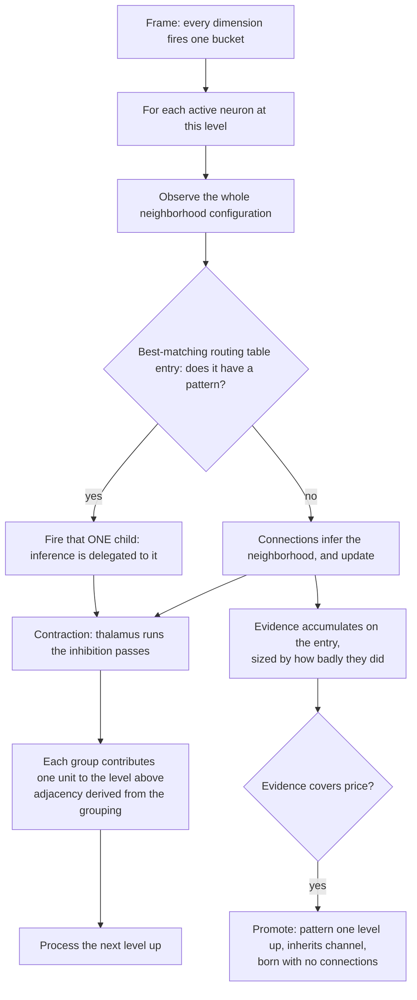

# Universal Compression with Actions and Rewards (UCAR)

UCAR is the design for the full pattern lifecycle: recognition of existing patterns, creation of new ones, and
their refinement after birth. The substrate is an online compression engine whose dictionary entries are
situations — "universal" in the sense that nothing in it assumes a particular source.

The structural unit is the **neighborhood configuration**. A neuron looks at its whole neighborhood, and a
recurring configuration that pays for itself is promoted to a pattern one level up. Resolution shrinks going up
by **contraction**: neighbors inhibit each other so only a spread-out subset propagates upward.

This document specifies the spatial axis (`d = 0`, same frame). The event axis (`d > 0`) and action axis (`d < 0`) 
are [open ports](#temporal-the-open-port).

## The substrate

The encoder declares **channels**; each channel declares **dimensions**; each dimension declares a resolution
(its bucket count). Every frame, every declared dimension quantizes its input to exactly one bucket, so:

> **Exactly one neuron is active per dimension per frame.**

A neuron's coordinate is `(dim_id, bucket_id)`; its channel is the channel owning that dimension. 
The "off" state of a binary pixel is its bucket-0 neuron firing, not an absence.

The encoder also declares which channels are neighbors of which. This declaration is for base level only. 
Neighborhood is detected dynamically in higher levels. Receptive fields grow with depth through composition. 
This is the only place topology enters the design.

## The unit: a neuron and its neighborhood

A neuron's **neighborhood** is the active neurons of its declared neighbor channels, and the assignment of values
it sees across them is its **configuration**. A spatial pattern is a **named configuration**: the neuron looks
around and reports what it sees upward.

**On the spatial axis, neighborhood, context, and inferences are one set.** The neurons a neuron infers are
exactly the neurons it uses as context, which are exactly its neighbors — there is no separate target set and no
separate conditioning set. Whether the inference comes from connections or from a fired child, it covers that one
set and nothing else. This document says **neighborhood** throughout.

**One configuration per neuron per frame.** The neighborhood is an assignment, so at any frame a neuron sees
exactly one configuration. At radius 1 with binary channels there are 2⁸ = 256 possible configurations — a
finite, small space.

The substrate's "exactly one active per dimension" has to survive going up, which requires **at most one active
unit per neuron per frame**. If a neuron could activate several children, each channel would carry several active
units, those would all become neighbors one level up, and the count would square at every level. [Recognition](#recognition)
is what makes this hold.

## The base model: what a neuron expects

Before any pattern exists, a neuron already has a cheap expectation about each neighbor, and it gets it by
counting.

Every frame the neuron is active, it notes which bucket each neighbor dimension is in and adds one to a counter.
Those counters are its **connections**. After enough frames they answer, for each neighbor dimension separately:
how often is that dimension in each of its buckets, on the frames where I am active?

A pixel neuron that is on might find that across the 100 frames where it was on, its left neighbor was on in 60
and off in 40. Its connections hold 60/40 — a distribution, not a verdict. The neuron infers with the whole
distribution and never collapses it to a single expected value:

```
p(D = b | P) = strength(P → D_b) / Σ_b' strength(P → D_b')
```

**There is no default configuration.** Combining the per-neighbor favorites into one expected neighborhood would
build a joint out of parts that cannot express a joint, and the result need not be anything the neuron has ever
seen — if the left neighbor is usually on and the right neighbor is usually on but never both at once, that
combination is a neighborhood that never occurs. Connections are used as the distribution they are.

**What it cannot do.** The counters are one number per neighbor bucket, so the base model
is bounded at `neighbor dimensions × buckets` and never grows with experience. And it stores each neighbor
separately: it records that the left neighbor is usually on and that the right neighbor is usually on, but never
that they are on *together*. It cannot represent a joint at all.

That gap is what patterns exist to fill, and it is why connections never compete with the dictionary — a pattern
is not a better version of the same thing, it is the only thing that can hold a configuration:

```
marginal  →  pairwise (connections, bounded)  →  configurations (patterns, unbounded)
```

Connections are not free — they are part of the neuron's line in the dictionary and are counted in its
[cost](#the-cost). What separates them from patterns is that their count is capped at
`neighbor dimensions × buckets` and stops growing, while a routing table has no such ceiling. A neuron's rent
therefore rises with the patterns it opens, never with how long it has been counting.

**A neuron updates its connections only on frames where no child fired.** The two are exclusive: a neuron either
infers from its own connections or delegates to a child, so every frame is explained by exactly one of them and
neither learns from the other's frames. Connections stay the model of the typical neighborhood; patterns hold
what pairwise cannot reach.

**Cold start is silence.** A neuron with no neighbors seen yet has no connections and infers nothing. That is the
base case, not an error.

## What a neuron does with a frame

An active neuron does one of two things:

1. **The neighborhood matches an entry that has a pattern.** Fire it. Inference is delegated to that child, and
   nothing else happens — connections do not update and no evidence accumulates.
2. **Anything else.** The connections infer the neighborhood, the connections update, and evidence accumulates on
   the matched entry **sized by how badly the connections did**.

Both halves of the second branch happen every time; they are not alternatives. There is no test for whether a
frame was surprising enough to be worth collecting. **Surprise is the size of the deposit, not a gate on it.** A
neighborhood the connections already predict well contributes almost nothing no matter how often it recurs — not
because a threshold rejected it, but because there was nothing left to explain. A neighborhood they badly miss
contributes a lot.

That is also why connections learning from surprising frames is not a leak. Whatever pairwise can absorb, it
absorbs, and each frame it absorbs makes the same neighborhood cheaper next time. What never shrinks is the part
pairwise structurally cannot reach — the joint — and that residual is exactly what a pattern is for.

## Recognition

A neuron keeps **one routing table**. Each entry is a configuration the neuron has observed, together with the
statistics it has accumulated on that configuration. Some entries have a pattern neuron born from them; the rest
do not, yet. That is the only difference between them — **an embryo is a routing table entry whose pattern has
not been created yet.**

**A neuron matches its observed neighborhood against every entry, and the best match wins.** This is a match, not
an economic test. Matching is partial: an observed configuration need not equal a stored one exactly, which is
what lets minor variations of a shape be recognized as that shape. **It is one algorithm over the whole table**,
applied identically whether the entry it lands on is born or unborn. The exact rule is [open](#open-questions).

What happens next depends only on whether the winning entry has a pattern:

- **Born.** Fire it. Firing is **delegation**: the neuron hands the job of describing this neighborhood to the
  child rather than doing it from its own connections. **At most one child fires**, because a job is handed to one
  delegate and not split among several — which is what preserves one-active-per-channel all the way up. On a fire
  the entry's statistics strengthen; this is [refinement](#refinement).
- **Unborn.** The entry accumulates evidence, and the neuron infers from its own connections as usual.

If nothing matches, the observed configuration opens a new entry, unborn.

## The womb: the unborn entries

The **womb** is the unborn part of the routing table. It is not a separate structure and it does not have its own
matching rule — it is the entries that have accumulated evidence but do not have a pattern yet.

At radius 1 binary, 256 configurations are possible. Opening one entry per configuration would be an explosion,
but only a small subset both recurs and stays unexplained by the connections: for a neuron sitting on a "1",
vertical, horizontal and cross configurations recur far more than the rest.

**The womb holds configurations only.** It does not cluster connections.

**How few entries there are is decided by the match.** Two neighborhoods differing in one position should usually
land on the same entry, or the table degenerates into one entry per distinct configuration ever seen. This is the
same partial match [recognition](#recognition) uses — the tolerance that lets a born pattern fire on a variation
is the tolerance that keeps two variations from opening two entries. One rule, two consequences.

The shape of that rule is [facility location](#the-routing-table-is-a-facility-location-problem).

**Promotion.** When an entry's accumulated service cost covers a horizon's worth of its
rent, a pattern is created for it, one at a time. The entry does not move: it stays
where it is and gains a child.

## The routing table is a facility location problem

**The plain problem.** Customers are spread over a map. You may open warehouses. Opening one costs a fixed
amount; serving a customer costs in proportion to how far it is from the warehouse serving it. Minimize the sum.
Open too few and customers are served from far away; open too many and you pay to open them. The optimum balances
the two. The half that decides which customer is served by which warehouse is the **demand routing** problem —
the two are always solved together, because you cannot price a warehouse without knowing what it will serve.

**The mapping is direct:**

| Facility location | Here |
|---|---|
| A customer, i.e. one unit of demand | One frame's observed neighborhood |
| A facility | A routing table entry |
| Opening a facility | Creating an entry, and eventually a pattern for it |
| Opening cost | The entry's rent over one horizon |
| Serving a customer from a facility | Describing this frame's neighborhood through that entry |
| Service cost, i.e. distance | What the mismatch costs — the positions the entry got wrong |
| The assignment of customers to facilities | The [match](#recognition) |

So **matching is the routing half and minting is the opening half**, and they are one problem. Every frame is a
customer arriving. It is served by the entry it matches, at a cost equal to how wrong that entry was. When the
demand piling up on a poorly-served region would have paid for a warehouse, a warehouse opens there.

**What the opening cost is here.** Serving a customer badly is easy to picture — the entry got some positions
wrong, and the mismatch costs something. Opening is less obvious, because nothing is physically built. What it
costs is **holding the entry**: recording the configuration once, and thereafter making it harder every frame to
say which entry served that frame. Charged per frame that is rent; over a horizon it
is what a warehouse cost to build.

It is not a tax bolted on — without it the problem has a trivial and useless answer. If opening were free you
would open a warehouse on top of every customer: perfect service, zero distance, and one facility per frame ever
seen. The opening cost is the only thing standing between the design and memorizing every frame.

### Why this replaces a threshold

A threshold asks: *is this neighborhood within θ of that entry?* It needs θ, and θ is not derivable from
anything.

Facility location never asks that. It asks: **is it cheaper to serve this neighborhood from an entry that already
exists, or to open a new one?** That comparison has no free parameter — the opening cost is the price, which is
already defined, and the service cost is the mismatch, which is already measurable. A crowded neuron has a higher
price, so it tolerates worse matches rather than opening again. A sparse neuron opens more readily. The tolerance
falls out of the neuron's own circumstances instead of being set.

Distance is the **number of neurons the entry would get wrong** — the same count that appears in the file as the
corrections following an activation. Nothing weights one position above another.

### The distance

An entry names a configuration; the neuron observed one. The distance between them is the number of neurons the
entry would get wrong, counted in both directions:

```
d(O, e) = |O △ C(e)|     neurons present that the entry does not name
                       + neurons the entry names that are not present
```

This is Hamming distance over the neighborhood, and it is not a separate notion invented for matching — it is
literally the corrections that would follow this activation in the file. The service cost and the match distance
are the same number.

### Serve or open

Everything a neuron needs to decide is available the moment it observes `O`:

- **Serving** from the closest entry costs `d(O, e*)` this frame — the neurons it gets wrong.
- **Opening** a fresh entry at exactly `O` serves it with no error at all, but commits to holding it:
  `(1 + |O|) / horizon` per frame, by [what a pattern costs](#what-rent-is-made-of).

Both are per-frame quantities, so they compare directly. The neuron serves from `e*` when `d(O, e*)` is below
what opening would cost per frame, and opens otherwise. **There is no threshold in that sentence** — the tolerance
is `(1 + |O|) / horizon`, which the neuron already knows.

Two properties fall out. A large configuration is expensive to open, so the neuron tolerates more error before
opening one; a small one is cheap, so it opens readily. And a long horizon makes opening cheap per frame, so a
patient system explores more.

### The frame, step by step

For an active neuron with observed neighborhood `O` and routing table `E`:

1. **Measure.** Compute `d(O, e)` for every entry, and take the closest as `e*`.
2. **Decide.** If `d(O, e*)` is below `(1 + |O|) / horizon`, serve from `e*`. Otherwise open a new embryo whose
   configuration is `O`, and serve from that.
3. **Act.** If the serving entry has a pattern, fire it — inference is delegated and the frame is done. If it does
   not, the connections infer the neighborhood and update.
4. **Bank.** The serving entry's balance rises by what it spared: the members it covered, less one for naming it,
   less the neurons it got wrong.
5. **Charge.** Every entry in the table drains its own rent, served or not.

Step 4 is where the numbers close. An entry covering nine neurons with nothing wrong spares `9 − 1 − 0 = 8`,
against a cost of `1 + 9 = 10` to hold. It needs to serve roughly twice within a horizon to stay solvent, and
crossing a full horizon of rent is what creates its pattern.

### Arriving one at a time

Textbook facility location is offline — all customers are known, then you solve. Here demand arrives one frame at
a time and there is no going back. That is **online** facility location, and the standard treatment is: when a
customer arrives far from every open facility, open a new one with probability proportional to distance over
opening cost.

The design uses the deterministic form of the same idea. Rather than opening with probability `distance / price`,
an entry **accumulates** the distance and opens when the accumulated total reaches one horizon's rent. That is
where the promotion rule comes from: **evidence is accumulated service cost** — demand that recurred in a place no
warehouse served well — and what it has to cover is what holding a warehouse there would cost over a horizon.

### Merge and split need no machinery of their own

The standard local search for facility location has three moves, and each one is already something the design
does for other reasons:

- **Close.** Shut a facility and reassign its demand. This is death: an entry whose service saving has fallen
  below its rent is released, and the frames it used to serve match elsewhere or open something new. Rent is
  precisely how this move is made affordable — the exact version would re-solve the whole assignment to ask
  whether closing helps, and rent asks the same question a little at a time, locally.
- **Move.** Relocate a facility toward the customers it actually serves. This is [refinement](#refinement): the
  stored configuration drifts toward the recurring core of the frames that match it.
- **Split.** Divide a facility serving two populations. This is **move plus open** — refinement pulls the existing
  entry toward whichever population dominates, the other population is then served badly, its service cost
  accumulates, and it opens an entry of its own. Merge is likewise **close plus reassignment**.

So neither merge nor split is a move the design has to add. They are what the ordinary operations compose into.

**This holds on one condition:** the match has to be the serve-or-open comparison, not nearest-entry-wins. If a
frame is always captured by its closest entry, then a badly-served frame is still *served*, its demand is
absorbed silently, and nothing ever accumulates to open the second entry — the split can never happen. The
comparison has to be able to answer "none of these, open a new one," and it has to answer it before an entry with
a pattern fires, since [firing delegates and accumulates nothing](#what-a-neuron-does-with-a-frame).

## The cost

### It is all one file

Take the whole run — every frame the brain has seen — and write it down as a single file that a decoder could
read back to reproduce every frame exactly. The file has two parts:

1. **The patterns (dictionary).** For each neuron, the configuration of every pattern it holds. Recording one means naming
   which neighbors it involves.
2. **The frames (history).** For each frame, its apex neurons, followed by whatever those apex neurons got wrong about the
   level below them.

You could write the encoder and the decoder, run them, and measure the
result. Its length is one number, and **every cost in this design is part of that number:**

| Brain                          | File                                                                  |
|--------------------------------|-----------------------------------------------------------------------|
| Cost of having a pattern       | Adding a symbol to the dictionary, once                               |
| Cost of activating apex neuron | Recording a symbol in the frames history                              |
| Cost of errors                 | The corrections that follow, because the symbol was not exactly right |

These are not comparable quantities needing a conversion factor between them. 
They are the lengths of three sections of one document. 
You can only add or subtract them because they are already the same thing: how long the file is.

**Everything is counted in neurons.** One symbol is one neuron, and every cost above is a count of them:

```
activating an apex neuron  =  1
the errors it made         =  the number of neurons it got wrong
having a pattern           =  1 (itself) + |connections| + Σ over its born entries |configuration|
```

A neuron's line in the dictionary cannot be its id alone — an id reconstructs nothing. The decoder has to be told
what the neuron does, and what it does is infer its neighborhood two ways: through its connections, and through
the entries in its routing table. So its definition is itself, the neurons its connections reach, and the members
of each born entry.

**This is why an established neuron demands more before adding structure.** Nothing enforces that; it follows
from counting. A neuron that has accumulated many connections and many entries simply has a longer line in the
dictionary, so its rent is higher, so the next entry has more to beat. There is no crowding term anywhere — there
is just more structure to write down.

This is a **fixed-length code**: every neuron costs one symbol regardless of how often it is used. Pricing
symbols by how often they actually occur is a variable-length code over the same file, and it is an experiment
rather than the design — see [forgetting.md](forgetting.md).

**Embryos are not in the file.** An entry with no pattern is the neuron's own bookkeeping — nothing about it is
transmitted, and a decoder never learns it existed. It is ephemeral, and it costs the file nothing.

That does not make it free to the machine. An embryo is charged the **rent of the pattern it is proposing**: it
drains at exactly the rate that pattern would cost, and is deleted when it reaches zero. So an unborn entry has
to earn like a pattern before it is allowed to become one, and what bounds the number of embryos is not an
opening fee but the fact that most of them cannot cover the rent they are betting they can.

This is why there is no separate opening test anywhere in the design. **Accumulating a horizon's worth of rent is
the opening test.**

### Where the horizon comes from

Suppose the file covers `H` frames. 
A pattern's configuration is named once; the frame part is written `H` times. 
So a pattern is worth creating exactly when

```
cost of creating the pattern <  H × (per-frame saving from having it)
```

Divide both sides by `H`:

```
pattern cost / H  <  pattern savings per-frame
```

The left-hand side is **rent**. Rent is not a policy laid on top of the design. 
It is not a second kind of cost. 
It is what creating the pattern costs, viewed from inside a per-frame comparison. 
The two sides balance because they were one inequality before it was divided.

### What rent is made of

```
rent(pattern) = pattern cost / horizon

pattern cost  = 1                                  the pattern neuron itself
              + |connections|                      the neurons its connections reach
              + Σ over its born entries |configuration|    the members of each entry it routes through
```

Every term is a count of neurons, and the whole thing is divided by the horizon. Nothing else enters.

Cost is not fixed at birth. It is **whatever the neuron currently is** — as a pattern accumulates connections and
opens entries of its own, its line in the dictionary grows and its rent rises with it. A pattern that sprawls has
to serve more to stay solvent than one that stayed small.

An embryo has no pattern yet, so what it is charged is the cost of the pattern it is proposing: `1` for the
neuron that would be created, plus the members of its own configuration, which is the entry its parent would
route through.

### The balance is the whole lifecycle

Rent is charged **in the routing table**, and every entry carries exactly one number: its **balance**. This is the
same quantity [contraction](#contraction-building-the-level-above) reads as activation strength.

- It **rises** when the entry serves a frame, by what having it spared.
- It **drains** every frame by the entry's rent.

Where the balance sits decides what the entry is. There are no separate birth and death events — there is one
number and three regimes on it:

```
balance ≥ one horizon of rent      the entry has a pattern
0 < balance < one horizon of rent  the entry is an embryo
balance = 0                        the entry is deleted
```

**Birth is a crossing, and it is reversible.** An entry accumulates until it can cover a horizon and its pattern
comes into existence. If its demand moves away, it drains back down, the pattern is withdrawn, and the entry is
an embryo again — holding everything it learned. If the demand returns, it is reborn without having lost its
statistics. Only draining all the way to zero deletes it.

That is why a pattern never falls off a cliff. The old distinction between "not yet born" and "died" collapses:
both are the same entry at different points on one axis, and the axis is the balance.

**Forgetting is not a separate mechanism.** Charging rent in the routing table *is* aging. What
[forgetting.md](forgetting.md) still carries is only the question of whether this beats a uniform forget rate,
which is an experiment rather than a mechanism.

### What shrinking the file actually looks like

The frame part of the file dominates, because it is written `H` times. Shortening it means **fewer apex neurons
per frame**: 784 names on a 28×28 input if nothing compressed, 200 if level 1 covers the frame with 200 apex
neurons, 50 if level 2 covers it with 50. That reduction is what the whole design is for.

But the frame part alone is not the objective, and taking it as one has a degenerate optimum: memorize each frame
as a single top-level pattern. One apex neuron, full coverage, the shortest possible frame part — and a dictionary
holding one line per frame ever seen, which is longer than the input it replaced. So 784 → 200 → 50 is a win only
when the patterns that achieved it are **reused across many frames** rather than opened per frame.

Every structural decision is the same question: does the move shorten the file, dictionary included?
**No similarity thresholds exist anywhere in the design.**

### Every decision is local

Each neuron charges rent and measures service cost over its own neighborhood only, so the sum of local ledgers is
not the length of the file — the same base event is witnessed by every neuron whose neighborhood contains it.
This is accepted: local ledgers gate local decisions cheaply and in parallel, and [contraction](#contraction-building-the-level-above)
is what stops that redundancy from multiplying up the levels.

Nothing consults a global total. Rent scales with the neuron's own entry count, never with the size of the brain,
which is why a naive neuron opens cheaply — its exploration budget, not a leak, since the same local comparison
that opened an entry closes it when demand moves away.

The global quantity is therefore measured directly rather than summed: **apex neurons per level per frame, and
the dictionary size that bought them.** That pair is the standing metric, and the local ledgers are only a cheap
parallel proxy for it.

## Birth

An entry whose balance crosses one horizon of rent gains a pattern neuron **one level above the neuron's own
level**. If the balance later falls back below that line the pattern is withdrawn and the entry is an embryo
again, so this is a crossing rather than a one-way event.

- The pattern **inherits its parent's channel**. That channel then infers its neighbor channels at the higher
  level.
- Its trigger is the entry's configuration, and the entry keeps accumulating on it — what was evidence before
  birth is [refinement](#refinement) after.
- **It is born with no connections.** Its connections belong to its own level, which has not been observed at
  the moment of birth. As the level above populates, the newborn learns its connections there by ordinary
  co-occurrence counting.
- It opens with the evidence that promoted it, which is what [forgetting.md](forgetting.md) charges against.

## Contraction: building the level above

A neuron firing a child is not yet compression. If all 49 neurons of a 7×7 grid fire a child, level 1 has 49
active units and nothing has been compressed. **Contraction is what makes the level above smaller than the level
below.**

Contraction runs **in the thalamus**, **dynamically between levels** during the level sweep: level 0 is
processed, contraction determines what propagates to level 1, level 1 is processed, and so on. It is this
frame's routing, recomputed each frame — patterns persist, owned by a channel; only which of them propagates
upward is decided here.

Each neuron carries an **activation strength**, and it is not a separate quantity: it is the
[balance](#the-balance-is-the-whole-lifecycle) of the entry that fired. An entry deep into solvency is one whose
demand keeps returning, so ranking by balance ranks by how established a pattern is.

**The passes**, executed by the thalamus since these are cross-neuron comparisons:

1. **Survivors.** A neuron survives if its activation strength is the local maximum among its **immediate
   neighbors** — radius 1 only, never further. A survivor inhibits those neighbors.
2. **Coverage.** Among neurons that neither survived nor are adjacent to a survivor, take the local maxima of
   that remaining set; they survive too. Repeat until every neuron survives or touches a survivor.
3. **Groups.** Each inhibited neuron is absorbed by the adjacent survivor with the **highest activation
   strength**, ties broken by **neuron id**.

Nothing propagates. A survivor only ever inhibits its immediate neighbors, so a group is a survivor plus some of
its neighbors — **at most 9 cells**. The extra passes add survivors in uncovered areas; they never stretch an
existing group.

**The level above.** Each group contributes one unit. The adjacency at that level is **derived**: two units are
neighbors iff any of their members were neighbors below. The neighbor relation is declared once, at level 0, and
every level above computes its own.

**Termination is structural.** Because no two survivors can be adjacent, the survivor count is capped by the
maximum independent set of the grid — on 7×7 with 8-connectivity, every other row and column, i.e. 16:

```
49  →  ≤16  →  ≤4  →  1
```

The reduction is enforced by the topology, not by tuning and not by the data.

**Receptive fields grow by composition.** A level-1 unit covers its group; a level-2 unit covers a group of
groups. The declared radius stays 1 forever.

## Estimation

- **Model side: Krichevsky–Trofimov.** `p_c = (count + 1/2) / (n + 1)` — the minimax-regret universal estimator,
  derived rather than tuned. It keeps probabilities off the 0/1 boundary without an arbitrary cap.
- **Background side: raw MLE with the skip rule.** Background frequencies are plain counts over frames,
  unsmoothed. An outcome the background has never witnessed cannot be priced against it, so its term is skipped
  rather than smoothed into a finite surprise.

**The two must agree wherever they are compared.** Any test that admits a member to a pattern must use the same
estimate recognition will later apply to it, or a pattern can be born unable to fire on its own configuration.

## Refinement

On a fire, matched entries strengthen and absent entries dilute relatively as the trial count grows. This is an
online mode collapse: the stored configuration converges to the recurring core of the frames the pattern
actually fires on, so a shape whose boundary was drawn slightly wrong at birth converges to the right one
through ordinary fires. Low-share members are born low and fade, so no explicit prune rule is needed.

Connections carry no refinement — they are plain accumulated counts.

## One frame, in order



## Implementation plan

Each phase lands independently and is measured before the next. The headline metric is the objective itself:
**survivors per level per frame, paired with the dictionary size that bought them.** Alongside it: MNIST accuracy
(train and held-out), neuron counts per level, patterns per neuron, and wall-clock per frame.

**Phase 1 — the configuration loop at level 0.** The whole-neighborhood configuration; inference from the
pairwise connection distributions; deposits sized by how badly those did; the per-neuron womb over configurations
with partial matching; promotion when evidence covers price; recognition as a configuration match with at most
one child per neuron. Capped at one level so the recursion is not a variable yet.

**Phase 2 — contraction.** The inhibition passes, groups, derived adjacency, and the level-above construction.
Measured by the per-level reduction factor and the depth at which it terminates; the prediction is
49 → ≤16 → ≤4 → 1.

**Phase 3 — the readout gate.** Once growth is bounded and depth settles, compare held-out accuracy against
what the level counts justify. Do not build past this phase if the answer is no.

Forgetting lands on its own track, specified and phased in [forgetting.md](forgetting.md).

## Risks

- **The readout is unvalidated.** Compressing harder can produce a *worse* classifier, because a Naive-Bayes
  readout can be living on exactly the position-and-class-specific duplicates that compression deletes. Phase 3
  is the gate.
- **Cold-start churn.** Tiny early alphabets mean near-zero prices, so a burst of cheap early patterns appears
  with nothing in this document to remove them. Measure churn in the first thousand frames, not just settled
  counts.
- **Dictionary redundancy.** Contraction shrinks the width of each level; it does not shrink the dictionary. The
  same shape is learned separately at every position.

## Open questions

- **The match rule.** That it is [facility location](#the-routing-table-is-a-facility-location-problem) with bits
  as the distance is settled; what exactly the distance is, and therefore what lands on the same entry versus
  opens a new one, is not. It decides whether the routing table stays bounded.
- **Ranking born against unborn.** One match runs over the whole table, so an unborn entry can outscore a born
  one — the neuron would decline to fire a child it has in order to accumulate on an embryo instead. Whether that
  is correct is undecided.
- **How eagerly to open.** Comparing this frame's service cost against a per-frame rent assumes the configuration
  will recur on every frame, which makes opening almost free: at a horizon of 1000, a nine-member configuration
  tolerates only `0.01` neurons of error before opening, so nearly every imperfect frame opens an embryo. The
  online facility location result compares a single demand's distance against the **whole** opening cost and
  opens with probability `d / cost`, which for one neuron wrong out of nine is a tenth rather than a certainty.
  The eager rule is right when a configuration recurs constantly and badly wrong when it does not, and the
  randomized rule is the principled hedge. Whether the design accepts randomization, or finds a deterministic
  stand-in, is undecided — and it directly controls how many embryos exist.
- **Configuration space beyond the small case.** Eight binary neighbors is 256 configurations — finite and
  countable. Radius 2 is 2²⁴, and more buckets multiply it further. Exact-configuration counting is bounded
  precisely in the regime where it is least needed. What replaces it when the neighborhood is larger?
- **Configuration space at higher levels.** Above level 0 the neighbors are patterns, and the per-channel
  alphabet grows as patterns are promoted, so the configuration space is not fixed. One-active-per-neuron holds
  each channel to a single state, but the space still expands with the structure. What bounds the womb there?
- **Reuse.** Identity is keyed by absolute dimension, so nothing shares a shape across positions. Contraction
  fixes the width of each level, not the redundancy of the dictionary.
- **Activation strength when nothing fired.** Strength is the balance of the entry that fired, so a neuron that
  fired no pattern has none. Whether such neurons participate in the inhibition passes or survive by default is
  undetermined.
- **Parallelism.** The inhibition passes are cross-neuron comparisons and run in the thalamus. Whether they can
  be parallelised, or pushed into neurons given a shipped view of neighbor strengths, is undetermined.

## Still to write

Sections known to be missing or known to be placeholders, in the order they should be settled:

1. **The level transition.** Contraction, grouping, reuse, and merging are one operation, run by the thalamus at
   the boundary between levels, and together they determine which neurons are active at the level above. §Contraction
   currently describes only the inhibition half. Two questions inside it: whether reuse is keyed on the group's
   shape rather than on any single neuron's configuration, and which unit earns the saving once a group collapses.
2. **Terminology.** §Contraction says "survivor" and §The cost says "apex neuron" for the same set. Pick one.
3. **Dictionary redundancy.** Currently filed under Risks, describing the same shape learned separately at every
   position. That is item 1's subject, not a risk, and should move once item 1 exists.

## Temporal: the open port

The event axis (`d > 0`) is not specified here. Two things are known about where it lands:

- **The context is the active neurons at `d > 0`**, used to infer the next frame.
- **A temporal pattern infers its own level**, not the one below, so at the moment of its creation its event
  connections are empty — the next frame has not been observed yet. It learns them once that frame arrives, the
  same rule as the spatial side: a newborn is born with no connections and learns them at its own level.
