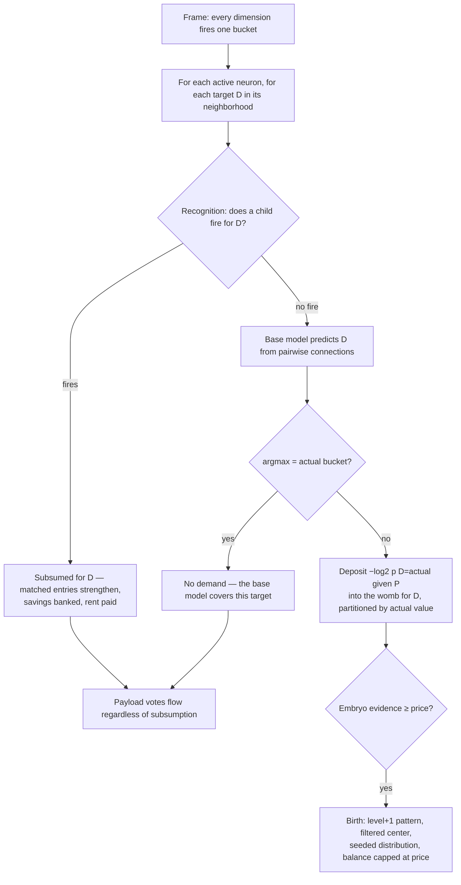

# Universal Compression with Actions and Rewards (UCAR)

UCAR is the design for the full pattern lifecycle: recognition of existing patterns, creation of new ones, and
their refinement after birth. The name states the theory: the substrate is an online compression engine whose
dictionary entries are situations ("universal" in the coding sense — KT estimation and MDL pricing are
universal-coding machinery, tuned to no assumed source), and actions and rewards ride on that dictionary as
payload — the compressor decides what exists, reward decorates what it is worth, and salience-driven one-shot
memory is explicitly out of scope (that is a hippocampal function; this is cortex).

The structural unit is the **channel pattern**: a neuron infers one target at a time, using everything else in its
neighborhood as context. This document specifies the mechanism on the spatial axis (`d = 0`, same frame). The
event axis (`d > 0`) keeps its current mechanism until the spatial side is proven — see
[Temporal](#temporal-the-open-port).

## Reference point: CALIC

The design's closest published relative is **CALIC** (Context-based Adaptive Lossless Image Codec, Wu & Memon) —
worth keeping in view because it settles what is standard and what is novel here.

CALIC codes one pixel at a time. It predicts the pixel from its causal neighbors with a gradient-adjusted
predictor, then codes the residual under a **context** formed by quantizing the surround into a few hundred
buckets, and maintains a per-context running bias correction learned from data. Three things carry over directly:

- **One target, many context.** Nobody predicts a neighborhood jointly. This is the shape of the whole field.
- **The context indexes an adaptive statistic.** Per-context bias cancellation is our pattern accumulating its
  target's value distribution.
- **The residual is what gets coded.** What the base predictor already gets right costs nothing.

Two things differ, and they are the whole design:

- **CALIC's context set is hand-designed and enumerated.** A human chose which gradients to quantize into which
  buckets, producing a fixed table where every cell has a slot. Our context is an assignment over neighbor
  dimensions — combinatorial, and it explodes the moment buckets exceed 2, radius exceeds 1, or level exceeds 0.
  **The womb is what replaces CALIC's human designer**: it discovers which context cells are worth having, and
  prices them.
- **CALIC is causal.** It may only use already-decoded pixels, because a decoder must reconstruct the context.
  This substrate does perception, not a decodable bitstream, so it uses the full surround — the pseudo-likelihood
  factorization, unavailable to a codec.

## The substrate

The encoder declares **channels**; each channel declares **dimensions**; each dimension declares a resolution (its
bucket count). Every frame, every declared dimension quantizes its input to exactly one bucket, so:

> **Exactly one neuron is active per dimension per frame.**

A neuron's coordinate is `(dim_id, bucket_id)`; its channel is the channel owning that dimension. A frame is an
*assignment*, not a sparse set — the "off" state of a binary pixel is its bucket-0 neuron firing, not an absence.
This is what makes the context a CALIC-style context rather than a bag of tokens, and every mechanism below relies
on it.

The encoder also declares, **per level**, which channels are neighbors of which. The radius widens with level and
the encoder picks the channels inside it, so the neighbor count is not fixed and need not be uniform across
levels. This is the only place topology enters the design.

## The currency: two-part code

The pattern set is a code for the brain's experience. Its total cost has two parts:

```
L(total) = L(model)   bits to store the patterns: names, context entries
         + L(data)    bits to encode what is observed each frame, given the patterns
```

Prediction and compression are the same quantity: a model that predicts well makes observed frames cheap to
encode. The conversion is fixed — an outcome the model assigns probability `p` costs `-log2(p)` bits. Confident
correct predictions are nearly free; confident wrong ones are expensive; a coin flip costs its full bit. This is a
proper scoring rule: no model profits from overclaiming or underclaiming.

Both parts have physical carriers:

- **Model bits live in references.** A context entry is a pointer that singles out one neuron among the candidates
  it could have named. Distinguishing one among `N` costs `log2(N)` bits, where `N` is the *addressable*
  population — the alphabet the reference actually chooses from — not the whole brain.
- **Data bits live in activations.** Each frame, every target dimension's actual bucket must be encoded. What the
  model predicts confidently and correctly is nearly free; what it misses costs its full surprisal.

Every structural decision is one question: does the move reduce `L(total)`? Accept iff the change is negative.
**No similarity thresholds exist anywhere in the design.**

### Scope: the ledgers are deliberately local

Each neuron keeps its own ledger over its own neighborhood, and the sum of local ledgers is not the brain's
description length — the same base event is witnessed, and billed, by every neuron whose neighborhood contains it.
This is accepted: local ledgers gate local decisions cheaply and in parallel, which is what a distributed
substrate requires. Under channel patterns the double-billing is not duplication (see
[No reuse](#no-reuse-and-why)) — it is an ensemble of differently-centered models of the same target, which the
vote consensus consumes.

### Horizon: rent is the window

`L(data)` accrues per frame, so every economic comparison needs a horizon. The horizon enters in exactly one
place: **rent** — every piece of structure pays its own storage price amortized over the horizon (see
[Forgetting](#forgetting-earn-rent-death)), so "worth its price" always means "worth its price over the window the
rent defines."

The horizon is the design's one unavoidable time constant. Any system tracking a non-stationary source must pick
one: how fast to stop trusting old evidence is a bias-variance choice that cannot be derived from nothing. What
distinguishes rent from a plain forget rate is what the constant touches. A forget rate decays statistical state
uniformly, so survival selects for fire frequency and forgetting corrupts the likelihood model on its way to
deleting things. Rent charges each structure in proportion to its own price and drains an economic balance kept
separate from trial counts: **the horizon windows existence, never calibration**, and who survives inside the
window is decided by the savings-to-price ratio, which the constant does not touch. One constant serves every
windowed quantity — embryo eviction, pattern death, the balance cap.

Deriving an optimum horizon from context length is a planned experiment, not a precondition: every mechanism
consumes the horizon identically wherever it comes from.

## Channel patterns: the structural unit

At every level, a neuron infers **each target dimension in its neighborhood separately**:

```
for each target dimension D in the neuron's neighborhood:
    context = the active neurons of the neighborhood, excluding the source channel and D's channel
    target  = which bucket of D is active
```

The target is a **classification over D's buckets** — one bit for a binary pixel. The context is joint; only the
target is factored. This costs nothing statistically (it is the chain rule) and buys three things:

**No dilution.** A joint prediction scored by one union error over all targets makes a systematic single-target
failure invisible: on 28×28 MNIST it is 1/784 of the score, and no threshold can see it. Scored per target, a
chronic failure cannot hide behind correct neighbors. This is not an efficiency argument — it is the difference
between fine structure being nameable and not.

**Sparse contexts, for free.** The benefit of a single-target failure is small (1–3 bits), so an expensive context
can never pay for itself. The economics prefers small conjunctions without a subset search or an extension rule.
Combined with the [birth filter](#birth), the members that survive into a pattern are the ones that predict *that*
target — so per-target contexts diverge instead of being near-copies of one neighborhood.

**Selective delegation is structural.** A neuron delegates only the targets it gets wrong and keeps predicting the
ones it gets right. There is no joint pattern to selectively delegate out of.

*Design note — channel-level exclusion.* The context excludes the source channel and the target channel
*entirely*, not just the two dimensions. For single-dimension channels (pixels) these coincide. Multi-dimension
channels need this pinned — see [Open questions](#open-questions).

## The base model: pairwise connections

Before any pattern exists, a neuron predicts each target from its **pairwise conditional**, accumulated on its
connections:

```
p(D = b | P) = strength(P → D_b) / Σ_b' strength(P → D_b')
prediction   = argmax_b p(D = b | P)
```

This is the free null model, and it is legitimately free: it is bounded at `neighbor dimensions × buckets` per
neuron, and it structurally **cannot memorize an instance** — it holds pairwise statistics and nothing else.
Patterns therefore capture strictly what lies beyond pairwise, giving a clean order hierarchy:

```
marginal  →  pairwise (connections, free)  →  context-conditioned (patterns, priced)
```

Connections are learned by counting co-occurrence on every frame the neuron is active. They are never priced,
never decayed, and never compete with the dictionary for existence — they are the null the dictionary must beat.

## Estimation: KT for models, raw MLE for background

Every likelihood-ratio score compares a model's per-entry probability against a background's. The two sides are
estimated differently, on purpose:

- **Model side (pattern contexts, embryo centers): Krichevsky–Trofimov.**

  ```
  p_c = (count + 1/2) / (n + 1)
  ```

  KT is the minimax-regret universal estimator — the MDL-native answer to small samples, derived rather than
  tuned. It keeps probabilities off the 0/1 boundary without an arbitrary cap. The effect is at the cold start: a
  fresh center's entries score as ~0.75-probability members instead of certainties, so a near-miss second
  occurrence receives a mild penalty instead of ~10 bits per absent entry, and fuzzy pooling works in the regime
  where boundaries are actually drawn.

- **Background side: raw MLE with the skip rule.** Background frequencies are plain counts over frames,
  unsmoothed. An outcome the background has never witnessed cannot be priced against it, so its term is skipped
  rather than smoothed into a finite surprise: a present entry with `p_bg = 0`, or an absent entry whose neighbor
  has co-fired on every frame so far (`p_bg = 1`), contributes nothing. The background is the null hypothesis;
  inventing mass for it would price surprises against events that never happened.

Each neuron keeps two kinds of background: a **context** model (how often each neighborhood neuron is co-active,
per frame) feeding recognition and embryo assignment, and the **pairwise conditionals** above feeding the demand
signal. Both are learning-gated like every substrate update, so frozen evaluation stays frozen.

## The demand signal

A target's inference fails when the base model's `argmax` is not the bucket that actually fired. The failure
deposits the bits the base model wasted:

```
benefit = -log2 p(D = actual | P)
```

That is the ceiling on what a context-conditioned pattern could save here, measured in the same currency as
everything else. **There is no threshold**: a confident, correct prediction does not fail, so it deposits nothing;
an unconfident one deposits little. The gate dissolves into the magnitude of the deposit.

A neuron whose child fired for target D does not cast a base prediction for D — it is subsumed *for that target*
and evaluates nothing there, so the chronic surprise that created the child stops being billed. Its other targets
are unaffected.

## The womb: embryos as cluster centers

The context is an assignment over neighbor dimensions. At level 0, radius 1, binary, predicting one target from 7
others is 2⁷ = 128 possible contexts — enumerable, exactly as CALIC enumerates its few hundred. But four buckets
is 4⁷ ≈ 16K; radius 2 is 2²⁴ ≈ 16M; and at level 1 a slot's value is *which pattern fired*, so the space explodes
on the first level up. Enumeration works precisely where it is not needed. **The womb is the alternative to
enumeration: discover which contexts recur and are worth naming.**

Each neuron holds a womb **per target dimension**. An embryo is context-only — it owns no neuron and no target
data:

- **target value** — the bucket `b'` this embryo implies for D.
- **context center** — per-neighbor count plus an occurrence total `n`; `count / n` is a soft membership
  distribution.
- **evidence** — accumulated benefit deposited by the failures assigned to it, in bits.

### Embryos are partitioned by target value

This is the sharpest departure from a joint womb, and it is load-bearing. A joint womb pools failures by **context
similarity alone**. With a single target that is actively wrong: two contexts can look nearly identical and imply
**opposite** values of D — and the one member they differ on is precisely the informative one. Pooling them by
similarity destroys exactly the distinction being learned.

So a failure where D turned out `b'` may only pool with other `b'` failures. Within a value, cluster by context.
The born pattern is then unambiguous — *"context C → D = b'"* — rather than a blob that fires near a centroid and
asserts nothing crisp.

### Assignment: serve-or-open

A failure's observed context is scored against every embryo **of the same target value** with the same
likelihood-ratio math recognition uses on born patterns — an embryo scores exactly like a routing entry whose
strengths are its center counts, KT-estimated over `n`. Distance and match quality are one number: the savings.

- **Best embryo with positive savings**: the failure is served. Its context counts fold in (`count += 1` per
  observed neighbor, `n += 1`) and its evidence gains this failure's benefit. The center drifts toward the
  failures actually assigned to it — an online mean, no learning rate.
- **No embryo with positive savings**: the failure opens a new embryo seeded from its own context, with its
  benefit as opening evidence. Opening never runs the birth check — a pattern is only born when a later failure
  serves the embryo and its pooled evidence covers the price.

Serving is fuzzy by construction: near-miss contexts pool into the same embryo because the savings are a
likelihood ratio, not an exact-match test. This is what keeps the womb bounded — one embryo per recurring
(value, context-cluster), not one entry per unique context ever observed.

### Embryo death

Deposits are strictly positive, so embryo evidence is only ever driven down by rent — the embryo's price
amortized over the horizon, the same rule everything pays. Eviction happens when effective evidence reaches zero.
There is no separate incoherence mechanism; an embryo fed poorly is an embryo whose deposits arrive too slowly to
outrun rent, and it dies the same way.

## Price

An embryo's price is what the neuron will actually store, in bits:

```
price = name_bits(|center|, alphabet) + log2(children(P, D) + 1) + log2(buckets(D))

name_bits(k, n) = log2( C(n, k) )  =  Σ_{i=0}^{k-1} log2( (n-i) / (k-i) )

alphabet      = max(context neighbors ever witnessed, structural neighborhood cardinality)
children(P,D) = this neuron's current child count for target D
buckets(D)    = D's resolution — the pattern must name the value it asserts
```

The center is named as what it physically is — an unordered subset of the alphabet — rather than `|center|`
independent pointers: the pointer form can spell the same set in `k!` orders (wasting `log2(k!)` bits) and
overcharges dense centers badly. Every term is measured from local state the neuron already tracks.

The alphabet is floored by the **structural** neighborhood cardinality, not just what has been witnessed. At cold
start the witnessed set is tiny and the first recurring center equals it exactly, which would name the center for
~0 bits and mint for free; flooring prices it against the positions the decoder already knows exist. Once
witnessed exceeds the floor, the floor stops mattering.

Consequences worth stating: prices scale with neighborhood richness, so patterns in dense contexts must earn more
evidence; and a crowded per-target child table raises the price, so an experienced neuron demands more recurrences
before adding structure.

## Birth

Birth happens when a served embryo's accumulated evidence covers its price. A pattern neuron is created one level
above the neuron's own level, and it inherits the embryo's **distribution**, not its member set:

- **the birth filter** — install a context member `e` iff it beats its own background:

  ```
  install e  iff  log2( p_c(e) / p_bg(e) ) > 0     i.e.  count/n > background rate
  ```

  This is the same likelihood criterion as everything else — no new threshold. A member sitting at its background
  rate contributes `log2(0.3/0.3) = 0` bits when present and `log2(0.7/0.7) = 0` when absent: it is inert, and
  installing it would mean paying price and rent for a member that can never save a bit. Dropping it also keeps
  the center's identity to the real conjunction.

- each surviving context entry is installed at strength = its center count;
- the pattern's recognition trial count starts at the embryo's occurrence total `n`;
- the pattern asserts the embryo's target value `b'`;
- the opening balance is the evidence the embryo accumulated, **capped at the price** — infancy is pre-paid by the
  womb, one horizon at most.

So the newborn's likelihood model starts at `p_c ≈ count / n` per entry — the soft membership the womb converged
to. A neighbor served once in fifty enters at weight 1/50, its absence costs ~0 bits, and it dilutes away through
ordinary refinement instead of rendering the pattern unfireable.

**Errors to create: `N ≈ price / average benefit`, floor of 2.** Opening an embryo never runs the birth check, so
nothing mints on first sight; two failures is the structural minimum. The count grows with maturity by design: a
rich alphabet and a crowded per-target child table raise the price. Two things stretch it in practice: the
failures must pool into the same embryo (same target value, near-miss context), and rent between occurrences
subtracts — failures spaced further apart than the horizon never accumulate.

## Recognition

Recognition runs **per target**. For target D, candidate children are found via the context index — patterns
sharing at least one context neuron with the observed configuration. Each candidate is scored by its **savings**:
the log-likelihood ratio of the observed context under its own model versus the neuron's background, in bits —
what encoding this configuration through the candidate saves over encoding it raw.

For each context entry `e` the candidate stores with strength `s`, over `n_c` trials (its lifetime fire count —
immortal and monotonic, so per-entry probabilities never exceed 1):

```
e present:  contributes log2( p_c(e) / p_bg(e) )
e absent:   contributes log2( (1 - p_c(e)) / (1 - p_bg(e)) )
p_c(e)  = (s + 1/2) / (n_c + 1)                    // KT
p_bg(e) = context count of e / context frames      // raw MLE, skip rule at 0 and 1
```

Observed neighbors the candidate does not store contribute nothing: the pattern's model has no opinion on them and
the background explains them at its own rate on both sides of the ratio.

A candidate fires iff its savings are positive; the highest savings win; **at most one pattern fires per (neuron,
target) per frame**. No similarity threshold exists in the decision.

**Multiple children fire per neuron per frame** — up to one per target dimension. A neuron with eight neighbors
whose base model gets four right and four wrong fires four children this frame. Subsumption is per target: the
four correct targets keep their base predictions.

On a fire, matched entries strengthen (`s += 1`) and the trial count increments — one event, one increment; the
savings are banked into the pattern's balance. This per-fire strengthening is also the refinement mechanism.

## Levels: uniform recursion

**A pattern is a neuron.** It inherits its parent's channel and coordinate, sits one level up, and then does
exactly what its parent does:

1. It is active when its context matched (recognition fired it).
2. It reads the neighbor channels the encoder declared **for its level** — a wider radius than the level below.
3. It learns level-L connections toward the level-L neurons of those neighbor channels — the pairwise base at its
   own level.
4. It infers each of those targets separately, and its failures mint level-(L+1) patterns.

Nothing about the machinery changes per level. The only per-level input is the declared neighbor set.

**The level-L state of a channel is a sparse vector.** Channel P at level 1 carries one slot per target its base
model got *wrong* often enough to pay for a pattern. Targets the pairwise connections handle produce no slot at
all. This is why the recursion does not blow up: the slot count is emergent from minting and governed by rent,
not derived from `|neighbors| × |their slots|`. It is the convolutional "choose the output width per layer"
decision, made by the economics instead of by a human.

**Bootstrapping is gradual and expected.** When channel P first mints level-1 neurons, its neighbor channels have
none — there is nothing at level 1 to infer, so no level-1 connections form and no level-2 demand exists. As
neighbors accumulate their own level-1 slots, level-1 connections form, level-1 inference starts, and its failures
begin minting level 2. Each level populates only after the one below it has structure worth relating.

**Receptive fields grow two ways at once** — the declared radius widens, and each constituent already spans the
extent of its own subtree. Whether the radius schedule is still needed once composition provides growth on its own
is an [open question](#open-questions); a fixed radius at every level is the biologically-motivated alternative
(receptive fields grow across areas while horizontal connections hold a roughly fixed cortical range).

## Forgetting: earn, rent, death

In a stationary world an MDL compressor never forgets — structure that paid for itself once keeps paying, because
its situations keep recurring. Forgetting is purely a consequence of non-stationarity: when the source drifts, a
pattern whose situation stopped recurring still costs its model bits while saving no data bits, and deleting it
strictly reduces `L(total)`. One economic rule covers everything:

- **Earn.** When a pattern fires, its savings are literally the data bits it saved on that frame versus coding the
  configuration without it. They are banked into the pattern's **balance**. They are already computed on every
  fire; banking them is free. And they are the same currency birth was paid in, collected at delivery: the
  chronic surprise that minted the pattern is retired by recognition itself — each fire encodes the recurring
  configuration as one event and silences the base model's billing for that target, so the bits the womb was
  promised are exactly the bits the fires bank.
- **Rent.** Every piece of structure pays its own storage price amortized over the horizon: `rent = price /
  horizon` per frame. A big blurry pattern owes more per frame than a small crisp one automatically.
- **Cap.** After banking, the balance is clamped at the pattern's price, so remaining life never exceeds one
  horizon (`price / rent = horizon`). Without the cap, costs are windowed but earnings are eternal — a pattern
  that banked thousands of fires would outlive a world shift by thousands of horizons while saving nothing. With
  it, every pattern is at most one horizon of silence from death: the newborn's opening condition promoted to a
  lifelong invariant. A fire refills the death clock toward full; it never extends it past full.
- **Death.** The solvency clock running out releases the structure.

The clock is expressed as a ratio so the zero-price edge is honest arithmetic rather than a special case:

```
life(frames) = (balance / price) × horizon        capped at one horizon
```

As the price goes to zero the clock goes to one full horizon per fire — a free pattern is never immortal; it
simply survives iff it fires at least once per horizon.

Survival therefore rewards bits saved — sharpness times recurrence — not fire frequency. A broad mush pattern
firing often at ~0.3 bits a fire must fire far more often than a sharp pattern earning 8 bits to stay solvent:
**breadth is not fitness**. The break-even condition in one line: *a pattern survives iff its situation recurs
more often than once per `(savings / price) × horizon` frames, and never survives a full horizon of silence.*

The accounts are separated: the balance is economic state, the trial count is statistical state. Trials are the
lifetime fire count — immortal and monotonic — which means a mature model's counts calibrate slowly (a
ten-thousand-fire model moves one part in ten thousand per fire). That is deliberate: **adaptivity is guaranteed
by the economics, not by estimator plasticity.** A full world shift kills the pattern within one horizon (it stops
matching, stops earning, dies insolvent) and the womb redraws the boundary with fresh counts. Refinement's mode
collapse repairs young boundaries; death-and-remint carries everything after.

The death ledger is a scheduler: on every bank event, remaining life is recomputed and the death frame
re-registered. Death frames are never persisted — they are recomputed from materialized balances on restore.

## Refinement

**Context refinement** is the counting form recognition already implements: on a fire, matched entries strengthen
and absent entries dilute relatively as the trial count grows. This is an online mode collapse — the context
converges to the recurring core of the frames the pattern actually fires on. A situation whose boundary was drawn
slightly wrong at birth converges to the right boundary through ordinary fires. Center shedding needs no explicit
prune rule: low-share members are born low and fade.

The hard add/remove form — snapping the stored context toward each fired frame — is rejected: it tracks the most
recent frame instead of converging to a mode, and churns under alternating situations.

**Connection refinement does not exist**, and does not need to. The doc's older formulation — contested positions
displacing each other, a modal winner per position — presupposed a pattern inferring many targets and drifting
among them. A channel pattern asserts one value for one target; there is no position competition to run. The
base-model connections are plain accumulated counts, and payload connections are written by supervision or by
reward.

## What the design does not have

Three structural operators that a joint-pattern design needs are absent here, each because the channel-pattern
unit removes the pathology it was built to treat. Recorded so they are not rebuilt.

### No reuse

There is no reuse mechanism, no identity index, no same-frame request pooling, and no multi-parent children. This
is a design conclusion, not an omission.

A reuse gate exists to collapse duplicate patterns. Under channel patterns, **two neurons cannot mint the same
fact**: a target is a specific dimension of a specific channel, so neuron P's target and neuron Q's target are
different dimensions. There is nothing to collapse — not rarely, never. The duplication a reuse gate was built to
kill was an artifact of joint patterns: they duplicated *because* each one redundantly named an entire
neighborhood, so overlapping neighborhoods named overlapping things.

The near-miss case cuts the other way. When P and Q are both neighbors of D, both model D — but from
differently-centered contexts. That is **two vantage points on one fact, an ensemble**, which the vote consensus
consumes. Collapsing them would not be deduplication; it would be information destruction.

One consequence to state plainly: identity is keyed by absolute dimension, so nothing shares the same *shape* at a
different position. Translation invariance is not reachable through this mechanism and must come from elsewhere.

### No split

A joint womb needed a split operator because it averaged whole neighborhoods into blobs: one pattern pooling two
situations, indistinguishable from marginals alone. Value-partitioned embryos remove that at the source — a
pattern asserts one crisp value from a minimal context, so there is no blob to take apart.

### No merge

A merge operator collapses interchangeable duplicates. Duplicates arose because joint patterns each named a whole
neighborhood, so overlapping ones drifted into each other. A channel pattern is a minimal conjunction for one
target value; there is no drift toward an identical twin to collapse.

## Payload and readout

Action, reward, and label channels are exempt from the level structure: any neuron at any level may hold direct
connections to them. They are not part of the world-model — they are the payload the dictionary carries, the
"Actions and Rewards" of the name. This keeps supervised readout and action selection fed by the full hierarchy
while the model structure compresses.

**Subsumption does not silence payload votes.** A neuron whose child fired for target D is subsumed *for that
target's world-model prediction only*; its payload votes still flow. Readout is fed by the whole hierarchy, not
just the apex.

This carve-out — that payload votes are ALL the cross-level prediction the system needs — is an empirical bet, and
it is currently the design's **largest unvalidated risk**; see [Risks](#risks).

## One frame, in order



## Temporal: the open port

The event axis (`d > 0`) keeps its current mechanism — joint inference over neighbor channels, union error,
threshold-gated correction — and is **not** ported in this design. This is deliberate: the temporal side is the
working system, and the doc's standing rule is parallel structures until the spatial side earns the unification.

What is known: the dilution argument applies to temporal with *more* force, not less. Scoring one union error over
all neighbor channels makes a single-channel failure 1/784 of the score on MNIST — it can never cross a threshold,
so temporal cannot mint on fine structure at all, only on gross whole-frame failures. Whatever the port looks
like, that defect is real and is the reason to do it.

What is not known: how the channel-pattern unit maps onto a target that is *a future frame's* channel rather than
a same-frame neighbor's — specifically whether the pairwise base and the per-target womb carry as-is with distance
as a parameter, or whether the event axis needs its own demand signal. Work this out at port time, not before.

## Implementation plan

Phased so each lands independently and is measured before the next. Standing metrics per phase: MNIST accuracy
(train and held-out), neuron counts per level, patterns per (neuron, target) slot, slot occupancy (how many of a
neuron's targets have any pattern at all), and wall-clock per frame.

**Phase 1 — per-target inference and creation at level 0.** The whole level-0 loop, capped at one level so the
recursion is not a variable yet. Per-target pairwise base prediction from connections; per-target failure and
deposit (`−log2 p(D=actual|P)`, no threshold); per-target womb with value-partitioned embryos; the birth filter;
subset pricing with the value term; birth seeding from the embryo distribution; per-target recognition with at most
one child per (neuron, target); per-target subsumption. Expected effect: fine structure gets named at all — the
thing joint inference structurally could not do. Measured on level-0 counts and slot occupancy before accuracy is
even interesting.

**Phase 2 — economics.** Savings banked on every accepted fire, clamped at price; rent as `price / horizon`;
the ratio-based solvency clock with the zero-price limit; the death ledger recomputed from materialized balances,
never persisted. The brain-wide knob is `horizon` (frames); `--forget-rate r` survives as an alias setting
`horizon = 1/r`. Expected effect: broad low-savings patterns die insolvent, sharp rare ones survive, and no
pattern outlives a horizon of silence. Measured by churn and per-slot counts as much as by accuracy.

**Phase 3 — the recursion.** Level-L neurons read their declared neighbor set, learn level-L connections toward
level-L neurons of neighbor channels, infer per target, and mint level L+1 on failure. Expect a bootstrapping
delay: level 1 must populate across channels before level 2 has anything to relate. Measured by depth, per-level
counts, and slot occupancy per level — the question is whether levels populate at all and whether depth settles.

**Phase 4 — the readout gate.** Once growth is bounded and depth settles, compare held-out accuracy against what
the level counts justify. This is the phase that answers whether the payload carve-out is sufficient; do not build
past it if the answer is no.

### Build implications

Concrete substrate changes this design requires, recorded so the implementation session does not rediscover them:

- **Per-target routing tables.** A neuron's children are currently one flat table; they become one table per
  target dimension.
- **Multiple children fire per neuron per frame** — one per target. Activation, subsumption, and the level index
  all currently assume at most one.
- **Per-target wombs and per-target backgrounds.**
- **Patterns need distinct coordinates.** A pattern currently inherits its parent's `(dim_id, bucket_id)`
  verbatim, which is fine while only one child fires but collides immediately when eight do. The natural mapping
  onto the existing substrate: channel P at level L gains **one dimension per corrected target**, whose buckets
  are the patterns minted for that (P, target) pair — exactly one active per frame, or none. That makes the sparse
  level vector concrete and keeps `(dim, bucket)` as the universal coordinate.
- **Dimensions must be creatable after registration.** `register_channel_spec` registers dimensions up front; the
  per-level correction slots above are emergent.
- **Deletions.** The joint union error on the spatial path, the spatial grouping thresholds and their Welford
  statistics, and the modal-winner-per-position prediction aggregation all have no consumer under this design.

## Risks

- **The readout is unvalidated and currently failing.** Measured on the joint design at 14×14: compressing harder
  produced a *worse* classifier — held-out accuracy fell well below training accuracy once redundant duplicate
  voters were removed, because the Naive-Bayes readout had been living on exactly the position-and-class-specific
  duplicates that compression deletes. Channel patterns do not obviously fix this: they make the dictionary
  sharper and smaller, which is the same direction. If phase 4 confirms it, the design answer (top-down decode, or
  widening the carve-out, or conditioning the payload on more than pattern identity) must be settled before
  anything is built on top.
- **Slot occupancy could go either way.** The recursion's tractability rests on most targets being handled by the
  pairwise base so that level vectors stay sparse. If the base is bad often, every target mints and the level
  width approaches `|neighbors|`, with each level multiplying. Measure occupancy in phase 1, before phase 3.
- **Cold-start churn.** Tiny early alphabets mean near-zero prices — a burst of cheap early patterns that rent
  must clean up. Principled, possibly ugly in the transient; measure churn in the first thousand frames, not just
  settled counts.
- **No translation invariance.** Identity is keyed by absolute dimension. Nothing in this design shares structure
  across positions, and the previous expectation that reuse would deliver it was never reachable. Whatever
  provides position-invariance is out of scope here and unaddressed.

## Open questions

- **Multi-dimension channels.** The context excludes the source and target *channels* entirely. For single-dim
  channels (pixels) this is unambiguous. For a channel with several dimensions — a stock with price and volume —
  predicting price from its own channel's volume is legitimate context that this rule discards. Pin the rule:
  exclude the whole channel, or only the target dimension?
- **Radius schedule versus composition.** The encoder widens the radius per level *and* each constituent already
  spans its subtree's extent, so receptive fields grow twice over. The radius schedule is what saturates small
  grids (at 7×7 a level-2 neighborhood already spans the image, pricing whole-image configurations). Biology keeps
  them separate — receptive fields grow across areas while horizontal connections hold a roughly fixed cortical
  range. Test a fixed radius at every level once the recursion runs.
- **Rent horizon derivation.** The only time constant, so the planned context-length derivation carries real
  weight. The balance cap raises the stakes: the horizon is now the longest recurrence interval any pattern can
  survive, so structure with a longer natural period is unlearnable in cortex no matter how sharp — a deliberate
  scope cut (bridging long gaps is the hippocampal function this design excludes), but it makes an undersized
  horizon a modeling error, not just a churn cost.
- **Background non-stationarity.** Background counts never decay while everything they price does. Irrelevant on
  stationary data; on drifting domains every savings figure and price is measured against an aging null. Windowing
  the backgrounds perturbs every number at once — its own experiment, after the structure is proven.
- **Temporal port.** See [Temporal](#temporal-the-open-port).
- **Action axis.** The `d < 0` design ([action-composition.md](./action-composition.md)) predates this document's
  economics; its Welford mint threshold is the kind of adaptive-threshold mechanism the womb replaced. Whether
  action chunks mint through a per-target womb or keep their own gate is a port-time decision — the structure/value
  split (mint by structure, survive by value) is already aligned.
