# Universal Compression with Actions and Rewards (UCAR)

UCAR is a machine that compresses what it observes by building a hierarchical dictionary of patterns, and
learns what to do by observing rewards. It is defined by two alphabets, like a Turing machine — the **event
alphabet** it can observe and the **action alphabet** it can execute — and above each it forms symbols of its
own. Every symbol, base or learned, event or action, is a **neuron**.

This document is the specification, and nothing else. **D** is a definition and **R** a rule; together they
are the machine. Theorems, worked examples and all commentary on why the design is shaped this way live in
[algorithm-remarks.md](algorithm-remarks.md), keyed by the same D and R numbers; risks, diagnostics and open
questions live in [algorithm-evaluation.md](algorithm-evaluation.md). Section 2 states the objective
everything else is derived from, so it comes before the mechanisms that optimize it.

**Notation.** `f, g, h` are frame numbers. `R` is the radius, `W` the buffer depth, `H` the history size
(D25), `dim` the count of a channel's activation dimensions (D1), and `δ` a raw coordinate difference before
D16 resolves it. `O` is an observation — what a neuron saw — and `C` a candidate neighborhood; `nbhd(e)` is an
entry's neighborhood and `|e|` its size (D19). `d` is distance, `n` a count of observations, `m` a miss count —
the neighbors an entry names that the observation does not bear out, over the slots it owns. `L` is the file
length, `S` an accepted set of bids, `D` a hierarchy depth, `N_D` the activation count at depth `D`.

---

# 1. The machine

## 1.1 The substrate

> **D1 — Declaration.** The machine declares **channels**, and a channel declares two kinds of dimension.
>
> **Neuron dimensions are structural**: they say what a symbol *is*. Each channel declares at most one **event
> dimension** and at most one **action dimension**, and each declares its **resolution**, its bucket count. A
> base symbol is a dimension–bucket pair, so this declaration *is* the alphabet.
>
> **Activation dimensions are fleeting**: they say where one instance of a symbol happened. Each declares a
> **radius** (D15). Every channel has **time**; what else it has is the shape of its input — an image channel
> declares two more, a stream of prices declares none. The test for which is which is the side of the input a
> dimension sits on: the input is *laid out over* its activation dimensions, and *reports* its neuron
> dimensions at each point of that layout.

> **D2 — Type and instance.** A **neuron is a type** and an **activation is an instance of it**, and each
> carries the dimensions of its own kind (D1).
> ```
> neuron coordinate       (dim_id, bucket_id)           structural and defining
> activation coordinate   frame, and one position per   fleeting; two activations of one neuron
>                         activation dimension          differ in nothing else
> ```
> A neuron's channel is the channel owning its dimension. A neuron minted as a pattern inherits its parent's
> channel and dimension and sits one level above its parent.
>
> **A child's activation inherits the parent activation's coordinate** — the frame, and the position in every
> activation dimension — and never an average over what it covers.

> **D3 — Channels are declared, never created.** No mechanism mints a channel. What grows is the population
> inside one: patterns are added level by level, without bound. The channel set, and with it the dimension set,
> is therefore a fixed, enumerable index over the whole run, which is what lets `(dimension, offset)` name a
> slot at any level.

> **D4 — Adjacency.** Two activations are neighbors when they are **within radius in every activation
> dimension they share** (D1, D15). It is a conjunction, so a neighborhood is a box.
>
> Two channels sharing only time are related in time alone, and a channel whose one activation dimension is
> time — a stream of prices, a stream of characters — stands in no spatial relation to anything. **Nothing
> declares which channels may see which**: what a channel is laid out over settles it.
>
> Neighbors are always at the neuron's own level, since a neighborhood is written over the symbols that level
> offers. **The rule is identical at every level.** What differs is the radius, and D15 says what sets that.

## 1.2 Firing

Every frame, each event dimension quantizes what was observed — if anything was — and each action dimension
carries the action executing in that same frame — if one is.

> **D5 — Firing.** A neuron fires only when something happens: an event neuron input, or an action neuron
> output (when its action is executed). **At most one neuron fires per dimension per position per level in a
> frame.** A dimension with nothing to report at a position is silent there.
>
> **A neuron may therefore fire many times in one frame**, once per position, and those firings are instances
> of one type (D2).
>
> **A frame's two halves are simultaneous, not sequential.** What is observed and what is executed occupy the
> same column of the grid, so an action is not a reply appended to a frame — it runs alongside that frame's
> events, and both are in hand together (§13).

> **D6 — An activation stays open.** A firing at frame `f` remains open through `f + (R−1)`, which is how long
> its observation takes to fill. While open it **collects and nothing more**: arriving neighbors are written
> into it, and it is not counted, priced or compared until its span closes. The activation does not re-fire —
> it is one firing, not a state — and it enters other neurons' neighborhoods only at its firing frame. The
> neuron may fire afresh while an earlier activation is open, so several can be open at once, each collecting
> its own observation.
>
> **Age is per activation, and a neuron carries several ages at once.** An activation's age is the frames
> elapsed since it fired, `0` through `R − 1`. When the machine hands the neuron a frame it hands it **every
> open activation**, and each is processed by the same rules at its own age. Nothing distinguishes them but
> age: a new firing is simply the activation whose age is 0.

> **D7 — Exclusion is per level, and about firing.** D5's bound is declared for the base and preserved upward
> by construction: one firing per `(dimension, position)` per level offers at most one bid, so contraction
> (§10) promotes at most one unit into that `(dimension, position)` one level up. A dimension can carry firings
> at several levels in one frame, and at several positions within a level; all are inhibited except the apex,
> and two apexes at different positions never compete.

There is no rest value. A dimension where nothing happens supplies no symbol, and silence is what the decoder
assumes for anything the file does not state.

> **D8 — Identity is absolute.** A neuron's identity is fixed entirely by its neuron dimensions, so it is a
> type, and nothing about where it occurred is part of it. **The same shape at two positions is two activations
> of one neuron**, and they pool: their observations carry the same relative neighborhood, so they land in one
> bin (D21) and one entry serves both. A shape learned anywhere is learned everywhere, and the dictionary holds
> it once.

---

# 2. The objective: it is all one file

Write every frame observed so far as a single file a decoder could read back to reproduce each of them
exactly. **The file is the run.** There is no window and no horizon: nothing is dropped from the objective
because it happened long ago, and everything the machine's structure is worth is measured against the whole of
what it has seen.

> **D9 — The file.** Two parts, both over the whole run. **The dictionary**: the neighborhoods needed to expand
> what the history states. **The history**: the apex units, and the corrections where they were wrong. Anything
> unstated is silence.
>
> **It is the current optimum encoding of the run, not a log of how the machine got there.** The file is
> re-derived from the structure as it now stands, exactly as a price is (R2), so no past decision has to be
> honored: an entry that goes is not a line the file must keep alive, because the run is simply re-encoded
> without that symbol. Nothing is retained that the machine could not expand.
>
> **Nothing ever materializes it.** D27's two windows are `2·reach + 1` wide and a neuron's history is `H`
> observations deep (D25), so no pass anywhere walks the run.

**One file, one dictionary.** A neuron's history (§6) is its own record of what it saw. An entry in a routing
table is a **standing claim on a dictionary line** — a proposal that the file would be shorter for holding this
symbol — and whether that claim is honored is settled where the file is, not where the proposal was made
(R12).

> **D10 — Predictive coding.** The decoder runs the same model as the encoder, so it already knows what each
> active unit predicts about the frames ahead. **The encoder writes only the surprise.**
> ```
> asserted {␣} at +1, actual {␣}       →  0 symbols
> asserted {␣} at +1, actual {e}       →  2 symbols  (turn off ␣, turn on e)
> asserted nothing at +1, actual {e}   →  1 symbol   (turn on e)
> ```
> **Being wrong costs twice what saying nothing costs.** That asymmetry decides when the machine should commit
> to a symbol at all, and it is derived from again in §5.2 and §10.4.

> **D11 — Prices.** Every cost in the design is part of a file, counted in symbols:
> ```
> activating an apex unit  =  1                    a line in the history
> what it got wrong        =  the neighbors wrong  the corrections after it
> having a child           =  1 + |e|              a line in the dictionary
> ```
> This is a fixed-length code: a symbol costs one regardless of how often it is used.

> **D12 — What the file holds.** The dictionary, and the history encoded against it. A child's neighborhood
> must be written: it is the collapse of observations no ring still holds, so there is nothing in the file to
> recover it from. **A symbol is not one line per frame** — a unit firing at `h` names `[h − (R−1), h + (R−1)]`,
> so writing it discharges up to `2R − 1` frames of the run at once. What the machine holds and the file does
> not is search state — counts, tallies, distances, margins — because expanding an apex unit needs the
> neighborhoods and nothing else.

> **D13 — File length, and what a symbol is worth.** Over the run the file is
> ```
> L  =  Σ over dictionary (1 + |e|)  written once
>    +  Σ over history (1 + errors)  written every activation
> ```
> summing D11's prices over what D12 says the file holds. **There is one `L`**, and every neuron's structure
> is priced against it.
>
> **`L` grows without bound and nothing in the design ever reads it.** Every quantity that is actually used is
> a **difference** in `L` — whether the file is longer or shorter for holding one entry — and a difference is
> finite however long the run is.
>
> **What an entry is worth is the drop in `L`, and the neuron computes it.** The one thing the neuron cannot
> know is overlap: a bid claims to cover `{a, b, c, d}` when `a` and `b` were already covered by another
> accepted bid. **So the machine reports the overlap and the neuron records it** (D28). What is recorded is the
> *fact* — these neighbors were not credited to me — never the number that came out of it.
> ```
> contribution of e to one observation o
>       =  credited(o)  −  price(e, o)       if the election would have taken the bid at all,
>                                            meaning cover(o) > 1 + m;  otherwise 0     (R21, R28)
>
> credited(o)  =  the use's covered set as the board left it: the named neighbors present in o, and the
>                 neuron itself, less everything o's adjustment marks covered   (R20, D28)
>
> price(e, o)  =  1  +  m       over the whole span, on the slots o's adjustment leaves e owning
> ```
> **The gate and the price count `m` over different spans, and that is why the sign can go negative.** The
> gate is the election's own test, so its `m` runs over the backward half — all a bid has seen (R21, R28) —
> while the price's `m` runs over the whole span. A use taken on its backward showing can therefore settle
> negative once the forward misses land. **The `otherwise 0` is the gate deciding whether the use counts at
> all, never a clamp on its value**: a use the election would have taken contributes what it falls to, negative
> included.
>
> **Every term but the adjustment is measured now** (R2): `nbhd(e)` is wherever re-centering has put it, `m`
> and the mismatch follow it. The adjustment is the only frozen part. **§7's test is a conservative estimate of
> the derivative of `L` with respect to holding one entry**: these contributions summed over the `H`
> observations the neuron holds, against the `1 + |e|` its line costs.

---

# 3. Neighborhoods and distance

## 3.1 The neighborhood

> **D14 — Neighborhood.** An activation observes the active neurons of its own level that adjacency admits
> (D4), each tagged with its **offset** — the difference of activation coordinates, one component per
> activation dimension the two share (D1, D2):
> ```
> O = { (p, −4), (a, −3), (r, −2), (i, −1), (␣, +1) }        a stream:  one component, time
> O = { (k, 0, −1, 0), (k, 0, +1, 0), (m, 0, 0, −2) }        an image:  three, time and two axes
> ```
> the first for a neuron `s` in a stream reading `p a r i s ␣`. At temporal offset 0 a neighbor co-occurs; at
> negative offsets it led here; at positive offsets it followed. **All three are the same kind of thing**, and
> a spatial component is one more of the same.
>
> **A neuron can be its own neighbor.** Two activations of one type at different positions each name the other
> at a nonzero spatial offset. Only offset zero in every component is the activation itself, and that is the
> center, not a neighbor.

A neighborhood is a set of neighbors, each at its own offset. Drawn with a row per dimension and a column per
offset, with one activation dimension and `R = 3`:

```
                                offset
                    −2     −1      0     +1     +2
        dim A        ·      a      ◉      ·      ·        ◉  the firing neuron
        dim B        ·      b      ·      ·      ·        a  a named neighbor
        dim C        q      ·      ·      c      ·        ·  silent
        dim D        ·      ·      ·      ·      d
                    ╰──── d_backward ────╯╰─── still arriving ───╯
                     in hand at age 0        lands over the next R−1 frames
                     recognition uses this   nothing is measured until it is complete
                    ╰──────────────────── d ────────────────────╯
                     the whole span, priced from the bill onward
```

Everything the design prices is a count of neighbors: the fit is the neighbors an entry and the observation
disagree about, and a child's dictionary line is the neighbors the entry names.

> **D15 — Radius.** A radius is declared **per activation dimension** (D1). A radius of `R` along a dimension
> gives a reach of `R − 1` either way along it, so a channel with time alone declares one number and an image
> channel declares three. In time, `W = R` is the depth of the frame buffer: an activation sits at its newest
> edge when it fires, with `R − 1` frames of context behind it, and slides to the oldest edge as its
> neighborhood completes.
>
> **The reach grows with the level, and nothing declares the rate.** Each level holds at most half the
> activations of the one below (T9), so across `dim` activation dimensions its units stand `2^(1/dim)` further
> apart. Holding the expected number of neighbors fixed:
> ```
> reach_D   =   (R − 1) · (N₀ / N_D)^(1/dim)   =   (R − 1) · 2^(D/dim)    under T9's halving
> ```
> **Reach doubles every `dim` levels.** The whole schedule is `R` and `dim`, both already declared — **no level
> declares anything, and there is no rate to choose.**
>
> **The schedule and the measurement are one expression.** Substitute T9's bound `2^D` and it is declared;
> substitute the observed apex count per level and it is adaptive. The declared form is the conservative case
> and under-reaches wherever a level consolidates harder than it must.

The buffer is a sliding window over frames; an activation enters at its newest edge and walks to its oldest.
With `R = 3`, a firing at frame 10:

```
                 frame 10        frame 11        frame 12        frame 13
   buffer       [ 8  9 10]      [ 9 10 11]      [10 11 12]      [11 12 13]
                       ▲               ▲               ▲
   activation        fires          +1 lands       +2 lands         gone
   at frame 10    newest edge                    oldest edge
                  sees −2, −1                     complete
```

> **D16 — Offsets are resolved logarithmically.** An offset component is the coordinate difference **kept to
> one significant digit in base `R`**:
> ```
> offset(δ)   =   sign(δ) · R^g · ⌊ |δ| / R^g ⌋            g = max(0, ⌊ log_R |δ| ⌋)
> ```
> With `R = 3` the reachable offsets are `0, ±1, ±2, ±3, ±6, ±9, ±18, ±27, …`. Near offsets come out exact;
> distant ones are named coarsely. `G` groups give `R + G(R−1)` offsets per direction across a reach of
> `R^G(R−1)`, so **reach is exponential in the alphabet**.
>
> **Nothing is cut off; precision decays instead.** A level whose units stand one position apart uses the
> exact end and votes the coarse offsets away for want of a majority; a level whose units stand twenty apart
> does the reverse.
>
> **A coarse offset may carry more than one neighbor**, since it spans a range and several activations of one
> dimension can fall inside it. A count is per `(neuron, offset)` (D24), `d` is a symmetric difference over
> neighbors (D17), and `|e|` counts them. D5's exclusion is about **firing**, one per `(dimension, position)`,
> and that is untouched.

**Spatial processing is a configuration, not a subsystem.** A channel declaring `R = 1` in time has zero reach
there, so every neighbor sits at temporal offset 0, the forward half is empty, and what is left is the same
machinery with one dimension flattened — at every level of one stack (R30).

**One neighborhood per firing, and at most one entry serves it.** If a neuron could activate several children,
each dimension would carry several active units and the count would square at every level.

## 3.2 The fit

> **D17 — Distance.** For an observation `O` and an entry candidate `C`, the distance is the symmetric
> difference:
> ```
> d(O, C) = |O △ C|  =  neighbors present that C does not name
>                     + neighbors C names that are not present
> ```
> It is literally the corrections that would follow the activation in the file. Service cost and match distance
> are one number, dimension-free and offset-blind.

> **D18 — Only two distances.** `d_backward` is `d(O, C)` restricted to neighbors whose **temporal** offset is
> `≤ 0` — the half in hand the frame a neuron fires, and all recognition ever sees. `d` is the whole thing,
> over every offset, and it is what an observation costs.
> ```
> d_backward   Δt ≤ 0       available at age 0        decides which entry an activation commits to
> d            all offsets  available at the bill     decides what that observation costs
> ```
> **The cut is on time alone.** Spatial components never enter it: a neighbor three positions to the right
> arrives in the same frame as one three positions to the left.
>
> Nothing is ever measured in between. An observation is incomplete until age `R − 1`, and an incomplete
> observation is not priced, not counted and not compared (R2).

> **R1 — Two comparisons, kept apart.** Which entry an activation **commits to** is decided at age 0 on
> `d_backward`, and the commitment is locked for the window (R14). What an observation **costs** is `d` against
> the entry serving it, measured as that entry's neighborhood now stands — a different question, asked of a
> completed observation and re-asked whenever the table moves under it (R2). Throughout: *wins, closest,
> runner-up* mean the first; *distance, cost, benefit* mean the second.

> **R2 — A price is a measurement, not a record.** An observation costs its distance to the neighborhood of the
> entry serving it (D17), but that neighborhood can change. Re-centering (R5) re-prices every observation the entry
> serves. It recomputes its `d_backward` to each bin and its summed mismatch there, and those are what the
> bin's observations cost (D22). **An observation is fixed but its cost is not.**
>
> **An observation that has not completed has no cost at all** — it is collecting, not participating (D18) —
> and one that has completed is never frozen: its cost stops moving when its server stops moving.
>
> Prices and structure both move only at bills, because that is the only place counts move (T11), but they are
> different kinds of thing. A price is re-derived from whatever the table currently says. A structural move —
> adding, deleting (R14, R18) — is a decision that stands until something reverses it.
>
> **The adjustment is a record, and it is not a price.** What the machine reported about a frame (D28) cannot
> be re-derived, so it is stamped once and never revisited. **It is evidence, exactly like the observation it
> rides on**: a fact about what happened, which prices are then measured against.

---

# Part I — A neuron

# 4. State

Only three things a neuron holds cannot be recomputed: the history of what it observed, the entries it has
decided to keep, and the commitments its open activations have already acted on. Everything else is a total.

> **D19 — Observed and named.** Two things have the shape of a neighborhood and must not be confused. Both
> span the whole box D4 admits, and D17 compares one against the other.
> ```
> an observation   what the neuron SAW around one firing; recorded once, evicted `H` firings later
> a neighborhood   what an entry NAMES; the collapse of what it serves (R4), moving as that moves (R5)
> ```
> An observation is a fact, a neighborhood a claim. Neither is a frame: a frame is one column, an observation
> the whole window.

> **D20 — Halves.** Cut either at the firing frame, on the temporal component alone. The **backward half**,
> `Δt ≤ 0`, is in hand when the neuron fires and is what recognition compares (R7). The **forward half**,
> `Δt > 0`, arrives over the next `R − 1` frames and can key nothing, because it does not exist when the choice
> is made. **The split is availability, so only time can produce it**; a channel with `R = 1` in time has no
> forward half at all.
>
> **The adjustment cuts the same way and means something different in each half** (D28). Backward it says which
> neighbors another unit already covered, so they earn this neuron nothing. Forward it says which slots this
> neuron's assertion does not own, so being right or wrong there costs the file nothing.

> **D21 — Neuron state.** `°` marks a total: recoverable by a walk, kept to avoid one.
> ```
> neuron           = (coordinate, routing table, history, open activations)
>
> routing table    = set of entries
> entry            = (id, neighborhood, child, retired?, counts°, served bins°)
>
> history          = (bins, ring)                  complete observations only
> ring             = observations, oldest first
> observation      = (position, backward half, forward half, adjustment)
> adjustment       = (covered:    which backward neighbors another unit took,
>                     superseded: which forward slots this activation does not own)
> bin              = (backward half, observation count,
>                     tallies°, covered tallies°, superseded tallies°,
>                     distance to each entry°, server°, Σ server mismatch°)
>
> open activations = one per (age, position)       still collecting
> open activation  = (position, age, forward half so far, committed entry)
> ```

An `id` is creation order — a handle that survives re-centering, and the tie-break §9.1, R25 and R28 reach
for. A `neighborhood` is carried rather than derived because it is what an entry currently claims. An
observation stores no backward half: every observation in a bin carries that bin's key exactly (R7), so the
bin holds it once. A bin is an aggregate, not a container — it knows how many observations it has, never
which. **No observation carries a frame number**, and **the neuron holds no absolute time anywhere**: an open
activation's `age` is a counter, not a clock.

**An open activation ends at its bill.** Its forward half becomes the observation's, the bill reads the
adjustment that goes beside it (D28), and its `committed entry` goes with it. **A settled observation
therefore has no server of its own**; it is priced against its bin's, whatever that currently is.

> **D22 — What the totals owe.** In dependency order, so the list also says what to recompute when something
> moves.
> ```
> entry.counts       =  Σ over served bins:  their tallies                     (forward)
>                       Σ over served bins:  observation count × the bin's key (backward)
> entry.served bins  =  { b : b.server = this entry }
>
> bin.tallies        =  Σ over its observations, per (neuron, forward offset)
> bin.distance[e]    =  d_backward(bin's key, e.neighborhood)
> bin.server         =  the entry with the smallest such distance
> bin.Σ mismatch     =  d(bin, that neighborhood), summed off the tallies
> bin.covered[k]     =  # observations whose adjustment took key neighbor k       (D28)
> bin.superseded[o]  =  # observations whose adjustment took forward slot o
> ```
> Credited neighbors are the key's neighbors less `covered`, and the priced forward slots are the offsets less
> `superseded`. Those two tallies move when an observation joins the bin or is evicted and at no other time.
>
> **The tallies are sparse**: indexed by the neighbors actually seen, not by everything the box admits. Only
> the forward half needs tallies; backward, every observation carries the key, so the count *is* the tally.

> **D23 — Entries are one kind of thing.** The normal and every child are the same object. The normal is the
> entry whose child is null, so it has no dictionary line to pay for. One structure serves the whole routing
> table. The **neighborhood** is the whole of what an entry knows — neighbors behind the neuron and ahead of
> it, with no separate notion of context or of what it infers.

# 5. Counts, the collapse, re-centering

## 5.1 Counts

> **D24 — Counts.** Each entry keeps, over exactly the observations it currently serves,
> `count(neuron, offset)` = how often that neighbor was present.

> **R3 — What moves counts.** Three events, and every one of them moves a whole span or a whole bin.
> ```
> an observation completes         its bin's server increments, by the whole span
> a served observation is evicted  that server decrements by it
> a bin's server changes           the old decrements by the bin's tallies, the new increments by them
> ```
> A server changes when a child captures the bin, when the entry holding it retires, or when its distances change (R6).

**An entry counts only its own observations.** Every observation is served by exactly one entry, and no entry
learns from another's. Two of R3's four moves transfer a whole bin, which is arithmetic on tallies —
`O(offsets)`, not `O(observations)` — because a bin moves whole (T3).

## 5.2 The collapse

Routing needs a set, not a distribution. So does the file: every slot it states holds one symbol or nothing.
The collapse is the only operation anywhere that decides what goes in a slot.

> **R4 — The collapse.** Over a population that each has something to say about one neuron at one offset, let
> `n` be the size of that population and `count(p)` the number of it naming `p` there. **`p` is taken exactly
> when `count(p) > n / 2`; otherwise it is left out.**
>
> Nothing is divided: `2 · count(p) > n` is an integer comparison. The alternative is `p`'s absence, which the
> remaining `n − count(p)` vote for, so the two are decided against one denominator and silence needs no vote
> of its own.
>
> **Uniqueness is a consequence, not an assumption.** At an offset that names one position, D5 lets an
> observation hold one neuron of a dimension, so those counts sum to at most `n` and only one can clear the
> half. At a coarse offset an observation may hold several (D16), several clear, and the neighborhood names
> them all — which is what `|e|` counts.
>
> **The three populations.** One arithmetic, three times, and nothing else in the design decides what a
> neighborhood names or what a slot holds.
> ```
> an entry's neighborhood   the observations it serves         R4, at every bill (R5)
> a candidate's             the bins it would win              R15, when the add test fires
> a slot's owner            the claims landing on it, at one   R25, when the assertion resolves one level at a time
> ```
> **An observation cannot abstain; a claim can.** An observation held that neuron at that offset or it did
> not, and either way it is in the population — which is why absence needs no vote of its own. A unit naming
> nothing at a slot has **no opinion about it**, so a unit that could have claimed a slot and did not is not in
> `n` at all.

**One denominator, every offset.** An observation enters the history only when its whole span is complete
(D21), so every observation an entry serves has something to say at every offset — a neuron or a silence. The
outermost forward offset is decided by exactly the same population as offset 0.

There is no tunable threshold, smoothing, or probability estimate anywhere in this, and the denominator is
never shared between two populations.

## 5.3 Re-centering

> **R5 — Move.** The collapse is recomputed whenever counts move. No test, no gate: an entry is always the
> center of what it currently serves. This is free, because the counts are already maintained.
>
> **Counts move only at a bill**, since that is when an observation completes, is evicted, or a served set
> changes (R3) — and every one of those disturbs the whole span at once. So a re-center is always over all
> offsets.
>
> **Evidence collapses at once, structure collapses at the end.** Counts moved by an observation completing or
> being evicted are collapsed where they move, because the bill's tests are about to price against them. Counts
> moved by an add or a delete are collapsed once, after both tests have run (R19).

> **R6 — Servers are re-derived, not patched.** A moved neighborhood changes every distance measured against
> it. What is maintained is **one entry's distance to every bin**: an entry that re-centers recomputes those,
> and nothing else is repaired. The closest is then taken from **the distances the bin holds** whenever that
> bin is used — by recognition when it fires (§9.1), and by the tests when they scan the table (R19). Nothing
> has to be indexed the other way, because those distances are already the index (D22).
>
> **A bin whose closest entry has changed takes its counts with it** (R3), so the entry that received a span
> is always the entry that gives it back. Like every count movement, the transfer happens at a bill (R5).

**Cold start is silence.** An entry with no observations has no counts and no neighborhood. That is the initial
case, not an error.

# 6. The history

> **D25 — History size.** A neuron remembers its last `H` observations and no more. `H` is declared once for
> the machine and is the same for every neuron; it is a count of that neuron's **own firings**, not a stretch
> of run, so a neuron that fires constantly and one that fires rarely weigh their entries against the same
> amount of evidence.
>
> **The ring is exactly `H` deep once filled**, and how much run it spans is whatever that neuron's rate makes
> it. Nothing else anywhere is measured in frames.

> **R7 — Keyed on the backward half — both sides.** Two observations with identical backward halves sit at the
> same `d_backward` from every entry, so routing hands both to the same server. That makes the backward half —
> and only it — safe to share an assignment across. The forward half cannot key anything: it does not exist
> when the assignment is made.
>
> **An entry is keyed the same way**, by its own backward half, and no two entries may share one: routing sees
> only `d_backward`, so a pair with equal backward halves would be indistinguishable to it.

A **bin** is the aggregate over its observations exactly as an entry is the aggregate over its bins. The
backward distance is a property of the bin. The forward half is statistics: what followed this context, per
slot, tallied.

> **R8 — The ring makes eviction exact.** Removing the oldest observation means subtracting the neurons *it*
> contributed, which a tally cannot recover, so each observation keeps its own forward half and the bin is the
> cached aggregate over them. This is the one place a forward half is read whole; everything else reads it per
> slot, off the tallies (T2).

> **R9 — Aging is by count.** The ring is a FIFO `H` deep: an arriving observation evicts the oldest, and only
> then. Nothing compares a frame number, nothing accumulates arrears, and nothing sweeps the population per
> frame — a neuron that does not fire evicts nothing. Recording is unconditional, and no election outcome ever
> edits a history.

> **R10 — Free parameters: the history size `H`, and one radius per activation dimension.** The alphabet
> (channels, dimensions, resolutions) is not among them: a resolution defines what a base symbol *is*, so it is
> the problem statement rather than a knob on the algorithm. How many radii there are is likewise the problem
> statement — a stream declares one, an image three — so what is tuned is their values and nothing else.
>
> Everything about depth is derived from those. Adjacency is not declared (D4): it is the radius, read
> conjunctively. The radius per level is not declared either (D15). The offset alphabet follows from `R` as
> well (D16). **Nothing else in the design is tuned, and nothing anywhere is capped.**

> **R11 — There is no floor relating `H` to the radius.** They constrain nothing in each other. `H` counts
> observations and a radius sets how wide one observation is. There is no window for a span to be wider than:
> the file is the run (D9), so no span's corrections can fall outside it and every symbol is priceable at any
> reach.
>
> **What the two do share is the collapse's evidence.** R4 votes per offset slot over the same `H`
> observations, so every slot — innermost and outermost alike — is decided on the same count. A radius bigger
> than the data supports simply finds no majority in its outer slots, and they drop.

# 7. The one test

> **R12 — The one test.** An entry earns its dictionary line when the file is shorter for holding it than it
> costs to state.
> ```
> benefit(e)  =  Σ over the observations e serves:  their contribution      (D13, adjusted)
> cost(e)     =  1 + |e|                                                    the line  (D11)
> margin(e)   =  benefit(e) − cost(e)
> ```
> An entry is **added** only when its margin is strictly positive and **retired** only when strictly negative
> (R16, R18). At equality nothing happens, so the boundary cannot flip-flop.

**Add and delete are the same formula over different sets.** The add test evaluates it over the bins a
candidate would win; the delete test evaluates it over the bins an entry holds. After a mint those are the
same set, so **an entry that passes the add test cannot fail the delete test in the same bill.**

**Benefit is a measurement, so it moves when anything under it moves** — the entry gains or loses a bin, an
observation joins or is evicted, or its neighborhood re-centers. **No test needs a pass of its own.**

The line brackets the symbol's life, and the elections fill in the middle:

```
mint      would past uses, as adjusted, have summed past 1 + |C|?     the line, prospectively    (R16)
elect     does this use cover more than 1 + m, backward half only?    one use, no line           (R28)
adjust    what did the board actually credit this use?                the fact, recorded         (D28)
retire    do the credited uses still sum past 1 + |e|?                the line, retrospectively  (R18)
```

# 8. The two moves

A neuron can do exactly two things to its routing table: **add** an entry and **delete** one. Re-centering is
neither — it is what moving counts means (R5). So the whole of restructuring is two tests, asked in that
order, at a bill and nowhere else. Both are R12 over different sets, and there is no second currency anywhere
in the design.

## 8.1 Add — creating a child

> **R13 — The trigger is a negative contribution, nothing else.** No background process proposes candidates.
> An observation whose contribution is positive left the file shorter (D13), so there is nothing for
> structure to correct however imperfect the fit was; a neighborhood the entries already describe costs
> nothing to serve however often it recurs. **The trigger is in the one test's currency**, so nothing
> anywhere is decided on a count of mismatched neighbors.
>
> **Nothing gates the trigger on coverage.** An activation whose neighbors another unit already covered carries
> an adjustment saying exactly that, so any candidate priced against its bin claims no credit for them and
> fails on its own price.

> **R14 — Two decision points: the bet at age 0, the bill at age `R − 1`.** At age 0 the neuron recognizes —
> it picks an entry on backward evidence alone, **commits to it**, bids on it and asserts from it. That entry
> is the activation's `committed entry` (D21) and **the commitment is locked for the whole window**; the frames
> that follow only collect. At age `R − 1` the activation has seen its full `2R − 1` frames and the bill comes
> due: this is where the neuron asks whether to add and whether to delete. Every structural move happens there
> and nowhere else.
>
> The lock binds the commitment, not the price. A bill in between may hand the activation's bin to a closer
> entry, and that is what the observation is then priced against — but the activation goes on asserting from
> what it bid on, because that bid may already be a live unit one level up (R18).
>
> A child minted there first fires on the next activation its neighborhood recurs. It does not serve, cover or
> propagate on the activation that created it. **Structure never pays off on the evidence that created it, only
> on recurrence.**

> **R15 — The candidate is a center, not a sample.** Two passes over the bins, both only on a negative
> contribution:
> 1. **Find the demand.** With the triggering observation `O` as probe, collect the bins routing would hand
>    it: `d_backward(b, O) < d_backward(b, b.server)`, taking each bin's server as its closest entry **now**
>    (R6), not the value cached from the last time it was read.
> 2. **Collapse.** R4 over exactly those bins, summing tallies — the second of its three populations. The
>    result is `C`.
>
> `C` is the L1 center of the demand the child would serve, not the one neighborhood that triggered the test.
> The win set may shift once `C` replaces `O` as the probe; price `C` against its recomputed win set.

> **R16 — The solo test.** R12, asked of a table `C` is not in yet.
> ```
> win set  =  bins b with  d_backward(b, C) < d_backward(b, b.server)
> benefit  =  Σ over the win set:  their observations' contributions under C     (D13)
> commit iff  benefit > 1 + |C|
> ```
> **`b.server` is the bin's closest entry, re-derived as the scan reads it.** A bill re-centers after it
> restructures (R19 step 5), so a cached server can lag the distances until something reads them; the scan is
> the read that corrects it.
>
> **`C` is priced on evidence older than itself, and that is exact rather than optimistic.** Every observation
> in the win set carries what the machine said about its frame (D28), and that is a fact about the frame, not
> about any entry, so it applies to a candidate that did not exist when it was recorded.
>
> **The win set spans the whole table.** A bin is taken from whoever currently holds it, so a candidate is
> always a takeover. `C` is charged `1 + |C|` while every incumbent is still paid for; an entry left worthless
> fails the pruning test in the same bill (§8.2).
>
> Winning and pricing are different questions. A bin is **won** on `d_backward`, because that is what routing
> will compare when the neighborhood recurs; it is **priced** on the full `d`.
>
> Everything is summed off the bin's tallies — the credited neighbors off `covered`, the priced forward slots off
> `superseded` (D22). There is no special term for the triggering observation: it sits in its bin like any
> other.

> **R17 — What the child is at birth.** The parent requests; the machine creates. The pattern inherits its
> parent's channel and dimension and mints one level above it, all carried on the request. It is created with
> **no counts**: its own neighborhood belongs to its own level, which it has not observed yet. Its *existence*
> is decided by its parent; its *structure* by itself, at its own level.
>
> **Two objects, one word.** The **neuron** minted one level up has no counts, as above. The **entry** the
> parent now holds is a different object and takes counts at once — R19 step 3 hands it every bin it wins,
> including the one holding the observation that triggered the test.
>
> **Release is the same shape reversed**: the parent releases, the machine reclaims. A deleted entry's pattern
> neuron goes back on the same request that carries the add (R19), so a bill touches the alphabet once — in one
> direction, both, or neither.

## 8.2 Delete — pruning the table

> **R18 — Retire, then delete.** Scan the whole routing table, a candidate the add test just installed
> included. Every entry whose margin is strictly negative (R12) is **retired**, one at a time, re-checking the
> rest after each — two entries covering the same demand each look redundant while the other stands. The pass
> is bounded: every retirement removes an entry from competition and creates none.
>
> **A newborn needs no protection here.** Its margin is the same sum the add test just found strictly positive,
> over the same bins. An entry only ever falls below its line by losing bins, by having its observations
> evicted, or by its adjustments recording that another unit has taken the territory.
>
> **Retiring** takes the entry out of service that instant. It stops competing for recognition, so no further
> activation may commit to it. Its bins fall to whichever entry is next closest (R6). Having no served set, it has
> no margin and nothing to re-center — **the neighborhood it held stops moving**, and it is not a candidate for
> anything again.
>
> **Deleting** removes the entry and its pattern neuron together, the moment no open activation is committed to
> that entry. Usually that is the same pass. Otherwise the entry stays retired, and the delete processing of
> every later bill re-checks the retired entries — so a retirement is collected within `R − 1` frames, the
> longest an open activation lives.

**A commitment survives its entry's retirement.** An activation committed to a retired entry goes on asserting
from it — the neighborhood is frozen, not gone — and if that bid was promoted, the unit above is still live and
still expands through that same neighborhood (R32). The activation's own observation completes and folds into
whatever now serves its bin (D22).

**A deletion takes the subtree, and takes it at once.** A pattern neuron with no open activations has not fired
within `R − 1` frames; if it has not fired, none of its children has fired either, so none of them has open
activations, and so on to the bottom. There is no staged cascade and nothing to wait on at any level.

**The normal is never retired**: it has no dictionary line to refund. And nothing irreplaceable dies — an entry
retired while its evidence is still in the ring is rebuilt by the add test the moment that evidence pays again.

## 8.3 The bill's pass

> **R19 — The bill's pass.** Once per bill, in order:
> 1. **Fold.** The completed observation joins its bin, carrying the adjustment it collected across its span
>    (D28); a bin that opens here measures its distance to every entry — the comparison recognition makes at
>    every firing (§9.1), re-made because the table may have moved during the window — and its server is the
>    closest, like any other bin's (D22). The whole span folds into that bin's server's counts at once and the
>    bin's adjustment tallies move with it. **A contribution is settled here and nowhere else**, which is the
>    only point at which it means anything: everything free has already happened, so what is left, when it is
>    left, is a negative one.
> 2. **Age.** A full ring evicts its oldest observation, one out for one in (R9). That span leaves its bin's
>    server's counts and its adjustment leaves the bin's tallies. **The entry that loses a span here is rarely
>    the one that just gained one**, which is why a bill can settle an observation well and still leave some
>    other entry below its line. Counts moved in either step collapse where they move (R5), so every entry the
>    two touched is centered before anything is priced.
> 3. **Add**, when a completed observation's contribution is negative (D13) — the fold worked it out, so nothing has
>    to read it. Collapse the demand into `C` (R15) and price it (R16). If it pays, `C` enters the table
>    provisionally and takes every bin it wins.
> 4. **Retire and delete**, at every bill and on no condition at all. **A bill always moves counts** — a span
>    folds in, usually another is evicted, and either can hand a bin to a different server (R3) — so every
>    margin the pass reads is a different number than it was, and whether each entry still earns its line is an
>    open question at every bill. The pruning pass over the whole table, `C` included (R18): retire every
>    strictly negative margin, and delete each retired entry that nothing is committed to — this bill's
>    retirements and any older ones still waiting.
> 5. **Re-center.** Structure collapses at the end (R5), so every entry whose served set moved in step 3 or 4
>    collapses again, and its `d_backward` to every bin is recomputed with it. **Nothing gates this either**: a
>    collapse follows its counts, and what varies between bills is only which entries had counts move.
> 6. **One request to the machine.** The add if `C` survived, and the release of every symbol deleted in step
>    4, in one interaction, after both tests have run *and* the table has re-centered. Sending last settles
>    what the request carries: a candidate can inherit bins from an entry the pruning pass retired, so the
>    definition on the request is the final one, not the one the add test happened to price. Nothing else in
>    the bill reaches another level, and the bill ends on it.

# 9. The frame, per neuron

Two processes run over the same frame, and the split between them is **the neuron prices, the machine holds the
board**. Every test the neuron runs is its own arithmetic over its own evidence; the one thing it cannot see is
what the rest of the level already covered, and that sits in a structure contraction keeps anyway, which the
neuron reads once when a span closes (D28).

**The machine does not track activations; the neuron does.** The machine calls a neuron while it is active and
nothing more. The neuron holds its own open activations, each with the forward neighborhood it is still filling
in, and knows each one's age (D6).

An activation is processed by its **age**, and there are three bands. Only the two ends do anything at all.

## 9.1 Age 0 — the bet

The neuron fired this frame, and the backward half of its observation, `O⁻`, is in hand.

1. **Route and commit.** Compare `O⁻` against every entry's own backward half and take the closest: the normal
   and every child compete, ties to the older `id`, retired entries do not (R18). That entry becomes the
   activation's **committed entry** (R14). If `O⁻` has been seen before it already has a bin, whose distances
   are exactly these numbers (D22). **This is also where the bin's server is re-derived** (T8): the closest of
   them is what the next fold and the next price will use. Open the activation at age 0 holding that
   commitment and an empty forward half. **Nothing is written but the open activation** — no bin is opened for
   `O⁻` if it has none.
2. **Serve.** The committed entry fires. If it has a child, the neuron hands the machine a **recognition bid**
   — an offer to represent its chunk one level up. **An activation committed to the normal makes no bid** (D23).
   The bid is the pipeline's only output to the election, and **nothing comes back here**. **Creation never
   bids.**
3. **Assert.** The committed entry's forward neighbors are the neuron's prediction, read off the neighborhood,
   not computed. The read is repeated at every age until the window closes (§9.2). What the *machine* asserts
   is settled once every level has resolved (§12).

**No structure is created, retired or reconsidered at age 0**, and nothing is learned from either.

## 9.2 Ages in between — collect

For every open activation whose next forward frame has arrived:

1. **Record.** Write the neighbors at that offset into the activation's forward half. That is all. **Nothing is
   folded, re-centered, re-priced or compared** (D18). **The board is not read here either**: coverage of this
   activation is still moving and stays so until the bill (T12).
2. **Assert.** Read the committed entry's neighbors at the offsets still ahead and assert them. **It is a read,
   not a decision.** The entry may have re-centered since — from some *other* activation's bill — and if so the
   neuron simply asserts what it now names.

**This band decides nothing and learns nothing.** The commitment cannot change (R14), no count can move (R3),
and no price exists yet (R2).

## 9.3 Age `R − 1` — the bill

The last forward frame arrives for every activation that fired at `f − (R−1)`, so their observations are
complete. **There is one bill per `(neuron, frame)` and it covers all of them** — they are instances of one
type at one age, differing only in position (D2, D5).

**The bill has two halves with different units.** Steps 1 and 2 move records and totals, run **once per
activation**, and commute. Steps 3 to 6 *read* those totals and are the only steps that move structure, so they
run **once**, after every fold is in. This is R19, walked through:

1. **Enter the history.** Record the final offset, **read the adjustment** off the level's coverage set and the
   assertion map (D28), and the observation now exists. It joins the bin for its own backward half, **opening
   that bin if this is the first time that context has completed** — bins are created here and nowhere else,
   and destroyed in step 2 when the last observation they hold is evicted. **A bin that opens measures its
   distance to every entry, and its server is the closest, like any other bin's** — before the table holds any
   child, that is the normal (D23). The bin's count rises by one, its tallies take one increment per forward
   offset, its adjustment tallies take the mask just read, and **the whole span folds into the bin's server's
   counts at once**. The server re-centers, and its distance to every bin is recomputed. **This is where
   prediction is scored.** **The fold is unconditional**: a neuron another unit subsumed records exactly as one
   that was promoted does (R29).
2. **Age.** If the ring is full, each arriving observation evicts the oldest (D25, R9) — one out for one in.
   Each departing span leaves its server's counts, that server re-centers the same way, and its adjustment
   leaves the bin's tallies with it. **Nothing is priced here.**
3. **Add**, when **a completed observation's contribution is negative** (D13) — measured against its bin's
   server as that server stands after step 1, and worked out by the fold itself. It makes no difference whether the
   server is the normal or a child. Collapse the demand into `C` (R15) and price it (R16). **At most one
   candidate per bill.** A passing test installs `C` provisionally and hands it every bin it wins.
4. **Retire and delete**, at every bill and on no condition at all — steps 1 and 2 moved counts, so every
   margin is a different number than it was and whether each entry still earns its line is open again. The
   pruning pass over the whole table, `C` included: retire every strictly negative margin, sequentially (R18).
   Their bins fall to whichever entry is next closest and the neighborhoods they held freeze. Then delete every
   retired entry — this bill's and any older one still waiting — that no open activation is committed to,
   taking its pattern neuron and that neuron's subtree with it.
5. **Re-center.** Every entry whose served set moved in step 3 or 4 collapses again, and its distance to every
   bin is recomputed with it. Steps 1 and 2 collapsed what they moved as they moved it (R5), so between them
   this step leaves nothing stale.
6. **One request, and the bill returns.** If `C` survived, the machine returns its identity and the neuron
   registers it as an entry — a passing test **requests** rather than creates, because a pattern is a symbol at
   the level above and that alphabet belongs to the machine. The same request releases every symbol deleted in
   step 4. The newborn is installed **now, for later**.

The bill is processed after the bets and after the level's election, since it reads a board that this frame's
election is the last thing to move (T12).

## 9.4 At `R = 1` in time the bet and the bill are the same frame

The span is one frame, so an activation is born at age 0 and reaches age `R − 1 = 0` immediately. §9.2 does not
exist, and the observation is complete the moment it is recognized. **The election is what separates the two
halves of that pass**: the bet and the bill fall in one frame, but not in one step, because the bill reads a
board the bet has not finished making. This is what makes spatial-only processing a matter of setting `R = 1`
in time and leaving the spatial radii to do the work: recognize, then record, then test, then re-center, all
within the frame.

---

# Part II — The machine

# 10. Contraction

> **D26 — Contraction.** The machine chooses the units at the level above that cover the level below most
> cheaply. **Cover, not reconstruct**: R22 is prize-collecting, so a neuron no unit covers is allowed to fall
> through as a correction whenever that is the shorter file. It is **axis-general** — a neighborhood names
> neighbors at offsets, so a promoted unit replaces a chunk of spacetime. Spatial contraction is the case where
> every offset is zero.

## 10.1 Bids

> **R20 — Recognition bids only.** One bid per firing, carrying three things:
> ```
> the neighborhood   the committed entry's whole span, backward and forward
> the covered set    the backward neighbors that are actually present, bidder included
> the price          R21
> ```
> The **whole** neighborhood travels, because it *is* the dictionary line for the symbol being proposed (D9).
> The bidder is implied, because a child *is* its parent in that neighborhood. **An activation committed to the
> normal bids nothing** (D23). **Creation never bids.**
>
> **The election reads the covered set and nothing else.** Covering means subsuming a neuron that fired, and a
> neighbor at `+2` has not fired. The forward half rides along as definition, not as evidence.

> **R21 — The neuron prices the bid.** Two terms, both D11's:
> ```
> 1   the unit's line in the history
> m   the miss count, over the backward half — all a bid has seen
> ```
> **The same `1 + m` D13 prices an observation with**, evaluated at age 0 instead of at the bill, so `m` runs
> over the backward half alone. That is D18's cut applied to a price rather than to a distance: one quantity,
> whatever span is in hand. **A bid is backward throughout**, exactly as recognition is (D20).
>
> **This is a price for one *use*, not for the symbol.** The dictionary line `1 + |e|` is weighed by the one
> test (R12). It appears nowhere in this price and nowhere in the election.

> **R22 — The objective.** Accept a subset `S` of bids. Each accepted bid propagates one unit at its price
> (R21); every active neuron that no accepted bid covers is a correction, at cost 1.
> ```
> cost(S)  =  Σ over S of price  +  # active neurons S leaves uncovered
> ```
> Minimize it. This is prize-collecting set cover, and it is **the history half of `L`** (D13) over the frames
> the election can see. The dictionary half is R12's, and neither test touches the other's sum.
>
> **Savings is not a property of a bid.** What one bid is worth is `cost(S) − cost(S ∪ {bid})`, so it depends
> on what has already been accepted. A neuron can state what it covers and what it costs, both of which are
> facts about itself. It cannot state what it saves. **So the machine returns the coverage, not the arithmetic**
> (D28).

**Contraction proposes nothing.** Every candidate comes from a neuron's own history, and the machine only ever
accepts or declines one. It never edits a bid, never merges two, never invents a third. **Candidates go up,
the board comes down, and neither is an arithmetic the other performs.**

## 10.2 Slots and claims

> **D27 — Two windows, not one.** A bid at level `k` reaches `reach_k` either way in every activation dimension
> (D15), and its two halves are different objects the machine keeps separately.
> ```
> coverage set    per level, backward    which accepted bid holds each subsumed active activation
>                 an assignment          one holder per activation; settled slots are never re-assigned
>
> assertion map   global, forward        which unit owns each base (dimension, frame, position) slot
>                 exclusive              one owner per slot, re-resolved every frame (§12)
> ```
> **A slot is named by a full coordinate**, dimension and position together, so two activations of one neuron at
> two positions are two slots and never contend. Level `k`'s coverage set spans `2·reach_k + 1` in each
> activation dimension and ages out with it. **The machine holds nothing on the scale of the run.**
>
> **The asymmetry is what the two halves are.** Backward, a neuron is a fact that needs accounting for exactly
> once, so the assignment is about **credit**. Forward, a slot is a prediction that needs deciding, and two
> predictions of one slot is an ambiguity the decoder cannot resolve, so the assignment is about **truth**. That
> is why one is settled once and never revisited (R23) and the other keeps re-resolving until nothing can reach
> it (R25).

> **D28 — The adjustment.** At its bill, and nowhere else, an activation reads what it is not to be credited
> for. It is a read off the two windows of D27 — **nothing is computed for it, pushed to it, or held on its
> behalf.**
> ```
> covered      backward, off the coverage set:  neighbors of this activation's neighborhood — its own slot,
>              the one holding the neuron itself, among them — that the assignment gave to an accepted
>              bid other than this one
>
> superseded   forward, off the assertion map:  slots this activation's assertion does not own, held
>              by a level above, or by the majority claim at its own level (R25, R32)
> ```
> It freezes into the observation as the bill folds it (D21). **The machine reports facts, never numbers.**
> What the overlap is worth depends on a neighborhood that is still moving, so the worth is re-derived at every
> reading (D13) and only the fact is kept.
>
> **Every active neuron reads one, bidding or not.** Coverage is a fact about a **neuron**, so what it records
> applies to any entry later priced against that observation.

> **R23 — This frame's bids against both windows as they stand.** Against the **coverage set**: only neurons no
> earlier frame's election has assigned are in play, so a chunk already paid for is not paid for twice. **No
> earlier promotion is ever re-scored.** Re-assignment happens only inside the frame that is electing, and only
> among that frame's own bids (R28 step 3). Against the **assertion map**: a slot no live unit can still reach
> takes no more claims; an open one is held by whichever claim currently wins (§12).

> **R24 — Claims persist.** A promoted unit has spoken for the frames its neighborhood names, including frames
> ahead, and those claims stand until the span completes. So the election settles the future along with the
> present: the unit holding a slot is the one whose prediction counts there.

> **R25 — A slot's owner is whatever the resolution currently says.** §12 re-resolves every slot every frame
> from the live active set, so a unit that fires later takes a slot by winning that resolution — nothing is
> displaced, because nothing was being held.
>
> **Within a level, the collapse decides it** (R4). The population is the claims of that level landing on that
> slot; `n` is how many there are and `count(p)` how many name `p`; the slot takes `p` iff `count(p) > n/2`.
>
> **A level with no majority is silent there, and the contest passes down** (R32). The slot goes to whichever
> level first produces a majority, so the level structure is choosing *which population votes*, not overriding
> the vote. **No tie-break is needed and none exists.**
>
> **Writing is the consequence, not the cause.** A slot stops changing when no live unit can still reach it.
> **This rule is about forward slots only** — backward coverage is never exclusive and never displaced (R23). A
> unit that loses a slot is neither right nor wrong there: the file says nothing on its behalf, so it pays no
> correction and earns no credit. That is what the `superseded` half of the adjustment records (D28).

## 10.3 When a slot is settled

Settlement is a property of one slot at one full coordinate. **Nothing in this section is a delay in anything
the machine does.** No pass blocks on it, no neuron waits for it, no decision is deferred by it. **The only
consumer is measurement**: when `L` or apex-units-per-frame is read, the settled frames are the ones whose
numbers are final.

> **R26 — Settlement is a condition to detect, not a schedule to predict.**
>
> **Frontier membership settles one level, in `R − 1` frames.** Whether an activation at frame `h` is covered
> is decided by bids firing no later than `h + (R−1)` (T12).
>
> **A frame's encoding settles at the top of whatever stack reached it.** A unit one level up, firing later,
> can name a lower unit that names frame `g`. **Frame `g` is settled when no level holds a live unit that could
> still join or leave that set** — a closure over the levels, evaluated upward, not a delay counted out.
>
> **`D` is reached, not known.** The walk stops where a level accepts no bids and therefore produces none above
> it. `Σ_(k<D) reach_k` is a bound on a condition, not a countdown to run.
>
> Each level needs only its own **coverage set**, `2·reach_k + 1` wide in each activation dimension (D15, D27).
> The assertion map is one global map over base slots, holding units from every level by construction — so the
> delay stacks and the memory does not.

> **R27 — Best-effort promotion.** A unit is promoted on its backward match and asserts its forward neighbors on
> faith. When the future disagrees, corrections are appended and price the completed claim; they do not revise
> the election that made it. **There is no retraction and nothing is held back waiting** — the file is exact
> either way, because a wrong assertion is simply a longer file.

## 10.4 The election

Set cover is NP-hard, but contraction mints nothing that lasts, so it is settled cheaply. **Every neuron a bid
covers has to end up credited to exactly one bid** — that is what stops one chunk being paid for twice.

> **R28 — The election assigns slots, then bids settle up.** Two decisions and a settling, each over every slot
> or every bid at once, and none of them runs twice.
>
> 1. **Resolve each free slot.** A slot here is one active activation of the level below, at its own full
>    coordinate — frame and position — that some bid this frame claims. Bids arrive naming relative offsets, so
>    a bid's claims are resolved against its own coordinate before this pass runs. Slots already assigned by an
>    earlier election are not in play (R23).
>    **The slot goes to the claimant with the highest `cover / price`** — the most covered neurons per unit of
>    price. **Ties go to the older symbol, then to the earlier coordinate** — creation order for a pattern and
>    declaration order (D1) for a base neuron, then frame, then position in declaration order. **Every slot
>    resolves independently of every other.**
> 2. **Tally and test.** Each bid counts the slots it holds and is accepted iff it holds strictly more than its
>    price. **This is the bid in its modified form**: the collapse may have taken slots from it, so the benefit
>    it stated is not the benefit it delivers.
> 3. **Settle the assignment over the accepted.** A slot whose holder was rejected passes to the best-rationed
>    accepted bid that names it, by step 1's rule; a slot no accepted bid names is a correction. This decides
>    nothing: an accepted bid can only gain here, gaining cannot un-accept, and a rejected bid is never looked
>    at again.
>
> **The assignment is a partition of the neurons the accepted bids name**, and that is the whole of the
> inhibition: a chunk is never paid for twice, and no bid is ever edited or forbidden — **overlap is legal and
> priced**. **Held by an accepted bid** and **named by an accepted bid** are therefore the same set, so
> coverage, credit and the apex frontier (R31) are one question with one answer.
>
> **Outcome**: accepted bids are promoted, one unit each, and the neurons assigned to them are subsumed. Every
> active neuron no accepted bid covers is a correction. **The election delivers nothing to anyone**: it writes
> the assignment and stops. What a neuron makes of that it reads for itself, once, when a span closes (D28).

> **R29 — Subsumption is recorded beside a neuron's evidence, never inside it.** A neuron covered by a
> neighbor's winning bid records and re-centers exactly as if the election had gone the other way: the fold is
> unconditional, so the collapse stays the L1 center of what the neuron *saw* rather than of what it was elected
> on.
>
> **What subsumption governs is every price read against that observation.** It removes the covered neighbors from
> any entry's claim, so nothing is ever credited for describing a chunk the file already states some other way.
> **The observation says what was seen; the adjustment says what was already spoken for; every price is measured
> against both.**

# 11. The order of a frame

> **R30 — One stack, at the declared `R`.** Base neurons build their neighborhoods, recognize them and bid;
> contraction settles which propagate; the neurons then bill, reading off the settled board and minting children
> where economical. The survivors are level 1 — the fewest that cover the active base neurons. Level 1 forms its
> own neighborhoods and it happens again. **When a level's active neurons fire no children, nothing propagates
> and there is no level above it on this frame.**
>
> **Within a level the order is bet, election, bill**, and it cannot be otherwise: a bid is made before the
> election because that is what the election is over, and a bill comes after it because the bill reads a board
> that this frame's election is the last to move (T12). Nothing in that order leaves the level or the frame
> (T14). Nothing declares the depth and nothing caps it.
>
> Every level runs the same rule, and every level's radius comes out of the same expression (D15). There is no
> spatial stack that resolves before a temporal one: a neighborhood names offsets, and a pattern at any level
> may name neighbors in its own frame, in earlier ones, in later ones, beside it in space, or in a mix.
> **Compression is spatio-temporal at every level, in one pass.**

> **R31 — The apex is a frontier, not a level.** It is every active neuron **no accepted bid covers** — the
> uncovered set of D28, at every level at once — so a base neuron nothing found worth chunking stands in it
> beside a level-4 pattern. This is the same frontier the file's history writes and the same one rewards credit.
> Everything underneath it is recovered by expanding it.
>
> **Uncovered, not childless.** A neuron that fired a child and had its bid declined with nothing else covering
> it is still on the frontier, because the decoder has no other way to recover it: R22 charges it as a
> correction. Coverage is the criterion, and being covered is exactly what the machine reports (D28).

The frontier cuts across levels, not along one:

```
   level 3                          ┌────── ▣ ──────┐
   level 2                ┌─── ▣ ───┐               │
   level 1      ┌─ ▣ ─┐   │         │       │       │
   level 0      a     b   c         d   e   f   g   h        i     j
                                                             ▣     ▣

   frontier  =  { L1 over (a,b),  L2 over (c,d),  L3 over (e,f,g,h),  i,  j }
```

**Events and actions run in parallel within a level, and are connected there.** An action fires in the same
column as the events it runs alongside (D5), so it meets them in that level's own processing — and the
connection formed there joins it to the event patterns that chose it one frame earlier (R35).

# 12. The assertion

When the last level has settled, every active neuron at every level has committed to an entry, and every
committed entry has forward neighbors. **All of them assert** — being covered silences a neuron in the machine's
history, not in its own model. The machine must resolve the resulting stack of claims, because the file scores
corrections against an asserted set.

> **R32 — Expand, then precedence.** A claim at level `k` names level-`k` units, which are not yet anything the
> file can be wrong about. Expanding a unit recovers the neighbors its neighborhood names one level down, at
> that unit's offset plus theirs — offsets compose because each is a difference of activation coordinates (D2) —
> repeat to base symbols. Every claim then has the shape `(dimension, frame, position, symbol)`.
> ```
> a's entry asserts  (b, +1)                     → b's dimension at f+1
> A's entry asserts  (C, +2)     expand it:
>   C names {(p, 0), (q, +1)}                    → p's dimension at f+2, q's dimension at f+3
> ```
> **For each `(dimension, frame, position)` slot, work down from the highest level that claims it. Within a
> level, the collapse over the claims landing there decides the slot (R4, R25). A level with no majority is
> silent, and the next level down resolves it. A slot no level carries is a correction.**
>
> **Precedence chooses the electorate; the collapse decides the outcome.**
>
> **Nothing here consults counts.** The vote counts claims, not observations, so the decoder reproduces the
> procedure exactly from the active set.

> **R33 — The assertion only reaches forward.** Expansion reaches both directions, so a claim at `+2` whose
> neighborhood reaches `−3` lands at `−1`. Claims landing at or before the asserting neuron's own frame are
> discarded, and nothing is lost: the decoder builds each frame from what was asserted *before* it.

> **R34 — Events and actions, one procedure.** The rule is identical on both sides. Only the consumer differs:
> the asserted **event** set is what the machine expects to observe, scored as frames arrive; the asserted
> **action** set is what it has committed to execute, and expanding it *is* the top-down unrolling — a high
> action pattern becomes its constituent actions at the distances its neighborhood recorded, down to base
> actions that execute. Execution is not a second mechanism; it is this expansion read as a program. Each base
> action executes in the frame its expansion places it in, the nearest being `+1` (R35).

As each frame arrives, the part of the assertion that came due is scored: what it named correctly is free, what
it got wrong is written as corrections.

# 13. Rewards, selection, and actions

A reward is an input, not a symbol: alongside what it reports observed, a frame may carry reward for an action
already executed.

> **R35 — Three frames: infer, execute, reward.** Selection spans a fixed chain, one frame per step.
> ```
> f      infer     the frame's events are recognized and the assertion resolves (§12),
>                  committing an action for the frame ahead
> f + 1  execute   the action runs, and its neuron fires in this frame's column alongside
>                  this frame's events — the connection is made here
> f + 2  reward    what the action earned arrives as input, and updates that connection
> ```
> The action is at offset `+1` from the events that chose it, so **the event→action relation is an ordinary
> forward neighbor**. It could not be at offset 0: the events at `f` are recognized before the action is chosen.

> **R36 — Credit lands on the apex active action of the executing frame** — the highest action pattern in
> control of its dimension at `f + 1`, not at the frame the reward arrives in — falling back to the base action
> when nothing higher covers it. Before any action pattern exists the apex is the base action, so the rule holds
> across all of development.

> **R37 — Two objectives, meeting at one place.** Everything structural is priced in file length; reward prices
> nothing structural and cannot. A policy is not a description — the decoder replays the actions the file
> records rather than choosing any. The machine therefore runs **two** objectives: compression, which decides
> what structure exists, and reward, which decides which of it is executed. They meet at exactly one place, the
> event→action connection. Those connections are not in the file and are not priced by the one test.

> **R38 — Selection.** No fit says which action to take; it says only what an action set looks like. Choosing
> comes from the connection an active event pattern holds to the action patterns that have followed it. Each
> connection carries the reward that arrived, averaged over its exposures, so it is a running estimate of what
> that action is worth in that situation, and the machine executes the best. **Events infer actions this way and
> actions never infer events** — the only asymmetry between the two hierarchies. The bootstrap is a declared
> default action, which executes when there is no history to choose on.

> **R39 — Exploration.** The default policy resolves explore–exploit without randomness: **the action alphabet
> is declared in order**, and while a situation's reward is negative the machine walks that order, trying the
> next action each time the situation recurs. Deterministic, so a run reproduces and a regression is a real
> regression. Other strategies drop into the same slot and swapping them changes no structure.

Distribution of reward over time is a separable policy ([global-rewards.md](global-rewards.md)).

# 14. Estimation

**No probability sets a cost.** Distance, cost and benefit are all counts of neighbors, so every price in the
design is a whole number and no estimator, smoothing or boundary correction is needed. The only frequencies
are the counts, used raw, and the only test applied to them is the collapse's `2 · count(p) > n` — an integer
comparison against one population, never a share weighed against another's (§5.2).

Estimators return only in [forgetting.md](forgetting.md), where the file is re-priced by how often each
symbol occurs — the one variable-length code in which probabilities set costs.

---

# 15. One frame, in order

```mermaid
flowchart TD
    A["Frame: the machine calls the neuron at each of its<br/>coordinates. The neuron holds its own open<br/>activations, one per (age, position)"] --> D["AGE 0 — THE BET: route on d_backward.<br/>Closest entry wins (retired entries do not compete)<br/>and the activation COMMITS to it for the window.<br/>Writes ONLY the open activation"]
    D --> E["Serve: the committed entry fires and bids.<br/>Its forward neighbors are asserted.<br/>Nothing comes back here"]
    E -.->|"the bid goes up"| X["CONTRACTION, two decisions and a settling, no iteration:<br/>ASSIGN each free slot to the claimant with the most<br/>covered neurons per unit of price, every slot<br/>independently; ACCEPT each bid that still holds more slots<br/>than it costs; then SETTLE a rejected holder's slots onto<br/>the best accepted bid that names them — credit only,<br/>nothing flips. The dictionary line is never charged here.<br/>Overlap is legal and priced"]
    E --> C["AGES IN BETWEEN — collect: write the arriving offset<br/>into the activation's forward half, re-read the<br/>committed entry and assert. Nothing else"]
    C --> B["AGE R−1 — THE BILL, once per (neuron, frame), over<br/>every activation that reached this age. FOLD each:<br/>READ the ADJUSTMENT off the coverage set and assertion<br/>map; both enter the bin and the whole span folds into<br/>that bin's server. Then evict the oldest, one per<br/>arrival (R9). Only now, DECIDE — once"]
    X -.->|"the board is READ here, once"| B
    B --> L{"Contribution < 0?"}
    L -->|yes| M["ADD: collapse the demand to C, benefit > 1+|C|?<br/>Benefit counts only CREDITED neighbors and OWNED slots,<br/>off the bins' adjustment tallies. If it pays, C enters<br/>provisionally and TAKES every bin it wins. ONE candidate"]
    M --> DEL["RETIRE + DELETE, EVERY BILL: prune the whole table,<br/>C included, same formula as the add test. Retire every strictly<br/>negative margin, one at a time, re-checking after each.<br/>Their bins fall to whichever entry is next closest<br/>and their neighborhoods freeze. Delete every retired entry<br/>nothing is committed to, subtree and all"]
    DEL --> Q["RE-CENTER, once for the frame: every entry whose served<br/>set changed collapses again and its distance to every<br/>bin is recomputed"]
    Q --> P["ONE request to the machine, and the bill returns:<br/>the add if C survived, plus the release of every symbol<br/>deleted this bill. Newborn serves NEXT time"]
    L -->|no| DEL
    P --> O["Next level up, one stack, radius from D15<br/>(until a level fires no children — that frontier<br/>is the apex)"]
    X --> O
    O --> Y["§12 After the last level: every active neuron asserts.<br/>Expand to base symbols, then per slot work DOWN from<br/>the highest level claiming it — within a level the<br/>COLLAPSE over the claims decides (count &gt; n/2); no<br/>majority and that level is silent, so the next one down<br/>resolves it. Events → scored; actions → executed"]
```


