# Universal Compression with Actions and Rewards (UCAR)

UCAR is a machine that compresses what it observes by building a hierarchical dictionary of patterns, and
learns what to do by observing rewards. It is defined by two alphabets, like a Turing machine — the **event
alphabet** it can observe and the **action alphabet** it can execute — and above each it forms symbols of its
own. Every symbol, base or learned, event or action, is a **neuron**.

This document is the specification, and nothing else. **D** is a definition and **R** a rule; together they
are the machine. Theorems, worked examples and all commentary on why the design is shaped this way live in
[algorithm-remarks.md](algorithm-remarks.md), keyed by the same D and R numbers; risks, diagnostics and open
questions live in [algorithm-evaluation.md](algorithm-evaluation.md). Section 2 states the objective
everything else is derived from, so it comes before the mechanisms that optimize it.

**Notation.**

```
f, g, h    frame numbers
δ          a raw coordinate difference, before D16 resolves it to an offset

reach(k)   the reach at level k, derived                                        D15
reach_t    the time dimension's reach at the neuron's own level — the window    D15
W          the frame buffer's depth, reach_t + 1 — 2 at the base                D15

O          an observation — what a neuron saw around one firing                 D19
C          a candidate neighborhood                                             R15
nbhd(e)    an entry's neighborhood, |e| its size                                D19
d          distance, d_backward its temporal-backward half                      D17, D18
n          a count of observations

L          the file length                                                      D13
S          an accepted set of bids                                              R28
D          a hierarchy depth, N_D the activation count there                    D15, T15
H          the history size                                                     D25
```

---

# 1. The machine

## 1.1 The substrate

> **D1 — Declaration.** The machine declares **channels**, and a channel declares two kinds of dimension.
>
> **Neuron dimensions are structural**: they say what a symbol *is*. Each channel declares at most one **event
> dimension** and at most one **action dimension**, and each declares its **resolution**, its bucket count. A
> base symbol is a dimension–bucket pair, so this declaration *is* the alphabet.
>
> **Activation dimensions are fleeting**: they say where one instance of a symbol happened. Every channel has
> **time**; what else it has is the shape of its input — an image channel declares two more, a stream of prices
> one more. The test for which is which is the side of the input a dimension sits on: the input is *laid out
> over* its activation dimensions, and *reports* its neuron dimensions at each point of that layout.

> **D2 — Type and instance.** A **neuron is a type** and an **activation is an instance of it**, and each
> carries the dimensions of its own kind (D1).
> ```
> neuron coordinate       (dim_id, bucket_id)           structural and defining
> activation coordinate   frame, and one position per   fleeting; two activations of one neuron
>                         activation dimension          differ in nothing else
> ```
> A neuron's channel is the channel owning its dimension. A neuron minted as a pattern inherits its parent's
> channel and dimension and sits one level above its parent.
>
> **A child's activation inherits the parent activation's coordinate** — the frame, and the position in every
> activation dimension — and never an average over what it covers.

> **D3 — Channels are declared, never created.** No mechanism mints a channel. What grows is the population
> inside one: patterns are added level by level, without bound. The channel set, and with it the dimension set,
> is therefore a fixed, enumerable index over the whole run, which is what lets `(dimension, offset)` name a
> slot at any level.

> **D4 — Adjacency.** Two activations are neighbors when they are **within reach in every activation
> dimension they share** (D1, D15). It is a conjunction, so a neighborhood is a box.
>
> Two channels sharing only time are related in time alone, and a channel whose one activation dimension is
> time — a stream of characters — stands in no spatial relation to anything. **Nothing declares which channels
> may see which**: what a channel is laid out over settles it.
>
> Neighbors are always at the neuron's own level, since a neighborhood is written over the symbols that level
> offers. **The rule is identical at every level.** What differs is the reach, and D15 says what sets that.

## 1.2 Firing

Every frame, each event dimension quantizes what was observed — if anything was — and each action dimension
carries the action executing in that same frame — if one is.

> **D5 — Firing.** A neuron fires only when something happens: an event neuron input, or an action neuron
> output (when its action is executed). **At most one neuron fires per dimension per position per level in a
> frame.** A dimension with nothing to report at a position is silent there.
>
> **A neuron may therefore fire many times in one frame**, once per position, and those firings are instances
> of one type (D2).
>
> **A frame's two halves are simultaneous, not sequential.** What is observed and what is executed occupy the
> same column of the grid, so an action is not a reply appended to a frame — it runs alongside that frame's
> events, and both are in hand together (§13).

> **D6 — An activation stays open.** A firing at frame `f` remains open through `f + reach_t`, where `reach_t`
> is the neuron's own reach in time (D15) — 1 at the base, wider above it. That is how long its observation
> takes to fill. While open it **collects and nothing more**: arriving neighbors are written into it, and it is
> not counted, priced or compared until its span closes. The activation does not re-fire — it is one firing,
> not a state — and it enters other neurons' neighborhoods only at its firing frame. The neuron may fire
> afresh while an earlier activation is open, so several can be open at once, each collecting its own
> observation.
>
> **The machine holds the open activation, and the neuron does not see it until its span closes.** Collecting
> is transcription, not judgement — the neuron is forbidden to fold, price or compare a partial span (D18), so
> there is nothing it could do with one. The arriving neighbors are the machine's own frame data on the way in,
> and it holds them for the neuron until the bill (§9.2).
>
> **Age is per activation, and a neuron carries several ages at once.** An activation's age is the frames
> elapsed since it fired, `0` through `reach_t`, and it is the machine's counter. **The machine calls a neuron
> at two of those ages and no others** — 0 and `reach_t` (R14) — so a neuron with a wide reach is silent
> through most of every span. Nothing distinguishes activations but age: a new firing is simply the activation
> whose age is 0.

> **D7 — Exclusion is per level, and about firing.** D5's bound is declared for the base and preserved upward
> by construction: one firing per `(dimension, position)` per level offers at most one bid, so contraction
> (§10) promotes at most one unit into that `(dimension, position)` one level up. A dimension can carry firings
> at several levels in one frame, and at several positions within a level; all are inhibited except the apex,
> and two apexes at different positions never compete.

There is no rest value. A dimension where nothing happens supplies no symbol, and silence is what the decoder
assumes for anything the file does not state.

> **D8 — Identity is absolute.** A neuron's identity is fixed entirely by its neuron dimensions, so it is a
> type, and nothing about where it occurred is part of it. **The same shape at two positions is two activations
> of one neuron**, and they pool: their observations carry the same relative neighborhood, so they land in one
> bin (D21) and one entry serves both. A shape learned anywhere is learned everywhere, and the dictionary holds
> it once.

---

# 2. The objective: it is all one file

Write every frame observed so far as a single file a decoder could read back to reproduce each of them
exactly. **The file is the run.** There is no window and no horizon: nothing is dropped from the objective
because it happened long ago, and everything the machine's structure is worth is measured against the whole of
what it has seen.

> **D9 — The file.** Two parts, both over the whole run. **The dictionary**: the neighborhoods needed to expand
> what the history states. **The history**: the apex units, and the corrections where they were wrong. Anything
> unstated is silence.
>
> **It is the current optimum encoding of the run, not a log of how the machine got there.** The file is
> re-derived from the structure as it now stands, exactly as a price is (R2), so no past decision has to be
> honored: an entry that goes is not a line the file must keep alive, because the run is simply re-encoded
> without that symbol. Nothing is retained that the machine could not expand.
>
> **Nothing ever materializes it.** D27's two windows span `2·reach(k) + 1` in each activation dimension and
> a neuron's history is `H` observations deep (D25), so no pass anywhere walks the run.

**One file, one dictionary.** A neuron's history (§6) is its own record of what it saw. An entry in a routing
table is a **standing claim on a dictionary line** — a proposal that the file would be shorter for holding this
symbol — and whether that claim is honored is settled where the file is, not where the proposal was made
(R12).

> **D10 — Predictive coding.** The decoder runs the same model as the encoder, so it already knows what each
> active unit predicts about the frames ahead. **The encoder writes only the surprise.**
> ```
> asserted {␣} at +1, actual {␣}       →  0 symbols
> asserted {␣} at +1, actual {e}       →  2 symbols  (turn off ␣, turn on e)
> asserted nothing at +1, actual {e}   →  1 symbol   (turn on e)
> ```
> **Being wrong costs twice what saying nothing costs.** That asymmetry decides when the machine should commit
> to a symbol at all, and it is derived from again in §5.2 and §10.4.

> **D11 — Prices.** Every cost in the design is part of a file, counted in symbols:
> ```
> activating an apex unit  =  1                    a line in the history
> what it got wrong        =  the neighbors wrong  the corrections after it
> having a child           =  1 + |e|              a line in the dictionary
> ```
> This is a fixed-length code: a symbol costs one regardless of how often it is used.

> **D12 — What the file holds.** The dictionary, and the history encoded against it. A child's neighborhood
> must be written: it is the collapse of observations no ring still holds, so there is nothing in the file to
> recover it from. **A symbol is not one line per frame** — a unit firing at `h` names
> `[h − reach_t, h + reach_t]`, so writing it discharges up to `2·reach_t + 1` frames of the run at once. What the
> machine holds and the file does not is search state — counts, tallies, distances, margins — because expanding
> an apex unit needs the neighborhoods and nothing else.

> **D13 — File length, and what a symbol is worth.** Over the run the file is
> ```
> L  =  Σ over dictionary (1 + |e|)  written once
>    +  Σ over history (1 + errors)  written every activation
> ```
> summing D11's prices over what D12 says the file holds. **There is one `L`**, and every neuron's structure
> is priced against it.
>
> **`L` grows without bound and nothing in the design ever reads it.** Every quantity that is actually used is
> a **difference** in `L` — whether the file is longer or shorter for holding one entry — and a difference is
> finite however long the run is.
>
> **What an entry is worth is the drop in `L`, and the neuron computes it.** The one thing the neuron cannot
> know is overlap: a bid claims to cover `{a, b, c, d}` when `a` and `b` were already covered by another
> accepted bid. **So the machine reports the overlap and the neuron records it** (D28). What is recorded is the
> *fact* — these neighbors were not credited to me — never the number that came out of it.
> ```
> contribution of e to one observation o
>       =  credited(o)  −  price(e, o)                                          (R20, R21)
>
> credited(o)  =  the bid's covered set as the board left it: the named neighbors present in o, and the
>                 neuron itself, less everything o's adjustment marks covered   (R20, D28)
>
> price(e, o)  =  1  +  d       over the whole span, on the slots o's adjustment leaves e owning
> ```
> **Every term but the adjustment is measured now** (R2): `nbhd(e)` is wherever re-centering has put it, and `d`
> follows it — it is the bin's summed mismatch, already maintained (D22). The adjustment is the only frozen
> part. **§7's test is a conservative estimate of the derivative of `L` with respect to holding one entry**:
> these contributions summed over the `H` observations the neuron holds, against the `1 + |e|` its line costs.

---

# 3. Neighborhoods and distance

## 3.1 The neighborhood

> **D14 — Neighborhood.** An activation observes the active neurons of its own level that adjacency admits
> (D4), each tagged with its **offset** — the difference of activation coordinates, one component per
> activation dimension the two share (D1, D2):
> ```
> O = { (p, −4), (a, −3), (r, −2), (i, −1), (␣, +1) }        a stream:  one component, time
> O = { (k, 0, −1, 0), (k, 0, +1, 0), (m, 0, 0, −2) }        an image:  three, time and two axes
> ```
> the first for a neuron `s` in a stream reading `p a r i s ␣`. At temporal offset 0 a neighbor co-occurs; at
> negative offsets it led here; at positive offsets it followed. **All three are the same kind of thing**, and
> a spatial component is one more of the same.
>
> **A neuron can be its own neighbor.** Two activations of one type at different positions each name the other
> at a nonzero spatial offset. Only offset zero in every component is the activation itself, and that is the
> center, not a neighbor.

A neighborhood is a set of neighbors, each at its own offset. Drawn with a row per dimension and a column per
offset, with one activation dimension and a reach of 1:

```
                          offset
                   −1      0     +1
        dim A       a      ◉      ·        ◉  the firing neuron
        dim B       b      ·      ·        a  a named neighbor
        dim C       ·      ·      c        ·  silent
        dim D       ·      ·      d
                  ╰─ d_backward ─╯╰ arriving ╯
                   in hand at age 0        lands next frame
                   recognition uses this   nothing is measured until it is complete
                  ╰──────────── d ───────────╯
                   the whole span, priced from the bill onward
```

Everything the design prices is a count of neighbors: the fit is the neighbors an entry and the observation
disagree about, and a child's dictionary line is the neighbors the entry names.

> **D15 — Radius and reach.** The radius is **2**, in every activation dimension of every channel (D1).
> Nothing declares it. The reach it gives is **1** either way along every dimension at the base, and it
> **doubles every level**:
> ```
> reach(k)   =   2^k          every activation dimension
> reach(0)   =   1            the base
> ```
> Each level holds at most half the activations of the one below (T9), so its units stand twice as far apart
> and the box has to double for the expected number of neighbors — a level's density times the volume of its
> box — to stand still. **No level declares anything, and there is no rate to choose.**
>
> In time, `W = reach_t + 1` is the depth of the frame buffer — 2 at the base: an activation sits at its
> newest edge when it fires, with `reach_t` frames of context behind it, and slides to the oldest edge as its
> neighborhood completes.
>
> **The reach and the granularity are the same power of two.** D16 resolves offsets in base 2, so a level
> reaching `2^k` names its outermost offsets in groups of `2^k`.

The buffer is a sliding window over frames; an activation enters at its newest edge and walks to its oldest.
With a reach of 1 — the base — a firing at frame 10:

```
                 frame 10        frame 11        frame 12
   buffer        [ 9 10]        [10 11]         [11 12]
                      ▲              ▲
   activation       fires        +1 lands          gone
   at frame 10   newest edge    oldest edge
                   sees −1        complete
```

> **D16 — Offsets are resolved logarithmically.** An offset component is the coordinate difference **kept to
> one significant digit in base 2**, the radius (D15):
> ```
> offset(δ)   =   sign(δ) · 2^g · ⌊ |δ| / 2^g ⌋          g = max(0, ⌊ log_2 |δ| ⌋)
> ```
> Above `g = 0` the multiplier is always 1, so this is `sign(δ) · 2^⌊ log_2 |δ| ⌋`, and the reachable offsets
> are `0, ±1, ±2, ±4, ±8, ±16, …`. Near offsets come out exact; distant ones are named coarsely. `G` groups
> give `2 + G` offsets per direction across a reach of `2^G`, and `reach(k) = 2^k`, so `G = k`.
>
> **Nothing is cut off; precision decays instead.** A level whose units stand one position apart uses the
> exact end and votes the coarse offsets away for want of a majority; a level whose units stand twenty apart
> does the reverse.
>
> **A coarse offset may carry more than one neighbor**, since it spans a range and several activations of one
> dimension can fall inside it. A count is per `(neuron, offset)` (D24), `d` is a symmetric difference over
> neighbors (D17), and `|e|` counts them. D5's exclusion is about **firing**, one per `(dimension, position)`,
> and that is untouched.

**One neighborhood per firing, and at most one entry serves it.** If a neuron could activate several children,
each dimension would carry several active units and the count would square at every level.

## 3.2 The fit

> **D17 — Distance.** For an observation `O` and an entry candidate `C`, the distance is the symmetric
> difference:
> ```
> d(O, C) = |O △ C|  =  neighbors present that C does not name
>                     + neighbors C names that are not present
> ```
> It is literally the corrections that would follow the activation in the file. Service cost and match distance
> are one number, dimension-free and offset-blind.

> **D18 — Only two distances.** `d_backward` is `d(O, C)` restricted to neighbors whose **temporal** offset is
> `≤ 0` — the half in hand the frame a neuron fires, and all recognition ever sees. `d` is the whole thing,
> over every offset, and it is what an observation costs.
> ```
> d_backward   Δt ≤ 0       available at age 0        decides which entry an activation commits to
> d            all offsets  available at the bill     decides what that observation costs
> ```
> **The cut is on time alone.** Spatial components never enter it: a neighbor three positions to the right
> arrives in the same frame as one three positions to the left.
>
> Nothing is ever measured in between. An observation is incomplete until age `reach_t`, and an incomplete
> observation is not priced, not counted and not compared (R2).

> **R1 — Two comparisons, kept apart.** Which entry an activation **commits to** is decided at age 0 on
> `d_backward`, and the commitment is locked for the window (R14). What an observation **costs** is `d` against
> the entry serving it, measured as that entry's neighborhood now stands — a different question, asked of a
> completed observation and re-asked whenever the table moves under it (R2). Throughout: *wins, closest,
> runner-up* mean the first; *distance, cost, benefit* mean the second.

> **R2 — A price is a measurement, not a record.** An observation costs its distance to the neighborhood of the
> entry serving it (D17), but that neighborhood can change. Re-centering (R5) re-prices every observation the entry
> serves. It recomputes its `d_backward` to each bin and its summed mismatch there, and those are what the
> bin's observations cost (D22). **An observation is fixed but its cost is not.**
>
> **An observation that has not completed has no cost at all** — it is collecting, not participating (D18) —
> and one that has completed is never frozen: its cost stops moving when its server stops moving.
>
> Prices and structure both move only at bills, because that is the only place counts move (T11), but they are
> different kinds of thing. A price is re-derived from whatever the table currently says. A structural move —
> adding, deleting (R14, R18) — is a decision that stands until something reverses it.
>
> **The adjustment is a record, and it is not a price.** What the machine reported about a frame (D28) cannot
> be re-derived, so it is stamped once and never revisited. **It is evidence, exactly like the observation it
> rides on**: a fact about what happened, which prices are then measured against.

---

# Part I — A neuron

# 4. State

Only three things a neuron holds cannot be recomputed: the history of what it observed, the entries it has
decided to keep, and the commitments its open activations have already acted on. Everything else is a total.

> **D19 — Observed and named.** Two things have the shape of a neighborhood and must not be confused. Both
> span the whole box D4 admits, and D17 compares one against the other.
> ```
> an observation   what the neuron SAW around one firing; recorded once, evicted `H` firings later
> a neighborhood   what an entry NAMES; the collapse of what it serves (R4), moving as that moves (R5)
> ```
> An observation is a fact, a neighborhood a claim. Neither is a frame: a frame is one column, an observation
> the whole window.

> **D20 — Halves.** Cut either at the firing frame, on the temporal component alone. The **backward half**,
> `Δt ≤ 0`, is in hand when the neuron fires and is what recognition compares (R7). The **forward half**,
> `Δt > 0`, arrives over the next `reach_t` frames and can key nothing, because it does not exist when the
> choice is made. **The split is availability, so only time can produce it.**

> **D21 — Neuron state.** `°` marks a total: recoverable by a walk, kept to avoid one.
> ```
> neuron           = (coordinate, routing table, history)
>
> routing table    = set of entries
> entry            = (id, neighborhood, child, counts°, served bins°)
>
> history          = (bins, ring)                  complete observations only
> ring             = observations, oldest first
> observation      = (position, backward half, forward half, adjustment)
> adjustment       = (covered:    which backward neighbors another unit took,
>                     superseded: which forward slots this activation does not own)
> bin              = (backward half, observation count,
>                     tallies°, covered tallies°, superseded tallies°,
>                     distance to each entry°, server°, Σ server mismatch°)
>
> held by the machine, not the neuron (D6):
> open activations = one per (neuron, age, position)   still collecting
> open activation  = (position, age, forward half so far, committed entry)
> ```

An `id` is creation order — a handle that survives re-centering, and the tie-break §9.1, R25 and R28 reach
for. A `neighborhood` is carried rather than derived because it is what an entry currently claims. An
observation stores no backward half: every observation in a bin carries that bin's key exactly (R7), so the
bin holds it once. A bin is an aggregate, not a container — it knows how many observations it has, never
which. **No observation carries a frame number**, and **nothing anywhere holds absolute time**: an open
activation's `age` is a counter, not a clock.

**An open activation ends at its bill**, which is where the machine hands it over. Its forward half becomes the
observation's, the adjustment the machine read comes beside it (D28), and its `committed entry` goes with it. **A settled observation
therefore has no server of its own**; it is priced against its bin's, whatever that currently is.

> **D22 — What the totals owe.** In dependency order, so the list also says what to recompute when something
> moves.
> ```
> entry.counts       =  Σ over served bins:  their tallies                     (forward)
>                       Σ over served bins:  observation count × the bin's key (backward)
> entry.served bins  =  { b : b.server = this entry }
>
> bin.tallies        =  Σ over its observations, per (neuron, forward offset)
> bin.distance[e]    =  d_backward(bin's key, e.neighborhood)
> bin.server         =  the closest entry clearing `cover > 1 + d_backward` there, else the normal (§9.1)
> bin.Σ mismatch     =  d(bin, that neighborhood), summed off the tallies
> bin.covered[k]     =  # observations whose adjustment took key neighbor k       (D28)
> bin.superseded[o]  =  # observations whose adjustment took forward slot o
> ```
> Credited neighbors are the key's neighbors less `covered`, and the priced forward slots are the offsets less
> `superseded`. Those two tallies move when an observation joins the bin or is evicted and at no other time.
>
> **The tallies are sparse**: indexed by the neighbors actually seen, not by everything the box admits. Only
> the forward half needs tallies; backward, every observation carries the key, so the count *is* the tally.

> **D23 — Entries are one kind of thing.** The normal and every child are the same object. The normal is the
> entry whose child is null, so it has no dictionary line to pay for. One structure serves the whole routing
> table. The **neighborhood** is the whole of what an entry knows — neighbors behind the neuron and ahead of
> it, with no separate notion of context or of what it infers.

# 5. Counts, the collapse, re-centering

## 5.1 Counts

> **D24 — Counts.** Each entry keeps, over exactly the observations it currently serves,
> `count(neuron, offset)` = how often that neighbor was present.

> **R3 — What moves counts.** Three events, and every one of them moves a whole span or a whole bin.
> ```
> an observation completes         its bin's server increments, by the whole span
> a served observation is evicted  that server decrements by it
> a bin's server changes           the old decrements by the bin's tallies, the new increments by them
> ```
> A server changes when a child captures the bin, when the entry holding it retires, or when its distances change (R6).

**An entry counts only its own observations.** Every observation is served by exactly one entry, and no entry
learns from another's. Two of R3's four moves transfer a whole bin, which is arithmetic on tallies —
`O(offsets)`, not `O(observations)` — because a bin moves whole (T3).

## 5.2 The collapse

Routing needs a set, not a distribution. So does the file: every slot it states holds one symbol or nothing.
The collapse is the only operation anywhere that decides what goes in a slot.

> **R4 — The collapse.** Over a population that each has something to say about one neuron at one offset, let
> `n` be the size of that population and `count(p)` the number of it naming `p` there. **`p` is taken exactly
> when `count(p) > n / 2`; otherwise it is left out.**
>
> Nothing is divided: `2 · count(p) > n` is an integer comparison. The alternative is `p`'s absence, which the
> remaining `n − count(p)` vote for, so the two are decided against one denominator and silence needs no vote
> of its own.
>
> **Uniqueness is a consequence, not an assumption.** At an offset that names one position, D5 lets an
> observation hold one neuron of a dimension, so those counts sum to at most `n` and only one can clear the
> half. At a coarse offset an observation may hold several (D16), several clear, and the neighborhood names
> them all — which is what `|e|` counts.
>
> **The three populations.** One arithmetic, three times, and nothing else in the design decides what a
> neighborhood names or what a slot holds.
> ```
> an entry's neighborhood   the observations it serves         R4, at every bill (R5)
> a candidate's             the bins it would win              R15, when the add test fires
> a slot's owner            the claims landing on it, at one   R25, when the assertion resolves one level at a time
> ```
> **An observation cannot abstain; a claim can.** An observation held that neuron at that offset or it did
> not, and either way it is in the population — which is why absence needs no vote of its own. A unit naming
> nothing at a slot has **no opinion about it**, so a unit that could have claimed a slot and did not is not in
> `n` at all.

**One denominator, every offset.** An observation enters the history only when its whole span is complete
(D21), so every observation an entry serves has something to say at every offset — a neuron or a silence. The
outermost forward offset is decided by exactly the same population as offset 0.

There is no tunable threshold, smoothing, or probability estimate anywhere in this, and the denominator is
never shared between two populations.

## 5.3 Re-centering

> **R5 — Re-centering.** An entry **re-centers** by running the collapse (R4) over the observations it now
> serves, and recomputing its distance to every bin with it (R6). It is the collapse applied to the first of
> R4's three populations, and the only one of the three that moves an entry's center.
>
> **An entry re-centers whenever its counts move.** No test, no gate: an entry is always the center of what it
> currently serves. This is free, because the counts are already maintained.
>
> **Counts move only at a bill**, since that is when an observation completes, is evicted, or a served set
> changes (R3) — and every one of those disturbs the whole span at once. So a re-center is always over all
> offsets.
>
> **A bill re-centers twice, once after each kind of count movement** (R19). **Evidence** moves counts first —
> observations folding in and being evicted — and every entry it touched re-centers before any test prices
> against it. **Structure** moves counts second — an add taking bins, a retire dropping them — and every entry
> that gained or lost one re-centers after both tests have run.
>
> **Neither re-center is per observation.** A bill carries every position the neuron fired at (§9.3), so several
> spans can fold in one pass; they move counts in any order and the totals land the same, and it is one collapse
> over those totals that every test reads.

> **R6 — Servers are re-derived, not patched.** A moved neighborhood changes every distance measured against
> it. What is maintained is **one entry's distance to every bin**: an entry that re-centers recomputes those,
> and nothing else is repaired. The server is then taken from **the distances the bin holds** (D22) whenever that
> bin is used — by recognition when it fires (§9.1), and by the tests when they scan the table (R19). Nothing
> has to be indexed the other way, because those distances are already the index (D22).
>
> **A bin whose server has changed takes its counts with it** (R3), so the entry that received a span
> is always the entry that gives it back. Like every count movement, the transfer happens at a bill (R5).

**Cold start is silence.** An entry with no observations has no counts and no neighborhood. That is the initial
case, not an error.

# 6. The history

> **D25 — History size.** A neuron remembers its last `H` observations and no more. `H` is declared once for
> the machine and is the same for every neuron; it is a count of that neuron's **own firings**, not a stretch
> of run, so a neuron that fires constantly and one that fires rarely weigh their entries against the same
> amount of evidence.
>
> **The ring is exactly `H` deep once filled**, and how much run it spans is whatever that neuron's rate makes
> it. Nothing else anywhere is measured in frames.

> **R7 — Keyed on the backward half — both sides.** Two observations with identical backward halves sit at the
> same `d_backward` from every entry, so routing hands both to the same server. That makes the backward half —
> and only it — safe to share an assignment across. The forward half cannot key anything: it does not exist
> when the assignment is made.
>
> **An entry is keyed the same way**, by its own backward half, and no two entries may share one: routing sees
> only `d_backward`, so a pair with equal backward halves would be indistinguishable to it.

A **bin** is the aggregate over its observations exactly as an entry is the aggregate over its bins. The
backward distance is a property of the bin. The forward half is statistics: what followed this context, per
slot, tallied.

> **R8 — The ring makes eviction exact.** Removing the oldest observation means subtracting the neurons *it*
> contributed, which a tally cannot recover, so each observation keeps its own forward half and the bin is the
> cached aggregate over them. This is the one place a forward half is read whole; everything else reads it per
> slot, off the tallies (T2).

> **R9 — Aging is by count.** The ring is a FIFO `H` deep: an arriving observation evicts the oldest, and only
> then. Nothing compares a frame number, nothing accumulates arrears, and nothing sweeps the population per
> frame — a neuron that does not fire evicts nothing. Recording is unconditional, and no election outcome ever
> edits a history.

> **R10 — Free parameter: the history size `H`.** The alphabet (channels, dimensions, resolutions) is not one:
> a resolution defines what a base symbol *is*, so it is the problem statement rather than a knob on the
> algorithm.
>
> Everything about depth is derived. Adjacency is not declared (D4): it is the reach, read conjunctively. The
> reach per level is not declared either (D15), and neither is the offset alphabet (D16). **Nothing else in
> the design is tuned, and nothing anywhere is capped.**

> **R11 — There is no floor relating `H` to the reach.** They constrain nothing in each other. `H` counts
> observations and the reach sets how wide one observation is. There is no window for a span to be wider than:
> the file is the run (D9), so no span's corrections can fall outside it and every symbol is priceable at any
> reach.
>
> **What the two do share is the collapse's evidence.** R4 votes per offset slot over the same `H`
> observations, so every slot — innermost and outermost alike — is decided on the same count. A reach wider
> than the data supports simply finds no majority in its outer slots, and they drop.

# 7. The one test

> **R12 — The one test.** An entry earns its dictionary line when the file is shorter for holding it than it
> costs to state.
> ```
> benefit(e)  =  Σ over the observations e serves:  their contribution      (D13, adjusted)
> cost(e)     =  1 + |e|                                                    the line  (D11)
> margin(e)   =  benefit(e) − cost(e)
> ```
> An entry is **added** only when its margin is strictly positive and **retired** only when strictly negative
> (R16, R18). At equality nothing happens, so the boundary cannot flip-flop.

**Add and delete are the same formula over different sets.** The add test evaluates it over the bins a
candidate would win; the delete test evaluates it over the bins an entry holds. After a mint those are the
same set, so **an entry that passes the add test cannot fail the delete test in the same bill.**

**Benefit is a measurement, so it moves when anything under it moves** — the entry gains or loses a bin, an
observation joins or is evicted, or its neighborhood re-centers. **No test needs a pass of its own.**

The line brackets the symbol's life, and the elections fill in the middle:

```
mint      would past observations, as adjusted, have summed past 1 + |C|?   the line, prospectively    (R16)
commit    does this bid cover more than 1 + d, backward half only?          one bid, no line     (§9.1, R28)
adjust    what did the board actually credit this activation?               the fact, recorded       (D28)
retire    do the credited observations still sum past 1 + |e|?              the line, retrospectively (R18)
```

# 8. The two moves

A neuron can do exactly two things to its routing table: **add** an entry and **delete** one. Re-centering is
neither — it is what moving counts means (R5). So the whole of restructuring is two tests, asked in that
order, at a bill and nowhere else. Both are R12 over different sets, and there is no second currency anywhere
in the design.

## 8.1 Add — creating a child

> **R13 — The trigger is a negative contribution, nothing else.** No background process proposes candidates.
> An observation whose contribution is positive left the file shorter (D13), so there is nothing for
> structure to correct however imperfect the fit was; a neighborhood the entries already describe costs
> nothing to serve however often it recurs. **The trigger is in the one test's currency**, so nothing
> anywhere is decided on a count of mismatched neighbors.
>
> **Nothing gates the trigger on coverage.** An activation whose neighbors another unit already covered carries
> an adjustment saying exactly that, so any candidate priced against its bin claims no credit for them and
> fails on its own price.

> **R14 — Two decision points: the bet at age 0, the bill at age `reach_t`.** At age 0 the neuron recognizes —
> it picks an entry on backward evidence alone, **commits to it**, bids on it and returns its recognition. That entry
> is the activation's `committed entry` (D21) and **the commitment is locked for the whole window**; the frames
> that follow only collect. At age `reach_t` the activation has seen its full `2·reach_t + 1` frames and the bill comes
> due: this is where the neuron asks whether to add and whether to delete. Every structural move happens there
> and nowhere else.
>
> The lock binds the commitment, not the price. A bill in between may hand the activation's bin to a closer
> entry, and that is what the observation is then priced against — but the recognition the machine holds stays
> the one the neuron returned, because that bid may already be a live unit one level up (R18).
>
> A child minted there first fires on the next activation its neighborhood recurs. It does not serve, cover or
> propagate on the activation that created it. **Structure never pays off on the evidence that created it, only
> on recurrence.**

> **R15 — The candidate is a center, not a sample.** Two passes over the bins, both only on a negative
> contribution:
> 1. **Find the demand.** With the triggering observation `O` as probe, collect the bins routing would hand
>    it: `d_backward(b, O) < d_backward(b, b.server)`, taking each bin's server as it stands **now**
>    (D22, R6), not the value cached from the last time it was read.
> 2. **Collapse.** R4 over exactly those bins, summing tallies — the second of its three populations. The
>    result is `C`.
>
> `C` is the L1 center of the demand the child would serve, not the one neighborhood that triggered the test.
> The win set may shift once `C` replaces `O` as the probe; price `C` against its recomputed win set.

> **R16 — The solo test.** R12, asked of a table `C` is not in yet.
> ```
> win set  =  bins b with  d_backward(b, C) < d_backward(b, b.server)
> benefit  =  Σ over the win set:  their observations' contributions under C     (D13)
> commit iff  benefit > 1 + |C|
> ```
> **`b.server` is the bin's server (D22), re-derived as the scan reads it.** A bill re-centers after it
> restructures (R19 step 6), so a cached server can lag the distances until something reads them; the scan is
> the read that corrects it.
>
> **`C` is priced on evidence older than itself, and that is exact rather than optimistic.** Every observation
> in the win set carries what the machine said about its frame (D28), and that is a fact about the frame, not
> about any entry, so it applies to a candidate that did not exist when it was recorded.
>
> **The win set spans the whole table.** A bin is taken from whoever currently holds it, so a candidate is
> always a takeover. `C` is charged `1 + |C|` while every incumbent is still paid for; an entry left worthless
> fails the pruning test in the same bill (§8.2).
>
> Winning and pricing are different questions. A bin is **won** on `d_backward`, because that is what routing
> will compare when the neighborhood recurs; it is **priced** on the full `d`.
>
> Everything is summed off the bin's tallies — the credited neighbors off `covered`, the priced forward slots off
> `superseded` (D22). There is no special term for the triggering observation: it sits in its bin like any
> other.

> **R17 — What the child is at birth.** The parent requests; the machine creates. The pattern inherits its
> parent's channel and dimension and mints one level above it, all carried on the request. It is created with
> **no counts**: its own neighborhood belongs to its own level, which it has not observed yet. Its *existence*
> is decided by its parent; its *structure* by itself, at its own level.
>
> **Two objects, one word.** The **neuron** minted one level up has no counts, as above. The **entry** the
> parent now holds is a different object and takes counts at once — R19 step 4 hands it every bin it wins,
> including the one holding the observation that triggered the test.
>
> **Release is the same shape reversed**: the parent retires, the machine reclaims. A retired entry goes back on
> the same request that carries the add (R19) and the machine reclaims its pattern neuron at the death frame
> (R18), so a bill touches the alphabet once — in one direction, both, or neither.

## 8.2 Delete — pruning the table

> **R18 — Retire, then delete.** Scan the whole routing table, a candidate the add test just installed
> included. Every entry whose margin is strictly negative (R12) is **retired**, one at a time, re-checking the
> rest after each — two entries covering the same demand each look redundant while the other stands. The pass
> is bounded: every retirement removes an entry from competition and creates none.
>
> **A newborn needs no protection here.** Its margin is the same sum the add test just found strictly positive,
> over the same bins. An entry only ever falls below its line by losing bins, by having its observations
> evicted, or by its adjustments recording that another unit has taken the territory.
>
> **Retiring is a deletion in the parent.** The entry leaves the routing table that instant. It stops competing
> for recognition, so no further activation may commit to it, and its bins fall to whichever entry D22 takes
> next (R6). Having no served set, it has no margin and nothing to re-center — **the neighborhood it held
> stops moving**, and it is not a candidate for anything again. What leaves the table rides the bill's return
> to the machine (§8.3), as a request to delete it. **The neuron keeps no retired state and re-checks nothing.**
>
> **The death frame is the machine's to set, and it can be this frame.** The neuron asks for the child to go
> and says nothing about when — it sees its own open activations and not the units promoted off them. The
> machine sees both: it hands every neuron its frames and it is what closes an activation when its span ends
> (D6), so the frame is read off the board it already holds.
> ```
> death frame   =   when the last activation still able to name the entry closes
>               =   this frame, when none is open
> ```
> That set only shrinks. A pattern neuron has one parent (D2), so once that parent stops routing to it nothing
> can fire it again, and no level built afterward can name it either, because a level is built out of what is
> firing (R30). Reach grows with the level (D15), so the last to close is the highest one and the wait is at
> most `reach_t(D)` frames, `D` being the highest level the stack currently holds.
>
> **Deleting** is the machine's, on a pass of its own: **every frame, once the last level has billed**, it reads
> the **death ledger** and takes everything due — the entry, its pattern neuron and that neuron's subtree
> together, and what named them scrubbed with them. An entry retired this frame with nothing committed to it is
> due this frame and dies on this frame's pass; one a standing recognition still names waits exactly as long as
> the stack above it needs, and not a frame longer. **Nothing traces who is committed to what**: a back-pointer would be
> structure the file does not hold, and the machine settles the question once, off the board it already keeps.
>
> **The ledger holds the entry, not a handle to it.** A pattern's neighborhood is stated in one place, the
> parent's line for it (D9), and a claim on that pattern is expanded through that line (R32). Until the death
> frame, units at its own level still name it and units above it still cover it, so the definition has to stay
> readable after the table stops routing to it — and the ledger is where it is readable.

**A commitment survives its entry's retirement.** An activation committed to a retired entry keeps the
recognition it already returned — the neighborhood was read once and the line it is stated in is in the ledger,
not gone — and if that bid was promoted, the unit above is still live and still expands through that same neighborhood (R32). The
activation's own observation completes and folds into whatever now serves its bin (D22).

**A deletion takes the subtree, and takes it at once.** A retired entry's pattern neuron cannot fire again, so
by the death frame it has no open activations; if it has not fired, none of its children has fired either, so
none of them has open activations, and so on to the bottom. **Children outlive their parents** — reach grows
with the level, so an activation above is still open when the one that fed it has closed — and the apex term in
the death frame is what covers them. There is no staged cascade and nothing to wait on at any level.

**The normal is never retired**: it has no dictionary line to refund. And nothing irreplaceable dies — an entry
retired while its evidence is still in the ring is rebuilt by the add test the moment that evidence pays again.

## 8.3 The bill's pass

> **R19 — The bill's pass.** Once per bill, in order:
> 1. **Fold.** Each completed observation joins its bin, carrying the adjustment it collected across its span
>    (D28); a bin that opens here measures its distance to every entry — the comparison recognition makes at
>    every firing (§9.1), re-made because the table may have moved during the window — and its server is
>    what D22 takes, like any other bin's. The whole span folds into that bin's server's counts at once and the
>    bin's adjustment tallies move with it. **A contribution is settled here and nowhere else**, which is the
>    only point at which it means anything: everything free has already happened, so what is left, when it is
>    left, is a negative one.
> 2. **Age.** A full ring evicts its oldest observation, one out for one in (R9). That span leaves its bin's
>    server's counts and its adjustment leaves the bin's tallies. **The entry that loses a span here is rarely
>    the one that just gained one**, which is why a bill can settle an observation well and still leave some
>    other entry below its line.
> 3. **Re-center on the evidence.** Every entry the first two steps moved counts on re-centers, once, over the
>    totals they leave (R5), so nothing is priced against a stale center. **A fold does not re-center on its
>    own**: a bill can carry several spans, and a center taken between two of them would depend on which fell
>    first, which the counts themselves never do.
> 4. **Add**, for every completed observation whose contribution is negative (D13) — the fold worked it out, so nothing has
>    to read it. Collapse the demand into `C` (R15) and price it (R16). If it pays, `C` enters the
>    table provisionally and takes every bin it wins. **A bill can therefore add several children**, one per
>    observation that pays. The observations are taken in the order the inputs give them.
> 5. **Retire and delete**, at every bill and on no condition at all. **A bill always moves counts** — a span folds in,
>    usually another is evicted, and either can hand a bin to a different server (R3) — so every margin the pass
>    reads is a different number than it was, and whether each entry still earns its line is an open question at
>    every bill. The pruning pass over the whole table, `C` included (R18): retire every strictly negative
>    margin, each leaving the table there and then. **Deleting is not the neuron's** — it happens on the
>    machine's ledger pass, after the last level has billed, and an entry nothing is committed to is gone before
>    this same frame ends (R18).
> 6. **Re-center on the structure.** Every entry whose served set moved in step 4 or 5 re-centers again (R5).
>    **Nothing gates this either**: a re-center follows its counts, and what varies between bills is only which
>    entries had counts move.
> 7. **One request to the machine.** The add if `C` survived, and every entry step 5 retired, to be deleted when
>    the machine works out that it can be, in one interaction, after both tests have run *and* the table has
>    re-centered. Sending last settles
>    what the request carries: a candidate can inherit bins from an entry the pruning pass retired, so the
>    definition on the request is the final one, not the one the add test happened to price. Nothing else in
>    the bill reaches another level, and the bill ends on it.

# 9. The frame, per neuron

Two processes run over the same frame, and the split between them is **the neuron prices, the machine holds the
board**. Every test the neuron runs is its own arithmetic over its own evidence; the one thing it cannot see is
what the rest of the level already covered, and that sits in a structure contraction keeps anyway, which the
machine hands over when a span closes (D28).

**An open activation is board, not price.** The machine holds every one of them — bidding or not — with the
forward neighborhood still filling in and the age it stands at (D6). The neuron holds its table and its
history, and nothing about the frame.

**The interface is one call, `process frame`, made at two ages and no others** (R14). At age 0 the neuron
recognizes and returns a **recognition**; at age `reach_t` it bills and returns its structural requests. In
between the machine does not call it at all. A second call, `process actions`, runs after every level has
finished and is not age-banded — it is where connections are recorded and inferences returned (§13).

An activation is processed by its **age**, and there are three bands. Only the two ends reach the neuron.

## 9.1 Age 0 — the bet

The neuron fired this frame, and the backward half of its observation, `O⁻`, is in hand.

1. **Route and commit.** Compare `O⁻` against every entry's own backward half and take the closest **that is
   worth committing to**: `cover > 1 + d_backward` against that entry, R21's price on the half in hand. Children
   compete, ties to the older `id`. **If none
   of them clears, the normal takes it** — it costs no line and makes no bid, so it has nothing to clear
   (D23). That entry becomes the
   activation's **committed entry** (R14). If `O⁻` has been seen before it already has a bin, whose distances
   are exactly these numbers (D22). **This is also where the bin's server is re-derived** (T8): whichever entry
   this routing takes is what the next fold and the next price will use. Open the activation at age 0 holding that
   commitment and an empty forward half, and the machine opens it and holds it. **The neuron writes nothing** —
   no bin is opened for `O⁻` if it has none.
2. **Serve.** The committed entry fires. If it has a child, the neuron hands the machine a **recognition bid**
   — an offer to represent its chunk one level up. **An activation committed to the normal makes no bid** (D23).
   The bid is the pipeline's only output to the election, and **nothing comes back here**. **Creation never
   bids.**
3. **Return the recognition.** The bet's whole output is the **recognition**: the committed entry's
   neighborhood, and the bid if step 2 made one. The neighborhood is read off the entry, not computed, and it
   is returned whether or not there is a bid — an activation committed to the normal still returns the normal's
   neighborhood, because the machine needs it either way (§12). **The neuron asserts nothing.** A recognition
   is what a neuron offers; an assertion is what the machine resolves out of the standing recognitions once
   every level has run (§12), and it may resolve to nothing this one said.

**No structure is created, retired or reconsidered at age 0**, and nothing is learned from either.

## 9.2 Ages in between — the machine collects

**The neuron is not called.** For every open activation whose next forward frame has arrived, the machine
writes the neighbors at that offset into the activation's forward half, and that is the entire band. **Nothing
is folded, re-centered, re-priced or compared** (D18), and **the board is not read**: coverage of this
activation is still moving and stays so until the bill (T12).

**The recognition is not fetched again.** It was returned once, at age 0, and it stands until the span
completes (R24). The committed entry may re-center in between — from some *other* activation's bill — and the
standing recognition does not follow it: the neuron bid on what it bid on, and that bid may already be a live
unit one level up (R14). Freezing it is also what keeps §12 reproducible, because a recognition that drifted
with the counts would be a claim the decoder could not rebuild from the active set alone.

**This band decides nothing and learns nothing.** The commitment cannot change (R14), no count can move (R3),
and no price exists yet (R2). What does happen in these frames happens outside the band: a neuron open at any
age records a connection to whatever action ran, in the pass that follows every level (R35a).

## 9.3 Age `reach_t` — the bill

The last forward frame arrives for every activation that fired at `f − reach_t`, so their observations are
complete. The machine hands the neuron every one of them at once — the forward halves it has been holding,
each with its adjustment already read off the two windows (D28). **There is one bill per `(neuron, frame)` and
it covers all of them** — they are instances of one
type at one age, differing only in position (D2, D5).

**The bill has two halves with different units.** Steps 1 and 2 move records and totals, run **once per
activation**, and commute — nothing between them reads what they move. Steps 3 to 7 run **once**, after every
fold is in: step 3 re-centers on those totals, steps 4 and 5 price against the result, step 6 re-centers again.
This is R19, walked through:

1. **Enter the history.** Record the final offset, **take the adjustment** the machine read off the level's
   coverage set and the assertion map (D28), and the observation now exists. It joins the bin for its own backward half, **opening
   that bin if this is the first time that context has completed** — bins are created here and nowhere else,
   and destroyed in step 2 when the last observation they hold is evicted. **A bin that opens measures its
   distance to every entry, and its server is what §9.1's routing takes on it, like any other bin's** — before
   the table holds any child, that is the normal (D23). The bin's count rises by one, its tallies take one
   increment per forward
   offset, its adjustment tallies take the mask just read, and **the whole span folds into the bin's server's
   counts at once**. **This is where prediction is scored.** **The fold is unconditional**: a neuron another
   unit subsumed records exactly as one that was promoted does (R29).
2. **Age.** If the ring is full, each arriving observation evicts the oldest (D25, R9) — one out for one in.
   Each departing span leaves its server's counts and its adjustment leaves the bin's tallies with it.
   **Nothing is priced here.**
3. **Re-center on the evidence.** Every entry the first two steps moved counts on re-centers: it collapses over
   the observations it now serves and recomputes its distance to every bin with it (R5, R6). **Once for the
   bill, not once per span** — a bill can fold several observations, and a center taken between two of them
   would turn on which the inputs happened to give first. The totals do not, so the center taken over them does
   not either, and that center is what the two tests below price against.
4. **Add**, for **every completed observation whose contribution is negative** (D13) — measured against its bin's
   server as step 3 left it, and worked out by the fold itself. It makes no difference whether the
   server is the normal or a child. Collapse the demand into `C` (R15) and price it (R16).  **A bill can therefore add several children**,
   one per observation that pays — it covers every position the neuron fired at, and each observation is taken in
   the order the inputs give them. A passing test installs `C` provisionally and hands it every bin it wins.
5. **Retire**, at every bill and on no condition at all — steps 1 and 2 moved counts, so every margin is a
   different number than it was and whether each entry still earns its line is open again. The pruning pass over
   the whole table, `C` included: retire every strictly negative margin, sequentially (R18). Each leaves the
   table at once, its bins falling to whichever entry D22 takes next and the neighborhoods they held freezing.
   **The neuron deletes nothing** — the machine takes the entry, its pattern neuron and that neuron's subtree
   on the ledger pass at the death frame, which is this frame whenever nothing is committed to it (R18).
6. **Re-center on the structure.** Every entry whose served set moved in step 4 or 5 re-centers again, the same
   operation over its new served set (R5). Step 3 already centered what the evidence moved, so between the two
   this pass leaves nothing stale.
7. **One request, and the bill returns.** If `C` survived, the machine returns its identity and the neuron
   registers it as an entry — a passing test **requests** rather than creates, because a pattern is a symbol at
   the level above and that alphabet belongs to the machine. The same request hands over every entry step 5
   retired and asks for it to be deleted; when it dies is the machine's to work out. The newborn is installed
   **now, for later**.

The bill is processed after the bets and after the level's election, since it reads a board that this frame's
election is the last thing to move (T12).

---

# Part II — The machine

# 10. Contraction

> **D26 — Contraction.** The machine chooses the units at the level above that cover the level below most
> cheaply. **Covering everything is not the goal.** A neuron no unit covers is neither a failure nor a loss: it
> stays in the file as itself, at cost 1 (D11), and that is the shorter file whenever no unit could hold it for
> less. **An uncovered neuron does not make the file approximate**: it is stated, just not by a unit above.
> What coverage varies is the file's length, never its fidelity.
>
> It is **axis-general** — a neighborhood names neighbors at offsets, so a promoted unit replaces a chunk of
> spacetime. Spatial contraction is the case where every offset is zero.

## 10.1 Bids

> **R20 — Recognition bids only.** One bid per firing, carrying three things:
> ```
> the neighborhood   the committed entry's whole span, backward and forward
> the covered set    the backward neighbors that are actually present, bidder included
> the price          R21
> ```
> The **whole** neighborhood travels, because it *is* the dictionary line for the symbol being proposed (D9).
> The bidder is implied, because a child *is* its parent in that neighborhood. **An activation committed to the
> normal bids nothing** (D23). **Creation never bids.**
>
> **The election reads the covered set and nothing else.** Covering means subsuming a neuron that fired, and a
> neighbor at `+2` has not fired. The forward half rides along as definition, not as evidence.

> **R21 — The neuron prices the bid.** Two terms, both D11's:
> ```
> 1   the unit's line in the history
> d   the error — neighbors it names that are absent, and neighbors present it does not name
> ```
> **The error is two-sided because a prediction is wrong either way** (D10, D17). A neighbor named and absent
> must be turned off; a neighbor present and unnamed must be turned on; both cost one symbol, and both are
> corrections this unit's expansion leaves behind. `d` runs over the backward half here because that is all a
> bid has seen — D18's cut applied to a price rather than to a distance. **A bid is backward throughout**,
> exactly as recognition is (D20).
>
> **The neuron states it raw; the election re-measures it on what the bid holds** (R28 step 2). A neighbor
> another bid was given is that bid's to answer for, exactly as D13 restricts the bill's price to the slots the
> adjustment leaves the entry owning.
>
> **This is a price for one bid, not for the symbol.** The dictionary line `1 + |e|` is weighed by the one
> test (R12). It appears nowhere in this price and nowhere in the election.

**Contraction proposes nothing.** Every candidate comes from a neuron's own history, and the machine only ever
accepts or declines one. It never edits a bid, never merges two, never invents a third. **Candidates go up,
the board comes down, and neither is an arithmetic the other performs.**

## 10.2 Slots and claims

> **D27 — Two windows, not one.** A bid at level `k` reaches `reach(k)` either way in every activation dimension
> (D15), and its two halves are different objects the machine keeps separately.
> ```
> coverage set    per level, backward    which accepted bid holds each subsumed active activation
>                 an assignment          one holder per activation; settled slots are never re-assigned
>
> assertion map   global, forward        which unit owns each base (dimension, frame, position) slot
>                 exclusive              one owner per slot, re-resolved every frame (§12)
> ```
> **A slot is named by a full coordinate**, dimension and position together, so two activations of one neuron at
> two positions are two slots and never contend. Level `k`'s coverage set spans `2·reach(k) + 1` in each
> activation dimension and ages out with it. **The machine holds nothing on the scale of the run.**
>
> **The asymmetry is what the two halves are.** Backward, a neuron is a fact that needs accounting for exactly
> once, so the assignment is about **credit**. Forward, a slot is a prediction that needs deciding, and two
> predictions of one slot is an ambiguity the decoder cannot resolve, so the assignment is about **truth**. That
> is why one is settled once and never revisited (R23) and the other keeps re-resolving until nothing can reach
> it (R25).

> **D28 — The adjustment.** At its bill, and nowhere else, an activation is told what it is not to be credited
> for. It is a lookup in the two windows of D27, made by the machine and handed over with the completed
> observation — **nothing is computed for it and nothing is held on its behalf.** The windows exist for
> contraction's own reasons; reading them is the last thing the board is used for and the neuron never touches
> them itself.
> ```
> covered      backward, off the coverage set:  neighbors of this activation's neighborhood — its own slot,
>              the one holding the neuron itself, among them — that the assignment gave to an accepted
>              bid other than this one
>
> superseded   forward, off the assertion map:  slots this activation's assertion does not own, held
>              by a level above, or by the majority claim at its own level (R25, R32)
> ```
> It freezes into the observation as the bill folds it (D21). **The machine reports facts, never numbers.**
> What the overlap is worth depends on a neighborhood that is still moving, so the worth is re-derived at every
> reading (D13) and only the fact is kept.
>
> **Every active neuron reads one, bidding or not.** Coverage is a fact about a **neuron**, so what it records
> applies to any entry later priced against that observation.

> **R23 — This frame's bids against both windows as they stand.** Against the **coverage set**: only neurons no
> earlier frame's election has assigned are in play, so a chunk already paid for is not paid for twice. **No
> earlier promotion is ever re-scored.** Re-assignment happens only inside the frame that is electing, and only
> among that frame's own bids (R28 step 3). Against the **assertion map**: a slot no live unit can still reach
> takes no more claims; an open one is held by whichever claim currently wins (§12).

> **R24 — Claims persist.** A promoted unit has spoken for the frames its neighborhood names, including frames
> ahead, and those claims stand until the span completes. So the election settles the future along with the
> present: the unit holding a slot is the one whose prediction counts there.

> **R25 — A slot's owner is whatever the resolution currently says.** §12 re-resolves every slot every frame
> from the live active set, so a unit that fires later takes a slot by winning that resolution — nothing is
> displaced, because nothing was being held.
>
> **Within a level, the collapse decides it** (R4). The population is the claims of that level landing on that
> slot; `n` is how many there are and `count(p)` how many name `p`; the slot takes `p` iff `count(p) > n/2`.
>
> **A level with no majority is silent there, and the contest passes down** (R32). The slot goes to whichever
> level first produces a majority, so the level structure is choosing *which population votes*, not overriding
> the vote. **No tie-break is needed and none exists.**
>
> **Writing is the consequence, not the cause.** A slot stops changing when no live unit can still reach it.
> **This rule is about forward slots only** — backward coverage is never exclusive and never displaced (R23). A
> unit that loses a slot is neither right nor wrong there: the file says nothing on its behalf, so it pays no
> correction and earns no credit. That is what the `superseded` half of the adjustment records (D28).

## 10.3 When a slot is settled

Settlement is a property of one slot at one full coordinate. **Nothing in this section is a delay in anything
the machine does.** No pass blocks on it, no neuron waits for it, no decision is deferred by it. **The only
consumer is measurement**: when `L` or apex-units-per-frame is read, the settled frames are the ones whose
numbers are final.

> **R26 — Settlement is a condition to detect, not a schedule to predict.**
>
> **Frontier membership settles one level, in `reach_t` frames.** Whether an activation at frame `h` is covered
> is decided by bids firing no later than `h + reach_t` (T12).
>
> **A frame's encoding settles at the top of whatever stack reached it.** A unit one level up, firing later,
> can name a lower unit that names frame `g`. **Frame `g` is settled when no level holds a live unit that could
> still join or leave that set** — a closure over the levels, evaluated upward, not a delay counted out.
>
> **`D` is reached, not known.** The walk stops where a level accepts no bids and therefore produces none above
> it. `Σ_(k<D) reach_t(k)` is a bound on a condition, not a countdown to run.
>
> Each level needs only its own **coverage set**, `2·reach(k) + 1` wide in each activation dimension (D15, D27).
> The assertion map is one global map over base slots, holding units from every level by construction — so the
> delay stacks and the memory does not.

> **R27 — Best-effort promotion.** A unit is promoted on its backward match and its recognition names forward
> neighbors on faith. When the future disagrees, corrections are appended and price the completed claim; they do not revise
> the election that made it. **There is no retraction and nothing is held back waiting** — the file is exact
> either way, because a wrong assertion is simply a longer file.

## 10.4 The election

**The file over one frame is the units promoted plus what they got wrong**, and this is what minimizes it:
`Σ over the accepted (1 + d) + the neurons no unit covered`, the history half of `L` (D13) over the frames the
election can see. The dictionary half is R12's, and neither test touches the other's sum. **Nothing anywhere
forms a subset of bids and scores it** — every slot resolves at once on profitability, the bids that do not
clear their price are dropped, and their slots go back to the accepted bids that named them. **Every neuron a
bid covers has to end up credited to exactly one bid** — that is what stops one chunk being paid for twice.

> **R28 — The election assigns slots, then bids settle up.** Two decisions and a settling, each over every slot
> or every bid at once, and none of them runs twice.
>
> 1. **Resolve each free slot.** A slot here is one active activation of the level below, at its own full
>    coordinate — frame and position — that some bid this frame claims. Bids arrive naming relative offsets, so
>    a bid's claims are resolved against its own coordinate before this pass runs. Slots already assigned by an
>    earlier election are not in play (R23).
>    **The slot goes to the claimant with the highest `cover / price`** — the most covered neurons per unit of
>    price. **Ties go to the older symbol, then to the earlier coordinate** — creation order for a pattern and
>    declaration order (D1) for a base neuron, then frame, then position in declaration order. **Every slot
>    resolves independently of every other.**
> 2. **Tally and test.** Each bid counts the slots it holds and is accepted iff it holds strictly more than its
>    price, **both re-measured on what step 1 left it** — the slots it holds, and its error over those slots
>    alone. **This is the bid in its modified form**: the resolution may have taken slots from it, so neither
>    the benefit nor the price it stated is the one it delivers. A neighbor another bid holds is that bid's to
>    answer for.
> 3. **Settle the assignment over the accepted.** A slot whose holder was rejected passes to the best-rationed
>    accepted bid that names it, by step 1's rule; a slot no accepted bid names is a correction. This decides
>    nothing: an accepted bid can only gain here, gaining cannot un-accept, and a rejected bid is never looked
>    at again.
>
> **The assignment is a partition of the neurons the accepted bids name**, and that is the whole of the
> inhibition: a chunk is never paid for twice, and no bid is ever edited or forbidden — **overlap is legal and
> priced**. **Held by an accepted bid** and **named by an accepted bid** are therefore the same set, so
> coverage, credit and the apex frontier (R31) are one question with one answer.
>
> **Outcome**: accepted bids are promoted, one unit each, and the neurons assigned to them are subsumed. Every
> active neuron no accepted bid covers is a correction. **The election delivers nothing to anyone**: it writes
> the assignment and stops. What a neuron makes of that it reads for itself, once, when a span closes (D28).

> **R29 — Subsumption is recorded beside a neuron's evidence, never inside it.** A neuron covered by a
> neighbor's winning bid records and re-centers exactly as if the election had gone the other way: the fold is
> unconditional, so the collapse stays the L1 center of what the neuron *saw* rather than of what it was elected
> on.
>
> **What subsumption governs is every price read against that observation.** It removes the covered neighbors from
> any entry's claim, so nothing is ever credited for describing a chunk the file already states some other way.
> **The observation says what was seen; the adjustment says what was already spoken for; every price is measured
> against both.**

# 11. The order of a frame

> **R30 — One stack, at the derived reach.** Base neurons build their neighborhoods, recognize them and bid;
> contraction settles which propagate; the neurons then bill, reading off the settled board and minting children
> where economical. The survivors are level 1 — the fewest that cover the active base neurons. Level 1 forms its
> own neighborhoods and it happens again. **When a level's active neurons fire no children, nothing propagates
> and there is no level above it on this frame.**
>
> **Within a level the order is bet, election, bill**, and it cannot be otherwise: a bid is made before the
> election because that is what the election is over, and a bill comes after it because the bill reads a board
> that this frame's election is the last to move (T12). Nothing in that order leaves the level or the frame
> (T14). Nothing declares the depth and nothing caps it.
>
> **The frame ends with the machine's own pass.** Once the last level has billed, the machine reads the death
> ledger and deletes everything due (R18) — including what this frame's bills retired, which is why a
> retirement is usually collected in the frame that made it.
>
> Every level runs the same rule, and every level's reach comes out of the same expression (D15). There is no
> spatial stack that resolves before a temporal one: a neighborhood names offsets, and a pattern at any level
> may name neighbors in its own frame, in earlier ones, in later ones, beside it in space, or in a mix.
> **Compression is spatio-temporal at every level, in one pass.**

> **R31 — The apex is a frontier, not a level.** It is every active neuron **no accepted bid covers** — the
> uncovered set of D28, at every level at once — so a base neuron nothing found worth chunking stands in it
> beside a level-4 pattern. This is the same frontier the file's history writes, the same one rewards credit,
> and **the same one that asserts** (R31a) — the uncovered set does all three, and coverage silences a neuron in
> every one of them at once. Everything underneath it is recovered by expanding it.
>
> **Uncovered, not childless.** A neuron that fired a child and had its bid declined with nothing else covering
> it is still on the frontier, because the decoder has no other way to recover it: the election charges it as a
> correction. Coverage is the criterion, and being covered is exactly what the machine reports (D28).

The frontier cuts across levels, not along one:

```
   level 3                          ┌────── ▣ ──────┐
   level 2                ┌─── ▣ ───┐               │
   level 1      ┌─ ▣ ─┐   │         │       │       │
   level 0      a     b   c         d   e   f   g   h        i     j
                                                             ▣     ▣

   frontier  =  { L1 over (a,b),  L2 over (c,d),  L3 over (e,f,g,h),  i,  j }
```

**Events and actions run in parallel within a level.** An action fires in the same column as the events it runs
alongside (D5), so it is recognized and chunked by the rule they are, at the time they are. The event→action
connection is not formed here. It names the action pattern that ends up in control of the dimension, and which
one that is stays open until every level has settled, so the connection is recorded after the stack finishes,
in the `process actions` pass (R35a).

# 12. The assertion

**Asserting is the machine's act and nothing else's.** A neuron returns a recognition (§9.1); the machine
resolves the standing recognitions into one assertion — one owner per base slot — because the file scores
corrections against an asserted set and two owners is an ambiguity the decoder cannot resolve (D27).

**The electorate is the uncovered set, at every level at once** — R31's frontier, and the same object that
writes the file's history. A recognition returned at an earlier frame still stands if its span has not closed
(R24), and it is withdrawn the moment an accepted bid covers its neuron.

> **R31a — Coverage inhibits.** A covered neuron's recognition takes no part in the resolution, and neither do
> its inferences (R38a).
>
> **It could only duplicate or diverge, and both are wrong.** A covered neuron is recoverable solely by
> expanding its coverer, and R32 expands a coverer through the units its neighborhood names, one level down,
> repeating to base symbols — so the coverer's expansion already reaches everything the covered neuron would
> have named. Either the covered neuron's claim is that same expansion, and counting it again inflates the
> collapse with one unit's opinion cast many times; or it differs, and the encoder is voting with something the
> decoder holds only as an expansion, which breaks the reproducibility this section rests on. This is the
> forward form of §10.4's rule that no chunk is paid for twice.
>
> **Coverage silences a neuron in the machine, not in its own model.** The inhibited neuron still bills, still
> folds its observation, still reads its adjustment (D28), and still records its connection to whatever ran
> (R35a). It is denied a vote, not a life.
>
> **Coverage is acquired late and never revoked.** An activation firing at `g` is uncovered until some bid takes
> it, and by T12 the last bid that can fires at `g + reach_t` — so the electorate over the slots it names only
> ever shrinks, and stops moving at the same instant everything else about that activation does. **No accepted
> bid is ever dropped** (R23, D27). R26 already states the closure this needs: a frame is settled when no level
> holds a live unit that could still **join or leave** that set.

> **R32 — Expand, then precedence.** A claim at level `k` names level-`k` units, which are not yet anything the
> file can be wrong about. Expanding a unit recovers the neighbors its neighborhood names one level down, at
> that unit's offset plus theirs — offsets compose because each is a difference of activation coordinates (D2) —
> repeat to base symbols. Every claim then has the shape `(dimension, frame, position, symbol)`.
> ```
> a's recognition names  (b, +1)                 → b's dimension at f+1
> A's recognition names  (C, +2)  expand it:
>   C names {(p, 0), (q, +1)}                    → p's dimension at f+2, q's dimension at f+3
> ```
> **For each `(dimension, frame, position)` slot, work down from the highest level that claims it. Within a
> level, the collapse over the claims landing there decides the slot (R4, R25). A level with no majority is
> silent, and the next level down resolves it. A slot no level carries is a correction.** **An action slot
> resolves by this same procedure and no other** — what executes there is chosen elsewhere and never enters it
> (R34, R38a).
>
> **Precedence chooses the electorate; the collapse decides the outcome.**
>
> **Nothing here consults counts.** The vote counts claims, not observations, so the decoder reproduces the
> procedure exactly from the active set.

> **R33 — The assertion only reaches forward.** Expansion reaches both directions, so a claim at `+2` whose
> neighborhood reaches `−3` lands at `−1`. Claims landing at or before the recognizing neuron's own frame are
> discarded, and nothing is lost: the decoder builds each frame from what the machine asserted *before* it.

> **R34 — Events and actions, one procedure.** The rule is identical on both sides, and so is the consumer.
> **An assertion is a prediction, and what settles it is a firing** (D5). The asserted **event** set is what the
> machine expects to observe, settled by what the input reports; the asserted **action** set is what it expects
> itself to do, settled by the action that actually ran. Both are scored as frames arrive.
>
> **An action assertion commits nothing.** What runs is chosen by inference (R38a), so a habit that predicts the
> machine's own behavior compresses the action stream when it is right and pays corrections when it is not —
> which it could not do while it was also deciding the outcome. **A claim that causes the slot it names can
> never be wrong**, and a claim that can never be wrong earns compression without carrying risk.
>
> **Execution is an expansion, of the selected pattern rather than the asserted one.** A high action pattern
> becomes its constituent actions at the distances its neighborhood recorded, down to base actions that execute.
> Execution is not a second mechanism; it is this expansion read as a program. Each base action executes in the
> frame its expansion places it in, the nearest being `+1` (R35).

As each frame arrives, the part of the assertion that came due is scored, on both sides alike: what it named
correctly is free, what it got wrong is written as corrections. An event slot is settled by what was observed
there and an action slot by what ran there, and neither is settled by the assertion itself (R34).

# 13. Rewards, selection, and actions

A reward is an input, not a symbol: alongside what it reports observed, a frame may carry reward for an action
already executed.

> **R35 — Three frames: infer, execute, reward.** What is chosen in one frame runs in the next and is paid for
> after that.
> ```
> f      infer     the frame's events are recognized, `process actions` returns the inferences,
>                  the inference resolves (R38a), committing an action for the frame ahead
> f + 1  execute   the action runs, and its neuron fires in this frame's column alongside
>                  this frame's events — the connection is made here
> f + 2  reward    what the action earned arrives as input, and updates that connection
> ```
> **The connection is not a neighbor.** Neighbors are same-kind and are learned inside a level's own processing:
> events name events, actions name actions, at spatial and temporal offsets alike. An event→action connection is
> none of those — it crosses kinds, it is temporal only, its two ends need not sit at the same level, and it is
> formed after every level has settled. It could not sit at offset `0` in any case: the events at `f` are
> recognized before the action is chosen.

> **R35a — A connection is made when the action fires, at the distance the observer is open at.** What executes
> at `f + 1` is not known at `f`: a committed action still has to survive R32, and which action pattern ends up
> in control of the dimension is settled only once every level has run. The connection is therefore recorded at
> `f + 1`, after the stack finishes, against what actually ran — **a neuron that argued for a different action
> still learns from the one that ran.**
>
> **This is `process actions`, the machine's second call on a neuron and the only one that is not age-banded.**
> `process frame` reaches a neuron at ages 0 and `reach_t` alone (R14); this one reaches every open activation
> it has, at whatever age each stands at, and it does both action-side jobs at once — the neuron records its
> connections to what ran and returns the inferences that contend for the next action slot (R38a). It is a
> separate call because both halves need what only the settled stack knows. **It runs before §12 resolves**:
> the connections it records are to the action already executing this frame, decided a frame ago, while the
> inferences it returns are candidates for the slot §12 is about to settle.
>
> **Every neuron active in that frame records one, at every age it is open at.** The distance is the age: the
> offset from the frame that activation opened to the frame the action ran. A neuron open at ages 1, 2 and 3
> holds three connections to the same action, one per distance, and selection reads the distance matching its
> own age. Fan-out is bounded the way everything else here is — a neuron connects only toward the channels its
> neighborhood already names.
>
> **Making and strengthening are one operation.** The first co-occurrence creates the connection at strength 1
> and every later one increments it; the share of reward due to it folds into the running mean when that
> reward arrives (R36a), weighted by `1 / strength`, so the stored value is the exact average over the
> connection's exposures and no rate is chosen.
>
> **Every level holds them, not only the apex.** Structure is recoverable by expansion, which is what lets the
> file record the frontier alone — policy is not. No operation derives what a pattern's children were worth from
> what the pattern earned, so if only the frontier held connections, every mint would black out the policy
> underneath it. Holding at every level is also what makes the ladder work: a base neuron fires in many contexts
> and averages coarsely across all of them, a level-4 pattern fires rarely and averages sharply over one, and
> the estimate is waiting at whichever level ends up uncovered.
>
> **A covered neuron still learns.** Coverage decides which neuron speaks, not what counts as evidence: the
> action ran, the reward arrived, and that reward is a sample of what the action is worth when this neuron
> fires, whichever claim selected it. It has to keep learning, because its estimate is the general case — the
> average over every frame it fires in — and learning only while uncovered would make that average run over
> whatever no pattern has differentiated yet, shifting with every new pattern.
>
> **A connection dies with either of its ends**, since a connection to something that no longer exists can
> select nothing. Nothing else removes one, and no window ages the estimate it carries (R37).

> **R36 — Credit lands on the apex active action, and covers its whole span.** The credited object is the
> highest action pattern in control of its dimension at the frame the action ran, not at the frame the reward
> arrives in, falling back to the base action when nothing higher covers it. Before any action pattern exists
> the apex is the base action, so the rule holds across all of development.
>
> **A pattern that occupies its dimension for several frames is credited with every reward that arrives while it
> runs.** An expansion places base actions at `+1`, `+2` and beyond (R34), so a pattern has a span rather than a
> frame, and which of those frames the credit lands on is the wrong question — it lands on the pattern. The
> estimate that selects a pattern is what the pattern earned, not what its first step earned, which is the only
> reading that makes a multi-frame candidate comparable to a single-frame one.

> **R36a — A reward pays for the window, not for one frame.** What arrives is the payoff of everything the
> machine did leading up to it, and nothing tells it which frame earned it. The reward is therefore divided
> across the apex action at every distance in the window, and each takes its share into the running mean of the
> connections pointing at it. **The share falls linearly with distance** — the most recent frame takes the
> largest, the oldest in the window the smallest — and the shares sum to the reward, so spreading it creates
> nothing.
>
> **Linear, not exponential.** An exponential fall reaches zero within a few frames, which leaves a reward that
> arrives late attributable to nothing — and a reward that arrives late is the case this rule exists for. A
> linear fall keeps a nonzero share at the far end of the window. The cost is that frames which had nothing to
> do with the outcome take a share as well; those shares are the smallest ones, they average out over
> exposures, and no structure is priced on them.

> **R37 — Two objectives, meeting at one place.** Everything structural is priced in file length; reward prices
> nothing structural and cannot. A policy is not a description — the decoder replays the actions the file
> records rather than choosing any. The machine therefore runs **two** objectives: compression, which decides
> what structure exists, and reward, which decides which of it is executed. They meet at exactly one place, the
> event→action connection. Those connections are not in the file and are not priced by the one test.
>
> **Connections are not forgotten.** A pattern says something recurs, so a stretch without it proves the
> pattern wrong, and its evidence expires on the window (D26). A connection says what an action is worth, and
> never taking that action proves nothing about its worth. A connection's reward is therefore the plain average
> over its exposures, with no cap and no decay: the machine is sampling a number the environment holds fixed,
> and every sample is as good as the last.

> **R38 — Selection.** No fit says which action to take; it says only what an action set looks like. Choosing
> comes from the connections held toward the action patterns that have followed, each carrying the reward that
> arrived averaged over its exposures — a running estimate of what that action is worth in that situation — and
> the machine executes the best. **Nothing else decides it.** The action hierarchy recognizes its own sequences
> and asserts over them, but that assertion is a prediction of what the machine will do, never a choice of it
> (R34). **A situation is one active neuron at one age.** The same frame is a different
> situation to a base neuron and to the level-4 pattern covering it, and a different one again to the same
> neuron two ages later; each holds its own estimate, and R38a is what reconciles them.
>
> **The asymmetry is in the targets, not the holders.** Any active neuron holds connections, an action neuron
> included; what an action neuron may not do is point one at an event. **Events infer actions and actions never
> infer events** — the only asymmetry between the two hierarchies. An action's connection to a following action
> is an ordinary value claim and selects on equal footing with an event's.
>
> **The bootstrap is a connection, not a fallback.** Every neuron is born connected to the declared default
> action at every distance it can vote at, at neutral reward, so selection always has something to read and
> there is no separate no-history path.

> **R38a — The inference decides, the assertion predicts.** Neurons offer recognitions and inferences on an
> action slot, and the two are resolved separately, because they answer different questions. **The recognitions
> collapse into an assertion**, which says what the machine expects to do and is scored against what it did
> (R34); it resolves the way every assertion resolves (R32). **The inferences decide what actually runs**, and
> nothing about the assertion enters that. Neither side supplies the other's candidates — the recognitions come
> from what the action hierarchy recognizes, the inferences from the connections held plus R39's walk over the
> declared order.
>
> **They are not readings of one quantity.** The assertion estimates how the machine tends to behave — which
> action has followed the recent ones — conditioned on action context alone, marginal over every situation that
> sequence occurred in, and firing only where its neighborhood is satisfied at its own level. An inference
> estimates what an action is worth in *this* situation, from a holder at any level and toward a target at any
> level. **Only the second is a reason to act.** Frequency of action is not value: a sequence recurs as readily
> because the default ran, because exploration was walking the order, or because nothing else was available.
>
> **Inferences resolve by level, then by estimate.** An inference's level is that of the action pattern it
> selects, so R32's precedence carries over unchanged — work down from the highest level that reaches the slot,
> then expand to base actions (R34). **Several inferences at one level take the largest estimate**, which is the
> ordinary meaning of executing the best. Nothing corrects for how many exposures an estimate rests on, so a
> sharp estimate on three exposures outranks a coarse one on two hundred; the correction would be a confidence
> parameter with nothing to derive it from, and R39's walk is what buys the thin estimates their exposures.
>
> **Selection is never empty.** Every neuron is born connected to the declared default at every distance it can
> vote at (R38), so some inference always reaches the slot, and a thin estimate displacing a worn habit is the
> exploration rather than a defect — it is how a situation gets sampled.
>
> **A covered neuron supplies neither** (R31a). A pattern exists to tell one situation apart from the general
> case its members fire in, and a member's estimate is that general case: an average over every situation it
> has ever fired in, the pattern's among them. Letting the two compete puts the average the pattern was created
> to escape back into the decision it was created for. The specific situation was recognized; nothing general
> is allowed to speak into it. A new pattern therefore starts with no estimate and explores, which is right —
> the general answer is precisely the one just judged too coarse.
>
> **Level is read on the action side, in both resolutions.** An assertion's level is the recognizing action
> pattern's, an inference's is that of the action pattern it selects, and both expand to base actions the same
> way — so what is settled higher decides more of the timeline than what is settled lower, which is what R32's
> precedence is for.

> **R39 — Exploration.** The default policy resolves explore–exploit without randomness: **the action alphabet
> is declared in order**, and while a situation's reward is negative the machine walks that order, trying the
> next action each time the situation recurs. Deterministic, so a run reproduces and a regression is a real
> regression. Other strategies drop into the same slot and swapping them changes no structure.
>
> **A reward is signed, and zero is where everything starts.** The environment reports an action as good or bad
> — strictly greater than zero or strictly less — and zero is neither. It is also the value every connection is
> created at, the declared default's included, and that is what makes the walk work: a connection at zero has
> not been judged, so it outranks anything negative and yields to anything positive. The machine moves off a
> bad action onto an untried one and stops moving the moment it finds one that pays.
>
> **The walk ends when the alphabet does.** Once every action in the situation has been tried and all of them
> are negative, there is nothing left to wire and the walk stops. Selection then takes the largest estimate,
> which is the least bad, and the machine keeps doing it.


# 14. Estimation

**No probability sets a cost.** Distance, cost and benefit are all counts of neighbors, so every price in the
design is a whole number and no estimator, smoothing or boundary correction is needed. The only frequencies
are the counts, used raw, and the only test applied to them is the collapse's `2 · count(p) > n` — an integer
comparison against one population, never a share weighed against another's (§5.2).

Estimators return only in [forgetting.md](forgetting.md), where the file is re-priced by how often each
symbol occurs — the one variable-length code in which probabilities set costs.

---

# 15. One frame, in order

```mermaid
flowchart TD
    A["Frame: the MACHINE holds the open activations, one per<br/>(neuron, age, position). It calls each neuron at TWO ages<br/>only — 0 and reach — through one interface, process frame"] --> D["AGE 0 — THE BET: route on d_backward.<br/>Closest entry wins (a retired entry has left the table)<br/>and the activation COMMITS to it for the window.<br/>The neuron writes nothing"]
    D --> E["Serve, and RETURN THE RECOGNITION: the committed entry's<br/>neighborhood, plus a BID if that entry served a child.<br/>The normal returns a neighborhood and no bid.<br/>The neuron asserts nothing; nothing comes back here"]
    E -.->|"the bid goes up"| X["CONTRACTION, two decisions and a settling, no iteration:<br/>ASSIGN each free slot to the claimant with the most<br/>covered neurons per unit of price, every slot<br/>independently; ACCEPT each bid that still holds more slots<br/>than it costs; then SETTLE a rejected holder's slots onto<br/>the best accepted bid that names them — credit only,<br/>nothing flips. The dictionary line is never charged here.<br/>Overlap is legal and priced"]
    E --> C["AGES IN BETWEEN — the MACHINE collects: it writes the<br/>arriving offset into the activation's forward half.<br/>THE NEURON IS NOT CALLED. The recognition stands as<br/>returned and is never fetched again"]
    C --> B["AGE reach — THE BILL, once per (neuron, frame). The machine<br/>hands over every activation that reached this age, each with<br/>the ADJUSTMENT it read off the coverage set and assertion<br/>map. FOLD each: both enter the bin and the whole span folds<br/>into that bin's server. Then evict the oldest, one per<br/>arrival (R9). RE-CENTER once on everything the folds and<br/>the evictions moved. Only now, DECIDE — once"]
    X -.->|"the board is READ here, once"| B
    B --> L{"Contribution < 0?"}
    L -->|yes| M["ADD: collapse the demand to C, benefit > 1+|C|?<br/>Benefit counts only CREDITED neighbors and OWNED slots,<br/>off the bins' adjustment tallies. If it pays, C enters<br/>provisionally and TAKES every bin it wins. ONE candidate"]
    M --> DEL["RETIRE, EVERY BILL: prune the whole table,<br/>C included, same formula as the add test. Retire every strictly<br/>negative margin, one at a time, re-checking after each.<br/>Each LEAVES THE TABLE at once; its bins fall to whichever<br/>entry is next closest and its neighborhood freezes.<br/>The machine deletes it on the LEDGER PASS at its DEATH<br/>FRAME — this same frame if nothing is committed to it"]
    DEL --> Q["RE-CENTER AGAIN, once for the frame: every entry whose<br/>served set the add or the retire changed collapses over<br/>what it now serves and recomputes its distance to every bin"]
    Q --> P["ONE request to the machine, and the bill returns:<br/>the add if C survived, plus every entry retired this bill,<br/>to be deleted when the MACHINE works out that it can be.<br/>Newborn serves NEXT time"]
    L -->|no| DEL
    P --> O["Next level up, one stack, reach from D15<br/>(until a level fires no children — that frontier<br/>is the apex)"]
    X --> O
    O --> Z["LEDGER PASS, after the last level has billed:<br/>delete everything the DEATH LEDGER says is due,<br/>subtree and all. Usually that includes what this<br/>frame's bills retired"]
    Z --> W["PROCESS ACTIONS — the second call, NOT age-banded:<br/>it reaches every open activation the machine holds.<br/>Each records a connection to WHAT RAN THIS FRAME, at the<br/>distance of its own age, and returns the INFERENCES that<br/>contend for the next action slot (R35a, R38a)"]
    W --> Y["§12 THE MACHINE ASSERTS, over the<br/>standing recognitions of the UNCOVERED neurons only —<br/>coverage inhibits, recognitions and inferences alike (R31a).<br/>Expand to base symbols, then per slot work DOWN from<br/>the highest level claiming it — within a level the<br/>COLLAPSE over the claims decides (count &gt; n/2); no<br/>majority and that level is silent, so the next one down<br/>resolves it. On an action slot the assertion only PREDICTS<br/>what will run; the INFERENCE decides what does (R38a).<br/>Events → scored; actions → executed at f+1"]
```


