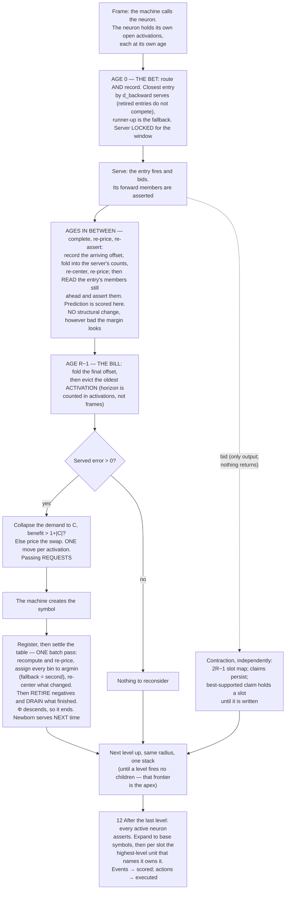

# Universal Compression with Actions and Rewards (UCAR)

UCAR is a machine that compresses what it observes by building a hierarchical dictionary of patterns, and
learns what to do by observing rewards. It is defined by two alphabets, like a Turing machine — the **event
alphabet** it can observe and the **action alphabet** it can execute — and above each it forms symbols of its
own. Every symbol, base or learned, event or action, is a **neuron**.

This document is the specification. **D** is a definition and **R** a rule — together they are the machine.
**T** is a theorem: a claim that follows from them, stated with its argument. **Remarks** are commentary
and can be skipped. Section 2 states the objective everything else is derived from, so it comes before the
mechanisms that optimize it.

**Notation.** `f, g, h` are frame indices. `R` is the radius, `W` the buffer depth. `O` is an observed
neighborhood, `C` a candidate neighborhood, `nbhd(e)` an entry's neighborhood and `|e|` its size. `d` is
distance, `n` a count of occurrences, `m` a bid's miss count, `L` a file length, `D` a hierarchy depth.

---

# 1. The machine

## 1.1 The substrate

The alphabets are declared as structure, and the declaration is part of the machine's definition.

> **D1 — Declaration.** The machine declares **channels**. Each channel declares at most one **event
> dimension** and at most one **action dimension**. Each dimension declares its **resolution**, its bucket
> count. A base symbol is a dimension–bucket pair, so this declaration *is* the alphabet.

> **D2 — Coordinate.** A neuron's coordinate is `(dim_id, bucket_id)`; its channel is the channel owning that
> dimension. A neuron minted as a pattern inherits its parent's channel and dimension and sits one level above
> its parent.

> **D3 — Channels are declared, never created.** No mechanism mints a channel. What grows is the population
> inside one: patterns are added level by level, without bound. The channel set is therefore a fixed,
> enumerable index over the whole run, which is what lets `(channel, offset)` name a slot at any level.

> **D4 — Adjacency.** Each channel declares which channels are its neighbors. This is part of the channel
> definition, and it applies **at the base level only**, where the input's geometry is still meaningful.
> **Above the base, every active neuron is a neighbor.** This is the only place topology enters the design,
> and it introduces no number to tune: there is no depth to choose, because there is only ever one level to
> which the declaration applies.

**Remark.** Receptive fields grow with depth through composition, not through a declared radius. Channels gate
eligibility and nothing else — two children of one neuron may name overlapping but different channel sets, and
the fit needs no channel structure.

## 1.2 Firing

Every frame, each event dimension quantizes what was observed — if anything was — and each action dimension
carries the action executed at the end of the previous frame — if one was.

> **D5 — Firing.** A neuron fires only when something happens: an event neuron on an observation, an action
> neuron on an execution. **At most one neuron fires per dimension per level in a frame.** A dimension with
> nothing to report is silent.

> **D6 — An activation stays open.** A firing at frame `f` remains open through `f + (R−1)`, which is how long
> its neighborhood takes to fill. While open it keeps working: arriving neighbors fold into its server's
> counts, that server re-centers, distances and margins update. The activation does not re-fire — it is one
> firing, not a state — and it enters other neurons' neighborhoods only at its firing frame. The neuron may
> fire afresh while an earlier activation is open, so several can be open at once, each with its own
> neighborhood, occurrence and server.
>
> **Age is per activation, and a neuron carries several ages at once.** An activation's age is the frames
> elapsed since it fired, `0` through `R − 1`. A neuron active at frames 10 and 12 is at ages 0 and 2 in frame
> 10 + 2, then 1 and 3 in the next, and so on. When the machine hands the neuron a frame it hands it **every
> open activation**, and each is processed by the same rules at its own age. Nothing distinguishes them but
> age: a new firing is simply the activation whose age is 0.

> **D7 — Exclusion is per level, and about firing.** At most one neuron per channel fires at a given level in
> a given frame. Declared for the base, preserved upward by construction: one firing per channel per level
> offers at most one bid, so contraction (§10) promotes at most one unit into that channel one level up. A
> channel can carry firings at several levels in one frame; all are inhibited except the apex.

There is no rest value. A dimension where nothing happens supplies no symbol, and silence is what the decoder
assumes for anything the file does not state. Three consequences:

- **Blank regions cost nothing** — no activation, no history, no dictionary, no compute.
- **An observation is a set** — variable-size, containing only what happened.
- **Absence still discriminates** — a pattern naming a ring is measurably wrong on a filled disk, because the
  neurons inside the ring are present-but-unnamed and the distance counts them. Offness carries information
  without ever costing storage.

**Remark.** Whether a 0 pixel is a black event or nothing-to-see is the encoder's choice, made where the input
is produced. A dimension where something always happens is simply always active; nothing depends on sparsity,
it only profits from it.

> **D8 — Identity is absolute.** A neuron is bound to its position. The same shape at two positions is two
> observations over two neurons, learned independently. Nothing shares a shape across positions the way a
> convolution shares a filter, and each position pays for its own patterns out of its own history.

---

# 2. The objective: it is all one file

Take the whole run and write it as a single file a decoder could read back to reproduce every frame exactly.

> **D9 — The file.** Two parts. **The dictionary**: for each neuron, the neighborhood of each of its children.
> **The frames**: the apex units, and the corrections where they were wrong. Anything unstated is silence.

> **D10 — Predictive coding.** The decoder runs the same model as the encoder, so it already knows what each
> active unit predicts about the frames ahead. **The encoder writes only the surprise.**

```
asserted {␣} at +1, actual {␣}       →  0 symbols
asserted {␣} at +1, actual {e}       →  2 symbols  (turn off ␣, turn on e)
asserted nothing at +1, actual {e}   →  1 symbol   (turn on e)
```

**Being wrong costs twice what saying nothing costs.** That asymmetry decides when the machine should commit
to a symbol at all, and it is derived from again in §5.2 and §10.4.

> **D11 — Prices.** Every cost in the design is part of a file, counted in symbols:
> ```
> activating an apex unit  =  1                    a line in the frames
> what it got wrong        =  the neighbors wrong  the corrections after it
> having a child           =  1 + |e|              a line in the dictionary
> ```
> This is a fixed-length code: a symbol costs one regardless of how often it is used.

> **D12 — The file contains exactly what cannot be recomputed from it.** A child's neighborhood must be
> written: it was chosen from records since forgotten, and no reader could reconstruct it. Counts must not:
> they are tallies over remembered records, and the records are already in the file, so the decoder recounts
> them while decoding. This is why the normal is free and a child is not.

> **D13 — Local file length.** Over one horizon, a neuron's own file is
> ```
> L  =  Σ over entries (1 + |e|)          written once
>    +  Σ over occurrences (1 + errors)   written every activation
> ```
> and §7's test is the derivative of it.

**Remark — two scopes, two files.** `L` is the neuron's own file. The machine's file is a different object,
because its frame part holds only apex units, so an activation that a neighbor's promoted unit subsumed never
appears there. Neither approximates the other, and a neuron never needs the other one — which is what lets its
pipeline stay independent of the election. **That the two compose is an assumption of this design, not a
result** (§Risks, the composition gap).

**Remark — why predictive coding is load-bearing.** Under a literal frame part, a prediction that comes true
saves nothing, so no test could ever value prediction. Under predictive coding, being right is free and being
wrong costs corrections, so prediction error *is* file length and the one test prices it with no new term.

---

# 3. Neighborhoods and distance

## 3.1 The neighborhood

> **D14 — Neighborhood.** A neuron firing at frame `f` observes the active neurons its level admits across
> `[f − (R−1), f + (R−1)]`, each tagged with its offset from `f`:
> ```
> O = { (p, −4), (a, −3), (r, −2), (i, −1), (␣, +1) }
> ```
> for a neuron `s` in a stream reading `p a r i s ␣`. Neighbors at offset 0 co-occur; at negative offsets they
> led here; at positive offsets they followed. **All three are the same kind of thing.**

A neighborhood is a slice of the `(channel, frame)` grid, one column per offset, at most one neuron per
channel per column (D5). With `R = 3`:

```
                                offset
                    −2     −1      0     +1     +2
         ch A        ·      a      ◉      ·      ·        ◉  the firing neuron
         ch B        ·      b      ·      ·      ·        a  a named neighbor
         ch C        q      ·      ·      c      ·        ·  silent
         ch D        ·      ·      ·      ·      d
                    ╰──── d_backward ────╯╰──── d_pending ────╯
                     seen at age 0           arrives as the activation ages;
                     recognition uses this   the split sweeps right to age R−1
```

Everything the design prices is a count of cells in that grid: the fit is the cells where an entry and the
observation disagree, and a child's dictionary line is the cells the entry names.

> **D15 — Radius.** `R` is the depth of the frame buffer, `W = R`, giving a reach of `R − 1` in either
> direction. A neuron sits at the newest edge of the buffer when it fires, with `R − 1` frames of context
> behind it, and slides to the oldest edge as its neighborhood completes.

The buffer is a sliding window over frames; an activation enters at its newest edge and walks to its oldest.
With `R = 3`, a firing at frame 10:

```
                 frame 10        frame 11        frame 12        frame 13
   buffer       [ 8  9 10]      [ 9 10 11]      [10 11 12]      [11 12 13]
                       ▲               ▲               ▲
   activation        fires          +1 lands       +2 lands         gone
   at frame 10    newest edge                    oldest edge
                  sees −2, −1                     complete
```

That is the whole of D6: the activation is open for `R − 1` frames because that is how long frame 10 takes to
fall out of an `R`-deep buffer. A firing at 11 opens while this one is still open, so several activations of
one neuron are in flight at once, each at a different position in the buffer.

> **D16 — Spatial is `R = 1`.** One frame, every neighbor at offset 0. Not a separate mechanism and not a
> separate phase — the same machinery with an empty half, at every level of one stack (R30). A run at `R = 1`
> is this machine spatially configured, not a spatial subsystem of it.

**A pattern is a name for a chunk of spacetime.** One pattern-learning algorithm and one kind of pattern.
There are four types only in the sense that two declarations cross: **offsets** are all zero or spanning,
which is spatial against temporal, and **dimension** is event or action. Neither is a separate mechanism.
Spatial is D16. Event and action are not separate for a plainer reason than it looks — the machine observes
its own actions, since each action dimension carries what was executed, so an action is a symbol read back the
way a pixel is and a pattern over it is learned by the same counting. **You could not tell from a dictionary
line which of the four you were holding.** The one asymmetry lives outside the pattern: events infer actions
and never the reverse, and that inference runs on reward (R37).

**One neighborhood per firing, and at most one entry serves it.** If a neuron could activate several children,
each channel would carry several active units and the count would square at every level.

## 3.2 The fit

> **D17 — Distance.** For an observed `O` and a neighborhood `C`, the distance is the symmetric difference:
> ```
> d(O, C) = |O △ C|  =  neighbors present that C does not name
>                     + neighbors C names that are not present
> ```

This is not a notion invented for matching: it is literally the corrections that would follow the activation
in the file. Service cost and match distance are one number, channel-free and offset-blind — a missed neighbor
and a missed prediction cost the same, because in the file they are the same thing.

> **D18 — Decomposition, at the activation's age.** A slot has happened for an activation when `offset ≤ age`.
> That splits `d(O, C)` into `d_seen`, the offsets already observed, and `d_pending`, the ones still to come.
> **The split moves as the activation ages**: at age 0 it sits at offset 0, and at age `R − 1` it has swept
> past the whole neighborhood and `d_pending` is empty.
>
> `d_backward` is the name for `d_seen` **at age 0** — offsets `≤ 0`, the half in hand when the neuron fires.
> It is a fixed quantity because recognition happens once, at age 0. Everywhere else, "observed" means
> `offset ≤ age` and moves.

> **R1 — Two comparisons, kept apart.** Which entry **serves** is decided at age 0 on `d_backward`, because
> that is all recognition ever sees, and it is locked for the window (R14). What an occurrence **costs** is
> `d_seen` against its server's neighborhood **as that neighborhood now stands**. Throughout: *wins, closest,
> runner-up* mean the first; *distance, cost, benefit* mean the second.

> **R2 — Priced continuously, restructured eventually.** A price is a measurement, not a transaction. `d(O, C)`
> is a function of a neighborhood, so when the neighborhood moves the distance moves with it: re-centering (R5)
> re-prices every occurrence the entry serves, in both halves, and settlement's scan is where that happens
> (R19). Nothing is charged for a slot that has not happened, and nothing that has is ever frozen — an
> occurrence's cost stops moving when its server stops moving, not when its span completes.
>
> **Structure, by contrast, changes only at the decision points.** Prices move every frame; entries are added,
> swapped or retired only when an activation's bill comes due at age `R − 1` (R14), and a retired entry leaves
> only when it has drained (R18). Continuous measurement, discrete structural change.

**Remark — the split is availability, not meaning.** A neighborhood names both directions symmetrically, and a
pattern is minted after its chunk has been seen. Routing is simply what cannot wait. This binds action neurons
no less than event ones: an action neuron fires when its action executes and waits out its forward half the
same way.

**Remark — at `R = 1` the vocabulary collapses.** `d_pending` is empty at age 0, so `d_backward` is the whole
distance and the split never moves; `server_distance` **is** the minimum and a fallback **is** the true
runner-up; nothing is ever in flight; the completion step has nothing to do; the bet and the bill fall in the
same frame; bins key on the whole neighborhood; and `horizon > 2(R−1)` binds nothing.
Contraction loses its cross-frame contention, since every claim spans one frame.
Read the document with the temporal parts struck out and it is the spatial algorithm, unchanged — the whole
machine, not a stage of it, which is what makes `R` a configuration rather than an architecture.

**Remark — two different objects.** An entry's forward mismatch is what *this entry* got wrong against its
own history — the only prediction signal a neuron learns from.
The file's frame part counts what the *decoder* got wrong, once per slot, over the machine's single arbitrated
assertion (§12). They coincide when one entry owns a slot
outright and diverge otherwise.

---

# Part I — A neuron

# 4. State

> **D19 — Neuron state.**
> ```
> neuron      = (coordinate, routing table, history)
> routing table = set of entries
> entry       = (neighborhood, counts, child)          child = null for the normal
> history     = (bins, ring)
> bin         = (backward neighborhood, occurrences, server, fallback,
>                d_backward to each, per-slot forward tallies,
>                Σ server mismatch, Σ fallback mismatch)
> occurrence  = (bin, forward neighbors as they arrive)
> ```

> **D20 — Entries are one kind of thing.** The normal and every child are the same object. The normal is the
> entry whose child is null, so it has no dictionary line to pay for. One structure serves the whole routing
> table.

The **neighborhood** is the whole of what an entry knows — neighbors behind the neuron and ahead of it, with
no separate notion of context or of what it infers.

# 5. Counts, the collapse, re-centering

## 5.1 Counts

> **D21 — Counts.** Each entry keeps, over exactly the occurrences it currently serves,
> `count(neuron, offset)` = how often that neighbor was present.

> **R3 — What moves counts.** The entry serves an occurrence → increment. A served occurrence leaves the
> history → decrement. A new child captures occurrences → old server decrements, child increments. A drained
> entry's occurrences fall back → the fallback increments. An occurrence's forward frame lands → increment.
> Nothing else.

**An entry counts only its own occurrences.** Every occurrence is served by exactly one entry, and no entry
learns from another's.

## 5.2 The collapse

Routing needs a set, not a distribution.

> **R4 — The collapse.** For each `(channel, offset)` slot, let `n` be the entry's served-occurrence count and
> `count(p)` the number of those containing neuron `p` in that slot. The neighborhood includes `p` exactly
> when `count(p) > n / 2`; otherwise the slot is omitted.

A slot cannot hold two neurons (D5), so at most one candidate can hold a strict majority. Silence is the
implicit alternative with count `n − Σ count(p)`, so a rare or split observation loses to it. There is no
tunable threshold, smoothing, or probability estimate: the denominator is the served count and the boundary is
required by exact L1 minimization.

> **T1 — The collapse is the L1 center.** The result minimizes `Σ d(O, C)` over all sets. It is a *center*,
> not a medoid: synthesized, possibly a set the neuron has never seen. That is the point — it is the typical
> neighborhood, not a sample of one.

**Remark.** A centroid over sets is a fractional vector, which is not a set, cannot be written into the file,
and has no symmetric difference. The counts **are** the fractional object; the collapse is how the design gets
from it to something the decoder can expand.

## 5.3 Re-centering

> **R5 — Move.** The collapse is recomputed whenever counts move. No test, no gate: an entry is always the
> center of what it currently serves. This is free, because the counts are already maintained.

Three consequences, and they are the point of the design:

- **Neighborhoods track their demand.** An entry created on thin evidence is pulled toward its cluster.
- **Coincidence is voted out.** A neighbor present once loses its majority to silence and drops out.
- **Reach emerges.** Offsets where nothing recurs fall away. How far a pattern reaches is discovered, not
  declared. `R` bounds it; it does not set it.

> **R6 — Servers and fallbacks are re-elected, not patched.** A moved neighborhood changes every distance
> measured against it, for the bins it serves and for the bins that merely name it as fallback. Nothing is
> repaired in place: settlement (R19) rescans the whole table and takes `argmin` and second-best afresh, so
> both are current by construction after every pass, and no reverse index is needed.

**Cold start is silence.** An entry with no occurrences has no counts and no neighborhood. That is the initial
case, not an error.

# 6. The history

> **D22 — Horizon.** A neuron remembers a fixed number of the neighborhoods it fired on, measured in its own
> activations, not in absolute time. There are no frame numbers anywhere in the history: benefit is a sum,
> cost is a count, and time's only role was eviction order, which a FIFO provides by construction.

**Remark.** This makes the one test uniform under sparse activation — a busy neuron and a rare one judge over
the same amount of *evidence*, not the same amount of someone else's clock.

> **R7 — Keyed on the backward half.** Two activations with identical backward neighborhoods sit at the same
> `d_backward` from every entry, so routing sent both to the same server and fallback. That makes the backward
> half — and only it — safe to share an assignment across. The forward half cannot key anything: it does not
> exist when the assignment is made.

A **bin** is the aggregate over its occurrences exactly as an entry is the aggregate over its bins. The
backward distance is a property of the bin. The forward half is statistics: what followed this context, per
slot, tallied.

> **T2 — Tallies are sufficient.** Everything the design asks of the history is a sum over slots, so the
> tallies answer it exactly. `d(b, C)` is `occurrences × d_backward` plus, at each forward slot, two for every
> occurrence holding a neuron other than the one `C` names and one for every occurrence holding nothing — or
> one for every occurrence holding anything, where `C` names nothing. The collapse sums tallies. Benefit needs
> only totals. Nothing asks whether `c` at `+1` came with `d` at `+2`.

> **R8 — The ring makes eviction exact.** Removing the oldest occurrence means subtracting the neurons *it*
> contributed, which a tally cannot recover, so each occurrence carries its own forward frames and the bin is
> the cached aggregate. This is not a storage saving. It buys that the add test scans **distinct backward
> contexts** and reads pre-summed tallies.

> **T3 — The win test is per bin.** A candidate wins on `d_backward`, a property of the bin, so a bin is won
> whole. No bin is ever split.

> **R9 — Aging is one-out-one-in.** Once the ring is full, recording evicts exactly the oldest occurrence.
> Recording is unconditional, and no election outcome ever edits a history.

> **T4 — `server_distance` is not the minimum.** Routing chose on `d_backward`; the total is known `R − 1`
> frames later, and the entry that won the prefix can end up further than the runner-up. Nothing may assume
> the server was closest in total distance.

**Why the fallback is stored.** The test asks what an entry's occurrences would cost without it, and the answer
is the fallback. Both sides of that subtraction are current measurements against current neighborhoods (R2) —
the fallback always was, since it is a counterfactual that was never charged to anything, and under R2 the
server side is too. Storing the fallback is what lets settlement's scan answer the test without a pass of its
own.

**Why records and not a summary.** An error total cannot answer retirement: when an entry goes, the *new*
runner-up for its occurrences must be recomputed from the occurrences themselves.

> **R10 — Free parameters: two.** The **horizon** and the **radius** `R`. The alphabet 
> (channels, dimensions, resolutions) is not a third: a resolution defines what a base symbol *is*, so it is
> the problem statement rather than a knob on the algorithm, the way a Turing machine's tape alphabet is.

> Neither is channel adjacency (D4): it is part of a channel's definition, it applies at the base level only,
> and it has no depth to choose. **Nothing else in the design is tuned, and nothing anywhere is capped.**

> **T10 — Every loop in the design is bounded, and none is capped.** Settlement terminates in at most `Φ`
> passes (T8). Retirement cascades run at most once per entry, and a recursive drain releases each neuron of a
> subtree once, finishing within `D · (R − 1)` frames (R18). The election is a single greedy pass
> (R28). The level stack is at most `log₂ N` deep (T9), which also bounds the write lag and the depth of an
> assertion's expansion. Every bound falls out of a quantity the design already counts, so nothing has to be
> chosen to make the machine halt.

> **R11 — They are not independent: `horizon > 2(R−1)`.** An occurrence enters the served count at fire time,
> but its slot at `+k` cannot be counted for `k` more frames, so the `k` most recent occurrences are blank
> there while sitting in R4's denominator. The slot at `+k` can draw on at most `horizon − k` occurrences
> against a threshold of `horizon / 2`, so it is nameable only when `k < horizon / 2`. The deepest slot is
> `k = R − 1`. A horizon of `2(R−1)` or less makes the outer forward offsets unnameable however reliably they
> recur — and silently, since a slot that never had the votes looks like a slot with nothing to say.

**Remark — the trade, stated plainly.** Wall-clock staleness is unbounded: a neuron dormant for a million
frames wakes with its model intact. Absence of evidence is not evidence the structure died, and if the world
changed, errors start arriving immediately and restructuring proceeds at the pace of new evidence.

# 7. The one test

> **R12 — The one test.** An entry earns its place when the errors it removes from the history exceed what it
> costs to store.
> ```
> cost(e)     =  1 + |e|
> benefit(e)  =  Σ over the occurrences e serves: (fallback_distance − server_distance)
>                each measured over d_seen, against current neighborhoods  (R2)
> margin(e)   =  benefit(e) − cost(e)
> ```
> An entry is **added** only when its margin is strictly positive and **retired** only when strictly negative
> (R18). At equality nothing happens, so the boundary cannot flip-flop.

Benefit changes only on events — the entry gains or loses an occurrence, a slot arrives, or a neighborhood
moves. The first two are O(1). The third re-prices every occurrence the entry serves, and settlement's scan
(R19) is already doing that walk, so benefit falls out of it. **No test needs a pass of its own.**

**Negative-benefit occurrences are legal, and they are the signal.** An occurrence whose server won the
backward match but predicted worse than the runner-up contributes a negative term. That is exactly the case
where an entry names a chunk correctly and gets its future wrong, and it needs no separate mechanism: it drags
the entry toward retirement and triggers the add test that proposes the replacement.

> **T5 — What `L` is a potential for, and what it is not.** Every *handoff* strictly decreases `L`, and `L` is
> a non-negative integer. **Re-centering is different**: it minimises service cost over the served set but can
> change `|e|`, so a single collapse may raise `L`. So `L` is a Lyapunov function for handoffs, not for the
> learning dynamics as a whole. Settlement's termination does not rest on `L` — it rests on `Φ`, which
> excludes the dictionary term and which both halves of a pass decrease (T8). Cross-frame churn is bounded by
> the error-only trigger, the strict margins and the fact that structure moves only at age `R − 1` (R14) — and
> it is measured, not assumed. Prices move continuously (R2), so nothing here claims `L` descends monotonically.

# 8. The four moves

**Remark — this is facility location.** Occurrences are customers, entries are facilities, opening one costs
`1 + |e|`, serving costs the fit, and routing is the assignment. The opening cost is the only thing standing
between the design and memorizing every frame: if opening were free you would put a warehouse on every
customer. The local search has four moves, and **split** and **merge** need no machinery of their own — split
is what add does to overloaded demand, merge is what swap does to redundant entries.

## 8.1 Add — creating a child

> **R13 — The trigger is an error, nothing else.** No background process proposes candidates. A neighborhood
> the entries already describe costs nothing to serve however often it recurs; surprise is the size of the
> bill, not a gate on it.

> **R14 — Two decision points: the bet at age 0, the bill at age `R − 1`.** At age 0 the neuron recognizes —
> it picks the entry that serves, bids on it and asserts from it, on backward evidence alone. **That choice is
> locked for the whole window**; the frames that follow re-price and re-center it, but never re-open it. At age
> `R − 1` the activation has seen its full `2R − 1` frames and the bill comes due: this is where the machine
> asks whether to add, to swap, or to retire the server. Every structural move happens there and nowhere else.
>
> A child minted there first fires on the next activation its neighborhood recurs. It does not serve, cover or
> propagate on the activation that created it — that chunk is already encoded and already committed upward.
> **Structure never pays off on the evidence that created it, only on recurrence.**

Neither decision could sit at the other's age. Recognition cannot wait, because the neuron has to represent the
frame it is in. Structure cannot come early, because a child is a name for a whole `2R − 1` chunk and that
chunk does not exist yet — a test at age 0 would react to a recognition miss before knowing whether the server
was the right choice overall, and would mint against a pattern it has only half seen.

> **R15 — The candidate is a center, not a sample.** Two passes over the bins, both only on error:
> 1. **Find the demand.** With the triggering observation `O` as probe, collect the bins routing would hand
>    it: `d_backward(b, O) < d_backward(b, b.server)`, measured against the server's **current** neighborhood.
> 2. **Collapse.** Per-slot vote over exactly those bins, summing tallies. The result is `C`.

`C` is the L1 center of the demand the child would serve, not the one neighborhood that triggered the test.
Incidental neighbors lose their slots and never enter it, so `|C|` is the size of what recurs — which matters
over a span `2R − 1` frames wide. The win set may shift once `C` replaces `O` as the probe; price `C` against
its recomputed win set.

> **R16 — The solo test.**
> ```
> win set  =  bins b with  d_backward(b, C) < d_backward(b, b.server)
> benefit  =  Σ over the win set:  b.Σ server mismatch  −  d(b, C)
> commit iff  benefit > 1 + |C|
> ```

Winning and pricing are different questions. A bin is **won** on `d_backward`, because that is what routing
will compare when the neighborhood recurs; it is **priced** on the distance as observed. Deciding the win set
on observed distance would count a candidate as winning bins it can never be routed to — exactly those whose
advantage is entirely forward — and overstate the children most likely to disappoint.

`d(b, C)` is summed off the bin's tallies, so both sides of a term read the same offsets over the same
occurrences: an occurrence that has not seen a frame contributes nothing on either side. A term can be
negative — `C` wins a bin and describes it worse in total — which is not an anomaly to clamp away but the
honest cost of a child routing will hand neighborhoods it predicts badly.

There is no special term for the triggering neighborhood: it sits in its bin like any other occurrence.

**A candidate rejected today is not lost.** Every future error offers a new probe, and re-centering means a
child that does get minted improves with exposure rather than freezing at whatever the probe happened to be.

> **R17 — What the child is at birth.** The parent requests; the machine creates. The pattern inherits its
> parent's channel and mints one level above it, both carried on the request, so the machine allocating the
> symbol decides nothing about what it means. It is created with **no counts**: its own neighborhood belongs
> to its own level, which it has not observed yet. Its *existence* is decided by its parent; its *structure*
> by itself, at its own level.

## 8.2 Swap

If the solo test fails, the candidate gets one more chance jointly with a retirement. Take the child `X` whose
served occurrences `C` would win the most of — visible in the solo pass — and price the joint move exactly:

```
Δ =   Σ over X's occurrences:  cost served by X  −  cost served by whichever of
                               (surviving entries + C) routing would pick
   +  Σ over occurrences NOT served by X that C wins:  (server_distance − d)
   +  (1 + |X|)      // X's storage refunded
   −  (1 + |C|)      // C's storage charged
commit iff  Δ > 0
```

A committed swap **retires** `X` rather than removing it (R18): it stops competing at once, and its storage is
refunded when it drains. `C` is available from its next recurrence, so the replacement is in the table before
the entry it replaces has finished leaving.

"Wins" and "would pick" are `d_backward`; every "cost" is the distance as observed. The two sums are over
**disjoint** sets, so nothing is counted twice. Entries are priced **frozen** where they stand, and the
re-centering afterwards only improves things, so a positive frozen score understates the realized gain and is
always safe to commit.

**Remark.** Examining only the most-overlapped child is a heuristic. It is kept because re-centering took most
of the load off the swap: an off-center entry now moves on its own, so the swap only has to handle genuinely
locked cases — two entries straddling one cluster, neither individually deletable. The exact variant stays
affordable, since the test only runs on error.

## 8.3 Retire

An entry stops earning its place the moment its benefit no longer covers its storage, and that moment is always
caused by an event, so **nothing scans for it**. Three events push a margin negative:

1. **Eviction.** Served occurrences leave as demand drifts; the entry is starved.
2. **Settlement of an activation.** The bill comes due at age `R − 1` (R14) and the entry predicted worse than
   the fallback would have.
3. **Settlement of the table.** A pass takes occurrences from an entry, or leaves it serving them with a closer
   alternative now sitting under them — either way the error it spares shrank.

It cannot leave the moment it stops paying, because it may be serving open activations. Those were recognized
at age 0 and the choice is locked for the window (R14): the neuron bid on this entry, and if that bid was
promoted its child is a live unit one level up. Deleting it would un-fire that unit, which is the one retraction
the design never performs (R27).

> **R18 — Retire, then drain.** An entry whose margin goes strictly negative is **retired immediately**: it
> becomes ineligible for recognition, so no further activation may select it, and it is no longer offered as a
> fallback. It keeps serving the activations it already has — re-centering, asserting and being priced exactly
> as before — until the last of them reaches age `R − 1`. Then it **drains**: its neighborhood leaves the
> routing table and its pattern neuron is released. Draining is therefore part of that activation's bill
> (§9.3), which is the frame in which the entry's last commitment comes due.
>
> Retirement is what makes the two halves independent. Nothing committed is disturbed, so the lock holds; and a
> retired entry acquires no new work, so it is gone within `R − 1` frames. An entry that keeps winning
> recognition cannot postpone its own death by staying busy.

**Draining is recursive.** A released pattern neuron cannot fire again, so nothing can ever select the entries
in *its* routing table — they retire with it and drain in turn, and so do their children. The cascade runs down
the hierarchy, releasing each neuron's whole subtree. It is bounded twice over: each neuron is released once
and creates nothing, and the hierarchy is at most `log₂ N` deep (T9), so a drain that starts at one entry
finishes within `D · (R − 1)` frames.

Occurrences left behind by a drain, and any that named the departed entry as fallback, are re-elected by the
next settlement pass (R19), which rescans the table — so nothing has to be patched by hand and the entry that
inherits gains its margin there. **Retirements are sequential**, re-checking margins after each, because two
entries covering the same demand each look redundant while the other stands. That cascade is bounded too: each
retirement removes an entry and creates none, so it runs at most `|routing table|` times.

The normal is never retired: it has no dictionary line to refund. And nothing irreplaceable dies — the
evidence lives in the history, so if the same neighborhood is justified again the add test rebuilds it.

## 8.4 Settlement

Settlement is one batch pass over the whole table, run once per bill (§9.3) and after any committed add or
swap. It is not an incremental repair and it chases nothing. It does not run in the frames between a bet and
its bill: those re-price the serving entry (§9.2) and change no assignment.

> **R19 — Settlement.** One pass, in order:
> 1. **Recompute.** For every entry whose neighborhood moved since the last pass, recompute `d_backward(b, e)`
>    for all bins `b`, and re-price the occurrences it serves or backs over their `d_seen` (R2). This is the
>    one walk that keeps prices current; nothing else re-prices, and nothing else needs to.
> 2. **Assign.** Every bin takes `server = argmin` and `fallback = second-best` over the whole routing table,
>    both from the same scan.
> 3. **Re-center.** Every entry whose served set changed recomputes its neighborhood (R4).
>
> Then negative margins retire (R18), which is bounded: each retirement removes an entry from competition and
> creates none, so the cascade runs at most `|routing table|` times.

> **T8 — Settlement converges.** Let `Φ = Σ over bins of d_backward(bin, its server)` — service cost only, no
> dictionary term. Step 2 minimises each bin's term independently, so `Φ` cannot rise. Step 3 replaces each
> entry with the exact L1 centre of its served set (T1), so `Φ` cannot rise. `Φ` is a count of neighbors,
> hence a non-negative integer, and it strictly drops by at least 1 whenever anything changes. **The
> alternation therefore terminates, in at most `Φ` passes from wherever it starts.**

**Remark — this is Lloyd's algorithm.** Assign points to nearest centre, move each centre to the minimiser
over its assigned points, repeat: Lloyd 1957, better known as k-means. This is its L1 variant over sets, with
the collapse as the minimiser. Two differences. `Φ` is integer-valued, so the bound is `Φ` passes rather than
the usual "finitely many partitions". And `k` is not fixed here — add, delete and swap change the number of
entries — which is why those moves exist alongside the alternation: Lloyd only optimises assignment for a
given set of centres. **The caveat carries over too: a fixed point is stable, not optimal.**

**The proof depends on each step completing before the other begins.** Interleaving them — moving one entry,
handing over the bins that reach for it, touching the next entry — leaves neither step finished and nothing to
descend. Batching is what makes `Φ` a potential.

Handover, fallback re-election and fallback collapse are not separate operations. All three are consequences
of step 2's argmin, which is why R19 has no step for them.

Note this does not contradict T5. `L` carries the dictionary term `Σ(1 + |e|)`, which re-centering can raise.
`Φ` excludes it. `Φ` is the potential; `L` never was.

# 9. The frame, per neuron

Two processes run over the same frame and they are **independent**. The neuron's pipeline reads and writes
only the neuron's own state and depends on nothing the election decides; contraction reads the level's bids
and has **zero side effects on neuron state**.

**The machine does not track activations; the neuron does.** The machine calls a neuron while it is active and
nothing more. The neuron holds its own open activations, each with the forward neighborhood it is still filling
in, and knows each one's age (D6). Everything below is the neuron's own bookkeeping.

An activation is processed by its **age**, and there are three bands. Only the two ends decide anything.

## 9.1 Age 0 — the bet

The neuron fired this frame, with observed backward neighborhood `O⁻`.

1. **Route and record** — one operation. The closest entry by `d_backward` serves; the normal and every child
   compete, ties to the older entry. Retired entries do not compete (R18). Best and runner-up come out of the
   same scan, and the activation is recorded with its backward distances and an empty forward half. Recording
   is unconditional. Fold `O⁻` into the server's counts and re-center.
2. **Serve.** The serving entry fires, and the neuron hands the machine a **recognition bid** — an offer to
   represent its chunk one level up. The bid is the pipeline's only output to the election, and the election
   sends nothing back. **Creation never bids.**
3. **Assert.** The served entry's forward members are the neuron's prediction, read off the neighborhood, not
   computed. The read is repeated at every age until the window closes (§9.2), so the prediction tracks the
   entry. What the *machine* asserts is settled once every level has resolved (§12).

That is the whole of the bet. **No structure is created, retired or reconsidered at age 0** — the neuron has
seen `R` frames of a `2R − 1` chunk, which is enough to recognize it and not enough to judge it.

## 9.2 Ages in between — complete and re-price

For every open activation whose next forward frame has arrived:

1. **Complete.** Record the neighbors at that offset, fold them into the server's counts, re-center the server,
   and re-price the occurrences it serves (R2). **This is where prediction is scored.**
2. **Assert.** Read the serving entry's members at the offsets still ahead — `offset > age` — and assert them.
   This is the same read as §9.1, repeated: the prediction is whatever the active entry, normal or child, names
   for frames that have not arrived. **It is a read, not a decision.** Nothing is chosen and nothing is
   changed; if the entry re-centered in step 1, the neuron simply asserts what it now names, which is a better
   prediction than the one it made at age 0 and costs nothing to obtain.

Two things do not happen here. The **server does not change** — that was locked at age 0 (R14), and what moves
is how well it is described, not which entry describes it. And **no structure changes**: a margin may go
strictly negative in this band and nothing acts on it, because the activation is still mid-window and the
chunk that would replace the entry does not exist yet. Re-pricing is measurement; the bill is where
measurement is acted on.

## 9.3 Age `R − 1` — the bill

The activation's last forward frame arrives, so it has now seen its whole `2R − 1` span. Everything structural
happens here, in this order:

1. **Complete.** Record and fold the final offset as in §9.2, and re-center.
2. **Age.** If the history is full, evict the oldest activation — the horizon is measured in activations, not
   frames (D22). Its neighbors leave its server's counts, that server re-centers, and its benefit drops. An
   activation joins the history at its bet and an eviction happens at each bill, so the history holds `horizon`
   settled activations plus however many are in flight.
3. **Test**, on **any nonzero served error** — whether the server was the normal or a child. A child is not an
   admission of ignorance but the sharper model, so a child that describes badly is exactly the error worth
   acting on. Price the add (R16), else the swap (§8.2). **At most one structural move per activation**, and a
   passing add test **requests** rather than creates: a pattern is a symbol at the level above, and that
   alphabet belongs to the machine.
4. **Register and settle the table.** If a pattern was requested, the machine returns its identity and the
   neuron registers it as an entry; the newborn is installed **now, for later**. Then R19 runs — one batch
   pass: recompute, assign, re-center.
5. **Retire and drain.** Entries whose margin is now strictly negative retire (R18). Entries whose last served
   activation was the one that just matured have drained, and leave the table now.

A neuron fires at most once per level per frame (D5, D7), so at most one activation reaches age `R − 1` in any
frame: **one bet and one bill per neuron per frame, at most.** The bill is processed after the bet, so a chunk
recognized this frame is never judged in the same pass that recognized it — unless there is no window between
them, which is the next case.

## 9.4 At `R = 1` the bet and the bill are the same frame

The span is one frame, so an activation is born at age 0 and reaches age `R − 1 = 0` immediately. §9.2 is
empty — there is nothing in flight and nothing to complete — and the neuron recognizes a chunk and then, later
in the same pass, settles that same chunk. This is what makes **spatial-only processing a matter of setting
`R = 1`**, which is the configuration MNIST and any other single-frame problem runs: recognize, then test, then
settle, all within the frame, with no window in between and no forward half to wait for.

## 9.5 One activation, across its frames

The three bands above, walked through on a single activation. Take `R = 3`, a neuron with the normal `N` and a
child `K`:

```
K names  {(a,−2), (b,−1), (c,+1), (d,+2)}
N names  {(b,−1)}
```

**Frame 10 — age 0, the bet.** `a` at −2 and `b` at −1 were present, so `K` matches the observed half exactly
at `d_backward = 0` while `N` misses `a` at 1. `K` serves. The occurrence is written with `K` as server and `N`
as fallback, and `K` asserts `c` at frame 11 and `d` at frame 12, on faith. From here the choice is locked: the
neuron has bid on `K` and may have been promoted on it.

**Frame 11 — age 1. `c` does not come; `e` fires in that channel instead.** Three things happen, and they are
all of §9.2:

- **The distance grows.** `K` named `c` and got `e`: two neighbors wrong. `N` named nothing and got `e`: one.
  Neither number was wrong before; both were incomplete.
- **The counts move.** `(e, +1)` folds into `K`'s counts.
- **`K` re-centers, so its own future changes.** If most of `K`'s occurrences carry `e` there, the
  neighborhood flips `c → e`; if they are split, the slot loses its majority to silence and `K` stops naming
  that offset. This is reach emerging in motion.

**What does not happen at age 1 is a decision.** `K` is doing worse than `N` on this occurrence, and nothing
acts on that. The activation is mid-window: `K` may yet be right at `+2` where `N` is wrong, and the chunk `K`
would have to be replaced by does not exist until frame 12. Recognition is locked and structure is not yet due.

**Frame 12 — age `R − 1`, the bill.** The `+2` offset lands and folds in, `K` re-centers once more, and the
activation has now seen its whole `2R − 1` span. This is where the machine decides. Suppose `e` at `+1` and `d`
at `+2`: `K` cost two against `N`'s three, the occurrence paid `K` back, and nothing changes. Had `d` failed
too, served error is nonzero and §9.3 runs in full — evict the oldest activation, price a child against the
demand `K` is describing badly, else price the swap, settle the table, and if `K`'s margin has gone strictly
negative, retire it. `K` keeps serving whatever activations it still has open and drains when the last of them
reaches age `R − 1`, which is another frame's bill.

```
   frame 10  (age 0)         frame 11  (age 1)        frame 12  (age R−1)
   ────────────────────────  ───────────────────────  ──────────────────────
   fire                      +1 arrives               +2 arrives
   route on d_backward       fold (e,+1) into K       fold into K
   record: server K, fb N    K re-centers  c → e      K re-centers
   serve, bid                distance 0 → 2           span complete
   assert c at 11, d at 12   no decision taken        add / swap / retire
   ────────────────────────  ───────────────────────  ──────────────────────
   THE BET ──────────── locked, re-priced, re-centered ────────── THE BILL ▶
```

**What does not happen is re-recognition.** `K` served this activation and `K` serves it to the end, however
badly it does. What moves is the price: as `K` re-centers, this occurrence and every other one `K` serves are
re-measured against the neighborhood `K` now holds (R2). An old occurrence that carried `c` and cost `K`
nothing may cost it two after the flip, because `K` as it currently stands would get that occurrence wrong.
That is not a revision of anything — it is the current table being scored against remembered evidence, which
is the only question the one test asks.

---

# Part II — The machine

# 10. Contraction

A neuron firing an entry is not yet compression: if 49 active neurons all fire entries, level 1 has 49 active
units and nothing has shrunk.

> **D23 — Contraction.** The machine chooses the fewest units at the level above that reconstruct the level
> below. It is **axis-general** — a neighborhood names neighbors at offsets, so a promoted unit replaces a
> chunk of spacetime. Spatial contraction is the case where every offset is zero.

## 10.1 Bids

> **R20 — Recognition bids only.** One bid per firing: the observed backward neighbors its serving entry names
> correctly, the bidder included. Forward members are assertions carried by a promoted bid, not evidence
> available to its election. The bidder is implied, because a child *is* its parent in that neighborhood.
> Creation never bids.

> **R21 — A bid's price.** `m` counts the neighborhood members in the observed backward portion that are
> absent. A bid's price is `1 + m`, not a flat 1.

> **R22 — The objective.** Accept a subset of bids. Each accepted bid propagates one unit at cost `1 + m`;
> every active neuron not covered by an accepted bid is a correction, at cost 1. Minimize
> `Σ accepted (1 + m) + corrections`. This is prize-collecting set cover, in the same currency as everything
> else.

## 10.2 Slots and claims

> **D24 — The window is `2R − 1`, and it is a map of slot ownership.** A bid firing at `g` names
> `[g − (R−1), g + (R−1)]`, so a narrower window would price only part of a claim. It spans slot *ownership*,
> not frames — wider than the `R`-frame buffer, because a bid reaches `R − 1` ahead of the newest frame in
> hand — and slots retire as they are written, so it introduces no new parameter and no second buffer.

> **R23 — The pool is this frame's bids against the map as it stands.** A written slot is gone for good; an
> unwritten one is held by whichever claim is best supported so far, which this frame's bids may beat. No
> earlier promotion is re-elected. It is the same election the spatial case runs, with a frame coordinate on
> the slot.

> **R24 — Claims persist.** A promoted unit has spoken for the frames its neighborhood names, including frames
> ahead, and those claims stand until the span completes. So the election settles the future along with the
> present: the unit holding a slot is the one whose prediction counts there.

> **R25 — A slot is settled when it is written, not when first claimed.** Where two units claim the same
> `(channel, frame)` slot, the better-supported claim holds it, and a later firing can displace an earlier one
> while the slot remains unwritten. **Support is the claimant's count share for that slot** — already tallied
> and recountable by the decoder, so revising transmits nothing. Ties go to the older pattern id. Once written
> it is final. The displaced unit eats the overlap as mismatch, and if that keeps happening it dies.

**Remark.** Revision inside that window is free: the frame part is written at a lag, so encoder and decoder
reach a slot with the same information and apply the same rule. A later claim that fits better simply makes
the file shorter. The slot is the unit of ownership, not the frame — units in different channels never
compete.

The map, mid-run. Each cell is one `(channel, frame)` slot and holds the unit that has claimed it:

```
                                    frame
                     97    98    99   100   101   102   103
        ch A        ▓L1   ▓L1   ▓L2    L2    L2    L2     ·
        ch B        ▓L0   ▓L1   ▓L1    L0     ·    L1    L1
        ch C        ▓L0   ▓L0   ▓L2    ·     L0     ·     ·
                    ╰──── written ────╯╰──── open to revision ────╯
                                      ▲
                       write boundary, sweeping right at lag D·(R−1)

        ▓  final — no later claim can reach it
        L2 held by a level-2 unit; a better-supported claim may still take it
        ·  unclaimed; a correction if nothing claims it before the boundary passes
```

Slots left of the boundary are the file. Slots right of it are still being competed for, which is what R25
means by settled-when-written rather than settled-when-claimed.

## 10.3 When a frame can be written

> **R26 — The write lag.** A unit firing at `h` names `[h − (R−1), h + (R−1)]`, so a slot at `g` can still be
> claimed by a unit firing as late as `g + (R−1)`. That settles one level. But the file writes the apex
> frontier, and whether the covering unit is itself covered settles `R − 1` frames after *it* fired, so the
> question walks upward: **the frame part is written at a lag of `R − 1` per level, `D · (R−1)` for a frame
> whose hierarchy reached depth `D`.** Each level needs only its own `2R − 1` map, so the delay stacks, not
> the memory. A frame is written once and never revised.

Depth is data-dependent, but not unbounded: T9 gives `D ≤ log₂ N` for `N` active neurons, so the lag is at
most `(R−1)·log₂ N`. That cost is confined to the file, which is an accounting object rather than a channel
anyone waits on. **Selection never waits**: actions are asserted forward and execute at the end of the frame
that chose them, so the machine acts at full speed while its own description of what it just did is still
settling behind it.

> **R27 — Best-effort promotion.** A unit is promoted on its backward match and asserts its forward members on
> faith. When the future disagrees, corrections are appended and price the completed claim; they do not revise
> the election that made it. There is no retraction and no delay beyond the settlement lag — the file is exact
> either way, because a wrong assertion is simply a longer file.

*Exact settlement of a single frame would need `4R − 3`: frame `g` can be claimed by units firing anywhere in
`[g − (R−1), g + (R−1)]`, and those reach `[g − 2(R−1), g + 2(R−1)]`. `2R − 1` therefore scores bids at the
leading edge against partially-visible competition. This is accepted — contraction mints nothing that lasts.*

## 10.4 The election

Set cover is NP-hard, but contraction mints nothing that lasts, so it is settled cheaply:

> **R28 — The election is greedy.** Repeatedly take the bid with the highest ratio of **not-yet-covered**
> neurons it names to its price `1 + m`, and accept it if it names more than `1 + m` of them. Mark those
> neurons covered and continue. Stop when no bid clears its price. Ties go to the older pattern id, so the
> outcome is independent of dispatch order.
>
> **Outcome**: accepted bids are promoted, one unit each, and the neurons they cover are subsumed. Every
> active neuron left uncovered is a correction.

One pass, `O(B log B)` with a priority queue, and it is the classical greedy for set cover, so the slack
against R22's optimum is bounded rather than unknown. There are no voters and nothing to iterate: a bid is
scored against the coverage that actually remains at the moment it is considered.

> **T9 — Every level at least halves.** An accepted bid covers more than `1 + m` new neurons, and `m ≥ 0`, so
> it covers at least 2. Each neuron is covered once, so out of `N` active neurons at most `N/2` bids can be
> accepted. **The level above therefore has at most half as many active neurons, and the stack is at most
> `log₂ N` levels deep.** A bid that covers only itself can never clear its price, which is what forces the
> halving.

> **T6 — Why a strict majority, again.** Resolving a slot leaves a symbol or silence, and the cut is the same
> `count(p) > n/2` as R4. There it is required by L1 minimization; here it falls out of D10's prices, because
> a wrong symbol costs 2 and a missing one costs 1. Writing `q_p` for the leading member's share and `q_∅` for
> silence's:
> ```
> take p        q_∅·1 + (1 − q_p − q_∅)·2  =  2 − 2·q_p − q_∅
> take silence  (1 − q_∅)·1                =  1 − q_∅
> take p  iff  2 − 2q_p − q_∅ < 1 − q_∅   iff   q_p > 1/2
> ```
> Silence cancels. The constant is derived twice, from unrelated arguments, and no new parameter enters.

> **R29 — Subsumption is a fact about the level above, never about a neuron's evidence.** A neuron covered by
> a neighbor's winning bid still records, learns and tests exactly as if the election had gone the other way.

**What this builds.** Each surviving bid contributes one unit above. The reduction is set by the data, not the
topology: a neighborhood the entries describe well collapses hard; one full of surprise barely collapses at
all, which is the correct outcome for it.

# 11. The order of a frame

> **R30 — One stack, at the declared `R`.** Base neurons build their neighborhoods, mint children where
> economical, and recognize them; contraction settles which propagate, and the survivors are level 1 — the
> fewest that cover the active base neurons. Level 1 forms its own neighborhoods and it happens again. **When a
> level's active neurons fire no children, nothing propagates and there is no level above it on this frame.**
> Nothing declares the depth and nothing caps it: a rich frame builds deeper than a sparse one, and by T9 no
> frame builds deeper than `log₂ N`.
>
> Every level runs the same radius. There is no spatial stack that resolves before a temporal one, because
> there is nothing for such a boundary to separate: a neighborhood names offsets, and a pattern at any level
> may name neighbors in its own frame, in earlier ones, in later ones, or in a mix. **Compression is
> spatio-temporal at every level, in one pass.**

**Why there is no phase boundary.** Splitting the stack would declare a radius schedule — `R = 1` below the
boundary, the declared `R` above it, and a transition wherever the lower half happened to stop firing children.
Nothing derives that schedule, and it would contradict D16: if spatial is `R = 1`, then a spatial phase is a
configuration of this machine, not a stage in front of it.

**Which makes the distinction emergent, which is the point.** Reach already emerges from the vote (R5) — offsets
where nothing recurs lose their slots. Under one stack a pattern *discovers* whether it is spatial, temporal or
mixed, rather than being whichever the phase that minted it allowed. A level-1 pattern naming one neighbor in
its own frame and one two frames back is an ordinary pattern, and there is no stage at which it would have been
unrepresentable.

> **T14 — One pass still resolves inside the frame.** A bid carries only backward members (R20), so every
> election runs on frames already in hand. A unit promoted at `f` is available as an offset-0 neighbor to the
> level above at `f`, and its own forward half completing later gates nothing. **Spanning patterns therefore
> cost no latency in the stack**; the only lag anywhere is R26's, and that is the file's.

> **R31 — The apex is a frontier, not a level.** It is every active neuron that did not fire a child, so a
> base neuron nothing found worth chunking stands in it beside a level-4 pattern. This is the same frontier
> the file's frame part writes and the same one rewards credit, which is why the apex rule needs no special
> case before any pattern exists. Everything underneath it is recovered by expanding it, which is why the
> frontier is all the file's frame part ever needs to state.

The frontier cuts across levels, not along one:

```
   level 3                          ┌────── ▣ ──────┐
   level 2                ┌─── ▣ ───┐               │
   level 1      ┌─ ▣ ─┐   │         │       │       │
   level 0      a     b   c         d   e   f   g   h        i     j
                                                             ▣     ▣

   frontier  =  { L1 over (a,b),  L2 over (c,d),  L3 over (e,f,g,h),  i,  j }
```

`i` and `j` fired no child, so they stand in the frontier beside a level-3 pattern. The frame part writes
exactly this set, rewards credit exactly this set, and the assertion (§12) resolves precedence over exactly
this set. A flat "top level" would be none of those things.

**Events and actions run in parallel within a level, and are connected there.** They are active in the same
frames, so it is during that shared per-level processing that an event neuron builds its connections to action
neurons and updates them as rewards arrive. The parallelism is per level, and so is the coupling.

# 12. The assertion

When the last level has settled, every active neuron at every level has served an entry, and every
served entry has forward members. **All of them assert** — being covered silences a neuron in the frame part,
not in its own model. The machine therefore holds a stack of claims at different levels about the same coming
frames, and must resolve them, because the file scores corrections against an asserted set.

> **R32 — Expand, then precedence.** A claim at level `k` names level-`k` units, which are not yet anything
> the file can be wrong about. Expanding a unit recovers the neighbors its neighborhood names one level down,
> at that unit's offset plus theirs; repeat to base symbols. Every claim then has the shape
> `(channel, frame, symbol)`.
>
> **For each `(channel, frame)` slot, the highest-level active unit whose expansion names it owns it. Lower
> units fill only the slots left silent above them. Within a level, the best-supported claim holds it.**

```
a's entry asserts  (b, +1)                     → b's channel at f+1
A's entry asserts  (C, +2)     expand it:
  C names {(p, 0), (q, +1)}                    → p's channel at f+2, q's channel at f+3
```

> **R33 — The assertion only reaches forward.** Expansion reaches both directions, so a claim at `+2` whose
> neighborhood reaches `−3` lands at `−1`. Claims landing at or before the asserting neuron's own frame are
> discarded, and nothing is lost: the decoder builds each frame from what was asserted *before* it, so a claim
> made later cannot arrive in time to be information.

**How this composes with contraction.** The two divide by scope. A bid is *priced* on its backward half but a
promoted unit *claims* its whole span, so contested forward slots **within a level** are settled by support
before any expansion (R25). Precedence resolves what contraction cannot see: a level-3 claim and a level-0
claim landing on the same base slot once both are expanded. Within a level, support; across levels, promotion.
The backward half never enters this — coverage settles which unit *represents* an already-observed neuron, a
different question from what is claimed about a frame nobody has seen.

**Why precedence and not a vote.** The election has already judged it: a unit was promoted over its
constituents because it covered more neighbors at less cost, which *is* the finding that it describes the
region better. Re-deciding by a second, differently-shaped comparison would answer one question twice.
Precedence also keeps R27's stance — structure self-corrects through corrections; the assertion does not
second-guess it. Nothing here consults counts, so nothing needs an estimate, and the decoder reproduces the
procedure exactly.

> **R34 — Events and actions, one procedure.** The rule is identical on both sides. Only the consumer differs:
> the asserted **event** set is what the machine expects to observe, scored as frames arrive; the asserted
> **action** set is what it has committed to execute, and expanding it *is* the top-down unrolling — a high
> action pattern becomes its constituent actions at the distances its neighborhood recorded, down to base
> actions that execute. Execution is not a second mechanism; it is this expansion read as a program.

> **T7 — Reach compounds.** A unit claimed at `+2` may name something at `+1` of its own, so expansion places
> a base claim at `+3`, past the radius. `R` bounds what a single pattern may **name**; it does not bound how
> far the machine can see.

As each frame arrives, the part of the assertion that came due is scored: what it named correctly is free,
what it got wrong is written as corrections.

# 13. Rewards, selection, and actions

A reward is an input, not a symbol: alongside the observations, a frame may carry reward for actions already
taken.

> **R35 — Credit lands on the apex active action** — the highest action pattern in control of its channel that
> frame, falling back to the base action when nothing higher covers it. A committed higher action holds the
> channel and suppresses its constituents, so crediting the base would reward suppressed subordinates and
> calcify primitive-level policy. Before any action pattern exists the apex is the base action, so the rule
> holds across all of development.

> **R36 — Two objectives, meeting at one place.** Everything structural is priced in file length; reward
> prices nothing structural and cannot. A policy is not a description — the decoder replays the actions the
> file records rather than choosing any, so no arrangement of connections could shorten the file. The machine
> therefore runs **two** objectives: compression, which decides what structure exists, and reward, which
> decides which of it is executed. They meet at exactly one place, the event→action connection. Those
> connections are not in the file, are not priced by the one test, and are not meant to be.

> **R37 — Selection.** No fit says which action to take; it says only what an action set looks like. Choosing
> comes from the connection an active event pattern holds to the action patterns that have followed it. Each
> connection carries the reward that arrived, averaged over its exposures, so it is a running estimate of what
> that action is worth in that situation, and the machine executes the best. **Events infer actions this way
> and actions never infer events** — the only asymmetry between the two hierarchies. The bootstrap is a
> declared default action, which executes when there is no history to choose on.

> **R38 — Exploration.** Always executing the best-known action is the explore–exploit problem: an action that
> merely scores acceptably can hold a situation forever. The default policy resolves it without randomness —
> **the action alphabet is declared in order**, and while a situation's reward is negative the machine walks
> that order, trying the next action each time the situation recurs. Deterministic, so a run reproduces and a
> regression is a real regression. Other strategies drop into the same slot (Thompson sampling over the
> connections is the obvious probabilistic one) and swapping them changes no structure.

**Recognition and execution run in opposite directions.** Events compose bottom-up; actions unfold top-down,
and selecting a high-level action pattern is a commitment to perform it. The two hierarchies connect at every
level, so an action pattern's neighborhood can name event patterns — a high-level situation joined to a
high-level response by a single association, which is how a complex action sequence is learned as the answer
to a complex event sequence.

**Remark — distribution over time** is a separable policy ([global-rewards.md](global-rewards.md)). The
current policy credits the apex actions of the immediately preceding frame; the planned generalization spreads
each reward across the preceding span with linear decay, so distant antecedents keep nonzero credit under
long-latency reward.

# 14. Estimation

**No probability sets a cost.** Distance, cost and savings are all counts of neighbors, so the pricing never
leaves whole numbers and no estimator, smoothing or boundary correction is needed. The only frequencies are
the counts, used raw. Estimators return only in [forgetting.md](forgetting.md), where the file is re-priced by
how often each symbol occurs — the one variable-length code in which probabilities set costs.

---

# 15. One frame, in order



---

# 16. Implementation

Per-neuron state and methods, the staged build plan — the whole machine at `R = 1`, then the same machine at
the declared `R`, then actions and rewards — and the deltas against current code live in
[algorithm-implementation.md](algorithm-implementation.md). The stages raise a parameter; none of them adds a
mechanism.

# 17. Risks

Each risk states what would be done about it, so measurement has a decision attached.

- **Neither election nor settlement finds the optimum.** Greedy (R28) is an approximation to R22, and the
  settlement alternation (T8) reaches a fixed point that is stable rather than best. Both are bounded, and
  neither is exact. **Diagnostic:** the election's gap is already covered by the ILP comparison below.

- **Settlement is stable, not optimal.** T8 proves the alternation reaches a fixed point; it does not prove
  the fixed point is the best routing table for those bins. Lloyd converges to a local optimum, and this is
  Lloyd. Add, delete and swap are what move the table between basins, and they are error-triggered, so a
  neuron whose situations are all explained sits in whatever basin it landed in. **Diagnostic:** on a small
  neuron, compare the settled `Φ` against an exact assignment solved offline over the same bins and entry
  count.

- **Neighborhood growth over long spans.** `|e|` can grow as an entry accumulates stable slots across `2R − 1`
  frames, and cost grows with it, so an entry can price itself out by learning too much. **Fallback:** cap
  `|e|`, dropping lowest-vote members first. The vote already ranks them.

- **The readout is unvalidated.** Compressing harder can produce a worse classifier, because a readout may be
  living on exactly the position-and-class-specific duplicates that compression deletes. The readout gate in
  [algorithm-implementation.md](algorithm-implementation.md) is the check.

- **Horizon and radius sensitivity.** Every decision is exact with respect to the horizon and blind beyond it.
  Horizon too small and entries form on coincidences; too large and they follow a drifting source slowly.
  Radius too small and no chunk spans what recurs; too large and every neighborhood is mostly noise at mint
  time. Measure both early and jointly — they interact through `|e|` and through R4. Above the `horizon >
  2(R−1)` floor a slot at `+k` still needs `horizon / 2` votes from the `horizon − k` occurrences that could
  cast one, so deep offsets face a supermajority that relaxes only as `horizon / R` grows: at
  `horizon = 4(R−1)` the outermost slot needs two thirds. **Fallback:** count each slot against the
  occurrences matured to it, `n_k`, rather than the served count — every offset then faces the same strict
  majority both derivations call for.

- **Cold-start churn.** Early tests are decided by very little evidence. Re-centering is the main defense, but
  measure churn over the first thousand frames and again in steady state.

- **One-shot mints.** A single neighborhood far enough from a settled entry can out-bid the opening cost by
  itself. Re-centering largely defuses it — the neighborhood is pulled toward whatever recurs, or the entry
  starves. **Fallback if it still churns:** require the win set to span at least two distinct bins. Exact, and
  costs one recurrence of latency.

- **Redundant, never-promoted children.** Evidence is independent of the election (R29), so a neuron reliably
  covered by a neighbor's unit still mints from its own local error demand. Accepted deliberately: contraction
  keeps it out of the frame part, the standing metric makes it visible, and the variable-length track in
  [forgetting.md](forgetting.md) is the principled reaper.

- **Cross-position dictionary redundancy.** No local test can see that 700 positions each learned the same
  edge. **Diagnostic:** count distinct child neighborhoods across positions. That number is what a
  shared-dictionary variant would buy.

- **Contested forward slots across levels.** Within a level a contest is settled by support and revisable
  until written, so nothing there is decided on less than the best available evidence. Across levels it is
  precedence, and promotion is a finding about *description*: nothing establishes that the better describer of
  a region is the better predictor of one slot inside it. Support cannot break that tie, since comparing a
  level-3 claim to a level-0 one means composing shares through the expansion, which is a probability
  estimate. **Diagnostic:** count cross-level contests and how often the holder was right.

- **Election slack.** R28 is a heuristic for R22 with unmeasured slack, and apex-units-per-frame is the
  headline metric, so slack and real structure are conflated. **Diagnostic:** solve one small window exactly
  (ILP) and compare.

- **The composition gap.** Two scopes are optimized separately and nothing bounds the distance to a joint
  result. Distinct from election slack, which measures the election against a perfect election over the same
  bids; this measures the whole two-step scheme against optimizing dictionary and frames together.
  **Diagnostic:** over a short run on one small level, compare the file this design writes against the file a
  joint optimization over the same occurrences produces. That gap decides whether contraction should stay
  purely inhibitory or start supplying candidates back into the routing tables it covered — the constituents
  of one chunk each mint their own near-duplicate of it today, which is where a constructive variant would pay
  first.

- **Dormant staleness.** Neuron-relative time means a long-dormant neuron wakes with its old model intact.
  Accepted as the right default; worth remembering when reading diagnostics after distribution shifts.

# 18. The falsifiable claim

Nothing here optimizes for prediction. The one test prices file length; prediction error is priced only
because, under a predictively coded frame part, it *is* file length. The machine gets better at predicting by
compressing better — richer chunks propagate, and entries upstairs describe over richer symbols.

So: **prediction accuracy should track apex reduction across levels, with no part of the machine pursuing
prediction directly.** Instrument both and plot them against each other. If they move together the thesis
holds mechanically. If they do not, the coupling between compression and prediction is where to look, and it
is the assumption everything else rests on.

The standing metric is **apex units per level per frame, paired with the dictionary size that bought them**.
Under this design it should fall with exposure on recurring data: early structure is provisional, re-centering
consolidates it, the swap retires what is left.

# 19. Open questions

- **Neighborhood space at higher levels.** Above level 0 the members are patterns, and the per-channel
  alphabet grows as patterns are created. D5 holds each channel to a single state, but the space still expands
  with the structure. From level 1 up every active neuron is eligible (D4), so `|O|` is the level's whole
  active count across `2R − 1` frames — which starts at level 1, not after some run of geometrically declared
  levels. Minting throttles itself there, since a candidate is charged `1 + |C|`, but routing still prices
  every entry against a large neighborhood each frame. What bounds the entry count, and the routing cost it
  drives, is the open measurement.

- **Parallelism.** The per-neuron passes are independent across neurons and could run at once. Re-centering
  makes them slightly less independent, and the election is sequential and deliberately so. On much larger
  inputs than MNIST both judgements need revisiting.

- **Asymmetric reach.** Backward and forward reach both emerge from the vote, bounded by the same `R`. Whether
  one radius is right — "how much do I need to recognize myself" and "how far can I reliably predict" are
  different questions — is unresolved. One radius is the committed choice; separate radii are the fallback if
  diagnostics show neighborhoods consistently reaching the bound in one direction only.
