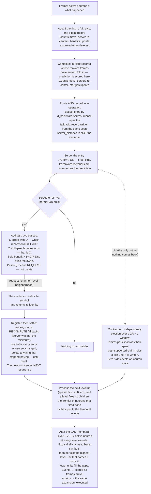

# Universal Compression with Actions and Rewards (UCAR)

UCAR is the design for a machine that compresses observed events by forming a dynamic hierarchical dictionary
of patterns, and learns the best actions to take by observing rewards. Dictionary entries represent situations.

Like a Turing machine, the machine is defined by its alphabets:

- the **event alphabet** — the base event symbols it can observe (its input), and
- the **action alphabet** — the base action symbols it can execute (its output).

Above each base alphabet the machine forms dynamic symbols of its own — patterns — and every symbol, base or
pattern, event or action, is a **neuron**.

The machine runs in frames, and many neurons can be active in one frame. Each frame it reads its inputs: the
active base event neurons — what is happening right now — and the rewards for past actions. From the active
events it recognizes and activates higher-level event patterns, then outputs a set of actions. The actions
execute at the end of the frame and are active in the following frame, alongside that frame's inputs. The
machine learns the rewards of the actions it took for the events that were active. Observed events start with
default actions — that is the bootstrap — and once a default action's rewards are learned, the machine keeps
trying different actions while the rewards are negative.

**A pattern is a name for a chunk of spacetime.** One pattern-learning algorithm and one kind of pattern: a
set of `(neuron, offset)` neighbors over `[f − (R−1), f + (R−1)]`, naming what was present in the frames behind it and
the frames ahead of it, at once. A pattern is minted at a delay, once its chunk has been observed, so both
directions are ordinary evidence and neither is privileged. There are four types only in the sense that two
declarations cross:

- **Offsets** — all zero, or spanning. The spatial case is not a separate mechanism: it is the case where
  every offset is zero.
- **Dimension** — event or action. Not a separate mechanism either, for a plainer reason than it looks: the
  machine observes its own actions. Each action dimension carries what was executed, so an action is a symbol
  read back the same way a pixel is, and a pattern over it is learned by the same counting.

You could not tell from a dictionary line which of the four you were holding. **The one asymmetry lives
outside the pattern: events infer actions and never the reverse, and that inference runs on
[rewards](#rewards).**

The two hierarchies connect to each other, at every level. Event patterns and action patterns are active in
the same frames, so an action pattern's context can name event patterns — a high-level situation connected to
a high-level response, with the rewards learned on that connection. This is how a complex action sequence is
learned as the answer to a complex event sequence: each side compresses its sequence into one symbol, and a
single association joins them.

Recognition and execution run in opposite directions. Events compose bottom-up: base events activate patterns,
patterns activate higher patterns. Actions unfold top-down: selecting a high-level action pattern is a
commitment to perform it, and it expands into its constituent actions over the coming frames — at the time
distances its structure recorded — until base actions execute. The machine recognizes with one direction and
performs with the other.

Patterns are learned from failures of description. Before a neuron knows any patterns, it learns a **normal**
by counting, and describes with it. A pattern is created only where the normal keeps failing — and a recurring
pattern that pays for itself becomes a symbol one level up. Resolution shrinks going up by **contraction**: the
machine keeps only the fewest units that still reconstruct the level below.

Every structural decision a neuron makes is [one test](#the-one-test), evaluated exactly against the
[frames it remembers](#the-history) — and children are only ever added in response to an **error**.
A neuron whose situations are all explained builds nothing.

## The substrate

The alphabets are not given as bare symbol lists — they are declared as structure, and the declaration is part
of the machine's definition. The machine declares **channels**; each channel declares **dimensions** — event
dimensions and action dimensions; each dimension declares its resolution (its bucket count). A base symbol is
a dimension–bucket pair, so this declaration *is* the alphabet definition: the event dimensions spell out the
event alphabet, the action dimensions the action alphabet.

**Channels are declared and never created.** No mechanism anywhere mints one: a pattern inherits its parent's
channel, so every neuron the machine ever builds lands in a channel that was there at definition time. What
grows is the population inside a channel — patterns are added level by level, without bound. So the base
alphabet is fixed while the machine's own alphabet above it is not, and the channel set stays a fixed,
enumerable index over the whole run, which is what lets `(channel, offset)` name a slot at any level.

Every frame, each event dimension quantizes what was observed — if anything was — and each action dimension
carries the action executed at the end of the previous frame — if one was. And:

> **A neuron fires only when something happens: an event neuron on an observation, an action neuron on an
> execution. At most one neuron fires per dimension per level in a frame; a dimension with nothing to report
> is silent.**

**A firing stays open for `R − 1` frames.** A neuron *fires* at frame `f`, and that activation stays open through
`f + (R−1)` — exactly how long its neighborhood takes to fill, which is how long it takes to slide from the newest edge of the buffer to the oldest. While open it keeps working: arriving neighbors fold into its
server's counts, the server re-centers, distances and margins update. That activation does not re-fire — it is
one firing, not a state — and it does not re-enter other neurons' neighborhoods, since membership is by firing
frame, so one firing is one neighbor at one offset and nothing more. The neuron itself is free to fire afresh
while an earlier activation is still open, and several firings can be open at once, each with its own
neighborhood, record and server. **The exclusion is about firing, not about being open**, which is why a channel can carry
several firings in one frame at different levels, all of them inhibited except the apex.

There is no declared rest value: a dimension where nothing is happening simply supplies no symbol. Whether a
0 pixel is a black event or nothing-to-see is the encoding's choice, made where the input is produced — the
machine only ever sees the symbols it is given. Silence is not a symbol to be stored — it is what the decoder
assumes for anything the file does not state. This buys three things at once:

- **Blank regions cost nothing.** No activations, no history, no dictionary, no compute — a neuron that is not
  active does not process the frame at all.
- **The observation is a set.** Variable-size, containing only what is actually happening, which is what the
  [fit](#the-fit) needs and nothing more.
- **Absence still discriminates.** A pattern naming a ring of pixels is measurably wrong on a filled disk: the
  active neurons inside the ring are present-but-unnamed and the distance counts them. Offness carries
  information through the distance without ever costing storage.

A dimension where something always happens is simply always active; nothing below depends on sparsity — it
only profits from it.

A neuron's coordinate is `(dim_id, bucket_id)`; its channel is the channel owning that dimension.

**Identity is absolute.** A neuron is bound to its position, so the same shape appearing at two positions is two
different observations over two different neurons, learned independently. Nothing shares a shape across
positions the way a convolution shares a filter — a retinotopic layout cannot, and the design does not try to.
Each position pays for its own patterns out of its own [history](#the-history), so the redundancy is bounded by
what actually recurs there. Sharing structure across contexts is a concern of the temporal axis, not this one.

The machine's definition also declares which channels are neighbors of which — and may declare wider neighbor
sets for the first levels above the base, where the input's geometry is still meaningful (a growing
retinotopic radius, for example). The declaration is a **filter**, and it runs out where the declared geometry
runs out: **above the declared levels, every active neuron is a neighbor.** Receptive fields grow with depth
through composition. This is the only place topology enters the design, and the levels above it assume none.

Each channel has at most one event dimension and one action dimension; processing is type-specific, and children
inherit their parent's channel and dimension. Thus, within an event or action neighborhood, `(channel, offset)` identifies
one mutually exclusive slot.

**The exclusion is per level.** At most one neuron per channel is active at a given level in a given frame —
declared for the base, and preserved upward by construction: one active neuron per channel per level offers at
most one bid, so [contraction](#contraction-building-the-level-above) promotes at most one unit into that
channel one level up. This is what keeps a slot resolvable at every level, and it is why neighborhood size does not
square as the hierarchy deepens.

### Rewards

A reward is an input, not a symbol: alongside the observations, a frame may carry reward for actions already
taken. Credit lands on the **apex active action** — the highest action pattern in control of its channel that
frame, falling back to the base action when nothing higher covers it. The apex is the unit that was actually
in control: a committed higher action holds the channel and suppresses its constituents, so crediting the base
would reward suppressed subordinates and calcify primitive-level policy. Value accrues at the same granularity
as structure — selection happens over patterns, so reward must land on patterns to be seen. Before any action
pattern exists the apex is the base action itself, so the same rule holds across all of development.

**Two objectives, meeting at one place.** Everything structural in this design is priced in file length: the
one test builds and deletes, and nothing else does. Reward prices nothing structural, and cannot. A policy is
not a description — the decoder replays the actions the file records rather than choosing any, so no
arrangement of connections could ever shorten the file, and compression has nothing to say about a preference
between two actions that describe equally well. So the machine runs **two** objectives: compression, which
decides what structure exists, and reward, which decides which of that structure is executed. They meet at
exactly one place, the event→action connection, and nowhere else. Those connections are not in the file, are
not priced by the one test, and are not meant to be. Read "everything derives from file length" as a claim
about structure; selection is the other half of the machine and it answers to reward.

**Selection is the whole of what separates events from actions.** Structure is symmetric — an action pattern
is learned exactly as an event pattern is, from the same counting over the same kind of neighborhood — but no fit
ever says which action to take. It says only what an action set looks like. Choosing comes from the
connection an active event pattern holds to the action patterns that have followed it: each connection
carries the reward that arrived, averaged over its exposures, so it is a running estimate of what that action
is worth in that situation. The machine executes the best of them. **Events infer actions this way and
actions never infer events**, and that direction is the only asymmetry between the two hierarchies. The
bootstrap is a declared default action: a situation with no reward history has nothing to choose on, so the
default executes and its connection begins accumulating from the first frame.

**Exploration is a policy, and the default one is deterministic.** Always executing the best-known action is
the old explore-versus-exploit problem: an action that merely scores acceptably can hold a situation forever
while a better one is never sampled. The default here resolves it without randomness. **The action alphabet
is declared in order**, and while a situation's reward is negative the machine walks that order, trying the
next action each time the situation recurs. Deterministic, so a run reproduces and a regression is a real
regression rather than a seed. Other strategies drop into the same slot — Thompson sampling over the
connections is the obvious probabilistic one — and swapping them changes no structure, because exploration
touches selection only.

How a reward distributes over *time* is a separable policy ([global-rewards.md](global-rewards.md)): the
current policy credits the apex actions of the immediately preceding frame; the planned generalization
distributes each reward across the apex actions of the preceding span, weighted by linear decay — linear
rather than exponential so distant antecedents keep nonzero credit under long-latency reward.

## The neighborhood

A neuron that fires at frame `f` observes a **neighborhood**: the active neurons its level admits, across the frames
`[f − (R−1), f + (R−1)]`, each tagged with its offset from `f`. `R` is the **radius** — the depth of the
buffer, `W = R` frames, which gives a reach of `R − 1` in either direction. A neuron sits at the newest edge
of the buffer when it fires, with `R − 1` frames of context behind it, and slides to the oldest edge as its
neighborhood completes.

**Spatial processing is the `R = 1` case**: the neighborhood is one frame wide and every neighbor sits at
offset 0. The sections below are written in the general form, which reads temporally because that is the case
with parts to keep apart — [the fit](#the-fit) says how the vocabulary collapses there.

The observation is therefore a set of `(neuron, offset)` neighbors:

```
O = { (p, −4), (a, −3), (r, −2), (i, −1), (␣, +1) }
```

for a neuron `s` in a stream reading `p a r i s ␣`. The neighbors at offset 0 are the neuron's co-occurring
neighbors — the spatial part of it. The neighbors at negative offsets are what led here. The neighbors at positive
offsets are what followed. **All three are the same kind of thing**, and the sections below never distinguish
them.

Which neurons may appear in a neighborhood at all is the substrate's rule for that level: the declared neighbor
channels while a filter is declared, every active neuron above that. **Channels gate eligibility, nothing
else.** Two children of the same neuron may name overlapping but different channel sets — `{A, B, C}` and
`{B, C, D}` are just two sets. The [fit](#the-fit) needs no channel structure.

**One window per neuron per activation**, and **at most one entry serves it**. If a neuron could activate
several children, each channel would carry several active units, those would all become neighborhood members one
level up, and the count would square at every level.

**The forward part arrives late.** At fire time the neuron can see `[f − (R−1), f]`; the rest of the neighborhood
fills in over the following `R` frames, while the activation is still open. **Each frame is priced once, as it
arrives**: whatever the serving entry got wrong at that offset is added to the totals then, and never
revisited. Nothing is charged for a frame that has not happened, and nothing already charged is recomputed —
the numbers grow to their final values and stop.

## The fit

An entry's neighborhood names a set of `(neuron, offset)` neighbors; the neuron observed a set. The distance between
them is the symmetric difference:

```
d(O, C) = |O △ C|   =   neighbors present that C does not name
                      + neighbors C names that are not present
```

This is not a separate notion invented for matching — it is literally the corrections that would follow this
activation in the file. The service cost and the match distance are the same number. It is also channel-free
and offset-blind: a missed neighbor and a missed prediction cost exactly the same, because in the file they
are the same thing — a correction.

The distance decomposes at the present:

```
d(O, C)  =  d_backward   (offsets ≤ 0, fully observed at fire time)
         +  d_forward    (offsets > 0, accrues over the next R − 1 frames)
```

- **`d_backward` is what routing uses.** It is all that exists when the entry has to be chosen.
- **`d_forward` is the prediction, scored.** The entry's forward members are asserted at fire time; whatever
  they got wrong is counted as it arrives.

**At `R = 1` the vocabulary collapses onto the spatial case.** With every offset zero there is no forward half:
`d_forward` is empty, `d_backward` is the whole distance, and "the backward neighborhood" is just the
neighborhood. Read the rest of this document with the temporal parts struck out and it is the spatial
algorithm, unchanged —

- routing on `d_backward` is routing on the entire observation, so `server_distance` **is** the minimum and a
  fallback **is** the true runner-up;
- an occurrence completes at fire time, so nothing is ever in flight, no total ever grows, and the
  [completion step](#the-frame-step-by-step) has nothing to do;
- the [history](#the-history) keys its bins on the whole neighborhood, and every price is final the moment it
  is written;
- `horizon > 2(R−1)` reduces to `horizon > 0`, so the constraint binds nothing.

Spatial is not a reduced version of the machinery. It is the same machinery with an empty half, which is why
the [spatial stack](#the-order-of-a-frame) needs no radius of its own and costs no parameter.

**Two comparisons, kept apart.** Which entry *serves* a record is decided on `d_backward`, because that is all
routing ever sees. What a record *costs* is its distance over every offset observed so far — the backward half
at fire time, growing as the forward frames arrive, final only when the record completes. Everywhere below,
"wins", "closest" and "runner-up" mean the first; "distance", "cost" and "benefit" mean the second. At `R = 1`
the two coincide, which is why the spatial case never had to tell them apart.

**The split is about availability, not meaning.** A neighborhood names both directions symmetrically and a
pattern is minted after its chunk has been seen, so nothing about backward members makes them more defining
than forward ones. Routing is what cannot wait: an entry has to be chosen while the neuron is firing, and at
that moment only the past exists. `d_backward` carries routing for no deeper reason than that it is the half
that has happened. This binds every neuron that routes at fire time — action neurons no less than event
ones, since an action neuron fires when its action executes and waits out its forward half exactly the same
way.

**Two different objects.** `d_forward` is what *this entry* got wrong, counted against its own history — exact,
local, and the only prediction signal a neuron ever learns from. The file's frame part counts what the
*decoder* got wrong, once per slot, over the machine's single arbitrated
[assertion](#the-order-of-a-frame). The two coincide when one entry owns a slot outright and
diverge when several assert, or when the entry is not an apex and never entered the file at all. The identity
above holds per entry; it is not a claim about the file's total.

A record's distance is therefore a number that grows to its final value over `R` frames. Every quantity built
on it — benefits, margins — is maintained on events and updates as the forward part lands.

## The routing table is a facility location problem

**The plain problem.** Customers are spread over a map. You may open warehouses. Opening one costs a fixed
amount; serving a customer costs in proportion to how far it is from the warehouse serving it. Minimize the
sum. Open too few and customers are served from far away; open too many and you pay to open them.

**The mapping is direct:**

| Facility location | Here |
|---|---|
| A customer, i.e. one unit of demand | One record in the [history](#the-history) |
| A facility | An entry — the normal or a child |
| Opening a facility | Creating a child, and the pattern neuron it mints one level up |
| Opening cost | `1 + |C|` — the neuron created, plus the neighborhood stored |
| Serving a customer from a facility | Describing that neighborhood through that entry |
| Service cost, i.e. distance | The [fit](#the-fit) — the neighbors the entry got wrong |
| The assignment of customers to facilities | The routing — closest entry serves |

The opening cost is not a tax bolted on — if opening were free you would put a warehouse on top of every
customer: perfect service, zero distance, one facility per neighborhood ever seen. It is the only thing standing
between the design and memorizing every frame.

The local search over this problem has **four** moves, and each appears below as an exact operation against the
history:

- **Add** — open a child at the center of unserved demand ([creating a child](#creating-a-child)).
- **Delete** — close an entry whose benefit no longer covers its storage ([deletion](#deletion)).
- **Swap** — open one and close one, priced jointly ([the swap](#the-swap)). Without it, the search can lock:
  two mediocre children can jointly block the one good one, with no single add or delete able to fix it.
- **Move** — re-center an entry on the demand it currently serves ([re-centering](#re-centering)). Not a
  priced decision; it happens automatically whenever an entry's served set changes.

**Split** and **merge** need no machinery of their own: split is what add does to an overloaded entry's demand,
merge is what swap does to redundant entries.

## Entries: one kind of thing

**Every entry — the normal and every child — is the same object:** counts over the records it serves, a
**neighborhood** that is the collapse of those counts, and a child to activate. The neighborhood is the whole
of what an entry knows — the neighbors around the neuron, behind it and ahead of it, with no separate notion of
context or of what it infers. The normal is not a special mechanism: it is the entry whose child is null, so
it has no dictionary line to pay for. One structure serves the whole routing table.

### The counts

Each entry keeps, over exactly the records it currently serves within the history:

```
count(neuron, offset)  =  how often that neighbor was present
```

Every event that changes *which records an entry serves* moves counts, in both directions: the entry serves a
record → increment; a served record leaves the history → decrement; a new child captures remembered records →
the old server decrements and the child increments; a deleted entry's records fall back → the fallback
increments. A record's forward part landing → increment. Nothing else touches the counts.

**An entry counts only its own records.** A neuron either describes a neighborhood with its normal or delegates to a
child; every record is served by exactly one entry, and no entry learns from another's records.

### The collapse

Routing needs a set, not a distribution. The counts collapse to one by a **per-slot vote**:

> **For each `(channel, offset)` slot, let `n` be the entry's served-record count and `count(p)` the number
> of those records containing neuron `p` in that slot. The neighborhood includes `p` exactly when
> `count(p) > n / 2`; otherwise the slot is omitted.**

A slot cannot hold two neurons — a channel carries at most one active neuron of the processed type per frame —
so at most one candidate can have a strict majority. Silence is not stored as a symbol: it is the implicit
alternative, with count `n − Σ count(p)`. A rare or split observation therefore loses to silence and is omitted.
There is no tunable threshold, smoothing, or probability estimate here: the denominator is the served-record
count, and the strict-majority boundary is required by the exact L1 minimization.

The result is the exact **L1 center** of the served set under symmetric difference — the set minimizing
`Σ d(O, C)` over all possible sets. Note the terminology: it is a *center*, not a *medoid* in the usual sense
of an observed point. It is synthesized, and it may be a set the neuron has never literally seen. That is the
point — it is the typical neighborhood, not a sample of one.

*(Why not a centroid? A centroid over sets is a fractional vector — `p` present 0.7 — which is not a set, cannot
be written into the file, and has no symmetric difference. The counts **are** the fractional object; the
collapse is how the design gets from it to something the decoder can expand.)*

### Re-centering

**The collapse is recomputed whenever the counts move.** No test, no gate, no separate decision — an entry is
always the center of what it currently serves. This is `move`, and it is free because the counts are already
being maintained.

The consequences are the point of the design:

- **Definitions track their demand.** An entry created from thin evidence is pulled toward its cluster as
  exposure accumulates. There is no permanent bet on one observation.
- **Coincidence is voted out.** A neighbor that was present once and never again loses its strict majority to
  silence, and drops out of the neighborhood.
- **Reach emerges.** Offsets where nothing recurs contribute no stable winner and fall away; offsets where
  something does are kept. How far a pattern reaches into the past and future is discovered, not declared.
  The radius `R` bounds it; it does not set it.

A moved neighborhood changes distances, so records may change hands — [settlement](#settlement) handles this
exactly.

**Fallbacks move with it.** A record that names the moved entry as its *fallback* is not served by it and does
not change hands, but its `fallback_distance` was measured against a neighborhood that no longer exists — and
a stale fallback quietly corrupts its **server's** margin, so the delete test would fire on a gap that is no
longer there. Re-centering therefore updates both sides: the records the entry serves, and the records that
fall back to it, whose servers' margins adjust by the change. This cannot cascade on its own, because a
fallback serves nothing and no record moves; it only pushes margins into the settlement loop that already
handles them. The cost is that an entry has to know which records name it as fallback — a reverse index, which
is the one piece of bookkeeping the routing table keeps purely for the delete test.

**What re-centering does not do is re-elect the fallback.** It keeps `fallback_distance` true for the entry a
record names; it does not notice when some *third* entry has moved close enough that it should now be the
fallback. So a fallback is the best alternative as of the last add, swap or delete, not as of this frame. The
error has one direction: the named fallback is too far, so the gap looks larger than it is, so benefit is
overstated and entries live a little longer than they have earned. Never the reverse — no entry is ever
deleted on a fallback that flattered a rival. The exact variant is in [risks](#risks).

**Cold start is silence.** An entry with no records yet has no counts and no neighborhood. That is the initial
case, not an error.

## The history

A neuron remembers a fixed number of neighborhoods it was active for — its **horizon**, measured in its own
activations, not in absolute time. **There are no frame numbers anywhere in the history and nothing needs
them**: benefit is a sum over records, cost is a count of neighbors, and the only role time ever played was
eviction order, which a FIFO provides by construction. This makes the one test uniform across neurons under
sparse activation: a busy neuron and a rarely-active neuron judge over the same amount of *evidence*, not the
same amount of someone else's clock.

**The history is keyed on the backward half.** Two activations whose backward neighborhoods are identical sit
at the same `d_backward` from every entry, so routing sent both to the same server and the same fallback. That
makes the backward half — and only the backward half — safe to share an assignment across. The forward half
cannot key anything: it does not exist yet when the assignment is made.

So the history is a **bin per distinct backward neighborhood**:

```
bin  =  (backward neighborhood, occurrences, server, fallback,
         d_backward to each, per-slot forward counts, Σ server mismatch, Σ fallback mismatch)
```

and a **FIFO ring of the occurrences themselves**, in arrival order, each carrying the forward frames it
actually saw:

```
occurrence  =  (bin, forward neighbors as they arrive)
```

**A bin is to its occurrences what an entry is to its bins** — the same aggregate, one level down. The
backward distance is a property of the bin, identical for every occurrence in it. The forward half is
statistics: what followed this context, per slot, tallied.

**Everything the design asks of the history is a sum over slots, so the tallies answer it exactly.** Distance
to a candidate `C` is `occurrences × d_backward` plus, at each forward slot, two for every occurrence holding
some other neuron than `C` names there and one for every occurrence holding nothing — or one for every
occurrence holding anything, where `C` names nothing. The collapse is a per-slot vote, so summing the won
bins' tallies gives the same answer as walking individual windows. Benefit needs only the totals. Nothing
anywhere asks whether `c` at `+1` came with `d` at `+2`.

**The ring is what makes eviction exact.** Removing the oldest occurrence means subtracting the neurons *it*
contributed, and a tally cannot say which those were — so the occurrence carries its own forward frames, and
the bin is the cached aggregate over them. This is not a saving in storage. What it buys is that the add test
scans **distinct backward contexts** rather than occurrences, and reads pre-summed tallies instead of
re-walking windows.

**It also makes the win test per bin.** A candidate wins on `d_backward`, which is a property of the bin, so a
bin is won or not won whole. No bin ever has to be split, and every occurrence in it keeps agreeing with every
other about who serves it.

**`server_distance` is not the minimum.** Routing chose on `d_backward`; the total is only known `R` frames
later, and the entry that won the prefix can end up further away than the runner-up once the forward parts
land. The name says so. Nothing below may assume the server was the closest entry in total distance.

**An occurrence completes over `R` frames.** Its backward half is fixed at fire time — that is its bin — and
its forward frames arrive one at a time, each folding into its bin's tallies, its server's counts, and the
distance totals. An occurrence evicted before completing simply contributes what it had, and subtracts
exactly that.

**Aging is one-out-one-in.** Once the ring is full, recording this activation evicts exactly the oldest record —
"age before add" is the data structure, not a rule to remember. Eviction has consequences
([deletion](#deletion)). Recording is unconditional: a neuron's evidence is the neighborhoods it was active for, and
no election outcome ever edits a history.

**Why the fallback is stored.** The delete test asks what an entry's records would cost without it, and the
answer is the fallback. Storing it (and its distance) is what lets every entry's benefit be maintained as a
**running benefit**, updated only by events — so no test ever scans.

**It has to be the records, not a summary.** A running error total cannot answer what deletion asks: when an
entry goes, its records fall to their fallbacks, and the *new* runner-up for those records must be recomputed
from the records themselves. Keeping them is what makes every decision exact rather than estimated.

**The trade this makes, stated honestly:** wall-clock staleness is unbounded. A neuron dormant for a million
frames wakes with its old model fully intact. That is the intended bet — absence of evidence is not evidence
the structure died, and if the world did change while the neuron slept, the errors start arriving immediately
and restructuring proceeds at the pace of new evidence, which is the only pace a neuron can honestly claim to
know anything at.

**Free parameters.** Two: the **horizon** (the history's capacity) and the **radius** `R` (which sets the
window `W = R` and the contraction window). Everything else that could be called a parameter is a declaration
of the machine's interface — channels, dimensions, resolutions, the neighbor filter and its depth — or a
backstop that does not affect the settled result (the election's round cap).

**The two are not independent: `horizon > 2(R−1)` is required.** A record enters an entry's served count at fire
time, but its slot at offset `+k` cannot be counted until `k` frames later, so the `k` most recent records are
always blank there while still sitting in the [collapse](#the-collapse)'s denominator. The slot at `+k` can
therefore draw on at most `horizon − k` records against a threshold of `horizon / 2`, and is nameable only
when `k < horizon / 2`. The deepest slot is `k = R − 1`, so a horizon of `2(R−1)` or less makes the outer forward
offsets unnameable no matter how reliably they recur — and silently, since a slot that never had the votes
looks exactly like a slot with nothing to say. This binds the temporal levels only: spatial runs at `R = 1`,
so a spatial record is complete when it is written and nothing there is ever judged against a blank.

## The one test

There is exactly one structural rule in the design:

> **An entry earns its place when the errors it removes from the history exceed what it costs to store.**

Both halves are counts of neighbors, and both are read off the history:

```
cost(e)     =  1 + |C(e)|
benefit(e)  =  Σ over the records e serves:  (fallback_distance − server_distance) · count
```

Benefit is maintained as a **running benefit** per entry. It changes only on events — the entry gains a
record, loses a record to eviction, a record's forward part lands, or an entry appears, disappears, or moves
nearby — so the delete test is O(1) per event and no test ever scans the history.

**Benefit** is the sum above, **cost** is `1 + |C(e)|`, and **margin** always means `benefit − cost`. The rule
is strict on both sides: an entry is **added** only when its margin is strictly positive, and **deleted** only
when its margin is strictly negative. At exact equality nothing happens — an existing entry is kept, a
candidate is rejected — so the boundary can never flip-flop.

**Negative-benefit records are legal, and they are the signal.** A record whose server won on the backward
match but predicted worse than the runner-up contributes a negative term. This is exactly the case where an
entry names a chunk correctly and gets its future wrong — and it now shows up in the ordinary margin
machinery, dragging the entry toward deletion and triggering the add test that proposes the replacement. No
separate mechanism is needed for it.

**What the potential argument covers, and what it does not.** Every *handoff* — a record moving to a closer
entry — strictly decreases the file length `L` over the horizon, and `L` is a non-negative integer, so
settlement cascades terminate. **Re-centering is different:** it minimizes service cost over the served set
(the collapse is the exact minimizer) but can change `|C|`, so a single collapse may raise `L`. The honest
claim is therefore narrower than the one this design once made:

- Settlement terminates, with a round cap as backstop.
- `L` is a Lyapunov function for *handoffs*, not for the learning dynamics as a whole.
- Cross-frame churn is **not** proven away by any argument here. It is bounded by the error-only trigger and
  the strict margins, and it is measured, not assumed ([risks](#risks)).

## The frame, step by step

Two processes run over the same frame, and they are **independent**. The neuron's own pipeline — route and
record, serve, reconsider structure — reads and writes only the neuron's own state, and depends on nothing the
election decides. Contraction reads the level's recognition bids and decides only what is represented above;
it has **zero side effects on neuron state**.

For an active neuron at frame `f` with observed backward neighborhood `O⁻`:

1. **Age.** If the history ring is full, evict the oldest occurrence. Its bin's count decrements; its neighbors
   leave its server's counts; that server re-centers; its benefit drops — and an entry whose benefit falls
   strictly below its cost is deleted now ([deletion](#deletion)).

2. **Complete.** For each in-flight record whose forward frames have now arrived, fold the new neighbors into the
   server's counts, re-center, and update distances and margins. This is where prediction is scored.

3. **Route and record** — one operation. The closest entry by `d_backward` serves — the normal and every child
   compete, ties to the older entry; the best and the runner-up come out of the same scan, and the record is
   written down right there with its backward distances. Every active neuron records, unconditionally. Fold
   `O⁻` into the server's counts and re-center.

4. **Serve.** The serving entry **activates**: it fires, and the neuron hands the machine its **recognition
   bid** — an offer to represent its chunk at the level above, spanning the frames its neighborhood names. The
   bid is the pipeline's only output to the election, and the election sends nothing back. **Creation never
   bids.**

5. **Assert.** The served entry's forward members are the neuron's prediction for the coming `R` frames. They
   are not computed — they are read off the neighborhood. The unmatched part, when it arrives, is the surprise,
   and it is scored at step 2 of a later frame. What the *machine* asserts is a separate question, settled once
   every level has resolved ([the assertion](#the-order-of-a-frame)); a neuron scores its own
   forward members against its own history either way.

6. **Add test** — on **any nonzero served error**, whether the server was the normal or a child. Under
   trajectory neighborhoods a child is not an admission of ignorance — it is the sharper model, so a child that
   describes badly is exactly the error worth acting on. At most one add per activation. A passing test does
   not create the pattern — the neuron **requests** one. A neuron names its own children but cannot bring
   them into being: a pattern is a symbol at the level above, and that level's alphabet belongs to the
   machine, not to any neuron in it.

7. **Register and settle.** The machine creates the requested pattern and returns its identity; the neuron
   registers it as an entry, and [settlement](#settlement) follows. The newborn is installed **now, for
   later** — it fires for the first time on the next activation its neighborhood recurs, and never covers,
   propagates, or serves on its birth frame.

Meanwhile — before, after, or alongside; the pipeline cannot tell — contraction runs its election over the
window's bids and promotes the survivors. Because no write ever depends on the election, there is no pending
state, no retraction, and no covered-or-not branch.

### One activation, across its frames

The steps above are one frame. An activation lives for `R − 1` more of them, and what happens to it in between is the
whole of how a neuron learns. Take `R = 3`, a neuron with the normal `N` and a child `K`:

```
K names  {(a,−2), (b,−1), (c,+1), (d,+2)}
N names  {(b,−1)}
```

**Frame 10 — it fires.** `a` was present at −2 and `b` at −1, so `K` matches the observed half exactly at
`d_backward = 0` while `N` misses `a` at `d_backward = 1`. `K` serves. The record is written with `K` as
server and `N` as fallback, and `K` asserts `c` at frame 11 and `d` at frame 12 — on faith, because neither
has happened. Served error is 0, so nothing is reconsidered.

**Frame 11 — `c` does not come; `e` fires in that channel instead.** Four things happen at once, and they are
step 2:

- **The distance grows.** `K` named `c` and got `e`: two neighbors wrong. `N` named nothing there and got `e`:
  one. Neither number was wrong before; both were simply incomplete.
- **The counts move.** `(e, +1)` folds into `K`'s counts.
- **`K` re-centers, so its own future changes.** If most of `K`'s records carry `e` at that offset the
  neighborhood flips `c → e`; if they are split, the slot loses its majority to silence and `K` stops naming
  that offset at all. This is [reach emerging](#re-centering) in motion — an entry's forward half is whatever
  currently recurs, never what it was minted with.
- **The margin updates**, by the change in `fallback_distance − server_distance` for that record. It can go
  negative, and if the margin falls strictly below `1 + |K|`, `K` is deleted right there.

**Frame 12.** The `+2` offset lands, the same four things happen, and the record is complete. Its distance is
final and never moves again.

**What does not happen is retraction.** `K` claimed `c` at frame 11 and the file paid for being wrong. Moving
`K`'s neighborhood afterwards changes what it asserts at the *next* recurrence; it does not reach back. Every
number in the design grows forward into its final value, and none is ever revised.

## Creating a child

**The trigger is an error, nothing else.** No background process proposes candidates and no accumulator waits
to fire. The serving entry described the neighborhood and got some of it wrong — that error is the only moment
structure is considered. A neighborhood the entries already describe costs nothing to serve no matter how often it
recurs; surprise is the size of the bill, not a gate on it.

**Creation happens after recognition.** A new child is minted after the test and fires for
the first time on the next activation its neighborhood recurs. It does not serve, cover, or propagate on its birth
frame — that frame was already encoded, corrections and all. **Structure never pays off on the evidence that
created it, only on recurrence.** Nothing compresses at first exposure. It also keeps the election
single-purpose — recognition bids only — with no birth-frame special cases.

**The candidate is a center, not a sample.** Two passes over the bins, both cheap, both only on error:

1. **Find the demand.** Using the triggering observation `O` as a probe, collect the bins routing would hand
   it — those where `d_backward(bin, O) < d_backward(bin, bin.server)`. A bin is won whole, since
   `d_backward` is a property of the bin.
2. **Collapse.** Take the per-slot vote over exactly those bins, summing their tallies. The result is `C`.

`C` is the L1 center of the demand the child would serve, not the one neighborhood that happened to trigger the
test. Incidental neighbors — present in the trigger, absent from the cluster — lose their slots and never enter
the neighborhood. `|C|` is therefore the size of what recurs, not the size of one observation, which matters
enormously over a window `2R − 1` frames wide.

The win set may shift slightly once `C` replaces `O` as the probe; price `C` against its recomputed win set.

**Winning and pricing are different questions.** A record is won on `d_backward`, because that is what routing
will compare when the window recurs. It is priced on the distance as observed, because that is what the record
will cost. Deciding the win set on the observed distance instead would count a candidate as winning records it
can never be routed to — exactly the ones whose advantage is entirely in the forward half — and overstate the
children most likely to disappoint. The comparison is against the server's **current** neighborhood, not the
one it had when the record was written: what matters is where routing would send the neighborhood next time.

**The solo test.** Would a child at `C` pay for its storage?

```
win set  =  bins b with  d_backward(b, C) < d_backward(b, b.server)
benefit  =  Σ over the win set:  b.Σ server mismatch  −  d(b, C)
commit iff  benefit > 1 + |C|
```

`d(b, C)` is summed over the bin's occurrences straight off its tallies, so both sides of a term are read over
the same offsets and over the same occurrences: an occurrence that has not seen a frame yet contributes
nothing there, on either side, and nothing is priced against a frame that has not happened. A term can be
negative — `C` wins a bin on the backward half and describes it worse in total — and that is not an anomaly to
clamp away but the honest cost of a child routing will hand neighborhoods it predicts badly.

There is no special term for the triggering neighborhood: it was recorded at step 3, so it sits in its bin
like any other occurrence and is priced on the neighbors observed so far, like any other. One pass over the
bins — never more distinct backward contexts than the horizon holds.

**A candidate rejected today is not lost.** Every future error offers a new probe, and re-centering means a
child that does get minted improves with exposure rather than being frozen at whatever the probe happened to
be.

### The swap

If the solo test fails, the candidate gets one more chance, jointly with a deletion. Take the child `X` whose
served records `C` would win the most of (the overlap is visible in the solo pass), and price the joint move
`{add C, delete X}` exactly:

```
Δ =   Σ over X's records:  cost served by X  −  cost served by whichever of
                           (surviving entries + C) routing would pick
   +  Σ over records NOT served by X that C wins:  (server_distance − d) · count
   +  (1 + |C(X)|)          // X's storage refunded
   −  (1 + |C|)             // C's storage charged
commit iff  Δ > 0
```

"Wins" and "would pick" are `d_backward`; every "cost" is the distance as observed — the same split as the
solo test.

The two sums are over **disjoint** record sets, so no improvement is counted twice. Entries are priced
**frozen** where they currently stand; the re-centering afterward only improves things, so a positive frozen
score understates the realized gain and is always safe to commit.

Examining only the most-overlapped child is a **heuristic**, not an exhaustive search. It is kept because
re-centering has taken most of the load off the swap: an off-center entry now moves toward its cluster on its
own, so the swap only has to handle the genuinely locked cases — two entries straddling one cluster, neither
individually deletable. The exact variant (price against every child) stays affordable if diagnostics justify
it, since the test only runs on error.

**What the child is, at birth.** The parent requests, the machine creates. The pattern **inherits its parent's
channel** and mints **one level above its parent's level** — both are carried on the request, so the machine
allocating the symbol decides nothing about what it means. It is **created with no counts**: its own neighborhood
belongs to its own level, which it has not observed yet, and it learns it there by ordinary counting. Its
*existence* is decided by its parent; its own *structure* is decided by itself, by its own tests, at its own
level.

## Deletion

An entry dies the moment its benefit no longer covers its storage — and that moment is only ever caused by an
event, so **there is no delete scan**. Three kinds of event can push a margin negative:

1. **Eviction.** Served records leave the history one at a time as demand drifts; the margin slides; when
   benefit falls strictly below cost, the entry is starved and deleted.
2. **Completion.** A record's forward part lands and the entry predicted worse than the fallback would have —
   the record's contribution goes negative and the margin drops.
3. **Settlement.** A committed add or swap either takes records from an entry directly, or plants a closer
   fallback under records it keeps — **fallback collapse**: the entry still serves its records, but the error
   it spares shrank because the records now have somewhere better to fall.

**Deleting a child, exactly:** its neighborhood leaves the routing table and the pattern neuron one level up is
released. Each record it *served* reassigns to its stored fallback, which gains those records — counts in,
re-center, and **its margin gains the new gaps**, which is what can rescue an entry that was itself close to
starving. A fresh fallback for those records is computed against the surviving entries by `d_backward`. Each
record where the dead child was the *fallback* keeps its server but recomputes its fallback, and that server's
margin updates too — downward, since the record now has nowhere as good to fall. Every entry that gained or
lost records re-centers. **Deletions are sequential** — one at a time, re-checking margins after each — because two entries
covering the same demand each look redundant while the other stands.

The normal is never deleted: it has no dictionary line, so there is nothing to refund.

Nothing irreplaceable dies. The evidence lives in the history, not in the entry — if the same neighborhood is
justified again, the add test rebuilds it from the same records.

## Settlement

What follows a committed add, swap, or delete, in order:

1. **The won records change hands.** For each bin the new child `C` wins: the old server's margin
   drops by the gap it was earning; `server = C`, distances update; `C`'s margin gains the new gap. Both
   entries' counts move and both re-center.
2. **Fallbacks are recomputed, not inherited.** Because routing chose on `d_backward`, the previous server is
   *not* guaranteed to be the new runner-up. Every affected record's fallback is recomputed against the
   surviving entries, by `d_backward` — the fallback is whichever entry routing would pick if the server were
   gone, so it is selected the way routing selects.
3. **Fallback collapse propagates.** For each record `C` did not win but where `C` is nearer by `d_backward`
   than the stored
   fallback: the fallback is replaced and the server's margin adjusts by the change in the gap.
4. **Re-centering settles.** Every entry whose served set changed recomputes its neighborhood. A moved
   neighborhood changes distances, which may cause further handoffs, which move counts again. Repeat until no
   record changes hands.
5. **Margins that went negative trigger deletion**, sequentially, cascading as needed.

Step 4 is the one place this design cannot offer a clean monotonicity proof: handoffs strictly decrease `L`,
but a collapse can change `|C|` either way. In practice each round strictly reduces the number of misassigned
records, and the work is bounded by the bin count, which is bounded by the horizon. **A round cap is the
backstop**, and the fallback if cascades prove deep is in [risks](#risks).

## The cost: it is all one file

Take the whole run and write it as a single file a decoder could read back to reproduce every frame exactly.
The file has two parts:

1. **The dictionary.** For each neuron, the neighborhood of each of its children — the `(neuron, offset)` neighbors
   the child names. The counts are not here: they are tallies the reader recounts from the frames below.
2. **The frames.** The apex units, and the corrections where they were wrong. Anything unstated is silence.

**The frame part is predictively coded.** The decoder runs the same model as the encoder — it has decoded
everything up to the present, so it can compute the same neighborhoods and the same assertions. It therefore
already knows what each active unit predicts about the frames ahead. **The encoder writes only the surprise.**

```
asserted {␣} at +1, actual {␣}   →   0 symbols
asserted {␣} at +1, actual {e}   →   2 symbols (turn off ␣, turn on e)
asserted nothing at +1, actual {e}   →   1 symbol  (turn on e)
```

The third line is not a footnote: **being wrong costs twice what saying nothing costs**, and that asymmetry is
what decides when the machine should commit to a symbol at all ([the
assertion](#the-order-of-a-frame)).

This is the single change from which the rest of the design follows. Under a literal frame part — stating each
frame and correcting it — a prediction that comes true saves nothing, prediction has no price, and no test
could ever value it. Under predictive coding, being right is free and being wrong costs corrections, so
prediction error *is* file length and the one test prices it without any new term. It is also the same
principle the design already relies on for the counts: the decoder recomputes anything it can, and is told
only what it cannot derive.

Every cost in this design is a part of a file — the machine's here, a neuron's below — counted in symbols:

```
activating an apex unit    =  1                             a line in the frames
what it got wrong          =  the neighbors it got wrong        the corrections after it
having a child             =  1 + |neighborhood|              a line in the dictionary
```

This is a **fixed-length code**: every symbol costs one regardless of how often it is used. Pricing by actual
occurrence is a variable-length code over the same file, an experiment rather than the design — see
[forgetting.md](forgetting.md).

**The horizon is what makes the two parts comparable.** The dictionary is written once; the frames are written
over and over. Over one horizon the file length is:

```
L  =  Σ over entries (1 + |neighborhood|)             written once
   +  Σ over remembered records (1 + errors)        written every activation
```

and the one test is nothing more than the derivative of this: an entry belongs in `L` when removing it would
lengthen the file more than deleting its line would shorten it. **Nothing is amortized and nothing is
estimated** — the neuron holds the records, so it evaluates the sum.

**Two scopes, two files.** The `L` above is the neuron's own file: what it would take to reconstruct the
windows it remembers. The machine's file is a different object, because its frame part holds only apex units —
an activation that a neighbor's promoted unit subsumed never appears there at all. Neither file approximates
the other, and a neuron never needs the other one: it compresses its own exactly, knowing nothing about the
election, which is what lets the pipeline stay independent of contraction. Contraction then compresses the
machine's frame part over whatever the neurons offer it. **That the two compose — that exactly compressed
local files plus a greedy election yield a short global file — is an assumption of this design, not a result.**
It is the same assumption [the falsifiable claim](#the-falsifiable-claim) puts on the table, and the
[redundant children](#risks) a neuron mints against errors the machine's file never charged are what it looks
like when the composition leaks.

**Where the counts sit in this accounting.** The dictionary pays for one thing per child: the neighbors it stands
for, written once when the child is created. That list must be written, because nothing else in the file says
it — it was chosen from records that have since been forgotten, and no reader could reconstruct it. The counts
are a different kind of thing: they are tallies over the remembered records, and the remembered records are
already in the file. A reader could recount them, and anything recountable from the file adds nothing to its
length. This is how every adaptive compressor works: it never transmits its count tables, because the receiver
rebuilds them while decoding. **The file contains exactly what cannot be recomputed from it.**

This is also precisely why the normal is free and a child is not — not because context is cheap and outcomes
are expensive, but because the normal is recomputable and a child's neighborhood is not. Forward members cost
the same as backward ones. There is no free half of a neighborhood.

**Every decision is local.** Each neuron evaluates `L` over its own neighborhood only. The global quantity is
measured directly rather than summed: **apex units per level per frame, and the dictionary size that bought
them.** That neighbor is the standing metric, and under this design it should *fall with exposure* on recurring
data: early structure is provisional, re-centering consolidates it, the swap retires what is left.

## Contraction: building the level above

A neuron firing an entry is not yet compression. If 49 active neurons all fire entries, level 1 has 49 active
units and nothing has shrunk. **Contraction is the machine choosing the fewest units at the level above that
reconstruct the level below.**

It is **axis-general**. A neighborhood names neighbors at offsets, so a promoted unit replaces a chunk of spacetime,
not a slice of one frame. Spatial contraction is the case where every offset is zero.

**Recognition bids only.** The election's input is one bid per active neuron: the observed backward neighbors its
serving entry names correctly, the bidder included. Forward members are assertions carried by a promoted bid,
not evidence available to its election. The bidder is implied, because a child *is* its parent in that neighborhood —
the entry lives in the parent's routing table, so expanding the unit recovers the parent along with what it
names. Creation never bids; a child minted this frame first competes at its next recognition.

**A bid's price.** At election time, `f` counts only neighborhood members in the observed backward portion that
are absent. The decoder expanding the unit asserts its forward members on faith; any that prove absent are
later corrections, not information available to this election. A bid's present price is therefore `1 + f`,
not a flat 1.

**The objective.** The machine accepts a subset of bids. Each accepted bid propagates one unit at cost
`1 + f`. Every active neuron not covered by an accepted bid is a correction, at cost 1. Minimize
`Σ accepted (1 + f) + corrections`. This is prize-collecting set cover, in the same currency as everything
else.

**The window is `2R − 1`.** A bid firing at frame `g` names `[g − (R−1), g + (R−1)]`, so a window narrower than `2R − 1`
would price only part of a claim and the cheapest bid would be whichever one the window happened to truncate
most. It is wider than the `R`-frame buffer, because a bid reaches `R − 1` ahead of the newest frame in hand —
but what it spans is slot *ownership*, not frames, and slots are retired as they are written. So it introduces
no new parameter and no second buffer of observations.

**The window is a map of slot ownership, not a pool of bids to re-elect.** It is how much of the
`(channel, frame)` map a bid can reach, so that what it claims and what is already gone are both visible. The
election's pool is **this frame's bids, against the map as it currently stands** — a written slot is gone for
good, and an unwritten one is held by whichever claim is best supported so far, which this frame's bids may
beat. No earlier promotion is re-elected; what can change is which unit holds a slot that has not yet been
committed. It is the same election the spatial case runs, with a frame coordinate on the slot.

*Exact settlement of a single frame would need `4R − 3` — frame `g` can be claimed by units firing anywhere in
`[g − (R−1), g + (R−1)]`, and those units reach `[g − 2(R−1), g + 2(R−1)]`. `2R − 1` therefore scores bids at the leading edge
against partially-visible competition. This is accepted: contraction mints nothing that lasts, and a grouping
a few units short of optimal costs a few symbols on frames that are gone next window.*

**Claims persist.** A promoted unit has spoken for the frames its neighborhood names, including frames ahead.
Those claims stand until the span completes — the same commitment rule already written for high-level actions,
which hold their channel and suppress their constituents until they expand out. 
So the election settles the future along with the present: the unit holding a slot is the one whose
prediction counts there, and two promoted units can never contradict each other, because only one of them
holds it. Holding is not permanent while the slot is still unwritten — a later, better-supported claim can
take it — but at every moment exactly one unit holds it, which is all the file needs.

**A slot is settled when it is written, not when it is first claimed.** Where two units claim the same
`(channel, frame)` slot, the better-supported claim holds it — and a later firing can displace an earlier one
for as long as that slot remains unwritten. The slot is the unit of ownership, not the frame: several channels
are active in a frame and units in different channels never compete. The displaced unit eats the overlap as
mismatch, and if that keeps happening its benefit bleeds and it dies.

Revision inside that window is free. The frame part is written at a lag, so encoder and decoder both arrive at
a slot with the same information and both apply the same rule; a later claim that fits better simply makes the
file shorter. **Support is the claimant's count share for that slot** — already tallied, and recountable by the
decoder, so nothing about revising is transmitted. Ties go to the older pattern id. Once the slot is written
it is final, and nothing after that can reach it.

**When a frame can be written.** A unit firing at `h` names `[h − R, h + R]`, so a slot at frame `g` can
still be claimed by a unit that fires as late as `g + (R−1)`. Until that frame has been processed, nothing about
`g` is settled.

That settles one level. Which level-1 unit covers a base neuron at `g` is known once `g + (R−1)` has passed — but
the file writes the apex frontier, and whether that level-1 unit is itself covered settles `R` frames after
*it* fired. The question walks upward: **the frame part is written at a lag of `R` per level, so `D · R` for a
frame whose hierarchy reached depth `D`.** Each level needs only its own `2R − 1` election window, so it is the
delay that stacks, not the memory. A frame is written once, when its last possible claimant at every level
has fired, and is never revised.

Depth is data-dependent and uncapped, so the lag is too. That cost is real and it is confined to the file,
which is an accounting object rather than a channel anyone waits on. **Selection never waits.** Actions are
asserted forward and execute at the end of the frame that chose them, so the machine acts at full speed while
its own description of what it just did is still settling behind it.

**Best-effort promotion.** A unit is promoted on the strength of its backward match and asserts its forward
members on faith. When the future disagrees, corrections are appended and price the completed claim; they do
not revise the election that made it. There is no retraction, and no delay beyond the settlement lag the frame
part is already written at: the file is exact either way, because a wrong assertion is simply a longer file.

**The election, in detail.** Set cover is NP-hard, but contraction mints nothing that lasts, so it is settled
by a cheap election:

- **Voters** are every active neuron named by at least one bid. Voters are walked in sorted id order and bids
  in a fixed order, so the outcome is independent of dispatch order.
- **The ranking rule**: among a pool of bids, the best covers the most neighbors; ties go to the **older pattern
  id**. Ranking is a total, deterministic order.
- **Rounds**: (1) compute the **survivors** — bids whose current voters outweigh their price, `k ≥ 2 + f`.
  (2) Each voter looks at the bids naming it: if any survived, it elects the best among the survivors; if none
  survived, it elects the best among all of them, so a dropped bid can be **resurrected** when enough orphaned
  voters re-converge on it. (3) Repeat until a full pass changes no vote, with a round cap at the bid count as
  a backstop.
- **Outcome**: survivors are promoted, one unit each; their covered neurons are subsumed. Voters whose final
  pick did not survive, and actives covered by nothing, are corrections.

**Why a strict majority.** Resolving a slot leaves two outcomes — a symbol, or silence — and the cut between
them is the same `count(p) > n/2` the [collapse](#the-collapse) uses. There it is required by exact L1
minimization. Here it falls out of the file's prices instead, because a wrong symbol costs 2 corrections and a
missing one costs 1. Writing `q_p` for the leading member's share of the slot and `q_∅` for silence's:

```
take p           q_∅·1 + (1 − q_p − q_∅)·2   =   2 − 2·q_p − q_∅
take silence     (1 − q_∅)·1                 =   1 − q_∅

take p  iff  2 − 2·q_p − q_∅  <  1 − q_∅   iff   q_p > 1/2
```

Silence cancels and the boundary is a strict majority. The constant is therefore derived twice, from two
unrelated arguments, and no new parameter enters.

**Subsumption is a fact about the level above, never about a neuron's evidence.** A neuron covered by a
neighbor's winning bid still records its neighborhood, learns, and runs its tests exactly as if the election had
gone the other way.

**What this builds.** Each surviving bid contributes one unit to the level above. A pattern can never name
past its own window, and receptive fields grow by composition. The reduction is set by the data, not the
topology: a neighborhood the entries describe well collapses hard; a neighborhood full of surprise barely collapses at all,
which is the honest thing for it to do.

## The order of a frame

**The spatial stack resolves first, and it is the `R = 1` case of everything above.** Spatial means every
offset is zero, so a spatial window is a single frame. There is no forward half, nothing arrives late,
records are complete when they are written, `server_distance` is the true minimum and the fallback is the
true runner-up. The whole late-arrival apparatus is vacuous down here — no completion step, no `d_forward`,
and the `horizon > 2(R−1)` floor reduces to `horizon > 0`. Spatial needs no radius of its own, which is why the
machine has one and not two.

**The stack grows until it stalls, and it does so per frame.** Base neurons build their neighborhoods, mint
children where it is economical, and recognize them; contraction then settles which of those children
propagate, and the survivors are the active neurons of level 1 — the fewest that cover the active base
neurons. Level 1 forms its own neighborhoods and the same thing happens again. When a level's active neurons
fire no children at all, nothing propagates and there is no level above it on this frame. Nothing declares
the depth and nothing caps it: it is however far this frame's data paid to go, so a rich frame builds deeper
than a sparse one.

**The spatial apex is a frontier, not a level.** It is every active neuron that did not fire a child — so a
base neuron nothing found worth chunking stands in it beside a level-4 pattern. This is the same frontier the
file's frame part writes and the same one [rewards](#rewards) credit, which is why the apex rule needs no
special case before any pattern exists. Temporal processing reads that frontier and nothing else: everything
underneath it is recovered by expanding it, so time sees the coarsest description the spatial stack could pay
for. The temporal levels then resolve the same way, at the declared `R`.

**Events and actions run in parallel within a level — and get connected there.** They are active in the same
frames, so it is during that shared per-level processing that an event neuron builds its connections to the
action neurons, and updates them as rewards arrive. The parallelism is per level, and so is the coupling: the
association between a situation and the response to it is formed at the level where both exist.

### The assertion

When the last temporal level has settled, every active neuron at every level has served an entry, and every
served entry has forward members. **All of them assert** — being covered by a neighbor's unit silences a
neuron in the frame part, not in its own model. So the machine holds a stack of claims at different levels
about the same coming frames, and it has to resolve them into one asserted set, because the file scores
corrections against an asserted set and "what the machine got wrong" is undefined until one claim owns each
slot.

**Expand, then let precedence decide.** A claim at level `k` names level-`k` units, which are not yet
anything the file can be wrong about. Expanding a unit recovers the neighbors its neighborhood names one level
down, at that unit's offset plus theirs; repeat until everything is a base symbol. Every claim then has the
same shape — `(channel, frame, symbol)` — and slots can be compared:

```
a's entry asserts   (b, +1)                        → b's channel at f+1
A's entry asserts   (C, +2)                        an L1 claim, expand it:
  C names {(p, 0), (q, +1)}                        → p's channel at f+2, q's channel at f+3
```

> **For each `(channel, frame)` slot, the highest-level active unit whose expansion names it owns it. Lower
> units fill only the slots left silent above them. Within a level, the best-supported claim holds it.**

**The assertion only reaches forward.** Expanding a unit reaches in both directions, so a claim at `+2` whose
neighborhood reaches `−3` lands at `−1`. Claims landing at or before the asserting neuron's own frame are
discarded, and nothing is lost by it: the decoder builds each frame from what was asserted *before* it, so a
claim made later cannot arrive in time to be information, whatever it says. This is the split the fit already
makes, applied at every level of the expansion rather than only at the top — backward members are recognition
context, forward members are the assertion.

**How this composes with contraction.** Contraction settles slots too, and the two divide the work by scope
rather than by direction. A bid is *priced* on its backward half but a promoted unit *claims* its whole span,
frames ahead included, so contested forward slots **within a level** are settled by support before any
expansion happens — the best-supported claim holds the slot until it is written. Precedence resolves the case
contraction structurally cannot see: a level-3 claim and a level-0 claim landing on the same base slot once
both are expanded. Within a level, support; across levels, promotion.

The backward half never enters this at all. Coverage settles which unit *represents* an already-observed
neuron in the frame part, and the decoder recovers the covering unit and its constituents together by
expanding it. That is a different question from what is claimed about a frame nobody has seen.

**Why precedence and not a vote.** The election has already judged this: a unit was promoted over its
constituents because it covered more neighbors at less cost, which *is* the finding that it describes this region
better. Re-deciding the same question at assertion time, by a second and differently-shaped comparison, would
be answering it twice by two rules. Precedence also keeps the stance promotion already takes — a unit asserts
its forward members on faith, and when the future disagrees the file pays corrections and the entry's benefit
bleeds until it dies. Structure self-corrects; the assertion does not second-guess it. Nothing here consults
counts, so nothing here needs an estimate, and the decoder reproduces the whole procedure exactly because it
knows every active unit at every level once it has expanded the frame it just decoded.

**Events and actions, one procedure.** The rule is identical on both sides and runs on both every frame.
What differs is only who consumes the result: the asserted **event** set is what the machine expects to
observe, scored as the frames arrive; the asserted **action** set is what it has committed to execute, and
expanding it *is* the top-down unrolling — a high action pattern becomes its constituent actions at the time
distances its neighborhood recorded, down to base actions that execute. Execution is not a second mechanism. It
is this expansion, read as a program instead of as a forecast.

**The horizon compounds.** A unit claimed at `+2` may name something at `+1` of its own, so expansion places
a base-level claim at `+3` — past the radius. Reach grows with depth the way receptive fields do. `R` bounds
what a single pattern may **name**; it does not bound how far the machine can see.

As each frame arrives, the part of the assertion that came due is scored: what it named correctly is free,
what it got wrong is written as corrections.

## Estimation

**No probability sets a cost.** Distance is a count of neighbors, cost is a count of neighbors, savings is a count of
neighbors — the pricing never leaves whole numbers, so no estimator, smoothing, or boundary correction is needed.
The only frequencies in the design are the counts, and they are used raw: the per-slot vote only has to pick
members, not price them, and because it is a comparison within a slot rather than a test against a total, it
needs no denominator at all.

Estimators return only in [forgetting.md](forgetting.md), where the file is re-priced by how often each symbol
occurs — the one variable-length code in which probabilities set costs.

## One frame, in order



## Implementation

The per-neuron state and methods, the staged build plan — spatial event processing (`R = 1`), then the full
window, then actions and rewards — and the deltas against the current code live in
[algorithm-implementation.md](algorithm-implementation.md).

## Risks

Each risk states what would be done about it, so that measurement has a decision attached.

- **Cascade depth under re-centering.** Re-centering couples entries: an entry moves → records change hands →
  neighboring entries' served sets change → their centers move → more handoffs. Under the old design only the
  normal did this and the coupling was one-directional. Bounded in practice by the bin count, but the work per
  frame is unmeasured and the monotonicity proof does not cover it.
  **Fallback:** cap collapses at one entry per frame, chosen round-robin by staleness. Degrades to slower
  adaptation, never to incorrect state, and every other guarantee is untouched.

- **Definition growth over long spans.** `|C|` can grow as an entry accumulates stable slots across `2R − 1`
  frames, and cost grows with it. An entry can in principle price itself out by learning too much.
  **Fallback:** cap `|C|`; at collapse, drop the lowest-vote members first. The vote already ranks them, so
  the cap needs no new machinery.

- **The readout is unvalidated.** Compressing harder can produce a worse classifier, because a readout can be
  living on exactly the position-and-class-specific duplicates that compression deletes. The readout gate in
  [algorithm-implementation.md](algorithm-implementation.md) is the check.

- **Horizon and radius sensitivity.** Every decision is exact with respect to the horizon and blind beyond it;
  there is no smoothing anywhere. Horizon too small and entries form on coincidences; too large and they are
  slow to follow a drifting source. Radius too small and no chunk can span what recurs; too large and every
  window is mostly noise at mint time, and the election window grows with it. Measure both early, and measure
  them jointly — they interact through `|C|`, and through the collapse. Above the `horizon > 2(R−1)` floor a
  forward slot at `+k` still needs `horizon / 2` votes from the `horizon − k` records that could cast one, so
  deep offsets are held to a supermajority that relaxes only as `horizon / R` grows: at `horizon = 4(R−1)` the
  outermost slot needs two thirds of the records that could speak for it, against one half at offset 0.
  **Fallback:** count each slot against the records that have matured to it, `n_k`, rather than against the
  served count — every offset then faces the same strict majority both derivations call for, at any horizon.

- **Cold-start churn.** With a nearly-empty history, early tests are decided by very little evidence.
  Re-centering is the main defense — an entry created on thin evidence is pulled toward its cluster rather
  than frozen — but measure churn over the first thousand frames and again in steady state.

- **One-shot mints.** A single neighborhood far enough from a settled entry can out-bid the opening cost by itself.
  Under the old frozen-neighborhood design this was serious, because the mistake was permanent. Re-centering
  largely defuses it: the neighborhood is pulled toward whatever recurs, or the entry starves.
  **Fallback if it still churns:** require the candidate's win set to span at least two distinct records
  before minting. Exact against the history, costs one recurrence of latency.

- **Redundant, never-promoted children.** Evidence is independent of the election, so a neuron reliably covered
  by a neighbor's unit still mints from its own local error demand. Accepted deliberately: contraction keeps
  it out of the frame part, the standing metric makes it visible, and the variable-length track in
  [forgetting.md](forgetting.md) is the principled reaper for symbols that exist but never earn use.

- **Cross-position dictionary redundancy.** No local test can see that 700 positions each learned the same
  edge. The objective is global, but every decision is local and contraction compresses only the frame part.
  **Diagnostic:** count distinct child neighborhoods across positions. That number is what a shared-dictionary
  variant would buy, and it should be known before anyone asks why filters are not shared.

- **Stale fallback identity.** Re-centering keeps a record's `fallback_distance` honest for the entry it names
  but never re-elects the fallback itself, so a record can go on pointing at a worse alternative than the one
  routing would actually pick. Benefit is overstated by the difference and entries outlive their earnings —
  bounded, one-directional, and invisible without instrumentation. **Diagnostic:** sample records and compare
  the stored fallback against the true `d_backward` runner-up; report the mean gap and how many entries sit
  within it of deletion. **Fallback:** run settlement's fallback-collapse pass on every re-centering. That is
  exact and it is the only place in the design where a routine event would scan the history, so it is a real
  cost to weigh rather than an obvious upgrade.

- **Contested forward slots across levels.** Within a level a contest is settled by support, and a claim can
  be revised until its slot is written, so nothing there is decided on less than the best evidence available
  at the moment of writing. Across levels it is [precedence](#the-assertion) — the highest unit whose
  expansion names a slot owns it — and promotion is a finding about *description*: nothing establishes that
  the better describer of a region is the better predictor of one slot inside it. Support cannot break that
  tie, because comparing a level-3 claim to a level-0 one means composing shares through the expansion, which
  is a probability estimate, and this design prices in whole numbers. **Diagnostic:** count cross-level
  contests per frame and how often the holder was right against the unit it displaced.

- **Election slack.** The election is a heuristic for prize-collecting set cover with unmeasured slack, and
  apex-units-per-frame is the headline metric — so slack and real structure are currently conflated.
  **Diagnostic:** solve one small window exactly (ILP) and compare.

- **The composition gap.** Two scopes are optimized separately and nothing bounds the distance between their
  result and a joint one ([two scopes, two files](#the-cost-it-is-all-one-file)). A neuron compresses its own
  file exactly, knowing nothing about the election; contraction then compresses the machine's frame part over
  whatever the neurons happened to offer it. Each step is defensible on its own and the pair has no guarantee.
  This is distinct from election slack, which measures the election against a perfect election over the same
  bids — this measures the whole two-step scheme against optimizing dictionary and frames together.
  **Diagnostic:** over a short run on one small level, compare the file this design writes against the file a
  joint optimization over the same records produces. The gap is the price of locality, and it is the number
  that decides whether contraction should stay purely inhibitory or start supplying candidates back into the
  routing tables it covered — the constituents of one chunk each mint their own near-duplicate of it today,
  which is where a constructive variant would pay first ([cross-position redundancy](#risks) sizes the rest).

- **Dormant staleness.** Neuron-relative time means a long-dormant neuron wakes with its old model intact.
  Accepted as the right default; worth remembering when reading diagnostics after distribution shifts.

## The falsifiable claim

Nothing in this design optimizes for prediction. The one test prices file length; prediction error is priced
only because, under a predictively coded frame part, it *is* file length. The machine gets better at
predicting by compressing better — richer chunks propagate, and entries upstairs describe over richer symbols.

So: **prediction accuracy should track apex reduction across levels, with no part of the machine pursuing
prediction directly.** Instrument both and plot them against each other. If they move together, the thesis
holds mechanically. If they do not, the coupling between compression and prediction is where to look, and it
is the assumption everything else rests on.

## Open questions

- **Context space at higher levels.** Above level 0 the neighborhood members are patterns, and the per-channel
  alphabet grows as patterns are created. At-most-one-active per neuron holds each channel to a single state,
  but the space still expands with the structure. Above the declared filter levels every active neuron is a
  window member, so `|O|` is the level's whole active count across `2R − 1` frames: minting throttles itself there
  — a candidate is charged `1 + |C|` — but routing still prices every entry against a large neighborhood each frame.
  What bounds the entry count, and the routing cost it drives, is the open measurement.

- **Parallelism.** The per-neuron passes are independent across neurons and could run at once. Re-centering
  makes them slightly less independent — settlement now touches more entries — and contraction's election is
  sequential and deliberately so. On much larger inputs than MNIST both judgements need revisiting.

- **Asymmetric reach.** A neighborhood's backward and forward reach both emerge from the vote, bounded by the
  same `R`. Whether a single radius is right — or whether the two directions want separate bounds, since "how
  much do I need to recognize myself" and "how far can I reliably predict" are different questions — is
  unresolved. One radius is the committed choice; separate radii are the fallback if diagnostics show
  neighborhoods consistently reaching to the bound in one direction and not the other.
