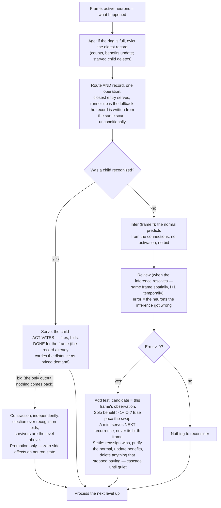

# Universal Compression with Actions and Rewards (UCAR)

UCAR is the design for a machine that compresses observed events by forming a dynamic hierarchical dictionary
of patterns, and learns the best actions to take by observing rewards. Dictionary entries represent situations.

Like a Turing machine, the machine is defined by its alphabets:

- the **event alphabet** — the base event symbols it can observe (its input), and
- the **action alphabet** — the base action symbols it can execute (its output).

Above each base alphabet the machine forms dynamic symbols of its own — patterns — and every symbol, base or
pattern, event or action, is a **neuron**.

The machine runs in frames, and many neurons can be active in one frame. Each frame it reads its inputs: the
active base event neurons — what is happening right now — and the rewards for past actions. From the active
events it recognizes and activates higher-level event patterns, then outputs a set of actions. The actions
execute at the end of the frame and are active in the following frame, alongside that frame's inputs. The
machine learns the rewards of the actions it took for the events that were active. Observed events start with
default actions — that is the bootstrap — and once a default action's rewards are learned, the machine keeps
trying different actions while the rewards are negative.

Patterns are learned spatio-temporally: four types, one pattern-learning algorithm, distinguished only by the
time distance between a pattern and what it names:

- **Spatial event patterns** (d = 0) — events that co-occur.
- **Spatial action patterns** (d = 0) — actions that co-execute.
- **Temporal event patterns** (d > 0) — events that follow other events; they infer what happens next.
- **Temporal action patterns** (d < 0) — actions that precede other actions; they infer what actions led here.

The two hierarchies connect to each other, at every level. Event patterns and action patterns are active in
the same frames, so an action pattern's context can name event patterns — a high-level situation connected to
a high-level response, with the rewards learned on that connection. This is how a complex action sequence is
learned as the answer to a complex event sequence: each side compresses its sequence into one symbol, and a
single association joins them.

Recognition and execution run in opposite directions. Events compose bottom-up: base events activate patterns,
patterns activate higher patterns. Actions unfold top-down: selecting a high-level action pattern is a
commitment to perform it, and it expands into its constituent actions over the coming frames — at the time
distances its structure recorded — until base actions execute. The machine recognizes with one direction and
performs with the other.

Patterns are learned from inference failures. Before a neuron knows any patterns, it learns a **normal** by
observation, and infers with it. On the spatial axis the normal is the co-occurring neighborhood — what the
neuron expects around itself, which is also what it infers. On the temporal axes it is what follows the neuron
(events) or what precedes it (actions); those live on a different frame than the neuron itself, so the
learning lands one frame late. A pattern is created only where the normal keeps failing — and a recurring
pattern that pays for itself becomes a symbol one level up. Resolution shrinks going up by **contraction**:
the machine keeps only the fewest units that still reconstruct the level below.

Every structural decision a neuron makes is [one test](#the-one-test), evaluated exactly against the
[frames it remembers](#the-history) — and structure is only ever reconsidered in response to an **error**.
A neuron whose situations are all explained builds nothing and deletes nothing.

## The substrate

The alphabets are not given as bare symbol lists — they are declared as structure, and the declaration is part
of the machine's definition. The machine declares **channels**; each channel declares **dimensions** — event
dimensions and action dimensions; each dimension declares its resolution (its bucket count). A base symbol is
a dimension–bucket pair, so this declaration *is* the alphabet definition: the event dimensions spell out the
event alphabet, the action dimensions the action alphabet.

Every frame, each event dimension quantizes what was observed — if anything was — and each action dimension
carries the action executed at the end of the previous frame — if one was. And:

> **A neuron fires only when something happens: an event neuron on an observation, an action neuron on an
> execution. At most one neuron is active per dimension per frame; a dimension with nothing to report is
> silent.**

There is no declared rest value: a dimension where nothing is happening simply supplies no symbol. Whether a
0 pixel is a black event or nothing-to-see is the encoding's choice, made where the input is produced — the
machine only ever sees the symbols it is given. Silence is not a symbol to be stored — it is what the decoder
assumes for anything the file does not state. This buys three things at once:

- **Blank regions cost nothing.** No activations, no history, no dictionary, no compute — a neuron that is not
  active does not process the frame at all.
- **The neighborhood is a set.** Variable-size, containing only what is actually happening, which is what the
  [fit](#the-fit) needs and nothing more.
- **Absence still discriminates.** A pattern naming a ring of pixels is measurably wrong on a filled disk: the
  active neurons inside the ring are present-but-unnamed and the distance counts them. Offness carries
  information through the distance without ever costing storage.

A dimension where something always happens is simply always active; nothing below depends on sparsity — it
only profits from it.

A neuron's coordinate is `(dim_id, bucket_id)`; its channel is the channel owning that dimension.

**Identity is absolute.** A neuron is bound to its position, so the same shape appearing at two positions is two
different neighborhoods over two different neurons, learned independently. Nothing shares a shape across
positions the way a convolution shares a filter — a retinotopic layout cannot, and the design does not try to.
Each position pays for its own patterns out of its own [history](#the-history), so the redundancy is bounded by
what actually recurs there. Sharing structure across contexts is a concern of the temporal axis, not this one.

The machine's definition also declares which channels are neighbors of which — and may declare wider neighbor
sets for the first levels above the base, where the input's geometry is still meaningful (a growing
retinotopic radius, for example). The declaration is a **filter**, and it runs out where the declared geometry
runs out: **above the declared levels, every active neuron is a neighbor.** Receptive fields grow with depth
through composition. This is the only place topology enters the design, and the levels above it assume none.

### Rewards

A reward is an input, not a symbol: alongside the observations, a frame may carry reward for actions already
taken. Credit lands on the **apex active action** — the highest action pattern in control of its channel that
frame, falling back to the base action when nothing higher covers it. The apex is the unit that was actually
in control: a committed higher action holds the channel and suppresses its constituents, so crediting the base
would reward suppressed subordinates and calcify primitive-level policy. Value accrues at the same granularity
as structure — selection happens over patterns, so reward must land on patterns to be seen. Before any action
pattern exists the apex is the base action itself, so the same rule holds across all of development.

How a reward distributes over *time* is a separable policy ([global-rewards.md](global-rewards.md)): the
current policy credits the apex actions of the immediately preceding frame; the planned generalization
distributes each reward across the apex actions of the preceding span, weighted by linear decay — linear
rather than exponential so distant antecedents keep nonzero credit under long-latency reward.

## The unit: a neuron and its neighborhood

A neuron's **neighborhood** is the set of active neurons its level admits: the active neurons in its declared
neighbor channels while a filter is declared, every active neuron above that. A spatial pattern is a **named
neighborhood**: the neuron looks around and reports what it sees upward.

**Context and inference, named precisely.** A neuron recognizes with a **recognition context** — its normal
or one of its children — and predicts through its **inference connections**. On the temporal axis the two are
different sets: the context is what the situation looked like; the inferences are what follows (events) or
what precedes (actions). On the spatial axis they are the same set — the normal context and the inference
connections both range over the co-occurring neighbors — and this document says **neighborhood** wherever
that one spatial set is meant.

**One mechanism for all four pattern types.** A neuron holds a normal and children, keeps a FIFO history of
the frames it was active for, routes each frame to the closest entry, and creates or deletes children by the
one test — error-triggered, swap included, margins maintained by events. None of it needs the context and the
inference to be the same set; it needs only a distance and a storage cost. The sections below specify that
general mechanism, with the spatial event case as the running concrete example and the temporal differences —
the two statistic tables, the one-frame-late review — called out where they occur.

**Channels gate eligibility, nothing else.** Two children of the same neuron may name overlapping but different
channel sets — `{A, B, C}` and `{B, C, D}` are just two sets. No mechanism below ever needs to know which
channel a neuron belongs to; the declared neighbor graph decides who *can* appear in a neighborhood — where a
filter is declared at all — and the [fit](#the-fit) does the rest without channel structure.

**One neighborhood per neuron per frame**, and **at most one child fires per neuron per frame**. If a neuron
could activate several children, each channel would carry several active units, those would all become neighbors
one level up, and the count would square at every level.

## The fit

An entry's definition names a set; the neuron observed a set. The distance between them is the symmetric
difference:

```
d(O, C) = |O △ C|   =   neurons present that C does not name
                      + neurons C names that are not present
```

This is not a separate notion invented for matching — it is literally the corrections that would follow this
activation in the file. The service cost and the match distance are the same number. It is also channel-free:
it never asks which channel a neuron belongs to, which is what makes variable-channel children unproblematic.

## The base model: what a neuron expects

Before any pattern exists, a neuron learns its context and inferences, and it gets them by counting. 
The counters are its **connections**, and they are governed by one rule that must always hold:

> **The connection counts are the sufficient statistics of exactly the frames the normal currently serves,
> within the history.**

Every event that changes *which frames the normal serves* moves counts, in both directions: the normal serves a
frame → its neighborhood's counts increment; a normal-served record leaves the history → decrement; a new child
captures remembered frames from the normal → decrement; a deleted child's frames fall back onto the normal →
increment. Nothing else touches the counts. **A neuron updates its connections only on frames where no child
fired** — a neuron either infers from its own connections or delegates to a child, so every frame is explained
by exactly one of them and neither learns from the other's frames.

The neuron infers with the counts as the distribution they are — per neighbor, how often it was present on the
frames the normal served — and never collapses them into a single joint expectation for *inference*. What the
counters cannot do is hold a joint at all: they record that the left neighbor is usually on and the right
neighbor is usually on, but never that they are on *together*. That gap is what patterns exist to fill:

```
creation  → connections → child patterns
```

Connections cost nothing in the file: they are tallies over the remembered frames, recomputable by any reader ([the cost](#the-cost-it-is-all-one-file)). 
What separates them from patterns is that their count is capped at the neighbor set's size and stops growing, while a neuron's children have no such ceiling.

**Cold start is silence.** A neuron with no neighbors seen yet has no connections and infers nothing. That is
the initial case, not an error.

### The normal

The **normal** is the connection counts resolved to a single set — the element-wise majority:

```
normal = { n : 2 · count(n) > served }
```

where `served` is the number of normal-served records in the history. A neuron is in the normal iff it was
present in more than half of the frames the normal serves. This is the storage-free entry: it has no pattern
neuron, it never propagates, and it is never deleted — it is a tally over the remembered frames, recomputable
from the file, so there is nothing to pay for ([the cost](#the-cost-it-is-all-one-file)). It competes for
frames like any other entry and appears in the history like any other server. Before a
neuron has any child, it is the only candidate.

The normal is **not** a frozen first observation. It is recomputed as the counts move — and it *sharpens as
children are created*: every child that takes a cluster of frames away subtracts that cluster's counts, so the
normal converges on the genuinely typical neighborhood instead of a blur of everything the children have not
yet claimed. A moved normal changes distances, so remembered frames may change hands between it and the
children — [settlement](#settlement) handles this exactly.

A neuron whose world is genuinely stable serves from its normal forever and creates nothing.

## The history

A neuron remembers a fixed number of frames it was active for — its **horizon**, measured in its own
activations, not in absolute time. **There are no frame numbers anywhere in the history and nothing needs
them**: benefit is a sum over records, cost is a count of stored neurons, and the only role time ever played
was eviction order, which a FIFO provides by construction. This also makes the one test uniform across neurons
under sparse activation: a busy neuron and a rarely-active neuron judge over the same amount of *evidence*,
not the same amount of someone else's clock.

Each record is:

```
(O, server, best_distance, fallback, fallback_distance)
```

— the context observed (spatially, the neighborhood), the entry that served it, that entry's distance, the
runner-up entry, and the runner-up's distance. Records with the same context have identical distances to
every entry, so the storage is a **histogram** — distinct contexts with a count and one shared assignment —
plus a FIFO ring of references in arrival order for eviction.

On the temporal axis the record completes **one frame late**: the context is written at `f`, the outcome when
it arrives at `f+1`. Each temporal entry keeps two statistic tables — context-side counts (what the situation
looked like) and outcome-side counts (what followed) — and both move together whenever a record changes hands
between entries. A bookkeeping delay, not a structural difference: the ring, the histogram, and every test
below read the same on both axes.

**Aging is one-out-one-in.** Once the ring is full, recording this frame evicts exactly the oldest record —
"age before add" is the data structure, not a rule to remember. Eviction has consequences
([deletion](#deletion)). A neuron's evidence is exactly the frames it was active for — recording is
unconditional, and no election outcome ever edits a history ([the frame](#the-frame-step-by-step)).

**Why the fallback is stored.** The delete test asks what an entry's frames would cost without it, and the
answer is the fallback. Storing it (and its distance) is what lets every entry's benefit be maintained as a
**running benefit**, updated only by events — so no test ever scans.

**It has to be the frames, not a summary.** A running error total cannot answer what deletion asks: when an
entry goes, its frames fall to their fallbacks, and the *new* runner-up for those frames must be recomputed
from the frames themselves. Keeping them is what makes every decision exact rather than estimated.

**The trade this makes, stated honestly:** wall-clock staleness is unbounded. A neuron dormant for a million
frames wakes with its old model fully intact. That is the intended bet — absence of evidence is not evidence
the structure died, and if the world did change while the neuron slept, the errors start arriving immediately
and restructuring proceeds at the pace of new evidence, which is the only pace a neuron can honestly claim to
know anything at.

The horizon — the history's capacity — is the design's **only free parameter**.

## The routing table is a facility location problem

**The plain problem.** Customers are spread over a map. You may open warehouses. Opening one costs a fixed
amount; serving a customer costs in proportion to how far it is from the warehouse serving it. Minimize the
sum. Open too few and customers are served from far away; open too many and you pay to open them.

**The mapping is direct:**

| Facility location | Here |
|---|---|
| A customer, i.e. one unit of demand | One record in the [history](#the-history) |
| A facility | A child |
| Opening a facility | Creating a child, and the pattern neuron it mints one level up |
| Opening cost | `1 + |C|` — the neuron created, plus the definition stored |
| Serving a customer from a facility | Describing that frame's neighborhood through that child |
| Service cost, i.e. distance | The [fit](#the-fit) — the neurons the child got wrong |
| The assignment of customers to facilities | The routing — closest entry serves |

The opening cost is not a tax bolted on — if opening were free you would put a warehouse on top of every
customer: perfect service, zero distance, one facility per frame ever seen. It is the only thing standing
between the design and memorizing every frame.

The local search over this problem has exactly three moves, and each appears below as an exact test against
the history:

- **Add** — open a child at this frame's observation ([creating a child](#creating-a-child)).
- **Delete** — close a child whose benefit no longer covers its storage ([deletion](#deletion)).
- **Swap** — open one and close one, priced jointly ([the swap](#the-swap)). Without it, the search can lock:
  two mediocre children can jointly block the one good one, with no single add or delete able to fix it.

**Move**, the fourth classical operation, lives entirely on the normal: it is recomputed from its counts, so it
shifts the moment its demand does. Children never move — a child's definition is frozen at mint, and
consolidation happens through swaps, not drift. **Split** and **merge** need no machinery of their own: split
is what add does to an overloaded entry's demand, merge is what swap does to redundant entries.

## The one test

There is exactly one structural rule in the design:

> **An entry earns its place when the errors it removes from the history exceed what it costs to store.**

Both halves are counts of neurons, and both are read off the history:

```
cost(e)     =  1 + |C(e)|
benefit(e)  =  Σ over the records e serves:  (fallback_distance − best_distance) · count
```

Benefit is maintained as a **running benefit** per child. It changes only on events — the child gains a
record, loses a record to eviction, or an entry appears, disappears, or moves nearby — so the delete test is
O(1) per event and no test ever scans the history.

To keep the words unambiguous: **benefit** is the sum above, **cost** is `1 + |C(e)|`, and **margin** always
means `benefit − cost`. The rule is strict on both sides: an entry is **added** only when its margin is
strictly positive, and **deleted** only when its margin is strictly negative. At exact equality nothing
happens — an existing entry is kept, a candidate is rejected — so the boundary can never flip-flop.

**Stability is a potential argument.** Every committed structural change — add, swap, delete — strictly
decreases the file length `L` over the horizon, by the strict-margin rule above. `L` is a non-negative
integer, so cascades terminate, nothing oscillates, and no entry can churn. This replaces any need for
thresholds, probation periods, or hysteresis.

## The frame, step by step

Two processes run over the same frame, and they are **independent**. The neuron's own pipeline — route and
record, serve, infer, review, reconsider structure — reads and writes only the neuron's own state, and depends
on nothing the election decides. Contraction reads the level's recognition bids and decides only what is represented
above; it has **zero side effects on neuron state**. Creation still follows the review rather than
participating in recognition — that ordering is forced by the temporal axis, where recognition happens at frame
`f` but the error is only known at `f+1`, so a new child can never bid in the election that judged the frame
that created it.

For an active neuron with observed neighborhood `O`:

1. **Age.** If the history ring is full, evict the oldest record. Its histogram count decrements; if the normal
   served it, its neighborhood leaves the connection counts; if a child served it, that child's benefit drops —
   and a child whose benefit falls strictly below its cost is deleted now ([deletion](#deletion)).
2. **Route and record** — one operation. The closest entry serves — the normal and every child compete by
   `d(O, ·)`, ties to the older entry; the best and the runner-up come out of the same scan, and the record
   `(O, server, best_distance, fallback, fallback_distance)` is written down right there. Every active neuron
   records, unconditionally — a neuron's evidence is the frames it was active for, full stop; no election
   outcome ever edits a history. If the normal serves, fold `O` into the connection counts.
3. **Serve.** If a child was recognized, it **activates**: it fires, and the neuron hands the thalamus its
   **recognition bid** — an offer to represent its patch at the level above. **The neuron is done for the
   frame.** The record already carries the served distance as priced demand; nothing else on this path needs
   doing. The bid is the pipeline's only output to the election, and the election sends nothing back — only
   recognition bids exist; creation never bids ([contraction](#contraction-building-the-level-above)). If the
   normal serves, there is no activation and no bid — the neuron continues.
4. **Infer** — normal path only, at frame `f`. The neuron predicts its inference set from the connections,
   used as the per-neighbor distribution they are. On the spatial axis the inference is the neighborhood
   itself; on the temporal axis it is the vote for the frame ahead.
5. **Review** — when the inference resolves: the same frame spatially, frame `f+1` on the temporal axis. The
   error is the neurons the inference got wrong — spatially, the served distance.
6. **Add test and settle** — only on a nonzero error. The candidate is this frame's observation, exactly; if
   the solo test fails, price the swap. At most one add per frame. A passing test mints the child **now, for
   later**: it is installed in the routing table but fires for the first time on the next frame its
   neighborhood recurs — it never covers, propagates, or serves on its birth frame
   ([creating a child](#creating-a-child)). Then [settlement](#settlement) runs: reassignments, count
   subtraction, normal recomputation, benefit updates, and any deletes they trigger.

The early return at step 3 is the seam between the axes: everything before it happens at recognition time —
frame `f` on both axes — and everything after it happens when the inference resolves, which is the same frame
spatially and the next frame temporally. Recognition is the fast path: a settled neuron in a familiar world
runs steps 1–3 and exits; the histogram pass, the swap pricing, and settlement all live strictly behind "the
normal erred," which is the rare case by design.

Meanwhile — before, after, or alongside; the pipeline cannot tell — contraction runs its election over the
level's bids and promotes the survivors to the level above. Subsumption is purely a statement about
representation: a covered neuron is spoken for *up there*, this frame; nothing about it changes *down here*.
Because no write ever depends on the election, there is no pending state, no retraction, and no
covered-or-not branch — the entire transaction protocol this document once needed is gone, not fixed.

## Creating a child

**The trigger is an error, nothing else.** No background process proposes candidates and no accumulator waits
to fire. The neuron served from its normal, inferred, and the inference was wrong — that error is the only
moment structure is considered, on the spatial axis in the same frame, on the temporal axis when the actuals
arrive. The error is the neuron's own — the served distance, read off its own routing; no election outcome
enters into it. A neighborhood the connections already predict costs nothing to serve no matter how often it
recurs; surprise is the size of the bill, not a gate on it.

**Creation happens after recognition, never inside it.** A new child is minted after the review and fires for
the first time on the next frame its neighborhood recurs. It does not serve, cover, or propagate on its birth
frame — that frame was already encoded, corrections and all. This is forced by axis uniformity (on the event
axis the error arrives a frame after the election it would have needed to bid in, so same-frame creation is
impossible there) and it is the founding criterion enforced at the finest grain: **structure never pays off on
the evidence that created it, only on recurrence.** Nothing compresses at first exposure. It also keeps the
election single-purpose — recognition bids only — with no birth-frame special cases: no newborn subsuming
neurons it hasn't earned, no newborn processed mid-cascade at its own level.

**The candidate is the observation.** `C = O`, exactly. Whenever that neighborhood recurs, the child serves it
at zero error — a child can never be created unable to serve the demand that justified it; it just serves it
starting next time. **A candidate rejected today is not lost.** Every future error offers a new candidate —
its own observation — so the neuron samples candidate positions from its own demand. A cluster worth a child
will sooner or later present a frame near its middle, and that candidate passes where an off-center one
failed; the [swap](#the-swap) then retires the off-center early mint.

**The solo test.** Would a child at `O` pay for its storage?

```
benefit  =  Σ over histogram entries e with d(e.O, O) < e.best_distance:
                (e.best_distance − d(e.O, O)) · e.count     // the records it would win
commit iff  benefit > 1 + |O|
```

There is no special term for the triggering frame: it was recorded in step 2, so it sits in the histogram as a
normal-served entry at distance `error`, and the candidate wins it at distance 0 like any other record. One
pass over the histogram — never more distinct neighborhoods than the horizon holds. Note the records it wins
may include frames currently served *badly by children*, not only by the normal: an add repairs whatever
demand it sits closest to.

### The swap

If the solo test fails, the candidate gets one more chance, jointly with a deletion. Take the child `X` whose
served records `C` would win the most of (the overlap is visible in the solo pass; in practice one or two
children qualify), and price the joint move `{add C, delete X}` exactly. Examining only the most-overlapped
child is a **heuristic**, not an exhaustive search over one-for-one swaps — in principle a barely-overlapping
child with a large storage refund could be the better joint move. Overlap is where the money almost always is,
and the exact variant (price the swap against every child) stays affordable if diagnostics ever justify it,
since the test only runs on a normal-served error:

```
Δ =   Σ over X's records:  cost served by X  −  cost served by best of (surviving entries + C)
   +  Σ over records NOT served by X that C wins:  (best_distance − d) · count
   +  (1 + |C(X)|)          // X's storage refunded
   −  (1 + |C|)             // C's storage charged
commit iff  Δ > 0
```

The two sums are over **disjoint** record sets — the first reprices everything `X` served, the second counts
`C`'s gains everywhere else — so no improvement is ever counted twice.

The normal is priced **frozen** where it currently stands. That is conservative: the recomputation
afterward only improves things, so a positive frozen score understates the realized gain and is always safe to
commit.

**Why the swap is necessary.** Two off-center children can each serve half of a cluster whose true center
would serve all of it: the center's solo add gains too little (each frame improves only slightly), and neither
incumbent fails its delete test while the other stands. Locked — forever, under add and delete alone. The swap
prices "center in, one incumbent out" as a single move; it pays, commits, and the second incumbent then fails
the ordinary delete test and follows. This is how early one-shot structure consolidates into fewer, better
entries as exposure accumulates.

**What the child is, at birth.** The pattern **inherits its parent's channel** and mints **one level above its
parent's level** — both are what the `1 + |O|` paid for. It is **created with no connections**: its connections
belong to its own level, which has not been observed at the moment of creation; it learns them there by
ordinary counting. The temporal case is the same rule one frame over: a new temporal pattern's inference
connections are empty until the next frame arrives, and it learns them then. Its definition is **frozen at
mint** — the normal is the entry that tracks the data; children are consolidated by swaps, not by drifting. Its own structure — those connections, children of its
own — is judged by its own tests at its own level. A neuron's *existence* is decided by its parent; a neuron's
*structure* is decided by itself.

*(A measured optimization, deliberately not part of the design: if diagnostics ever show families of
near-duplicate children each serving a slice of one noisy cluster, a second candidate — the element-wise
majority of the frames `O` would win — can be priced alongside `O` for one extra counting pass. Ship without
it.)*

## Deletion

An entry dies the moment its benefit no longer covers its storage — and that moment is only ever caused by an
event, so **there is no delete scan**. Exactly two kinds of event can push a margin negative:

1. **Eviction** (frame step 1). Served records leave the history one at a time as demand drifts; the margin
   slides; when benefit falls strictly below cost, the child is starved and deleted. Without this, entries whose
   demand vanished would live forever.
2. **Settlement** (frame step 6). A committed add or swap either takes records from a child directly, or
   plants a closer fallback under records it keeps — **fallback collapse**: the child still serves its frames,
   but the error it spares shrank because the frames now have somewhere better to fall.

**Deleting a child, exactly:** its definition leaves the routing table and the pattern neuron one level up
is released. Each record it *served* reassigns to its stored fallback (now its best), and a fresh fallback for
those records is computed against the surviving entries. Each record where the dead child was the *fallback*
keeps its server but recomputes its fallback, and that server's margin updates. Records landing on the normal
rejoin the connection counts, and the normal recomputes. **Deletions are sequential** — one at a time,
re-checking margins after each — because two children covering the same demand each look redundant while the
other stands. Every deletion strictly shortens the file, so cascades settle.

Nothing irreplaceable dies. The evidence lives in the history, not in the entry — if the same definition is
justified again, the add test rebuilds it from the same frames.

## Settlement

What follows a committed add or swap, in order — each step exact against the history:

1. **The won records change hands.** For each histogram entry the new child `C` wins: the old server's margin
   drops by the gap it was earning; the old server becomes the entry's fallback (the previous best is by
   construction the new runner-up); `server = C`, distances update; `C`'s margin gains the new gap.
2. **Fallback collapse propagates.** For each entry `C` did *not* win but where `C` is closer than the stored
   fallback: the fallback is replaced and the server's margin adjusts by the change in the gap.
3. **The normal purifies.** Records captured from the normal leave the connection counts. The normal
   recomputes; if it moved, distances to it changed — server and fallback re-derive for the remembered
   records (the histogram is bounded by the horizon), and any handoffs move counts again.
4. **Margins that went negative trigger deletion**, sequentially, cascading as needed.

Every step strictly decreases `L`, so settlement terminates. Its work is bounded by the histogram size, which
is bounded by the horizon.

## The cost: it is all one file

Take the whole run and write it as a single file a decoder could read back to reproduce every frame exactly.
The file has two parts:

1. **The dictionary.** For each neuron, the definition of each of its children — the lower-level symbols the
   child names. The connections are not here: they are tallies the reader recounts from the frames below.
2. **The frames.** For each frame, its apex neurons, followed by whatever those apex neurons got wrong about
   the level below them. Anything unstated is silence.

Every cost in this design is a part of that file, counted in neurons — one symbol is one neuron:

```
activating an apex neuron  =  1                             a line in the frames
the errors it made         =  the neurons it got wrong      the corrections after it
having a child             =  1 + |definition|              a line in the dictionary
```

This is a **fixed-length code**: every neuron costs one symbol regardless of how often it is used. Pricing
symbols by actual occurrence is a variable-length code over the same file, an experiment rather than the
design — see [forgetting.md](forgetting.md).

**The horizon is what makes the two parts comparable.** The dictionary is written once; the frames are written
over and over. Over one horizon — for each neuron, the activations its history holds — the file length is:

```
L  =  Σ over entries (1 + |definition|)             written once
   +  Σ over remembered frames (1 + errors)         written every frame
```

and the one test is nothing more than the derivative of this: an entry belongs in `L` when removing it would
lengthen the file more than deleting its line would shorten it. **Nothing is amortized and nothing is
estimated** — the neuron holds the frames, so it evaluates the sum.

`L` is the cost of encoding the remembered window under the current dictionary. 
The delete test reprices frames that went out the door long ago, under entries that did not exist when they were emitted.
Past emissions are sunk; the window is the pricing model. 
A structural move is judged by the window it leaves behind, not by the frames it missed.
A child minted this frame is credited for the triggering frame through that frame's record (reassigned to it in settlement), even though the emitted frame itself carried the corrections.

**Where the connections sit in this accounting.** 
The dictionary pays for one thing per child: the list of lower-level symbols it stands for, written once when the child is created.
That list must be written, because nothing else in the file says it — it was chosen from frames that have since been forgotten, and no reader could reconstruct it.
The synapses (the normal context and connections) are a different kind of thing: they are tallies over the remembered frames, and the remembered frames are already in the file.
A reader could recount them from what is written, and anything recountable from the file adds nothing to its length.
This is how every adaptive compressor works: it never transmits its count tables, because the receiver rebuilds the same tables from the data as it decodes.
So the dividing line is simple: **the file contains exactly what cannot be recomputed from it.**
What a symbol is made of cannot be recomputed — it costs one line plus the symbols it names.
What a symbol would infer can be recomputed — it is free.
Storage-free for the normal means exactly this: the normal is a running tally of the file's own contents, and a tally of what is already written carries no new information.

**A short horizon overfits.** With too few frames in view, a neuron builds structure for coincidences that
have not proven themselves beyond the window. There is no smoothing to hide behind, so sensitivity to the
horizon should be expected to be sharp, and measured early.

**What shrinking the file looks like.** The frame part dominates, because it is written every frame.
Shortening it means fewer apex neurons per frame: 784 names on a 28×28 input if nothing compressed, 200 if
level 1 covers the frame with 200 apex units, 50 if level 2 covers it with 50. But the frame part alone has a
degenerate optimum — memorize each frame as one top-level pattern — which the dictionary term prevents:
784 → 200 → 50 is a win only when the patterns that achieved it recur across many frames.

**Every decision is local.** Each neuron evaluates `L` over its own neighborhood only. Local evaluations gate
local decisions cheaply and in parallel; contraction stops the redundancy from multiplying up the levels. The
global quantity is measured directly rather than summed: **apex neurons per level per frame, and the
dictionary size that bought them.** That pair is the standing metric — and under this design it should *fall
with exposure* on recurring data: early structure is provisional, swaps consolidate it, the normal purifies,
and a single frame can never out-bid the opening cost on its own.

## Contraction: building the level above

A neuron firing a child is not yet compression. If 49 active neurons all fire children, level 1 has 49 active
units and nothing has shrunk. **Contraction is the thalamus choosing, each frame, the fewest units at the
level above that reconstruct the active neurons below.** It runs between levels during spatial processing:
level 0 is processed, contraction decides what propagates to level 1, level 1 is processed, and so on. Nothing
it decides persists — it is this frame's grouping, recomputed next frame.

Only **active** neurons need accounting for; a silent dimension is unstated and costs nothing to leave
uncovered.

**Recognition bids only.** The election's input is one **recognition bid** per neuron whose routing chose a
child: the active neurons that child's definition names correctly this frame, the bidder included. The
definition names only the neighborhood; the bidder itself is implied, because a child *is* its parent in
that neighborhood — the entry lives in the parent's routing table, so expanding the unit recovers the parent
along with the neighbors it names. A neuron that served from its normal makes no bid; it can be covered by a
neighbor's bid but never propagates one of its own. **Creation never bids.** A child minted this frame (step 6)
does not exist for this frame's election — it first competes at its next recognition. This is what keeps the
two axes identical: on the temporal axis the error arrives one frame after the election it would have needed to
bid in, so same-frame creation bids are impossible there, and the spatial axis does not exploit the
coincidence that its inference resolves in-frame.

**The election decides promotion — and nothing else.** Routing decided who serves; the election decides what
is *represented above*, and it has **zero side effects on neuron state**. A child that matched but whose bid
loses still serves its frame in the history — the neuron simply is not represented at the level above and
stands as a correction at this one. A neuron covered by a neighbor's winning bid is **subsumed**: spoken for
at the level above this frame — and that is the whole of it. It still records its frame, learns, and runs its
tests exactly as if the election had gone the other way. Subsumption is a fact about the level above, never
about the neuron's evidence. (The cost of this independence, accepted deliberately: a neuron that is reliably
covered can still mint a child from its own local demand, and that child may rarely win elections yet stay
paid-for locally — see [risks](#risks).)

**A bid's price.** If the definition names neurons that are **not** active this frame, the decoder
expanding the unit would assert them, and corrections must turn them off. So a bid's cost is `1 + f`, where
`f` is its named-but-absent count this frame — not a flat 1. Routing keeps `f` small (the closest entry
served), but it must be charged, or a large sloppy pattern looks artificially cheap.

**The objective.** The thalamus accepts a subset of the bids. Each accepted bid propagates one unit upward at
its cost `1 + f`. Every active neuron not covered by an accepted bid is a correction — stated as itself, at
cost 1. The thalamus minimizes `Σ accepted (1 + f) + corrections`. This is prize-collecting set cover, in the
same currency as everything else, restricted to one frame.

**The election, in detail.** Set cover is NP-hard, but contraction mints nothing that lasts — a grouping a few
units short of optimal costs a few extra symbols on one frame and is gone the next — so it is settled by a
cheap election:

- **Voters** are every active neuron named by at least one bid, including neurons that made no bid themselves.
  Voters are walked in sorted id order and bids in a fixed order, so the outcome is independent of dispatch
  order. Active neurons no bid names are corrections from the start and never vote.
- **The ranking rule**: among a pool of bids, the best is the one covering the most neurons this frame; ties
  go to the **older pattern id**. Ranking is a total, deterministic order, so no vote can ever flip-flop on a
  tie.
- **Rounds**: (1) compute the **survivors** — bids whose current voters outweigh their price, `k ≥ 2 + f`
  (covering `k` at cost `1 + f` changes the total by `1 + f − k`; for a clean bid this is the familiar "two
  or more" — the threshold is derived, not chosen). On the first pass nobody has voted, so there are no
  survivors yet. (2) Each voter looks at the bids naming it: if any survived, it elects the best *among the
  survivors* — herding onto coverage already paid for; if none survived, it elects the best among *all* of
  them again — which means a dropped bid can be **resurrected** when enough orphaned voters re-converge on
  it. (3) Repeat until a full pass changes no vote, with a round cap at the bid count as a backstop —
  resurrection makes the objective's descent non-strict in pathological cases, and a per-frame throwaway
  grouping slightly short of optimal is acceptable.
- **Outcome**: the final survivors are promoted, one unit each at the level above; their covered neurons are
  subsumed. Voters whose final pick did not survive, and actives covered by nothing, are the corrections.

The election runs sequentially in the thalamus; the instance is small — bids only interact within about two
grid hops — and settles in a handful of rounds. The older-id tiebreak does double duty: deterministic outcomes
(a recurring input yields a recurring group for the level above to latch onto), and steady pressure toward
established patterns over interchangeable new ones.

**What this builds.** Each surviving bid contributes one unit to the level above. Adjacency there is the
substrate's rule for that level: the declared filter while the input's geometry is still declared, **all
active neurons** beyond it. A pattern can never name past its own neighborhood, and receptive fields grow by
composition. The reduction is set by the data, not the topology: a frame the patterns predict well collapses
hard; a frame full of surprise barely collapses at all, which is the honest thing for it to do.

## Estimation

**No probability sets a cost.** Distance is a count of neurons, cost is a count of neurons, savings is a count
of neurons — the pricing never leaves whole numbers, so no estimator, smoothing, or boundary correction is
needed. The only frequencies in the design are the connection counts, and they are used raw: the majority rule
only has to pick members, not price them. A new child's definition is the exact observation that created
it, so it serves that observation with zero error from its first frame.

Estimators return only in [forgetting.md](forgetting.md), where the file is re-priced by how often each neuron
occurs — the one variable-length code in which probabilities set costs.

## One frame, in order



## Implementation

The per-neuron state and methods, the staged build plan — spatial event processing, then temporal event
processing, then actions and rewards — and the deltas against the current code live in
[algorithm-implementation.md](algorithm-implementation.md).

## Risks

- **The readout is unvalidated.** Compressing harder can produce a worse classifier, because a readout can be
  living on exactly the position-and-class-specific duplicates that compression deletes. The readout gate in
  [algorithm-implementation.md](algorithm-implementation.md) is the check.
- **Horizon sensitivity is sharp.** Every decision is exact with respect to the horizon and blind beyond it; there
  is no smoothing anywhere. Too small and neurons build structure for coincidences; too large and they are
  slow to follow a drifting source. Measure early.
- **Cold-start churn.** With a nearly-empty history, early tests are decided by very little evidence and
  children may be created and deleted in bursts. The error-only trigger and the strict-margin rule bound this
  — every commit still shortens the file that exists — but measure churn over the first thousand frames rather
  than settled counts.
- **Redundant, never-promoted children.** Evidence is independent of the election, so a neuron reliably
  covered by a neighbor's unit still mints children from its own local error demand — and those children may
  rarely win elections yet stay paid-for by their local benefit. Accepted deliberately: it is the same local
  double-witnessing the design accepts everywhere ("the same base event is witnessed by every neuron whose
  neighborhood contains it"), contraction keeps it out of the frame part, the standing metric (dictionary size
  against apex reduction) makes it visible, and the variable-length track in
  [forgetting.md](forgetting.md) is the principled reaper for symbols that exist but never earn use.
- **Child-served error mass is invisible to the add test.** The add test triggers only on normal-served
  errors, so a cluster captured by a child but served badly is repaired only when a nearby normal-served error
  offers a candidate that wins those frames, or when the child starves. Watch persistent child-served error in
  diagnostics; if it accumulates, the trigger may need to widen to any served error.
- **Medoid-only candidates.** Children are always observed frames, never synthesized centers, so incoherent
  per-frame noise on a recurring core can produce families of near-duplicate children. The swap consolidates
  them over exposure; if diagnostics still show the pattern, the one-step majority candidate (noted under
  [creating a child](#creating-a-child)) is the measured remedy.
- **Dormant staleness.** Neuron-relative time means a long-dormant neuron wakes with its old model intact. If
  the world changed meanwhile, it must first accumulate errors before restructuring. Accepted as the right
  default; worth remembering when reading diagnostics after distribution shifts.

## Open questions

- **Context space beyond the small case.** Eight binary neighbors is 256 possible neighborhoods — finite
  and countable, and sparsity shrinks it further in practice. Radius 2 and richer alphabets multiply it. The
  histogram bounds what is *remembered* at the horizon, but what bounds the number of *distinct* contexts worth
  remembering when the space is large?
- **Context space at higher levels.** Above level 0 the neighbors are patterns, and the per-channel
  alphabet grows as patterns are created. At-most-one-active per neuron holds each channel to a single state,
  but the space still expands with the structure. Above the declared filter levels, every active neuron is a
  neighbor, so `|O|` is the level's whole active count: minting throttles itself there — a candidate is
  charged `1 + |O|`, so wide neighborhoods make children expensive exactly where they are uninformative — but
  routing still prices every child against a large `O` each frame. What bounds the child count, and the
  routing cost it drives, is the open measurement.
- **Parallelism.** The per-neuron passes are independent across neurons and could run at once. Contraction's
  election is sequential and deliberately so — small enough to settle in a handful of rounds — but on much
  larger inputs than MNIST that judgement would need revisiting.
- **One context, several outcomes (temporal).** Spatially the demand point fully specifies the child: the
  neighborhood is both the match and the prediction. Temporally the demand point is a (context, outcome)
  pair, and two frames sharing a context but differing in outcome cannot both be served by a context-keyed
  child. The economics degrades gracefully — the normal predicts the dominant outcome, eats the error on the
  rest, and the test creates children until whatever genuinely distinguishes the contexts is found; what
  remains after that is irreducible uncertainty, which no model removes. Whether the temporal axis needs more
  than this — a tiebreak among same-context children, or a child carrying several outcomes — is the open
  decision.
