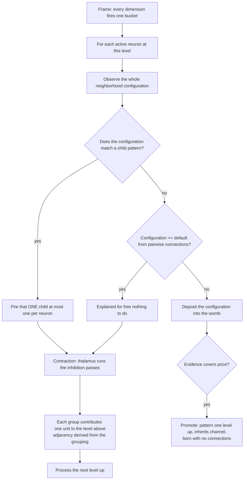

# Universal Compression with Actions and Rewards (UCAR)

UCAR is the design for the full pattern lifecycle: recognition of existing patterns, creation of new ones, and
their refinement after birth. The substrate is an online compression engine whose dictionary entries are
situations — "universal" in the sense that nothing in it assumes a particular source.

The structural unit is the **neighborhood configuration**. A neuron looks at its whole neighborhood, and a
recurring configuration that pays for itself is promoted to a pattern one level up. Resolution shrinks going up
by **contraction**: neighbors inhibit each other so only a spread-out subset propagates upward.

This document specifies the spatial axis (`d = 0`, same frame). The event axis (`d > 0`) and action axis (`d < 0`) 
are [open ports](#temporal-the-open-port).

## The substrate

The encoder declares **channels**; each channel declares **dimensions**; each dimension declares a resolution
(its bucket count). Every frame, every declared dimension quantizes its input to exactly one bucket, so:

> **Exactly one neuron is active per dimension per frame.**

A neuron's coordinate is `(dim_id, bucket_id)`; its channel is the channel owning that dimension. 
The "off" state of a binary pixel is its bucket-0 neuron firing, not an absence.

The encoder also declares which channels are neighbors of which. This declaration is for base level only. 
Neighborhood is detected dynamically in higher levels. Receptive fields grow with depth through composition. 
This is the only place topology enters the design.

## The unit: a neuron and its neighborhood

A neuron's **context is its entire neighborhood** — the active neurons of its declared neighbor channels. A
spatial pattern is a **named shape**: the neuron looks around and reports what it sees upward.

**One configuration per neuron per frame.** The neighborhood is an assignment, so at any frame a neuron sees
exactly one configuration. At radius 1 with binary channels there are 2⁸ = 256 possible configurations — a
finite, small space.

**At most one child fires per neuron per frame.** A neuron's configuration selects at most one pattern. This is
load-bearing. If a neuron could activate several children, each channel would carry several active units, those
would all become neighbors one level up, and the count would square at every level. One active unit per neuron
preserves the "one active per channel" invariant all the way up.

## The base model: what a neuron expects

Before any pattern exists, a neuron already has a cheap expectation about each neighbor, and it gets it by
counting.

Every frame the neuron is active, it notes which bucket each neighbor dimension is in and adds one to a counter.
Those counters are its **connections**. After enough frames they answer, for each neighbor dimension separately:
which bucket is that dimension usually in, on the frames where I am active? That answer is the neuron's
**default** for that neighbor.

A pixel neuron that is on will find, across the frames where it was on, that its left neighbor was on in most of
them. Its default for the left neighbor is "on". Taking the default for every neighbor at once gives the
**default configuration** — the neighborhood this neuron expects to see.

```
p(D = b | P) = strength(P → D_b) / Σ_b' strength(P → D_b')
default(D)   = argmax_b p(D = b | P)
```

**What makes it free is what it cannot do.** The counters are one number per neighbor bucket, so the base model
is bounded at `neighbor dimensions × buckets` and never grows with experience. And it stores each neighbor
separately: it records that the left neighbor is usually on and that the right neighbor is usually on, but never
that they are on *together*. It cannot represent a joint at all.

That gap is what patterns exist to fill, and it is why connections never compete with the dictionary — a pattern
is not a better version of the same thing, it is the only thing that can hold a configuration:

```
marginal  →  pairwise (connections, free)  →  configurations (patterns, priced)
```

## The demand signal

**A neuron fails when its observed configuration differs from its default configuration.** The default is what
the pairwise base model already explains for free; anything else is unexplained and is what the womb collects.
There is no threshold: a configuration equal to the default deposits nothing.

## Recognition

**A neuron fires the pattern its configuration matches.** This is a match, not an economic test. Matching is
partial — an observed configuration need not equal a stored one exactly, since the womb pools near
configurations and the same tolerance applies here.

At most one child fires; when several patterns match, the best match wins. On a fire, the pattern's statistics
strengthen — this is [refinement](#refinement).

## The womb: counting recurring configurations

Each neuron holds one womb, which accumulates statistics over the configurations the neuron has **failed** on
and promotes the ones that recur enough to pay for themselves.

At radius 1 binary, 256 configurations are possible and the default covers one, leaving 255 candidates. Minting
one pattern per candidate would be an explosion, but only a small subset recurs: for a neuron sitting on a "1",
vertical, horizontal and cross configurations recur far more than the rest. The womb keeps statistics on
observed configurations and promotes the ones that pay.

**The womb holds context only.** It does not cluster connections.

**Partial matching.** Two observed configurations differing in one position should often count as the same
candidate, or the womb degenerates into one entry per distinct configuration ever seen. This is a
facility-location problem: opening cost is the pattern's price, service cost is the extra bits to code a
configuration through a center that is not exactly it. Distance is measured **in bits**, not in count of
differing positions — a mismatch in a rare position matters more than one in a position that is almost always
the same. The exact merge rule is [open](#open-questions).

**Promotion.** When an accumulated configuration's evidence covers its price, it is promoted to a pattern, one
at a time.

## Price

A promoted configuration's price is what the neuron will actually store, in bits:

```
price = name_bits(|configuration|, alphabet) + log2(children(P) + 1)

name_bits(k, n) = log2( C(n, k) )  =  Σ_{i=0}^{k-1} log2( (n-i) / (k-i) )

alphabet    = max(neighbors ever witnessed, structural neighborhood cardinality)
children(P) = this neuron's current child count
```

The configuration is named as what it physically is — an unordered subset of the alphabet — rather than `k`
independent pointers, which would waste `log2(k!)` bits on order and overcharge dense configurations.

The alphabet is floored by the **structural** neighborhood cardinality. At cold start the witnessed set is tiny
and the first recurring configuration equals it exactly, which would name it for ~0 bits and mint for free;
flooring prices it against the positions the decoder already knows exist.

A crowded child table raises the price, so an experienced neuron demands more recurrences before adding structure.

## Birth

A promoted configuration becomes a pattern neuron **one level above the neuron's own level**.

- The pattern **inherits its parent's channel**. That channel then infers its neighbor channels at the higher
  level.
- Its trigger is the promoted configuration.
- **It is born with no connections.** Its connections belong to its own level, which has not been observed at
  the moment of birth. As the level above populates, the newborn learns its connections there by ordinary
  co-occurrence counting.
- It opens with the evidence that promoted it, which is what [forgetting.md](forgetting.md) charges against.

## Contraction: building the level above

A neuron firing a child is not yet compression. If all 49 neurons of a 7×7 grid fire a child, level 1 has 49
active units and nothing has been compressed. **Contraction is what makes the level above smaller than the level
below.**

Contraction runs **in the thalamus**, **dynamically between levels** during the level sweep: level 0 is
processed, contraction determines what propagates to level 1, level 1 is processed, and so on. It is this
frame's routing, recomputed each frame — patterns persist, owned by a channel; only which of them propagates
upward is decided here.

Each neuron carries an **activation strength**: how established the pattern it fired is. Contraction needs only
an ordering over neighbors, so what exactly that quantity is remains [open](#open-questions).

**The passes**, executed by the thalamus since these are cross-neuron comparisons:

1. **Survivors.** A neuron survives if its activation strength is the local maximum among its **immediate
   neighbors** — radius 1 only, never further. A survivor inhibits those neighbors.
2. **Coverage.** Among neurons that neither survived nor are adjacent to a survivor, take the local maxima of
   that remaining set; they survive too. Repeat until every neuron survives or touches a survivor.
3. **Groups.** Each inhibited neuron is absorbed by the adjacent survivor with the **highest activation
   strength**, ties broken by **neuron id**.

Nothing propagates. A survivor only ever inhibits its immediate neighbors, so a group is a survivor plus some of
its neighbors — **at most 9 cells**. The extra passes add survivors in uncovered areas; they never stretch an
existing group.

**The level above.** Each group contributes one unit. The adjacency at that level is **derived**: two units are
neighbors iff any of their members were neighbors below. The neighbor relation is declared once, at level 0, and
every level above computes its own.

**Termination is structural.** Because no two survivors can be adjacent, the survivor count is capped by the
maximum independent set of the grid — on 7×7 with 8-connectivity, every other row and column, i.e. 16:

```
49  →  ≤16  →  ≤4  →  1
```

The reduction is enforced by the topology, not by tuning and not by the data.

**Receptive fields grow by composition.** A level-1 unit covers its group; a level-2 unit covers a group of
groups. The declared radius stays 1 forever.

## Estimation

- **Model side: Krichevsky–Trofimov.** `p_c = (count + 1/2) / (n + 1)` — the minimax-regret universal estimator,
  derived rather than tuned. It keeps probabilities off the 0/1 boundary without an arbitrary cap.
- **Background side: raw MLE with the skip rule.** Background frequencies are plain counts over frames,
  unsmoothed. An outcome the background has never witnessed cannot be priced against it, so its term is skipped
  rather than smoothed into a finite surprise.

**The two must agree wherever they are compared.** Any test that admits a member to a pattern must use the same
estimate recognition will later apply to it, or a pattern can be born unable to fire on its own configuration.

## Refinement

On a fire, matched entries strengthen and absent entries dilute relatively as the trial count grows. This is an
online mode collapse: the stored configuration converges to the recurring core of the frames the pattern
actually fires on, so a shape whose boundary was drawn slightly wrong at birth converges to the right one
through ordinary fires. Low-share members are born low and fade, so no explicit prune rule is needed.

Connections carry no refinement — they are plain accumulated counts.

## One frame, in order



## The cost

Everything above is mechanism. This is what the mechanism is for.

**A frame is described by its apex neurons — the ones that are not inhibited.** What describing a frame costs is
the length of that list: 784 names on a 28×28 input if nothing compressed, 200 if level 1 covers the frame with
200 apex neurons, 50 if level 2 covers it with 50. **Shrinking that list, while still covering the frame, is the
goal.** Everything else in this document exists to make it shorter.

Shortening it is not free. A pattern is a stored list of members, and remembering that list costs about what
saying those members once costs — nine members remembered is about as expensive as nine names said. This is what
makes the two sides comparable: **both are counted in things you have to name**, one for each frame and one for
the dictionary that describes frames. They subtract directly.

So a pattern naming nine members costs about nine, once, and saves about eight every frame it fires.

Take the frame list alone as the objective and it has a degenerate optimum: memorize each frame as a single
top-level pattern. One apex neuron, full coverage, the shortest possible list — and a dictionary holding one entry
per frame ever seen, which is longer than the input it replaced. The target 784 → 200 → 50 is a win only when the
patterns that achieved it are **reused across many frames** rather than minted per frame.

Every structural decision is one question: does the move shorten the total, dictionary included?
**No similarity thresholds exist anywhere in the design.**

### The ledgers are local

Each neuron keeps its own ledger over its own neighborhood, so the sum of local ledgers is not the total — the
same base event is witnessed by every neuron whose neighborhood contains it. This is accepted: local ledgers gate
local decisions cheaply and in parallel. Contraction is what stops that local redundancy from multiplying up the
levels.

The global quantity is measured directly instead of summed: **apex neurons per level per frame, and the
dictionary size that bought them.** That pair is the standing metric for whether the design is working, and the
local ledgers are only a cheap parallel proxy for it.

### Two regulators

Storage is paid once and savings recur, so judging a pattern needs a period over which it is required to have
earned out. That period is the **horizon**, and it is specified in [forgetting.md](forgetting.md) along with the
rent that charges against it.

The two regulators act at different scales and neither substitutes for the other:

- **Price is local.** A pattern is named among the alternatives its own neuron offers, so its price scales with
  that neuron's child table, not with the size of the brain. A naive neuron mints cheaply — that is its
  exploration budget, not a leak.
- **Rent is global.** Total rent grows with every structure held, while total savings is bounded by how much
  structure the world actually contains. This is the only place the size of the whole system enters.

## Implementation plan

Each phase lands independently and is measured before the next. The headline metric is the objective itself:
**survivors per level per frame, paired with the dictionary size that bought them.** Alongside it: MNIST accuracy
(train and held-out), neuron counts per level, patterns per neuron, and wall-clock per frame.

**Phase 1 — the configuration loop at level 0.** Whole-neighborhood context; the default configuration from
pairwise connections; failure as "configuration ≠ default"; the per-neuron womb over configurations with partial
matching; promotion when evidence covers price; recognition as a configuration match with at most one child per
neuron. Capped at one level so the recursion is not a variable yet.

**Phase 2 — contraction.** The inhibition passes, groups, derived adjacency, and the level-above construction.
Measured by the per-level reduction factor and the depth at which it terminates; the prediction is
49 → ≤16 → ≤4 → 1.

**Phase 3 — the readout gate.** Once growth is bounded and depth settles, compare held-out accuracy against
what the level counts justify. Do not build past this phase if the answer is no.

Forgetting lands on its own track, specified and phased in [forgetting.md](forgetting.md).

## Risks

- **The readout is unvalidated.** Compressing harder can produce a *worse* classifier, because a Naive-Bayes
  readout can be living on exactly the position-and-class-specific duplicates that compression deletes. Phase 3
  is the gate.
- **Cold-start churn.** Tiny early alphabets mean near-zero prices, so a burst of cheap early patterns appears
  with nothing in this document to remove them. Measure churn in the first thousand frames, not just settled
  counts.
- **Dictionary redundancy.** Contraction shrinks the width of each level; it does not shrink the dictionary. The
  same shape is learned separately at every position.

## Open questions

- **The womb's merge rule.** Facility location with bits as the distance is settled; what actually merges versus
  stays separate is not. It decides whether the womb stays bounded.
- **Configuration space beyond the small case.** Eight binary neighbors is 256 configurations — finite and
  countable. Radius 2 is 2²⁴, and more buckets multiply it further. Exact-configuration counting is bounded
  precisely in the regime where it is least needed. What replaces it when the neighborhood is larger?
- **Configuration space at higher levels.** Above level 0 the neighbors are patterns, and the per-channel
  alphabet grows as patterns are promoted, so the configuration space is not fixed. One-active-per-neuron holds
  each channel to a single state, but the space still expands with the structure. What bounds the womb there?
- **Reuse.** Identity is keyed by absolute dimension, so nothing shares a shape across positions. Contraction
  fixes the width of each level, not the redundancy of the dictionary.
- **Activation strength.** What is a neuron's strength when it fired no pattern at all, and do zero-strength
  neurons participate in the inhibition passes or survive by default?
- **Parallelism.** The inhibition passes are cross-neuron comparisons and run in the thalamus. Whether they can
  be parallelised, or pushed into neurons given a shipped view of neighbor strengths, is undetermined.

## Still to write

Sections known to be missing or known to be placeholders, in the order they should be settled:

1. **The level transition.** Contraction, grouping, reuse, and merging are one operation, run by the thalamus at
   the boundary between levels, and together they determine which neurons are active at the level above. §Contraction
   currently describes only the inhibition half. Two questions inside it: whether reuse is keyed on the group's
   shape rather than on any single neuron's configuration, and which unit earns the saving once a group collapses.
2. **§The cost, rewritten.** It is a placeholder standing on mechanism that item 1 has not settled yet. Once the
   level transition is written, the cost section should be rebuilt on top of it rather than patched.
3. **Terminology.** §Contraction says "survivor" and §The cost says "apex neuron" for the same set. Pick one.
4. **Dictionary redundancy.** Currently filed under Risks, describing the same shape learned separately at every
   position. That is item 1's subject, not a risk, and should move once item 1 exists.

## Temporal: the open port

The event axis (`d > 0`) is not specified here. Two things are known about where it lands:

- **The context is the active neurons at `d > 0`**, used to infer the next frame.
- **A temporal pattern infers its own level**, not the one below, so at the moment of its creation its event
  connections are empty — the next frame has not been observed yet. It learns them once that frame arrives, the
  same rule as the spatial side: a newborn is born with no connections and learns them at its own level.
