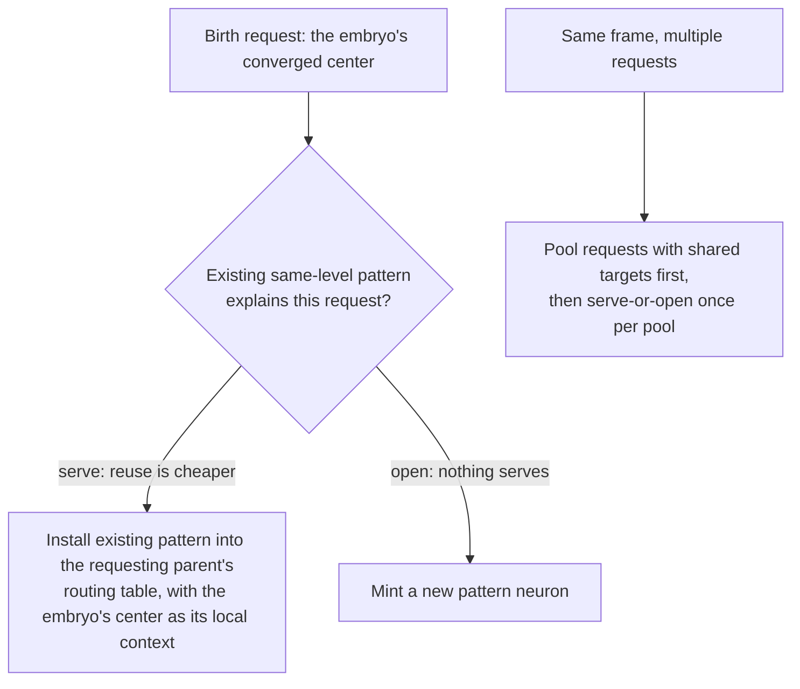
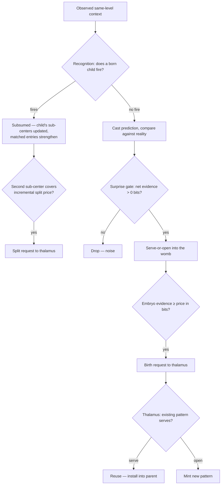

# Universal Compression with Actions and Rewards (UCAR)

UCAR is the design for the full pattern lifecycle: recognition of existing patterns, creation of new ones, their
refinement after birth, and their structural revision — reuse, defragmentation, splitting. The name states the
theory: the substrate is an online compression engine whose dictionary entries are situations ("universal" in the
coding sense — KT estimation and MDL pricing are universal-coding machinery, tuned to no assumed source), and
actions and rewards ride on that dictionary as connection payload — the compressor decides what exists, reward
decorates what it is worth, and salience-driven one-shot memory is explicitly out of scope (that is a hippocampal
function; this is cortex).

Every mechanism is parameterized by two offsets on the neuron's own timeline — where the context is read and where
the inference is aimed. Spatial processing reads and infers the present (`d = 0`); event processing reads history
and infers the next frame (`d > 0`); action processing reads the future and infers the antecedent (`d < 0`). The
mechanisms are specified on the spatial axis; what carries to the other two, and what deliberately does not, is in
[Temporal generalization](#temporal-generalization).
The neuron-side machinery lives in [`brain/brain-core/src/neuron.rs`](../brain/brain-core/src/neuron.rs) —
recognition under the `match_info` flag, creation under `error_info` — and the thalamus-side machinery in
[`brain/brain-core/src/thalamus.rs`](../brain/brain-core/src/thalamus.rs).

## The currency: two-part code

The pattern set is a code for the brain's experience. Its total cost has two parts:

```
L(total) = L(model)   bits to store the patterns: names, context entries, connections
         + L(data)    bits to encode what is observed each frame, given the patterns
```

Prediction and compression are the same quantity: a model that predicts well makes observed frames cheap to encode.
The conversion between probability and bits is fixed — an outcome the model assigns probability `p` costs
`-log2(p)` bits. Confident correct predictions are nearly free; confident wrong ones are expensive; a coin flip
costs its full bit. This is a proper scoring rule: no model profits from overclaiming or underclaiming.

Both parts have physical carriers in the substrate:

- **Model bits live in references.** A context entry or connection is a pointer that singles out one neuron among
  the candidates it could have named. Distinguishing one among `N` costs `log2(N)` bits, where `N` is the
  *addressable* population — the alphabet the reference actually chooses from — not the whole brain.
- **Data bits live in activations.** A neuron's firing event carries its own surprisal: a child that fires on one
  frame in a thousand delivers ~10 bits when it fires. The competition among a parent's children is a questionnaire
  and the winner's identity is the answer; the sparse high-level active set is the compressed encoding of the frame.
  Nothing stores this stream — prediction error is its per-frame increment, and the ledgers below meter it.

Every structural decision — create, reuse, merge, split — is one question: does the move reduce `L(total)`?
Accept iff the change is negative. No similarity thresholds exist anywhere in the design.

### Scope: the ledgers are deliberately local

Each neuron keeps its own ledger over its own neighborhood, and the sum of local ledgers is not the brain's
description length — the same base event is witnessed, and billed, by every parent whose neighborhood contains it.
This is accepted: local ledgers gate local decisions cheaply and in parallel, which is what a distributed substrate
requires. The distortion the double-billing causes — many parents independently paying for the same pattern — is
corrected structurally, at the one point where requests converge: the thalamus reuse gate below. Detection is
local; identity is global; nothing else needs a global view.

### Horizon: rent is the window

`L(data)` accrues per frame, so every economic comparison needs a horizon. The horizon enters the design in
exactly one place: **rent** — every piece of structure pays its own storage price amortized over the horizon (see
[Forgetting](#forgetting-earn-rent-death)), so "worth its price" always means "worth its price over the window the
rent defines." Structure must persist, not merely occur, to justify itself — the same bet birth already makes.

Deriving an optimum horizon from context length is a planned experiment, not a precondition: every mechanism here
consumes the horizon identically wherever it comes from.

## The economic frame: online facility location

Pattern creation is an instance of online facility location, run in the deterministic accumulate-then-open form:

- **Demand points** arrive one at a time: prediction failures, each carrying an observed context and a benefit
  measured in bits.
- **Opening a facility** — creating a pattern — costs a fixed fee: the pattern's storage price, also in bits.
- Demand accumulates at cluster centers; a center opens its facility once the accumulated benefit covers the fee.

The number of patterns is not an input anywhere. It emerges from the economics: tight recurring context clumps pay
for their own facility, scattered noise never does. The one quantity that looks like a threshold — the opening
fee — is the MDL storage price, not a tuned constant.

One design judgment sits on top of the facility-location skeleton and is stated plainly: assignment clusters on the
*context* axis (when the failure happens) while deposits measure the *target* axis (what failed, in bits of
surprise). Clustering on when, paying with what. The formal competitive-ratio guarantees for online facility
location cover the accumulate-then-open skeleton, not this metric split, nor evidence decay or center drift.

## Same-level inference

At every spatial level `k`, a neuron's context AND its inference target are the same population: the level-`k`
co-activation in its neighborhood. L0 infers L0, L1 infers L1, L2 infers L2 — each at its own level, the way the
sensory floor already works. No level is special; the radius schedule grows the neighborhood per level, and each level's surprise
mints the level above it.

The targets are **observed activations, never predictions**. A level-2 neuron predicts which level-2 patterns
actually fire around it — real recognition events, grounded through their own likelihood-ratio chains to sensory —
not what some other model guessed. This is what separates same-level inference from a level-below prediction cascade,
where higher levels train against lower levels' *guesses* and error compounds up the tower with no anchor. The
rule is the same on every axis (see [Temporal generalization](#temporal-generalization)); implementation validates
it on the spatial axis first.

### What subsumption settles at `d = 0`

The firing mechanism is uniform on every axis: a fired pattern is an active neuron that votes from its own
connections, and the subsumed parent's votes are suppressed. There is no separate correction mechanism — the only
per-axis choice is the inference scope above, and everything else follows from it. At `d = 0` under the same-level
scope, the child's votes land at its own level, so the parent's-level forecast loses that contributor; this is
acceptable because a same-frame forecast has zero lead time — reality arrives with it — so nothing consumes it
beyond surprise detection and the payload channels. What the child delivers is not a substitute forecast but an
account: subsumption silences the parent's evaluation, and the chronic surprise that created the child stops being
billed — the recurring configuration has moved from the data-bits column into the model, where it is paid once.

The knowledge of what the situation looks like lives in the pattern's routing context — per-neighbor strength over
trials is `p(constituent | pattern)`, a conditional model of the configuration one level below. One structure
serves three roles: recognition going up, identity at the thalamus, and (as a future, deliberate feature — not part
of the frame loop) top-down completion for generative decode.

### The payload carve-out

Action, reward, and label channels are exempt from the same-level rule: any pattern at any level may hold direct connections
to them. They are not part of the world-model's level structure — they are the payload the dictionary carries, the
"Actions and Rewards" of the name. This keeps supervised readout and action selection fed by the full hierarchy
while the model structure compresses. This carve-out is an empirical bet — that payload votes are ALL the
cross-level prediction the system needs — and it is tested, not assumed (see the readout gate in the
[Implementation plan](#implementation-plan)).

### What firing does and does not certify

Acceptance is winner-take-all, but accuracy is never assumed. The rank prices the fired pattern's imperfection on
every fire (expected-but-absent entries cost their bits inside it), and under earn/rent a chronically sloppy
explainer banks little and dies insolvent. Drift is tracked by refinement and terminal drift self-corrects through
narrow-then-remint. Systematic residue — including novel members the model never stored — accumulates in the
post-natal sub-centers and surfaces as a split. Unsystematic residue silenced in this parent's ledger is still
witnessed by overlapping neighbors whose children did not fire. The genuinely uncovered case is residue that is
small, unsystematic, and single-witness — by construction noise-like. The faithful-MDL upgrade, held as a named
future refinement, is partial explaining-away: on a fired frame the parent prices the residue against background
plus the fired child's model and deposits the remainder into its womb.

## Estimation: KT for models, raw MLE for background

Every likelihood-ratio score in the design compares a model's per-entry probability against a background's. The two
sides are estimated differently, on purpose:

- **Model side (pattern contexts, embryo centers): Krichevsky–Trofimov.**

  ```
  p_c = (count + 1/2) / (n + 1)
  ```

  KT is the minimax-regret universal estimator — the MDL-native answer to small samples, derived rather than tuned.
  It keeps probabilities off the 0/1 boundary without an arbitrary cap. The effect is at the cold start: a fresh
  center's entries score as ~0.75-probability members instead of certainties, so a near-miss second occurrence
  receives a mild penalty instead of ~10 bits per absent entry, and fuzzy pooling works in the regime where
  boundaries are actually drawn.

- **Background side: raw MLE with the skip rule.** Background frequencies are plain counts over frames, unsmoothed.
  An outcome the background has never witnessed cannot be priced against it, so its term is skipped rather than
  smoothed into a finite surprise: a present entry with `p_bg = 0`, or an absent entry whose neighbor has co-fired
  on every frame so far (`p_bg = 1`), contributes nothing. The background is the null hypothesis; inventing mass
  for it would price surprises against events that never happened.

Each neuron keeps two background models: a **context** model (how often each same-level neighbor is co-active,
per context frame) feeding recognition and embryo assignment, and an **inference** model (how often each event in
the inference population is active in the inference neighborhood, per inference frame) feeding the benefit gate.
Both are learning-gated like every substrate update, so frozen evaluation stays frozen.

## Recognition

Candidate child patterns are found via the same-level context index — patterns sharing at least one context neuron
with the observed co-activation. Each candidate is scored by log-likelihood ratio — its own context model against
the neuron's background model — and fires iff its rank is positive; the highest positive rank wins, and at most one
pattern fires per parent per frame. No similarity threshold exists anywhere in the decision.

For each context entry `e` the candidate stores with strength `s`, over `n_c` trials (the candidate's lifetime
fire count — immortal and monotonic, so per-entry probabilities never exceed 1; the model stays adaptive through
refinement's mode collapse, not through decay):

```
e present:  contributes log2( p_c(e) / p_bg(e) )
e absent:   contributes log2( (1 - p_c(e)) / (1 - p_bg(e)) )
p_c(e)  = (s + 1/2) / (n_c + 1)                    // KT
p_bg(e) = context count of e / context frames      // raw MLE, skip rule at 0 and 1
```

Observed neighbors the candidate does not store contribute nothing: the pattern's model has no opinion on them and
the background explains them at its own rate on both sides of the ratio.

On a fire, matched entries strengthen (`s += 1`) and the pattern's trial count increments — one event, one
increment; the rank is banked into the pattern's balance (see [Forgetting](#forgetting-earn-rent-death)). This per-fire strengthening is also the refinement mechanism (see
[Context refinement](#context-refinement-plasticity-of-degree-one)).

## The surprise gate: is this failure worth anything?

A neuron whose child fired this frame is *subsumed* — it casts no prediction and evaluates nothing, since the child
already represents it. Only a neuron with no firing child predicts and gets evaluated.

When no child fired, the neuron casts its own prediction from its connections and compares it against the observed
inference population — its own level's co-activation, under
[same-level inference](#same-level-inference-every-level-is-its-own-ground-floor). A divergence is scored as net evidence
for a distinct source, all terms in surprisal bits against the neuron's inference background model `p_bg(e)`:

```
evidence_for     = Σ_{present, unpredicted}  -log2(p_bg(e))        // bits a correct prediction would have saved
                 + Σ_{predicted, absent}     -log2(1 - p_bg(e))    // a reliable event vanishing, priced by its reliability
evidence_against = Σ_{predicted AND present} -log2(p_bg(e))        // bits the existing mechanism already saves
benefit = evidence_for - evidence_against
```

Hits vary independently of misses, so the net score can genuinely go negative: a frame with a large miss still nets
out as no surprise when the same prediction nailed rarer events. The fourth case — correctly unpredicted and
absent — is uninformative under either hypothesis and is not scored. A neuron with zero inference frames has no
background model and scores every failure at zero.

`benefit <= 0` drops the failure entirely: an ordinary mismatch on an otherwise-sharp prediction is noise, not
signal. A positive benefit becomes a demand point for the womb.

## The womb: embryos as cluster centers

Each parent neuron holds a womb: a small set of **embryos**, the not-yet-born cluster centers. An embryo is
context-only and owns no neuron, no connections, and no target data:

- **context center** — per-neighbor count plus an occurrence total `n`; `count / n` is a soft membership
  distribution.
- **evidence** — accumulated benefit deposited by the failures assigned to it, in bits.

The child's connections are deliberately absent from the womb. From the parent's perspective a child's connections
cost the parent nothing — they belong to the child once it exists, are seeded at birth from the triggering frame,
and are refined by the child's own connection learning afterward. Pricing or clustering on target data would charge
the parent for storage it never holds.

### Assignment: serve-or-open

A failure's observed context is scored against every embryo's center with the same likelihood-ratio math
recognition uses on born patterns — an embryo scores exactly like a routing entry whose strengths are its center
counts, KT-estimated over `n`. Distance and match quality are one number: the rank.

- **Best embryo with rank > 0**: the failure is served by that embryo. Its context counts fold in (`count += 1` per
  observed neighbor, `n += 1`) and its evidence gains this failure's benefit. The center drifts toward the failures
  actually assigned to it — an online mean, no learning rate.
- **No embryo with positive rank**: the failure opens a new embryo seeded from its own context, with its benefit as
  opening evidence. Opening never runs the birth check — a pattern is only born when a later failure serves the
  embryo and its pooled evidence covers the price.

Serving is fuzzy by construction: near-miss contexts pool into the same embryo because the rank is a likelihood
ratio, not an exact-match test. This is what keeps womb size bounded — one embryo per recurring context cluster,
not one entry per unique context ever observed.

### Price

An embryo's price is what the parent will actually store, in bits:

```
price = name_bits(|center|, alphabet) + log2(children + 1)

name_bits(k, n) = log2( C(n, k) )  =  Σ_{i=0}^{k-1} log2( (n-i) / (k-i) )

alphabet = max(context neighbors ever witnessed, center size)
children = the parent's current child pattern count
```

The center is named as what it physically is — an unordered subset of the alphabet this parent has actually seen —
and the pattern's own name distinguishes it among the parent's children. Naming a set, not `|center|` independent
pointers: the pointer form can spell the same set in `k!` orders (wasting `log2(k!)` bits) and overcharges dense
centers badly — naming 25 members of a 30-symbol alphabet is the same information as naming the 5 absentees, and
naming all `n` of `n` carries zero information and costs zero here. Both terms are measured from local state the
neuron already tracks — no global population figures. Consequences worth stating plainly: prices scale with
neighborhood richness, so patterns in dense contexts must earn more evidence; and degenerate early alphabets yield
near-zero prices, which is the honest MDL statement — names drawn from a tiny alphabet genuinely cost almost
nothing to store. No floor is imposed.

### Embryo death

Deposits are strictly positive (the surprise gate drops non-positive benefits before assignment), so embryo evidence
is only ever driven down by rent — the embryo's price amortized over the horizon, the same rule everything pays
(see [Forgetting](#forgetting-earn-rent-death)). Eviction happens when effective evidence reaches zero. There is no
separate incoherence mechanism; an embryo fed poorly is an embryo whose deposits arrive too slowly to outrun rent,
and it dies the same way.

## Birth: the converged center, actually

Birth happens when a served embryo's accumulated evidence covers its price. A pattern neuron is created one level
above the parent's own level, and the child inherits the embryo's distribution, not its member set:

- each context entry is installed at strength = its center count;
- the child's recognition trial count starts at the embryo's occurrence total `n`;
- the child's opening balance is the evidence the embryo accumulated — infancy is pre-paid by the womb.

So the newborn's likelihood model starts at `p_c ≈ count / n` per entry — the soft membership the womb converged
to. A neighbor served once in fifty enters at weight 1/50, its absence costs ~0 bits, and it dilutes away through
ordinary refinement instead of rendering the pattern unfireable. Center shedding needs no explicit prune rule:
low-share members are born low and fade. A pattern born from more evidence starts further from death — the same
evidence buying the same durability (see [Forgetting](#forgetting-earn-rent-death)).

The newborn's birth knowledge is its seeded context model — that is what lets it fire and refine from its first
opportunity. Its connections at its own level start empty and are learned as its level populates, exactly
as a sensory neuron's are; payload connections (action, reward, label channels) are wired from the birth frame so
the pattern participates in readout immediately. Patterns represent situations; their initial reaction to the
situation may be poor, and learning it is the child's job, not grounds for death. Born patterns die one way:
insolvency (see [Forgetting](#forgetting-earn-rent-death)).

## Context refinement: plasticity of degree one

Refinement is the counting form recognition already implements: on a fire, matched entries strengthen and absent
entries dilute relatively as the trial count grows. This is an online mode collapse — the context converges to the
recurring core of the frames the pattern actually fires on. Two properties matter:

- **Boundary repair.** A situation whose boundary was drawn slightly wrong at birth converges to the right boundary
  through ordinary fires. Structure below the level of "which patterns exist" self-corrects continuously.
- **Narrow-then-remint.** A pattern pooling two situations sharpens toward the dominant one; its rank on the
  minority mode eventually goes negative and it stops firing there. Subsumption releases those frames, the parent's
  womb re-accumulates, and the minority situation mints separately. Refinement is not a split operator, but it is
  an eviction operator that lets the womb do the splitting — slowly, at the cost of re-paying the price.

The hard add/remove form of refinement — snapping the stored context toward each fired frame — is rejected: it
tracks the most recent frame instead of converging to a mode, and churns under alternating situations.

## Connection refinement: the reaction is always plastic

A pattern's context says when it fires; its connections say what it predicts when it does. The connections are
refined by ordinary connection learning on every frame the pattern is active: connections toward observed co-actives
strengthen, rewards update by exponential smoothing, and prediction is the position-winner competition — the
strongest bucket per position wins, so the effective prediction is the modal configuration of the frames the
pattern actually fires on. Connections never decay in absolute strength; forgetting is competitive and economic:

- **Contested positions displace.** When the frames a pattern fires on shift, the newly recurring targets
  out-strengthen the stale ones and win their positions. The old prediction is outvoted, not erased.
- **Uncontested residue goes economically weightless.** A stale target nothing displaces keeps being predicted and
  keeps missing — but each miss is priced at `-log2(1 - p_bg)`, and as the stale event stops appearing in the
  pattern's inference neighborhood its background frequency dilutes toward zero, so the miss price decays toward
  zero bits. The background model forgets on the ledger side even though the synapse persists; the residue costs
  memory, never economics.

This is also the whole death semantics of multi-parent children. A pattern with parents A and B error-corrects X
for A and Y for B. When A's routing entry decays out and A releases the pattern, it continues to infer X at first;
but it now fires only on B's frames, so refinement drifts its connections toward Y, X's targets lose their
contested positions, and X's uncontested remainder dilutes into weightlessness. No explicit weakening rule exists
or is needed — release-on-last for the pattern's existence, and refinement plus background dilution for everything
it once predicted.

## Forgetting: earn, rent, death

In a stationary world an MDL compressor never forgets — structure that paid for itself once keeps paying, because
its situations keep recurring. Forgetting is purely a consequence of non-stationarity: when the source drifts, a
pattern whose situation stopped recurring still costs its model bits while saving no data bits, and deleting it
strictly reduces `L(total)`. Forgetting is the compression objective applied over a moving window, implemented as
one economic rule for everything:

- **Earn.** When a pattern fires, its recognition rank is the log-likelihood ratio of the observed context under
  its model versus background — literally the data bits the pattern saved on that frame compared to coding the
  frame without it. The rank is banked into the pattern's **balance**. It is already computed on every fire;
  banking it is free.
- **Rent.** Every piece of structure pays its own storage price amortized over the horizon:
  `rent = price / horizon` per frame. A big blurry pattern owes more per frame than a small crisp one
  automatically, because its price is bigger.
- **Death.** Balance reaching zero releases the structure. One rule for every lifecycle stage: an embryo's
  deposits are its earnings and its eviction is insolvency; a newborn's opening balance is the evidence its
  embryo accumulated; a multi-parent child keeps a balance per parent routing entry — each entry banks the rank
  earned in that parent's tournament, pays rent on that parent's storage, and dies alone, with release-on-last
  unchanged.

Survival therefore rewards bits saved — sharpness times recurrence — not fire frequency. A broad mush pattern
firing often at ~0.3 bits a fire must fire twenty-five times as often as a sharp pattern earning 8 bits to stay
solvent: breadth is not fitness. This is the post-birth accountability that pure activation counting cannot
provide, priced in the same units as everything else.

The accounts are separated: the balance is economic state, and the likelihood model's trial count is statistical
state. Trials are the lifetime fire count — immortal and monotonic, so per-entry probabilities never exceed 1 —
and the model stays adaptive through refinement's mode collapse, not through decay. The horizon in the rent is the
one place a time constant survives in the design.

The death ledger keeps its role as scheduler: on every bank event, remaining life is `balance / rent`, and the
death frame is re-registered from it. Death frames are never persisted — they are recomputed from materialized
balances on restore.

### Lifecycle arithmetic: two quotients

**Errors to create: `N ≈ price / average benefit`, floor of 2.** Opening an embryo never runs the birth check, so
nothing mints on first sight; two errors is the structural minimum, and a brand-new neuron usually achieves it. Its
first frame cannot err (no connections yet, nothing to predict from); its first worthwhile failure opens an embryo
with a few bits of benefit; its second, landing in the same recurring context, serves and births — because a young
neuron's price is nearly free (naming a center that is most of a tiny alphabet costs ~0–4 bits, and the pattern's
name among zero existing children costs `log2(1) = 0`). The count grows with maturity by design: a rich alphabet
and a crowded child table raise the price, so an experienced neuron demands more recurrences before adding
structure. Two things stretch the count in practice: the errors must pool into the same embryo (a near-miss context
serves it; an unrelated one opens a sibling), and rent between occurrences subtracts — errors spaced further apart
than the horizon never accumulate.

**Frames to forget: about one horizon of silence, regardless of size.** A newborn's opening balance is the
evidence that just covered its price, so `balance ≈ price` and the price cancels out of its lifetime:
`balance / rent ≈ price / (price / horizon) =` one horizon. A big pattern has bigger savings and bigger rent in
exact proportion. After birth, each fire extends the clock by `(rank / price) × horizon` — a sharp pattern
(rank 8 bits, price 4) banks two horizons per fire; a mushy one (rank 0.3 bits, price 20) banks 1.5% of one and
must fire ~70× as often to stay solvent. The break-even condition in one line: **a pattern survives iff its
situation recurs more often than once per `(rank / price) × horizon` frames.** Forgetting is not "N misses and
out" — the recurrence interval must stay inside the window the pattern's own explanatory quality earns.

Together, the full lifecycle in one sentence: a situation earns a pattern by recurring at least twice within a rent
window with enough surprise to cover its naming cost, and keeps the pattern exactly as long as it keeps recurring
within the window its own sharpness pays for.

## Structural plasticity

### The signal division

Co-occurrence and identity are different signals with different owners:

- **Co-occurrence belongs to the hierarchy.** Two patterns persistently co-firing is same-level context for the
  level above — food for the womb, which builds a conjunction pattern on top. This is the existing machinery and
  nothing else consumes its signal.
- **Identity belongs to the thalamus.** Two patterns being the *same thing* — near-identical connection sets,
  interchangeable contexts — is invisible to any neuron and useless to the hierarchy. Building a conjunction over
  two copies of one thing represents an identity as a structure, which is the pathology behind apex explosion.

No central firing statistics are kept. There is no co-fire matrix. Every structural check below is attached to an
event that already flows through the system, in the style of online dictionary compressors: invariants enforced at
the moment a count changes, never by a sweep. (Sequitur mints a rule the instant a digram repeats and dissolves it
the instant its use count drops; adaptive Huffman restructures its whole codebook one local swap per increment; CTW
never commits at all, carrying both merge and split hypotheses as weights — with KT as its leaf estimator.)

### Merge = reuse, decided at birth-request time

A birth request arriving at the thalamus is a demand point, and existing same-level patterns are the facilities.
Serve-or-open, one level up from the womb:



The serve test is the same MDL question in the same units: serving costs one routing entry in the requesting parent
(`|center| × log2(alphabet)` bits, which the parent pays either way) plus whatever the existing pattern's
connection model loses by covering a second parent's frames; opening costs a full new pattern — name, connections,
everything the request would create. For genuine duplicates — the common case, since overlapping neighborhoods
witness the same situation — serving wins by roughly the entire cost of the duplicate.

Candidate lookup is by identity, and identity is the context center: a birth request carries a converged
configuration model, and every existing pattern's routing context is the same kind of object at the same
granularity — the serve test compares them with the likelihood machinery everything else already uses. Requests
born in the same frame are pooled before lookup — parents witnessing one surprise from adjacent, overlapping
neighborhoods produce requests with heavily overlapping centers, and one child serves the whole pool.

A served pattern becomes a **multi-parent child**: one connection set, one id, and per-parent routing entries, each
with its own context view, its own balance, and its own death clock. The pattern dies in a parent when
that parent's entry decays out, and dies entirely when its last parent releases it. What it predicted for a parent
that released it is forgotten indirectly, through connection refinement — see
[Connection refinement](#connection-refinement-the-reaction-is-always-plastic).

### Defragmentation: the runner-up trigger

Two children of one parent cannot co-fire — recognition fires at most one — so duplication inside a parent shows up
as interchangeability: whenever A wins, B is the perennial near-rank runner-up. The parent sees this in the
tournament it already runs, for free. A persistent runner-up (tracked as a decayed count on the routing entry) is a
merge proposal sent up with the frame's results. The thalamus applies the standard test: the pooled model codes the
union of both children's frames at some cost; if the fragments were one situation, the pooled probabilities are
*more* accurate (each fragment had overfit its half) and the merge saves both data bits and a pattern's storage; if
they were genuinely different, the pooled model is broader, codes every frame worse, and the merge rejects itself.

### Split: the post-natal womb

A pattern's own context counts cannot reveal that its frames are bimodal — marginals discard the correlation that
distinguishes one noisy situation from two clean ones. The statistic that preserves mode structure is the womb's
own machinery, reused: each born pattern carries a small set of **sub-centers**, and every frame it fires, the
observed context is served into them by the same serve-or-open likelihood-ratio assignment embryos use. A unimodal
pattern's matches all serve one sub-center; a bimodal pattern's matches sort themselves into two.

A split is proposed when the second sub-center's accumulated evidence covers the *incremental* price of the split:
one new pattern name plus the entries by which the two tightened centers exceed the original. The data side of the
test includes the chooser term — with two patterns, each frame must also encode which one fired, ~1 bit — which is
what makes gratuitous splits permanently unprofitable: splitting a unimodal pattern buys zero data bits and pays
storage plus a bit per frame forever. Split and merge of the same pair evaluate the same difference with opposite
signs, so an accepted split implies the reverse merge rejects: the system cannot oscillate.

On an accepted split, the thalamus executes: two children seeded from the two sub-centers' converged counts (the
same birth-seeding rule), the original's balance divided by each sub-center's share, the original
released. Detection is entirely local; the thalamus only allocates ids and wires.

## One frame, in order



## Temporal generalization

One rule on every axis: context and inference both read the neuron's own level, and the distance parameter only
chooses *when*.

| Axis | Context read from | Inference aimed at | Ground truth anchor |
|---|---|---|---|
| Spatial (`d = 0`) | this frame, own level | this frame, own level | observed co-activation, per level |
| Event (`d > 0`) | history, own level, per distance | the next frame, own level | next frame's observed activations, per level (sensory at L0) |
| Action (`d < 0`) | what follows (the endpoint), own level | the antecedent actions | emitted primitives + reward filter |

**Everything context-side carries unconditionally.** The currency, KT estimation, the womb, subset pricing,
refinement, and the structural moves only ever consume a configuration signature — they never assumed *when* the
configuration was observed. The distance axis is a parameter of the background model, not a separate mechanism.

**The inference side is uniform too, because the targets are always observed activations, never predictions.**
Next frame's level-k patterns actually fire — recognition events on real data, grounded through their own
likelihood chains to sensory — so "which level-k patterns fire next frame" is exactly as observable as "which fire
this frame." The invariant that matters is narrower than any per-axis anchoring rule: **no level ever trains
against another level's guesses.** A cascade whose targets are lower-level *predictions* compounds error with no
anchor and is rejected; a same-level rule whose targets are future *observed* activations is anchored at every level.
The next-sensory-frame forecast does not disappear under the same-level rule — it is L0's own same-level `d > 0` prediction
(L0's level *is* sensory), plus payload votes from every level.

**The action axis (`d < 0`) has its own design** — [action-composition.md](./action-composition.md) — and it is
consistent with this document's economics: action chunks mint from backward inference error over actions only
(structure, value-blind — the same value-blindness the cortex keeps everywhere), survive by forward reward on
their connections (the payload carve-out doing its job), and are grounded by execution the way events are grounded
by sensory — emitted primitives are real. Context = the endpoint action and what follows; inference = the
antecedents that reliably preceded it. The womb, pricing, and forgetting economics port to `d < 0` minting when
that build starts.

**Design is uniform; implementation is staged.** The whole design is validated on the spatial axis first — every
phase of the [Implementation plan](#implementation-plan), through reuse and refinement, runs and is measured at
`d = 0` only. Only after spatial validation does the event tower port (same mechanisms, distance-parameterized
backgrounds, and its own readout gate — the forward consumers, next-token and price forecasts, get the same
treatment the spatial carve-out gets). Actions come last: spatial action moments plus reverse-temporal
(`d < 0`) chunk formation, coupling high-level event patterns to high-level action chunks at the apex. Until each
port lands, the temporal side keeps its current base-anchored inference and its separate adaptive-grouping
mechanism — parallel structures by design, unified only when the evidence says the spatial side has earned it.

## What is built

**The currency.** The surprise gate scores failures in surprisal bits; the womb prices an embryo at
`name_bits(|center|, alphabet) + log2(children + 1)`, both read from local state. Snapshots predating this carry
womb evidence in the old linear units — they restore and decay away harmlessly, but must not be used for
measurements.

**Same-level inference.** Every spatial level's context and inference population are one and the same set: its own
co-activation, cut to the level-scaled neighborhood. There is no privileged base population and no special case for
level 0 — its own level *is* the sensory set. Newborn patterns carry no same-level connections; their birth knowledge
is the seeded context center, and they learn what to predict as their level populates. Payload channels (action,
reward, label) keep direct wiring from every level, so readout is fed by the whole hierarchy.

**Growth above L1 is currently unbounded**, and the two structural drivers are both addressed by phases below.
On 7×7 MNIST at forget rate 0, L1 settles at ~2.5K patterns and stops while L2 climbs past 30K and depth reaches 8:

- **No rent.** At forget rate 0 nothing reclaims a pattern, so every cheap early mint is immortal and keeps feeding
  the level above as fresh context. Phase 2 supplies the death side of the economics.
- **A saturated neighborhood.** The declared radius grows with level (`r = base + level`), so on a 7×7 grid an L2
  neighborhood already spans the whole image. Creation at that level is therefore priced against a whole-image
  configuration rather than a local arrangement, which approaches per-image memorization. Phase 3's reuse collapses
  the duplicate structure this produces; whether the same-level range should be decoupled from receptive-field growth
  outright is an open question below.

## Implementation plan

Phased so each lands independently and is measured before the next. The standing metrics per phase: MNIST accuracy,
neuron counts per level, apex pattern count, parents-per-pattern by level, and wall-clock per frame.

**Phase 1 — estimation and birth seeding.** KT estimator in embryo assignment and pattern recognition ranking,
removing the 0.999 cap. Birth seeding: context entry trial counts from the center counts and occurrence total, and
the embryo's evidence as the newborn's opening balance (plumbed through the correction request and install op,
which currently carry only the member list). Expected effects: fewer fragmented embryos, newborns that fire and
refine instead of arriving unfireable, lower dead-on-arrival pattern counts.

**Phase 2 — economic forgetting.** Separate the two accounts on routing entries: trials become the immortal fire
count feeding the likelihood model; a new balance field banks the recognition rank on every accepted fire and pays
rent (`price / horizon`, with price carried from birth). Candidacy and death read the balance; the embryo's
flat-rate staleness decay becomes the same rent on its own price; the death ledger re-registers from
`balance / rent` on each bank event, recomputed from materialized balances on restore, never persisted. Expected
effects: broad low-rank patterns die insolvent, sharp rarely-firing patterns survive. This is the phase that gives
the hierarchy a governor, so it is measured by pattern churn and per-level counts as much as by accuracy.

**Phase 3 — thalamus reuse.** The largest phase, gated on a plumbing audit first: per-parent routing entries
already exist, but subsumption, the death ledger, and the delete cascade assume one parent per pattern, and
"dead in one parent, alive in another" needs an owner (per-entry balances from phase 2 provide it). Then: an
identity index over existing patterns' context centers (maintained at mint/death, queried at request time),
same-frame request pooling by center overlap, the MDL serve test, and an install-into-parent op for served
requests. Measured primarily by apex pattern count, per-level neuron counts, and parents-per-pattern by level
(stroke-scale patterns should be heavily shared — emergent translation invariance; digit-scale barely) — this is
the phase aimed at the apex explosion.
*Test gate — the multi-parent invariants, each exercised deliberately:* (1) subsumption with a shared child: the
child firing in parent A must not silence parent B's evaluation unless it also fired there; (2) death-ledger dual
clocks: a shared child insolvent in A and solvent in B survives, is removed from A's routing table and index only,
and dies entirely on last release; (3) delete cascade: releasing the last parent reclaims the neuron, its
context-index entries, and its contextRefs, with no orphan ids; (4) snapshot round-trip: a multi-parent child
serializes once, restores into every parent's routing table, and recomputed death frames match per-entry balances;
(5) id reuse after full release leaves no stale index entries. None of these can fail silently — each needs an
assertion or a test, not an eyeball.

**Phase 4 — post-natal womb and split.** Sub-centers on born patterns (the embryo struct reused, serialized with
the routing entry), served on each fire; split request when the second sub-center covers the incremental price;
thalamus-side execution with the original's balance divided by each sub-center's share. Measured on deliberately
pooled synthetic situations — two interleaved contexts with distinct targets — for split latency and correctness,
then on MNIST. Watch for merge/split churn explicitly: reuse-merge and split evaluate the same criterion through
different proxies, so a split whose products immediately re-serve into each other is the oscillation mode the
proxies could reintroduce.

**Phase 5 — defragmentation.** Decayed runner-up counts on routing entries, merge proposals over a persistence
line derived from the same economics (the pooled-versus-separate coding test), thalamus-side execution. Last
because phases 1 and 3 should prevent most fragmentation from arising; this phase collects what still slips
through.

**The readout gate, once the hierarchy is bounded.** Payload votes carry the whole readout — that is an empirical
bet, and it can only be read once growth is under control. After phase 2, and again after phase 3, compare MNIST
accuracy and per-level surprise rates against the settled hierarchy. If accuracy falls short of what the level
counts justify, the carve-out is too narrow and the design answer (top-down decode, or widening it) must be settled
before later phases build further on same-level semantics.

## Risks and open questions

Ranked; each is either resolved by a phase's test gate or held as a named design question. The pattern across the
serious ones: context-side machinery generalizes because it never assumed when a configuration was observed;
inference-side machinery is where each axis has its own consumer, and therefore its own semantics.

### Risks

- **Hierarchy growth has no governor but economics.** No level caps, by design. Every level generates the surprise
  that feeds the next, so if rent does not bite hard enough the growth documented above persists rather than
  settles. This is the phase-2 bet, and per-level neuron counts are the standing metric that reads it.
- **Multi-parent plumbing.** Subsumption, the death ledger, and the delete cascade all assume one parent per
  pattern; a partial retrofit corrupts lifecycle invariants in ways that show up as slow population drift, not
  crashes. Addressed by the phase-3 audit and its five-invariant test gate.
- **Reuse calibration.** Identity-by-context-center is the right object, but the serve test is unvalidated:
  over-serving merges distinct situations into mush the split machinery must unwind; under-serving leaves the apex
  explosion in place. Watch parents-per-pattern and split-rate-after-reuse together.
- **The payload carve-out is an empirical bet.** Payload votes are assumed to carry the whole readout. Readable
  only once growth is bounded — see the readout gate above.
- **Merge/split proxy churn.** The no-oscillation guarantee holds when merge and split evaluate one criterion;
  in practice reuse-merge and post-natal split use different proxies of it. A split whose products re-serve into
  each other is the churn signature; instrumented at the phase-4 gate.
- **Cold-start churn.** Tiny early alphabets mean near-zero prices — a burst of cheap early patterns that rent must
  clean up. Principled, possibly ugly in the transient; measure churn rate in the first thousand frames, not just
  settled counts.
- **Winner-take-all residue.** Residue that is small, unsystematic, and single-witness vanishes without a ledger
  entry. By construction noise-like; the named upgrade (partial explaining-away — residue priced against
  background plus the fired child's model, deposited into the womb) is held until evidence says it matters.

### Open questions

- **Same-level range versus receptive-field growth.** One radius schedule serves both: the neighborhood a neuron
  recognizes itself by, and the neighborhood it predicts. Because it widens with level, a small grid saturates —
  at 7×7 an L2 neighborhood already spans the whole image, so creation there prices a whole-image configuration
  rather than a local arrangement. Whether the same-level range should be bounded independently of depth (biology
  keeps them separate: receptive fields grow across areas, while horizontal connections hold a roughly fixed
  cortical range) is unresolved, and it is the deeper question behind the growth above.
- **Rent horizon derivation.** The only time constant in the design, so the planned context-length derivation
  carries more weight than when it was one of several. The mechanisms consume the horizon identically wherever it
  comes from.
- **Subsumption scope under same-level semantics.** Exactly who is subsumed by a fire — the parent whose routing
  table fired it, or every context member the pattern represents? The readings differ materially now that
  subsumption is what retires a chronic surprise; the code's current behavior should be checked against a deliberate
  decision rather than inherited.
- **Background non-stationarity.** Background counts never decay while everything they price does. Irrelevant on
  stationary data; on drifting domains every rank and price is measured against an aging null. Windowing the
  backgrounds perturbs every number at once — its own experiment, after the structure is proven.
- **Temporal identity semantics.** Two patterns with the same history context and different outcomes: one
  stochastic situation whose connections learn the outcome distribution, or two situations needing different
  histories to separate? The situation-detector philosophy says the former and the split machinery makes the
  distinction discoverable; the temporal port should state the choice explicitly.
- **Ordered-context pricing.** Temporal contexts are (member, distance) pairs, not sets; the subset-naming price
  needs its per-distance alphabet form worked out at port time. Mechanical, but it is where "the distance axis is
  just a parameter" gets cashed in or falsified.
- **Action-side port.** The `d < 0` design (action-composition) predates this document's economics; its Welford
  mint threshold is the kind of adaptive-threshold mechanism the womb replaced on the spatial side. Whether action
  chunks should mint through a womb with subset pricing and rent, or keep their own gate, is a port-time decision —
  the structure/value split (mint by structure, survive by value) is already aligned.
