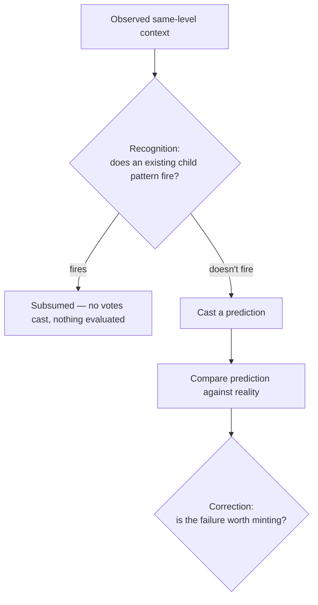

# Spatial Recognition and Correction Creation

Scope: the spatial (d=0) pattern lifecycle under `match_info` (recognition) and `error_info` (correction
creation) — [`brain/brain-core/src/neuron.rs`](../brain/brain-core/src/neuron.rs). Temporal (d>0) processing
still runs on the separate `groupMode`/`groupThreshold` mechanism described in
[error-driven-learning.md](./error-driven-learning.md); it is out of scope here.

## One frame, in order

For each active neuron with same-level context this frame:



A neuron whose child fired this frame is *subsumed* — it casts no prediction and evaluates nothing, since the
child already represents it. Only a neuron with no firing child predicts and gets evaluated.

## Recognition (`match_info`)

Candidate child patterns are found via the same-level context index (any child that shares at least one
context neighbor with what's observed). Each candidate is scored as a likelihood ratio — its own model
against a background model — with no similarity threshold anywhere in the decision.

For a candidate pattern `C`, and each context entry `e` it stores with accumulated strength `s`:

- **`e` is present** in this frame's observed context:
  ```
  p_c  = (s + ALPHA) / (fires + 2)              // C's own belief that e belongs, Laplace-smoothed
  p_bg = get_context_frequency(e)
       = (times e co-occurred with this neuron + 1) / (frames processed + 2)
  contributes  log2( min(p_c, 0.999) / p_bg )
  ```
- **`e` is absent**:
  ```
  contributes  log2( (1 - min(p_c, 0.999)) / (1 - p_bg) )
  ```
  The `0.999` clamp exists only for this branch: if `p_c` reached exactly `1.0`, `(1 - p_c)` would be `0` and
  the ratio would be `log2(0) = -infinity`.

Sum over every entry `C` stores → `rank`. **`C` fires iff `rank > 0`** — the acceptance rule is literally "does
this candidate explain the observation better than background," not a tuned cutoff. Among all candidates with
positive rank, the highest wins. On a fire, its matched entries get `strength += 1`, sharpening `p_c` toward
that entry's true co-occurrence rate for next time.

`ALPHA` is a Laplace-style optimism constant (currently `1.0`, i.e. plain add-one smoothing). It exists so a
newborn pattern (`fires = 0`) isn't scored on raw zero counts.

## Correction creation (`error_info`)

Three layers, evaluated in order, only when the neuron predicted and reality diverged.

### 1. Is this frame's failure worth recording at all? — `compute_spatial_evidence`

Let `P` be this neuron's predicted events (aggregated from its cast votes) and `O` be what was actually
observed:

```
evidence = Σ_{e ∈ O∖P} log2( ALPHA / p_bg(e) )              // showed up, wasn't predicted
         + Σ_{e ∈ P∖O} log2( ALPHA / (1 - p_bg(e)) )        // predicted, didn't show up

p_bg(e) = get_inference_frequency(e)
        = (times e was active in this neuron's inference neighborhood + 1) / (inference frames + 2)
```

If `evidence <= 0`, stop — nothing about this failure is worth pursuing.

This is a likelihood ratio against a fresh, single-occurrence hypothesis, not plain self-information
(`-log2(p)`). At `ALPHA = 1.0` the two are numerically identical (`log2(1.0/p) = -log2(p)`), so this formula
currently always accumulates, the same as plain surprisal would — see [Open questions](#open-questions).

If there's an existing *unpaid* pattern (minted but hasn't earned enough evidence to fire yet) that matched
this frame's observation during recognition, its evidence is deposited directly (`entry.evidence += evidence`)
instead of going to the ledger below — an unpaid pattern absorbs its own recurrences before a fresh candidate
is even considered.

### 2. What does naming this shape cost? — the price

```
name_bits(k, n) = Σ_{i=0}^{k-1} log2( (n-i) / (k-i) )     ≈ log2(C(n, k))

level_neuron_count = self.spatial_context_counts.len()     // distinct same-level neighbors
                                                             // THIS neuron has ever observed
base_neuron_count  = self.spatial_inference_counts.len()   // distinct base-level neighbors
                                                             // THIS neuron has ever observed

price = name_bits(|context|, level_neuron_count) + name_bits(|observed events|, base_neuron_count)
```

Both counts are per-neuron maps that already exist to drive the recognition background model
(`get_context_frequency`/`get_inference_frequency` above) — they start empty at neuron birth and grow only as
that specific neuron accumulates experience. Naming cost is therefore priced against what this neuron has
actually seen, not the whole brain's neuron count: a young neuron has seen few distinct neighbors, so naming
is cheap; the price only grows as the neuron's own experience does.

If `evidence >= price`, the pattern mints immediately, born paid — one sufficiently severe failure pays for
its own pattern outright.

### 3. Otherwise: the pending-mint ledger

A milder failure is checked against this neuron's ledger of not-yet-paid candidate shapes
(`pending_spatial_mints`). Matching has two parts:

**Context must match exactly.** A correction's identity is its context, so only ledger entries whose stored
`context` set is identical to this frame's are even considered — two failures in different neighborhoods are
never the same shape, however similar their mismatched events look.

**Among same-context entries, score by likelihood ratio.** Split this frame's mismatch into
`present_mismatch = O∖P` and `absent_mismatch = P∖O`. Each ledger entry tracks its own per-neighbor
`present_counts`/`absent_counts` and an `occurrences` count — the same role a routing entry's per-fire context
strengths play for an already-minted pattern:

```
for id in present_mismatch:
    p_c = (entry.present_counts[id] + ALPHA) / (entry.occurrences + 1)
    score += log2( p_c / p_bg(id) )
for id in absent_mismatch:
    p_c = (entry.absent_counts[id] + ALPHA) / (entry.occurrences + 1)
    score += log2( p_c / (1 - p_bg(id)) )
```

Merge into whichever same-context entry gives the highest **positive** score — the same `rank > 0` acceptance
rule recognition uses, not a similarity cutoff. On merge: bump the matched counts, `occurrences += 1`,
`entry.evidence += score`. If `entry.evidence >= price`, the pattern mints (the entry is removed from the
ledger); otherwise it stays, waiting for the next occurrence. If no entry scores positive, a new one opens with
`occurrences = 1` and all mismatch counts at `1`.

Unlike step 1, this formula is *not* degenerate at `ALPHA = 1.0`: `p_c`'s numerator includes a real `count`
term that varies with actual accumulated history, so the ratio can still land above or below 1 (i.e. the score
can still go negative) depending on genuine evidence, not just on `ALPHA`'s value.

## The recognition/correction symmetry

The same log-likelihood-ratio math runs at three different points in a pattern's life, fed different amounts
of accumulated history:

| Stage | What's scored | History available |
|---|---|---|
| Ledger matching | A not-yet-born pattern's mismatch shape | `occurrences` pooled prior failures |
| Recognition | An established pattern's stored context | `fires` since birth |
| Correction gate (`compute_spatial_evidence`) | This frame's failure alone | none — single fresh occurrence |

A pending ledger entry is, functionally, an embryonic routing entry: same scoring formula, same no-threshold
acceptance rule, just with a smaller sample so far.

## Open questions

- **`compute_spatial_evidence` degenerates at `ALPHA = 1.0`.** Its formula has no `count` term — `ALPHA` *is*
  the entire numerator — so at `1.0` it collapses to plain self-information and loses the property that a
  mismatch on an already-common event can argue *against* minting, not just for it. Recognition and the
  ledger's matching don't have this problem, since their `p_c` is built from a real, varying `count`. Whether
  to give `compute_spatial_evidence` its own non-degenerate treatment (at the cost of a second tuned constant)
  or accept plain surprisal at this one gate is unresolved.
- **No forgetting.** Nothing in this document reaps a paid pattern once minted — patterns only accumulate.
  Later training episodes over the same data keep minting new patterns with diminishing returns on held-out
  accuracy (measured, not yet fixed).
