# Universal Compression with Actions and Rewards (UCAR)

UCAR is a machine that compresses what it observes by building a hierarchical dictionary of patterns, and
learns what to do by observing rewards. It is defined by two alphabets, like a Turing machine — the **event
alphabet** it can observe and the **action alphabet** it can execute — and above each it forms symbols of its
own. Every symbol, base or learned, event or action, is a **neuron**.

This document is the specification. **D** is a definition and **R** a rule — together they are the machine.
**T** is a theorem: a claim that follows from them, stated with its argument. **Remarks** are commentary
and can be skipped. Section 2 states the objective everything else is derived from, so it comes before the
mechanisms that optimize it.

**Notation.** `f, g, h` are frame numbers. `R` is the radius, `W` the buffer depth. `O` is an observation —
what a neuron saw — and `C` a candidate neighborhood; `nbhd(e)` is an entry's neighborhood and `|e|` its size
(D19). `d` is distance, `n` a count of observations, `m` a bid's miss count, `L` a file length, `D` a
hierarchy depth.

---

# 1. The machine

## 1.1 The substrate

The alphabets are declared as structure, and the declaration is part of the machine's definition.

> **D1 — Declaration.** The machine declares **channels**. Each channel declares at most one **event
> dimension** and at most one **action dimension**. Each dimension declares its **resolution**, its bucket
> count. A base symbol is a dimension–bucket pair, so this declaration *is* the alphabet.

> **D2 — Coordinate.** A neuron's coordinate is `(dim_id, bucket_id)`; its channel is the channel owning that
> dimension. A neuron minted as a pattern inherits its parent's channel and dimension and sits one level above
> its parent.

> **D3 — Channels are declared, never created.** No mechanism mints a channel. What grows is the population
> inside one: patterns are added level by level, without bound. The channel set, and with it the dimension set,
> is therefore a fixed, enumerable index over the whole run, which is what lets `(dimension, offset)` name a
> slot at any level.

> **D4 — Adjacency.** Each channel declares which channels are its neighbors. This is part of the channel
> definition, and it applies **at the base level only**, where the input's geometry is still meaningful.
> **Above the base, every active neuron at that level is a neighbor.** Neighbors are always at the neuron's
> own level — a neighborhood is written over the symbols that level offers — so adjacency only ever selects
> among them. This is the only place topology enters the design, and it introduces no number to tune: there is
> no depth to choose, because there is only ever one level to which the declaration applies.

**Remark.** Receptive fields grow with depth through composition, not through a declared radius. Channels gate
eligibility and nothing else — two children of one neuron may name overlapping but different channel sets, and
the fit needs no channel structure.

## 1.2 Firing

Every frame, each event dimension quantizes what was observed — if anything was — and each action dimension
carries the action executing in that same frame — if one is.

> **D5 — Firing.** A neuron fires only when something happens: an event neuron input, or an action neuron output
> (when its action is executed). **At most one neuron fires per dimension per level in a frame.**
> A dimension with nothing to report is silent.
>
> **A frame's two halves are simultaneous, not sequential.** What is observed and what is executed occupy the
> same column of the grid, so an action is not a reply appended to a frame — it runs alongside that frame's
> events, and both are in hand together (§13).

> **D6 — An activation stays open.** A firing at frame `f` remains open through `f + (R−1)`, which is how long
> its observation takes to fill. While open it **collects and nothing more**: arriving neighbors are written
> into it, and it is not counted, priced or compared until its span closes. The activation does not re-fire —
> it is one firing, not a state — and it enters other neurons' neighborhoods only at its firing frame. The
> neuron may fire afresh while an earlier activation is open, so several can be open at once, each collecting
> its own observation.
>
> **Age is per activation, and a neuron carries several ages at once.** An activation's age is the frames
> elapsed since it fired, `0` through `R − 1`. A neuron active at frames 10 and 12 is at ages 0 and 2 in frame
> 10 + 2, then 1 and 3 in the next, and so on. When the machine hands the neuron a frame it hands it **every
> open activation**, and each is processed by the same rules at its own age. Nothing distinguishes them but
> age: a new firing is simply the activation whose age is 0.

> **D7 — Exclusion is per level, and about firing.** D5's one-per-dimension bound is declared for the base and
> preserved upward by construction: one firing per dimension per level offers at most one bid, so contraction
> (§10) promotes at most one unit into that dimension one level up. A dimension can carry firings at several
> levels in one frame; all are inhibited except the apex.

There is no rest value. A dimension where nothing happens supplies no symbol, and silence is what the decoder
assumes for anything the file does not state. Three consequences:

- **Blank regions cost nothing** — no activation, no history, no dictionary, no compute.
- **A frame is a set** — variable-size, containing only what happened.
- **Absence still discriminates** — a pattern naming a ring is measurably wrong on a filled disk, because the
  neurons inside the ring are present-but-unnamed and the distance counts them. Offness carries information
  without ever costing storage.

**Remark.** Whether a 0 pixel is a black event or nothing-to-see is the encoder's choice, made where the input
is produced. A dimension where something always happens is simply always active; nothing depends on sparsity,
it only profits from it.

> **D8 — Identity is absolute.** A neuron is bound to its position. The same shape at two positions is two
> firings of two neurons, learned independently. Nothing shares a shape across positions the way a
> convolution shares a filter, and each position pays for its own patterns out of its own history.

---

# 2. The objective: it is all one file

Take the last `horizon` frames and write them as a single file a decoder could read back to reproduce each of
them exactly. **The file is a window, not a log of the run.** It moves with the machine, and everything the
machine's structure is worth is measured against what fits inside it.

> **D9 — The file.** Two parts, both over that window (D26). **The dictionary**: the neighborhoods needed to
> expand what the history states. **The history**: the apex units, and the corrections where they were wrong.
> Anything unstated is silence.
>
> **It is the current optimum encoding of the window, not a log of how the machine got there.** The file is
> re-derived from the structure as it now stands, exactly as a price is (R2). So no past decision has to be
> honoured: an entry that goes is not a line the file must keep alive, because the window is simply re-encoded
> without that symbol and the frames it used to cover are expressed by whatever the dictionary now offers,
> with corrections where that is worse. Nothing is retained that the machine could not expand.

**Two scopes, two dictionaries.** The machine's history and a neuron's (§6) are the same part of the file read
at two scopes, which is why D13 names them with one word — but their dictionaries hold different sets. A
neuron's own file carries a line for every child in its routing table, since every one of them serves
observations in that neuron's history. The machine's carries only the symbols promotion actually used, since
those are the only ones its history states. Where it matters which, the text says whose.

> **D10 — Predictive coding.** The decoder runs the same model as the encoder, so it already knows what each
> active unit predicts about the frames ahead. **The encoder writes only the surprise.**

```
asserted {␣} at +1, actual {␣}       →  0 symbols
asserted {␣} at +1, actual {e}       →  2 symbols  (turn off ␣, turn on e)
asserted nothing at +1, actual {e}   →  1 symbol   (turn on e)
```

**Being wrong costs twice what saying nothing costs.** That asymmetry decides when the machine should commit
to a symbol at all, and it is derived from again in §5.2 and §10.4.

> **D11 — Prices.** Every cost in the design is part of a file, counted in symbols:
> ```
> activating an apex unit  =  1                    a line in the history
> what it got wrong        =  the neighbors wrong  the corrections after it
> having a child           =  1 + |e|              a line in the dictionary
> ```
> This is a fixed-length code: a symbol costs one regardless of how often it is used.

> **D12 — What the file holds.** The dictionary, and the history encoded against it. A child's neighborhood
> must be written: it is the collapse of observations the window no longer holds, so there is nothing in the
> file to recover it from. **A symbol is not one line per frame** — a unit firing at `h` names
> `[h − (R−1), h + (R−1)]`, so writing it discharges up to `2R − 1` frames of the window at once. That is where
> compression across space and time is actually paid out, and it is why the floor on the horizon is stated
> against `R` (R11). What the machine holds and the file does not is search state — counts, tallies, distances,
> margins — because expanding an apex unit needs the neighborhoods and nothing else. This is why the normal is
> free and a child is not.

> **D13 — Local file length.** Over one horizon, a neuron's own file is
> ```
> L  =  Σ over dictionary (1 + |e|)  written once
>    +  Σ over history (1 + errors)  written every activation
> ```
> and §7's test is the derivative of it.

**Remark — two scopes, one span.** `L` is the neuron's own file. Since D26 it covers the same window as the
machine's, but it is still a different object, because the machine's history holds only apex units and an
activation that a neighbor's promoted unit subsumed never appears there. Sharing a span is what makes the two
commensurable; it does not make either an approximation of the other, and a neuron never needs the other one —
which is what lets its pipeline stay independent of the election. **That the two compose is an assumption of
this design, not a result** (§Risks, the composition gap).

**Remark — why predictive coding is load-bearing.** Under a literal history, a prediction that comes true
saves nothing, so no test could ever value prediction. Under predictive coding, being right is free and being
wrong costs corrections, so prediction error *is* file length and the one test prices it with no new term.

---

# 3. Neighborhoods and distance

## 3.1 The neighborhood

> **D14 — Neighborhood.** A neuron firing at frame `f` observes the active neurons of its own level that
> adjacency admits (D4), across `[f − (R−1), f + (R−1)]`, each tagged with its offset from `f`:
> ```
> O = { (p, −4), (a, −3), (r, −2), (i, −1), (␣, +1) }
> ```
> for a neuron `s` in a stream reading `p a r i s ␣`. Neighbors at offset 0 co-occur; at negative offsets they
> led here; at positive offsets they followed. **All three are the same kind of thing.**

A neighborhood is a slice of the `(dimension, frame)` grid, one column per offset, at most one neuron per
dimension per column (D5). With `R = 3`:

```
                                offset
                    −2     −1      0     +1     +2
        dim A        ·      a      ◉      ·      ·        ◉  the firing neuron
        dim B        ·      b      ·      ·      ·        a  a named neighbor
        dim C        q      ·      ·      c      ·        ·  silent
        dim D        ·      ·      ·      ·      d
                    ╰──── d_backward ────╯╰─── still arriving ───╯
                     in hand at age 0        lands over the next R−1 frames
                     recognition uses this   nothing is measured until it is complete
                    ╰──────────────────── d ────────────────────╯
                     the whole span, priced from the bill onward
```

Everything the design prices is a count of cells in that grid: the fit is the cells where an entry and the
observation disagree, and a child's dictionary line is the cells the entry names.

> **D15 — Radius.** `R` is the depth of the frame buffer, `W = R`, giving a reach of `R − 1` in either
> direction. A neuron sits at the newest edge of the buffer when it fires, with `R − 1` frames of context
> behind it, and slides to the oldest edge as its neighborhood completes.

The buffer is a sliding window over frames; an activation enters at its newest edge and walks to its oldest.
With `R = 3`, a firing at frame 10:

```
                 frame 10        frame 11        frame 12        frame 13
   buffer       [ 8  9 10]      [ 9 10 11]      [10 11 12]      [11 12 13]
                       ▲               ▲               ▲
   activation        fires          +1 lands       +2 lands         gone
   at frame 10    newest edge                    oldest edge
                  sees −2, −1                     complete
```

That is the whole of D6: the activation is open for `R − 1` frames because that is how long frame 10 takes to
fall out of an `R`-deep buffer. A firing at 11 opens while this one is still open, so several activations of
one neuron are in flight at once, each at a different position in the buffer.

> **D16 — Spatial is `R = 1`.** One frame, every neighbor at offset 0. Not a separate mechanism and not a
> separate phase — the same machinery with an empty half, at every level of one stack (R30). A run at `R = 1`
> is this machine spatially configured, not a spatial subsystem of it.

**A pattern is a name for a chunk of spacetime.** One pattern-learning algorithm and one kind of pattern.
There are four types only in the sense that two declarations cross: **offsets** are all zero or spanning,
which is spatial against temporal, and **dimension** is event or action. Neither is a separate mechanism.
Spatial is D16. Event and action are not separate for a plainer reason than it looks — the machine observes
its own actions, since each action dimension carries what was executed, so an action is a symbol read back the
way a pixel is and a pattern over it is learned by the same counting. **You could not tell from a dictionary
line which of the four you were holding.** The one asymmetry lives outside the pattern: events infer actions
and never the reverse, and that inference runs on reward (R38).

**One neighborhood per firing, and at most one entry serves it.** If a neuron could activate several children,
each dimension would carry several active units and the count would square at every level.

## 3.2 The fit

> **D17 — Distance.** For an observation `O` and an entry candidate `C`, the distance is the symmetric difference:
> ```
> d(O, C) = |O △ C|  =  neighbors present that C does not name
>                     + neighbors C names that are not present
> ```

This is not a notion invented for matching: it is literally the corrections that would follow the activation
in the file. Service cost and match distance are one number, dimension-free and offset-blind — a missed neighbor
and a missed prediction cost the same, because in the file they are the same thing.

> **D18 — Only two distances.** `d_backward` is `d(O, C)` restricted to offsets `≤ 0` — the half in hand the
> frame a neuron fires, and all recognition ever sees. `d` is the whole thing, over all `2R − 1` offsets, and
> it is what an observation costs.
> ```
> d_backward   offsets ≤ 0      available at age 0        decides which entry an activation commits to
> d            all offsets      available at the bill     decides what that observation costs
> ```
> Nothing is ever measured in between. An observation is incomplete until age `R − 1`, and an incomplete
> observation is not priced, not counted and not compared (R2) — so no quantity in this design is ever
> evaluated over a partial span.

> **R1 — Two comparisons, kept apart.** Which entry an activation **commits to** is decided at age 0 on
> `d_backward`, because that is all recognition ever sees, and the commitment is locked for the window (R14).
> What an observation **costs** is `d` against the entry serving it, measured as that entry's neighborhood
> now stands — a different question, asked of a completed observation and re-asked whenever the table moves
> under it (R2). Throughout: *wins, closest, runner-up* mean the first; *distance, cost, benefit* mean the
> second.

> **R2 — A price is a measurement, not a record.** `d(O, C)` is a function of a neighborhood, so when the
> neighborhood moves the distance moves with it: re-centering (R5) re-prices every observation the entry
> serves, and recomputing that entry's column is where that happens (D23). **An observation is fixed and its
> cost is not.**
> The record says what was seen; the cost says what the table, as it now stands, makes of it. Nothing is ever
> charged at the moment it happened and left there.
>
> **An observation that has not completed has no cost at all** — it is collecting, not participating (D18) —
> and one that has completed is never frozen: its cost stops moving when its server stops moving, not when it
> was recorded.
>
> Prices and structure both move only at bills, because that is the only place counts move (T11), but they are
> different kinds of thing. A price is re-derived from whatever the table currently says and keeps no history
> of its own. A structural move — adding, deleting (R14, R18) — is a decision that stands until something
> reverses it.

**Remark — the split is availability, not meaning.** A neighborhood names both directions symmetrically, and a
pattern is minted after its chunk has been seen. Routing is simply what cannot wait. This binds action neurons
no less than event ones: an action neuron fires when its action executes and waits out its forward half the
same way.

**Remark — at `R = 1` the vocabulary collapses.** `d_backward` **is** `d`, so the two distances of D18 are one;
`server_distance` **is** the minimum and a fallback **is** the true runner-up; nothing is ever in flight; the
recording step has nothing to do; the bet and the bill fall in the same frame; and bins key on the whole
neighborhood. Contraction loses its cross-frame contention, since every claim spans one frame.
Read the document with the temporal parts struck out and it is the spatial algorithm, unchanged — the whole
machine, not a stage of it, which is what makes `R` a configuration rather than an architecture.

**Remark — two different objects.** An entry's forward mismatch is what *this entry* got wrong against its
own history — the only prediction signal a neuron learns from.
The machine's history counts what the *decoder* got wrong, once per slot, over its single arbitrated
assertion (§12). They coincide when one entry owns a slot
outright and diverge otherwise.

---

# Part I — A neuron

# 4. State

Only three things a neuron holds cannot be recomputed: the history of what it observed, the entries it has
decided to keep, and the commitments its open activations have already acted on. Everything else is a total.

> **D19 — Observed and named.** Two things have the shape of a neighborhood and must not be confused. Both
> span the whole `2R − 1` window and hold at most one neuron per dimension per offset (D5); D17 compares one
> against the other.
> ```
> an observation   what the neuron SAW around one firing; recorded once, evicted at the horizon
> a neighborhood   what an entry NAMES; the collapse of what it serves (R4), moving as that moves (R5)
> ```
> An observation is a fact, a neighborhood a claim. Being an L1 center (T1), a neighborhood is typically a set
> **no observation ever was**, which is why the two can never be one object. Neither is a frame: a frame is
> one column, an observation the whole window.

> **D20 — Halves.** Cut either at the firing frame. The **backward half**, offsets `≤ 0`, is in hand when the
> neuron fires and is what recognition compares (R7). The **forward half**, offsets `> 0`, arrives over the
> next `R − 1` frames and can key nothing, because it does not exist when the choice is made.

> **D21 — Neuron state.** `°` marks a total: recoverable by a walk, kept to avoid one.
> ```
> neuron           = (coordinate, routing table, history, open activations)
>
> routing table    = set of entries
> entry            = (id, neighborhood, child, retired?, counts°, served bins°)
>
> history          = (bins, ring)                  complete observations only
> ring             = observations, oldest first
> observation      = (frame number, backward half, forward half)
> bin              = (backward half, observation count,
>                     tallies°, distance to each entry°, server°, fallback°,
>                     Σ server mismatch°, Σ fallback mismatch°)
>
> open activations = at most R, one per age        still collecting
> open activation  = (forward half so far, age, committed entry)
> ```

An `id` is creation order — a handle that survives re-centering, and the tie-break §9.1, R25 and R28 reach
for. A `neighborhood` is carried rather than derived because it is what an entry currently claims, moved by
re-centering as its served set moves (R5), not a value with a closed form. An observation stores no backward half: every observation in a bin carries
that bin's key exactly (R7), so the bin holds it once. A bin is an aggregate, not a container — it knows how
many observations it has, never which. The `frame number` is the one absolute quantity anywhere in a neuron,
and expiry (R9) is the only thing that reads it: no comparison, price or count in the design ever does.

**An open activation ends at its bill.** Its forward half becomes the observation's, and its `committed entry`
goes with it — that field records a bid already acted on, and once the span is closed there is nothing left to
act. **A settled observation therefore has no server of its own**; it is priced against its bin's, whatever
that currently is. This is what keeps a bin homogeneous (T3) however long its observations have sat there.

> **D22 — Three lifetimes.** Three notions of an entry standing in relation to an observation, expiring at
> different times. Holding them in one field is what made them look like one thing.
> ```
> committed entry   one activation, R frames    frozen at age 0    what it bid on and asserts from
> server            until its row moves         argmin of the row  what an observation costs
> served bins       until the served set moves  inverse of server  what an entry aggregates over
> ```
> An observation whose bin is handed to another entry is priced against the new one, while the activation that
> recorded it goes on asserting what it committed to. Those were never the same question.

> **D23 — What the totals owe.** In dependency order, so the list also says what to recompute when something
> moves.
> ```
> bin.tallies        =  Σ over its observations, per forward offset
> entry.counts       =  Σ over served bins:  their tallies                     (forward)
>                       Σ over served bins:  observation count × the bin's key (backward)
> entry.served bins  =  { b : b.server = this entry }
> bin.distance[e]    =  d_backward(bin's key, e.neighborhood)
> bin.server         =  argmin over that row;  fallback = second
> bin.Σ mismatch     =  d(bin, that neighborhood), summed off the tallies
> ```

Only the forward half needs tallies; backward, every observation carries the key, so the count *is* the tally.
The distance rows are the reverse index R6 says is unnecessary — an entry that moved is one column, and every
bin reaching for it is current again. Handover is therefore arithmetic: a bin moves whole (T3), so its tallies
are subtracted from one entry and added to another in `O(offsets)`, not `O(observations)`.

> **D24 — Entries are one kind of thing.** The normal and every child are the same object. The normal is the
> entry whose child is null, so it has no dictionary line to pay for. One structure serves the whole routing
> table.

The **neighborhood** is the whole of what an entry knows — neighbors behind the neuron and ahead of it, with
no separate notion of context or of what it infers.

# 5. Counts, the collapse, re-centering

## 5.1 Counts

> **D25 — Counts.** Each entry keeps, over exactly the observations it currently serves,
> `count(neuron, offset)` = how often that neighbor was present.

> **R3 — What moves counts.** An observation completes and enters the history → its server increments. A
> served observation is evicted → decrement. A new child captures a bin → old server decrements, child
> increments. A retired entry's bins fall back → the fallback increments. **Nothing else, and never a
> fraction of an observation** — counts move by whole spans or not at all.

**An entry counts only its own observations.** Every observation is served by exactly one entry, and no entry
learns from another's.

**Handover is arithmetic, not a walk.** Two of those four move a whole bin between entries, and a bin is the
sum of its observations already (D23), so the transfer subtracts that bin's tallies from one entry and adds
them to the other — `O(offsets)`, not `O(observations)`. This is legal only because a bin moves whole (T3), so
T3 buys a cost as well as a guarantee.

## 5.2 The collapse

Routing needs a set, not a distribution.

> **R4 — The collapse.** For each `(dimension, offset)` slot, let `n` be the number of observations the entry
> serves and `count(p)` the number of those holding neuron `p` in that slot. The neighborhood includes `p`
> exactly when `count(p) > n / 2`; otherwise the slot is omitted.

**One denominator, every offset.** An observation enters the history only when its whole span is complete
(D21), so every observation an entry serves has something to say at every offset — a neuron or a silence. The
outermost forward slot is decided by exactly the same population as offset 0, and `n` is that population.

A slot cannot hold two neurons (D5), so at most one candidate can hold a strict majority. Silence is the
implicit alternative with count `n − Σ count(p)`, so a rare or split observation loses to it. There is no
tunable threshold, smoothing, or probability estimate: the denominator is the served count and the boundary is
required by exact L1 minimization.

> **T1 — The collapse is the L1 center.** The result minimizes `Σ d(O, C)` over all sets, and the sum is over
> the whole span for every observation in it, because no partial observation is ever a member. It is a
> *center*, not a medoid: synthesized, possibly a set the neuron has never seen. That is the point — it is the
> typical neighborhood, not a sample of one.

**Remark.** A centroid over sets is a fractional vector, which is not a set, cannot be written into the file,
and has no symmetric difference. The counts **are** the fractional object; the collapse is how the design gets
from it to something the decoder can expand.

## 5.3 Re-centering

> **R5 — Move.** The collapse is recomputed whenever counts move. No test, no gate: an entry is always the
> center of what it currently serves. This is free, because the counts are already maintained.
>
> **Counts move only at a bill**, since that is when an observation completes, is evicted, or a served set
> changes (R3) — and every one of those disturbs the whole span at once. So a re-center is always over all
> offsets, and there is never a frame on which part of a neighborhood is current and part is stale.
>
> **Evidence collapses at once, structure collapses at the end.** Counts moved by an observation completing or
> expiring are collapsed where they move, because the bill's tests are about to price against them. Counts
> moved by an add or a delete are collapsed once, after both tests have run (R19) — nothing reads a
> neighborhood in between, and a bill re-centers for structure exactly once.

Three consequences, and they are the point of the design:

- **Neighborhoods track their demand.** An entry created on thin evidence is pulled toward its cluster.
- **Coincidence is voted out.** A neighbor present once loses its majority to silence and drops out.
- **Reach emerges.** Offsets where nothing recurs fall away. How far a pattern reaches is discovered, not
  declared. `R` bounds it; it does not set it.

> **R6 — Servers and fallbacks are re-derived, not patched.** A moved neighborhood changes every distance
> measured against it, for the bins it serves and for the bins that merely name it as fallback. What is
> maintained is the *column*: an entry that re-centers recomputes its distance to every bin, and nothing else
> is repaired. `argmin` and second-best are then taken from a bin's row whenever that bin is used — by
> recognition when it fires (§9.1), and by the tests when they scan the table (R19). No reverse index is
> needed beyond the distance rows themselves (D23).

**Cold start is silence.** An entry with no observations has no counts and no neighborhood. That is the initial
case, not an error.

# 6. The history

> **D26 — Horizon.** The window the file covers, in frames, and every neuron's history is that same window. A
> neuron remembers the observations it fired on within the last `horizon` frames — all of them, however often
> or rarely it fired. Each observation carries the frame number it fired on, and expiry is the only thing
> that reads it.
>
> The ring still holds at most `horizon` observations, since a neuron fires at most once per frame (D5). What
> changes is that it can hold fewer: occupancy is how often the neuron fired, not a constant.

**Remark — one clock, so one file.** A neuron's `L` (D13) is a slice of the machine's file over the same span,
so an entry earns its dictionary line against errors the file actually contains. Under a neuron-relative clock
the two windows diverged without bound, and a rare neuron could justify a line out of evidence the file no
longer held.

**Remark — forgetting is on the machine's clock.** A symbol that stops occurring loses its structure within a
horizon: its neuron's observations expire, its entries are left serving nothing, and they are retired at the
next bill (§8.2, R18). That is what a windowed file means rather than a cost it imposes — the dictionary
describes the window, so an entry that describes nothing in the window has no line to earn.

> **R7 — Keyed on the backward half — both sides.** Two observations with identical backward halves sit at the
> same `d_backward` from every entry, so routing hands both to the same server and fallback. That makes the
> backward half — and only it — safe to share an assignment across. The forward half cannot key anything: it
> does not exist when the assignment is made.
>
> **An entry is keyed the same way**, by its own backward half, and no two entries may share one: routing sees
> only `d_backward`, so a pair with equal backward halves would be indistinguishable to it, the tie would go to
> the older `id` every time, and the younger could never serve.

Both sides of the comparison are therefore backward halves, but they are **different populations**. A bin's is
a context that was actually observed; an entry's is a claim, the collapse of everything it serves (D19), and an
observation is routed to the nearest entry rather than to an equal one. Only when a bin's backward half happens
to coincide with an entry's are the two the same set.

A **bin** is the aggregate over its observations exactly as an entry is the aggregate over its bins. The
backward distance is a property of the bin. The forward half is statistics: what followed this context, per
slot, tallied.

> **T2 — Tallies are sufficient.** Everything the design asks of the history is a sum over slots, so the
> tallies answer it exactly. `d(b, C)` is `observations × d_backward` plus, at each forward slot, two for every
> observation holding a neuron other than the one `C` names and one for every observation holding nothing — or
> one for every observation holding anything, where `C` names nothing. Every observation in the bin appears in
> every slot's arithmetic, because none of them is partial. The collapse sums tallies. Benefit needs only
> totals. Nothing asks whether `c` at `+1` came with `d` at `+2`.

> **R8 — The ring makes eviction exact.** Removing the oldest observation means subtracting the neurons *it*
> contributed, which a tally cannot recover, so each observation keeps its own forward half and the bin is the
> cached aggregate over them. This is not a storage saving. It buys that the add test scans **distinct
> backward contexts** and reads pre-summed tallies.
>
> This is the one place a forward half is read whole; everything else reads it per slot, off the tallies (T2).

> **T3 — The win test is per bin.** A candidate wins on `d_backward`, a property of the bin, so a bin is won
> whole. No bin is ever split.

> **R9 — Aging is by the clock.** At each activation, every observation older than `horizon` frames leaves the
> head of the ring — none, one, or many, depending on how long the neuron was quiet. The ring is still a FIFO
> and eviction is still from the oldest end; the frame number sets the threshold, not the order.
>
> **Expiry is lazy.** A neuron that does not fire does nothing, and clears its arrears at its next activation,
> so nothing sweeps the population per frame. Recording is unconditional, and no election outcome ever edits a
> history.

> **T4 — `server_distance` is not the minimum.** Routing chose on `d_backward`; the total is known `R − 1`
> frames later, and the entry that won the prefix can end up further than the runner-up. Nothing may assume
> the server was closest in total distance.

**Why the fallback is stored.** The test asks what an entry's observations would cost without it, and the answer
is the fallback. Both sides of that subtraction are current measurements against current neighborhoods (R2) —
the fallback always was, since it is a counterfactual that was never charged to anything, and under R2 the
server side is too. Storing the fallback is what lets the bill's own scan answer the test without a pass of its
own.

**Why records and not a summary.** An error total cannot answer retirement: when an entry goes, the *new*
runner-up for its bins must be found afresh, which needs the bins and their distance rows — a single number
per entry could not produce it.

> **R10 — Free parameters: two.** The **horizon** and the **radius** `R`. The alphabet 
> (channels, dimensions, resolutions) is not a third: a resolution defines what a base symbol *is*, so it is
> the problem statement rather than a knob on the algorithm, the way a Turing machine's tape alphabet is.

> Neither is channel adjacency (D4): it is part of a channel's definition, it applies at the base level only,
> and it has no depth to choose. **Nothing else in the design is tuned, and nothing anywhere is capped.**

> **T10 — Every loop in the design is bounded, and none is capped.** A bill is a fixed number of scans and no
> iteration to a fixed point (R19). The pruning pass removes an entry from competition and creates none, so it
> runs at most once per entry; a retirement is collected within `R − 1` frames and takes its whole subtree in
> one step (R18). The election is a single greedy pass (R28). The level stack is at most `log₂ N` deep (T9), which also bounds the write lag and
> the depth of an assertion's expansion. Every bound falls out of a quantity the design already counts, so
> nothing has to be chosen to make the machine halt.

> **R11 — The floor: `horizon > 2R`.** A radius declares a capacity — willingness to name patterns spanning
> `2R − 1` frames — and the horizon is the window that has to hold them. A unit firing at `h` names
> `[h − (R−1), h + (R−1)]`, so one span is `2R − 1` frames wide and two firings a frame apart span `2R`.
> `horizon > 2R` is the strict floor for the window to contain more than two complete overlapping spans, which
> is the least that lets a reach recur inside the file at all. **The constant is the span, not a chosen
> number.**
>
> Below the floor this is a correctness condition, not a provisioning one: a span wider than the window has
> corrections falling outside the file, so the symbol asserting it cannot be priced. Above it, the horizon is
> provisioning — the outer reaches stay nameable, and an under-provisioned neuron simply pays for a radius its
> window rarely establishes recurrence over.

**Remark — the trade, stated plainly.** Nothing is stale, because nothing outlives its window. Absence of
evidence *is* treated as evidence the structure died (D26), so nothing waits dormant to be contradicted. If
the world changed, errors arrive immediately and restructuring proceeds at the pace of new evidence.

# 7. The one test

> **R12 — The one test.** An entry earns its place when the errors it removes from the history exceed what it
> costs to store.
> ```
> cost(e)     =  1 + |e|
> benefit(e)  =  Σ over the observations e serves: (fallback_distance − server_distance)
>                each a full-span `d` against current neighborhoods  (R2)
> margin(e)   =  benefit(e) − cost(e)
> ```
> An entry is **added** only when its margin is strictly positive and **retired** only when strictly negative
> (R18). At equality nothing happens, so the boundary cannot flip-flop.

Benefit changes only on events — the entry gains or loses an observation, or a neighborhood moves. The first
is O(1). The second re-prices every observation the entry serves, and the scan the test is already making
(R19) is that walk, so benefit falls out of it. **No test needs a pass of its own.**

**Negative-benefit observations are legal, and they are the signal.** An observation whose server won the
backward match but predicted worse than the runner-up contributes a negative term. That is exactly the case
where an entry names a chunk correctly and gets its future wrong, and it needs no separate mechanism: it drags
the entry toward retirement and triggers the add test that proposes the replacement.

> **T5 — What `L` is a potential for, and what it is not.** Every *handoff* strictly decreases `L`, and `L` is
> a non-negative integer. **Re-centering is different**: it minimises service cost over the served set but can
> change `|e|`, so a single collapse may raise `L`. So `L` is a Lyapunov function for handoffs, not for the
> learning dynamics as a whole. Nothing else rests on `L` descending either: a bill is a single improvement
> step and not an iteration to a fixed point (R19), so it needs no potential. Cross-frame churn is bounded by
> the error-only trigger, the strict margins and the fact that structure moves only at age `R − 1` (R14) — and
> it is measured, not assumed. Prices are re-derived rather than accumulated (R2), so nothing here claims `L`
> descends monotonically.

# 8. The two moves

A neuron can do exactly two things to its routing table: **add** an entry and **delete** one. Re-centering is
neither. It costs nothing to decide, it is not triggered by an error, and it happens whether or not anything is
wrong — it is what moving counts means (R5). So the whole of restructuring is two economic tests, asked in that
order, at a bill and nowhere else.

**Remark — this is facility location.** Observations are customers, entries are facilities, opening one costs
`1 + |e|`, serving costs the fit, and routing is the assignment. The opening cost is the only thing standing
between the design and memorizing every frame: if opening were free you would put a warehouse on every
customer. The local search is usually given four moves; here **split**, **merge** and **swap** need no
machinery of their own. Split is what add does to overloaded demand, merge is what delete does to redundant
entries, and swap is add followed by delete inside one bill — the child takes the bins, and the entry it
stranded fails the pruning test a moment later.

## 8.1 Add — creating a child

> **R13 — The trigger is an error, nothing else.** No background process proposes candidates. A neighborhood
> the entries already describe costs nothing to serve however often it recurs; surprise is the size of the
> bill, not a gate on it.

> **R14 — Two decision points: the bet at age 0, the bill at age `R − 1`.** At age 0 the neuron recognizes —
> it picks an entry on backward evidence alone, **commits to it**, bids on it and asserts from it. That entry
> is the activation's `committed entry` (D21) and **the commitment is locked for the whole window**; the
> frames that follow only collect, and never re-open it. At age `R − 1` the activation has seen
> its full `2R − 1` frames and the bill comes due: this is where the neuron asks whether to add and whether to
> delete. Every structural move happens there and nowhere else.
>
> The lock binds the commitment, not the price. A bill in between may hand the activation's bin to a
> closer entry, and that is what the observation is then priced against — but the activation goes on asserting
> from what it bid on, because that bid may already be a live unit one level up (R18). Locking the price too
> would freeze remembered evidence against a table that no longer exists (D22).
>
> A child minted there first fires on the next activation its neighborhood recurs. It does not serve, cover or
> propagate on the activation that created it — that chunk is already encoded and already committed upward.
> **Structure never pays off on the evidence that created it, only on recurrence.**

Neither decision could sit at the other's age. Recognition cannot wait, because the neuron has to represent the
frame it is in. Structure cannot come early, because a child is a name for a whole `2R − 1` chunk and that
chunk does not exist yet — a test at age 0 would react to a recognition miss before knowing whether the server
was the right choice overall, and would mint against a pattern it has only half seen.

> **R15 — The candidate is a center, not a sample.** Two passes over the bins, both only on error:
> 1. **Find the demand.** With the triggering observation `O` as probe, collect the bins routing would hand
>    it: `d_backward(b, O) < d_backward(b, b.server)`, taking each bin's server as the `argmin` of its row
>    **now** (R6), not the value cached from the last time it was read.
> 2. **Collapse.** Per-slot vote over exactly those bins, summing tallies. The result is `C`.

`C` is the L1 center of the demand the child would serve, not the one neighborhood that triggered the test.
Incidental neighbors lose their slots and never enter it, so `|C|` is the size of what recurs — which matters
over a span `2R − 1` frames wide. The win set may shift once `C` replaces `O` as the probe; price `C` against
its recomputed win set.

> **R16 — The solo test.**
> ```
> win set  =  bins b with  d_backward(b, C) < d_backward(b, b.server)
> benefit  =  Σ over the win set:  b.Σ server mismatch  −  d(b, C)
> commit iff  benefit > 1 + |C|
> ```
> **`b.server` is the `argmin` of the bin's row, re-derived as the scan reads it.** A bill re-centers after it
> restructures (R19 step 5), so a cached server can lag its row until something reads it. Pricing `C` against
> a lagging one would credit it savings a third, closer entry already delivers. The scan is the read that
> corrects it, which costs nothing: the row is already there (D23), and T8 puts the re-derivation on exactly
> the passes that consume it.

**The win set spans the whole table.** A bin is taken from whoever currently holds it — the normal, another
child, it makes no difference — so a candidate is always a takeover and never an addition to one entry's
territory. What the price does *not* carry is any credit for the entries a takeover strands: `C` is charged
`1 + |C|` while every incumbent is still paid for. That is deliberate. An entry left worthless fails the
pruning test in the same bill (§8.2), so the refund arrives without a second formula to compute it.

Winning and pricing are different questions. A bin is **won** on `d_backward`, because that is what routing
will compare when the neighborhood recurs; it is **priced** on the full `d`. Deciding the win set on the full
distance would count a candidate as winning bins it can never be routed to — exactly those whose advantage is
entirely forward — and overstate the children most likely to disappoint.

`d(b, C)` is summed off the bin's tallies, over every observation in it and every offset of each. A term can
be negative — `C` wins a bin and describes it worse in total — which is not an anomaly to clamp away but the
honest cost of a child routing will hand neighborhoods it predicts badly.

There is no special term for the triggering observation: it sits in its bin like any other.

**A candidate rejected today is not lost.** Every future error offers a new probe, and re-centering means a
child that does get minted improves with exposure rather than freezing at whatever the probe happened to be.

> **R17 — What the child is at birth.** The parent requests; the machine creates. The pattern inherits its
> parent's channel and dimension and mints one level above it, all carried on the request, so the machine
> allocating the symbol decides nothing about what it means. It is created with **no counts**: its own
> neighborhood belongs to its own level, which it has not observed yet. Its *existence* is decided by its
> parent; its *structure* by itself, at its own level.
>
> **Two objects, one word.** The **neuron** minted one level up has no counts, as above. The **entry** the
> parent now holds is a different object and takes counts at once — R19 step 3 hands it every bin it wins,
> including the one holding the observation that triggered the test. R14's "never pays off on the evidence that
> created it" is about the neuron: it does not fire, cover or propagate on that activation. The entry serving
> that activation's bin is not the same claim.
>
> **Release is the same shape reversed**: the parent releases, the machine reclaims. A deleted entry's pattern
> neuron goes back on the same request that carries the add (R19), so a bill touches the alphabet once — in
> one direction, both, or neither. What makes that safe is R18's condition rather than any wait: an entry is
> deleted only when nothing is committed to it, so the neuron released has no open activations, and by the
> same argument neither does anything beneath it.

## 8.2 Delete — pruning the table

The add test asked whether a new entry pays. The delete test asks the same question of every entry already
there, and it runs immediately afterwards, over the table the add has just changed.

An entry that stops paying is **retired** at once and **deleted** as soon as nothing is using it — usually the
same instant. The two are back to back, not a phase. What can defer the second is not the entry but its child:
a pattern neuron carrying open activations of its own cannot be deleted mid-activation. Nothing un-fires — a
firing is a past fact, and no election outcome ever edits a history (R9) — and nothing waits on the file,
which is re-derived from the structure as it now stands (D9).

> **R18 — Retire, then delete.** Scan the whole routing table, a candidate the add test just installed
> included. Every entry whose margin is strictly negative (R12) is **retired**, one at a time, re-checking the
> rest after each — two entries covering the same demand each look redundant while the other stands. The pass
> is bounded: every retirement removes an entry from competition and creates none, so it runs at most
> `|routing table|` times.
>
> **Retiring** takes the entry out of service that instant. It stops competing for recognition, so no further
> activation may commit to it, and it is no longer offered as a fallback. Its bins fall to the next entry in
> their rows (R6). Having no served set, it has no margin and nothing to re-center — **the neighborhood it
> held stops moving**, and it is not a candidate for anything again.
>
> **Deleting** removes the entry and its pattern neuron together, the moment no open activation is committed
> to that entry. Usually that is the same pass: nothing was committed, and retire and delete run back to back.
> Otherwise the entry stays retired, and the delete processing of every later bill re-checks the retired
> entries — so a retirement is collected within `R − 1` frames, the longest an open activation lives. An entry
> that keeps winning recognition cannot postpone its own death by staying busy, because retirement stops it
> winning anything.

**A commitment survives its entry's retirement.** An activation committed to a retired entry goes on asserting
from it — the neighborhood is frozen, not gone — and if that bid was promoted, the unit above is still live
and still expands through that same neighborhood (R32), so the two levels cannot disagree about it. The
activation's own observation completes and folds into whatever now serves its bin (D22). That is the whole of
what retirement buys, and it is why deletion waits on commitments and on nothing else.

Nothing scans for a dying entry outside this pass, and nothing has to: a margin moves only on an event, and at
a bill there are three.

1. **A child took its bins.** The add test's takeover strips it, and this is the pass that collects it — the
   child arrives and the entry it made redundant leaves, in the same bill.
2. **Eviction.** Served observations leave as demand drifts, and the entry is starved.
3. **The observation itself.** It folded into the entry serving its bin, and that entry predicted it worse than
   the fallback would have.

**A candidate cannot be pruned by the pass that follows it.** Every retirement either hands `C` bins or removes
a competitor, so retirements only raise its benefit: its margin at the end of the pass is at least what the add
test priced. The order is therefore safe in one direction only, which is why it is fixed.

**What two sequential tests cannot reach.** A candidate that would pay *only* if some incumbent's storage were
refunded fails the add test and is never put to the pruning pass — two entries straddling one cluster, each
carrying its weight while the other stands, neither individually deletable. Pricing that case would need a
third move with a formula of its own, joint over an add and a retirement. It is not worth one. Re-centering
pulls an off-center entry to its cluster without being asked, and a straddling pair survives only until drift
or eviction starves one of them.

**A deletion takes the subtree, and takes it at once.** The condition that releases a deletion propagates
downward. A pattern neuron with no open activations has not fired within `R − 1` frames; if it has not fired,
none of its children has fired either, so none of them has open activations, and so on to the bottom. Every
neuron under a deletable entry is therefore deletable in the same step. There is no staged cascade and nothing
to wait on at any level — what made the root safe to delete has already made its whole subtree safe.

Observations left behind by a retirement, and any that named the departed entry as fallback, need no repair: a row
holds the distance to every entry, so the next reader takes `argmin` over what remains (R6). The entry that
inherits gains its margin at the next bill that scans.

The normal is never retired: it has no dictionary line to refund. And nothing irreplaceable dies — an entry
retired while its evidence is still in the window is rebuilt by the add test the moment that evidence pays
again. An entry starved by expiry has no such evidence left, and waits on the neighborhood recurring.

## 8.3 The bill's pass

Both tests are scans of the same table, and they are the only scans a neuron makes. There is no third pass that
keeps the table current between them.

> **R19 — The bill's pass.** Once per bill, in order:
> 1. **Fold and age.** The completed observation joins its bin; a new bin starts at the normal, its only
>    defined server before it has ever been compared. The whole span folds into that bin's server's counts at
>    once; observations past the horizon leave theirs (R9). Counts moving carries its
>    collapse (R5), so every entry this step touched is centered before anything is priced.
> 2. **Read the residual.** `d` between the observation and its bin's server, as that server now stands. Zero,
>    and the bill is over.
> 3. **Add.** Collapse the demand into `C` (R15) and price it (R16). If it pays, `C` enters the table
>    provisionally and takes every bin it wins.
> 4. **Retire and delete.** The pruning pass over the whole table, `C` included (R18): retire every strictly
>    negative margin, and delete each retired entry that nothing is committed to — this bill's retirements and
>    any older ones still waiting.
> 5. **Re-center, once.** Every entry whose served set changed in step 3 or 4 recomputes its collapse, and its
>    column of `d_backward` is recomputed with it, so every bin's row is current again.
> 6. **One request to the machine.** The add if `C` survived, and the release of every symbol deleted in
>    step 4. Nothing else in the bill reaches another level, and the bill ends on it.

**Two kinds of count movement, and only one of them waits.** Evidence moves counts in step 1 and its collapse
follows immediately, because the tests have to price against centers that already hold the new observation:
measuring against a stale center reports an error that re-centering was about to absorb, and mints a child to
remove it. Structure moves counts in steps 3 and 4, and those collapses wait for step 5 — the moves are all
decided inside one bill and nothing reads a neighborhood in between. So a bill re-centers for evidence as it
lands, and for structure exactly once.

**The cost is read after the fold and before the restructuring**, which is the only point at which it means
anything. Everything free has already happened, so what is left is the error that only structure can remove.
This is what makes the trigger a way to skip the scans rather than a gate on them, and it is self-correcting in
the right direction: an entry serving many observations barely moves for one, so its residual is the surprise;
an entry serving three can swallow one whole, which is exactly the case where a child should not be minted.

**Nothing sends to the machine until the neuron has finished.** The add request and the releases go in one
interaction, last, after both tests have run *and* the table has re-centered. The machine's alphabet is the
one thing a bill touches that is not the neuron's own state, and a bill is atomic with respect to it —
everything local resolves first, and the interaction is what the bill returns.

Sending last also settles what the request carries. A candidate can inherit bins from an entry the pruning pass
retired, so `C` may re-center in step 5; the definition on the request is then the final one, not the one the
add test happened to price.

> **T8 — The tests are the assignment.** The only consumer of a table-wide picture of servers and fallbacks is
> the benefit sum (R12), and the only readers of that sum are the add test and the delete test — which scan the
> whole table anyway. Everything else wants one bin's server: recognition takes `argmin` over that bin's row
> (§9.1), the fold reads it for one bin, eviction reads it per departing observation. **So no pass exists to
> keep a global assignment current, and none is needed** — the scan that prices a move is the scan that makes
> it.

> **T11 — Nothing between bills can change an answer.** Counts move exactly when an observation completes, is
> evicted, or a served set changes (R3), and all three happen at a bill. Between bills every neighborhood is
> fixed, so every row is fixed, so every `argmin` and every price returns what it returned before. **A neuron
> between bills has nothing to recompute.**

**Remark — this is Lloyd's algorithm, interleaved with the data.** Assign points to the nearest centre, move
each centre to the minimiser over its assigned points: Lloyd 1957, better known as k-means. This is its L1
variant over sets, with the collapse as the minimiser (T1), and `k` moves as add and delete change the entry
count — which is why those moves exist alongside it, since Lloyd only optimises assignment for a given set of
centres.

**What the design does not do is alternate to stability.** A bill absorbs its evidence, makes at most one
structural decision and re-centers once: one improvement step, not a fixed point. Step 5 moves centers after
steps 3 and 4 fixed who serves what, so a bin can end a bill preferring an entry other than the one it holds.
Nothing repairs that inside the bill. Recognition re-derives the `argmin` from that bin's row the next time the
bin fires (R6), and the next test that scans the table sees the corrected picture.

**Iterating would settle the table against counts the next bill moves anyway**, and every bill moves them — an
observation completes at every bill, by definition. The table is never optimal over the window and does not
need to be. It needs to be current for the next recognition, and that is one row.

# 9. The frame, per neuron

Two processes run over the same frame and they are **independent**. The neuron's pipeline reads and writes
only the neuron's own state and depends on nothing the election decides; contraction reads the level's bids
and has **zero side effects on neuron state**.

**The machine does not track activations; the neuron does.** The machine calls a neuron while it is active and
nothing more. The neuron holds its own open activations, each with the forward neighborhood it is still filling
in, and knows each one's age (D6). Everything below is the neuron's own bookkeeping.

An activation is processed by its **age**, and there are three bands. Only the two ends do anything at all —
the middle band is pure accumulation.

## 9.1 Age 0 — the bet

The neuron fired this frame, and the backward half of its observation, `O⁻`, is in hand.

1. **Route and commit.** Compare `O⁻` against every entry's own backward half and take the closest: the normal
   and every child compete, ties to the older `id`, retired entries do not (R18). That entry becomes the
   activation's **committed entry**
   (R14). If `O⁻` has been seen before it already has a bin, whose distance row is exactly these numbers (D23)
   and was recomputed whenever an entry moved (R6) — so a recurring context routes by reading a row, and only
   a novel one measures. **This is also where the bin's server is re-derived**
   (T8): the `argmin` of that row is what the next fold and the next price will use, so a bin left holding a
   stale server corrects itself the moment it is used. Open the activation at age 0 holding that commitment and
   an empty forward half.
   **Nothing is written but the open activation.** No bin is opened for `O⁻` if it has none: the observation
   does not exist yet, and a bin holds observations.
2. **Serve.** The committed entry fires. If it has a child, the neuron hands the machine a **recognition bid**
   — an offer to represent its chunk one level up. **An activation committed to the normal makes no bid**: the
   normal is the entry whose child is null (D24), so there is no unit to propose and nothing for the election
   to accept. A neuron the entries describe only in general therefore contributes nothing above it, which is
   R30's "fire no children" read one neuron at a time. The bid is the pipeline's only output to the election,
   and the election sends nothing back. **Creation never bids.**
3. **Assert.** The committed entry's forward members are the neuron's prediction, read off the neighborhood,
   not computed. The read is repeated at every age until the window closes (§9.2). What the *machine* asserts
   is settled once every level has resolved (§12).

That is the whole of the bet. **No structure is created, retired or reconsidered at age 0**, and nothing is
learned from either — the neuron has seen `R` frames of a `2R − 1` chunk, which is enough to recognize it and
not enough to record it, let alone judge it.

## 9.2 Ages in between — collect

For every open activation whose next forward frame has arrived:

1. **Record.** Write the neighbors at that offset into the activation's forward half. That is all. **Nothing
   is folded, re-centered, re-priced or compared.** A half-built observation is not evidence, and the design
   never measures anything over a partial span (D18) — so there is nothing here that could be measured, and
   nothing that would be true a frame later.
2. **Assert.** Read the committed entry's members at the offsets still ahead and assert them. **It is a read,
   not a decision.** The entry may have re-centered since — from some *other* activation's bill — and if so
   the neuron simply asserts what it now names, which costs nothing to obtain.

**This band decides nothing and learns nothing.** Its whole content is that the frames go somewhere. The
commitment cannot change (R14), no count can move (R3), no price exists yet (R2), and every row and every
`argmin` would return what it returned before (T11). Everything the activation has to say, it says at once,
when its span closes.

## 9.3 Age `R − 1` — the bill

The activation's last forward frame arrives, so its observation is complete. This is R19, walked through:

1. **Enter the history.** Record the final offset, and the observation now exists. It joins the bin for its own
   backward half, **opening that bin if this is the first time that context has completed** — bins are created
   here and nowhere else, and destroyed in step 2 when the last observation they hold is evicted. **A new bin
   starts with the normal as its server.** The bin's count rises by one, its
   tallies take one increment per forward offset, and
   **the whole span folds into the bin's server's counts at once** — every offset, one increment each (R3). The
   server re-centers, and its column is recomputed. **This is where prediction is scored**, on the complete
   chunk rather than a frame at a time.
2. **Age.** Evict every observation now older than `horizon` frames (D26, R9) — none if the neuron has been
   busy, many if it has been quiet. Each departing span leaves its server's counts, and that server re-centers
   the same way. **Nothing is priced here.** An entry that loses its evidence loses its benefit with it, but a
   benefit is a measurement against a neighborhood that just moved (R2), so it is read where it is used — in
   the tests below. The history holds whatever the neuron fired on inside the window, plus the open activations
   that are still collecting and count toward nothing.
3. **Add**, on **any nonzero residual** — the observation against its bin's server, as that server now stands
   after step 1. It makes no difference whether the server is the normal or a child: a child is not an
   admission of ignorance but the sharper model, so a child that describes badly is exactly the error worth
   acting on. Collapse the demand into `C` (R15) and price it (R16). **At most one candidate per activation.**
   A passing test installs `C` provisionally and hands it every bin it wins.
4. **Retire and delete.** The pruning pass over the whole table, `C` included: retire every strictly negative
   margin, sequentially (R18). Their bins fall to the next entry in their rows and the neighborhoods they held
   freeze. Then delete every retired entry — this bill's and any older one still waiting — that no open
   activation is committed to, taking its pattern neuron and that neuron's subtree with it.
5. **Re-center.** Every entry whose served set changed in step 3 or 4 collapses again, and its column is
   recomputed with it — `C` among them, if the pruning pass handed it anything.
6. **One request, and the bill returns.** If `C` survived, the machine returns its identity and the neuron
   registers it as an entry — a passing test **requests** rather than creates, because a pattern is a symbol at
   the level above and that alphabet belongs to the machine. The same request releases every symbol deleted in
   step 4. The newborn is installed **now, for later**.

A neuron fires at most once per level per frame (D5, D7), so at most one activation reaches age `R − 1` in any
frame: **one bet and one bill per neuron per frame, at most.** The bill is processed after the bet, and the
order is forced rather than chosen: at `R = 1` they are the same activation, and an observation cannot be
judged before it has been recognized. D16 makes `R = 1` the same machine, so the general case runs the same
way — a chunk recognized this frame is never judged in the same pass that recognized it, unless there is no
window between them, which is the next case.

## 9.4 At `R = 1` the bet and the bill are the same frame

The span is one frame, so an activation is born at age 0 and reaches age `R − 1 = 0` immediately. §9.2 does
not exist — there is nothing to collect — and the observation is complete the moment it is recognized, so the
neuron recognizes a chunk and then, later in the same pass, records and judges that same chunk. This is what
makes **spatial-only processing a matter of setting `R = 1`**, which is the configuration MNIST and any other
single-frame problem runs: recognize, then record, then test, then re-center, all within the frame.

## 9.5 One activation, across its frames

The three bands above, walked through on a single activation. Take `R = 3`, a neuron with the normal `N` and a
child `K`:

```
K names  {(a,−2), (b,−1), (c,+1), (d,+2)}
N names  {(b,−1)}
```

**Frame 10 — age 0, the bet.** `a` at −2 and `b` at −1 were present, so `K` matches the backward half exactly
at `d_backward = 0` while `N` misses `a` at 1. `K` wins, and the activation opens committed to `K`, holding an
empty forward half. `K` asserts `c` at frame 11 and `d` at frame 12, on faith. **No bin was touched and no
count moved** — there is no observation yet, only a backward half and two frames to go. From here the
commitment is locked: the neuron has bid on `K` and may have been promoted on it.

**Frame 11 — age 1. `c` does not come; `e` fires in that dimension instead.** One thing happens: `(e, +1)` is
written into this activation's forward half. Then the neuron re-reads `K` and asserts `d` at frame 12.

That is the entire frame. `K`'s counts do not move, `K` does not re-center, and no distance is computed.
`K` looks wrong here, but **"wrong" is not yet a quantity**: the chunk is half-seen, and a half-seen chunk has
no distance to anything (D18). `K` may yet be right at `+2` where `N` is wrong. Nothing is measured on a guess
about how a span will finish.

**Frame 12 — age `R − 1`, the bill.** `+2` lands and the observation is complete — `{(a,−2), (b,−1), (e,+1),
(d,+2)}`. Now, and only now, it becomes evidence: it finds the bin keyed on `{(a,−2), (b,−1)}`, whose server
is `K`, and the whole span folds into `K`'s counts in one step. `K` re-centers over all four offsets at once —
if most of its observations carry `e` at `+1`, the neighborhood flips `c → e`; if they are split, the slot
loses its majority to silence and `K` stops naming that offset. This is reach emerging, and it happens in one
move rather than being chased frame by frame.

Then the neuron decides. `K` cost two against `N`'s three, so this observation paid `K` back and nothing
changes. Had `d` failed too, the residual is nonzero and §9.3 runs in full — expire what fell out of the
window, price a child against the demand `K` is describing badly, then prune the whole table and retire `K` if
its margin has gone strictly negative, request and release once, and re-center whatever changed hands.

```
   frame 10  (age 0)         frame 11  (age 1)        frame 12  (age R−1)
   ────────────────────────  ───────────────────────  ──────────────────────
   fire                      +1 arrives               +2 arrives
   route on d_backward       write (e,+1) into        observation complete
   commit to K, bid            the forward half       enters bin, folds into K
   assert c at 11, d at 12   re-read K, assert d      K re-centers, all offsets
                             nothing else             add / delete / re-center
   ────────────────────────  ───────────────────────  ──────────────────────
   THE BET ─────────────── committed, collecting ───────────────── THE BILL ▶
```

**What does not happen is re-recognition.** The activation committed to `K` and asserts from `K` to the end,
however badly `K` does. Two things may still move underneath it once its observation is in the history, and
neither is a re-recognition.

The **price** moves: as `K` re-centers on later bills, this observation and every other one in the bins `K`
serves are re-measured against the neighborhood `K` now holds (R2). An old observation that carried `c` and
cost `K` nothing may cost it two after the flip, because `K` as it currently stands would get it wrong.

The **server** may move too: if a later bill mints an entry closer to this bin than `K`, or retires `K`
outright, the bin is handed over and the observation is priced against the new server instead. The activation,
if still open, goes on asserting `K`, because it bid on `K` and that bid may be a live unit one level up — and
a retired `K` keeps the neighborhood it held, frozen, until nothing is committed to it (R18).

Neither is a revision of anything — it is the current table being scored against remembered evidence, which is
the only question the one test asks. The commitment is a fact about what was already done; the price is a
measurement taken now (D22).

---

# Part II — The machine

# 10. Contraction

A neuron firing an entry is not yet compression: if 49 active neurons all fire entries, level 1 has 49 active
units and nothing has shrunk.

> **D27 — Contraction.** The machine chooses the fewest units at the level above that reconstruct the level
> below. It is **axis-general** — a neighborhood names neighbors at offsets, so a promoted unit replaces a
> chunk of spacetime. Spatial contraction is the case where every offset is zero.

## 10.1 Bids

> **R20 — Recognition bids only.** One bid per firing: the observed backward neighbors its committed entry names
> correctly, the bidder included. Forward members are assertions carried by a promoted bid, not evidence
> available to its election. The bidder is implied, because a child *is* its parent in that neighborhood.
> Creation never bids.

> **R21 — A bid's price.** `m` counts the neighborhood members in the observed backward portion that are
> absent. A bid's price is `1 + m`, not a flat 1.

> **R22 — The objective.** Accept a subset of bids. Each accepted bid propagates one unit at cost `1 + m`;
> every active neuron not covered by an accepted bid is a correction, at cost 1. Minimize
> `Σ accepted (1 + m) + corrections`. This is prize-collecting set cover, in the same currency as everything
> else.

## 10.2 Slots and claims

> **D28 — The window is `2R − 1`, and it is a map of slot ownership.** A bid firing at `g` names
> `[g − (R−1), g + (R−1)]`, so a narrower window would price only part of a claim. It spans slot *ownership*,
> not frames — wider than the `R`-frame buffer, because a bid reaches `R − 1` ahead of the newest frame in
> hand — and slots leave the map as they are written, so it introduces no new parameter and no second buffer.

> **R23 — The pool is this frame's bids against the map as it stands.** A written slot takes no more bids; an
> unwritten one is held by whichever claim is best supported so far, which this frame's bids may beat. No
> earlier promotion is re-elected. It is the same election the spatial case runs, with a frame coordinate on
> the slot.

> **R24 — Claims persist.** A promoted unit has spoken for the frames its neighborhood names, including frames
> ahead, and those claims stand until the span completes. So the election settles the future along with the
> present: the unit holding a slot is the one whose prediction counts there.

> **R25 — A slot is settled when it is written, not when first claimed.** Where two units claim the same
> `(dimension, frame)` slot, the better-supported claim holds it, and a later firing can displace an earlier one
> while the slot remains unwritten. **Support is the claimant's count share for that slot** — already tallied
> and recountable by the decoder, so revising transmits nothing. Ties go to the older pattern id. Once
> written, **ownership** is final — what the owner expands to is not, and never was (D9). The displaced unit
> eats the overlap as mismatch, and if that keeps happening it dies.

**Remark.** Revision inside that window is free: the history is written at a lag, so encoder and decoder
reach a slot with the same information and apply the same rule. A later claim that fits better simply makes
the file shorter. The slot is the unit of ownership, not the frame — units in different dimensions never
compete.

The map, mid-run. Each cell is one `(dimension, frame)` slot and holds the unit that has claimed it:

```
                                    frame
                     97    98    99   100   101   102   103
       dim A        ▓L1   ▓L1   ▓L2    L2    L2    L2     ·
       dim B        ▓L0   ▓L1   ▓L1    L0     ·    L1    L1
       dim C        ▓L0   ▓L0   ▓L2    ·     L0     ·     ·
                    ╰──── written ────╯╰──── open to revision ────╯
                                      ▲
                       write boundary, sweeping right at lag D·(R−1)

        ▓  final — no later claim can reach it
        L2 held by a level-2 unit; a better-supported claim may still take it
        ·  unclaimed; a correction if nothing claims it before the boundary passes
```

Slots left of the boundary have their owners settled; slots right of it are still being competed for, which is
what R25 means by settled-when-written rather than settled-when-claimed.

**What the boundary settles is the election, not the file.** It marks the point past which no further bid can
reach a slot, because every unit that could still claim it has already fired. What the winning units then
*expand to* is the current dictionary's business (D9): neighborhoods keep re-centering underneath them, and a
unit whose defining entry has been deleted stops being available at all, so the window is re-encoded from what
remains. The file is a snapshot of the best encoding of the window, not a stream that something has already
committed to — which is why re-deriving it costs nothing and contradicts no earlier decision. **Contraction
settles who covers what; D9 settles what that costs to say.**

## 10.3 When a frame can be written

> **R26 — The write lag.** A unit firing at `h` names `[h − (R−1), h + (R−1)]`, so a slot at `g` can still be
> claimed by a unit firing as late as `g + (R−1)`. That settles one level. But the file writes the apex
> frontier, and whether the covering unit is itself covered settles `R − 1` frames after *it* fired, so the
> question walks upward: **the history is written at a lag of `R − 1` per level, `D · (R−1)` for a frame
> whose hierarchy reached depth `D`.** Each level needs only its own `2R − 1` map, so the delay stacks, not
> the memory. A frame's owners are elected once and never re-elected.

Depth is data-dependent, but not unbounded: T9 gives `D ≤ log₂ N` for `N` active neurons, so the lag is at
most `(R−1)·log₂ N`. That cost is confined to the file, which is an accounting object rather than something
anyone waits on. **Selection never waits**: an action asserted at `f` executes at `f + 1` (§13), the very next
frame, so the machine acts at full speed while its own description of what it just did is still settling
behind it.

> **R27 — Best-effort promotion.** A unit is promoted on its backward match and asserts its forward members on
> faith. When the future disagrees, corrections are appended and price the completed claim; they do not revise
> the election that made it. There is no retraction and no delay beyond the settlement lag — the file is exact
> either way, because a wrong assertion is simply a longer file.

*Exact settlement of a single frame would need `4R − 3`: frame `g` can be claimed by units firing anywhere in
`[g − (R−1), g + (R−1)]`, and those reach `[g − 2(R−1), g + 2(R−1)]`. `2R − 1` therefore scores bids at the
leading edge against partially-visible competition. This is accepted — contraction mints nothing that lasts.*

## 10.4 The election

Set cover is NP-hard, but contraction mints nothing that lasts, so it is settled cheaply:

> **R28 — The election is greedy.** Repeatedly take the bid with the highest ratio of **not-yet-covered**
> neurons it names to its price `1 + m`, and accept it if it names more than `1 + m` of them. Mark those
> neurons covered and continue. Stop when no bid clears its price. Ties go to the older pattern id, so the
> outcome is independent of dispatch order.
>
> **Outcome**: accepted bids are promoted, one unit each, and the neurons they cover are subsumed. Every
> active neuron left uncovered is a correction.

One pass, `O(B log B)` with a priority queue, and it is the classical greedy for set cover, so the slack
against R22's optimum is bounded rather than unknown. There are no voters and nothing to iterate: a bid is
scored against the coverage that actually remains at the moment it is considered.

> **T9 — Every level at least halves.** An accepted bid covers more than `1 + m` new neurons, and `m ≥ 0`, so
> it covers at least 2. Each neuron is covered once, so out of `N` active neurons at most `N/2` bids can be
> accepted. **The level above therefore has at most half as many active neurons, and the stack is at most
> `log₂ N` levels deep.** A bid that covers only itself can never clear its price, which is what forces the
> halving.

> **T6 — Why a strict majority, again.** Resolving a slot leaves a symbol or silence, and the cut is the same
> `count(p) > n/2` as R4. There it is required by L1 minimization; here it falls out of D10's prices, because
> a wrong symbol costs 2 and a missing one costs 1. Writing `q_p` for the leading member's share and `q_∅` for
> silence's:
> ```
> take p        q_∅·1 + (1 − q_p − q_∅)·2  =  2 − 2·q_p − q_∅
> take silence  (1 − q_∅)·1                =  1 − q_∅
> take p  iff  2 − 2q_p − q_∅ < 1 − q_∅   iff   q_p > 1/2
> ```
> Silence cancels. The constant is derived twice, from unrelated arguments, and no new parameter enters.

> **R29 — Subsumption is a fact about the level above, never about a neuron's evidence.** A neuron covered by
> a neighbor's winning bid still records, learns and tests exactly as if the election had gone the other way.

**What this builds.** Each surviving bid contributes one unit above. The reduction is set by the data, not the
topology: a neighborhood the entries describe well collapses hard; one full of surprise barely collapses at
all, which is the correct outcome for it.

# 11. The order of a frame

> **R30 — One stack, at the declared `R`.** Base neurons build their neighborhoods, recognize them, and mint
> children where economical; contraction settles which propagate, and the survivors are level 1 — the fewest
> that cover the active base neurons. Level 1 forms its own neighborhoods and it happens again. **When a
> level's active neurons fire no children, nothing propagates and there is no level above it on this frame.**
> Nothing declares the depth and nothing caps it: a rich frame builds deeper than a sparse one, and by T9 no
> frame builds deeper than `log₂ N`.
>
> Every level runs the same radius. There is no spatial stack that resolves before a temporal one, because
> there is nothing for such a boundary to separate: a neighborhood names offsets, and a pattern at any level
> may name neighbors in its own frame, in earlier ones, in later ones, or in a mix. **Compression is
> spatio-temporal at every level, in one pass.**

**Why there is no phase boundary.** Splitting the stack would declare a radius schedule — `R = 1` below the
boundary, the declared `R` above it, and a transition wherever the lower half happened to stop firing children.
Nothing derives that schedule, and it would contradict D16: if spatial is `R = 1`, then a spatial phase is a
configuration of this machine, not a stage in front of it.

**Which makes the distinction emergent, which is the point.** Reach already emerges from the vote (R5) — offsets
where nothing recurs lose their slots. Under one stack a pattern *discovers* whether it is spatial, temporal or
mixed, rather than being whichever the phase that minted it allowed. A level-1 pattern naming one neighbor in
its own frame and one two frames back is an ordinary pattern, and there is no stage at which it would have been
unrepresentable.

> **T14 — One pass still resolves inside the frame.** A bid carries only backward members (R20), so every
> election runs on frames already in hand. A unit promoted at `f` is available as an offset-0 neighbor to the
> level above at `f`, and its own forward half completing later gates nothing. **Spanning patterns therefore
> cost no latency in the stack**; the only lag anywhere is R26's, and that is the file's.

> **R31 — The apex is a frontier, not a level.** It is every active neuron that did not fire a child, so a
> base neuron nothing found worth chunking stands in it beside a level-4 pattern. This is the same frontier
> the file's history writes and the same one rewards credit, which is why the apex rule needs no special
> case before any pattern exists. Everything underneath it is recovered by expanding it, which is why the
> frontier is all the file's history ever needs to state.

The frontier cuts across levels, not along one:

```
   level 3                          ┌────── ▣ ──────┐
   level 2                ┌─── ▣ ───┐               │
   level 1      ┌─ ▣ ─┐   │         │       │       │
   level 0      a     b   c         d   e   f   g   h        i     j
                                                             ▣     ▣

   frontier  =  { L1 over (a,b),  L2 over (c,d),  L3 over (e,f,g,h),  i,  j }
```

`i` and `j` fired no child, so they stand in the frontier beside a level-3 pattern. The history writes
exactly this set, rewards credit exactly this set, and the assertion (§12) resolves precedence over exactly
this set. A flat "top level" would be none of those things.

**Events and actions run in parallel within a level, and are connected there.** An action fires in the same
column as the events it runs alongside (D5), so it meets them in that level's own processing — and the
connection formed there joins it to the event patterns that chose it one frame earlier, the ones that won the
assertion (R35). The parallelism is per level, and so is the coupling.

# 12. The assertion

When the last level has settled, every active neuron at every level has committed to an entry, and every
committed entry has forward members. **All of them assert** — being covered silences a neuron in the machine's
history, not in its own model. The machine therefore holds a stack of claims at different levels about the same coming
frames, and must resolve them, because the file scores corrections against an asserted set.

> **R32 — Expand, then precedence.** A claim at level `k` names level-`k` units, which are not yet anything
> the file can be wrong about. Expanding a unit recovers the neighbors its neighborhood names one level down,
> at that unit's offset plus theirs; repeat to base symbols. Every claim then has the shape
> `(dimension, frame, symbol)`.
>
> **For each `(dimension, frame)` slot, the highest-level active unit whose expansion names it owns it. Lower
> units fill only the slots left silent above them. Within a level, the best-supported claim holds it.**

```
a's entry asserts  (b, +1)                     → b's dimension at f+1
A's entry asserts  (C, +2)     expand it:
  C names {(p, 0), (q, +1)}                    → p's dimension at f+2, q's dimension at f+3
```

> **R33 — The assertion only reaches forward.** Expansion reaches both directions, so a claim at `+2` whose
> neighborhood reaches `−3` lands at `−1`. Claims landing at or before the asserting neuron's own frame are
> discarded, and nothing is lost: the decoder builds each frame from what was asserted *before* it, so a claim
> made later cannot arrive in time to be information.

**How this composes with contraction.** The two divide by scope. A bid is *priced* on its backward half but a
promoted unit *claims* its whole span, so contested forward slots **within a level** are settled by support
before any expansion (R25). Precedence resolves what contraction cannot see: a level-3 claim and a level-0
claim landing on the same base slot once both are expanded. Within a level, support; across levels, promotion.
The backward half never enters this — coverage settles which unit *represents* an already-observed neuron, a
different question from what is claimed about a frame nobody has seen.

**Why precedence and not a vote.** The election has already judged it: a unit was promoted over its
constituents because it covered more neighbors at less cost, which *is* the finding that it describes the
region better. Re-deciding by a second, differently-shaped comparison would answer one question twice.
Precedence also keeps R27's stance — structure self-corrects through corrections; the assertion does not
second-guess it. Nothing here consults counts, so nothing needs an estimate, and the decoder reproduces the
procedure exactly.

> **R34 — Events and actions, one procedure.** The rule is identical on both sides. Only the consumer differs:
> the asserted **event** set is what the machine expects to observe, scored as frames arrive; the asserted
> **action** set is what it has committed to execute, and expanding it *is* the top-down unrolling — a high
> action pattern becomes its constituent actions at the distances its neighborhood recorded, down to base
> actions that execute. Execution is not a second mechanism; it is this expansion read as a program. Each base
> action executes in the frame its expansion places it in, the nearest being `+1` (R35).

> **T7 — Reach compounds.** A unit claimed at `+2` may name something at `+1` of its own, so expansion places
> a base claim at `+3`, past the radius. `R` bounds what a single pattern may **name**; it does not bound how
> far the machine can see.

As each frame arrives, the part of the assertion that came due is scored: what it named correctly is free,
what it got wrong is written as corrections.

# 13. Rewards, selection, and actions

A reward is an input, not a symbol: alongside what it reports observed, a frame may carry reward for an action
already executed.

> **R35 — Three frames: infer, execute, reward.** Selection spans a fixed chain, one frame per step.
> ```
> f      infer     the frame's events are recognized and the assertion resolves (§12),
>                  committing an action for the frame ahead
> f + 1  execute   the action runs, and its neuron fires in this frame's column alongside
>                  this frame's events — the connection is made here
> f + 2  reward    what the action earned arrives as input, and updates that connection
> ```
> The action is at offset `+1` from the events that chose it, so **the event→action relation is an ordinary
> forward member** — nothing about it is special to actions. It could not be at offset 0: the events at `f` are
> recognized before the action is chosen, so an action in their own column would be part of a backward half
> that is not yet in hand when they route (D18), and a bid could name a neighbor the election has not picked
> yet (R20).

> **R36 — Credit lands on the apex active action of the executing frame** — the highest action pattern in
> control of its dimension at `f + 1`, not at the frame the reward arrives in — falling back to the base action
> when nothing higher covers it. A committed higher action holds the dimension and suppresses its constituents,
> so crediting the base would reward suppressed subordinates and calcify primitive-level policy. Before any
> action pattern exists the apex is the base action, so the rule holds across all of development.

> **R37 — Two objectives, meeting at one place.** Everything structural is priced in file length; reward
> prices nothing structural and cannot. A policy is not a description — the decoder replays the actions the
> file records rather than choosing any, so no arrangement of connections could shorten the file. The machine
> therefore runs **two** objectives: compression, which decides what structure exists, and reward, which
> decides which of it is executed. They meet at exactly one place, the event→action connection. Those
> connections are not in the file, are not priced by the one test, and are not meant to be.

> **R38 — Selection.** No fit says which action to take; it says only what an action set looks like. Choosing
> comes from the connection an active event pattern holds to the action patterns that have followed it. Each
> connection carries the reward that arrived, averaged over its exposures, so it is a running estimate of what
> that action is worth in that situation, and the machine executes the best. **Events infer actions this way
> and actions never infer events** — the only asymmetry between the two hierarchies. The bootstrap is a
> declared default action, which executes when there is no history to choose on.

> **R39 — Exploration.** Always executing the best-known action is the explore–exploit problem: an action that
> merely scores acceptably can hold a situation forever. The default policy resolves it without randomness —
> **the action alphabet is declared in order**, and while a situation's reward is negative the machine walks
> that order, trying the next action each time the situation recurs. Deterministic, so a run reproduces and a
> regression is a real regression. Other strategies drop into the same slot (Thompson sampling over the
> connections is the obvious probabilistic one) and swapping them changes no structure.

**Recognition and execution run in opposite directions.** Events compose bottom-up; actions unfold top-down,
and selecting a high-level action pattern is a commitment to perform it. The two hierarchies connect at every
level, so an action pattern's neighborhood can name event patterns — a high-level situation joined to a
high-level response by a single association, which is how a complex action sequence is learned as the answer
to a complex event sequence.

**Remark — distribution over time** is a separable policy ([global-rewards.md](global-rewards.md)). R35's chain
credits one frame back; the planned generalization spreads each reward across the preceding span with linear
decay, so distant antecedents keep nonzero credit under long-latency reward.

# 14. Estimation

**No probability sets a cost.** Distance, cost and savings are all counts of neighbors, so the pricing never
leaves whole numbers and no estimator, smoothing or boundary correction is needed. The only frequencies are
the counts, used raw. Estimators return only in [forgetting.md](forgetting.md), where the file is re-priced by
how often each symbol occurs — the one variable-length code in which probabilities set costs.

---

# 15. One frame, in order

```mermaid
flowchart TD
    A["Frame: the machine calls the neuron.<br/>The neuron holds its own open activations,<br/>each at its own age"] --> D["AGE 0 — THE BET: route on d_backward. Closest entry<br/>wins (retired entries do not compete) and the activation<br/>COMMITS to it for the window. Writes ONLY the open<br/>activation — no bin, no counts, no price"]
    D --> E["Serve: the committed entry fires and bids.<br/>Its forward members are asserted"]
    E -.->|"bid (only output;<br/>nothing returns)"| X["Contraction, independently:<br/>2R−1 slot map; claims persist;<br/>best-supported claim holds a slot<br/>until it is written"]
    E --> C["AGES IN BETWEEN — collect:<br/>write the arriving offset into the activation's<br/>forward half, re-read the committed entry and assert.<br/>NOTHING folded, re-centered, re-priced or compared —<br/>a half-built observation is not evidence"]
    C --> B["AGE R−1 — THE BILL: the observation is COMPLETE.<br/>It enters its bin and the WHOLE SPAN folds into that<br/>bin's server at once; the server re-centers over every<br/>offset. Prediction is scored here. Then expire everything<br/>older than the horizon (a window in frames, R9)"]
    B --> L{"Residual > 0?"}
    L -->|yes| M["ADD: collapse the demand to C, benefit > 1+|C|?<br/>If so C enters provisionally and TAKES every bin it wins,<br/>from the normal or from any child. ONE candidate"]
    M --> DEL["RETIRE + DELETE: prune the whole table, C included.<br/>Retire every strictly negative margin, one at a time,<br/>re-checking after each. Their bins fall to the next entry<br/>in their rows and their neighborhoods freeze. Delete every<br/>retired entry nothing is committed to, subtree and all.<br/>This is where a stranded incumbent dies — add + retire IS the swap"]
    DEL --> Q["RE-CENTER, once: every entry whose served set changed<br/>collapses again and its column is recomputed.<br/>No iteration to a fixed point — one improvement step,<br/>and the next recognition re-derives argmin from the row"]
    Q --> P["ONE request to the machine, and the bill returns:<br/>the add if C survived — carrying its final definition —<br/>plus the release of every symbol deleted this bill.<br/>Newborn serves NEXT time"]
    L -->|no| N["Nothing to reconsider"]
    P --> O["Next level up, same radius, one stack<br/>(until a level fires no children — that frontier<br/>is the apex)"]
    N --> O
    X --> O
    O --> Y["12 After the last level: every active neuron<br/>asserts. Expand to base symbols, then per slot the<br/>highest-level unit that names it owns it.<br/>Events → scored; actions → executed"]
```



---

# 16. Implementation

Per-neuron state and methods, the staged build plan — the whole machine at `R = 1`, then the same machine at
the declared `R`, then actions and rewards — and the deltas against current code live in
[algorithm-implementation.md](algorithm-implementation.md). The stages raise a parameter; none of them adds a
mechanism.

# 17. Risks

Each risk states what would be done about it, so measurement has a decision attached.

- **Neither the election nor the table finds the optimum.** Greedy (R28) is an approximation to R22, and a
  bill takes one improvement step rather than iterating (R19). Both are bounded, and neither is exact.
  **Diagnostic:** the election's gap is already covered by the ILP comparison below.

- **The table is never settled.** A bill absorbs its evidence, makes at most one structural decision and
  re-centers once, so a bin can sit with a server that is no longer its `argmin` until something reads its row.
  Lloyd converges to a local optimum and this design does not even run Lloyd to convergence — deliberately,
  since every bill moves the counts that a converged table would have been converged against. Add and delete
  are what move the table between basins, and they are error-triggered, so a neuron whose situations are all
  explained sits in whatever basin it landed in. **Diagnostic:** on a small neuron, compare the standing
  service cost against an exact assignment solved offline over the same bins and entry count, and separately
  against the same table iterated to a fixed point. The first gap is the basin, the second is what not
  iterating costs.

- **Neighborhood growth over long spans.** `|e|` can grow as an entry accumulates stable slots across `2R − 1`
  frames, and cost grows with it, so an entry can price itself out by learning too much. **Fallback:** cap
  `|e|`, dropping lowest-vote members first. The vote already ranks them.

- **The readout is unvalidated.** Compressing harder can produce a worse classifier, because a readout may be
  living on exactly the position-and-class-specific duplicates that compression deletes. The readout gate in
  [algorithm-implementation.md](algorithm-implementation.md) is the check.

- **Horizon and radius sensitivity.** Every decision is exact with respect to the horizon and blind beyond it.
  Horizon too small and entries form on coincidences; too large and they follow a drifting source slowly.
  Radius too small and no chunk spans what recurs; too large and every neighborhood is mostly noise at mint
  time. Measure both early and jointly — they interact through `|e|`, not through R4, whose denominator is the
  same at every offset now that only complete observations are counted (§5.2). R11's floor is a correctness
  condition below `2R` — a span wider than the window cannot be priced — and a provisioning claim above it.
  **Diagnostic:** compare how often the outermost offset is named against offset 0, across `horizon / R`. If
  the outer reaches stay empty well above the floor, the radius is bigger than the data supports and the
  horizon is not what is limiting it.

- **Cold-start churn.** Early tests are decided by very little evidence. Re-centering is the main defense, but
  measure churn over the first thousand frames and again in steady state.

- **One-shot mints.** A single neighborhood far enough from a settled entry can out-bid the opening cost by
  itself. Re-centering largely defuses it — the neighborhood is pulled toward whatever recurs, or the entry
  starves. **Fallback if it still churns:** require the win set to span at least two distinct bins. Exact, and
  costs one recurrence of latency.

- **Redundant, never-promoted children.** Evidence is independent of the election (R29), so a neuron reliably
  covered by a neighbor's unit still mints from its own local error demand. Accepted deliberately: contraction
  keeps it out of the machine's history, the standing metric makes it visible, and the variable-length track in
  [forgetting.md](forgetting.md) is the principled reaper.

- **Cross-position dictionary redundancy.** No local test can see that 700 positions each learned the same
  edge. **Diagnostic:** count distinct child neighborhoods across positions. That number is what a
  shared-dictionary variant would buy.

- **Contested forward slots across levels.** Within a level a contest is settled by support and revisable
  until written, so nothing there is decided on less than the best available evidence. Across levels it is
  precedence, and promotion is a finding about *description*: nothing establishes that the better describer of
  a region is the better predictor of one slot inside it. Support cannot break that tie, since comparing a
  level-3 claim to a level-0 one means composing shares through the expansion, which is a probability
  estimate. **Diagnostic:** count cross-level contests and how often the holder was right.

- **Election slack.** R28 is a heuristic for R22 with unmeasured slack, and apex-units-per-frame is the
  headline metric, so slack and real structure are conflated. **Diagnostic:** solve one small window exactly
  (ILP) and compare.

- **The composition gap.** Two scopes are optimized separately and nothing bounds the distance to a joint
  result. Distinct from election slack, which measures the election against a perfect election over the same
  bids; this measures the whole two-step scheme against optimizing dictionary and frames together.
  **Diagnostic:** over a short run on one small level, compare the file this design writes against the file a
  joint optimization over the same observations produces. That gap decides whether contraction should stay
  purely inhibitory or start supplying candidates back into the routing tables it covered — the constituents
  of one chunk each mint their own near-duplicate of it today, which is where a constructive variant would pay
  first.

# 18. The falsifiable claim

Nothing here optimizes for prediction. The one test prices file length; prediction error is priced only
because, under a predictively coded history, it *is* file length. The machine gets better at predicting by
compressing better — richer chunks propagate, and entries upstairs describe over richer symbols.

So: **prediction accuracy should track apex reduction across levels, with no part of the machine pursuing
prediction directly.** Instrument both and plot them against each other. If they move together the thesis
holds mechanically. If they do not, the coupling between compression and prediction is where to look, and it
is the assumption everything else rests on.

The standing metric is **apex units per level per frame, paired with the dictionary size that bought them**.
Under this design it should fall with exposure on recurring data: early structure is provisional, re-centering
consolidates it, and the pruning pass retires what is left.

# 19. Open questions

- **Neighborhood space at higher levels.** Above level 0 the members are patterns, and the per-dimension
  alphabet grows as patterns are created. D5 holds each dimension to a single state, but the space still expands
  with the structure. From level 1 up every active neuron is eligible (D4), so `|O|` is the level's whole
  active count across `2R − 1` frames — which starts at level 1, not after some run of geometrically declared
  levels. Minting throttles itself there, since a candidate is charged `1 + |C|`, but routing still prices
  every entry against a large neighborhood each frame. What bounds the entry count, and the routing cost it
  drives, is the open measurement.

- **Parallelism.** The per-neuron passes are independent across neurons and could run at once. Re-centering
  makes them slightly less independent, and the election is sequential and deliberately so. On much larger
  inputs than MNIST both judgements need revisiting.

- **Asymmetric reach.** Backward and forward reach both emerge from the vote, bounded by the same `R`. Whether
  one radius is right — "how much do I need to recognize myself" and "how far can I reliably predict" are
  different questions — is unresolved. One radius is the committed choice; separate radii are the fallback if
  diagnostics show neighborhoods consistently reaching the bound in one direction only.
