# Universal Compression with Actions and Rewards (UCAR)

UCAR is a machine that compresses what it observes by building a hierarchical dictionary of patterns, and
learns what to do by observing rewards. It is defined by two alphabets, like a Turing machine — the **event
alphabet** it can observe and the **action alphabet** it can execute — and above each it forms symbols of its
own. Every symbol, base or learned, event or action, is a **neuron**.

This document is the specification. **D** is a definition and **R** a rule — together they are the machine.
**T** is a theorem: a claim that follows from them, stated with its argument. **Remarks** are commentary
and can be skipped. Section 2 states the objective everything else is derived from, so it comes before the
mechanisms that optimize it.

**Notation.** `f, g, h` are frame numbers. `R` is the radius, `W` the buffer depth, `H` the history size
(D26), `dim` the count of a channel's activation dimensions (D1), and `δ` a raw coordinate difference before
D16 resolves it. `O` is an
observation — what a neuron saw — and `C` a candidate neighborhood; `nbhd(e)` is an entry's neighborhood and
`|e|` its size (D19). `d` is distance, `n` a count of observations, `m` a bid's miss count, `L` the file
length, `S` an accepted set of bids, `D` a hierarchy depth, `N_D` the activation count at depth `D`.

---

# 1. The machine

## 1.1 The substrate

The alphabets are declared as structure, and the declaration is part of the machine's definition.

> **D1 — Declaration.** The machine declares **channels**, and a channel declares two kinds of dimension.
>
> **Neuron dimensions are structural**: they say what a symbol *is*. Each channel declares at most one **event
> dimension** and at most one **action dimension**, and each declares its **resolution**, its bucket count. A
> base symbol is a dimension–bucket pair, so this declaration *is* the alphabet.
>
> **Activation dimensions are fleeting**: they say where one instance of a symbol happened. Each declares a
> **radius** (D15). Every channel has **time**; what else it has is the shape of its input — an image channel
> declares two more, a stream of prices declares none. The test for which is which is the side of the input a
> dimension sits on: the input is *laid out over* its activation dimensions, and *reports* its neuron
> dimensions at each point of that layout.

> **D2 — Type and instance.** A **neuron is a type** and an **activation is an instance of it**, and each
> carries the dimensions of its own kind (D1).
> ```
> neuron coordinate       (dim_id, bucket_id)           structural and defining
> activation coordinate   frame, and one position per   fleeting; two activations of one neuron
>                         activation dimension          differ in nothing else
> ```
> A neuron's channel is the channel owning its dimension. A neuron minted as a pattern inherits its parent's
> channel and dimension and sits one level above its parent.
>
> **A child's activation inherits the parent activation's coordinate** — the frame, and the position in every
> activation dimension — and never an average over what it covers. A neighborhood is written relative to the
> parent's firing, so the child sits at offset zero by construction; a centroid would leave the level above
> differencing coordinates from origins its members were never measured against.

> **D3 — Channels are declared, never created.** No mechanism mints a channel. What grows is the population
> inside one: patterns are added level by level, without bound. The channel set, and with it the dimension set,
> is therefore a fixed, enumerable index over the whole run, which is what lets `(dimension, offset)` name a
> slot at any level.

> **D4 — Adjacency.** Two activations are neighbors when they are **within radius in every activation
> dimension they share** (D1, D15). It is a conjunction, so a neighborhood is a box: something far away in one
> dimension is not a neighbor however close it is in another, and no dimension can rescue what another has
> ruled out.
>
> Two channels sharing only time are related in time alone, and a channel whose one activation dimension is
> time — a stream of prices, a stream of characters — stands in no spatial relation to anything. **Nothing
> declares which channels may see which**: what a channel is laid out over settles it.
>
> Neighbors are always at the neuron's own level, since a neighborhood is written over the symbols that level
> offers. **The rule is identical at every level.** What differs is the radius, and D15 says what sets that.

**Remark.** Receptive fields grow with depth two ways at once. Through composition, because a member is itself
a chunk. And through the radius, because each level's units are sparser than the one below and have to reach
further to find each other at all. Neither is declared per level: the first is what a pattern *is*, and D15
derives the second from the first.

## 1.2 Firing

Every frame, each event dimension quantizes what was observed — if anything was — and each action dimension
carries the action executing in that same frame — if one is.

> **D5 — Firing.** A neuron fires only when something happens: an event neuron input, or an action neuron output
> (when its action is executed). **At most one neuron fires per dimension per position per level in a frame.**
> A dimension with nothing to report at a position is silent there.
>
> **A neuron may therefore fire many times in one frame**, once per position, and those firings are instances
> of one type (D2). Nothing was relaxed to allow it: the bound has always been one firing per full coordinate,
> and it reads differently only because the position used to be folded inside the dimension.
>
> **A frame's two halves are simultaneous, not sequential.** What is observed and what is executed occupy the
> same column of the grid, so an action is not a reply appended to a frame — it runs alongside that frame's
> events, and both are in hand together (§13).

> **D6 — An activation stays open.** A firing at frame `f` remains open through `f + (R−1)`, which is how long
> its observation takes to fill. While open it **collects and nothing more**: arriving neighbors are written
> into it, and it is not counted, priced or compared until its span closes. The activation does not re-fire —
> it is one firing, not a state — and it enters other neurons' neighborhoods only at its firing frame. The
> neuron may fire afresh while an earlier activation is open, so several can be open at once, each collecting
> its own observation.
>
> **Age is per activation, and a neuron carries several ages at once.** An activation's age is the frames
> elapsed since it fired, `0` through `R − 1`. A neuron active at frames 10 and 12 is at ages 0 and 2 in frame
> 10 + 2, then 1 and 3 in the next, and so on. When the machine hands the neuron a frame it hands it **every
> open activation**, and each is processed by the same rules at its own age. Nothing distinguishes them but
> age: a new firing is simply the activation whose age is 0.

> **D7 — Exclusion is per level, and about firing.** D5's bound is declared for the base and preserved upward
> by construction: one firing per `(dimension, position)` per level offers at most one bid, so contraction
> (§10) promotes at most one unit into that `(dimension, position)` one level up. A dimension can carry firings
> at several levels in one frame, and at several positions within a level; all are inhibited except the apex,
> and two apexes at different positions never compete.

There is no rest value. A dimension where nothing happens supplies no symbol, and silence is what the decoder
assumes for anything the file does not state. Three consequences:

- **Blank regions cost nothing** — no activation, no history, no dictionary, no compute.
- **A frame is a set** — variable-size, containing only what happened.
- **Absence still discriminates** — a pattern naming a ring is measurably wrong on a filled disk, because the
  neurons inside the ring are present-but-unnamed and the distance counts them. Offness carries information
  without ever costing storage.

**Remark.** Whether a 0 pixel is a black event or nothing-to-see is the encoder's choice, made where the input
is produced. A dimension where something always happens is simply always active; nothing depends on sparsity,
it only profits from it.

> **D8 — Identity is absolute.** A neuron's identity is fixed entirely by its neuron dimensions, so it is a
> type, and nothing about where it occurred is part of it. **The same shape at two positions is two activations
> of one neuron**, and they pool: their observations carry the same relative neighborhood, so they land in one
> bin (D21) and one entry serves both. A shape learned anywhere is learned everywhere, and the dictionary holds
> it once.
>
> **What position-specificity would buy is fit, and that is what it costs.** One entry serving every position
> describes statistics that differ by position, so it fits each worse than a position-tuned entry would, and
> `d` is literally the corrections in the file (D17). The dictionary half of `L` falls and the history half
> rises. **R12 adjudicates exactly that trade**, entry by entry, and no price anywhere changes for it to do so:
> an activation costs 1 before and after, because the alphabet loses precisely the factor the coordinate
> gains.

---

# 2. The objective: it is all one file

Write every frame observed so far as a single file a decoder could read back to reproduce each of them
exactly. **The file is the run.** There is no window and no horizon: nothing is dropped from the objective
because it happened long ago, and everything the machine's structure is worth is measured against the whole of
what it has seen.

> **D9 — The file.** Two parts, both over the whole run. **The dictionary**: the neighborhoods needed to expand
> what the history states. **The history**: the apex units, and the corrections where they were wrong. Anything
> unstated is silence.
>
> **It is the current optimum encoding of the run, not a log of how the machine got there.** The file is
> re-derived from the structure as it now stands, exactly as a price is (R2). So no past decision has to be
> honoured: an entry that goes is not a line the file must keep alive, because the run is simply re-encoded
> without that symbol and the frames it used to cover are expressed by whatever the dictionary now offers,
> with corrections where that is worse. Nothing is retained that the machine could not expand.
>
> **Nothing ever materializes it.** The file is what the design is *about*, never a structure the machine holds
> — D28's two windows are `2·reach + 1` wide and the neuron's history is `H` observations deep (D26), so no
> pass anywhere walks the run. An unbounded file costs nothing because nothing was ever going to write it.

**One file, one dictionary.** A neuron's history (§6) is a neuron's own record of what it saw; it is not a
second file and it has no dictionary of its own. The dictionary holds the symbols the history states, and the
history is the machine's. An entry in a routing table is a **standing claim on a dictionary line** — a
proposal that the file would be shorter for holding this symbol — and whether that claim is honoured is
settled where the file is, not where the proposal was made (R12).

> **D10 — Predictive coding.** The decoder runs the same model as the encoder, so it already knows what each
> active unit predicts about the frames ahead. **The encoder writes only the surprise.**

```
asserted {␣} at +1, actual {␣}       →  0 symbols
asserted {␣} at +1, actual {e}       →  2 symbols  (turn off ␣, turn on e)
asserted nothing at +1, actual {e}   →  1 symbol   (turn on e)
```

**Being wrong costs twice what saying nothing costs.** That asymmetry decides when the machine should commit
to a symbol at all, and it is derived from again in §5.2 and §10.4.

> **D11 — Prices.** Every cost in the design is part of a file, counted in symbols:
> ```
> activating an apex unit  =  1                    a line in the history
> what it got wrong        =  the neighbors wrong  the corrections after it
> having a child           =  1 + |e|              a line in the dictionary
> ```
> This is a fixed-length code: a symbol costs one regardless of how often it is used.

> **D12 — What the file holds.** The dictionary, and the history encoded against it. A child's neighborhood
> must be written: it is the collapse of observations no ring still holds, so there is nothing in the
> file to recover it from. **A symbol is not one line per frame** — a unit firing at `h` names
> `[h − (R−1), h + (R−1)]`, so writing it discharges up to `2R − 1` frames of the run at once. That is where
> compression across space and time is actually paid out, and it is why a wider reach is worth paying a wider
> line for. What the machine holds and the file does not is search state — counts, tallies, distances,
> margins — because expanding an apex unit needs the neighborhoods and nothing else. This is why the normal is
> free and a child is not.

> **D13 — File length, and what a symbol is worth.** Over the run the file is
> ```
> L  =  Σ over dictionary (1 + |e|)  written once
>    +  Σ over history (1 + errors)  written every activation
> ```
> summing D11's prices over what D12 says the file holds. **There is one `L`.** A neuron has a history but no
> file and no dictionary of its own, so nothing anywhere is a local copy of this quantity.
>
> **`L` grows without bound and nothing in the design ever reads it.** Every quantity that is actually used is
> a **difference** in `L` — whether the file is longer or shorter for holding one entry — and a difference is
> finite however long the run is, because removing one symbol changes finitely many lines. So the unbounded
> sum is the objective's shape, never a number anything has to produce.
>
> **The two sums are what the two mechanisms minimize, and that is the whole division of labour.** Contraction
> minimizes the second over a given dictionary — R22 is exactly `Σ price + # uncovered`, the history half of
> `L` for the frames it can see. The one test decides the first, entry by entry (R12). Neither can do the
> other's job: the election cannot create or destroy a symbol, and a neuron cannot see what its symbol saved.
>
> **What an entry is worth is the drop in `L`, and the neuron computes it.** It can: it knows what the file
> pays for an observation it serves badly. With no child to propose, every neighbor stands in the file as its
> own symbol; with one, a single unit discharges the whole neighborhood. That difference is the whole of the
> benefit, and it is a fit against the neuron's own evidence.
>
> **The one thing the neuron cannot know is overlap.** A bid claims to cover `{a, b, c, d}` when `a` and `b`
> were already covered by another accepted bid, and R22 says why that is unknowable locally: what a bid saves
> depends on what has already been accepted. **So the machine reports the overlap and the neuron records it**
> (D29). What is recorded is the *fact* — these members were not credited to me — never the number that came
> out of it.
> ```
> contribution of e to one observation o
>       =  credited(o)  −  price(e, o)       if that is positive; otherwise 0,
>                                            since the election would decline such a use  (R28)
>
> credited(o)  =  the use's covered set as the board left it: the named members present in o, and the
>                 neuron itself, less everything o's adjustment marks covered   (R20, D29)
>
> price(e, o)  =  1  +  m  +  mismatch over the forward slots o's adjustment leaves e owning   (R21)
> ```
> **Every term but the adjustment is measured now** (R2): `nbhd(e)` is wherever re-centering has put it, `m`
> and the mismatch follow it. The adjustment is the only frozen part, and it is frozen because it is a fact
> about a board that has moved on. **§7's test is a conservative estimate of the derivative of `L` with respect
> to holding one entry**: these contributions summed over the `H` observations the neuron holds, against the
> `1 + |e|` its line costs.
>
> **Conservative, and in a stated direction.** The line is paid once over the whole run, so an entry that pays
> for itself within `H` of its neuron's own firings pays for itself many times over in the file. The test asks
> for the stronger thing. What it therefore drops is structure that still describes the run but has stopped
> describing the neuron's recent situation — which is the adaptation D26 is for, not an error in the estimate.
>
> **A contribution is a bid's net, settled.** `cover − price` is what a bid states at the election (R20, R21);
> `credited − price` is the same quantity on the same members, re-measured after the board spoke. For a
> promoted use it is what the unit actually held; for any other it is what the board left unspoken for — the
> net the file would get here, measured against the coverage that actually stood. So the benefit R12 sums is
> a ledger of per-use nets, and every term in it is either the neuron's own record or the machine's — the
> machine's part being exactly the part the neuron could not know. **The machine considers the past once per
> use, when it writes the adjustment, and the one test is the sum of the machine's own verdicts.** The neuron
> keeps the ledger; it cannot invent a line of it.

**Remark — why the history is not a second file.** A neuron's history is evidence, not an encoding: it records
what was seen so the collapse can center on it (R4), and it states nothing a decoder would read. It never
prices anything. The one place a price is needed — does this entry earn its dictionary line — is a drop in `L`
the neuron works out for itself, over its own evidence, corrected by the one fact it could not have: which of
its claims the rest of the level had already taken. So there is exactly one `L`, and exactly one thing that
crosses between scopes to keep the arithmetic honest.

**Remark — why predictive coding is load-bearing.** Under a literal history, a prediction that comes true saves
nothing, so no test could ever value prediction. Under predictive coding, being right is free and being wrong
costs corrections, so prediction error *is* file length, and it needs no term of its own anywhere. It enters
twice, in the same currency both times: the one test measures it directly against the neuron's own
observations (R12, R16), and the bid's price carries the entry's forward mismatch into the election (R21),
where it is set against the credited members that one symbol discharges.

---

# 3. Neighborhoods and distance

## 3.1 The neighborhood

> **D14 — Neighborhood.** An activation observes the active neurons of its own level that adjacency admits
> (D4), each tagged with its **offset** — the difference of activation coordinates, one component per
> activation dimension the two share (D1, D2):
> ```
> O = { (p, −4), (a, −3), (r, −2), (i, −1), (␣, +1) }        a stream:  one component, time
> O = { (k, 0, −1, 0), (k, 0, +1, 0), (m, 0, 0, −2) }        an image:  three, time and two axes
> ```
> the first for a neuron `s` in a stream reading `p a r i s ␣`. At temporal offset 0 a neighbor co-occurs; at
> negative offsets it led here; at positive offsets it followed. **All three are the same kind of thing**, and
> a spatial component is one more of the same — a difference of coordinates, carrying no direction of its own.
>
> **A neuron can be its own neighbor.** Two activations of one type at different positions each name the other
> at a nonzero spatial offset, and this is the ordinary case rather than a corner: it is how a solid region is
> found at all. Only offset zero in every component is the activation itself, and that is the centre, not a
> member.

A neighborhood is a slice of the `(dimension, offset)` grid, one cell per offset tuple. With one activation
dimension and `R = 3`:

```
                                offset
                    −2     −1      0     +1     +2
        dim A        ·      a      ◉      ·      ·        ◉  the firing neuron
        dim B        ·      b      ·      ·      ·        a  a named neighbor
        dim C        q      ·      ·      c      ·        ·  silent
        dim D        ·      ·      ·      ·      d
                    ╰──── d_backward ────╯╰─── still arriving ───╯
                     in hand at age 0        lands over the next R−1 frames
                     recognition uses this   nothing is measured until it is complete
                    ╰──────────────────── d ────────────────────╯
                     the whole span, priced from the bill onward
```

Everything the design prices is a count of cells in that grid: the fit is the cells where an entry and the
observation disagree, and a child's dictionary line is the cells the entry names.

> **D15 — Radius.** A radius is declared **per activation dimension** (D1). A radius of `R` along a dimension
> gives a reach of `R − 1` either way along it, so a channel with time alone declares one number and an image
> channel declares three. In time, `W = R` is the depth of the frame buffer: an activation sits at its newest
> edge when it fires, with `R − 1` frames of context behind it, and slides to the oldest edge as its
> neighborhood completes.
>
> **The reach grows with the level, and nothing declares the rate.** Each level holds at most half the
> activations of the one below (T9), so across `dim` activation dimensions its units stand `2^(1/dim)` further
> apart — halving a count dilutes a volume, not a line. Holding the expected number of neighbors fixed:
> ```
> reach_D   =   (R − 1) · (N₀ / N_D)^(1/dim)   =   (R − 1) · 2^(D/dim)    under T9's halving
> ```
> **Reach doubles every `dim` levels.** A time-only channel doubles it each level; a flat image grows by `√2`
> a level; a volume by `2^(1/3)`. The whole schedule is `R` and `dim`, both already declared — **no level
> declares anything, and there is no rate to choose.**
>
> **Both ends are pinned by what is already given.** `R` fixes the bottom. `log₂N₀` levels of halving take
> `N₀` active neurons down to one, and at that depth the expression returns a reach spanning the whole active
> region — so nothing has to state that the apex should see everything. It is what `R` and the halving come to.
>
> **The schedule and the measurement are one expression.** Substitute T9's bound `2^D` and it is declared;
> substitute the observed apex count per level and it is adaptive. T9 bounds thinning from below, so the
> declared form is the conservative case and under-reaches wherever a level consolidates harder than it must.

**Remark — the invariant pins the product, not each factor.** What is held fixed is the expected neighbor
count, `density × box volume`, so growing every dimension by `2^(1/dim)` is the isotropic solution and the
right default when nothing distinguishes the axes. Data that chunks harder along one dimension than another thins
faster there and would want that dimension's reach to grow faster; the adaptive form gives it for free from
per-dimension spacing, and costs no parameter either way.

**Remark — why a schedule here does not cost the depth bound.** T9's span widens by the reach at each level, so
a reach that is a function of the level enters T15's unrolling. In `dim ≥ 2` the span grows as `2^(D/dim)`,
slower than the `2^D` on the other side, and the bound still resolves — for MNIST it lands near `D ≤ 24`, far above
the depth the data supports, so **activity is what limits depth and not the theorem**. In `dim = 1` the two
sides grow together and T15 stops binding; there T16 bounds depth instead, out of how long a level takes to
fill its ring.

The buffer is a sliding window over frames; an activation enters at its newest edge and walks to its oldest.
With `R = 3`, a firing at frame 10:

```
                 frame 10        frame 11        frame 12        frame 13
   buffer       [ 8  9 10]      [ 9 10 11]      [10 11 12]      [11 12 13]
                       ▲               ▲               ▲
   activation        fires          +1 lands       +2 lands         gone
   at frame 10    newest edge                    oldest edge
                  sees −2, −1                     complete
```

That is the whole of D6: the activation is open for `R − 1` frames because that is how long frame 10 takes to
fall out of an `R`-deep buffer. A firing at 11 opens while this one is still open, so several activations of
one neuron are in flight at once, each at a different position in the buffer.

> **D16 — Offsets are resolved logarithmically.** An offset component is the coordinate difference **kept to
> one significant digit in base `R`**:
> ```
> offset(δ)   =   sign(δ) · R^g · ⌊ |δ| / R^g ⌋            g = max(0, ⌊ log_R |δ| ⌋)
> ```
> With `R = 3` the reachable offsets are `0, ±1, ±2, ±3, ±6, ±9, ±18, ±27, …`. Near offsets come out exact,
> having one digit already; distant ones are named coarsely. `G` groups give `R + G(R−1)` cells per direction
> across a reach of `R^G(R−1)`, so **reach is exponential in the alphabet** — which is what makes the reaches
> D15 schedules affordable to write down at all.
>
> **Nothing is cut off; precision decays instead.** A level whose units stand one cell apart uses the exact end
> and votes the coarse cells away for want of a majority; a level whose units stand twenty apart does the
> reverse. Neither is told which end to use, and neither declares anything (R4).
>
> **A coarse cell may hold more than one member**, since it spans a range and several activations of one
> dimension can fall inside it. Nothing depended on the contrary: a count is per `(neuron, offset)` already
> (D25), `d` is a symmetric difference over members (D17), and `|e|` counts members. One-per-cell was a
> consequence of atomic offsets, never a rule — D5's exclusion is about **firing**, one per
> `(dimension, position)`, and that is untouched.

**Spatial processing is a configuration, not a subsystem.** A channel declaring `R = 1` in time has zero reach
there, so every neighbor sits at temporal offset 0, the forward half is empty, and what is left is the same
machinery with one dimension flattened — at every level of one stack (R30). MNIST runs exactly that way,
`R = 1` in time with a spatial radius doing the work. Nothing in the design knows it is doing something else.

**A pattern is a name for a chunk of spacetime.** One pattern-learning algorithm and one kind of pattern.
There are four types only in the sense that two declarations cross: an **offset** may be zero or spanning in
any activation dimension, which is spatial against temporal, and a **neuron dimension** is event or action.
Neither is a separate mechanism. Spatial is a setting of the radii, and an offset does not know which kind it
is — it is a difference of coordinates whichever dimension it lies along. Event and action are not separate
for a plainer reason than it looks — the machine observes
its own actions, since each action dimension carries what was executed, so an action is a symbol read back the
way a pixel is and a pattern over it is learned by the same counting. **You could not tell from a dictionary
line which of the four you were holding.** The one asymmetry lives outside the pattern: events infer actions
and never the reverse, and that inference runs on reward (R38).

**One neighborhood per firing, and at most one entry serves it.** If a neuron could activate several children,
each dimension would carry several active units and the count would square at every level.

## 3.2 The fit

> **D17 — Distance.** For an observation `O` and an entry candidate `C`, the distance is the symmetric difference:
> ```
> d(O, C) = |O △ C|  =  neighbors present that C does not name
>                     + neighbors C names that are not present
> ```

This is not a notion invented for matching: it is literally the corrections that would follow the activation
in the file. Service cost and match distance are one number, dimension-free and offset-blind — a missed neighbor
and a missed prediction cost the same, because in the file they are the same thing.

> **D18 — Only two distances.** `d_backward` is `d(O, C)` restricted to members whose **temporal** offset is
> `≤ 0` — the half in hand the frame a neuron fires, and all recognition ever sees. `d` is the whole thing,
> over every offset, and it is what an observation costs.
> ```
> d_backward   Δt ≤ 0       available at age 0        decides which entry an activation commits to
> d            all offsets  available at the bill     decides what that observation costs
> ```
> **The cut is on time alone.** Spatial components never enter it: a neighbor three cells to the right arrives
> in the same frame as one three cells to the left, so there is nothing for a spatial split to be about. Any
> ordering imposed on space would be invented, and it would key the bin on an invention.
> Nothing is ever measured in between. An observation is incomplete until age `R − 1`, and an incomplete
> observation is not priced, not counted and not compared (R2) — so no quantity in this design is ever
> evaluated over a partial span.

> **R1 — Two comparisons, kept apart.** Which entry an activation **commits to** is decided at age 0 on
> `d_backward`, because that is all recognition ever sees, and the commitment is locked for the window (R14).
> What an observation **costs** is `d` against the entry serving it, measured as that entry's neighborhood
> now stands — a different question, asked of a completed observation and re-asked whenever the table moves
> under it (R2). Throughout: *wins, closest, runner-up* mean the first; *distance, cost, benefit* mean the
> second.

> **R2 — A price is a measurement, not a record.** `d(O, C)` is a function of a neighborhood, so when the
> neighborhood moves the distance moves with it: re-centering (R5) re-prices every observation the entry
> serves, and recomputing that entry's column is where that happens (D23). **An observation is fixed and its
> cost is not.**
> The record says what was seen; the cost says what the table, as it now stands, makes of it. Nothing is ever
> charged at the moment it happened and left there.
>
> **An observation that has not completed has no cost at all** — it is collecting, not participating (D18) —
> and one that has completed is never frozen: its cost stops moving when its server stops moving, not when it
> was recorded.
>
> Prices and structure both move only at bills, because that is the only place counts move (T11), but they are
> different kinds of thing. A price is re-derived from whatever the table currently says and keeps no history
> of its own. A structural move — adding, deleting (R14, R18) — is a decision that stands until something
> reverses it.
>
> **The adjustment is a record, and it is not a price.** What the machine reported about a frame (D29) cannot
> be re-derived — the coverage set it was read from no longer exists — so it is stamped once and never
> revisited, which is R23's "no earlier promotion is re-scored" read from the neuron's side. **It is evidence,
> exactly like the observation it rides on**: a fact about what happened, which prices are then measured
> against. Nothing here charges anything at the moment it happened; the charge is still re-derived every time
> it is read.

**Remark — the split is availability, not meaning.** A neighborhood names both directions symmetrically, and a
pattern is minted after its chunk has been seen. Routing is simply what cannot wait. This binds action neurons
no less than event ones: an action neuron fires when its action executes and waits out its forward half the
same way.

**Remark — at `R = 1` in time the vocabulary collapses.** `d_backward` **is** `d`, so the two distances of D18 are one;
`server_distance` **is** the minimum; nothing is ever in flight; the
recording step has nothing to do; the bet and the bill fall in the same frame; and bins key on the whole
neighborhood. Contraction loses its cross-frame contention, since every claim spans one frame.
Read the document with the temporal parts struck out and it is the spatial algorithm, unchanged — the whole
machine, not a stage of it, which is what makes `R` a configuration rather than an architecture.

**Remark — two different objects.** An entry's forward mismatch is what *this entry* got wrong against its
own history — the only prediction signal a neuron learns from.
The machine's history counts what the *decoder* got wrong, once per slot, over its single arbitrated
assertion (§12). They coincide when one entry owns a slot
outright and diverge otherwise.

---

# Part I — A neuron

# 4. State

Only three things a neuron holds cannot be recomputed: the history of what it observed, the entries it has
decided to keep, and the commitments its open activations have already acted on. Everything else is a total.

> **D19 — Observed and named.** Two things have the shape of a neighborhood and must not be confused. Both
> span the whole box D4 admits, and D17 compares one against the other.
> ```
> an observation   what the neuron SAW around one firing; recorded once, evicted `H` firings later
> a neighborhood   what an entry NAMES; the collapse of what it serves (R4), moving as that moves (R5)
> ```
> An observation is a fact, a neighborhood a claim. Being an L1 center (T1), a neighborhood is typically a set
> **no observation ever was**, which is why the two can never be one object. Neither is a frame: a frame is
> one column, an observation the whole window.

> **D20 — Halves.** Cut either at the firing frame, on the temporal component alone. The **backward half**,
> `Δt ≤ 0`, is in hand when the neuron fires and is what recognition compares (R7). The **forward half**,
> `Δt > 0`, arrives over the next `R − 1` frames and can key nothing, because it does not exist when the choice
> is made. **The split is availability, so only time can produce it**; a channel with `R = 1` in time has no
> forward half at all.
>
> **The adjustment cuts the same way and means something different in each half** (D29). Backward it says which
> members another unit already covered, so they earn this neuron nothing. Forward it says which slots this
> neuron's assertion does not own, so being right or wrong there costs the file nothing.

> **D21 — Neuron state.** `°` marks a total: recoverable by a walk, kept to avoid one.
> ```
> neuron           = (coordinate, routing table, history, open activations)
>
> routing table    = set of entries
> entry            = (id, neighborhood, child, retired?, counts°, served bins°)
>
> history          = (bins, ring)                  complete observations only
> ring             = observations, oldest first
> observation      = (position, backward half, forward half, adjustment)
> adjustment       = (covered:    which backward members another unit took,
>                     superseded: which forward slots this activation does not own)
> bin              = (backward half, observation count,
>                     tallies°, covered tallies°, superseded tallies°,
>                     distance to each entry°, server°, Σ server mismatch°)
>
> open activations = one per (age, position)       still collecting
> open activation  = (position, age, forward half so far, committed entry)
> ```

An `id` is creation order — a handle that survives re-centering, and the tie-break §9.1, R25 and R28 reach
for. A `neighborhood` is carried
rather than derived because it is what an entry currently claims, moved by re-centering as its served set moves
(R5), not a value with a closed form. An observation stores no backward half: every observation in a bin
carries that bin's key exactly (R7), so the bin holds it once. A bin is an aggregate, not a container — it knows how
many observations it has, never which. An adjustment's `covered` half is a mask over the bin's key, which every
observation in the bin shares, so the bin tallies it slot by slot exactly as it tallies the forward half.
**No observation carries a frame number.** Expiry was its only reader and expiry is now a FIFO depth (R9), so
the record has nothing absolute in it but the `position`, which the machine supplied when it called — and
which no comparison, price, count or vote ever reads. An open activation carries an `age`, a counter and not a
clock. **The neuron holds no absolute time anywhere.**

**An open activation ends at its bill.** Its forward half becomes the observation's, the bill reads the
adjustment that goes beside it (D29), and its `committed entry` goes with it — that field records a bid already
acted on, and once the span is closed there is nothing left to act. **A settled observation therefore has no
server of its own**; it is priced against its bin's, whatever that currently is. This is what keeps a bin
homogeneous (T3) however long its observations have sat there.

> **D22 — Three lifetimes.** Three notions of an entry standing in relation to an observation, expiring at
> different times. Holding them in one field is what made them look like one thing.
> ```
> committed entry   one activation, R frames    frozen at age 0    what it bid on and asserts from
> server            until its row moves         argmin of the row  what an observation costs
> served bins       until the served set moves  inverse of server  what an entry aggregates over
> ```
> An observation whose bin is handed to another entry is priced against the new one, while the activation that
> recorded it goes on asserting what it committed to. Those were never the same question.
>
> **The adjustment is not a fourth row here**, because it stands in relation to no entry. It is a fact about
> the board, recorded on the observation and read by whatever entry is being priced against it — including
> entries that did not exist when it was recorded. That is what lets a newborn be priced on evidence older than
> itself, and it is legitimate because coverage subsumes a **neuron** (D28): the adjustment would have been the
> same whichever entry the neuron had been holding.

> **D23 — What the totals owe.** In dependency order, so the list also says what to recompute when something
> moves.
> ```
> bin.tallies        =  Σ over its observations, per forward offset cell
> entry.counts       =  Σ over served bins:  their tallies                     (forward)
>                       Σ over served bins:  observation count × the bin's key (backward)
> entry.served bins  =  { b : b.server = this entry }
> bin.distance[e]    =  d_backward(bin's key, e.neighborhood)
> bin.server         =  argmin over that row
> bin.Σ mismatch     =  d(bin, that neighborhood), summed off the tallies
> bin.covered[k]     =  # observations whose adjustment took key member k       (D29)
> bin.superseded[o]  =  # observations whose adjustment took forward slot o
> ```
>
> The two adjustment rows are tallies like any other, and they are what makes a contribution summable over a
> bin without walking it: credited members are the key's members less `covered`, and the priced forward slots
> are the offsets less `superseded`. They move when an observation joins the bin or is evicted and at no other
> time, since an adjustment never changes after its span closes (R2).

The offset grid grows with the level, since D15's reach does, while the number of members in it stays fixed
by construction — that is the invariant the reach is chosen to hold. **So the tallies are sparse**: indexed by
the cells actually occupied, not by the cells the box admits, and the occupied count is what every cost above
is stated in.

Only the forward half needs tallies; backward, every observation carries the key, so the count *is* the tally.
The distance rows are the reverse index R6 says is unnecessary — an entry that moved is one column, and every
bin reaching for it is current again. Handover is therefore arithmetic: a bin moves whole (T3), so its tallies
are subtracted from one entry and added to another in `O(offsets)`, not `O(observations)`.

> **D24 — Entries are one kind of thing.** The normal and every child are the same object. The normal is the
> entry whose child is null, so it has no dictionary line to pay for. One structure serves the whole routing
> table.

The **neighborhood** is the whole of what an entry knows — neighbors behind the neuron and ahead of it, with
no separate notion of context or of what it infers.

# 5. Counts, the collapse, re-centering

## 5.1 Counts

> **D25 — Counts.** Each entry keeps, over exactly the observations it currently serves,
> `count(neuron, offset)` = how often that neighbor was present.

> **R3 — What moves counts.** An observation completes and enters the history → its server increments. A
> served observation is evicted → decrement. A new child captures a bin → old server decrements, child
> increments. A retired entry's bins fall to the next entry in their rows → that entry increments. **Nothing
> else, and never a fraction of an observation** — counts move by whole spans or not at all.

**An entry counts only its own observations.** Every observation is served by exactly one entry, and no entry
learns from another's.

**Handover is arithmetic, not a walk.** Two of those four move a whole bin between entries, and a bin is the
sum of its observations already (D23), so the transfer subtracts that bin's tallies from one entry and adds
them to the other — `O(offsets)`, not `O(observations)`. This is legal only because a bin moves whole (T3), so
T3 buys a cost as well as a guarantee.

## 5.2 The collapse

Routing needs a set, not a distribution. So does the file: every slot it states holds one symbol or nothing,
never a distribution over symbols. The collapse is how the design gets from counts to that, and it is the only
operation anywhere that decides what goes in a slot.

> **R4 — The collapse.** Over a population that each has something to say about a slot, let `n` be the size of
> that population and `count(p)` the number of it naming neuron `p` there. **The slot takes `p` exactly when
> `count(p) > n / 2`; otherwise it is empty.**
>
> Nothing is divided: `2 · count(p) > n` is an integer comparison, and no fraction is ever formed. A slot
> cannot hold two neurons (D5), so at most one candidate can hold a strict majority, and the leftover —
> `n − Σ count(p)` — is the alternative that wins by default.
>
> **An entry's neighborhood** is this run over the observations the entry serves, slot by slot across
> `(dimension, offset)`. That is the case §5 is about and the one T1 proves.

> **The three populations.** One arithmetic, three times, and nothing else in the design puts a symbol in a
> slot.
> ```
> an entry's neighborhood   the observations it serves         R4, at every bill (R5)
> a candidate's             the bins it would win              R15, when the add test fires
> a slot's owner            the claims landing on it, at one   R25, when the assertion resolves one level at a time
> ```
> The first two build structure and the third reads it back out, but the question is identical each time:
> **given a population with something to say about this slot, what does the file put there?** The threshold is
> derived twice over, from unrelated arguments — by L1 minimization for the first two (T1) and by D10's prices
> for the third (T6) — and it is the same `1/2` both times.

**One denominator, every offset.** An observation enters the history only when its whole span is complete
(D21), so every observation an entry serves has something to say at every offset — a neuron or a silence. The
outermost forward slot is decided by exactly the same population as offset 0, and `n` is that population.

**An observation cannot abstain; a claim can.** That is the one way the three populations differ, and it is a
difference in what they are rather than in the rule. An observation is a record: it held a neuron at that slot
or it held silence, and either way it is in the population — which is why R4's silence needs no vote of its own
and is simply the leftover. A claim is a prediction, and a unit naming nothing at a slot has **no opinion about
it**, not a prediction of silence. D10 prices exactly that difference: asserting the wrong symbol costs 2,
asserting nothing and being surprised costs 1. So a unit that could have claimed a slot and did not is not in
`n` at all.

There is no tunable threshold, smoothing, or probability estimate anywhere in this, and the denominator is
never shared between two populations — nothing in the design ever compares one population's share against
another's.

> **T1 — The collapse is the L1 center.** The result minimizes `Σ d(O, C)` over all sets, and the sum is over
> the whole span for every observation in it, because no partial observation is ever a member. It is a
> *center*, not a medoid: synthesized, possibly a set the neuron has never seen. That is the point — it is the
> typical neighborhood, not a sample of one.

**Remark.** A centroid over sets is a fractional vector, which is not a set, cannot be written into the file,
and has no symmetric difference. The counts **are** the fractional object; the collapse is how the design gets
from it to something the decoder can expand.

## 5.3 Re-centering

> **R5 — Move.** The collapse is recomputed whenever counts move. No test, no gate: an entry is always the
> center of what it currently serves. This is free, because the counts are already maintained.
>
> **Counts move only at a bill**, since that is when an observation completes, is evicted, or a served set
> changes (R3) — and every one of those disturbs the whole span at once. So a re-center is always over all
> offsets, and there is never a frame on which part of a neighborhood is current and part is stale.
>
> **Evidence collapses at once, structure collapses at the end.** Counts moved by an observation completing or
> being evicted are collapsed where they move, because the bill's tests are about to price against them. Counts
> moved by an add or a delete are collapsed once, after both tests have run (R19) — nothing reads a
> neighborhood in between, and a bill re-centers for structure exactly once.

Three consequences, and they are the point of the design:

- **Neighborhoods track their demand.** An entry created on thin evidence is pulled toward its cluster.
- **Coincidence is voted out.** A neighbor present once loses its majority to silence and drops out.
- **Reach emerges.** Offsets where nothing recurs fall away. How far a pattern reaches is discovered, not
  declared. `R` bounds it; it does not set it.

> **R6 — Servers are re-derived, not patched.** A moved neighborhood changes every distance measured against
> it. What is maintained is the *column*: an entry that re-centers recomputes its distance to every bin, and
> nothing else is repaired. `argmin` is then taken from a bin's row whenever that bin is used — by recognition
> when it fires (§9.1), and by the tests when they scan the table (R19). No reverse index is needed beyond the
> distance rows themselves (D23).

**Cold start is silence.** An entry with no observations has no counts and no neighborhood. That is the initial
case, not an error.

# 6. The history

> **D26 — History size.** A neuron remembers its last `H` observations and no more. `H` is declared once for
> the machine and is the same for every neuron; it is a count of that neuron's **own firings**, not a stretch
> of run, so a neuron that fires constantly and one that fires rarely weigh their entries against the same
> amount of evidence.
>
> **The ring is exactly `H` deep once filled**, and how much run it spans is whatever that neuron's rate makes
> it. Nothing else anywhere is measured in frames.

**Remark — one count, so one denominator.** What R12 needs is not a shared clock but a shared divisor: an
entry's benefit is a sum over the observations it serves, and for two neurons' tests to mean the same thing
that sum must be over comparably much evidence. A uniform `H` gives that directly. A shared *window* gave it
only for neurons firing at similar rates, and gave a rare neuron almost nothing to decide on.

**Remark — this is adaptation, not forgetting.** A neuron that keeps firing sheds its old observations as new
ones arrive, so entries describing a situation that has passed stop being served, drain their ledger and are
retired at the next bill (§8.2, R18). A neuron that falls silent sheds nothing: it holds its `H` observations
and its entries intact, indefinitely, and resumes from them when its situation returns. **The change is
confined to that second case** — an active neuron adapts exactly as fast as its evidence turns over, and a
silent one simply waits.

**Remark — `H` does three jobs.** It is the memory, it is R12's selectivity — double it and every entry's
benefit roughly doubles against an unchanged line, so more survive — and it is the rate at which the stack
deepens (T15). One number, three effects, all monotone in it, and it should be tuned knowing that.

> **R7 — Keyed on the backward half — both sides.** Two observations with identical backward halves sit at the
> same `d_backward` from every entry, so routing hands both to the same server. That makes the
> backward half — and only it — safe to share an assignment across. The forward half cannot key anything: it
> does not exist when the assignment is made.
>
> **An entry is keyed the same way**, by its own backward half, and no two entries may share one: routing sees
> only `d_backward`, so a pair with equal backward halves would be indistinguishable to it, the tie would go to
> the older `id` every time, and the younger could never serve.

Both sides of the comparison are therefore backward halves, but they are **different populations**. A bin's is
a context that was actually observed; an entry's is a claim, the collapse of everything it serves (D19), and an
observation is routed to the nearest entry rather than to an equal one. Only when a bin's backward half happens
to coincide with an entry's are the two the same set.

A **bin** is the aggregate over its observations exactly as an entry is the aggregate over its bins. The
backward distance is a property of the bin. The forward half is statistics: what followed this context, per
slot, tallied.

> **T2 — Tallies are sufficient.** Everything the design asks of the history is a sum over slots, so the
> tallies answer it exactly. `d(b, C)` is `observations × d_backward` plus, at each forward slot, two for every
> observation holding a neuron other than the one `C` names and one for every observation holding nothing — or
> one for every observation holding anything, where `C` names nothing. Every observation in the bin appears in
> every slot's arithmetic, because none of them is partial. The collapse sums tallies. Nothing asks whether `c`
> at `+1` came with `d` at `+2`.
>
> **Adjustments tally the same way**, one counter per slot: how many of the bin's observations had that
> backward member already covered, and how many had that forward slot taken. So a contribution (D13) is summed
> over a bin off the tallies exactly as a distance is, and nothing has to ask which observation carried which
> adjustment.

> **R8 — The ring makes eviction exact.** Removing the oldest observation means subtracting the neurons *it*
> contributed, which a tally cannot recover, so each observation keeps its own forward half and the bin is the
> cached aggregate over them. This is not a storage saving. It buys that the add test scans **distinct
> backward contexts** and reads pre-summed tallies.
>
> This is the one place a forward half is read whole; everything else reads it per slot, off the tallies (T2).

> **T3 — The win test is per bin.** A candidate wins on `d_backward`, a property of the bin, so a bin is won
> whole. No bin is ever split.

> **R9 — Aging is by count.** The ring is a FIFO `H` deep: an arriving observation evicts the oldest, and
> only then. Nothing compares a frame number, nothing accumulates arrears, and nothing sweeps the population
> per frame — a neuron that does not fire evicts nothing, because eviction is caused by arrival and by nothing
> else. Recording is unconditional, and no election outcome ever edits a history.

> **T4 — The server is not the closest entry.** Routing chose on `d_backward`; the total is known `R − 1`
> frames later, and the entry that won the prefix can end up further in full distance than one that lost it.
> Nothing may assume the server was closest overall.

**Why records and not a summary.** An error total cannot answer retirement: when an entry goes, the new server
for its bins must be found afresh, which needs the bins and their distance rows — a single number per entry
could not produce it.

> **R10 — Free parameters: the history size `H`, and one radius per activation dimension.** The alphabet (channels,
> dimensions, resolutions) is not among them: a resolution defines what a base symbol *is*, so it is the
> problem statement rather than a knob on the algorithm, the way a Turing machine's tape alphabet is. How many
> radii there are is likewise the problem statement — a stream declares one, an image three — so what is tuned
> is their values and nothing else.

> **Everything about depth is derived from those.** Adjacency is not declared (D4): it is the
> radius, read conjunctively. The radius per level is not declared either (D15) — it follows from `R`, from
> the channel's activation-dimension count `dim`, and from T9's halving, with no rate to choose and no level
> naming anything. The offset alphabet follows from `R` as well (D16). **Nothing else in the design is tuned, and nothing
> anywhere is capped.**

> **T10 — Every loop in the design is bounded, and none is capped.** A bill is a fixed number of scans and no
> iteration to a fixed point (R19). The pruning pass removes an entry from competition and creates none, so it
> runs at most once per entry; a retirement is collected within `R − 1` frames and takes its whole subtree in
> one step (R18). The election is two passes and no iteration (R28). The level stack is bounded by the base
> activity behind a frame (T15) and by the run so far against `H` (T16), which together also bound the
> settlement walk (R26) and the depth of an assertion's expansion.
> Every bound falls out of a quantity the design already counts, so nothing has to be chosen to make the
> machine halt.

> **R11 — There is no floor relating `H` to the radius.** They constrain nothing in each other. `H` counts
> observations and a radius sets how wide one observation is, so a neuron holding `H` records of spans `2R − 1`
> frames wide is asking nothing of the run beyond having produced `H` firings. There is no window for a span to
> be wider than: the file is the run (D9), so no span's corrections can fall outside it and every symbol is
> priceable at any reach.
>
> **What the two do share is the collapse's evidence.** R4 votes per offset slot over the same `H`
> observations, so every slot — innermost and outermost alike — is decided on the same count. A radius bigger
> than the data supports does not starve its outer slots relative to its inner ones; it simply finds no
> majority there, and they drop.

**Remark — the trade, stated plainly.** Structure is not dropped for being old; it is dropped for having
stopped paying against the last `H` things its neuron saw. A neuron in a changed situation restructures at the
pace of its own new evidence, and one whose situation has simply gone quiet keeps what it had. **Absence of
evidence is no longer read as evidence the structure died** — that was the windowed file's assumption, and the
file is no longer windowed.

# 7. The one test

> **R12 — The one test.** An entry earns its dictionary line when the file is shorter for holding it than it
> costs to state.
> ```
> benefit(e)  =  Σ over the observations e serves:  their contribution      (D13, adjusted)
> cost(e)     =  1 + |e|                                                    the line  (D11)
> margin(e)   =  benefit(e) − cost(e)
> ```
> An entry is **added** only when its margin is strictly positive and **retired** only when strictly negative
> (R16, R18). At equality nothing happens, so the boundary cannot flip-flop.

**Add and delete are the same formula over different sets.** The add test evaluates it over the bins a
candidate would win; the delete test evaluates it over the bins an entry holds. After a mint those are the
same set, so **an entry that passes the add test cannot fail the delete test in the same bill** — not by an
ordering argument, but because it is the identical arithmetic. Nothing can be admitted on one currency and
executed on another.

**The adjustment is what makes a local test honest.** Without it the neuron counts members another unit has
already covered and over-states every entry it holds. With it, the same sum is over credited members only, so a
neuron whose territory a neighbor's unit took prices its entries at what they are actually worth: near zero,
because there is nothing left there to save. **That is the whole of the correction the machine supplies, and
it supplies a fact rather than a number.**

**A contribution can be zero for two different reasons**, and both are the signal. Zero because the members
were already covered — the file states this chunk some other way, and no sharper child here would shorten it.
Zero because the entry claims too little against its price — it would not clear the election. An entry
accumulating either drags itself toward retirement, and neither needs a mechanism aimed at it.

**Benefit is a measurement, so it moves when anything under it moves.** The entry gains or loses a bin, an
observation joins or is evicted, or its neighborhood re-centers — the first two are `O(1)` off the bin's
tallies, and the third is the walk the scan is already making (R19). **No test needs a pass of its own.**

**The line brackets the symbol's life, and the elections fill in the middle.**

```
mint      would past uses, as adjusted, have summed past 1 + |C|?     the line, prospectively    (R16)
elect     does this use cover more than 1 + m + forward?              one use, no line           (R28)
adjust    what did the board actually credit this use?                the fact, recorded         (D29)
retire    do the credited uses still sum past 1 + |e|?                the line, retrospectively  (R18)
```

The aggregate questions sit at the ends, where aggregates belong; the middle is per-frame because a use is the
only per-frame quantity in `L`. A newborn needs exactly this and nothing more. Where its territory was
corrections, the slots are free and it is promoted on its first recurrence — no line at the election means no
deadlock at birth. Where its territory is already covered, the adjustments say so, the credit never arrives,
and the ledger retires it. Both endings are decided by the machine's own records, and neither needs a rule of
its own.

> **T5 — `L` is the objective, not a potential.** Nothing in the design descends it monotonically and nothing
> needs to. A handoff lowers the neuron's service cost, but service cost is a fit against remembered evidence
> rather than a term of `L`, so it carries no guarantee about the file; re-centering minimises it over the
> served set while `|e|` may grow, so a single collapse can lengthen `L` outright. Nothing rests on descent
> either: a bill is a single improvement step and not an iteration to a fixed point (R19). Cross-frame churn is
> bounded by the error-only trigger, the strict margin, and the fact that structure moves only at age `R − 1`
> (R14) — and it is measured, not assumed.

# 8. The two moves

A neuron can do exactly two things to its routing table: **add** an entry and **delete** one. Re-centering is
neither. It costs nothing to decide, it is not triggered by an error, and it happens whether or not anything is
wrong — it is what moving counts means (R5). So the whole of restructuring is two tests, asked in that order,
at a bill and nowhere else.

**Both are R12, over different sets.** Add asks it of the bins a candidate would win, delete of the bins an
entry holds, and after a mint those are the same bins. There is no second currency anywhere in the design, and
no move is admitted on one basis and executed on another.

**Remark — this is facility location.** Observations are customers, entries are facilities, opening one costs
`1 + |e|`, serving costs the fit, and routing is the assignment. The opening cost is the only thing standing
between the design and memorizing every frame: if opening were free you would put a warehouse on every
customer. The local search is usually given four moves; here **split**, **merge** and **swap** need no
machinery of their own. Split is what add does to overloaded demand, merge is what delete does to redundant
entries, and swap is add followed by delete inside one bill — the child takes the bins, and the entry it
stranded fails the pruning test a moment later.

## 8.1 Add — creating a child

> **R13 — The trigger is an error, nothing else.** No background process proposes candidates. A neighborhood
> the entries already describe costs nothing to serve however often it recurs; surprise is the size of the
> bill, not a gate on it.

**Nothing gates the trigger on coverage, and nothing needs to.** An activation whose neighbors another unit
already covered carries an adjustment saying exactly that, so any candidate priced against its bin claims no
credit for them and fails on its own price. The economics does what a gate would have done, without a rule and
without a threshold — which is the test of whether the adjustment is carrying its weight.

> **R14 — Two decision points: the bet at age 0, the bill at age `R − 1`.** At age 0 the neuron recognizes —
> it picks an entry on backward evidence alone, **commits to it**, bids on it and asserts from it. That entry
> is the activation's `committed entry` (D21) and **the commitment is locked for the whole window**; the
> frames that follow only collect, and never re-open it. At age `R − 1` the activation has seen
> its full `2R − 1` frames and the bill comes due: this is where the neuron asks whether to add and whether to
> delete. Every structural move happens there and nowhere else.
>
> The lock binds the commitment, not the price. A bill in between may hand the activation's bin to a
> closer entry, and that is what the observation is then priced against — but the activation goes on asserting
> from what it bid on, because that bid may already be a live unit one level up (R18). Locking the price too
> would freeze remembered evidence against a table that no longer exists (D22).
>
> A child minted there first fires on the next activation its neighborhood recurs. It does not serve, cover or
> propagate on the activation that created it — that chunk is already encoded and already committed upward.
> **Structure never pays off on the evidence that created it, only on recurrence.**

Neither decision could sit at the other's age. Recognition cannot wait, because the neuron has to represent the
frame it is in. Structure cannot come early, because a child is a name for a whole `2R − 1` chunk and that
chunk does not exist yet — a test at age 0 would react to a recognition miss before knowing whether the server
was the right choice overall, and would mint against a pattern it has only half seen.

> **R15 — The candidate is a center, not a sample.** Two passes over the bins, both only on error:
> 1. **Find the demand.** With the triggering observation `O` as probe, collect the bins routing would hand
>    it: `d_backward(b, O) < d_backward(b, b.server)`, taking each bin's server as the `argmin` of its row
>    **now** (R6), not the value cached from the last time it was read.
> 2. **Collapse.** R4 over exactly those bins, summing tallies — the second of its three populations. The
>    result is `C`.

`C` is the L1 center of the demand the child would serve, not the one neighborhood that triggered the test.
Incidental neighbors lose their slots and never enter it, so `|C|` is the size of what recurs — which matters
over a span `2R − 1` frames wide. The win set may shift once `C` replaces `O` as the probe; price `C` against
its recomputed win set.

> **R16 — The solo test.** R12, asked of a table `C` is not in yet.
> ```
> win set  =  bins b with  d_backward(b, C) < d_backward(b, b.server)
> benefit  =  Σ over the win set:  their observations' contributions under C     (D13)
> commit iff  benefit > 1 + |C|
> ```
> **`b.server` is the `argmin` of the bin's row, re-derived as the scan reads it.** A bill re-centers after it
> restructures (R19 step 5), so a cached server can lag its row until something reads it. Pricing `C` against
> a lagging one would credit it a saving a third, closer entry already delivers. The scan is the read that
> corrects it, which costs nothing: the row is already there (D23), and T8 puts the re-derivation on exactly
> the passes that consume it.
>
> **`C` is priced on evidence older than itself, and that is exact rather than optimistic.** Every observation
> in the win set carries what the machine said about its frame (D29) — which of its members another unit had
> already taken — and that is a fact about the frame, not about any entry, so it applies to a candidate that
> did not exist when it was recorded. So a first child minted off the normal is priced at once on what it would
> genuinely have saved, and it is not credited for a single neighbor the file was already covering some other
> way.

**The win set spans the whole table.** A bin is taken from whoever currently holds it — the normal, another
child, it makes no difference — so a candidate is always a takeover and never an addition to one entry's
territory. What the price does *not* carry is any credit for the entries a takeover strands: `C` is charged
`1 + |C|` while every incumbent is still paid for. That is deliberate. An entry left worthless fails the
pruning test in the same bill (§8.2), so the refund arrives without a second formula to compute it.

Winning and pricing are different questions. A bin is **won** on `d_backward`, because that is what routing
will compare when the neighborhood recurs; it is **priced** on the full `d`. Deciding the win set on the full
distance would count a candidate as winning bins it can never be routed to — exactly those whose advantage is
entirely forward — and overstate the children most likely to disappoint.

Everything is summed off the bin's tallies, over every observation in it and every offset of each — the
credited members off `covered`, the priced forward slots off `superseded` (D23). A bin can contribute zero
because `C` claims too little against its price there, which is the honest cost of a child routing will hand
neighborhoods it serves badly: those bins pay for nothing and the win set is smaller than it looks.

There is no special term for the triggering observation: it sits in its bin like any other.

**A candidate rejected today is not lost.** Every future error offers a new probe, and re-centering means a
child that does get minted improves with exposure rather than freezing at whatever the probe happened to be.

> **R17 — What the child is at birth.** The parent requests; the machine creates. The pattern inherits its
> parent's channel and dimension and mints one level above it, all carried on the request, so the machine
> allocating the symbol decides nothing about what it means. It is created with **no counts**: its own
> neighborhood belongs to its own level, which it has not observed yet. Its *existence* is decided by its
> parent; its *structure* by itself, at its own level.
>
> **Two objects, one word.** The **neuron** minted one level up has no counts, as above. The **entry** the
> parent now holds is a different object and takes counts at once — R19 step 3 hands it every bin it wins,
> including the one holding the observation that triggered the test. R14's "never pays off on the evidence that
> created it" is about the neuron: it does not fire, cover or propagate on that activation. The entry serving
> that activation's bin is not the same claim.
>
> **Release is the same shape reversed**: the parent releases, the machine reclaims. A deleted entry's pattern
> neuron goes back on the same request that carries the add (R19), so a bill touches the alphabet once — in
> one direction, both, or neither. What makes that safe is R18's condition rather than any wait: an entry is
> deleted only when nothing is committed to it, so the neuron released has no open activations, and by the
> same argument neither does anything beneath it.

## 8.2 Delete — pruning the table

The add test asked whether a new entry pays. The delete test asks the same question of every entry already
there, and it runs immediately afterwards, over the table the add has just changed.

An entry that stops paying is **retired** at once and **deleted** as soon as nothing is using it — usually the
same instant. The two are back to back, not a phase. What can defer the second is not the entry but its child:
a pattern neuron carrying open activations of its own cannot be deleted mid-activation. Nothing un-fires — a
firing is a past fact, and no election outcome ever edits a history (R9) — and nothing waits on the file,
which is re-derived from the structure as it now stands (D9).

> **R18 — Retire, then delete.** Scan the whole routing table, a candidate the add test just installed
> included. Every entry whose margin is strictly negative (R12) is **retired**, one at a time, re-checking the
> rest after each — two entries covering the same demand each look redundant while the other stands. The pass
> is bounded: every retirement removes an entry from competition and creates none, so it runs at most
> `|routing table|` times.
>
> **A newborn needs no protection here.** Its margin is the same sum the add test just found strictly positive,
> over the same bins, so nothing has to wait out a window or be exempted from pricing. An entry only ever falls
> below its line by losing bins, by having its observations evicted, or by its adjustments recording that
> another unit has taken the territory — all of which are reasons to go.
>
> **Retiring** takes the entry out of service that instant. It stops competing for recognition, so no further
> activation may commit to it. Its bins fall to the next entry in their rows (R6). Having no served set, it
> has no margin and nothing to re-center — **the neighborhood it held stops moving**, and it is not a candidate
> for anything again.
>
> **Deleting** removes the entry and its pattern neuron together, the moment no open activation is committed
> to that entry. Usually that is the same pass: nothing was committed, and retire and delete run back to back.
> Otherwise the entry stays retired, and the delete processing of every later bill re-checks the retired
> entries — so a retirement is collected within `R − 1` frames, the longest an open activation lives. An entry
> that keeps winning recognition cannot postpone its own death by staying busy, because retirement stops it
> winning anything.

**A commitment survives its entry's retirement.** An activation committed to a retired entry goes on asserting
from it — the neighborhood is frozen, not gone — and if that bid was promoted, the unit above is still live
and still expands through that same neighborhood (R32), so the two levels cannot disagree about it. The
activation's own observation completes and folds into whatever now serves its bin (D22). That is the whole of
what retirement buys, and it is why deletion waits on commitments and on nothing else.

Nothing scans for a dying entry outside this pass, and nothing has to: a margin moves only on an event, and at
a bill there are three.

1. **A child took its bins.** The add test's takeover strips it, and this is the pass that collects it — the
   child arrives and the entry it made redundant leaves, in the same bill.
2. **Eviction.** Served observations leave as demand drifts, and the entry is starved.
3. **The observation and its adjustment.** Both folded into the bin its server holds. The observation may be
   one the entry describes badly; the adjustment may say another unit had already taken the members the entry
   was claiming credit for.

Re-centering moves margins too, but it is not a fourth event: it is what those three do to the counts (R5), and
it happens in the same bill.

**A candidate cannot be pruned by the pass that follows it.** Every retirement either hands `C` bins or removes
a competitor, so retirements only raise its benefit: its margin at the end of the pass is at least what the add
test priced. The order is therefore safe in one direction only, which is why it is fixed.

**What two sequential tests cannot reach.** A candidate that would pay *only* if some incumbent's storage were
refunded fails the add test and is never put to the pruning pass — two entries straddling one cluster, each
carrying its weight while the other stands, neither individually deletable. Pricing that case would need a
third move with a formula of its own, joint over an add and a retirement. It is not worth one. Re-centering
pulls an off-center entry to its cluster without being asked, and a straddling pair survives only until drift
or eviction starves one of them.

**A deletion takes the subtree, and takes it at once.** The condition that releases a deletion propagates
downward. A pattern neuron with no open activations has not fired within `R − 1` frames; if it has not fired,
none of its children has fired either, so none of them has open activations, and so on to the bottom. Every
neuron under a deletable entry is therefore deletable in the same step. There is no staged cascade and nothing
to wait on at any level — what made the root safe to delete has already made its whole subtree safe.

Observations left behind by a retirement need no repair: a row holds the distance to every entry, so the next
reader takes `argmin` over what remains (R6). The entry that inherits takes the bins' adjustments with them
(D23) and gains its margin at the next bill that scans — priced, like everything else, against its own
neighborhood over evidence that predates it.

The normal is never retired: it has no dictionary line to refund. And nothing irreplaceable dies — an entry
retired while its evidence is still in the ring is rebuilt by the add test the moment that evidence pays
again. An entry starved by eviction has no such evidence left, and waits on the neighborhood recurring.

## 8.3 The bill's pass

Both tests are scans of the same table, and they are the only scans a neuron makes. There is no third pass that
keeps the table current between them.

> **R19 — The bill's pass.** Once per bill, in order:
> 1. **Fold and age.** The completed observation joins its bin, carrying the adjustment it collected across
>    its span (D29); a new bin starts at the normal, its only defined server before it has ever been compared.
>    The whole span folds into that bin's server's counts at once and the bin's adjustment tallies move with
>    it; an evicted observation leaves theirs (R9). Counts moving carries its collapse (R5), so every
>    entry this step touched is centered before anything is priced.
> 2. **Read the residual.** `d` between the observation and its bin's server, as that server now stands. Zero,
>    and the bill is over.
> 3. **Add.** Collapse the demand into `C` (R15) and price it (R16). If it pays, `C` enters the table
>    provisionally and takes every bin it wins.
> 4. **Retire and delete.** The pruning pass over the whole table, `C` included (R18): retire every strictly
>    negative margin, and delete each retired entry that nothing is committed to — this bill's retirements and
>    any older ones still waiting.
> 5. **Re-center, once.** Every entry whose served set changed in step 3 or 4 recomputes its collapse, and its
>    column of `d_backward` is recomputed with it, so every bin's row is current again.
> 6. **One request to the machine.** The add if `C` survived, and the release of every symbol deleted in
>    step 4. Nothing else in the bill reaches another level, and the bill ends on it.

**Two kinds of count movement, and only one of them waits.** Evidence moves counts in step 1 and its collapse
follows immediately, because the tests have to price against centers that already hold the new observation:
measuring against a stale center reports an error that re-centering was about to absorb, and mints a child to
remove it. Structure moves counts in steps 3 and 4, and those collapses wait for step 5 — the moves are all
decided inside one bill and nothing reads a neighborhood in between. So a bill re-centers for evidence as it
lands, and for structure exactly once.

**The cost is read after the fold and before the restructuring**, which is the only point at which it means
anything. Everything free has already happened, so what is left is the error that only structure can remove.
This is what makes the trigger a way to skip the scans rather than a gate on them, and it is self-correcting in
the right direction: an entry serving many observations barely moves for one, so its residual is the surprise;
an entry serving three can swallow one whole, which is exactly the case where a child should not be minted.

**Nothing sends to the machine until the neuron has finished.** The add request and the releases go in one
interaction, last, after both tests have run *and* the table has re-centered. The machine's alphabet is the
one thing a bill touches that is not the neuron's own state, and a bill is atomic with respect to it —
everything local resolves first, and the interaction is what the bill returns.

Sending last also settles what the request carries. A candidate can inherit bins from an entry the pruning pass
retired, so `C` may re-center in step 5; the definition on the request is then the final one, not the one the
add test happened to price.

> **T8 — The tests are the assignment.** The only consumer of a table-wide picture of servers is the add
> test's win set (R16), and the delete test reads it only through `served bins`. Both scan the whole table
> anyway. Everything else wants one bin's server: recognition takes `argmin` over that bin's row
> (§9.1), the fold reads it for one bin, eviction reads it per departing observation. **So no pass exists to
> keep a global assignment current, and none is needed** — the scan that prices a move is the scan that makes
> it.

> **T11 — Nothing between bills can change an answer.** Counts move exactly when an observation completes, is
> evicted, or a served set changes (R3), and all three happen at a bill. Between bills every neighborhood is
> fixed, so every row is fixed, so every `argmin` and every price returns what it returned before. **A neuron
> between bills has nothing to recompute.**

**Remark — this is Lloyd's algorithm, interleaved with the data.** Assign points to the nearest centre, move
each centre to the minimiser over its assigned points: Lloyd 1957, better known as k-means. This is its L1
variant over sets, with the collapse as the minimiser (T1), and `k` moves as add and delete change the entry
count — which is why those moves exist alongside it, since Lloyd only optimises assignment for a given set of
centres.

**What the design does not do is alternate to stability.** A bill absorbs its evidence, makes at most one
structural decision and re-centers once: one improvement step, not a fixed point. Step 5 moves centers after
steps 3 and 4 fixed who serves what, so a bin can end a bill preferring an entry other than the one it holds.
Nothing repairs that inside the bill. Recognition re-derives the `argmin` from that bin's row the next time the
bin fires (R6), and the next test that scans the table sees the corrected picture.

**Iterating would settle the table against counts the next bill moves anyway**, and every bill moves them — an
observation completes at every bill, by definition. The table is never optimal over the ring and does not
need to be. It needs to be current for the next recognition, and that is one row.

# 9. The frame, per neuron

Two processes run over the same frame, and the split between them is **the neuron prices, the machine holds the
board**. Every test the neuron runs is its own arithmetic over its own evidence; the one thing it cannot see is
what the rest of the level already covered, and that sits in a structure contraction keeps anyway, which the
neuron reads once when a span closes (D29). Nothing computes a price for the neuron and nothing tells it what
to do.

**The machine does not track activations; the neuron does.** The machine calls a neuron while it is active and
nothing more. The neuron holds its own open activations, each with the forward neighborhood it is still filling
in, and knows each one's age (D6). Everything below is the neuron's own bookkeeping.

An activation is processed by its **age**, and there are three bands. Only the two ends do anything at all —
the middle band is pure accumulation.

## 9.1 Age 0 — the bet

The neuron fired this frame, and the backward half of its observation, `O⁻`, is in hand.

1. **Route and commit.** Compare `O⁻` against every entry's own backward half and take the closest: the normal
   and every child compete, ties to the older `id`, retired entries do not (R18). That entry becomes the
   activation's **committed entry**
   (R14). If `O⁻` has been seen before it already has a bin, whose distance row is exactly these numbers (D23)
   and was recomputed whenever an entry moved (R6) — so a recurring context routes by reading a row, and only
   a novel one measures. **This is also where the bin's server is re-derived**
   (T8): the `argmin` of that row is what the next fold and the next price will use, so a bin left holding a
   stale server corrects itself the moment it is used. Open the activation at age 0 holding that commitment and
   an empty forward half.
   **Nothing is written but the open activation.** No bin is opened for `O⁻` if it has none: the observation
   does not exist yet, and a bin holds observations.
2. **Serve.** The committed entry fires. If it has a child, the neuron hands the machine a **recognition bid**
   — an offer to represent its chunk one level up. **An activation committed to the normal makes no bid**: the
   normal is the entry whose child is null (D24), so there is no unit to propose and nothing for the election
   to accept. A neuron the entries describe only in general therefore contributes nothing above it, which is
   R30's "fire no children" read one neuron at a time. The bid is the pipeline's only output to the election,
   and **nothing comes back here**: what the election settles about this activation is not settled yet (T12),
   and nothing between now and the bill would use it. **Creation never bids.**
3. **Assert.** The committed entry's forward members are the neuron's prediction, read off the neighborhood,
   not computed. The read is repeated at every age until the window closes (§9.2). What the *machine* asserts
   is settled once every level has resolved (§12).

That is the whole of the bet. **No structure is created, retired or reconsidered at age 0**, and nothing is
learned from either — the neuron has seen `R` frames of a `2R − 1` chunk, which is enough to recognize it and
not enough to record it, let alone judge it.

## 9.2 Ages in between — collect

For every open activation whose next forward frame has arrived:

1. **Record.** Write the neighbors at that offset into the activation's forward half. That is all. **Nothing
   is folded, re-centered, re-priced or compared.** A half-built observation is not evidence, and the design
   never measures anything over a partial span (D18) — so there is nothing here that could be measured, and
   nothing that would be true a frame later. **The board is not read here either**: coverage of this activation
   is still moving and stays so until the bill (T12), and reading a moving answer early would only be
   overwritten.
2. **Assert.** Read the committed entry's members at the offsets still ahead and assert them. **It is a read,
   not a decision.** The entry may have re-centered since — from some *other* activation's bill — and if so
   the neuron simply asserts what it now names, which costs nothing to obtain.

**This band decides nothing and learns nothing.** Its whole content is that the frames go somewhere. The
commitment cannot change (R14), no count can move (R3), no price exists yet (R2), and every row and every
`argmin` would return what it returned before (T11). Everything the activation has to say, it says at once,
when its span closes.

## 9.3 Age `R − 1` — the bill

The last forward frame arrives for every activation that fired at `f − (R−1)`, so their observations are
complete. **There is one bill per `(neuron, frame)` and it covers all of them.** They are instances of one
type at one age, differing only in position (D2, D5) — the bill never sees two ages at once, since only age
`R − 1` bills.

**The bill has two halves with different units.** Steps 1 and 2 move records and totals, run **once per
activation**, and commute: R3 moves counts by whole spans, and addition does not care in what order. Steps 3
to 6 *read* those totals and are the only steps that move structure, so they run **once**, after every fold is
in. Deciding per activation would impose an order on observations that are simultaneous — the pixel at one
position did not happen before the pixel at another — and the structure that came out would depend on it,
which is the defect R28 removes one level up. This is R19, walked through:

1. **Enter the history.** Record the final offset, **read the adjustment** off the level's coverage set and
   the assertion map (D29) — this frame's election has run, so the backward half of it is settled and about to
   expire (T12) — and the observation now exists. It joins the bin for its own
   backward half, **opening that bin if this is the first time that context has completed** — bins are created
   here and nowhere else, and destroyed in step 2 when the last observation they hold is evicted. **A new bin
   starts with the normal as its server.** The bin's count rises by one, its tallies take one increment per
   forward offset, its adjustment tallies take the mask just read, and **the whole span folds into the bin's
   server's counts at once** — every offset, one increment each (R3). The server
   re-centers, and its column is recomputed. **This is where prediction is scored**, on the complete chunk
   rather than a frame at a time. **The fold is unconditional**: a neuron another unit subsumed records exactly
   as one that was promoted does, because what it saw is not a matter of what the election chose (R29). What
   the election chose is recorded beside it, as its own fact.
2. **Age.** If the ring is full, each arriving observation evicts the oldest (D26, R9) — one out for one in,
   and nothing at all if the ring has not filled. Each departing span leaves its server's counts, and that
   server re-centers the same way, and its adjustment leaves the bin's tallies with it. **Nothing is priced
   here.** An entry that loses its evidence loses its benefit with it, but a benefit is a measurement against
   a neighborhood that
   just moved (R2), so it is read where it is used — in the tests below. The history holds whatever the neuron
   fired on for its last `H` firings, plus the open activations that are still collecting and count toward
   nothing.
3. **Add**, on **any nonzero residual** — the observation against its bin's server, as that server now stands
   after step 1. It makes no difference whether the server is the normal or a child: a child is not an
   admission of ignorance but the sharper model, so a child that describes badly is exactly the error worth
   acting on. Collapse the demand into `C` (R15) and price it (R16). **At most one candidate per bill.**
   A passing test installs `C` provisionally and hands it every bin it wins.
4. **Retire and delete.** The pruning pass over the whole table, `C` included: retire every strictly negative
   margin, sequentially (R18). Their bins fall to the next entry in their
   rows and the neighborhoods they held freeze. Then delete every retired entry — this bill's and any older one
   still waiting — that no open activation is committed to, taking its pattern neuron and that neuron's subtree
   with it.
5. **Re-center.** Every entry whose served set changed in step 3 or 4 collapses again, and its column is
   recomputed with it — `C` among them, if the pruning pass handed it anything.
6. **One request, and the bill returns.** If `C` survived, the machine returns its identity and the neuron
   registers it as an entry — a passing test **requests** rather than creates, because a pattern is a symbol at
   the level above and that alphabet belongs to the machine. The same request releases every symbol deleted in
   step 4. The newborn is installed **now, for later**.

A neuron may fire many times in a frame, once per position (D5), but every one of those firings bills at the
same age: **one bill per neuron per frame, at most, however many activations it gathers.** The bill is
processed after the bets and after the level's election, since it reads a board that this frame's election is
the last thing to move (T12). The order is forced rather than chosen at every step: an observation cannot be
judged before it has been recognized, and it cannot be priced before the board it was recognized against has
settled. A channel with `R = 1` in time runs the same way — a chunk recognized this frame is never judged in
the same pass that recognized it, unless there is no window between them, which is the next case.

## 9.4 At `R = 1` in time the bet and the bill are the same frame

The span is one frame, so an activation is born at age 0 and reaches age `R − 1 = 0` immediately. §9.2 does
not exist — there is nothing to collect — and the observation is complete the moment it is recognized, so the
neuron recognizes a chunk, the level's election settles, and then, later in the same pass, the neuron records
and judges that same chunk. **The election is what separates the two halves of that pass**: the bet and the
bill fall in one frame, but not in one step, because the bill reads a board the bet has not finished making.
T12 collapses to a single frame here — settled and expiring at once, as everywhere else. This is what
makes **spatial-only processing a matter of setting `R = 1` in time** and leaving the spatial radii to do the
work, which is the configuration MNIST and any other single-frame problem runs: recognize, then record, then
test, then re-center, all within the frame. Every position billing in that frame folds first and the neuron
decides once, exactly as §9.3 states it.

## 9.5 One activation, across its frames

The three bands above, walked through on a single activation. Take `R = 3`, a neuron with the normal `N` and a
child `K`:

```
K names  {(a,−2), (b,−1), (c,+1), (d,+2)}
N names  {(b,−1)}
```

**Frame 10 — age 0, the bet.** `a` at −2 and `b` at −1 were present, so `K` matches the backward half exactly
at `d_backward = 0` while `N` misses `a` at 1. `K` wins, and the activation opens committed to `K`, holding an
empty forward half. `K` asserts `c` at frame 11 and `d` at frame 12, on faith. **No bin was touched and no
count moved** — there is no observation yet, only a backward half and two frames to go. From here the
commitment is locked: the neuron has bid on `K` and may have been promoted on it. **The election resolves this
frame and returns nothing.** Whether `a` at −2 ends up covered, and whether this neuron itself does, can still
change for two more frames (T12), so there is nothing here worth reading.

**Frame 11 — age 1. `c` does not come; `e` fires in that dimension instead.** One thing happens: `(e, +1)` is
written into this activation's forward half. Then the neuron re-reads `K` and asserts `d` at frame 12.

That is the entire frame. `K`'s counts do not move, `K` does not re-center, no distance is computed, and the
board is not consulted.
`K` looks wrong here, but **"wrong" is not yet a quantity**: the chunk is half-seen, and a half-seen chunk has
no distance to anything (D18). `K` may yet be right at `+2` where `N` is wrong. Nothing is measured on a guess
about how a span will finish.

**Frame 12 — age `R − 1`, the bill.** `+2` lands and the observation is complete — `{(a,−2), (b,−1), (e,+1),
(d,+2)}`. Now, and only now, it becomes evidence: it finds the bin keyed on `{(a,−2), (b,−1)}`, whose server
is `K`, and the whole span folds into `K`'s counts in one step. `K` re-centers over all four offsets at once —
if most of its observations carry `e` at `+1`, the neighborhood flips `c → e`; if they are split, the slot
loses its majority to silence and `K` stops naming that offset. This is reach emerging, and it happens in one
move rather than being chased frame by frame.

**The adjustment is read here, on this frame and no other** (T12). Say the coverage set shows `a` at −2 taken
by a neighbor's accepted bid, and the assertion map shows the slot at `+2` held by a higher unit: the bin's
`covered` tally rises at `a`'s slot and its `superseded` tally rises at `+2`. From now on any entry priced
against this observation claims no credit for `a` and pays nothing for being wrong at `+2` — including entries
that do not exist yet.

Then the neuron decides. The residual is nonzero — `K` named `c` and got `e` — so §9.3 runs in full: evict
the oldest observation if the ring was full, price a child against the demand `K` is describing badly, then
prune the whole table and retire `K` if its margin has gone strictly negative, request and release once, and
re-center whatever
changed hands. Had a neighbor's unit covered this neuron outright, the adjustment would say so, `K` would claim
no credit here at all, and the candidate priced against this bin would fail on its own arithmetic — no rule
about coverage anywhere in the bill.

```
   frame 10  (age 0)         frame 11  (age 1)        frame 12  (age R−1)
   ────────────────────────  ───────────────────────  ──────────────────────
   fire                      +1 arrives               +2 arrives
   route on d_backward       write (e,+1) into        observation complete
   commit to K, bid          re-read K, assert d      READ the adjustment — settled
   assert c at 11, d at 12   nothing else               this frame, gone the next
   nothing comes back                                 enters bin, folds into K
                                                      K re-centers, all offsets
                                                      add / delete / re-center
   ────────────────────────  ───────────────────────  ──────────────────────
   THE BET ─────────────── committed, collecting ───────────────── THE BILL ▶
```

**What does not happen is re-recognition.** The activation committed to `K` and asserts from `K` to the end,
however badly `K` does. Two things may still move underneath it once its observation is in the history, and
neither is a re-recognition.

The **price** moves: as `K` re-centers on later bills, this observation and every other one in the bins `K`
serves are re-measured against the neighborhood `K` now holds (R2). An old observation that carried `c` and
cost `K` nothing may cost it two after the flip, because `K` as it currently stands would get it wrong.

The **server** may move too: if a later bill mints an entry closer to this bin than `K`, or retires `K`
outright, the bin is handed over and the observation is priced against the new server instead. The activation,
if still open, goes on asserting `K`, because it bid on `K` and that bid may be a live unit one level up — and
a retired `K` keeps the neighborhood it held, frozen, until nothing is committed to it (R18).

Neither is a revision of anything — it is the current table being scored against remembered evidence, which is
the only question the one test asks. The commitment is a fact about what was already done; the price is a
measurement taken now (D22).

---

# Part II — The machine

# 10. Contraction

A neuron firing an entry is not yet compression: if 49 active neurons all fire entries, level 1 has 49 active
units and nothing has shrunk.

> **D27 — Contraction.** The machine chooses the units at the level above that cover the level below most
> cheaply. **Cover, not reconstruct**: R22 is prize-collecting, so a neuron no unit covers is allowed to fall
> through as a correction whenever that is the shorter file. It is **axis-general** — a neighborhood names
> neighbors at offsets, so a promoted unit replaces a chunk of spacetime. Spatial contraction is the case
> where every offset is zero.

## 10.1 Bids

> **R20 — Recognition bids only.** One bid per firing, carrying three things:
> ```
> the neighborhood   the committed entry's whole span, backward and forward
> the covered set    the backward members that are actually present, bidder included
> the price          R21
> ```
> The **whole** neighborhood travels, because it *is* the dictionary line for the symbol being proposed (D9):
> a machine that holds a unit it cannot expand cannot state the file. The bidder is implied, because a child
> *is* its parent in that neighborhood. **An activation committed to the normal bids nothing** — the normal is
> the entry whose child is null (D24), so there is no unit to propose and nothing for the election to accept.
> Creation never bids.
>
> **What a bid carries and what it is scored on are different questions.** The election reads the covered set
> and nothing else, and not by preference: covering means subsuming a neuron that fired, and a member at `+2`
> has not fired. There is nothing there to cover. The forward half rides along as definition, not as evidence.

> **R21 — The neuron prices the bid.** Three terms, the first two of them D11's:
> ```
> 1          the unit's line in the history
> m          members named in the observed backward portion that are absent
> forward    the entry's mismatch over the offsets ahead, per observation it serves
> ```
> The first two are what this activation has cost so far. The third is what it will probably cost. `m` is
> backward-only by construction, so a price stopping there quietly assumes the forward half will be free, and
> since the election is never revisited (R27) every bid would look cheaper than it turns out to be. The neuron
> already holds the honest figure — its entry's forward mismatch summed over everything it serves, divided by
> that count, both maintained already (D23, T2) — so nothing new is measured and no constant is chosen.
>
> **This is a price for one *use*, not for the symbol.** The dictionary line `1 + |e|` is weighed by the one
> test (R12), which is what decides whether the symbol should exist at all. It appears nowhere in this price
> and nowhere in the election.
>
> **With the line in this price, promotion would be impossible outright.** A cover is at most the named
> backward members plus the bidder, so it never exceeds `|e| + 1`; a price carrying the line starts at
> `1 + |e|`. `cover > price` could then never hold — not on a perfect match with nothing contested, let alone
> under overlap. A test that asks one use to pay an aggregate charge declines every use.
>
> **So overlap eats surplus, not existence.** An entry naming ten members, eight of them present, with a
> forward record of one, bids `cover 9` at `price 4` — it can concede four of its nine slots to other
> children and still clear. Chronic overlap is priced at the symbol instead: every conceded member is credit
> the observation does not carry, the ledger drains, and R12 retires an entry whose territory is mostly
> spoken for. **Occasional conflict costs a little; chronic conflict costs the line.**
>
> **There are not two clocks to reconcile.** R12 optimizes the dictionary against a neuron's own history; this
> price optimizes one use against the board's coverage. They answer different questions over different
> evidence, and neither needs the other's span. What R12 does need is a denominator — a symbol serving forty
> observations must be weighed against one line and not forty — and `H` is that, directly (D26). Nothing here
> needs an age or an exemption: an entry is priced over whatever the ring currently holds, and that is complete
> from the moment it has bins.

> **R22 — The objective.** Accept a subset `S` of bids. Each accepted bid propagates one unit at its price
> (R21); every active neuron that no accepted bid covers is a correction, at cost 1.
> ```
> cost(S)  =  Σ over S of price  +  # active neurons S leaves uncovered
> ```
> Minimize it. This is prize-collecting set cover, and it is **the history half of `L`** (D13) over the frames
> the election can see — not a separate objective in a matching currency, the same objective restricted to the
> term this mechanism can move. The dictionary half is R12's, and neither test touches the other's sum.
>
> **Savings is not a property of a bid.** What one bid is worth is `cost(S) − cost(S ∪ {bid})` — the same fixed
> objective evaluated at two points — so it depends on what has already been accepted. A neuron can state what
> it covers and what it costs, both of which are facts about itself. It cannot state what it saves, because
> that is a fact about the board.
>
> **Which is why the board goes back down, and not the number.** A neuron can price its own entries — it knows
> what the file pays for a neighborhood it names badly (D13) — and the only term it gets wrong is the one that
> depends on what else was accepted. So the machine returns the coverage, not the arithmetic (D29), and the
> neuron does what it was always able to do once it is told which of its claims are still its own.

**Contraction proposes nothing, and now it judges.** Every candidate comes from a neuron's own history, and
the machine only ever accepts or declines one. It never edits a bid, never merges two, never invents a third,
and the unit it promotes has exactly the neighborhood the neuron named. What it does do is price the outcome
and say so (D29) — which is what keeps it a filter rather than a second learner while still being the only
authority on what was already covered. The flow is one-directional in each direction: **candidates go up, the
board comes down, and neither is an arithmetic the other performs.**

## 10.2 Slots and claims

> **D28 — Two windows, not one.** A bid at level `k` reaches `reach_k` either way in every activation
> dimension (D15), and its two halves are different objects the machine keeps separately.
> ```
> coverage set    per level, backward    which accepted bid holds each subsumed active activation
>                 an assignment          one holder per activation; settled slots are never re-assigned
>
> assertion map   global, forward        which unit owns each base (dimension, frame, position) slot
>                 exclusive              one owner per slot, re-resolved every frame (§12)
> ```
> **A slot is named by a full coordinate**, dimension and position together, so two activations of one neuron
> at two positions are two slots and never contend. Level `k`'s coverage set spans `2·reach_k + 1` in each
> activation dimension (D15) and ages out with it — the span is per level because the reach is, and each level
> holds only its own. Neither window introduces a parameter or a second buffer, and **the machine holds
> nothing on the scale of the run** — which is what makes an unbounded file free to declare (D9).
>
> **The asymmetry is what the two halves are, and it is not about ownership.** Backward, a neuron is a fact
> that needs accounting for exactly once — two bids may both name it, and both may be accepted, but only one is
> paid for it, so the assignment is about **credit**. Forward, a slot is a prediction that needs deciding, and
> two predictions of one slot is an ambiguity the decoder cannot resolve, so the assignment is about **truth**.
> That is why one is settled once and never revisited (R23) and the other keeps re-resolving until nothing can
> reach it (R25).
>
> **These two windows are the whole of what a neuron ever learns from the machine.** D29 is a read off them and
> nothing more, which is why it adds no state and no message anywhere: the machine already had to hold both to
> run the election and resolve the assertion, and a neuron consults them once per span.

> **D29 — The adjustment.** At its bill, and nowhere else, an activation reads what it is not to be credited
> for. It is a read off the two windows of D28, which the machine keeps to run the election and resolve the
> assertion — **nothing is computed for it, pushed to it, or held on its behalf.**
> ```
> covered      backward, off the coverage set:  members of this activation's neighborhood — its own slot,
>              the one holding the neuron itself, among them — that the assignment gave to an accepted
>              bid other than this one
>
> superseded   forward, off the assertion map:  slots this activation's assertion does not own, held
>              by a level above, or by the majority claim at its own level (R25, R32)
> ```
> It freezes into the observation as the bill folds it (D21). **The machine reports facts, never numbers.**
> What the overlap is worth depends on a neighborhood that is still moving, so the worth is re-derived at every
> reading (D13) and only the fact is kept.
>
> **Nothing is ever decided twice.** An election settles its own frame's assignment and is never revisited
> (R23), so there is no in-flight coverage to maintain and no report to deliver between the bet and the bill.
> The assignment simply fills in as later frames elect, and the activation reads it when its span closes.

> **T12 — The bill is the one frame at which the adjustment can be read.** An activation firing at `g` names
> backward members across `[g − (R−1), g]`. A member at `f` can be covered by a bid firing anywhere in
> `[f, f + R−1]`, so the last bid that can touch any of them fires at `g + (R−1)` — and the neuron itself, at
> `g`, is coverable until exactly the same frame. **So backward coverage is settled at `g + (R−1)`, which is
> the bill**, and the bill runs after that frame's election (R30).
>
> It is also the last frame at which the read is possible. The coverage set spans `2R − 1` and ages with the
> clock, so at `g + (R−1)` it holds `[g − (R−1), g + (R−1)]` — the activation's oldest member sits on its
> oldest frame. One frame later it is gone.
>
> **Settled and expiring at the same instant, so the read has exactly one legal moment.** That is a third
> argument for the age the bill already sat at, alongside the observation being complete (D18) and the chunk
> existing to be named (R14).

**The forward half is not settled there, and is read anyway.** A slot at `g + (R−1)` can still be claimed until
`g + 2R − 2`, which is `R − 1` frames past the bill — the same leading-edge shortfall §10.3 accepts for the
election itself. Reading late is reading as much as exists, and reading per frame would buy nothing: the
assertion map is exclusive and re-resolved, so a later read supersedes an earlier one rather than adding to it.

**Every active neuron reads one, bidding or not.** An activation committed to the normal proposes nothing, but
coverage is a fact about a **neuron** (D28), so what it records applies to any entry later priced against that
observation — which is what lets a newborn child be priced on evidence older than itself (R16).

> **R23 — This frame's bids against both windows as they stand.** Against the **coverage set**: only neurons
> no earlier frame's election has assigned are in play, so a chunk already paid for is not paid for twice. **No
> earlier promotion is ever re-scored** — what was accepted stays accepted, at the price it was accepted for,
> which is what makes R27's no-retraction stance possible. Re-assignment happens only inside the frame that is
> electing, and only among that frame's own bids (R28 step 3). Against the **assertion map**: a slot no live
> unit can still reach takes no more claims; an open one is held by whichever claim currently wins (§12). It is
> the same election the spatial case runs, with a frame coordinate on the slot.

> **R24 — Claims persist.** A promoted unit has spoken for the frames its neighborhood names, including frames
> ahead, and those claims stand until the span completes. So the election settles the future along with the
> present: the unit holding a slot is the one whose prediction counts there.

> **R25 — A slot's owner is whatever the resolution currently says.** §12 re-resolves every slot every frame
> from the live active set, so a unit that fires later takes a slot by winning that resolution — nothing is
> displaced, because nothing was being held.
>
> **Within a level, the collapse decides it** (R4). The population is the claims of that level landing on that
> slot; `n` is how many there are and `count(p)` how many name `p`; the slot takes `p` iff `count(p) > n/2`.
> One claim carries its slot, two that disagree carry neither, two that agree carry it, three carry it when
> two of them agree.
>
> **A level with no majority is silent there, and the contest passes down** (R32). A split is not a decision to
> leave the slot empty — it is that level having nothing to say, which is exactly the condition under which the
> next level down resolves it. The slot goes to whichever level first produces a majority, so the level
> structure is choosing *which population votes*, not overriding the vote.
>
> **No tie-break is needed and none exists.** No strict majority means the level abstains, so nothing here ever
> turns on creation order. And nothing is compared across populations: two claims are counted, never weighed.
>
> **Writing is the consequence, not the cause.** A slot stops changing when no live unit can still reach it,
> which is R2's shape at machine scope: the answer is re-derived until the evidence that could move it runs
> out. **This rule is about forward slots only** — backward coverage is never exclusive and never displaced
> (R23). A unit that loses a slot — outvoted at its own level, or outranked by a level above — is neither
> right nor wrong there: the file says nothing on its behalf, so it pays no correction and earns no credit.
> That is what the `superseded` half of the adjustment records (D29).

**Remark.** Revision inside that window is free: encoder and decoder reach a slot with the same information and
apply the same rule, because neither reads one until nothing live can still claim it. A later claim that fits
better simply makes the file shorter. The slot is the unit of ownership, not the frame — units in different
dimensions never compete.

The assertion map, mid-run. Each cell is one base `(dimension, frame, position)` slot and holds the unit that
currently owns it; the drawing fixes a position and varies the other two. The coverage set is a different
object and is not drawn here:

```
                                    frame
                     97    98    99   100   101   102   103
       dim A        ▓L1   ▓L1   ▓L2    L2    L2    L2     ·
       dim B        ▓L0   ▓L1   ▓L1    L0     ·    L1    L1
       dim C        ▓L0   ▓L0   ▓L2    ·     L0     ·     ·

       depth over     1     1     2     4     1     3     2
       settled?       ▓     ▓     ▓     ·     ▓     ·     ·

        ▓  settled — no live unit at any level can still reach this frame
        ·  still open — a claim may yet arrive, or one already here be outranked or outvoted
        L2 currently held by a level-2 unit
```

**Frame 101 is settled while frame 100 is not**, because the stack over 100 went four levels deep and the stack
over 101 went one. That is T13: the edge is ragged, it does not sweep, and there is no boundary to point at.
A settled slot's owner can no longer move; an open one's can, which is what R25 means by settled-when-written
rather than settled-when-claimed. The drawing varies the frame because that is the axis it has room for; the
same raggedness runs along every activation dimension, and a quiet region settles while a busy one at the same
frame does not.

**What settlement settles is the election, not the file.** It marks the point past which no further claim can
reach a frame, because every unit that could still make one has already fired. What the winning units then
*expand to* is the current dictionary's business (D9): neighborhoods keep re-centering underneath them, and a
unit whose defining entry has been deleted stops being available at all, so the run is re-encoded from what
remains. The file is a snapshot of the best encoding of the run, not a stream that something has already
committed to — which is why re-deriving it costs nothing, contradicts no earlier decision, and needs no frame
to be settled before it can state one. **Contraction settles who covers what; D9 settles what that costs to
say.**

## 10.3 When a slot is settled

**This section says "frame" throughout and means "slot."** Settlement is a property of one slot at one full
coordinate (T13), and time is simply the axis on which it is easiest to follow — every statement below reads
the same with a position attached, and none of them depends on which activation dimension it is read along.

**Nothing in this section is a delay in anything the machine does.** No pass blocks on it, no neuron waits for
it, no decision is deferred by it. A neuron bills at age `R − 1` on a board that is settled for exactly what it
reads (T12); an action asserted at `f` executes at `f + 1`; a level elects in the frame its bids were made in.
**Selection, learning and contraction all run at full speed.**

What settles slowly is one accounting fact: **how long after frame `g` before the file's statement about `g`
can no longer change.** With `R = 3`, a base neuron firing at 100 can be covered by a bid firing at 100, 101 or
102, so whether the history states it as an apex unit or omits it as subsumed is not known until 102 has
elected. If a level-1 unit took it, whether *that* unit is itself apex is not known until `R − 1` after it
fired, and so on upward. The file has a complete encoding of the run at every moment, since D9 re-derives it
— what is unsettled is not missing, it is still liable to move.

**The only consumer is measurement.** When `L` or apex-units-per-frame is read, the settled frames are the ones
whose numbers are final. That is the whole of what the rest of this section is for.

**Two things settle at different rates, and only one of them stacks.**

> **R26 — Settlement is a condition to detect, not a schedule to predict.**
>
> **Frontier membership settles one level, in `R − 1` frames.** Whether an activation at frame `h` is covered
> is decided by bids firing no later than `h + (R−1)`, which is T12 — the same fact the neuron reads at its
> own bill. No walk and no depth enter it, which is why a neuron's economics never waits on any of what
> follows.
>
> **A frame's encoding settles at the top of whatever stack reached it.** Reach compounds (T7): a unit one
> level up, firing later, can name a lower unit that names frame `g`, so the set of frontier units whose
> expansion reaches `g` keeps changing while any level above is still live. **Frame `g` is settled when no
> level holds a live unit that could still join or leave that set** — a closure over the levels, evaluated
> upward, not a delay counted out.
>
> **`D` is reached, not known.** It is the depth the stack actually got to over that region, and it is not
> available at `g`: a bid accepted at `g + (R−1)` can add a level after the fact. Nothing needs it in advance.
> The walk stops where a level accepts no bids and therefore produces none above it, and T15 bounds how many
> levels that can be from the base activity behind the frame. **`Σ_(k<D) reach_k` is a bound on a condition,
> not a countdown to run** — and since the reach grows with the level (D15), the levels that settle last are
> also the ones that reach furthest.
>
> Each level needs only its own **coverage set**, `2·reach_k + 1` wide in each activation dimension (D15,
> D28). The assertion map is a different object — one global map over base slots, holding units from every
> level by construction — so the delay stacks and the memory does not.

> **T13 — What settles is a slot, and the settled ones are not a prefix.** Each slot settles once and stays
> settled: settlement is the absence of any live unit that could reach it, and units only ever fall out of
> reach. But the depth over one region is data, so a slot whose stack stayed shallow settles while a deeper
> predecessor is still open. **The edge is ragged and does not sweep.**
>
> **It is ragged in space as well as in time**, since reach is bounded in every activation dimension: a slot
> far from anything active settles while one in a busy region, at the same frame, is still open. There is no
> boundary of any shape to point at, which is the same reason there was none to point at along the frame
> axis.
>
> Nothing depends on the order, because nothing is streamed. The file is re-derived whole from current
> structure (D9), so an unsettled frame is not a gap — it has an encoding like any other, one still liable to
> change. "Settled" says what can no longer move, never what has been emitted.

**Coverage is elected once and never re-elected** (R23); it is the assertion map that keeps re-resolving
(R25), and that is what the settlement condition is actually waiting on.

> **R27 — Best-effort promotion.** A unit is promoted on its backward match and asserts its forward members on
> faith. When the future disagrees, corrections are appended and price the completed claim; they do not revise
> the election that made it. **There is no retraction and nothing is held back waiting** — the file is exact
> either way, because a wrong assertion is simply a longer file.

*Exact settlement of a single frame would need `4R − 3`: frame `g` can be claimed by units firing anywhere in
`[g − (R−1), g + (R−1)]`, and those reach `[g − 2(R−1), g + 2(R−1)]`. `2R − 1` therefore scores bids at the
leading edge against partially-visible competition. This is accepted — contraction mints nothing that lasts,
and it is the same shortfall D29 accepts when it reads `superseded` at the bill.*

## 10.4 The election

Set cover is NP-hard, but contraction mints nothing that lasts, so it is settled cheaply. **Every neuron a bid
covers has to end up credited to exactly one bid** — that is what stops one chunk being paid for twice — and
the only question is how that assignment is made. It is made per slot, by the same shape of rule §5.2 uses
everywhere else.

> **R28 — The election assigns slots, then bids settle up.** Two passes, each over every slot or every bid at
> once, and neither runs twice.
>
> 1. **Resolve each free slot.** A slot here is one active activation of the level below, at its own full
>    coordinate — frame and position — that some bid this frame claims. Bids arrive naming relative offsets, so
>    a bid's claims are resolved against its own coordinate before this pass runs. Slots already assigned by an
>    earlier election are not in play (R23).
>    The slot goes to the claimant with the most **covered neurons per unit of price**: compare
>    `cover₁ · price₂` against `cover₂ · price₁`, cross-multiplied, so this is an integer comparison and
>    nothing is divided (§14). **Ties go to the older symbol, then to the earlier coordinate** — creation order
>    for a pattern and declaration order (D1) for a base neuron, then frame, then position in declaration
>    order. The second clause is not decoration: two activations of one neuron bid with one creation order, and
>    in a solid region that is the common case, so without it the pass would have nothing left to decide with.
>    **Every slot resolves independently of every other.**
> 2. **Tally and test.** Each bid counts the slots it holds and is accepted iff it holds strictly more than its
>    price — the same test as ever, asked of an assignment rather than an accumulation. **This is the bid in
>    its modified form**: the collapse may have taken slots from it, so the benefit it stated is not the benefit
>    it delivers, and only the machine could have known the difference.
>
> **Nothing iterates and nothing is revisited.** A bid rejected in step 2 does not hand its slots back: the
> neurons it claimed are covered by whatever other accepted bid names them, or they are corrections, and either
> way the file is exact. The pass can therefore **under-accept but never over-accept** — it can leave a neuron
> to a correction that a second look would have covered, and it can never promote two units for one chunk,
> which is the failure contraction exists to prevent.
>
> **The assignment is a partition, and that is the whole of the inhibition.** A neuron belongs to one bid, so a
> chunk is never paid for twice, and no bid is ever edited or forbidden — **overlap is legal and priced**, since
> two chunks sharing a boundary neuron is how a stream tiles, and the bid that loses that neuron simply counts
> one fewer. A bid whose territory is taken stops clearing its price on its own.
>
> **Outcome**: accepted bids are promoted, one unit each, and the neurons assigned to them are subsumed. Every
> active neuron no accepted bid holds is a correction. **The election delivers nothing to anyone**: it writes
> the assignment and stops. What a neuron makes of that it reads for itself, once, when a span closes (D29) —
> off the same structure the election needed to run at all.

**Why per slot rather than by ratio, repeatedly.** A greedy pass over the ratio makes the same *kind* of
assignment — every covered neuron ends up credited to whichever bid the queue reached first — but it makes it
implicitly, by processing order, which is why it needs a tie-break clause to be deterministic at all and why it
cannot be run in parallel. Resolving each slot on its own merits makes the assignment explicit,
order-independent by construction, and parallel across slots. It also makes contraction the fourth use of one
primitive rather than a mechanism of its own (§5.2).

**What is given up.** Greedy is the classical approximation for set cover, with slack against R22's optimum
bounded by `ln n`. Two fixed passes have no such guarantee, so the slack becomes unmeasured rather than
bounded, and §17's ILP comparison is the only handle on it. The case it loses is a boundary one — a bid that
sheds most of its territory to better ratios, falls under its price, and takes down a neighbour that would have
cleared with the slot it took. Accepted deliberately, and for the same reason the whole section settles
cheaply: **contraction mints nothing that lasts**, so a marginal cover costs a bounded handful of corrections
and nothing structural.

> **T9 — Each level halves, over a span that widens by that level's reach.** An accepted bid holds more slots
> than it costs, and a price is at least 1, so it holds at least 2. **The assignment is a partition** (R28), so
> no two accepted bids hold the same slot — disjointness is definitional here, not an argument about the order
> things were taken in. One accepted bid promotes exactly one unit, firing at the bid's own coordinate. Writing
> `A_k[a, b]` for the level-`k` activations in frames `[a, b]`, and `reach_k` for D15's reach at that level:
> ```
> A_{k+1}[a, b]   ≤   ½ · A_k[a − reach_k, b]
> ```
> A bid holding only its own slot can never clear its price, which is what forces the halving. **This halving
> is what D15's schedule is derived from**, so the two are one statement read in opposite directions: the count
> falls because bids must cover more than they cost, and the reach grows because the count fell.
>
> **The span widens because coverage reaches back.** A bid firing at `b` covers activations as far back as
> `b − reach_k`, so the ones that pay for a unit inside `[a, b]` need not lie inside `[a, b]` themselves. At
> `a = b` the right-hand side spans more than one frame, so **a single frame's count need not halve** — which
> is exactly what a per-frame reading of this theorem would assume.

> **T15 — How deep a frame can build.** Unroll T9 from `a = b = f`, widening by each level's own reach:
> ```
> A_D[f, f]   ≤   2^(−D) · A_0[ f − Σ_(k<D) reach_k , f ]
> ```
> Level `D` is active at `f` only if `A_D[f, f] ≥ 1`, so **a frame reaches depth `D` only when the base fired
> at least `2^D` times inside the span feeding it.** Depth is the largest `D` satisfying that, and since a frame
> holds at most one firing per `(dimension, position)` (D5) the base rate is bounded by the declared **slot**
> count `B` — dimensions times the extent they are laid out over. That is the same number the dimension count
> used to be, when the position was still folded inside the dimension; only its derivation moved.
> **Nothing is declared or capped: the bound is read off the alphabet and the radii, both already given.**
>
> **Whether it binds depends on `dim`.** With D15's schedule the span grows as `2^(D/dim)`, so for `dim ≥ 2`
> it grows slower than the `2^D` opposite it and the inequality resolves — on MNIST near `D ≤ 24`, far above
> what the data supports, so **activity limits depth and the theorem does not**. For `dim = 1` the two sides
> grow together and this stops binding; T16 bounds depth there instead.
>
> **At `R = 1` in time the temporal span collapses and the spatial box carries it.** `2^D ≤ A_0[box]`, where
> the box is the region D15's reaches admit around `f` — for a single-frame problem, `D` is at most `log₂` of
> the activity inside it. Depth is bounded by activity in a region exactly where a chunk cannot span frames, and
> by a widening stretch of frames everywhere else.
>
> **Deeper levels cost proportionally more base activity**, since each one adds its own reach to the span that
> has to supply the doubling. That is why a rich frame in a quiet stretch does not build deep: the exponent
> needs extent, not just breadth.

> **T16 — Depth is bounded by the run, logarithmically.** A neuron decides nothing until it has evidence, and
> `H` is how much (D26, R12). A level-`D` neuron fires at `2^(−D)` of the base rate (T9), so filling its ring
> takes `H · 2^D` of its channel's frames. After `F` frames the stack has therefore reached at most
> ```
> D   ≤   log₂( F / H )
> ```
> **This holds at every `dim`, and it is what bounds the temporal case where T15 does not.** Nothing is
> declared and nothing is capped: the bound is read off how long the machine has been running and how much
> evidence a decision takes, and it is the reason an unbounded file does not license an unbounded stack.
> Raising `H` makes the machine both more selective and shallower for a given run, which is one of the three
> effects D26 attributes to it.

> **T6 — Why a strict majority, again.** Resolving a slot in the assertion is R4's third population (§5.2), and
> the cut is the same. For an entry's neighborhood it is required by L1 minimization (T1); here it falls out of
> D10's prices instead, because a wrong symbol costs 2 and a missing one costs 1. Writing `q_p` for the leading
> claim's share of the population and `q_∅` for the share saying nothing:
> ```
> take p        q_∅·1 + (1 − q_p − q_∅)·2  =  2 − 2·q_p − q_∅
> take silence  (1 − q_∅)·1                =  1 − q_∅
> take p  iff  2 − 2q_p − q_∅ < 1 − q_∅   iff   q_p > 1/2
> ```
> **Silence cancels**, which is what makes the rule independent of whether anything abstains — so the cut
> stands unchanged over a population of claims, where nothing abstains at all and `q_∅` is 0 (§5.2). The
> constant is derived twice, from unrelated arguments, and no new parameter enters.
>
> **Two claims that disagree therefore leave the slot to the level below**, and that is arithmetic rather than
> a default: at `q_p = 1/2` asserting costs 2 with even odds where abstaining costs 1, so silence at that level
> is strictly the shorter file.

> **R29 — Subsumption is recorded beside a neuron's evidence, never inside it.** A neuron covered by a
> neighbor's winning bid records and re-centers exactly as if the election had gone the other way: the fold is
> unconditional, so the collapse stays the L1 center of what the neuron *saw* rather than of what it was
> elected on (T1). Were it otherwise, counts would be selected by elections that counts had produced, and the
> loop would close on itself with no fixed point — an entry that wins would sharpen and win more, while a
> covered neuron's neighborhood froze at whatever it held when it was last promoted, going stale by exactly the
> amount the world moved, and having nothing to bid when its coverer is later retired. It would also
> break D26: the neuron's history would stop being a record of what it saw, which is the identity that lets one
> one file.
>
> **What subsumption governs is every price read against that observation.** It removes the covered members
> from any entry's claim, so nothing is ever credited for describing a chunk the file already states some other
> way — not the entry serving it now, and not a candidate proposed against it much later. **The
> observation says what was seen; the adjustment says what was already spoken for; every price is measured
> against both.**

**What this builds.** Each surviving bid contributes one unit above. The reduction is set by the data, not the
topology: a neighborhood the entries describe well collapses hard; one full of surprise barely collapses at
all, which is the correct outcome for it.

# 11. The order of a frame

> **R30 — One stack, at the declared `R`.** Base neurons build their neighborhoods, recognize them and bid;
> contraction settles which propagate; the neurons then bill, reading off the settled board and minting
> children where economical. The survivors are level 1 — the fewest that cover the active base neurons. Level 1
> forms its own neighborhoods and it happens again. **When a level's active neurons fire no children, nothing
> propagates and there is no level above it on this frame.**
>
> **Within a level the order is bet, election, bill**, and it cannot be otherwise: a bid is made before the
> election because that is what the election is over, and a bill comes after it because the bill reads a board
> that this frame's election is the last to move (T12). Nothing in that order leaves the level or the frame
> (T14).
> Nothing declares the depth and nothing caps it: a rich frame builds deeper than a sparse one, and by T15 no
> frame builds deeper than the base activity behind it affords.
>
> Every level runs the same rule, and every level's radius comes out of the same expression (D15). There is no
> spatial stack that resolves before a temporal one, because there is nothing for such a boundary to separate:
> a neighborhood names offsets, and a pattern at any level may name neighbors in its own frame, in earlier
> ones, in later ones, beside it in space, or in a mix. **Compression is spatio-temporal at every level, in one
> pass.**

**Why there is no phase boundary.** Splitting the stack would declare a schedule of a different kind — one
radius below the boundary, another above it, and a transition wherever the lower half happened to stop firing
children. D15's reach also varies with level, but it is not that: it is one expression applied uniformly to
every activation dimension of every channel at every level, with the level entering only as the exponent T9
puts there. **The distinction is between a boundary and a formula.** A boundary has to be placed, and nothing
places this one; a formula is evaluated wherever it is read.

**Which makes the distinction emergent, which is the point.** Reach already emerges from the vote (R5) — offsets
where nothing recurs lose their slots. Under one stack a pattern *discovers* whether it is spatial, temporal or
mixed, rather than being whichever the phase that minted it allowed. A level-1 pattern naming one neighbor in
its own frame and one two frames back is an ordinary pattern, and there is no stage at which it would have been
unrepresentable.

> **T14 — One pass still resolves inside the frame.** A bid carries only backward members (R20), so every
> election runs on frames already in hand, and it settles before the level's bills read it — bet, election and
> bill are all inside the level and inside the frame, which is why nothing in the loop costs latency in the
> stack. A unit promoted at `f` is available as an offset-0 neighbor to the
> level above at `f`, and its own forward half completing later gates nothing. **Spanning patterns therefore
> cost no latency in the stack**; the only thing that settles late anywhere is R26's accounting, and nothing
> waits on it.

> **R31 — The apex is a frontier, not a level.** It is every active neuron **no accepted bid covers** — the
> uncovered set of D29, at every level at once — so a base neuron nothing found worth chunking stands in it
> beside a level-4 pattern. This is the same frontier the file's history writes and the same one rewards
> credit, which is why the apex rule needs no special case before any pattern exists. Everything underneath it
> is recovered by expanding it, which is why the frontier is all the file's history ever needs to state.
>
> **Uncovered, not childless.** A neuron that fired a child and had its bid declined with nothing else covering
> it is still on the frontier, because the decoder has no other way to recover it: R22 charges it as a
> correction, and the history has to state what the file pays for. Coverage is the criterion, and being covered
> is exactly what the machine reports (D29).

The frontier cuts across levels, not along one:

```
   level 3                          ┌────── ▣ ──────┐
   level 2                ┌─── ▣ ───┐               │
   level 1      ┌─ ▣ ─┐   │         │       │       │
   level 0      a     b   c         d   e   f   g   h        i     j
                                                             ▣     ▣

   frontier  =  { L1 over (a,b),  L2 over (c,d),  L3 over (e,f,g,h),  i,  j }
```

`i` and `j` are covered by nothing, so they stand in the frontier beside a level-3 pattern — whether that is
because they fired no child or because the child they fired lost its election makes no difference to the file.
The history writes exactly this set, rewards credit exactly this set, and the assertion (§12) resolves
precedence over exactly this set. A flat "top level" would be none of those things.

**Events and actions run in parallel within a level, and are connected there.** An action fires in the same
column as the events it runs alongside (D5), so it meets them in that level's own processing — and the
connection formed there joins it to the event patterns that chose it one frame earlier, the ones that won the
assertion (R35). The parallelism is per level, and so is the coupling.

# 12. The assertion

When the last level has settled, every active neuron at every level has committed to an entry, and every
committed entry has forward members. **All of them assert** — being covered silences a neuron in the machine's
history, not in its own model. The machine therefore holds a stack of claims at different levels about the same coming
frames, and must resolve them, because the file scores corrections against an asserted set.

> **R32 — Expand, then precedence.** A claim at level `k` names level-`k` units, which are not yet anything
> the file can be wrong about. Expanding a unit recovers the neighbors its neighborhood names one level down,
> at that unit's offset plus theirs — offsets compose because each is a difference of activation coordinates
> (D2) — repeat to base symbols. Every claim then has the shape `(dimension, frame, position, symbol)`.
>
> **For each `(dimension, frame, position)` slot, work down from the highest level that claims it. Within a level, the
> collapse over the claims landing there decides the slot (R4, R25). A level with no majority is silent, and
> the next level down resolves it. A slot no level carries is a correction.**
>
> **Precedence chooses the electorate; the collapse decides the outcome.** Those are two questions, not one
> rule applied twice, which is why one is a cascade and the other a vote.

```
a's entry asserts  (b, +1)                     → b's dimension at f+1
A's entry asserts  (C, +2)     expand it:
  C names {(p, 0), (q, +1)}                    → p's dimension at f+2, q's dimension at f+3
```

> **R33 — The assertion only reaches forward.** Expansion reaches both directions, so a claim at `+2` whose
> neighborhood reaches `−3` lands at `−1`. Claims landing at or before the asserting neuron's own frame are
> discarded, and nothing is lost: the decoder builds each frame from what was asserted *before* it, so a claim
> made later cannot arrive in time to be information.

**How this composes with contraction.** The two divide by scope. A bid is *priced* on its backward half but a
promoted unit *claims* its whole span, so contested forward slots within a level are settled by the collapse
(R25). The cascade resolves what contraction cannot see: a level-3 claim and a level-0 claim landing on the
same base slot once both are expanded. The backward half never enters this — coverage settles which unit
*represents* an already-observed neuron, a different question from what is claimed about a frame nobody has
seen.

**Why a vote within a level and a cascade across them.** Within a level the claimants are independent: different
neurons, different histories, and one does not contain another. Across levels they are not — the lower units
are the higher one's own **constituents**, so letting three level-0 claims outvote the level-1 unit that
subsumes them would count one body of evidence twice at two resolutions. That is what makes a vote legitimate
in one direction and not the other, and it is why the cascade is not an override: a level that cannot decide
hands the question to the finer description underneath it, which is the only place a genuinely independent
second opinion lives.

**Nothing here consults counts.** The vote counts claims, not observations — no entry's statistics are read, no
share is formed, and no two populations are compared. So the decoder reproduces the procedure exactly from the
active set, and R27's stance holds: structure self-corrects through corrections, and the assertion does not
second-guess the election.

> **R34 — Events and actions, one procedure.** The rule is identical on both sides. Only the consumer differs:
> the asserted **event** set is what the machine expects to observe, scored as frames arrive; the asserted
> **action** set is what it has committed to execute, and expanding it *is* the top-down unrolling — a high
> action pattern becomes its constituent actions at the distances its neighborhood recorded, down to base
> actions that execute. Execution is not a second mechanism; it is this expansion read as a program. Each base
> action executes in the frame its expansion places it in, the nearest being `+1` (R35).

> **T7 — Reach compounds.** A unit claimed at `+2` may name something at `+1` of its own, so expansion places
> a base claim at `+3`, past the radius. `R` bounds what a single pattern may **name**; it does not bound how
> far the machine can see.

As each frame arrives, the part of the assertion that came due is scored: what it named correctly is free,
what it got wrong is written as corrections.

# 13. Rewards, selection, and actions

A reward is an input, not a symbol: alongside what it reports observed, a frame may carry reward for an action
already executed.

> **R35 — Three frames: infer, execute, reward.** Selection spans a fixed chain, one frame per step.
> ```
> f      infer     the frame's events are recognized and the assertion resolves (§12),
>                  committing an action for the frame ahead
> f + 1  execute   the action runs, and its neuron fires in this frame's column alongside
>                  this frame's events — the connection is made here
> f + 2  reward    what the action earned arrives as input, and updates that connection
> ```
> The action is at offset `+1` from the events that chose it, so **the event→action relation is an ordinary
> forward member** — nothing about it is special to actions. It could not be at offset 0: the events at `f` are
> recognized before the action is chosen, so an action in their own column would be part of a backward half
> that is not yet in hand when they route (D18), and a bid could name a neighbor the election has not picked
> yet (R20).

> **R36 — Credit lands on the apex active action of the executing frame** — the highest action pattern in
> control of its dimension at `f + 1`, not at the frame the reward arrives in — falling back to the base action
> when nothing higher covers it. A committed higher action holds the dimension and suppresses its constituents,
> so crediting the base would reward suppressed subordinates and calcify primitive-level policy. Before any
> action pattern exists the apex is the base action, so the rule holds across all of development.

> **R37 — Two objectives, meeting at one place.** Everything structural is priced in file length; reward
> prices nothing structural and cannot. A policy is not a description — the decoder replays the actions the
> file records rather than choosing any, so no arrangement of connections could shorten the file. The machine
> therefore runs **two** objectives: compression, which decides what structure exists, and reward, which
> decides which of it is executed. They meet at exactly one place, the event→action connection. Those
> connections are not in the file, are not priced by the one test, and are not meant to be.

> **R38 — Selection.** No fit says which action to take; it says only what an action set looks like. Choosing
> comes from the connection an active event pattern holds to the action patterns that have followed it. Each
> connection carries the reward that arrived, averaged over its exposures, so it is a running estimate of what
> that action is worth in that situation, and the machine executes the best. **Events infer actions this way
> and actions never infer events** — the only asymmetry between the two hierarchies. The bootstrap is a
> declared default action, which executes when there is no history to choose on.

> **R39 — Exploration.** Always executing the best-known action is the explore–exploit problem: an action that
> merely scores acceptably can hold a situation forever. The default policy resolves it without randomness —
> **the action alphabet is declared in order**, and while a situation's reward is negative the machine walks
> that order, trying the next action each time the situation recurs. Deterministic, so a run reproduces and a
> regression is a real regression. Other strategies drop into the same slot (Thompson sampling over the
> connections is the obvious probabilistic one) and swapping them changes no structure.

**Recognition and execution run in opposite directions.** Events compose bottom-up; actions unfold top-down,
and selecting a high-level action pattern is a commitment to perform it. The two hierarchies connect at every
level, so an action pattern's neighborhood can name event patterns — a high-level situation joined to a
high-level response by a single association, which is how a complex action sequence is learned as the answer
to a complex event sequence.

**Remark — distribution over time** is a separable policy ([global-rewards.md](global-rewards.md)). R35's chain
credits one frame back; the planned generalization spreads each reward across the preceding span with linear
decay, so distant antecedents keep nonzero credit under long-latency reward.

# 14. Estimation

**No probability sets a cost, and nothing anywhere is divided.** Distance, cost and benefit are all counts of
neighbors, so the pricing never leaves whole numbers and no estimator, smoothing or boundary correction is
needed. The only frequencies are the counts, used raw, and the only test applied to them is the collapse's
`2 · count(p) > n` — an integer comparison against one population, never a share weighed against another's
(§5.2). Estimators return only in [forgetting.md](forgetting.md), where the file is re-priced by
how often each symbol occurs — the one variable-length code in which probabilities set costs.

---

# 15. One frame, in order

```mermaid
flowchart TD
    A["Frame: the machine calls the neuron at each of its<br/>coordinates. The neuron holds its own open<br/>activations, one per (age, position)"] --> D["AGE 0 — THE BET: route on d_backward. Closest entry<br/>wins (retired entries do not compete) and the activation<br/>COMMITS to it for the window. Writes ONLY the open<br/>activation — no bin, no counts, no price"]
    D --> E["Serve: the committed entry fires and bids.<br/>Its forward members are asserted.<br/>NOTHING comes back here — what the election<br/>settles about this activation is not settled yet"]
    E -.->|"the bid goes up:<br/>expected benefit + cost"| X["Contraction, two passes, no iteration: ASSIGN each free<br/>slot to the claimant with the most covered neurons per unit<br/>of price, every slot independently; then ACCEPT each bid<br/>that still holds more slots than it costs — the bid in its<br/>MODIFIED form. The dictionary line is NEVER charged here —<br/>that is R12's, once per window, against the summed nets.<br/>Overlap is legal and priced. No bid is ever edited<br/>and none is revisited"]
    E --> C["AGES IN BETWEEN — collect:<br/>write the arriving offset into the activation's<br/>forward half, re-read the committed entry and assert.<br/>NOTHING folded, re-centered, re-priced or compared —<br/>a half-built observation is not evidence"]
    C --> B["AGE R−1 — THE BILL, once per (neuron, frame), over<br/>EVERY activation that reached this age — same age, many<br/>positions. FOLD each: READ the ADJUSTMENT off the coverage<br/>set and assertion map, settled this frame and expiring the<br/>next, so this is its one legal moment (T12); both enter the<br/>bin and the WHOLE SPAN folds into that bin's server. The fold<br/>is UNCONDITIONAL and ORDER-FREE — what the neuron saw is not<br/>selected by what the election chose, and simultaneous<br/>observations impose no order. Prediction is scored here.<br/>Then evict the oldest, one per arrival (R9).<br/>Only now, DECIDE — once"]
    X -.->|"the board is READ here, once"| B
    B --> L{"Residual > 0?"}
    L -->|yes| M["ADD: collapse the demand to C, benefit > 1+|C|?<br/>Benefit counts only CREDITED members and OWNED slots, off<br/>the bins' adjustment tallies — so C is priced exactly even<br/>on observations older than itself. If it pays, C enters<br/>provisionally and TAKES every bin it wins. ONE candidate"]
    M --> DEL["RETIRE + DELETE: prune the whole table, C included. SAME<br/>formula as the add test, over the bins each entry holds —<br/>so a newborn cannot fail here, and no entry needs an age<br/>exemption. Retire every strictly negative margin, one at a<br/>time, re-checking after each. Their bins fall to the next<br/>entry in their rows and their neighborhoods freeze. Delete<br/>every retired entry nothing is committed to, subtree and all.<br/>This is where a stranded incumbent dies — add + retire IS the swap"]
    DEL --> Q["RE-CENTER, once for the frame: every entry whose served set changed<br/>collapses again and its column is recomputed.<br/>No iteration to a fixed point — one improvement step,<br/>and the next recognition re-derives argmin from the row"]
    Q --> P["ONE request to the machine, and the bill returns:<br/>the add if C survived — carrying its final definition —<br/>plus the release of every symbol deleted this bill.<br/>Newborn serves NEXT time"]
    L -->|no| N["Nothing to reconsider"]
    P --> O["Next level up, one stack, radius from D15<br/>(until a level fires no children — that frontier<br/>is the apex)"]
    N --> O
    X --> O
    O --> Y["12 After the last level: every active neuron asserts.<br/>Expand to base symbols, then per slot work DOWN from the<br/>highest level claiming it — within a level the COLLAPSE over<br/>the claims decides (count &gt; n/2); no majority and that level<br/>is silent, so the next one down resolves it.<br/>Events → scored; actions → executed"]
```



---

# 16. Implementation

Per-neuron state and methods, the staged build plan — the whole machine at `R = 1`, then the same machine at
the declared `R`, then actions and rewards — and the deltas against current code live in
[algorithm-implementation.md](algorithm-implementation.md). The stages raise a parameter; none of them adds a
mechanism.

# 17. Risks

Each risk states what would be done about it, so measurement has a decision attached.

- **Neither the election nor the table finds the optimum.** Greedy (R28) is an approximation to R22, and a
  bill takes one improvement step rather than iterating (R19). Both are bounded, and neither is exact.
  **Diagnostic:** the election's gap is already covered by the ILP comparison below.

- **The table is never settled.** A bill absorbs its evidence, makes at most one structural decision and
  re-centers once, so a bin can sit with a server that is no longer its `argmin` until something reads its row.
  Lloyd converges to a local optimum and this design does not even run Lloyd to convergence — deliberately,
  since every bill moves the counts that a converged table would have been converged against. Add and delete
  are what move the table between basins, and they are error-triggered, so a neuron whose situations are all
  explained sits in whatever basin it landed in. **Diagnostic:** on a small neuron, compare the standing
  service cost against an exact assignment solved offline over the same bins and entry count, and separately
  against the same table iterated to a fixed point. The first gap is the basin, the second is what not
  iterating costs.

- **Neighborhood growth over long spans.** `|e|` can grow as an entry accumulates stable slots across `2R − 1`
  frames, and cost grows with it, so an entry can price itself out by learning too much. **Fallback:** cap
  `|e|`, dropping lowest-vote members first. The vote already ranks them.

- **The readout is unvalidated, and the position now lives outside the symbol.** Compressing harder can
  produce a worse classifier, because a readout may be living on exactly the position-and-class-specific
  duplicates that compression deletes — and D8 deletes them by construction rather than incidentally. The
  information is not lost: it moved into the activation coordinates the history states. But a readout reading
  bare symbol identity sees a translation-invariant bag and loses every bit of *where*, so it has to consume
  `(symbol, coordinate)` pairs. A regression here will look like the compression was wrong when it was the
  decode. The readout gate in [algorithm-implementation.md](algorithm-implementation.md) is the check.

- **History size and radius sensitivity.** Every decision is exact with respect to the last `H` observations
  and blind beyond them. `H` too small and entries form on coincidences and the stack deepens faster than the
  evidence warrants; too large and a neuron follows a moving situation slowly and keeps more structure than
  earns its keep. Radius too small and no chunk spans what recurs; too large and every neighborhood is mostly
  noise at mint time. Measure both early and jointly — they interact through `|e|`, not through R4, whose
  denominator is the same at every offset (R11). **Diagnostic:** how often the outermost offset is named
  against offset 0, swept over `H`. If the outer reaches stay empty at every `H`, the radius is bigger than the
  data supports and evidence is not what is limiting it. Sweep depth against `H` in the same runs — T16 makes
  the two move together, and conflating them is easy.

- **Cold-start churn.** Early tests are decided by very little evidence. Re-centering is the main defense, but
  measure churn over the first thousand frames and again in steady state.

- **One-shot mints.** A single neighborhood far enough from a settled entry can out-bid the opening cost by
  itself. Re-centering largely defuses it — the neighborhood is pulled toward whatever recurs, or the entry
  starves. **Fallback if it still churns:** require the win set to span at least two distinct bins. Exact, and
  costs one recurrence of latency.

- **The adjustment is a snapshot of one board, reused against many tables.** It is frozen at its frame (R2)
  while everything priced against it keeps moving: neighborhoods re-center, entries are minted and retired, and
  the covering unit that made a member uncredited may itself be long gone. The record still says
  that member was taken. So an entry can be under-credited for territory that has since been released, until
  the observations carrying the stale adjustment are evicted. **Diagnostic:** how often a covered member's
  coverer is retired while the adjustment is still held, and what the margins would have been without those
  adjustments.

- **Adjustment cost at high fan-out.** Every activation reads the board once at its bill, sized by its
  neighborhood, and a neuron now brings every one of a frame's activations to a single bill. The per-read size
  is held down by D15's invariant, which fixes the expected member count at every level; what grew is the
  number of reads per neuron per frame. Each is a lookup into a structure the machine already maintains, and
  the bill scans the routing table once for all of them — so it should disappear into the pass it sits in.
  **Diagnostic:** read volume against routing cost, per level, and against activations per bill.

- **What subsumption does to a neuron's own structure.** A neuron reliably covered by a neighbor's unit prices
  every entry at near zero, so its table is pruned to the normal within `H` of its own firings and it stops
  bidding — which is correct while the coverage holds and leaves it with nothing when the coverage lapses. It
  then rebuilds from its own history, which is intact (R29), but it is silent for `H` firings first.
  **Diagnostic:** how many of its own firings a neuron whose coverer is retired takes to bid again.

- **Shared entries fit every position worse than tuned ones would.** D8 pools observations from everywhere
  into one entry, so an entry describes statistics that genuinely differ by position and fits each of them
  worse. That is a real cost and it is paid in corrections, which is the history half of `L` — the dictionary
  half falls in exchange, and R12 is what weighs the two. The design commits to the trade being worth it and
  offers no way to buy back position-specificity except declaring a coarse position as a *neuron* dimension.
  **Diagnostic:** corrections per activation against dictionary size, before and after, on the same data.

- **Routing cost at the base.** `|O|` is held constant across levels by construction (D15), but its value is
  set by `R` and the base density, and routing prices every entry against it every frame. A radius large
  enough to be useful at depth is inherited by no other level — each has its own — but the base still pays for
  whatever `R` was declared. **Diagnostic:** routing scan volume per level, against `|O|`, against `R`.

- **A level's bare majority takes a slot from a level that knew better.** Within a level the collapse settles
  a contest on claims alone and is revisable until written, so nothing there rests on an estimate. Across
  levels the cascade gives the higher level first refusal, and promotion is a finding about *description*:
  nothing establishes that the better describer of a region is the better predictor of one slot inside it. Two
  level-3 claims agreeing take the slot even where the level-0 neuron owning that dimension would have been
  right. The cascade only steps down when a level cannot decide, never when it decides badly. **Diagnostic:**
  count cross-level contests and how often the holder was right against how often the level below it was.

- **Election slack, and now with no bound at all.** R28 is a heuristic for R22, and unlike the greedy it
  replaced it carries no approximation guarantee — two fixed passes over a static per-slot rule have no `ln n`
  backstop. Since apex-units-per-frame is the headline metric, slack and real structure are conflated, and the
  slack is now unmeasured rather than merely unmeasured-but-bounded. **Diagnostic:** solve one small window
  exactly (ILP) and compare — and compare the per-slot rule against a greedy pass over the same bids, which is
  the cheaper of the two comparisons and isolates what the change cost.

- **The composition gap.** Narrowed, not closed. Both scopes now price in one currency against one `L`, and
  the adjustment removes the double-counting that made them disagree. What remains is that candidates are
  *generated* locally: a demand no neuron proposes is a symbol the election never gets to consider, and no
  neuron proposes one whose value lies in what it would let a *different* neuron stop paying for. Distinct
  from election slack, which measures the election against a perfect election over the same bids; this
  measures propose-then-elect against optimizing dictionary and frames together.
  **Diagnostic:** over a short run on one small level, compare the file this design writes against the file a
  joint optimization over the same observations produces. That gap decides whether contraction should stay
  purely inhibitory or start supplying candidates back into the routing tables it covered — the constituents
  of one chunk each mint their own near-duplicate of it today, which is where a constructive variant would pay
  first.

# 18. The falsifiable claim

Nothing here optimizes for prediction. The one test prices file length; prediction error is priced only
because, under a predictively coded history, it *is* file length. The machine gets better at predicting by
compressing better — richer chunks propagate, and entries upstairs describe over richer symbols.

So: **prediction accuracy should track apex reduction across levels, with no part of the machine pursuing
prediction directly.** Instrument both and plot them against each other. If they move together the thesis
holds mechanically. If they do not, the coupling between compression and prediction is where to look, and it
is the assumption everything else rests on.

The standing metric is **apex units per level per frame, paired with the dictionary size that bought them**.
Under this design it should fall with exposure on recurring data: early structure is provisional, re-centering
consolidates it, and the pruning pass retires what is left.

# 19. Open questions

- **Neighborhood space at higher levels.** Above level 0 the members are patterns, and the per-dimension
  alphabet grows as patterns are created, so the space expands with the structure even though D5 holds each
  `(dimension, position)` to a single state. What no longer expands is `|O|`: adjacency is a radius at every
  level (D4), and D15 sets that radius precisely to hold the expected member count fixed as the level thins.
  So the open measurement is narrower than it was — not whether `|O|` explodes, but whether the invariant
  holds in practice, since it rests on T9's halving being close to what contraction actually achieves.
  **Diagnostic:** members per observation, per level, against the constant the invariant predicts.

- **Parallelism.** The per-neuron passes are independent across neurons and could run at once. Re-centering
  makes them slightly less independent, and D8 makes the neuron population smaller and each member busier —
  every position sharing a type now folds into one routing table, so the parallelism available shifts from
  across-neuron toward across-activation, and re-centering becomes the contended point. The election is no
  longer sequential: R28 is two passes, each over every slot or every bid at once, with nothing revisited.
  The adjustment adds one ordering constraint and no message traffic: a level's bets must all be in before
  its election runs, and that election must have run before any of its bills read the board. Both fall inside
  one frame (T14) and neither crosses a level, but on much larger inputs than MNIST all three judgements need
  revisiting.

- **Asymmetric reach, and isotropic growth.** Backward and forward reach both emerge from the vote, bounded by
  the same `R`. Whether one radius is right — "how much do I need to recognize myself" and "how far can I
  reliably predict" are different questions — is unresolved. One radius is the committed choice; separate
  radii are the fallback if diagnostics show neighborhoods consistently reaching the bound in one direction
  only. **The same doubt applies across activation dimensions**: D15 grows every one of them at `2^(1/dim)`,
  which holds only if contraction thins them equally, and a channel whose patterns chunk harder in time than
  in space would want otherwise. **Diagnostic:** mean spacing per activation dimension, per level, against the
  isotropic prediction.

- **The pattern does not learn what the price learns.** A member some other unit reliably covers earns an
  entry nothing, and the contributions say so (D13) — but the collapse votes on presence, so the member stays
  in the neighborhood and the line keeps paying for it, and the entry can only shed it by dying whole. The
  tallies to change this already exist: a credited-presence vote is `presence − covered`, per slot, off D23.
  What it would cost is the seam — letting the candidate's collapse read election outcomes lets the board
  shape a *claim* (R29 guards evidence, and a claim is not evidence, so it may be legal), and it changes what
  T1's center means. Whether structure should learn creditedness, or only prices should, is open.
