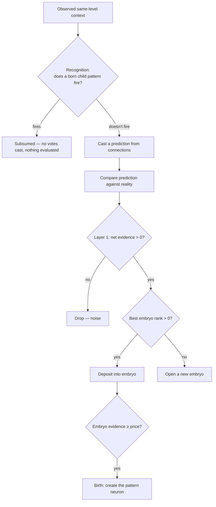

# Spatial Recognition and Correction Creation, v2

Scope: the spatial (d=0) pattern lifecycle — recognition of existing patterns and creation of new ones —
designed to replace the pending-mint ledger described in [algorithm.md](./algorithm.md).
Recognition and Layer 1 evidence carry over from v1 unchanged; everything from the pricing gate onward is redesigned.
The design generalizes to temporal (d>0) processing by swapping the co-occurrence axis (see [Temporal](#temporal-generalization)),
but the spatial side is specified first.

## The economic frame: online facility location

Pattern creation is an instance of the online facility location problem (Meyerson, 2001).

- **Demand points** arrive one at a time: prediction failures, each carrying an observed context and a measured benefit.
- **Opening a facility** — creating a pattern — costs a fixed fee: the pattern's storage price.
- **Serving a point from an existing facility** costs the distance between the point's context and that pattern's context.
- The objective is to minimize total cost: opening fees plus service distances.

The number of clusters is not an input anywhere.
It emerges from the economics: tight recurring context clumps pay for their own facility, scattered noise never does.
This is what makes the mechanism parameterless — the one quantity that looks like a threshold (the opening fee)
is the MDL storage price, not a tuned constant.

The online algorithm's total cost is provably within a constant factor of the best clustering chosen in hindsight.
That guarantee covers the skeleton below; the deviations (evidence decay, center drift) are design judgment on top of it.

## One frame, in order

For each active neuron with same-level context this frame:



## Recognition

Candidate child patterns are found via the same-level context index.
Each candidate is scored by `rank_by_likelihood_ratio` — its own context model against the neuron's background model —
and fires iff its rank is positive; the highest positive rank wins.
No similarity threshold exists anywhere in the decision.

For each context entry `e` the candidate stores with strength `s`, over `n_c` trials (the candidate's decayed activation):

```
e present:  contributes log2( (s / n_c) / p_bg(e) )
e absent:   contributes log2( (1 - s / n_c) / (1 - p_bg(e)) )
p_bg(e) = context count of e / context frames                 // raw MLE, unsmoothed
```

An outcome the background has never witnessed cannot be priced against it, so its term is skipped rather than
smoothed into a finite surprise: a present entry with `p_bg = 0`, or an absent entry whose neighbor has been
co-active on every frame so far (`p_bg = 1`), contributes nothing.

On a fire, matched entries strengthen (`s += 1`) and the pattern's activation strength increments — one event, one increment.

## Layer 1: is this failure worth anything?

When no child fired and the neuron's own prediction diverged from reality, the failure is scored as net evidence —
evidence for a surprise from the misses, minus evidence against one from the hits:

```
evidence_for     = Σ_{present, unpredicted} (1 - p_bg(e))    // rare events appearing out of nowhere
                 + Σ_{predicted, absent}    p_bg(e)          // reliable events vanishing
evidence_against = Σ_{predicted AND present} (1 - p_bg(e))   // correctly calling rare events
benefit = evidence_for - evidence_against
p_bg(e) = inference count of e / inference frames             // raw MLE, unsmoothed
```

`benefit <= 0` drops the failure entirely: an ordinary mismatch on an otherwise-sharp prediction is noise, not signal.
A positive benefit becomes a demand point for the facility-location machinery below.

## The womb: embryos instead of a ledger

Each parent neuron holds a womb: a small set of **embryos**, the not-yet-born cluster centers.
An embryo is context-only and owns no neuron, no connections, and no target data:

- **context center** — per-neighbor count plus an occurrence total `N`; `count / N` is a soft membership distribution.
- **evidence** — accumulated benefit deposited by the failures assigned to it, in the same units Layer 1 produces.

The child's connections are deliberately absent from the womb.
From the parent's perspective a child's connections cost the parent nothing — they belong to the child once it exists,
are seeded at birth from the triggering frame, and are refined by the child's own connection learning afterward.
Pricing or clustering on target data would charge the parent for storage it never holds.

### Assignment (the serve-or-open decision)

A failure's observed context is scored against every embryo's context center with the same likelihood-ratio math
recognition uses on born patterns — an embryo is scored exactly like a routing entry whose strengths are its center counts.
Distance and match quality are one number: the rank.

- **Best embryo with rank > 0**: the failure is served by that embryo.
  Its context counts fold in (`count += 1` per observed neighbor, `N += 1`) and its evidence gains this failure's benefit.
  The center drifts toward the failures actually assigned to it — an online mean, no learning rate.
- **No embryo with positive rank**: the failure opens a new embryo seeded from its own context, with its benefit as opening evidence.

Serving is fuzzy by construction: near-miss contexts pool into the same embryo because the rank is a likelihood ratio,
not an exact-match test.
This is what keeps womb size bounded where an exact-context ledger explodes — one embryo per recurring context cluster,
not one entry per unique context ever observed.

### Birth

An embryo's price is what the parent will actually store for the new child:

```
price = |context| + 1        // context references plus the pattern itself
```

A single occurrence's benefit is structurally smaller than any price
(every term of `benefit` is under 1, and price is at least 2), so nothing can mint on first sight.
Patterns earn their existence by recurring: birth happens when an embryo's accumulated evidence covers its price.

At birth:

- A pattern neuron is created one level above the parent's own level.
- Its routing-table context is the embryo's converged center, not the noisy first sighting.
- Its founding connections are wired from the birth frame's observed base events (id, channel, dimension, reward),
  so it can predict from its first activation; its own connection learning refines them from there.
- The embryo leaves the womb.

### Death

Embryos die two ways:

- **Incoherence**: benefit can be negative, so an embryo fed unrelated failures accumulates negative deposits
  and is removed when its evidence falls to zero or below. No parameter.
- **Staleness**: an embryo holding positive evidence that never gets served again must eventually be evicted.
  This requires a decay rate; deriving it (rather than tuning it) is deferred — see [Open questions](#open-questions).

Born patterns die through the existing activation-decay death cascade, unchanged.

## Temporal generalization

Nothing above is same-frame-specific except which counter supplies co-occurrence.
Spatial context counts answer "how often is this neighbor active in the same frame as the parent";
temporal context counts answer the same question per distance `d`.
The womb, the likelihood-ratio assignment, the price, and the birth/death rules carry over with the distance axis
as a parameter of the background model, not a separate mechanism.

## What this replaces

The v1 pending-mint ledger (`pending_spatial_mints`) matched failures on exact context identity and stored
per-shape present/absent count maps that never merged, never decayed, and were never evicted.
Under wide contexts, exact identity almost never recurs, so the ledger degenerated into one permanent fat entry
per failure — unbounded growth with no pooling.
The womb replaces it: fuzzy assignment pools near-miss contexts, incoherent embryos self-destruct,
and the persisted state per embryo is one count map and one scalar instead of a context set plus two count maps.

## Open questions

- **Staleness decay.** Embryo eviction and born-pattern rent both need a rate.
  A derivation from context length is suspected but not worked out; until then this is the one non-derived
  quantity in the design.
- **Center shedding.** A neighbor that stops co-occurring fades only relatively (its `count / N` dilutes as `N` grows)
  and never leaves the center outright.
  Whether relative dilution suffices, or low-share members need explicit pruning at birth, is unresolved —
  the current birth rule carries the whole center into the child's context.
- **Deviation from the proven skeleton.** Evidence decay and center drift are not part of the algorithm whose
  competitive ratio is proven; the guarantee covers the serve-or-open structure, not these extensions.
