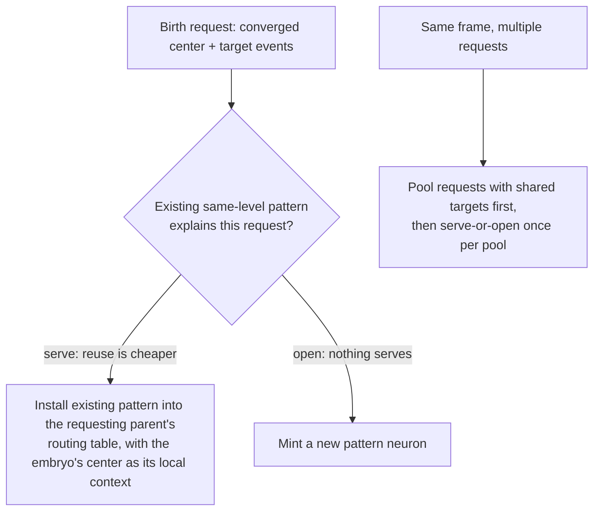
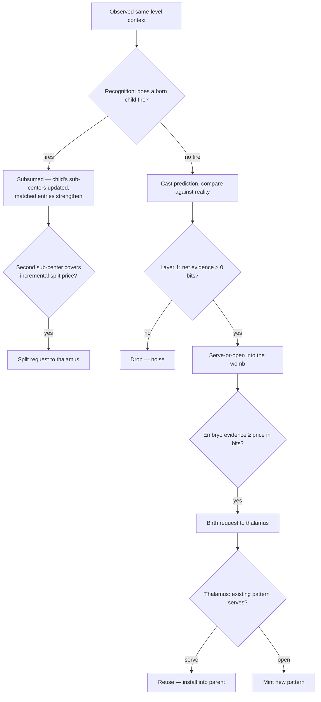

# Pattern Economics and Structural Plasticity, v3

Scope: the full pattern lifecycle — creation, refinement, reuse, and structural revision — built on the womb of
[algorithm2.md](./algorithm2.md). The womb's recognition, Layer 1 gate, and serve-or-open assignment carry over
structurally; what changes is the currency they trade in, the quality of what birth produces, and what happens to
patterns after they exist. Three additions:

1. **One currency.** Benefits and prices are both measured in bits, closing the unit mismatch where evidence was
   summed probability mass and price was a reference count.
2. **Birth quality.** Newborn patterns inherit the embryo's converged distribution instead of a flattened member set,
   and small-sample models are estimated with the KT estimator instead of a capped raw MLE.
3. **Structural plasticity.** Patterns can be reused (merge), defragmented, and split after birth — decided by the
   same economics that govern birth, triggered at the moments requests already flow, with no central statistics.

## The currency: two-part code

The pattern set is a code for the brain's experience. Its total cost has two parts:

```
L(total) = L(model)   bits to store the patterns: names, context entries, connections
         + L(data)    bits to encode what is observed each frame, given the patterns
```

Prediction and compression are the same quantity: a model that predicts well makes observed frames cheap to encode.
The conversion between probability and bits is fixed — an outcome the model assigns probability `p` costs
`-log2(p)` bits. Confident correct predictions are nearly free; confident wrong ones are expensive; a coin flip
costs its full bit. This is a proper scoring rule: no model profits from overclaiming or underclaiming.

Both parts have physical carriers in the substrate:

- **Model bits live in references.** A context entry or connection is a pointer that singles out one neuron among
  the candidates it could have named. Distinguishing one among `N` costs `log2(N)` bits, where `N` is the
  *addressable* population — the alphabet the reference actually chooses from — not the whole brain.
- **Data bits live in activations.** A neuron's firing event carries its own surprisal: a child that fires on one
  frame in a thousand delivers ~10 bits when it fires. The competition among a parent's children is a questionnaire
  and the winner's identity is the answer; the sparse high-level active set is the compressed encoding of the frame.
  Nothing stores this stream — prediction error is its per-frame increment, and the ledgers below meter it.

Every structural decision — create, reuse, merge, split — is one question: does the move reduce `L(total)`?
Accept iff the change is negative. No similarity thresholds exist anywhere in the design.

### Scope: the ledgers are deliberately local

Each neuron keeps its own ledger over its own neighborhood, and the sum of local ledgers is not the brain's
description length — the same base event is witnessed, and billed, by every parent whose neighborhood contains it.
This is accepted: local ledgers gate local decisions cheaply and in parallel, which is what a distributed substrate
requires. The distortion the double-billing causes — many parents independently paying for the same pattern — is
corrected structurally, at the one point where requests converge: the thalamus reuse gate below. Detection is
local; identity is global; nothing else needs a global view.

### Horizon: decay is the window

`L(data)` accrues per frame, so every economic comparison needs a horizon. The horizon is the decayed count: an
embryo's evidence, a pattern's activation strength, and every statistic feeding a structural decision decays on the
forget-rate clock, so "worth its price" always means "worth its price over the window the substrate remembers."
Structure must persist, not merely occur, to justify itself — the same bet birth already makes.

Deriving an optimum forget rate from context length is a planned experiment, not a precondition: every mechanism
here consumes the rate identically wherever it comes from.

## Neuron-side economics, in bits

### Benefit (Layer 1)

A prediction failure is scored as net evidence for a distinct source, all terms in surprisal bits against the
neuron's inference background model `p_bg(e)` (raw MLE, event count / inference frames):

```
evidence_for     = Σ_{present, unpredicted}  -log2(p_bg(e))        // bits a correct prediction would have saved
                 + Σ_{predicted, absent}     -log2(1 - p_bg(e))    // a reliable event vanishing, priced by its reliability
evidence_against = Σ_{predicted AND present} -log2(p_bg(e))        // bits the existing mechanism already saves
benefit = evidence_for - evidence_against
```

Outcomes the background has never witnessed cannot be priced against it and are skipped rather than smoothed into
infinite surprise: a present event with `p_bg = 0`, or an absent event with `p_bg = 1`, contributes nothing — the
same rule recognition applies. A neuron with zero inference frames has no background model and scores every failure
at zero. `benefit <= 0` drops the failure; a positive benefit is a demand point for the womb, unchanged from v2.

### Price

An embryo's price is what the parent will actually store, in bits:

```
price = |center| × log2(alphabet) + log2(children + 1)

alphabet = max(context neighbors ever witnessed, center size)
children = the parent's current child pattern count
```

Each center reference names one neighbor out of the alphabet this parent has actually seen; the pattern's own name
distinguishes it among the parent's children. Both terms are measured from local state the neuron already tracks —
no global population figures. Consequences worth stating plainly: prices scale with neighborhood richness, so
patterns in dense contexts must earn more evidence; and degenerate early alphabets yield near-zero prices, which is
the honest MDL statement — names drawn from a tiny alphabet genuinely cost almost nothing to store. No floor is
imposed. First-sight minting remains structurally impossible: opening an embryo never runs the birth check, so a
pattern is born only when a second failure serves it.

### Embryo death

Deposits are strictly positive (the Layer 1 gate drops non-positive benefits before assignment), so embryo evidence
is only ever driven down by staleness decay on the forget-rate clock. Eviction happens when effective evidence
reaches zero. There is no separate incoherence mechanism; an embryo fed poorly is an embryo whose deposits arrive
too slowly to outrun decay, and it dies the same way.

## Estimation: KT instead of capped MLE

Embryo assignment and born-pattern recognition both score an observed context by log-likelihood ratio: the model's
per-entry probability against the background's. The model side is estimated with the Krichevsky–Trofimov estimator:

```
p_c = (count + 1/2) / (n + 1)
```

KT is the minimax-regret universal estimator — the MDL-native answer to small samples, derived rather than tuned.
It replaces the raw `count / n` with its `min(0.999)` cap, which was an underived constant. The practical effect is
at the cold start: a fresh embryo's entries score as ~0.75-probability members instead of certainties, so a
near-miss second failure receives a mild penalty instead of ~10 bits per absent entry, and fuzzy pooling works in
the regime where boundaries are actually drawn. The background side stays raw MLE with the skip rule — an
unwitnessed outcome is skipped, not smoothed, because the background is the null hypothesis and inventing mass for
it would price surprises against events that never happened.

## Birth: the converged center, actually

At birth the child inherits the embryo's distribution, not its member set:

- each context entry is installed at strength = its center count;
- the child's initial activation strength (the recognition trial count) is the embryo's occurrence total `n`.

So the newborn's likelihood model starts at `p_c = count / n` per entry — the soft membership the womb converged
to. A neighbor served once in fifty enters at weight 1/50, its absence costs ~0 bits, and it dilutes away through
ordinary refinement instead of rendering the pattern unfireable. Center shedding needs no explicit prune rule:
low-share members are born low and fade. The child also inherits `n` as its initial lifetime — a pattern born from
more evidence starts further from death, which is the same evidence buying the same durability.

Founding connections are wired from the birth frame's observed base events, unchanged from v2: the child predicts
from its first activation and its own connection learning refines from there. Patterns represent situations; their
initial reaction to the situation may be poor, and learning it is the child's job, not grounds for death. Death
remains what it was — the situation stops recurring and activation decays away.

## Context refinement: plasticity of degree one

Refinement is the counting form recognition already implements: on a fire, matched entries strengthen and absent
entries dilute relatively as the trial count grows. This is an online mode collapse — the context converges to the
recurring core of the frames the pattern actually fires on. Two properties matter:

- **Boundary repair.** A situation whose boundary was drawn slightly wrong at birth converges to the right boundary
  through ordinary fires. Structure below the level of "which patterns exist" self-corrects continuously.
- **Narrow-then-remint.** A pattern pooling two situations sharpens toward the dominant one; its rank on the
  minority mode eventually goes negative and it stops firing there. Subsumption releases those frames, the parent's
  womb re-accumulates, and the minority situation mints separately. Refinement is not a split operator, but it is
  an eviction operator that lets the womb do the splitting — slowly, at the cost of re-paying the price.

The hard add/remove form of refinement — snapping the stored context toward each fired frame — is rejected: it
tracks the most recent frame instead of converging to a mode, and churns under alternating situations.

## Connection refinement: the reaction is always plastic

A pattern's context says when it fires; its connections say what it predicts when it does. The connections are
refined by ordinary connection learning on every frame the pattern is active: edges toward observed co-actives
strengthen, rewards update by exponential smoothing, and prediction is the position-winner competition — the
strongest bucket per position wins, so the effective prediction is the modal configuration of the frames the
pattern actually fires on. Connections never decay in absolute strength; forgetting is competitive and economic:

- **Contested positions displace.** When the frames a pattern fires on shift, the newly recurring targets
  out-strengthen the stale ones and win their positions. The old prediction is outvoted, not erased.
- **Uncontested residue goes economically weightless.** A stale target nothing displaces keeps being predicted and
  keeps missing — but each miss is priced at `-log2(1 - p_bg)`, and as the stale event stops appearing in the
  pattern's inference neighborhood its background frequency dilutes toward zero, so the miss price decays toward
  zero bits. The background model forgets on the ledger side even though the synapse persists; the residue costs
  memory, never economics.

This is also the whole death semantics of multi-parent children. A pattern with parents A and B error-corrects X
for A and Y for B. When A's routing entry decays out and A releases the pattern, it continues to infer X at first;
but it now fires only on B's frames, so refinement drifts its connections toward Y, X's targets lose their
contested positions, and X's uncontested remainder dilutes into weightlessness. No explicit weakening rule exists
or is needed — release-on-last for the pattern's existence, and refinement plus background dilution for everything
it once predicted.

## Structural plasticity

### The signal division

Co-occurrence and identity are different signals with different owners:

- **Co-occurrence belongs to the hierarchy.** Two patterns persistently co-firing is same-level context for the
  level above — food for the womb, which builds a conjunction pattern on top. This is the existing machinery and
  nothing else consumes its signal.
- **Identity belongs to the thalamus.** Two patterns being the *same thing* — near-identical connection sets,
  interchangeable contexts — is invisible to any neuron and useless to the hierarchy. Building a conjunction over
  two copies of one thing represents an identity as a structure, which is the pathology behind apex explosion.

No central firing statistics are kept. There is no co-fire matrix. Every structural check below is attached to an
event that already flows through the system, in the style of online dictionary compressors: invariants enforced at
the moment a count changes, never by a sweep. (Sequitur mints a rule the instant a digram repeats and dissolves it
the instant its use count drops; adaptive Huffman restructures its whole codebook one local swap per increment; CTW
never commits at all, carrying both merge and split hypotheses as weights — with KT as its leaf estimator.)

### Merge = reuse, decided at birth-request time

A birth request arriving at the thalamus is a demand point, and existing same-level patterns are the facilities.
Serve-or-open, one level up from the womb:



The serve test is the same MDL question in the same units: serving costs one routing entry in the requesting parent
(`|center| × log2(alphabet)` bits, which the parent pays either way) plus whatever the existing pattern's
connection model loses by covering a second parent's frames; opening costs a full new pattern — name, connections,
everything the request would create. For genuine duplicates — the common case, since overlapping neighborhoods
witness the same situation — serving wins by roughly the entire cost of the duplicate.

Candidate lookup is by target signature: patterns predicting substantially the same base events as the request's
target events. Requests born in the same frame are pooled before lookup — parents witnessing one surprise from
adjacent neighborhoods produce requests with heavily overlapping targets, and one child serves the whole pool.

A served pattern becomes a **multi-parent child**: one connection set, one id, and per-parent routing entries, each
with its own context view, its own activation strength, and its own death clock. The pattern dies in a parent when
that parent's entry decays out, and dies entirely when its last parent releases it. What it predicted for a parent
that released it is forgotten indirectly, through connection refinement — see
[Connection refinement](#connection-refinement-the-reaction-is-always-plastic).

### Defragmentation: the runner-up trigger

Two children of one parent cannot co-fire — recognition fires at most one — so duplication inside a parent shows up
as interchangeability: whenever A wins, B is the perennial near-rank runner-up. The parent sees this in the
tournament it already runs, for free. A persistent runner-up (tracked as a decayed count on the routing entry) is a
merge proposal sent up with the frame's results. The thalamus applies the standard test: the pooled model codes the
union of both children's frames at some cost; if the fragments were one situation, the pooled probabilities are
*more* accurate (each fragment had overfit its half) and the merge saves both data bits and a pattern's storage; if
they were genuinely different, the pooled model is broader, codes every frame worse, and the merge rejects itself.

### Split: the post-natal womb

A pattern's own context counts cannot reveal that its frames are bimodal — marginals discard the correlation that
distinguishes one noisy situation from two clean ones. The statistic that preserves mode structure is the womb's
own machinery, reused: each born pattern carries a small set of **sub-centers**, and every frame it fires, the
observed context is served into them by the same serve-or-open likelihood-ratio assignment embryos use. A unimodal
pattern's matches all serve one sub-center; a bimodal pattern's matches sort themselves into two.

A split is proposed when the second sub-center's accumulated evidence covers the *incremental* price of the split:
one new pattern name plus the entries by which the two tightened centers exceed the original. The data side of the
test includes the chooser term — with two patterns, each frame must also encode which one fired, ~1 bit — which is
what makes gratuitous splits permanently unprofitable: splitting a unimodal pattern buys zero data bits and pays
storage plus a bit per frame forever. Split and merge of the same pair evaluate the same difference with opposite
signs, so an accepted split implies the reverse merge rejects: the system cannot oscillate.

On an accepted split, the thalamus executes: two children seeded from the two sub-centers' converged counts (the
same birth-seeding rule), the original's activation strength divided by each sub-center's share, the original
released. Detection is entirely local; the thalamus only allocates ids and wires.

## One frame, in order



## What this replaces

Relative to [algorithm2.md](./algorithm2.md): the benefit formula's linear-probability terms become surprisals and
the price `|context| + 1` becomes reference bits against the local alphabet — the two sides of the ledger now share
a unit, and the exchange rate between "surprise" and "storage" stops being an implicit constant. The incoherence
death path is removed as a claim: it was unreachable (the Layer 1 gate never lets negative deposits reach the
womb), and staleness decay is the one eviction mechanism. Birth previously installed every center member at full
strength over one trial, which made newborns nearly unfireable when carrying low-share members; seeding from the
converged counts replaces it and retires the center-shedding question. Everything after birth — reuse, defrag,
split — is new; v2 patterns were immutable structure that could only die.

## Implementation plan

Phased so each lands independently and is measured before the next. The standing metrics per phase: MNIST accuracy,
neuron counts per level, apex pattern count, and wall-clock per frame.

**Phase 1 — currency (done).** `compute_spatial_evidence` in surprisal bits with skip rules and a zero-frames
guard; womb price as `|center| × log2(alphabet) + log2(children + 1)`. Minting rates shift under the new units;
this phase is measured before anything else changes. Note: wombs serialized under v2 carry evidence in linear
units; they decay away harmlessly but cross-version snapshots should not be used for measurements.

**Phase 2 — estimation and birth seeding.** KT estimator in embryo assignment and pattern recognition ranking,
removing the 0.999 cap. Birth seeding: context entry strengths from center counts, initial activation strength from
the embryo's `n` (plumbed through the correction request and install op, which currently carry only the member
list). Expected effects: fewer fragmented embryos, newborns that fire and refine, lower dead-on-arrival pattern
counts.

**Phase 3 — thalamus reuse.** The largest phase, gated on a plumbing audit first: per-parent routing entries
already exist, but subsumption, the death ledger, and the delete cascade assume one parent per pattern, and
"dead in one parent, alive in another" needs an owner. Then: a target-signature index over existing patterns
(maintained at mint/death, queried at request time), same-frame request pooling by target overlap, the MDL serve
test, and an install-into-parent op for served requests. Measured primarily by apex pattern count and per-level
neuron counts — this is the phase aimed at the apex explosion.

**Phase 4 — post-natal womb and split.** Sub-centers on born patterns (the embryo struct reused, serialized with
the routing entry), served on each fire; split request when the second sub-center covers the incremental price;
thalamus-side execution with activation division. Measured on deliberately pooled synthetic situations — two
interleaved contexts with distinct targets — for split latency and correctness, then on MNIST.

**Phase 5 — defragmentation.** Decayed runner-up counts on routing entries, merge proposals over a persistence
line derived from the same economics (the pooled-versus-separate coding test), thalamus-side execution. Last
because phases 2 and 3 should prevent most fragmentation from arising; this phase collects what still slips
through.

## Open questions

- **Serve-test tractability.** The reuse decision compares coding costs that depend on the existing pattern's fit
  to the requesting parent's frames, which the thalamus cannot observe directly. The practical proxy — target-set
  overlap between the request and the candidate — needs validation against cases where targets overlap but
  contexts genuinely differ.
- **Temporal generalization.** As in v2, the mechanisms are not same-frame-specific: the distance axis parameterizes
  the background model, and the currency, KT estimation, and structural moves carry over. The temporal side keeps
  its own parallel structures; nothing here unifies them.
