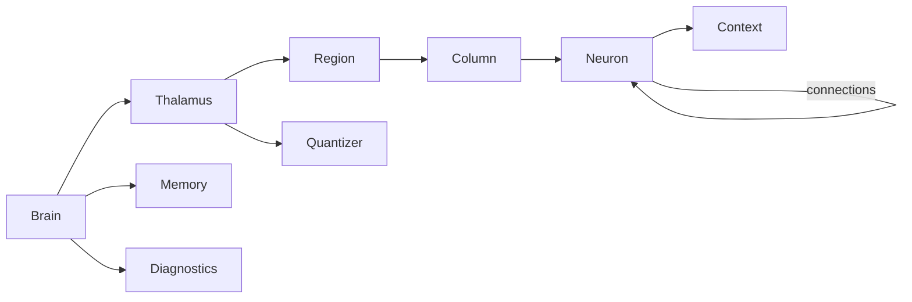
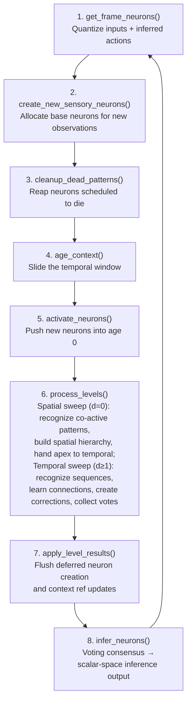

# Brain Architecture Design Document

## Overview

This document describes the architecture of an artificial intelligence system that learns cause and effect through prediction and error correction. The brain is fundamentally a **prediction machine** - every neuron and pattern exists to predict what fires alongside it (in space) and what comes next (in time).

Processing is **spatio-temporal**. Each frame runs two sweeps over the active neurons: a **spatial** sweep over inputs that co-fire in the same frame (connection distance 0 — e.g. neighboring pixels, co-moving stocks), and a **temporal** sweep over sequences across frames (distance ≥ 1). Each sweep builds its own hierarchy of correction patterns; the non-subsumed apex of the spatial sweep is handed off into the temporal sweep, so spatial features become tokens the temporal layer sequences over.

## Core Principles

### 1. Prediction is the Foundation
The brain continuously predicts future events and actions. Learning occurs when predictions fail - these failures create structure that captures the context needed to make better predictions.

### 2. Abstraction Emerges from Failure
When a prediction fails, a **pattern** is created to remember the specific context where the failure occurred. Higher levels of abstraction don't exist by design - they emerge because lower levels made mistakes that needed correction.

### 3. Parent Neurons are Decision Points
A **parent neuron** is a neuron that has learned something. It encountered a situation where its simple connections weren't sufficient, so it created a pattern to remember "in THIS context, predict THAT instead."

### 4. Cause and Effect Interweave
Events predict events. Events predict actions. Patterns of events predict patterns. Actions feed back as observations. Two hierarchies dance together:
- **Event hierarchy**: Learns what IS (passive, association-based)
- **Action hierarchy**: Learns what to DO (active, trial-and-error)

### 5. Distributed Cognition via Voting
There's no central controller. Every active neuron and pattern contributes its vote. Intelligence emerges from consensus, weighted by level and temporal proximity.

### 6. Space and Time are Structural
Distance is built into every connection. **Distance 0 is spatial** — neurons that co-activate within the same frame (e.g. neighboring pixels). **Distance ≥ 1 is temporal** — neurons that follow one another across frames. Each frame the brain runs a spatial sweep (d=0 co-activation) and a temporal sweep (d>0 sequences), each maintaining its own hierarchy of correction patterns, with the spatial apex handed off into the temporal sweep. Space and time are first-class citizens, not afterthoughts.

---

## Implementation Architecture

### Core Classes

The system uses an **in-memory architecture** with CSV-based file persistence. The brain core is implemented in Rust with Rayon multi-threading:

#### Brain (`brain-core/src/brain.rs`)
Top-level orchestrator that coordinates all components:
- Frame processing loop (`process_frame` is the single entry point per time step)
- Voting consensus and inference
- Context aging and activation
- Delegates pattern recognition, connection learning, and error correction to Thalamus → Region → Column dispatch

#### Thalamus (`brain-core/src/thalamus.rs`)
Relay station for reference frame transfers (named after biological thalamus):
- **Central metadata**: Neuron-to-coordinate, level, parent, and channel lookups
- **Neuron lookup**: Fast coordinate-based lookup for sensory neurons
- **Channel/dimension registries**: Manages channel specs and dimension-to-ID mappings
- **Region tree**: Owns Region[R], each Region owns Column[C], each Column owns Neurons
- **Death ledger**: Scheduled neuron deaths for lazy decay cleanup
- **Quantizer**: Scalar-to-bucket discretization

#### Region (`brain-core/src/region.rs`)
Column partitioner and parallel dispatcher:
- **Routing**: Partitions work items into per-column task lists by `neuron_id % C`
- **Dispatch**: Hands each column its work and runs them in parallel via Rayon
- **Collect**: Gathers results in column-index order

#### Column (`brain-core/src/column.rs`)
Owns a partition of Neuron instances:
- **Batch operations**: Pattern recognition, connection learning, error correction, voting
- **Exclusive ownership**: Each column owns its neurons — no locks needed during parallel dispatch

#### Memory (`brain-core/src/memory.rs`)
Temporal sliding window for short-term memory:
- **Active neurons**: Keyed by activation frame number; age is derived as `frame_number - activation_frame`
- **Inferred neurons**: Winning predictions from previous frame
- **Level/age indexes**: Fast lookup by level and by age
- **Aging**: Bumps frame counter and evicts expired entries (no per-neuron migration)

#### Neuron (`brain-core/src/neuron.rs`)
Unified struct for all neurons (sensory and pattern):
- **Connections**: `Vec<FxHashMap<NeuronId, ConnectionData>>` indexed by distance — with lazy decay
- **Routing table**: `FxHashMap<PatternId, RoutingEntry>` — child pattern contexts for context-specific predictions
- **Voting**: Generates votes weighted by level and time
- **Learning**: Creates connections and patterns from observations
- **Lazy Decay**: Strengths decay continuously based on frames elapsed since last activation
- **Note**: All neuron metadata (level, coordinates, channel, type, parent) is stored externally in Thalamus lookup tables. Neurons are pure data processors.

#### Context (`brain-core/src/context.rs`)
Pattern context representation and matching:
- **Entries**: `FxHashMap<NeuronId, FxHashMap<Distance, Strength>>` for O(1) lookup
- **Matching**: Threshold-based pattern recognition
- **Merging**: Strengthens common, adds novel, weakens missing

### Class Relationships



---

## Events and Actions

The brain uses a **single unified hierarchy** — events and actions share the same neuron types, the same pattern structure, and the same connection machinery. The differences are in how connections are updated and how winners are selected.

### Connection Learning

When a neuron is active at age > 0 and a new neuron appears at age 0:
- Create or strengthen connection at distance = age
- Reward updates via exponential smoothing (alpha = 1/strength)

**Key difference**: Event connections are **weakened** when a predicted neuron doesn't appear (wrong prediction). Action connections are **never weakened** — the brain executes exactly one action per channel per frame, so any non-chosen action wasn't a wrong prediction, it just wasn't tried. Weakening it would collapse the brain onto whichever action it happened to try first and destroy exploration.

### Error Correction (Pattern Creation)

Patterns are created only from **event prediction errors** — when the ratio of failed event predictions exceeds the per-(neuron, age) threshold. Actions are filtered out of the error calculation entirely; they are judged by reward, not by hit/miss.

When a pattern is created and the parent had action connections with **negative reward**, the brain injects an alternative action connection at neutral reward (0.0) — giving the brain something else to try next time without penalizing the original.

### Winner Selection

| Aspect | Events | Actions |
|--------|--------|---------|
| Scoring | Probability: strength / dimension total | Expected reward: weighted average |
| Winner | Highest probability | Highest expected reward |
| Connection weakening | Yes (wrong predictions) | Never |
| Error correction trigger | Yes (misprediction ratio) | No |
| Negative reward handling | N/A | Inject alternative action at neutral reward |

### Exploration

When no action is inferred for a channel, the brain uses the channel's configured `defaultAction`. This builds connections between active neurons and the exploration action, enabling learning from exploration.

---

## Voting Architecture

### Vote Collection

All active neurons (at all levels) cast votes for what they predict will happen next.

**Implementation** (inside `process_levels`, dispatched to each Column):
1. Iterate through active neurons at ages 0 to contextLength-2
2. Skip neurons with activated patterns (pattern override)
3. Call `neuron.vote(age, timeDecay)` to get votes
4. Save votes and context in memory for pattern learning
5. Return all votes for consensus

**Vote Generation** (`neuron.vote()`):
- Get connections at distance = age + 1 (predicting next frame)
- Weight each connection by level and time
- Return array of {neuron, strength, reward, distance}

### Pattern Override Rule

When a pattern activates on a parent neuron, the parent's connection votes are suppressed.

**Implementation**:
- During pattern recognition, matched patterns are activated
- `memory.activatePattern(pattern, parent, age)` sets `state.activatedPattern = pattern`
- During vote collection, neurons with `state.activatedPattern !== null` are skipped
- This prevents the parent from voting via its connections when a pattern is active

**Why**: Patterns exist to correct connection predictions. When a pattern matches, it knows better than the raw connections.

### Consensus Determination

**Implementation** (`brain.determine_consensus()`):

1. **Aggregate votes**: Sum effective strengths per target neuron
2. **Calculate rewards**: Weighted average of vote rewards (for actions)
3. **Select winners per dimension** (each base neuron has exactly one dimension):
   - Events: highest total strength wins; probability = strength / total dimension strength
   - Actions: highest weighted reward wins
4. **Return winners**: One winner per dimension

**Example**:
```
Votes: [
  {neuron: price_up, strength: 10, reward: 0.5},
  {neuron: price_up, strength: 5, reward: 0.3},
  {neuron: price_down, strength: 8, reward: -0.2}
]

Aggregation:
  price_up: strength=15, reward=(10*0.5 + 5*0.3)/15 = 0.43
  price_down: strength=8, reward=-0.2

Winner (event): price_up (highest strength)
Winner (action): price_up (highest reward)
```

---

## Data Structures

### In-Memory Structures

#### Neuron (stored in Column)
```rust
struct Neuron {
    // Connections: predictions indexed by distance
    connections: Vec<FxHashMap<NeuronId, ConnectionData>>,
    // Routing table: child pattern contexts for context-specific predictions
    routing_table: FxHashMap<NeuronId, RoutingEntry>,
    // Reverse references: which patterns reference this neuron in their context
    context_refs: FxHashMap<NeuronId, FxHashSet<Distance>>,
    // Per-age error statistics for dynamic error correction thresholds
    error_stats: FxHashMap<Distance, WelfordState>,
    // Activation tracking for lazy decay
    activation_strength: f64,
    last_activation_frame: FrameNumber,
}
```

All neuron metadata (id, level, coordinates, channel, type, parent) is stored externally in Thalamus lookup tables — neurons are pure data processors that operate on numeric IDs.

#### Memory
```rust
struct Memory {
    context_length: u32,
    frame_number: FrameNumber,
    // Active neuron states keyed by activation frame (age = frame_number - activation_frame)
    neuron_states: FxHashMap<NeuronId, FxHashMap<FrameNumber, LevelAgeState>>,
    // Fast age queries — frame → set of neuron ids activated at that frame
    age_index: FxHashMap<FrameNumber, FxHashSet<NeuronId>>,
    // Fast level queries — level → frame → set of neuron ids
    level_index: FxHashMap<Level, FxHashMap<FrameNumber, FxHashSet<NeuronId>>>,
    // Current frame winning inferences
    inferred_neurons: Vec<InferredNeuron>,
}
```

#### Context
```rust
struct Context {
    // entries: neuronId → (distance → strength) for O(1) lookup
    entries: FxHashMap<NeuronId, FxHashMap<Distance, Strength>>,
}
```

### CSV-Based File Persistence

Used for backup/restore between episodes, not during frame processing. Backup is a folder of CSVs under `<jobDir>/backups/<YYYY-MM-DD_HH-mm-ss>/`:

- **`channels.csv`** — Channel registry (id, name)
- **`dimensions.csv`** — Dimension names (id, name)
- **`neurons.csv`** — All neurons (id, level)
- **`base_neurons.csv`** — Sensory neuron metadata (neuron_id, channel_id, type, dimension_id, val)
- **`connections.csv`** — Neuron connections (from_neuron_id, to_neuron_id, distance, strength, reward)
- **`patterns.csv`** — Pattern-to-parent mappings (pattern_neuron_id, parent_neuron_id, strength)
- **`contexts.csv`** — Pattern contexts (pattern_neuron_id, context_neuron_id, context_age, strength)
- **`neuron_error_stats.csv`** — Per-(neuron, age) Welford stats (neuron_id, age, n, mean, m2)

The CSV format is compatible with MySQL `LOAD DATA INFILE` — the `apps/db` tool can bulk-load backups into MySQL for analysis.

---

## Frame Processing Flow

> **Note:** Code examples in this section are JavaScript-style pseudocode illustrating the algorithms. The actual implementation is in Rust — see `brain-core/src/` for the real code.



The brain processes each frame through `process_frame(inputs, rewards)`:

### 1. get_frame_neurons()
**Purpose**: Quantize raw scalars and build the frame

```javascript
// Quantize each dimension's scalar to a bucket ID
for (channel of channels) {
  for ([dimId, scalar] of inputs.get(channel)) {
    quantizer.observe(dimId, scalar)
    bucketId = quantizer.quantize(dimId, scalar)
    frame.push({coordinate: {dimId, bucketId}, channel, type: 'event'})
  }
}

// Append previously-inferred actions as sensory inputs
for (action of memory.getInferredActions()) {
  frame.push({coordinate: action.coordinate, channel, type: 'action'})
}
```

### 2. create_new_sensory_neurons()
**Purpose**: Allocate base neurons for first-seen coordinates

### 3. cleanup_dead_patterns()
**Purpose**: Reap neurons scheduled to die at this frame, then cascade-delete orphaned children

### 4. age_context()
**Purpose**: Slide the temporal window and push rewards

```javascript
// Push this frame's rewards onto the history
rewards.insert(0, frameRewards)
if (rewards.length > contextLength) rewards.pop()

// Advance the frame counter; entries older than contextLength are evicted
memory.age(frameNumber)
```

### 5. activate_neurons()
**Purpose**: Push new neurons into age 0 and track inference accuracy

```javascript
for (neuronId of frameNeuronIds) {
  level = thalamus.getNeuronLevel(neuronId)
  memory.activateNeuron(neuronId, level)
}

// Compare what was inferred last frame against what actually appeared
diagnostics.trackInferencePerformance(...)
```

### 6. process_levels() — the spatio-temporal sweep
**Purpose**: The main learning step. The frame is processed in **two sweeps**, each walking its own
hierarchy level by level, dispatched to Region → Column (parallel via Rayon). They share the same
per-level machinery and differ only in the connection distance they operate on.

**Spatial sweep (distance 0 — co-activation).** Over the inputs that fired this frame, finds which
neurons co-activate *together*, matches spatial patterns, and mints spatial corrections when the
co-activation prediction errs. The non-subsumed survivors form the **apex set**, which is handed off
into the temporal sweep — so a recognized spatial feature enters the temporal layer as one token rather
than its raw constituents.

**Temporal sweep (distance ≥ 1 — sequence).** Over the apex set (plus carried-forward actions), walks
levels bottom-up. Each active neuron at a level:

- **Recognizes patterns**: matches child patterns against the observed context
- **Learns connections**: strengthens co-occurrence links across frames
- **Creates error corrections**: when prediction error exceeds threshold, mints a new temporal pattern
- **Collects votes**: each neuron votes on what it predicts next

```javascript
// --- Spatial sweep: distance-0 co-activation ---
spatial = process_spatial(frameEvents)        // match spatial patterns, mint d=0 corrections
apex    = spatial.fired \ spatial.subsumed    // non-subsumed survivors
memory.handoffToTemporal(apex)                // spatial features become temporal tokens

// --- Temporal sweep: distance ≥ 1 sequences ---
level = 0
while (level <= maxActiveLevel) {
  levelNeurons = memory.getTemporalLevelNeurons(level)
  result = thalamus.processTemporalLevel(level, levelNeurons, sensoryNeurons, rewards, ...)
  for (activation of result.activations) {
    memory.activatePattern(activation.patternId, level + 1, activation.parentId, activation.age)
  }
  level++
}
```

Each sweep maintains an independent hierarchy: a neuron has a `spatial_level` and a `temporal_level`,
which advance independently as corrections are minted on each axis.

### 7. apply_level_results()
**Purpose**: Flush deferred neuron creation and context reference updates in one batch

### 8. infer_neurons()
**Purpose**: Voting consensus → scalar-space inference output

```javascript
// Aggregate votes and determine winners per dimension
inferences = determineConsensus(votes)

// Ensure all channels have actions (explore if none inferred)
ensureChannelActions(inferences)

// Save inferences to memory for next frame
memory.saveInferredNeurons(inferences)

// Return per-channel scalar-space inference output to host
return buildInferencesByChannel(candidates, dimBest)
```

### Action dispatch (host side)

Inferred actions come back from `brain.processFrame(inputs, rewards)` as part of the per-channel inference map. The host (app-layer trader / encoder / whatever owns the channel) pulls the action and executes it — the brain itself does not dispatch.

The system uses **lazy decay** instead of periodic forget cycles. Strengths are computed on-demand:

```javascript
effectiveStrength = strength - (frameNumber - lastActivationFrame) * decayRate
```

When a connection or pattern context entry's effective strength drops to zero or below, it is deleted. Patterns with no remaining content or references are recursively cleaned up.

This eliminates the need for batch decay passes and provides smooth, continuous forgetting.

---

## Channel Interface

Channels live entirely on the host side — the brain knows nothing about I/O, sensors, or traders. Each app owns an encoder (and optionally a trader) that:
  1. Describes its channel to the brain via a **channel spec** (`brain.registerChannelSpec(spec)`), which lists the channel's dimensions, their bucket resolutions, quantizer modes (`passthrough` / `static` / `dynamic`), and whether each dim is an input (event) or output (action). The brain allocates a channel ID and per-dimension IDs and returns them as `{ channelId, dimensionIds }` so the encoder can key its frame outputs off the allocated dim IDs.
  2. Feeds raw per-dimension scalars to `brain.processFrame(inputs, rewards)` each frame. The brain quantizes, learns, and returns per-channel inferences; the host dispatches actions back to whatever the app drives.

### Channel Spec Shape

```javascript
{
  name: 'AAPL',             // channel name (string)
  emitsReward: true,        // does the channel produce a reward signal each frame
  learnActionSequences: false,  // should action neurons participate in pattern learning
  dimensions: [
    { name: 'AAPL_price_change',  kind: 'input',  resolution: 2,
      mode: 'static', boundaries: [0] },
    { name: 'AAPL_volume_change', kind: 'input',  resolution: 2,
      mode: 'static', boundaries: [0] },
    { name: 'AAPL_activity',      kind: 'action', resolution: 2,
      mode: 'passthrough',
      actions: [-1, 1], defaultAction: -1 }
  ]
}
```

### Example: Stock Encoder

```javascript
class StockEncoder {
  constructor(symbol) {
    this.symbol = symbol;
    this.priceChangeDimName  = `${symbol}_price_change`;
    this.volumeChangeDimName = `${symbol}_volume_change`;
    this.activityDimName     = `${symbol}_activity`;
    this.channelId = null;
    this.priceChangeDimId = null;
    this.volumeChangeDimId = null;
    this.activityDimId = null;
  }

  // Raw scalars per dimension — the brain's quantizer bucketizes these.
  encode(frame) {
    const priceChange  = (frame.price - frame.previousPrice) / frame.previousPrice * 100;
    const volumeChange = (frame.volume - frame.previousVolume) / frame.previousVolume * 100;
    const dimMap = new Map();
    dimMap.set(this.priceChangeDimId, priceChange);
    dimMap.set(this.volumeChangeDimId, volumeChange);
    return dimMap;
  }

  getChannelSpec() { /* … see shape above … */ }
  bindIds({ channelId, dimensionIds }) {
    this.channelId = channelId;
    this.priceChangeDimId  = dimensionIds[this.priceChangeDimName];
    this.volumeChangeDimId = dimensionIds[this.volumeChangeDimName];
    this.activityDimId     = dimensionIds[this.activityDimName];
  }
}
```

---

## Key Hyperparameters

All passed to `Brain::new()` and propagated to Thalamus → Region → Column → Neuron:

| Parameter                | Default          | Location | Description                                                                                                                                  |
|--------------------------|------------------|----------|----------------------------------------------------------------------------------------------------------------------------------------------|
| errorCorrectionMode      | `'conservative'` | Brain    | Threshold function for pattern creation: `static`, `conservative` (mean+σ), `neutral` (mean), `aggressive` (mean−σ). See error-driven-learning.md. |
| errorCorrectionThreshold | 0.5              | Brain    | Static threshold (when mode=`static`); warmup fallback for dynamic modes (first 3 samples per (neuron, age))                                |
| contextLength            | 10               | Memory   | Frames a neuron stays active                                                                                                                 |
| mergeThreshold           | 0.5              | Context  | Min match ratio for pattern recognition                                                                                                      |
| patternForgetRate        | 0.01             | Neuron   | Pattern prediction strength decay rate per frame                                                                                             |

---

## Summary

This architecture implements a theory of how minds work:

### Core Principles
- **Prediction** drives all learning
- **Failure** creates structure (patterns)
- **Events** learn passively through association
- **Actions** learn actively through trial-and-error
- **Voting** enables distributed decision-making with level and time weighting
- **Time** is built into the representation
- **Patterns override connections** to correct prediction errors

### Implementation Highlights
- **Rust core with Rayon parallelism**: Brain → Thalamus → Region[R] → Column[C] → Neurons; columns run in parallel with no shared mutable state
- **In-memory processing**: All learning in Rust data structures (no DB queries during frames)
- **Unified neuron struct**: Sensory and pattern neurons share common functionality; metadata stored externally in Thalamus
- **Thalamus relay**: Centralizes neuron metadata, channel/dimension registries, death ledger, and quantizer
- **Temporal sliding window**: Memory manages active neurons keyed by activation frame (age is derived)
- **Context matching**: Fast threshold-based pattern recognition via `FxHashMap` lookups
- **Lazy decay**: Continuous strength decay computed on-demand (no periodic forget cycles)
- **CSV file persistence**: Backup/restore between episodes; compatible with MySQL bulk-load for analysis

The code is just the implementation. The architecture is a model of intelligence.

