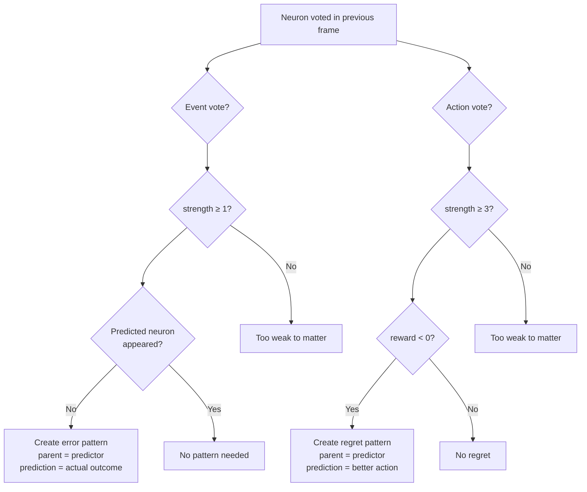
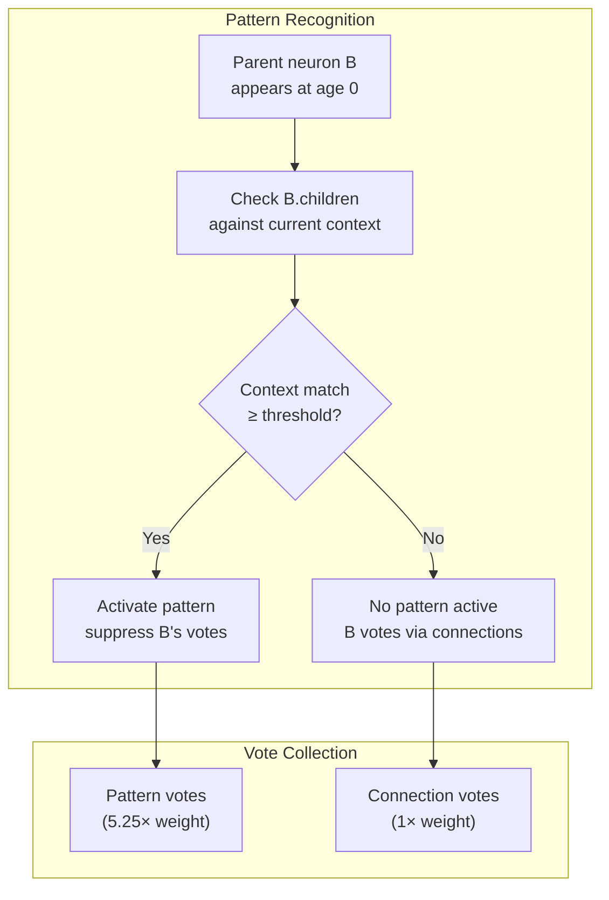
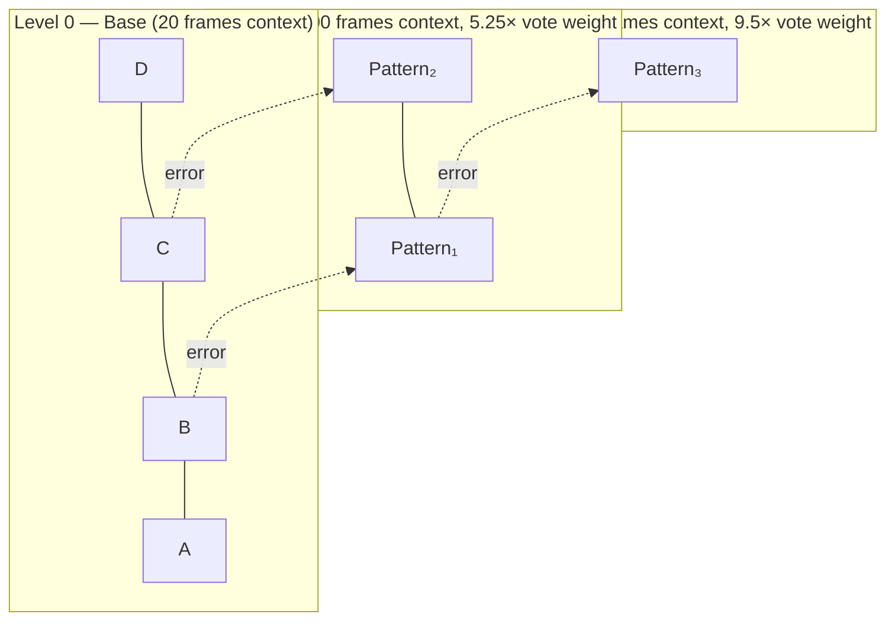

# Error-Driven Learning

## Overview

Error-driven learning is the mechanism by which the brain creates patterns. Patterns are **only** created when confident predictions fail - not during normal recognition. This produces sparse, meaningful patterns focused on correcting prediction errors rather than memorizing noise.

**Key Properties:**
- Patterns created only when prediction strength >= threshold AND prediction fails
- The **predictor neuron** (not the failed prediction) becomes the pattern's parent
- Pattern captures the temporal context when the error occurred
- Pattern stores the correct prediction for future use
- Multiple patterns per neuron handle different contexts independently

---

## When Patterns Are Created

Patterns are created by `brain.learnNewPatterns()` which calls `neuron.learnNewPattern()` in two scenarios:

### 1. Event Prediction Errors

When a neuron confidently predicted an event that didn't happen:
- Neuron voted in previous frame (has saved votes and context)
- Vote strength >= `eventErrorMinStrength` (default: 1)
- Vote type is 'event'
- The predicted neuron did NOT appear in current frame
- Create a pattern with the predictor as parent

**Implementation**:
```javascript
for ({neuron, age, votes, context} of memory.getVotersWithContext()) {
  for (vote of votes) {
    if (vote.neuron.type === 'event' &&
        vote.strength >= eventErrorMinStrength &&
        !newActiveNeurons.has(vote.neuron)) {
      // Strong prediction failed - create error pattern
      pattern = neuron.createPattern(context, newActiveNeurons)
      return pattern
    }
  }
}
```

### 2. Action Regret

When an action resulted in negative reward:
- Neuron voted for an action in previous frame
- Vote strength >= `actionRegretMinStrength` (default: 3)
- Vote type is 'action'
- The action's reward < `actionRegretMinPain` (default: 0)
- Create a pattern to try alternative actions

**Implementation**:
```javascript
for ({neuron, age, votes, context} of memory.getVotersWithContext()) {
  for (vote of votes) {
    if (vote.neuron.type === 'action' &&
        vote.strength >= actionRegretMinStrength) {
      reward = rewards.get(vote.neuron.channel)
      if (reward < actionRegretMinPain) {
        // Painful action - create regret pattern
        alternativeActions = getAlternativeActions(vote.neuron, channelActions)
        pattern = neuron.createPattern(context, alternativeActions)
        return pattern
      }
    }
  }
}
```



---

## Pattern Structure

When neuron C predicts D but E appears instead:

### In-Memory Structure

```javascript
// Pattern neuron created at level 1
pattern = Neuron.createPattern(level=1, parent=C)

// Parent neuron C adds pattern to its routing table (children)
C.children.add(pattern)

// Pattern stores context (neurons active when C voted)
pattern.context = new Context()
pattern.context.addNeuron(B, distance=1, strength=1)  // B was at age=1
pattern.context.addNeuron(A, distance=2, strength=1)  // A was at age=2
pattern.context.addNeuron(X, distance=3, strength=1)  // X was at age=3

// Pattern stores predictions (what actually happened)
pattern.connections.set(distance=1, new Map([
  [E, {strength: 1, reward: 0}]  // E appeared at distance=1
]))

// Reverse references for cleanup
B.contextRefs.set(pattern, new Set([1]))
A.contextRefs.set(pattern, new Set([2]))
X.contextRefs.set(pattern, new Set([3]))
```

### MySQL Persistence (Optional)

When backed up to database:

```sql
-- Pattern neuron
INSERT INTO neurons (id, level) VALUES (pattern.id, 1)

-- Parent mapping
INSERT INTO patterns (pattern_neuron_id, parent_neuron_id, strength)
VALUES (pattern.id, C.id, 1.0)

-- Context (pattern_past)
INSERT INTO pattern_past (pattern_neuron_id, context_neuron_id, context_age, strength)
VALUES
  (pattern.id, B.id, 1, 1.0),
  (pattern.id, A.id, 2, 1.0),
  (pattern.id, X.id, 3, 1.0)

-- Predictions (connections)
INSERT INTO connections (from_neuron_id, to_neuron_id, distance, strength, reward)
VALUES (pattern.id, E.id, 1, 1.0, 0)
```

**Why the predictor is the parent:** The predictor neuron made the error, so it needs to learn. When C appears again in a similar context, the pattern activates and provides the corrected prediction.

---

## Example: Learning a Context-Dependent Sequence

### Sequence: `A → B → C → D → A → B → E → F → ...` (repeating)

After `A → B`, sometimes `C` appears (when D preceded), sometimes `E` appears (when F preceded).

### Initial Learning (Connections Only)

```
Cycle 1: A → B → C → D
  Connections created: A→B, A→C, B→C, A→D, B→D, C→D

Cycle 2: A → B → E → F
  Frame 7: E appears
    B predicted C (from B→C connection, strength >= threshold)
    But E appeared instead!

    ERROR → Create Pattern_1:
      Parent: B
      pattern_past: {A at age=1, D at age=2, C at age=3}
      connections: {E at distance=1}
```

### Pattern Recognition in Future Cycles

```
Cycle 3: D → A → B → ?
  Frame N+2: B appears with A at age=1, D at age=2

  Pattern_1 matching:
    - Parent B active at age=0 ✓
    - A at age=1 ✓
    - D at age=2 ✓
    - C at age=3 ✗ (missing)

  Match ratio: 2/3 = 67% >= mergePatternThreshold (50%)
  Pattern_1 activates!
  Pattern predicts E (overriding connection's prediction of C)
```

### Context Differentiation

```
Cycle 4: F → A → B → ?
  Frame M+2: B appears with A at age=1, F at age=2

  Pattern_1 matching:
    - Parent B active at age=0 ✓
    - A at age=1 ✓
    - D at age=2 ✗ (F is there instead)
    - C at age=3 ✗

  Match ratio: 1/3 = 33% < mergePatternThreshold (50%)
  Pattern_1 does NOT activate
  Connection inference predicts (may create Pattern_2 on error)
```

Over time, two patterns emerge for B:
- **Pattern_1**: Context includes D → predicts C
- **Pattern_2**: Context includes F → predicts E

---

## How Patterns Are Used

### Recognition Phase

When a parent neuron appears at age 0, `brain.recognizePatterns()` checks if any patterns match:

**Implementation** (`neuron.matchPattern()`):
```javascript
// Called during recognizeLevel(level)
{peaks, context} = memory.getPeaksAndContext(level)

for (peak of peaks) {
  // Get best matching pattern from peak's routing table
  bestPattern = null
  bestScore = 0

  for (pattern of peak.children) {
    match = pattern.context.match(context)
    if (match && match.score > bestScore) {
      bestPattern = pattern
      bestScore = match.score
    }
  }

  if (bestPattern) {
    memory.activatePattern(bestPattern, peak, age=0)
  }
}
```

**Context Matching** (`context.match()`):
```javascript
// Active neurons: Y (age=3), A (age=2), B (age=1), C (age=0)
// Pattern context: {B at distance=1, A at distance=2, X at distance=3}

common = []
missing = []

for (entry of pattern.context.entries) {
  if (observed.hasKey(entry.neuron, entry.distance)) {
    common.push(entry)  // B at 1 ✓, A at 2 ✓
  } else {
    missing.push(entry)  // X at 3 ✗ (Y is there instead)
  }
}

matchRatio = common.length / pattern.context.entries.length
// matchRatio = 2/3 = 67% >= mergeThreshold (50%)

if (matchRatio >= mergeThreshold) {
  score = sum(common.map(e => e.strength))
  return {score, common, missing, novel}
}

return null  // No match
```

Among matching patterns for the same parent, the one with the highest total strength wins.

### Inference Phase

When a pattern is active, it votes via its connections:

**Implementation** (`neuron.vote()`):
```javascript
// Pattern neuron at age 0 votes for distance = 0 + 1 = 1
distance = age + 1

distanceMap = connections.get(distance)
if (!distanceMap) return []

votes = []
for ([neuron, conn] of distanceMap) {
  votes.push({
    neuron: neuron,
    strength: conn.strength,
    reward: conn.reward,
    distance: distance
  })
}
return votes
```

**Pattern Override**:
```javascript
// During vote collection
for ({voter, age, state} of memory.getVotingNeurons()) {
  // If a pattern was activated by this neuron, skip its votes
  if (state.activatedPattern !== null) continue

  // Otherwise, collect votes normally
  votes.push(...voter.vote(age, timeDecay))
}
```

This override is the key mechanism: patterns exist to correct connection predictions. When a pattern matches, the parent neuron doesn't vote via its connections - the pattern votes instead.



---

## Multiple-Distance Connections

Connections are created at ALL distances within the context window:

```
Frame 4: D observed (age=0)
  Active neurons: A (age=3), B (age=2), C (age=1), D (age=0)

  Connections created:
    - A→D (distance=3)
    - B→D (distance=2)
    - C→D (distance=1)
```

This means pattern_past captures the full temporal context - not just the immediate predecessor, but what happened 2, 3, 4... frames ago.

**Simple sequences don't need patterns.** If a sequence is deterministic (A→B→C→D repeating), connections alone achieve 100% accuracy. Patterns are only created when connections make errors.

---

## Context Differentiation

Consider: `A → B → C → D → A → B → E → F → ...` (repeating)

After `A → B`, sometimes C appears (preceded by D), sometimes E appears (preceded by F).

When B predicts C but E appears:
- Pattern created with parent=B
- pattern_past includes D at context_age=2

Later, when B appears with D at age=2:
- Pattern matches, predicts E (overriding connection's prediction of C)

When B appears with F at age=2:
- Pattern doesn't match (D missing)
- A different pattern handles this context

**Different contexts = different active neurons at different ages = different patterns activate.**

---

## Pattern Evolution

Patterns refine over time through connection learning and pattern matching:

### Context Refinement (Implicit)

Pattern contexts evolve through the matching process:

**During matching** (`context.match()`):
- Common neurons: contribute to match score
- Missing neurons: reduce match ratio
- Novel neurons: identified but not added automatically

**During learning** (`neuron.learnConnections()`):
- When pattern is active and makes correct predictions, its connections strengthen
- When pattern makes incorrect predictions, new patterns may be created
- Pattern context remains stable unless explicitly modified

### Prediction Refinement (Explicit)

Pattern predictions evolve through connection updates:

**When pattern predicts correctly**:
```javascript
// Pattern is active at age > 0
// Predicted neuron appears at age 0
// updateConnections() strengthens the connection

for ({neuron, age} of memory.getContextNeurons()) {
  if (neuron.level > 0) {  // Pattern neuron
    neuron.learnConnections(age, newActiveNeurons, rewards, channelActions)
  }
}

// In neuron.learnConnections()
for (newNeuron of newActiveNeurons) {
  if (hasConnection(distance, newNeuron)) {
    updateConnection(distance, newNeuron, reward)  // strength++
  }
}
```

**When pattern predicts incorrectly**:
```javascript
// Pattern votes for neuron D
// Neuron E appears instead
// learnNewPatterns() may create a new pattern

for ({neuron, age, votes, context} of memory.getVotersWithContext()) {
  // neuron is the pattern that voted
  for (vote of votes) {
    if (vote.strength >= eventErrorMinStrength &&
        !newActiveNeurons.has(vote.neuron)) {
      // Create new pattern at level+1
      newPattern = neuron.createPattern(context, newActiveNeurons)
    }
  }
}
```

Over many cycles, patterns converge to accurate predictions for their specific contexts through:
1. **Strengthening** correct predictions (connection updates)
2. **Creating higher-level patterns** for persistent errors (pattern learning)
3. **Forgetting** weak predictions (lazy decay)

---

## Unpredictable Sequences

For truly random sequences (A→B→C 50%, A→B→E 50% with no correlation to history):

- Connections B→C and B→E both form with similar strength
- Patterns are created but can't differentiate (same context)
- System settles at ~50% accuracy

**This is correct behavior.** The brain shouldn't memorize randomness. Real-world data has structure that patterns can exploit.

---

## Multiple Patterns Per Neuron

A single neuron can be the parent of multiple patterns:

**In-Memory Structure**:
```javascript
// Neuron B has multiple patterns in its routing table (children)
B.children = Set([pattern1, pattern2, pattern3])

// Pattern 1: context includes D at distance=2
pattern1.parent = B
pattern1.context.entries = [
  {neuron: A, distance: 1, strength: 5},
  {neuron: D, distance: 2, strength: 8},
  {neuron: X, distance: 3, strength: 3}
]
pattern1.connections.get(1) = Map([[C, {strength: 10, reward: 0}]])

// Pattern 2: context includes F at distance=2
pattern2.parent = B
pattern2.context.entries = [
  {neuron: A, distance: 1, strength: 4},
  {neuron: F, distance: 2, strength: 7},
  {neuron: Y, distance: 3, strength: 2}
]
pattern2.connections.get(1) = Map([[E, {strength: 9, reward: 0}]])

// Pattern 3: context includes X at distance=3
pattern3.parent = B
pattern3.context.entries = [
  {neuron: A, distance: 1, strength: 6},
  {neuron: Z, distance: 2, strength: 5},
  {neuron: X, distance: 3, strength: 8}
]
pattern3.connections.get(1) = Map([[Y, {strength: 7, reward: 0}]])
```

**Pattern Selection**:
```javascript
// When B appears at age 0, match all patterns
bestPattern = null
bestScore = 0

for (pattern of B.children) {
  match = pattern.context.match(observedContext)
  if (match && match.score > bestScore) {
    bestPattern = pattern
    bestScore = match.score
  }
}

// Activate the best-matching pattern
if (bestPattern) memory.activatePattern(bestPattern, B, 0)
```

Each pattern learns independently. When B appears, the pattern with the best-matching context activates.

---

## Hierarchical Patterns

If contextLength frames isn't enough context, patterns can form hierarchies:

### Level Progression

**Level 0 (Base neurons)**:
- Sensory inputs and actions
- Learn connections to other base neurons
- Vote for next frame predictions

**Level 1 (First-order patterns)**:
- Created when base neurons make prediction errors
- Context: base neurons at various distances
- Predictions: base neurons at distance 1
- Vote with 5.25x weight (1 + 1*4.25)

**Level 2 (Second-order patterns)**:
- Created when level 1 patterns make prediction errors
- Context: level 1 patterns at various distances
- Predictions: base neurons at distance 1
- Vote with 9.5x weight (1 + 2*4.25)

**Level N**:
- Created when level N-1 patterns make prediction errors
- Context: level N-1 patterns at various distances
- Predictions: base neurons at distance 1
- Vote with (1 + N*4.25)x weight

### Hierarchical Recognition

**Implementation** (`brain.recognizePatterns()`):
```javascript
level = 0
while (true) {
  // Get peaks and context at this level
  {peaks, context} = memory.getPeaksAndContext(level)
  if (peaks.length === 0) break

  // Match patterns for each parent
  patternsFound = false
  for (parent of peaks) {
    pattern = parent.matchPattern(context)
    if (pattern) {
      memory.activatePattern(pattern, parent, 0)
      patternsFound = true
    }
  }

  if (!patternsFound) break

  level++
  if (level >= maxLevels) break
}
```

### Temporal Extension

Each level extends the effective temporal context:
- **Level 0**: contextLength frames (e.g., 20 frames)
- **Level 1**: contextLength * contextLength frames (e.g., 400 frames)
- **Level 2**: contextLength^3 frames (e.g., 8000 frames)
- **Level N**: contextLength^(N+1) frames

This exponential growth allows the system to capture long-term dependencies without increasing contextLength.



### Example: Multi-Level Learning

```
Sequence: A B C D E F G H (repeating)

Level 0: Base neurons learn A→B, B→C, C→D, etc.

If context is too short to predict correctly:
  Frame 10: C appears, predicts D, but X appears instead
  → Create Level 1 pattern with parent=C, context={A, B, ...}, prediction=X

Level 1: Pattern neurons learn sequences of base patterns

If level 1 context is too short:
  Frame 50: Pattern_5 appears, predicts Pattern_6, but Pattern_7 appears
  → Create Level 2 pattern with parent=Pattern_5, context={Pattern_3, Pattern_4, ...}, prediction=base neurons

Level 2: Pattern neurons learn sequences of level 1 patterns
```

Pattern errors at level N create patterns at level N+1, enabling hierarchical abstraction.

---

## Summary

### Key Concepts

| Concept | Description | Implementation |
|---------|-------------|----------------|
| **Pattern creation** | Only on confident prediction errors | `neuron.learnNewPattern()` checks vote strength and outcome |
| **Parent neuron** | The predictor that made the error | Pattern stored in parent's routing table (`parent.children`) |
| **Pattern context** | Context neurons with relative distances | `pattern.context` (Context class with entries) |
| **Pattern predictions** | Corrected predictions | `pattern.connections` (same as base neurons) |
| **Pattern matching** | Threshold-based (default 50%) | `context.match()` compares observed vs known context |
| **Pattern override** | Pattern votes replace connection votes | `state.activatedPattern` suppresses parent's votes |
| **Context differentiation** | Different histories → different patterns | Multiple patterns per parent, best match wins |
| **Hierarchical extension** | Pattern errors create higher-level patterns | `recognizePatterns()` processes levels recursively |

### Implementation Highlights

**In-Memory Structure**:
- Patterns are Neuron objects (level > 0)
- Context stored in Context class (fast matching)
- Predictions stored in connections Map (same as base neurons)
- Parent's routing table (children Set) enables multiple patterns per parent

**Pattern Lifecycle**:
1. **Creation**: Prediction error triggers `neuron.learnNewPattern()`
2. **Activation**: Context match triggers `memory.activatePattern()`
3. **Voting**: Pattern votes via `neuron.vote()` with level weighting
4. **Learning**: Connections strengthen/weaken via `neuron.learnConnections()`
5. **Forgetting**: Weak patterns decay via lazy decay and are cleaned up when effective strength reaches zero

The algorithm memorizes any sequence with learnable temporal structure, while correctly refusing to memorize true randomness.
