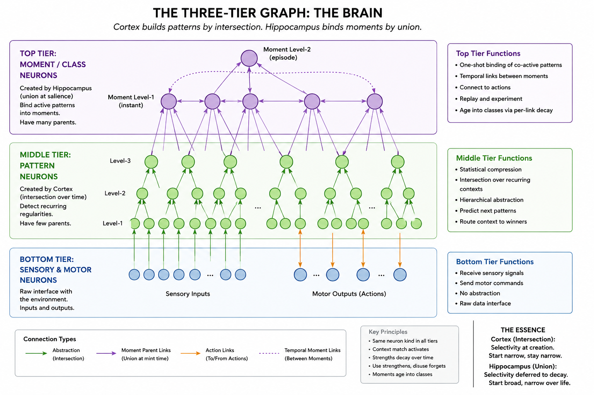

# Hippocampal Region — Design and Implementation Plan

## Overview

Robot Brain is a dual-system predictive architecture. Two organs run continuously in parallel over the same cortical substrate:

- **Cortex (System 1)** — fast, reflexive, short-term. Builds patterns by intersection over recurring contexts. Predicts the next frame, picks short-term actions by accumulated statistical voting from firing patterns.
- **Hippocampus (System 2)** — slow, deliberate, long-term. Mints moments (multi-parent nodes formed by union over the active set at salience triggers), runs replay experiments over them, and reinforces action connections on moments along trajectories that yielded long-term-optimum rewards.

The deep insight that organizes this design:

> **Cortex splits reality by intersection. Hippocampus binds reality by union. Same substrate, two creation rules.**

There is one neuron kind that lives in cortical columns: a node with a context fingerprint, outgoing connections to other nodes and to action neurons, and metadata (mint frame, kind tag, salience-at-birth, strength). What distinguishes a moment from a pattern is *how it was created* and consequently *how many parents it has* — not what kind of neuron it is.

- **Patterns** are formed by *intersection*: the cortex finds the subset of co-active context that consistently predicts an outcome. Patterns typically have one or few parents in the abstraction hierarchy. Created gradually by statistical learning.
- **Moments** are formed by *union*: at a salience trigger, the hippocampus binds every currently-active high-level pattern as a parent. Moments have many parents by construction. Created in one shot.

Storage is always cortical. The hippocampus is the operator that mints moments and runs experiments — it owns no permanent store of its own.

### Why two organs: the hippocampus trains the cortex

The deeper reason for the split, beyond "two creation rules," is that a slow intersection-learner cannot safely absorb a rare single-shot event. One occurrence is too few samples to abstract from — forced to learn it on the spot, the cortex would either overfit the incidental detail or interfere with existing structure (catastrophic interference). The hippocampus exists to capture that instant losslessly in one shot and re-present it (replay) until the cortex has effectively seen it enough times to abstract it safely. In one line: **the hippocampus trains the cortex.** This is the complementary-learning-systems rationale, re-derived from the architecture's own mechanics rather than imported.

"Train" bundles two distinct jobs, with different reward signals and different failure modes; keep them separate:

- **It trains the cortex's representations.** Minting moments that the cortex abstracts into patterns and classes (the moments-age-into-classes mechanism). Consolidating *what is*. This is CLS proper.
- **It trains the cortex's policy.** Counterfactual and imagined replay discover better action→outcome links and write them onto moments, which the cortex inherits through normal abstraction. Improving *what to do*. This is Dyna-style model-based reinforcement, not CLS.

"Trainer" is only the offline half. The hippocampus is also a live participant: its moments vote in the current frame (the involuntary forecast, the gut-feel) before any consolidation has happened. **Teacher and scout** — it generates curriculum for slow consolidation *and* runs live forecasts that bias the current action. Collapsing it to "the cortex's trainer" loses the real-time prospection that is the other half of its value.

Division of credit (relevant to continual learning): by design, the cortex is natively continual — intersection-based pattern formation does not catastrophically interfere the way gradient descent does, so it holds old classes without replay. The hippocampal "training" is an additive single-shot episodic mechanism layered on top, not the thing carrying class-incremental performance. The cortex solves continual learning structurally; the hippocampus adds brain-like fast episodic learning.

## Core Principles

The hippocampus is not a database. Memories are not retrieved through global similarity search. 
Instead, memories are re-instantiated through distributed contextual routing.

The cortex continuously forms sparse hierarchical patterns.
The hippocampus binds those patterns into moments.
Replay strengthens useful routes and weakens irrelevant ones.
Forgetting is not cleanup; forgetting is abstraction.

Thought emerges from replay traversal through compressed contextual structure.

### Moments age into classes

A moment is born with many parents (the union at mint time). 
Per-link decay applies independently to each parent connection. 
Use-driven reinforcement strengthens links that match real recurring contexts. 
Over time, weak (incidental) parent links drop out; strong (real-context) parent links survive and sharpen. 
The moment ends up connected only to its core parents — a class-shaped node, structurally indistinguishable from a statistically-formed pattern.

Moments are not stored as immutable records.
A recalled moment is a partial reconstruction assembled from surviving contextual routes across many parent neurons.
As forgetting removes weak or incidental routes, moments gradually lose episodic specificity and become semantic abstractions (classes).

Classes are not a separate neuron kind. 
They are aged moments. 
The forgetting curve is the abstraction mechanism. 
This is the architectural analog of episodic-to-semantic consolidation as observed empirically: vivid specific memories lose incidental detail and survive as gist.

### The three-tier graph



The full architecture forms a graph with three tiers:

- **Bottom tier: sensory and motor neurons.** Input and output. The raw interface with the environment.
- **Middle tier: pattern neurons.** Created by the cortex through intersection — statistical compression of recurring co-activations. Many levels, each at exponentially coarser timescale. Patterns connect downward to sensory neurons and upward to higher patterns. The cortex builds this tier bottom-up.
- **Top tier: moment/class neurons.** Created by the hippocampus through union — one-shot binding of the active pattern set at salience triggers. Moments connect downward to patterns (their parents) and laterally to other moments (the temporal moment graph) and to action neurons.

The cortex and hippocampus perform symmetric but opposite operations on this graph:

- **Cortex (intersection):** selectivity at creation. Observes many instances, finds what recurs, creates a narrow node representing only the common signal. Patterns start narrow and stay narrow.
- **Hippocampus (union):** selectivity deferred to decay. Observes one salient instant, binds everything active, creates a broad node. Moments start broad and narrow through per-link decay as incidental parents fade and core parents survive. A moment converges toward a class — structurally identical to a pattern that was narrow from the start.

Both create nodes in the same substrate. Both fire by context match. The difference is when selectivity happens: at birth (intersection) or through life (union, pruned by forgetting).

### Multi-level moment hierarchy (union of unions)

The pattern hierarchy has many levels: level-1 patterns detect sensory co-activations, level-2 patterns detect recurring combinations of level-1 patterns, and so on — each level at an exponentially coarser timescale. The same recursive structure applies to moments.

- **Level-1 moments** bind co-active patterns at a single salient instant. This is what the rest of this document describes as the baseline system.
- **Level-2 moments** bind co-active level-1 moments that fired within a level-2 timescale window, at a level-2 salience trigger. A level-2 moment represents an episode — "this sequence of important instants forms a recognizable whole."
- **Level-3 moments** bind co-active level-2 moments over an even longer window. An era — "this sequence of episodes forms a recognizable phase."
- **Level-N moments** follow the same rule recursively. Each level applies union at its own exponential timescale.

The operation at every level is the same: union over the currently-active lower-level moments when salience triggers at that level's timescale. The temporal bins at each level scale exponentially with the level, matching the cortical pattern hierarchy's temporal scaling.

The inhibition rule (see "Implicit Inhibition" below) applies across moment levels: when a level-2 moment fires, it suppresses the level-1 moments that are its parents from independently voting. This means the system automatically selects the appropriate planning horizon — a level-2 moment's action connections operate at level-2 temporal bins (longer horizons), and inhibition ensures they aren't drowned out by level-1 noise. If a level-2 moment stops firing (because aging narrowed its context beyond the current situation), inhibition lifts and level-1 moments resume voting. The system gracefully degrades down the hierarchy.

This is the architectural realization of hierarchical temporal abstraction: instants → episodes → eras → life-chapters, with each level binding the one below by union and projecting actions at its own timescale. No planning module, no horizon selector — the inhibition hierarchy *is* the horizon selector.

Implementation note: the multi-level extension is architecturally locked in but the mechanics at level 2+ (salience triggers, co-activation windows, replay across levels) are best discovered empirically from a working single-level system. See "Open questions" and "Phase 10" for specifics.

### Thinkability = reachability by the executor

Ordinary cortical neurons fire when their context matches and otherwise sit dormant — they are not deliberately summonable. Moments are different: the hippocampus can address them by id (via the thalamic translation layer), reactivate them, traverse their connections, and run experiments over them. **A neuron is "thinkable" iff the hippocampal executor can reach it.** Thinkability is not a property of the neuron's location or type; it is a property of being operated on by the hippocampus.

### The HM test

This architecture predicts HM directly. Removing the hippocampus removes the executor. After removal:

- Pre-existing moments survive — they are cortical, with stable connections, reactivatable by sensory cues (cued recall).
- New moments cannot be minted — the union-creation operation is gone.
- Deliberate recall, planning, and counterfactual reasoning are gone — these required executor reachability for replay.
- Skills, perception, statistical learning, and cued recall continue normally — these are pure cortex.

If a Robot Brain with a fully populated cortex loses its hippocampus, that is the behavioral profile it should exhibit.

---

## Theoretical grounding

- **Hippocampal indexing theory** (Teyler & DiScenna 1986; Teyler & Rudy 2007) — the hippocampus indexes cortical patterns, doesn't store them. This design takes the further step: the indices themselves are also cortical (moments), and the hippocampus is purely operator.
- **Complementary Learning Systems** (McClelland, McNaughton, O'Reilly 1995) — fast experimental learning (System 2) + slow statistical learning (System 1), bridged by experiment-driven action reinforcement.
- **Mattar & Daw (2018)** — replay prioritized by expected value of backup (prediction error magnitude).
- **Buzsáki's "brain from inside out"** — the brain as a generative system; replay/preplay are the same intrinsic dynamics under different conditions.
- **Kahneman dual-process theory** — Robot Brain implements System 1 and System 2 as separate organs over a shared substrate, rather than as a behavioral metaphor.
- **Hippocampal scenario-construction literature** — patients with hippocampal damage cannot imagine novel scenes either, not just remember old ones. The hippocampus is the executor; memory is one of its uses.
- **Episodic-to-semantic consolidation** — empirical finding that specific episodic memories schematize into gist over time. In this architecture, this is a structural consequence of per-link decay on multi-parent moments under use-driven reinforcement.

---

## Architectural principles

1. **One substrate, two operators.** Cortex and hippocampus operate on the same cortical neurons in the same columns. Thalamus mediates id↔property addressing.
2. **Cortex splits by intersection, hippocampus binds by union.** Cortex divides experience into hierarchical patterns through prediction-error-driven statistical learning (selectivity at creation — only recurring signals enter). Hippocampus binds salient instants into multi-parent moment nodes in one shot (selectivity deferred to decay — everything enters, reality prunes).
3. **One neuron kind in routing tables.** Patterns and moments are the same kind of node. They differ in how they were created (intersection vs union), in fan-in (typically few parents vs many parents), and in the temporal grain over which their action connections are organized.
4. **Hippocampus is the executor, not the store.** It mints moments, runs experiments over them, and updates action connections on moments. It does not hold them.
5. **Recall is by context.** A moment fires when its parent patterns fire with sufficient context overlap. This is normal cortical activation, not a special operation.
6. **One voting machinery.** All firing nodes vote for actions through their action connections. Each connection carries two scalars — a *strength* (accumulated evidence) and a *reward* (a running-mean value estimate); the highest-reward action wins, with strength weighting the aggregate and breaking ties. Moments and patterns vote identically; experiment-driven updates adjust the same connections that statistical learning does (strength up, reward smoothed toward the observed-or-simulated return, either direction). There is no separate "decided action" override mechanism.
7. **Selective minting.** Only frames with reward or prediction error above a z-score threshold trigger moment minting. Ordinary experience never becomes thinkable.
8. **Two clocks.** The hippocampus runs at a faster clock than the cortex, executing many experiment frames per cortex frame.
8b. **Parallel fan-out replay.** Replay is a pool of N concurrent trajectories from a shared starting state, not a single-track walk. After fan-out, the winning trajectory's actions are written back to the moments along it. This is the core replay mechanism, not an optimization.
8c. **Salience-modulated lookback.** Before fan-out, the starting state is rewound backward along the temporal moment graph by a depth derived from triggering salience. Small surprises rewind shallowly; large surprises rewind deep. The brain trades short-term thinking for long-term re-evaluation at the scope the trigger warrants.
9. **Same death ledger, different aging.** Forgetting is unified through one death ledger. Moments age on a slower timeline than patterns because they represent rarer, more salient information.
10. **Bidirectional coupling via thalamus.** Cortex emits think-actions that reach the hippocampus. Hippocampus reads currently active cortical state and writes action-connection updates back to specific moment neurons. Updates are local to the neuron written, never global.
11. **Multi-level moment hierarchy.** The union-creation rule applies recursively: level-1 moments bind patterns, level-2 moments bind level-1 moments, level-N moments bind level-(N-1) moments. Each level operates at an exponentially coarser timescale, mirroring the pattern hierarchy's exponential scaling. The same structural machinery (context fingerprint, action connections, temporal bins, decay, inhibition) applies at every moment level.
12. **Inhibition selects the planning horizon.** When a higher-level moment fires, it suppresses lower-level moments from voting independently. The highest-level moment that matches the current context dominates action selection at its temporal scale. No separate planning module or horizon selector is needed.

---

## Context overlap

Context overlap is not a global semantic similarity operation. 
Each neuron stores child routing entries with the full activation context present when that child was created or reinforced.
When the neuron activates again, the current activation context is compared against the stored routing contexts of its child entries.
Children receiving strong contextual matches receive stronger votes.
Memory retrieval therefore emerges from distributed agreement across many independent local routing decisions.

---

## The cortical substrate

A cortical node, regardless of whether it was minted as a pattern or as a moment, has:

- A **context fingerprint**: incoming connections from other nodes (sensory neurons, patterns, moments — anything in the substrate), each weighted by activation strength at the node's creation time and updated by use-driven reinforcement.
- **Outgoing connections to other nodes**: routing-table entries pointing to higher-level patterns the node participates in, and (for moments) to other moments via the temporal moment graph.
- **Outgoing connections to action neurons**, organized into temporal bins (see "Action connections and temporal bins" below).
- Metadata: mint frame, kind tag (pattern/moment), salience at birth, current strength, last-access frame.

When the node's context matches the current frame within tolerance, it fires and contributes its votes to action selection. The cortex does not distinguish patterns from moments at activation or voting time — both fire by the same rule, both vote into the same aggregation.

What distinguishes patterns from moments structurally:

- **Patterns** were minted by gradual statistical co-activation. They typically have few parents (the higher-level patterns they roll up into). Their action connections live on a *short-term temporal bin scheme* (linear, frame resolution, narrow horizon — e.g., 10 bins covering 1-10 frames).
- **Moments** were minted by the hippocampus by union over the active high-level pattern set at a salience trigger. They have many parents at birth. Their action connections live on a *long-term temporal bin scheme* (exponential, broad horizon — e.g., 10 bins covering 1 to 10^10 frames).

Both kinds participate in normal cortical activity. The hippocampus's special access is by id, not by kind.

---

## Implicit Inhibition

When higher-level neurons activate, the lower-level neurons that triggered
them do not independently vote.

This creates a natural hierarchical inhibition mechanism:
higher-order abstractions suppress redundant lower-level participation.

### Inhibition across the pattern hierarchy

When a level-3 pattern fires, it subsumes the level-2 and level-1 patterns below it. Those lower patterns don't independently vote — the higher pattern already captures their information more precisely in context.

### Inhibition across the moment hierarchy

The same rule applies across moment levels. When a level-2 moment fires (an episode recognized), it inhibits its level-1 moment parents from voting independently. When a level-3 moment fires (an era recognized), it inhibits the level-2 episodes below it.

The consequence for action selection: each moment level's action connections operate at that level's temporal bins. Level-2 moments vote at longer horizons than level-1 moments. When a level-2 moment fires and suppresses its children, short-horizon action votes from level-1 go quiet and long-horizon action votes from level-2 dominate. The system automatically selects the appropriate planning horizon based on which level of moment recognition fires.

When a higher-level moment ages and loses weak parent links, it may stop firing in contexts where it used to fire. When it stops, inhibition lifts, and the lower-level moments below it resume voting with their shorter-horizon actions. The system gracefully falls back down the hierarchy as abstractions sharpen and narrow.

### Inhibition from moments to their parent patterns

A moment is minted by union over the active high-level patterns; those patterns are its parents and point to it. The same inhibition rule that runs pattern→pattern and moment→moment therefore also runs moment→pattern: when a moment fires, the parent patterns that triggered it do not independently vote. This is the case the hierarchy implies but the section above had not named, and it is the structural form of System 2 overriding System 1. The moment's long-horizon action votes (its exponential long-term bins) replace the parents' short-horizon reflexes (their linear bins) — a deliberately-reasoned conclusion suppresses the scattered habit, earned structurally rather than bolted on as a weight.

This preserves the one-voting-rule principle exactly. Inhibition gates *who* votes, not *how much* a vote counts. When a moment and a pattern both fire un-inhibited, they vote identically; there is no moment-supremacy multiplier. The override is entirely a consequence of which nodes are allowed to participate, not of any asymmetry in vote strength — which is why no separate "decided action" mechanism is needed.

Inhibition is categorical, not graded. A moment fires only when its parents are co-active with sufficient context overlap, so selectivity already lives at the firing threshold: by the time a moment fires, the question of whether a parent really belongs to this context has been answered. Grading inhibition by link strength would re-apply that same selectivity a second time. A parent that is incidental to the moment is, by definition, usually not active when the moment fires — so there is nothing to inhibit; and in the rare frame where it is co-active, it is part of the current scene and muting it is correct. Fire-or-not carries the nuance; inhibition is binary downstream of it.

### Inhibition as the horizon selector

No planning module is needed to choose between tactical and strategic action. The hierarchy does it:

- Novel situation, only level-1 moments match → short-horizon tactical behavior.
- Recognized episode, level-2 fires → long-horizon strategic action dominates.
- Recognized era, level-3 fires → very-long-horizon actions dominate.

The inhibition hierarchy *is* the horizon selector.

Inhibition may also emerge behaviorally through competing actions, such as
suppressive or muting actions.

---

## Action connections and temporal bins

Every node has outgoing action connections, organized by temporal bin. The bin scheme is a per-kind parameter.

### Bin scheme

- Patterns use **linear bins** at frame resolution. With N=10 bins, each bin holds the connection strength for actions taken at exactly that frame offset (1, 2, ..., 10) following the pattern firing. This matches cortex's existing short-term action prediction machinery.
- Moments use **exponential bins** over a wide horizon. With N=10 bins, the bin boundaries are 1, 10, 100, ..., 10^10 frames. Bin k holds the connection strength for actions whose effective offset from the moment's firing falls within (10^(k-1), 10^k] frames.

The number of bins (N) is a parameter, settable per kind. 10 is a reasonable default for both.

### Why exponential at long horizons

Linear bins at frame resolution would require billions of bins to cover meaningful long-term horizons. Heavy-tailed Δt distributions (which is what natural experience produces) want log-spaced binning. Discriminability of time intervals is logarithmic — humans don't distinguish "3000 frames ago" from "3050 frames ago" but sharply distinguish "yesterday" from "last week." Exponential bins are the architecture noticing this.

### Soft bin assignment

Hard bin boundaries cause fragility at edges (an action with effective offset 95 frames sits at the bin 1 / bin 2 boundary; small noise could flip it). Each action's vote is therefore distributed smoothly across adjacent bins via a kernel — typically a Gaussian over log-Δt — rather than placed in a single bin. Bin assignment is a distribution, not a categorical choice.

### Action intrinsic horizon

Each action neuron learns an **intrinsic horizon distribution**: the distribution of reward-arrival-Δts following the action's firing, aggregated over many firings. Some actions are unambiguously short-horizon (consequences arrive within a few frames). Some are unambiguously long-horizon (consequences arrive consistently far out). Some are mixed.

The action's intrinsic horizon determines which bin's connection strength is read when the action is being considered. A moment voting for "submit market order" pulls from its short-bin (or whichever bin matches "submit market order"'s intrinsic horizon). A moment voting for "shift portfolio strategy" pulls from its long-bin. The action's intrinsic horizon is the bin selector — there is no separate "current planning horizon" parameter held by the cortex.

This means strategic vs reflexive action selection happens automatically: the right moments fire because the right contexts arose, they have strong connections in the appropriate bins for the actions being considered, and the votes aggregate. No planning module required.

---

## The hippocampal executor

The hippocampus owns no permanent store. It owns:

- The salience module (windowed z-scoring of reward and prediction error).
- A **parallel experiment pool** — N concurrent trajectories explored simultaneously from a shared starting state, with a shared "what's been visited" structure to prevent redundant exploration. Parallel fan-out is the core replay mechanism, not an optimization.
- A transient working set of currently-relevant moment ids while experiments run.
- The death-ledger writer (the ledger itself is shared across cortex and hippocampus).

Its operations:

- **Mint moment** — given the currently active cortical state and a salience trigger, create a moment node in the appropriate column with connections to every active high-level pattern (with weight proportional to each parent's activation strength), action connections recording every action that fired during the encoded context window (with frame offsets), and edges to recently-active moments (the temporal moment graph).
- **Rewind** — walk backward through the temporal moment graph from the trigger point to select a past moment as the starting state. Rewind depth is salience-modulated: small triggers rewind shallowly (local "what could I have done differently here?"); large triggers rewind deep (broader "what could I have done differently further upstream?"). This is how the brain trades short-term thinking for long-term re-evaluation.
- **Fan out parallel trajectories** — from the chosen starting state, dispatch N concurrent experiments. Each substitutes a different alternative action (or runs as-original) and walks forward independently. Trajectories share a visited-moments structure to prevent redundant exploration.
- **Replay (per trajectory)** — step-by-step walk through the moment graph, accumulating simulated time, reading rewards and action sequences along the trajectory.
- **Branch (for counterfactual)** — at any replay step, instead of sampling forward via edges, substitute an alternative action and walk to a sibling moment under shared parent patterns; continue from there.
- **Select winner and reinforce action connections** — when the fan-out converges or budget expires, compare trajectories by accumulated reward over the simulated horizon. Walk the winning trajectory backward and update the action connections on its moments — strength up, reward smoothed toward each step's return-to-go (either direction) — in the temporal bin matching the summed Δt at which each lesson applies. Losing trajectories leave no trace beyond their contribution to the visited structure.
- **Decay and evict** — apply moment-timeline decay; emit eviction records to the death ledger.

The cortex does not know about the moment/pattern distinction. It just sees nodes firing and contributing votes. The hippocampus is the only thing that knows which nodes are moments and what experiments are running.

Replay is intentionally approximate and resource bounded.

The goal is not exhaustive planning but salience-guided exploration.

Replay may:
- loop,
- terminate early,
- become distracted,
- or converge on emotionally reinforced regions.

This behavior is considered a feature rather than a defect and mirrors many properties of biological cognition.

---

## The salience module

Computes a scalar "mint this moment" signal per cortex frame:

- `z_reward = (reward − μ_reward) / σ_reward` over a sliding window
- `z_pe = (prediction_error − μ_pe) / σ_pe` over a sliding window
- Mint iff `|z_reward| > θ_r` or `|z_pe| > θ_pe`

Novelty is not an input. Every observation contains some novelty; that does not make it worth remembering. What the literature calls "novelty effects" is in practice prediction error, already covered.

When the trigger fires, the hippocampus calls Mint over the currently active cortical state.

In addition to salience-triggered minting, a **sampling rate** parameter mints occasional non-salient moments to provide a baseline graph of ordinary experience. This prevents the moment graph from being entirely composed of high-stakes nodes with no connective tissue between them. Sampled moments age and decay normally; if they don't get reactivated, they fade out without consequence.

---

## Moment creation

When a salience trigger fires, the hippocampus mints a new moment by union:

1. Read the currently active high-level patterns (those firing above some activation threshold).
2. Create a new moment node in the appropriate cortical column.
3. For each active pattern P, register the new moment as an outgoing connection in P's routing table, with link weight initialized to P's activation strength.
4. Record action connections for every action that fired during the encoded context window, with frame offsets, in the moment's long-term temporal bin scheme.
5. Draw edges to the K most recently-minted moments (the temporal moment graph), with edge weights initialized by `1/Δt` and Δt metadata recorded directly.
6. Set salience-at-birth from the triggering z-score; initialize moment strength accordingly.

The moment now exists as a multi-parent node in the cortical graph. Future cortical pattern-formation can incorporate this moment into its contexts, exactly like sensory or pattern neurons. This is the structural mechanism for "lessons from specific experiences becoming reflexes" — System 2 enriches System 1 by adding moment nodes that cortex then abstracts over.

### Cold-start gating

A freshly-minted moment has no replay history and no use-driven reinforcement on its links. It does not contribute to action voting until it has been activated K times (parameter, default K=3). Before that threshold, its action connections are silent — it accumulates evidence but does not project. This parallels the cold-start gating already used for newly-formed pattern neurons.

The same maturity gate governs inhibition, not just voting — it is one gate, not two. An immature moment neither votes nor inhibits: during its cold-start window its parent patterns keep voting normally, and voting and inhibition switch on together once the moment has earned its K activations. This closes what would otherwise be a dead zone (a fresh moment muting its parents while being too young to vote itself, emitting no action for the frame). It needs no moment-specific confidence knob because it is exactly how cortical neurons already behave: maturity gates participation as a whole, and inhibition is downstream of participation.

### Moments age into classes (mechanism)

After minting, per-link decay reduces parent-link strengths over time. When the moment reactivates because some of its parents fire with matching context, those matched links get strengthened by use-driven reinforcement. Unmatched links continue to decay. Over time:

- Incidental parent connections (parents that happened to be active at mint time but don't recur with this moment) decay away.
- Real parent connections (parents that capture the moment's actual context) get repeatedly reinforced.

The moment ends up sparsely connected to its core parents. Structurally, it has become a class — a node representing "this kind of situation" rather than "this specific instant." No separate machinery, no clustering pass, no centroid computation. The decay and reinforcement loops do the abstraction work over the moment's lifetime.

This means there is no class neuron type. There are only moments at various stages of life. Young moments are episodic; old moments are semantic. Use-driven selection on a multi-parent substrate is the consolidation mechanism.

Important: do not artificially renormalize per-link weights as link count drops. That would keep dead moments alive — moments that captured noise and never re-matched would still appear to fire because their few remaining links got boosted. The honest signal is "did this moment keep getting hit?" Useful moments survive and sharpen; useless moments fade. No compensation.

---

## The temporal moment graph

When a moment is minted, edges form to the K most recently minted moments. Edge weight is initialized by `1/Δt`. Δt is recorded as metadata.

Edges also form via co-reactivation: when two existing moments fire close in time during normal cortical operation or during replay, an edge is created (if absent) or reinforced (if present). Edge Δt metadata accumulates a small histogram over the long-term bin scheme (rather than a single mean), so an edge whose firings cluster bimodally at Δt=5 and Δt=500 carries mass in two bins.

Edges decay by disuse, like everything else in the substrate. Edges below a strength threshold are dropped.

The graph is directed. M_source's routing table points to M_target with Δt-histogram metadata. M_target does not necessarily point back. Backward traversal, when needed, requires explicit reverse edges (cheap to add at edge-creation time if desired).

This graph is the substrate replay walks. It is also what gives "this kind of situation tends to lead to that kind of situation" structure — the system's learned long-horizon transition model.

---

## Recall — the involuntary forecast pass

After cortex finishes its frame, any moment whose parents are firing with sufficient context overlap will already be active — this is normal cortical activation, not a special operation. The hippocampus reads the currently-firing moment set and, for each moment above an experiment-eligibility threshold:

- Notes that the moment is firing (it is already voting via its action connections; nothing extra needed).
- May initiate a small-budget parallel replay fan-out. The rewind depth before fan-out is derived from the triggering salience: low-magnitude triggers start from the currently-active moment set (no rewind); high-magnitude triggers rewind further back along the temporal moment graph before branching forward. This is the involuntary "what should I have done differently?" reflex — its scope automatically matches how bad (or good) the trigger was.

This pass fires every cortex frame, even with zero think-actions. It is the always-on background channel — *"that reminds me…"*, mind-wandering, gut-feel forecasting.

The forecast itself is predictive, not yet counterfactual; its purpose is to surface good or bad scenarios worth evaluating. The moment it flags a salient outcome it spawns the rewind-and-fan-out that is thinking proper. In that sense forecasting exists in service of counterfactual evaluation: pure forward prediction is recall, and thinking proper begins when a predicted outcome is worth asking "what should I do instead?" about.

When a voluntary think-action arrives mid-forecast, the forecast is pushed onto the experiment stack and the think-action runs. The forecast resumes after.

---

## The think-action interface (voluntary thinking)

The cortex fires think-actions as ordinary actions. The cortex does not address moments by id — its world is nodes and patterns. A think-action says "think about *this cortical content*"; the hippocampus resolves the cue to candidate moments by driving the cue and reading off which moments fire.

```
think_action {
  cue: [cortical_neuron_id, ...],   // cortical content to think about — patterns,
                                     //   sensory ids, action ids, or any mix.
  mode: enum {
    Replay,                          // run forward as-original
    Counterfactual,                  // inject alternative actions and explore
    Retrieve,                        // surface related moments via shared parents
    Compare,                         // run two cued states in parallel, measure delta
    Compress,                        // find common structure across cued moments
  },
  budget: integer,                  // hippocampus frames to spend
  lookback: integer,                // moment-graph hops to rewind backward from the
                                     //   cued starting state before fanning forward;
                                     //   0 = branch from here; larger = re-evaluate
                                     //   decisions further upstream.
  horizon: integer,                 // max simulated time (summed Δt) in frames
  fanout: integer,                  // number of parallel trajectories to dispatch
                                     //   from the rewound starting state (default
                                     //   pool size; may be capped by capacity)
  temperature: float (0.0 - 1.0),   // breadth of sampling (low=peaked short-Δt;
                                     //   high=associative drift to long-Δt)
  control: enum {
    Interrupt,                       // push current experiment, start new
    Integrate,                       // add cue to current experiment
    Remember,                        // mint without starting an experiment
  }
}
```

**Cue → moment activation** (inside the hippocampus):

1. Drive the cue neurons.
2. Let cortex pattern-complete; collect the moments that fire above threshold.
3. The active set becomes the experiment's starting state.

This is the same machinery as the involuntary forecast pass. The only difference is the source of the cue — cortex's currently-active high-level patterns for involuntary, the explicit `cue` parameter for voluntary.

Each parameter is independently learnable through the metacognitive reward signal (Phase 7).

Think-actions are replay-control directives.

They bias:
- replay initialization,
- traversal direction,
- salience weighting,
- reinforcement,
- or memory persistence.

Language may trigger think-actions directly, allowing external instructions
such as "remember this" or "think about this" to shape replay behavior.

---

## Experiment execution

### Starting state

An experiment starts with a *set* of currently-active moments — whatever was firing in the surfacing context (involuntary) or whatever the cue resolved to (voluntary). The replay does not assume a single starting moment.

### Rewind — salience-modulated lookback

Before fan-out, the starting state may be rewound `lookback` hops backward through the temporal moment graph. Lookback zero starts from the surfacing context; positive lookback walks the reverse edges to land on an earlier moment set along the recent trajectory.

For involuntary experiments, lookback is derived from the triggering salience magnitude — bigger surprise rewinds further back. The mapping (proposed: `lookback = floor(k · |z|)` capped by the available trajectory length) is parametric and tuned empirically. The intuition: short-term thinking does not always guarantee long-term optimum results; a bad outcome may have its real branch point several moments upstream. Salience-modulated lookback lets the brain re-evaluate at the scope that the surprise warrants — local for small mistakes, deep for large ones.

For voluntary think-actions, lookback is supplied explicitly.

### Parallel fan-out

From the (possibly rewound) starting state, the hippocampus dispatches `fanout` concurrent trajectories. Each trajectory independently:

- Substitutes a candidate alternative action at its branch point (sampled from sibling moments under shared parent patterns — see "Counterfactual via parent-pattern siblings" below), or runs as-original for a baseline.
- Walks forward step by step, accumulating simulated time and reward, until a termination condition fires.

Constraint on alternatives: only actions whose effects in this context are *known* can be substituted — meaning sibling moments must exist under shared parents carrying that action. Actions with no prior context-relevant history cannot be replayed because the moment graph holds no trajectory to walk. Cortex's probabilistic action votes are the fallback (less precise) when no sibling exists.

Trajectories share a visited-moments structure so that exploration doesn't redundantly retrace the same forward walks. Each trajectory's per-step state (active moment set, accumulated reward, accumulated Δt) is independent.

### Single replay step

1. **Active set.** Read the currently active moment set from the top of the experiment stack.
2. **Step forward.** For each moment in the active set, sample outgoing edges weighted by `edge_strength × context_overlap × Δt_kernel(temperature)`. The Δt kernel concentrates on short-Δt edges at low temperature (near-future prediction at fine grain) and broadens to long-Δt edges at high temperature (far-future associative drift at coarse grain). The union of sampled targets, weighted by their firing strength, becomes the new active set.
3. **Accumulate simulated time.** Sum the Δts of edges traversed; this is the experiment's simulated horizon so far.
4. **Evaluate.** For each moment in the new active set, read off rewards (via the cortex's value estimates for the moment's context) and action information (the moment's action connections).
5. **Continue, branch, or terminate** (see termination conditions below).

### Termination conditions

The experiment stops when *any* of:

- **Budget exhausted** — the requested number of replay frames has been used.
- **Horizon exceeded** — the summed simulated Δt has passed the requested horizon. Useful for "simulate one hour ahead, stop" semantics.
- **Convergence** — predicted reward across additional steps stops changing meaningfully, or the walk has entered a loop (revisiting moments already in the trace).
- **Salience drop** — the running average of activated moment strengths drops below X% of the starting strength. The replay has drifted into uninteresting territory.

For involuntary experiments without an explicit budget or horizon, salience drop is the dominant terminator. The replay walks forward as long as each step keeps surfacing reasonably-strong moments; when the trail goes cold, it stops. This matches the phenomenology of mind-wandering: associative chains fade out when the activations weaken.

For voluntary think-actions, all four conditions apply, with budget and horizon caps coming from the request.

### Counterfactual via parent-pattern siblings

When the experiment asks "what if a different action had been taken at this moment in the trajectory?", it walks from the moment in question up to its parent patterns, then down to *other* moments under those same parents where a different action was taken. Replay forward from one of those sibling moments. Same parent patterns means similar context; different action means actual counterfactual.

If no sibling moments exist for the desired alternative action, the experiment can fall back to sampling actions from the cortex's probabilistic action votes for the moment's context — "what would cortex have done absent habit?" — but this is less precise than sibling substitution.

### Imagined scenarios — construction beyond sibling recombination

The sibling mechanism above recombines only *known* action→outcome links: it requires a sibling moment under shared parents that already carries the alternative. It cannot evaluate a situation that never occurred, or an action with no context-relevant history. That makes the counterfactual machinery a recombiner of past experience — narrower than the scenario-construction capacity the architecture claims biologically, where hippocampal damage abolishes imagining novel scenes, not just recalling old ones. This subsection closes that gap.

The general operation is union-mint with a supplied active set. The hippocampus can construct a **hypothetical moment** by union over patterns and lower moments that need never have co-fired from sensation. This is the same union-creation used at salience triggers, except the active set comes from a cue (a think-action) rather than from the current frame. "If this co-occurs with that, and then this other thing happens…" is literally a constructed union — a situation assembled from familiar parts that were never assembled together by the world.

Forward simulation runs as ordinary replay. The constructed moment is propagated forward through the temporal moment graph — already the system's learned long-horizon transition model — exactly as a normal forward replay. Forward prediction over a never-observed starting state is possible because the transition structure is over patterns and moments, not over specific episodes: a novel combination of familiar parts inherits the forward dynamics of those parts. The same termination conditions, reward accumulation, and winner selection apply.

Writeback targets the hypothetical moment. When the forward simulation concludes that action X is good in the constructed situation Y, the policy is written onto Y itself — "I will do X if I find myself in Y," for a Y that may never have happened before. When reality later produces situation Y, the real high-level patterns pattern-complete to that moment (it is just a cortical node, matched by context like any other), and it contributes its stored action through the normal voting machinery.

The cold-start gate is the load-bearing safeguard here. A constructed moment is freshly minted and therefore immature: by cold-start gating it neither votes nor inhibits until it has been activated K times by *real* recurrence. So a purely imagined conclusion cannot drive behavior on its own — the world has to actually present the situation enough times to mature the node before its policy projects. **Imagination proposes; recurrence licenses.** This bounds the replay pathologies directly: the system can rehearse arbitrary hypotheticals cheaply, but only hypotheticals that reality subsequently confirms acquire voting power.

This is strictly a generalization of the sibling mechanism. Sibling recombination is the special case where the constructed situation already exists as a real sibling under shared parents; imagined construction is the same operation when it does not.

### Action reinforcement (writeback)

When the parallel fan-out completes (all trajectories terminated, or global budget exhausted), the hippocampus selects the winning trajectory — the one with the highest accumulated reward over its simulated horizon. The winner's taken actions are what get written back. Losing trajectories contribute nothing beyond their entries in the shared visited structure.

The as-original baseline is the reference for whether thinking changed the *recommended* action, not a gate on whether writeback happens. Even when the as-original trajectory wins — thinking found nothing better — its returns still refresh the standard action's estimate, possibly correcting it downward. The goal is an accurate estimate, not only an improvement.

Writeback walks the winning trajectory **backward** from its end. Walking back is what gives each step its **return-to-go** — that step's own reward plus everything downstream — rather than the trajectory's flat total. This matters: a moment ten steps before the payoff and one right before it must record *different* values, or the temporal-bin structure is corrupted. Return-to-go is computed naturally by the backward walk (each step = its immediate reward + the running downstream sum), and the return's reward-arrival-Δt selects which temporal bin the value lands in via the existing action-intrinsic-horizon mechanism — horizon-correct by construction.

For every moment in each step, for the action that the trajectory took at that moment, two scalars on that action connection update:

1. **Strength** increments — the action was tried here, one more observation. Strength only ever grows; writeback never lowers it.
2. **Reward** (the connection's stored value estimate) is smoothed toward this step's return-to-go by exponential smoothing with `α = 1/strength`:
   ```
   reward ← reward + (1/strength)(return_to_go − reward)
   ```
   Because `α = 1/strength`, this is the incremental form of a plain arithmetic mean — every observation counts equally and the estimate converges on the action's true expected return. It moves in **either** direction.

All moments in the step are updated, every step, on the backward walk — there is no member-selection rule and no firing-strength weighting. The "which member of the step receives writeback" question dissolves: selectivity already lived at the firing threshold (a moment is in this step only because it fired), so nothing remains to weight downstream.

**Two scalars, two laws — kept distinct:**

- **Strength** is monotonic-up. It is the evidence count (the *n* in the running mean), it gates cold-start eligibility, and it sets the connection's share within the neuron's vote. Writeback never lowers it; only node death removes it. Action-connection strength does not decay. (The per-link decay that drives moments-becoming-classes acts on a moment's *context/parent* links, not on its action connections — that is disuse, not writeback.)
- **Reward** is the value estimate. It moves up or down toward observed and simulated returns at equal per-sample weight. This is what lets the hippocampus learn *not* to do something: a tempting action whose rollouts end badly has its reward smoothed down until the moment stops voting for it. The hippocampus is a value-estimate *corrector*, not a positive-reward seeker — finding a bad outcome and correcting an estimate down is the same machinery as finding a good one, run symmetrically.

This replaces the earlier max-gated rule ("update only if the simulated reward exceeds the current strongest connection"). Max-gating could only ever raise an estimate, so it could never represent "I used to think this was good; it isn't" — exactly the negative-learning case. The running mean represents it directly, and "it may take a few more thoughts" is just its convergence: one rollout nudges, consistent evidence settles it, and a single unlucky trajectory cannot condemn a good action. Habit-stickiness falls out for free — a high-strength action has a tiny `α`, so its estimate crawls and a well-worn habit takes many consistent bad experiences to overturn. Sticky, but correctable.

**Connection-reward vs consensus-reward.** Keep the two uses of "reward" distinct. The *connection-reward* above is stored per (moment, action) and smoothed over a lifetime of executions and experiments. The *consensus-reward* is computed fresh each frame at voting time and never stored: for each candidate action the consensus takes the strength-weighted average of its voters' connection-rewards, and the action with the highest such average wins (Democratic consensus, `argmax`), tie-broken by strength. Writeback smooths the stored connection-reward; the consensus only reads it.

Generalization is left to the substrate. Don't write the lesson onto multiple moments simultaneously — write it onto the moments the trajectory actually visited. Over time, when those moments reactivate in similar contexts and vote their corrected actions successfully, the cortex builds patterns over the situations where the vote helped, and those patterns inherit the lesson through normal cortical abstraction.

The payoff of storing the correction as state on the moment: when the cortex later auto-activates that moment by recognition — no deliberation — it already votes with the corrected value. Past thinking is available reflexively. Intuition is compiled deliberation; the gut feeling that something is a bad idea is a moment voting with a reward a prior experiment smoothed down.

### Stack semantics

Branching is implemented as an experiment stack: branch = push, terminate = pop. A higher-priority think-action arriving mid-experiment pushes the current one and runs.

The stack also supports "what was I thinking about?" queries: each entry is timestamped; entries decay over time. Querying returns the topmost item still above decay threshold. If everything has decayed, the thought is lost — the right phenomenology.

---

## Forgetting

The same death-ledger mechanism applies to all node kinds. Moments age on their own (slower) timeline, distinct from patterns.

**1. Per-link decay.** Each context-connection strength decays independently:
```
strength(link, t) = strength(link, t-1) * decay_rate_link + activation_boost_if_active_now
```
Initial value is the parent neuron's activation at minting time. Strongly active context neurons survive far longer than weakly active ones. When a link's strength falls below `link_eviction_threshold`, the connection is dropped.

This is the mechanism that drives moments-becoming-classes. Do not apply renormalization or compensating weights as link count drops; let the use signal speak honestly.

**2. Moment-level decay.** A moment's overall strength is initialized from its salience at minting and decays per cortex frame. Activation boosts it. Below `moment_eviction_threshold`, or when capacity is pressured, the lowest-strength moments are evicted. A moment is also evicted if its surviving link count drops below `min_context_refs`.

**3. Action-connection strength does not decay.** An action connection carries two scalars with different laws. Its **strength** grows with every observation (execution or experiment) and is never weakened — only node death removes it. The brain executes one action per channel per frame, so an un-chosen action isn't a wrong prediction, it just wasn't tried; weakening unchosen actions would collapse the brain onto whichever action it tried first and destroy exploration. Its **reward** (the stored value estimate) is a different matter — see below — and does move in both directions, but that is correction of an estimate, not decay of a connection.

Reinforcement comes from two sources: statistical reinforcement from observed action-reward pairs (cortex), and experiment-driven reinforcement from replay (hippocampus). Both increment strength; neither weakens it. Both smooth the connection's reward toward the observed-or-simulated return via the running mean (`α = 1/strength`), which can move the estimate up or down. The earlier max-gate ("the simulated reward must exceed the current strongest connection for the update to take effect") is gone — it could only raise estimates and so could never represent learning that a tempting action is bad. The moment accumulates a connection for every action explored, each carrying a strength (how much evidence) and a reward (a running-mean estimate of its return); the highest-reward action wins votes when the moment fires, and un-explored actions are simply never touched.

**4. Cascade on cortical deletion.** When a context neuron is deleted, every node removes that connection. Moments dropping below `min_context_refs` are evicted.

**5. Death ledger.** Every eviction appends `{neuron_id, kind, frame, reason, salience_at_birth}` to the shared append-only ledger (ring-bounded). Uses:
- Debugging — "why don't I remember X?"
- Observability — shape of forgetting over time.
- Re-encoding suppression — don't immediately re-mint a just-evicted moment unless its salience is now substantially higher.

**6. Sleep / idle consolidation.** When the hippocampus has free cycles, it replays high-salience moments to reinforce them and prunes low-strength moments. This is the biological-sleep-replay analog. The class-rebalancing pass from the previous design is gone — there are no classes as separate entities to rebalance.

---

## Forgetting as Compression

The system is designed around the assumption that intelligence requires continuous forgetting.

Without forgetting:
- contextual noise accumulates,
- routing tables explode,
- memories become overly specific,
- and generalization fails.

Forgetting removes weak contextual routes while preserving highly reinforced structure.

Over time, this transforms detailed episodic moments into compressed semantic classes.

---

## Attention

The cortex continuously processes sensory and internal activation.

Attention is defined as whatever replay process currently occupies the hippocampus.

In this model:
- attention,
- working memory,
- deliberate thought,
- imagination,
- and planning

are all forms of constrained replay occupancy.

---

## The brain coordinator

Orchestrates the parallel clocks. Manages semaphores. Routes inputs and outputs.

**Per cortex frame:**
1. Read sensory inputs; cortex propagates patterns and picks actions. Currently-active moments fire normally and contribute their votes to action selection through the same machinery as patterns.
2. Wait on `SignalCortexDone`.
3. If salience triggered, push a mint request to the hippocampus.
4. If cortex emitted think-actions, push them as voluntary experiments.
5. Push the currently-active moment set as an involuntary forecast request.
6. Continue to the next frame.

**Per hippocampus frame (faster, in parallel):**
1. Service any pending mint request (cheap, runs immediately).
2. If a parallel experiment pool is active, advance every trajectory in the pool by one frame. When all trajectories have terminated, select the winner and run writeback.
3. Otherwise pop the next request: voluntary think-actions take priority over involuntary forecasts. Rewind by `lookback`, then dispatch `fanout` trajectories from the rewound starting state. If the queue is full and a non-interrupt request arrives, drop it silently — this is the "deep in thought already, can't be bothered" state.
4. If idle, run consolidation: decay, eviction, death-ledger maintenance.

---

## Coordinator pseudo-code

```
// shared
SignalCortexDone:    semaphore (cortex → brain: frame done)
MintQueue:           channel<MintRequest>
ExperimentQueue:     channel<ThinkAction>     // voluntary, high priority
ForecastQueue:       channel<MomentSet>       // involuntary, low priority

// cortex thread (1 frame per tick)
loop:
    inputs = read_sensory()
    cortex.activate(inputs)                  // all nodes (sensory, pattern, moment)
                                              //   fire by context match; all vote
                                              //   uniformly into action selection
    cortex.propagate_patterns()
    actions = cortex.pick_actions()          // may include think-actions
    cortex.emit(actions)
    SignalCortexDone.post()

// brain thread (orchestrator)
loop:
    SignalCortexDone.wait()
    if salience.should_mint(cortex.last_frame):
        MintQueue.push({active_high_level_patterns, frame, trigger})
    for ta in actions.think_actions:
        ExperimentQueue.push(ta)
    ForecastQueue.push(cortex.currently_active_moments())

// hippocampus thread (free-running, faster clock)
loop:
    while req = MintQueue.try_pop():
        hippocampus.mint_moment(req)         // creates moment node, registers as
                                              //   child in active patterns'
                                              //   routing tables, draws temporal
                                              //   edges, records initial actions

    if hippocampus.experiment_pool.has_active():
        hippocampus.advance_all_trajectories()    // advance every trajectory in the
                                                   //   parallel pool by one frame
        if hippocampus.experiment_pool.all_terminated():
            winner = hippocampus.select_winner()  // highest accumulated reward
            hippocampus.writeback_along(winner.trajectory)  // strength++ , reward toward
                                                            //   return-to-go (either dir);
                                                            //   baseline only flags whether
                                                            //   the recommended action changed
            hippocampus.experiment_pool.clear()
        continue

    if ta = ExperimentQueue.try_pop():
        start = hippocampus.rewind(ta.cue_resolved_moments, ta.lookback)
        hippocampus.experiment_pool.dispatch(start, ta.fanout, ta)
        continue
    if forecast = ForecastQueue.try_pop():
        if forecast.non_empty():
            lookback = salience.derive_lookback(forecast.trigger_z)
            start = hippocampus.rewind(forecast.moments, lookback)
            hippocampus.experiment_pool.dispatch(start, default_fanout,
                                                forecast_as_replay(small_budget))
        continue

    // idle
    hippocampus.decay()
    evicted = hippocampus.evict_below_threshold()
    for n in evicted:
        DeathLedger.append({n.id, n.kind, current_frame, reason, n.salience_at_birth})
    hippocampus.cascade_cortical_deletions()
```

---

## Implementation phases

### Phase 1 — Skeleton and parallel clocks

- Create `hippocampus` module.
- Add the moment kind tag to the existing cortical node type so moments live alongside patterns in the same columns. Reuse the existing thalamic id-translation layer.
- Implement the brain coordinator with two-thread async (cortex + hippocampus, semaphore-coordinated).
- Implement `mint_moment` driven by simple z-score salience (reward and prediction error only, no novelty).
- Hard-code a trivial temporal graph (just record edges with Δt) and a trivial replay (return current moment set).
- Verify: cortex fires a think-action, hippocampus runs experiment frames, action-connection updates land on a moment, that moment's votes show up in cortex's next action selection.

### Phase 2 — Salience, selective minting, and cold-start gating

- Z-scored reward and prediction error over sliding windows.
- Gating (mint iff `|z|` over threshold).
- Sampling rate for non-salient baseline minting.
- Cold-start gating: new moments accumulate K activations before contributing to action votes.
- Strength-based decay and eviction on the moment timeline.
- Death ledger and re-mint suppression.

### Phase 3 — Action-connection temporal bins

- Implement linear short-term bins for patterns (existing cortex behavior, formalized).
- Implement exponential long-term bins for moments.
- Soft bin assignment via Gaussian-over-log-Δt kernel.
- Action intrinsic horizon: track reward-arrival-Δt distribution per action, use it to select which bin's connection strength is read at voting time.
- Verify: a moment with strong long-bin connections votes loudly when long-horizon actions are being considered, and vice versa.

### Phase 4 — Temporal moment graph and replay

- On each mint, draw weighted edges with Δt to recent moments.
- Co-reactivation edge formation (when two moments fire close in time, create or reinforce edge).
- Edge Δt-histogram over the long-term bin scheme.
- Step replay: starting active set → step forward via edges weighted by `edge_strength × context_overlap × Δt_kernel(temperature)` → new active set → repeat.
- Termination conditions: budget, horizon, convergence, salience drop.
- `mode: Replay` end-to-end.

### Phase 5 — Counterfactual experiments, parallel fan-out, salience-modulated lookback, and action reinforcement

- Branch via parent-pattern sibling: walk up to a moment's parent patterns, find sibling moments under shared parents with the alternative action, replay forward from one.
- **Parallel fan-out pool**: dispatch N concurrent trajectories from the starting state, each substituting a different sibling-derived alternative action (plus one as-original baseline). Shared visited structure across trajectories prevents redundant exploration.
- **Rewind by salience-modulated lookback** before fan-out: walk the reverse temporal-moment-graph edges by `lookback` hops to land on an earlier moment set. For involuntary forecasts, derive `lookback` from the triggering z-score magnitude; for voluntary think-actions, use the supplied parameter.
- **Winner selection**: at pool termination (all trajectories ended, or global budget exhausted), pick the trajectory with the highest accumulated reward. Write its taken actions back regardless of the baseline — the as-original baseline only flags whether the *recommended* action changed; even a winning as-original trajectory refreshes the standard action's estimate.
- Action update along the winning trajectory: walk the trajectory backward; for every moment in each step, increment the strength of the action it took and smooth that connection's reward toward the step's return-to-go via the running mean (`α = 1/strength`). The return's reward-arrival-Δt selects the temporal bin. Strength is monotonic-up; reward moves either direction. No max-gate.
- Verify: replaying a bad outcome with parallel alternatives discovers a better policy; subsequent encounters of the same context use the improved policy via the moment's reinforced action connections out-voting the old habit. Verify that increasing the triggering salience produces a deeper rewind and re-evaluates earlier branch points.

### Phase 6 — Involuntary forecast pass

- Wire the per-frame forecast push.
- Wire moment activation through normal cortical activation (no separate "activate by context" operation needed).
- Verify: with zero think-actions, the hippocampus produces background forecasts and action-connection updates every frame.

### Phase 7 — Voluntary think-actions and metacognitive control

- Full think-action parameters (mode, budget, horizon, temperature, control).
- Interrupt / Integrate / Remember semantics.
- Reward signals for think-actions (PE reduction, downstream action improvement, opportunity cost).
- Train cortex to fire think-actions when expected value exceeds external action value.
- **Imagined-scenario construction**: a cue-driven think-action mints a hypothetical moment by union over a supplied set of patterns/moments that need not have co-fired, forward-simulates it through the temporal moment graph, and writes the trajectory-optimum policy onto the hypothetical moment. The hypothetical moment is subject to ordinary cold-start gating — it neither votes nor inhibits until matured by real recurrence.
- Verify: a hypothetical situation assembled from never-co-fired parts simulates forward sensibly; its discovered policy stays silent until the situation actually arises K times, then projects through normal voting.

### Phase 8 — Sleep / idle consolidation

- Detect idle.
- High-temperature integrative replay over recent high-salience moments.
- Reinforce strong moments, prune weak ones.
- Observe moments-becoming-classes in real data — verify that aged moments retain only their core parent links.

### Phase 9 — Stack-based interrupt semantics for parallel pools

Parallel fan-out itself lands in Phase 5 as the core replay mechanism. This phase adds the orchestration polish: how a higher-priority think-action arriving mid-pool pushes the current pool, runs its own pool to completion, then resumes the original. Stack of pools rather than stack of single experiments. Includes the "what was I thinking about?" query semantics over the stack.

### Phase 10 — Multi-level moment hierarchy (union of unions)

The architectural principle is locked in: the union-creation rule applies recursively at exponentially coarser timescales. Level-1 moments bind patterns. Level-2 moments bind level-1 moments. Level-N moments bind level-(N-1) moments. Inhibition across moment levels selects the planning horizon automatically.

Deferred until single-level moments (Phases 1-8) are validated, because the mechanics at level 2+ are best discovered empirically from a working level-1 system.

**What is clear:**

- Each moment level uses the same structural machinery: context fingerprint, action connections in exponential temporal bins scaled to the level, per-link decay, use-driven reinforcement, cold-start gating, inhibition of lower levels.
- A level-N moment is minted by union over co-active level-(N-1) moments when a level-N salience trigger fires.
- The temporal moment graph at each level connects moments of the same level, with edge Δt-histograms at that level's bin scheme.
- Action connections at level N operate at level-N exponential bins — much longer horizons than level-(N-1). The action intrinsic horizon mechanism already handles timescale selection: long-horizon actions naturally have strong connections in the appropriate bins.
- Inhibition: when a level-2 moment fires, its level-1 parents don't independently vote. The highest-level moment that matches the current context dominates action selection at its appropriate timescale.
- Graceful degradation: when a higher-level moment ages out of a context (per-link decay narrows it), inhibition lifts and lower-level moments resume voting. The system falls back down the hierarchy.

**What single-level implementation will inform (open questions for Phase 10):**

1. **Level-2+ salience triggers.** At level 1, salience is z-scored reward and prediction error per cortex frame. At level 2, the natural candidate is meta-prediction-error: "the sequence of level-1 moments that just fired doesn't match the expected pattern of moment-sequences." This requires patterns to form over moment-sequences (which should happen naturally — moments are cortical neurons that patterns can observe). The cortex's prediction error over those moment-level patterns would be the level-2 salience signal. Verify empirically that this falls out from the existing cortex machinery rather than requiring a separate salience module per level.

2. **Co-activation window at each level.** At level 1, union binds everything active at one instant. At level 2, union binds level-1 moments that fired within a level-2 timescale window. The window width should follow the exponential scheme — approximately `contextLength^level` frames. The precise rule (fixed window? decaying activation strength? pattern-driven boundary detection?) needs empirical tuning.

3. **Replay across moment levels.** Level-1 replay walks the level-1 temporal moment graph. Level-2 replay should walk a level-2 temporal graph (edges between level-2 moments) at coarser temporal steps. Whether this uses the same hippocampal clock (operating over coarser-grained steps) or needs a separate clock per level is an implementation question. The simplest approach: one hippocampal clock, but level-2 replay steps traverse level-2 edges with inherently larger Δt values, so each step covers more simulated time.

4. **Where level-2+ moments live.** Level-1 moments live in cortical columns alongside patterns. Level-2 moments should live in the same substrate (same neuron kind, same columns). Their context fingerprints point to level-1 moments rather than to patterns. Verify that the existing column and routing-table infrastructure handles this without modification.

5. **Number of levels.** Unlike the pattern hierarchy where levels emerge from the cortex's hierarchical recognition, moment levels are minted by the hippocampus. How many levels should exist? Likely determined by the system's experience horizon — a system that has only seen minutes of data won't have level-3 moments. The number of levels should emerge from the data, not be configured. A level-N moment is only minted when enough level-(N-1) moments exist and co-activate with sufficient salience.

---

## Testing strategy

### Unit tests
- Moment minting with multi-parent registration: verify the new moment appears in every active pattern's routing table with weight proportional to that pattern's activation strength.
- Cold-start gating: a freshly-minted moment does not contribute to action votes for K activations.
- Per-link decay: weak parent links drop out faster than strong ones.
- Use-driven reinforcement: a parent link that matches recurring context strengthens; a parent link that doesn't fades.
- Moments-age-into-classes: simulate skewed reactivation over time, verify the moment ends up sparsely connected to its true core parents.
- Temporal moment graph: edge construction at mint and via co-reactivation; Δt-histogram accumulation; weighted sampling.
- Action-connection bins: linear (patterns) and exponential (moments); soft bin assignment kernel.
- Action intrinsic horizon: tracking reward-arrival-Δt and using it as the bin selector.
- Step replay: starting from a multi-moment set, step forward, accumulate simulated time.
- Termination conditions: budget, horizon, convergence, salience drop — each fires correctly in isolation.
- Counterfactual via parent-pattern sibling: find the right sibling under shared parents.
- Action-connection updates: strength increments monotonically; reward is the running mean (`α = 1/strength`) of returns and moves up or down. A sequence of bad returns smooths a previously-high reward down until the action stops winning votes; a high-strength connection moves slowly (habit-stickiness).
- Salience: z-score thresholding over sliding windows.
- Death ledger: eviction records, re-mint suppression.

### Integration tests
- Full mint → temporal edge → replay → action reinforcement flow.
- Counterfactual via parent-pattern sibling produces a better-than-original alternative; the moment's action connections reflect the new policy.
- Subsequent encounter of the same context uses the improved policy via the moment's reinforced votes out-weighing the old habit.
- Imagined-scenario construction: a hypothetical moment built by union over never-co-fired parts forward-simulates sensibly, its discovered policy is gated silent until real recurrence matures it, then fires through normal voting.
- Involuntary forecast fires every frame with no cortex prompting.
- Voluntary think-action interrupts in-flight forecast and resumes after.
- Non-interrupt think-action arriving with full queue is silently dropped (deep-in-thought state).
- Hippocampus removal: a fully populated cortex with the hippocampus disabled still does cued recall and skill execution but cannot mint new moments, plan, or run counterfactuals (HM profile).
- Moments-age-into-classes over a long simulation: verify aged moments end up structurally indistinguishable from statistically-formed patterns.

### Behavioral tests
- Trading backtest with vs. without hippocampus on bad-trade scenarios; verify hippocampus discovers better policies and they propagate to later similar contexts.
- ADHD-like profile: salience too lax, observe distractibility (too many moments minted, action votes diluted).
- Rigidity profile: salience too tight, observe perseveration (too few moments, can't escape habits).
- Rumination profile: high-magnitude negative-reward moments without escape counterfactuals; verify the salience-drop terminator still eventually fires (and verify that raising the terminator threshold or introducing competing high-salience moments shortens the rumination loop).

### Multi-level moment hierarchy tests (Phase 10)
- Level-2 moment minting: verify a level-2 moment is created when level-1 moments co-activate within the level-2 window and level-2 salience triggers.
- Level-2 inhibition: when a level-2 moment fires, verify its level-1 parents stop voting independently.
- Graceful degradation: when a level-2 moment ages out (per-link decay narrows its context), verify inhibition lifts and level-1 moments resume voting.
- Horizon selection: verify that level-2 moments vote at longer-horizon temporal bins than level-1 moments, and that inhibition causes the appropriate horizon to dominate.
- Level emergence: verify that the number of moment levels emerges from data — systems with short experience don't mint level-2+, systems with long diverse experience do.
- Cross-level replay: verify that level-2 replay walks level-2 temporal graph edges with appropriate coarser-grained Δt steps.

### Stress tests
- High-throughput cortex with many think-actions.
- Capacity limits and graceful eviction.
- Cortical deletion cascades.
- Long-running simulation to observe moments-becoming-classes at scale.

---

## Open questions

1. **Salience-drop computation.** What signal exactly is the running average computed over (mean activation strength of the active set?), and what threshold ratio terminates? Default proposal: drop below 30% of starting average. Tune from observation.
2. **Number of bins (short-term and long-term).** Default 10 each. Domain-dependent — algorithmic trading might want more long-term bins for finer-grain horizons; raw control tasks might want fewer.
3. **Cold-start K.** How many activations before a new moment contributes to votes? Default 3. Should be the same as the cortex's existing pattern cold-start gating, whatever that turns out to be.
4. **Moment sampling rate.** How often do we mint a non-salient moment to maintain baseline graph connectivity? Probably every few thousand cortex frames. Defer until we observe whether the temporal graph becomes too sparse with pure salience-triggered minting.
5. **Δt-kernel shape for replay step sampling.** Gaussian over log-Δt is the default. Alternative kernels could bias toward specific horizons. Implementation detail.
6. **Cross-channel moments.** Can a single moment's parent set include patterns from multiple channels (stock + text + vision)? With unification, the answer is structurally yes — any high-level pattern active at mint time becomes a parent regardless of channel. Worth verifying in implementation that cross-channel parent registration is permitted and that cross-channel moments behave sensibly under replay.
7. **Persistence.** Do moments persist across brain restarts? For long-term memory to be meaningful, yes. Need serialization for the column state plus the death ledger and temporal graph.
8. **Multi-level salience triggers.** How does the system detect salience at level 2+ without a dedicated salience module per level? The hypothesis: patterns form over moment-sequences (moments are cortical neurons), prediction errors against those patterns serve as level-2 salience, and the same process recurses. Verify empirically in Phase 10.
9. **Multi-level co-activation window.** At level 1, union binds everything active at one instant. At level 2+, union binds lower-level moments that fired within a window proportional to `contextLength^level` frames. The precise window boundary rule (fixed width? decaying activation? pattern-driven?) needs empirical tuning from a working level-1 system.
10. **Replay across moment levels.** Does level-2 replay walk a separate level-2 temporal graph? Does it use the same hippocampal clock with coarser steps, or a separate clock? Simplest hypothesis: one clock, coarser edges with larger Δt values per step.
11. **Number of moment levels.** Should emerge from data, not configuration. A level-N moment is only minted when enough level-(N-1) moments exist and co-activate with sufficient salience. Systems with short experience horizons will have fewer levels.
12. **The actual instruction set the cortex uses to invoke the hippocampus.** Will emerge from implementation rather than be designed up front. The conceptual operations are listed above; their precise signatures and the cortex-side action neurons that trigger them are TBD.
13. **Salience-to-lookback mapping.** Proposal: `lookback = floor(k · |z|)` capped by available trajectory length. Tune `k` empirically from the first salience-driven rewind experiments. Possible refinement: separate coefficients for reward-z vs prediction-error-z (a large reward miss may want a different rewind depth than a large surprise).
14. **Default fan-out width.** How many concurrent trajectories does a pool dispatch? Probably small (4-8) for involuntary forecasts and larger (up to capacity) for voluntary think-actions where the user explicitly requested deep deliberation. Capped by hippocampal compute budget.
15. **Trajectory diversity.** When `fanout` > number of available sibling-derived alternatives, how are the extra slots filled? Resampling siblings under different parent-pattern subsets? Falling back to cortex's probabilistic action votes? Empirical question.
16. **Hypothetical-union assembly.** For imagined-scenario construction, what determines which patterns/moments a cue binds into the hypothetical moment — the literal cue set only, or the cue plus its strongly-associated parents via pattern-completion? Over-completion risks reconstructing a familiar real situation instead of the intended novel one; under-completion risks a hypothetical too sparse to forward-simulate. And when the constructed union has no outgoing temporal edges (nothing exactly like it was ever minted), forward simulation must fall back to the edges of its constituent parts — confirm this composes sensibly rather than producing incoherent forward walks. Tune from the first imagined-construction experiments in Phase 7.

---

## Replay Pathologies

Because replay reinforces future routing and behavior, the system may develop:
- obsessive replay loops,
- irrational associations,
- overgeneralizations,
- false abstractions,
- or self-reinforcing beliefs.

These are considered expected emergent properties of replay-driven cognition rather than implementation bugs.

The architecture assumes that environmental interaction, prediction failure, and sensory correction will counterbalance pathological replay over time.

---

## Why this matters

The architecture does not use:
- vector embeddings,
- transformer attention,
- symbolic logic trees,
- immutable memory records,
- exhaustive planning,
- centralized retrieval,
- or static semantic representations.

All cognition emerges from:
- sparse hierarchical pattern formation,
- contextual routing,
- replay traversal,
- reinforcement,
- and forgetting.

- **Long-term memory** as cortical neurons minted by deliberate experimentation — not as a separate store, not as a context window.
- **Episodic-to-semantic consolidation** as a structural consequence of per-link decay on multi-parent nodes, not as a separate process.
- **Two thinking modes** — involuntary background forecasting + voluntary think-actions — both running on the same machinery.
- **Imagination as union-mint with a supplied cue** — the hippocampus constructs hypothetical situations from never-co-fired parts, forward-simulates them through the learned transition model, and caches a conditional policy onto the hypothetical that real recurrence later licenses. Scenario construction is a mechanism here, not just a cited capacity; imagination proposes, recurrence licenses.
- **System 2 enriches System 1** — moments enter the cortical substrate and become raw material for further pattern formation. Expertise development is structural, not behavioral.
- **One activation rule, one voting rule** — patterns and moments share the same machinery once they exist; the hippocampus's distinct role is purely in *creating* moments and *running experiments* to update their action connections.
- **Strategic vs reflexive action selection emerges from the data**, not from a planning module — actions carry their own intrinsic horizon, moments hold action evidence in matching bins, and the votes aggregate naturally at whatever horizon the current context engages.
- **Union of unions** — the moment hierarchy recurses: level-1 moments bind patterns, level-2 moments bind level-1 moments, level-N moments bind level-(N-1) moments. Each level at exponentially coarser timescale. Inhibition across levels makes the hierarchy itself the planning-horizon selector — no separate mechanism needed.
- **Symmetric hierarchies, opposite operations** — cortex builds up from sensory through pattern levels by intersection (compression). Hippocampus builds up from moments through moment levels by union (binding). Same exponential timescale structure, opposite information operations. The full graph has sensory at the bottom, patterns in the middle, moments at the top, with both hierarchies speaking the same temporal language.
- **Forgetting that judges** — uses moments fade or sharpen by their honest match with recurring reality; the death ledger remembers what was lost.
- **Biological grounding** — implements hippocampal indexing, complementary learning systems, predictive processing, scenario construction, and episodic-semantic consolidation in one architecture, with HM and rumination as direct architectural predictions.
- **One substrate, two operators, thalamic bus.** Cortex builds by intersection. Hippocampus binds by union. Activation, voting, and decay are unified across both.

The thesis: the next generation of AI architectures will not come from scaling sequence models. It will come from systems that have the structures biological brains have — separate organs for perception, memory, and thinking, coupled bidirectionally and operating on different clocks over a shared substrate, with one substrate underneath that both organs act on through different creation rules.

Intelligence emerges not from storing information, but from continuously reconstructing compressed experience through replay.