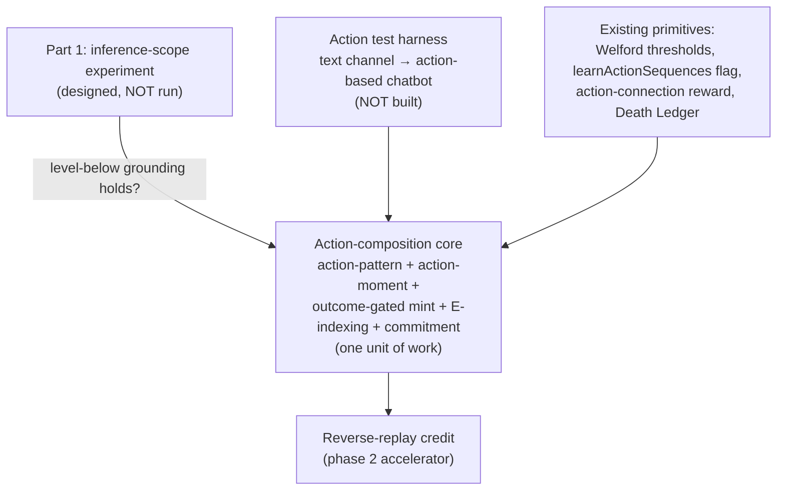

# Inference Levels & Action Composition

This document covers two linked things, in dependency order:

1. **Part 1 — the inference-scope experiment** (below): which neurons a level-L neuron predicts over (`base` / `same-level` / `level-below` / `all-levels`). This is a pre-registered experiment that **gates everything else in this document.** Until it runs, the composition design in Part 2 rests on an unverified assumption (`level-below` grounding).
2. **Part 2 — action pattern composition** ([jump](#part-2--action-pattern-composition)): how the action hierarchy mints itself from the event hierarchy. This is **design, not yet built.** It is recorded here so it isn't lost; not all of its questions are answered, and several are explicitly listed open at the end.

**Read Part 1 as a precondition for Part 2.** If `base` wins Part 1 outright — i.e. predicting raw sensory beats predicting your own substrate — then "levels infer levels" is undercut and Part 2 needs rethinking before any of it is built.

---

## Why

Today, every neuron's connections target only L=0 sensory neurons. This is because `thalamus.dispatch_frame` builds `new_active_neurons` from `age0` (the L=0 sensory set). Neurons at any level form their connections to sensory neurons only.

This may not be optimal. Before locking in any downstream architecture that depends on the inference-scope rule (spatial processing, neuron reuse), we want to pick the rule empirically on a known-good workload (stocks).

The winning rule becomes the **default** for all downstream work, subject to re-validation on MNIST (see [Scope of the decision](#scope-of-the-decision)).

---

## Four Variants

| Rule | `new_active_neurons` passed to a level-L neuron processing age=d | Hypothesis |
|---|---|---|
| `base` (today) | All L=0 neurons active at age=d | Cheapest; current behavior |
| `same-level` | L-resident neurons active at age=d | Each level predicts within its own abstraction; **bootstrapping risk** (see below) |
| `level-below` | (L−1)-resident neurons active at age=d (L=1 sees L=0) | Classic cortical hierarchy rule; compositional abstraction at modest cost |
| `all-levels` | All neurons active at age=d, any level | Maximum reuse potential; risk of correlated double-counting |

### Variant-specific risks

- **`same-level` bootstrapping:** early in training, higher levels are sparsely populated, so a new level-L neuron has an almost-empty prediction substrate. The variant may lose by construction rather than by merit. If it underperforms, note in the decision whether starvation (low connection counts at L≥1) explains it before ruling the idea out.
- **`all-levels` double-counting:** a high-level neuron and its constituent low-level neurons are correlated evidence. Including both in the prediction set may distort voting/consensus precision even as raw coverage improves.
- **`level-below`** is the prior favorite: it builds genuine cross-level composition without the redundancy of `all-levels` or the starvation of `same-level`.

---

## What this experiment actually compares

Changing the scope rule changes the **learning substrate**, not just inference: connections formed under each rule produce different neuron populations over the course of training. We are therefore comparing whole training trajectories (rule + the hierarchy it grows), not a swapped-in inference rule on a fixed brain. The decision applies to the rule-as-trained, and any post-hoc analysis should keep this in mind.

---

## Phase 1 — Inference Scope Experiment (d>0 only, stocks)

**No spatial work, no architecture refactor.** Just gate `new_active_neurons` by scope rule and measure on the existing stocks pipeline.

### Code touched

- `brain/brain-core/src/brain.rs` — add `inference_scope: InferenceScope` to `BrainOptions`, defaulting to `Base` (zero behavior change).
- `brain/brain-core/src/types.rs` — add `enum InferenceScope { Base, SameLevel, LevelBelow, AllLevels }`.
- `brain/brain-core/src/thalamus.rs::dispatch_frame` — branch on `inference_scope` when constructing `new_active_neurons`:
  - `Base`: existing logic (active at age=0 sensory).
  - `SameLevel`: filter the active set to neurons whose `level == current_processing_level`.
  - `LevelBelow`: filter the active set to neurons whose `level == current_processing_level - 1` (for L=1 this is identical to `Base` restricted to actives; levels L≥2 differ).
  - `AllLevels`: include every neuron active at the relevant age, regardless of level.
- `brain/brain-napi/src/lib.rs` — expose `inferenceScope` on the JS-facing brain options.

### Runs

1. `base` — control. Confirm reproduces current stocks baseline.
2. `same-level` — Variant A.
3. `level-below` — Variant B.
4. `all-levels` — Variant C.

Same data and same hyperparameters across all variants. **Seeds:** 3 seeds per variant if a run is cheap enough to allow it; otherwise 1 seed per variant with the noise threshold below applied strictly.

### Metrics

- Directional accuracy. **(primary)**
- Per-episode ROI.
- Total neuron count at end of run.
- Total connection count at end of run (broken out per level — needed to diagnose `same-level` starvation).
- Per-frame runtime (mean, p99).
- Memory footprint at end of run.

### Decision rule (pre-registered)

Declared **before** any run to prevent post-hoc rationalization:

1. **Primary metric: directional accuracy**, subject to a runtime budget — per-frame p99 must stay within **3×** of `base`. A variant that exceeds the budget can only win if its accuracy gain is large enough that we'd commit to optimizing it (note this explicitly in the decision).
2. **Noise threshold:** accuracy deltas under **1 percentage point** (single-seed) or within the cross-seed spread (multi-seed) are treated as a tie.
3. **Tie-break order:** per-frame p99 runtime → connection count → memory footprint. Ties at every level default to `base` (cheapest, already validated).

### Acceptance

- All runs complete without crashing on the stocks workload.
- A written decision lands at the end of this doc naming the winner under the pre-registered rule above.
- Loser variants remain runnable via config — we don't delete them; they may be revisited if MNIST or another workload prefers a different rule.

### Notes / gotchas

- `SameLevel` and `LevelBelow` filtering need a per-level active set; the existing code already partitions by level via `memory.get_level_neurons(level)`. Use that.
- `AllLevels` may inflate per-frame runtime substantially on stocks — that's a data point, not a failure. Measure first, optimize later if it wins.
- If `base` wins outright, we still proceed with `base` semantics. The experiment is informative either way.

---

## Scope of the decision

This is a **d>0 temporal** experiment on stocks deciding a default that [spatial-processing.md](./spatial-processing.md) will apply to **d=0 spatial** scoping. Temporal sequence prediction and spatial co-activation are different regimes; the rule that wins here may not win there. Accordingly:

- The winner propagates into spatial processing as the **default**, to be **re-validated on MNIST** before being treated as settled for d=0.
- Conceptually the rule also informs [neuron-reuse.md](./neuron-reuse.md), but the reuse pool is unaffected by scope; only the prediction-set construction is.

---

## Decision

*(To be filled in after Phase 1 runs.)*

**Winner:**
**Result under pre-registered rule:** (accuracy deltas, runtime vs. budget, tie-breaks applied if any)
**Per-level connection counts:** (required if `same-level` underperformed — starvation or merit?)
**Notes:**

---

# Part 2 — Action Pattern Composition

> **Status: design only. Not built. Gated on Part 1.**
> Recorded so the design isn't lost. Open questions are listed at the end; several are unresolved.

## The asymmetry that motivates this

The event hierarchy already composes. Events mint upward from co-activation and sequence: a misprediction creates a pattern that remembers the context, and that pattern becomes a token the next level sequences over. That machinery is built and validated (see [architecture.md](./architecture.md); full-MNIST results in the project record).

The **action** hierarchy does not compose, and will not compose by the same route. This is the central claim of the design. Two things were being conflated in the original "it'll emerge naturally" conjecture:

- **Credit assignment** — a high-level event node grows an action connection and accumulates reward. This *does* emerge for free: any node can grow action connections ([column.rs](../brain/brain-core/src/column.rs) `learn_action_connections`), and reward smoothing already credits them. This is probably what made the conjecture feel plausible.
- **Composition** — primitive actions fuse into a single higher-level action. This does **not** emerge from correlation. Correlation tells you "which action pays here," never "these three actions are one thing."

The reason composition can't be frequency-driven the way events are: chunking by how often you do A-then-B chunks *your current policy*, which produces **habits, not skills** — it calcifies present behavior into macros and, under argmax exploitation, freezes exploration and locks in suboptimality. The only "natural" signal available on the action side is the wrong signal.

So the missing piece is an **outcome-gated minting operator** for actions, with no equivalent on the event side.

## Core principle: an action's level is the event level at which its effect is predictable

Actions are **not** a parallel, independent tower mirroring events. They are **grounded in the event hierarchy**, the same way `level-below` event prediction grounds transitively down to sensory:

- A **primitive action** changes sensory-level (L=0) events.
- A **sub-sequence of actions** earns chunkhood — gets tagged at event level L — when (a) its net effect is a **low-residual event transition at level L** and (b) it carries a **reward advantage** over the flat (primitive-only) baseline.

This is the *options* idea (Sutton/Precup/Singh) routed through the brain's own predictive machinery rather than bolted on. The commensurability principle from Part 1 transfers verbatim: an action belongs at level N because its outcome is predictable in level-N's units.

## How a high event comes to infer a high action (the "treasure")

The thing to build is the link **E → P_action** (a high-level event reaching for a high-level action chunk). The design claim is that this link is **not a separate wiring step** — it is born when the action chunk is minted, *if* minting indexes the chunk by the event context it ran under:

1. A high-level event pattern **E** is active. Apex events vote base actions; base actions run.
2. As the chunk runs, it classifies **"what conditions was I called under"** — and records the **highest active event token E**, not just E's sensory constituents.
3. E therefore enters the chunk's content. With content-hash identity + the reverse-reference index ([neuron.rs](../brain/brain-core/src/neuron.rs) `context_refs`), the link **E → P_action exists at mint time.** The high-to-high binding is structural, not a later discovery.

**Why E and not a flickering base event wins the link** — this is the same commensurability argument from Part 1, now in the time domain. P_action has temporal extent. Across its run, base events flick on and off; E is the one token whose activation **co-extends with the chunk's entire span** (that is what made E apex). So reward-weighted, mean-based connection strength gives E → P the cleanest, lowest-variance association, while base → P links are noisy edge-effects. **Actions bind to the event level whose temporal extent matches the action's extent** — automatically, because only same-extent tokens reliably co-occur across the whole span.

## Why the high action beats its own constituents (load-bearing)

A high event E will only migrate its vote from base action `a` to chunk `P` if `P` earns a **higher conditional reward** than `a`-repeated. It does so through **commitment**, not bookkeeping: if E re-decides every tick, the full sequence never reliably assembles and the chunk's outcome never lands cleanly. `P` beats its parts only because it commits to the whole sequence and reliably reaches the sequence outcome.

So the **commitment / call-stack discipline is not just arbitration hygiene — it is the source of the chunk's reward advantage**, and therefore the reason the high-to-high binding forms at all. No commitment → no advantage → no reason for E to prefer P. This is the piece most likely to be under-built.

## Direction of learning: reward-seeded reverse credit (accelerator, not precondition)

Forward event prediction is seeded by the **present** and runs unconditionally (data-driven, bottom-up). Action chaining is seeded by a **valued outcome** and unrolls backward toward its causes (value-driven, top-down). The two arrows meet at the goal: events run forward to generate a high-value predicted event; that event is the seed a backward action chain reaches from.

Two clarifications that keep this honest:

- **Learn backward, execute forward.** The chunk is minted from the outcome end (C←B←A) but traversed from the start (A→B→C). Keep the two read directions explicit or consolidation and rollout will be confused.
- **Reverse replay is an optimization, not a precondition.** Forward reward correlation already assigns credit (slowly). Reverse replay propagates credit in its native direction (outcome → cause) and is faster/cleaner — but composition can *form* without it. **Build the core first; add reverse replay only once chunks demonstrably mint.**

The biology rhymes (forward prediction ≈ System 1 cortical reflex; goal-seeded backward chaining ≈ System 2 / hippocampal reverse replay), but a resemblance to biology is not evidence the implementation works — treat it as orientation, not justification.

## Minimal implementation, reusing what exists

| Piece | New or existing | Notes |
|---|---|---|
| Adaptive mint threshold | **Exists** | `error_stats` Welford + `errorCorrectionMode` (`conservative = mean+σ`) is per-(neuron, age) — already finer than per-level. Reuse as-is. |
| Action participation toggle | **Exists (dormant)** | `learnActionSequences` channel flag — `false` in every encoder today. The on-ramp for action pattern learning. |
| Action-connection reward | **Exists** | `learn_action_connections`, never-weakened, reward-smoothed. |
| Death Ledger pruning | **Exists** | Prunes action chunks that stop paying, same as events. |
| **Action-pattern neuron** | **New** | Temporal sequence of actions. Content-hash by action sequence for reuse/dedup. |
| **Action-moment neuron** | **New** | Simultaneous action bundle (d=0 "chord", e.g. turn-and-accelerate). Completes the moment/pattern table on the action side. |
| **Outcome-and-advantage mint gate** | **New** | Mint only when the sequence reliably yields a low-residual event transition at level L **and** beats the flat-baseline reward. Never frequency-gated. |
| **Event-context (E) indexing at mint** | **New** | Record the highest active event token in the chunk's content → the E → P link. |
| **Commitment / call-stack arbitration** | **New** | Active chunk holds the action channel down to its level until its predicted outcome confirms (success) or its residual breaches (abort, hand control up). Interruptible only by residual breach or a strictly higher-value option. |
| **Reverse-replay credit pass** | **New (phase 2)** | Outcome-seeded backward credit propagation. Build after the core forms chunks. |

## Expected developmental order (curriculum, not a bug)

The treasure cannot appear before the high action exists, which cannot exist before base actions ran under E:

1. Events abstract (event hierarchy grows).
2. Base actions get credited under E (forward reward correlation).
3. Backward classification crystallizes the contextualized chunk; the E → P link is promoted into the action-connection table at low strength.
4. Only then does high-to-high binding take over from base routing.

Do not expect (or force) action composition before its event context exists.

## Dependencies

- **Hard gate — Part 1 result.** Composition assumes levels meaningfully predict levels (`level-below` or better). If `base` wins everywhere, rethink before building.
- **Test harness — the real long pole.** No current domain exercises action composition. Stocks have one binary action per channel (`actions: [-1, 1]`) — a "chunk" of buy-buy-buy is trivial, no hierarchy to compose. MNIST runs actions off. **Plan: convert the text channel from passive next-token prediction to action-based output — effectively a chatbot — so that emitting tokens becomes a multi-step action sequence with consequences.** Whether next-token-as-action actually produces a *composable* action hierarchy (vs. still one-action-per-frame) is itself an open question (below).
- **Co-dependent core.** Action-pattern + action-moment + outcome-gated mint + E-indexing + commitment are not separable — none is meaningfully testable without the others. Build and test as one unit, behind `learnActionSequences`.
- **Reverse replay is downstream of the core**, not a precondition.

## Open questions

1. **Does `level-below` actually win Part 1?** Everything here stacks on it. Unrun.
2. **Goal seeding must be value, not predictability.** If the forward model can seed goals just by predicting *reachable* states and the backward model reaches whatever it's seeded with, you get a closed loop that hallucinates goals it can hit and hits goals it hallucinated. Seed must be grounded in actual (Democratic-mode strength-weighted) reward. How is this enforced in code?
3. **Reverse-graph branching factor.** Forward, there's one actual next event; backward, a goal has many predecessors, so the reverse graph is bushier and will try to explode. How hard do reward-weighting + Death Ledger prune it in practice? Expect to lean on both more than on the event side.
4. **Arbitration under Democratic voting.** A committed chunk must suppress its own constituent primitives' votes within its scope, or the option and its parts fight over the channel. Exact call-stack discipline — who holds the floor, what counts as a "strictly higher-value option" interrupt, how residual breach is detected — is unspecified.
5. **What is an "action moment" in the text/chatbot domain?** A single output channel emits one token per frame — is there a simultaneous action bundle at all, or does the moment/pattern symmetry degenerate for single-channel output? May only matter for multi-channel (robot) actuation.
6. **Does next-token-as-action actually compose?** Converting text to action-based may still be effectively one-action-per-frame with no genuine sub-sequence structure. Need a criterion for "this token sequence is one action chunk" that isn't just frequency.
7. **Outcome definition.** "Low-residual event transition at level L" needs an operational measure: which event level counts as the chunk's outcome, and how is the residual thresholded (reuse the Welford `error_stats`?).
8. **Credit latency in the chatbot setting.** Reward may arrive many tokens after the actions that earned it. How far back does credit propagate, and does reverse replay become a precondition (not just an accelerator) once latency is large?
9. **Canary metrics against pattern explosion / memorization.** Higher levels minting aggressively erodes compression and drifts toward memorization (the brain will happily memorize — ~3 episodes to 100% on text). Instrument **top-level action mint rate** and **Death Ledger churn** as the early-warning signals before trusting any of this.
10. **Can the expected developmental order be observed?** If the curriculum (events abstract → base credited → chunk crystallizes → E→P promoted) doesn't appear in instrumentation, the mechanism isn't doing what the design claims.
