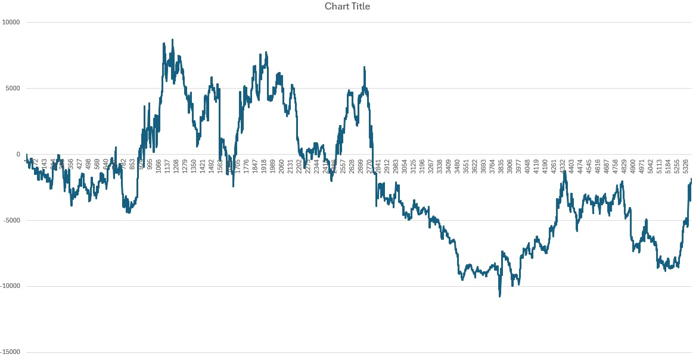

# Stock & Time-Series Demos

These demos apply the brain to financial time series — synthetic cycles, real historical price/volume
data, and sequence memorization. Stock trading is **one application** of the architecture, not its
focus; for the vision and language demos see [mnist-demos.md](mnist-demos.md) and
[text-demos.md](text-demos.md).

The included `1D` timeframe data is ready to use — **no API key needed** for these demos. To download
fresh or different data, see [Downloading Fresh Stock Data](#downloading-fresh-stock-data) at the end.

---

## Single-Channel Synthetic Cycle

A single-stock variant of the cycle test: one channel, a repeating 12-frame price/volume pattern, 20
repeats. Isolated to a single channel so you can see the brain converge on optimal actions without
multi-channel reinforcement doing any of the work.

```bash
node apps/stocks/jobs/synthetic-extended-test.js --group-mode static --group-threshold 0.9
```

**Expected output:**
```
Overall Optimal Rate: 233/240 = 97.1%
```

With the right thresholds the brain converges to 97%+ optimal action decisions on a single-channel
cyclical pattern — confirming that hierarchy and action inference work without cross-channel consensus.

---

## Multi-Channel Synthetic Cycle

The brain learns to trade 3 stocks simultaneously (KGC, GLD, SPY), each as a separate channel. A
repeating 12-day price cycle is presented 20 times — the brain discovers cross-stock patterns and
converges on optimal buy/sell timing.

```bash
node apps/stocks/jobs/multi-channel-test.js --group-mode static --group-threshold 0.9
```

**Expected output:**
```
🎯 Overall Optimal Rate: 696/720 = 96.7%
```

The brain learns when to own vs. not own each stock based on upcoming price movements, achieving 96%+
optimal trade decisions across all three channels. This demonstrates how multiple input streams
converge to improve inference — one of the architecture's core strengths.

---

## Stock Trading

The brain learns to trade stocks from historical price and volume data. Each stock is a separate
channel — the brain discovers cross-stock patterns and makes buy/sell/hold decisions optimized by
reward feedback.

```bash
node apps/stocks/jobs/test.js --symbols SO,VALE,STLD,GOOGL,MU,PLTR,UUUU,PFE,CRM,HAL,AWR,GM,EQIX,RTX,KGC,ALB,AAPL,CVX,HD,WPM,BEP,AREC,JNJ,SLB,PLD,EXK,NVDA,CAT,WFC,RGLD,WEAT,OXY,CEG,LOW,PAAS,MP,LMT,GS,COST,AG,TECK,MRK,INTC,BIP,PSA,DVN,AVAV,PEP,CDE,TSM --context-length 3 --max-positions 3 --transaction-cost 0.02 --columns 20 --spatial
```

**Expected output:**
```
🎯 Final Training Results (1 episodes):
============================================================
📈 Overall Performance:
   Starting Capital: $15000.00
   Total Net Profit: $1711007.14
   Average per Episode: $1711007.14
   Average ROI: +11406.71%
   Average Per-Frame ROI: +0.088361%
   Average Sharpe Ratio: 0.36
   Total Transaction Cost: $318130.80 (0.02% per trade)
   Total Trades: 28465
   Average Trades per Episode: 28465.0

💰 Net Profit & ROI by Episode:
   Episode 1: $1711007.14 | ROI: +11406.71%, +0.088361%/frame, Sharpe: 0.36 (28465 trades)

📊 Base Level Accuracy by Episode:
   Episode 1: 43.01%
```

The brain achieves only ~43% base-level prediction accuracy because it's predicting price movement groups.
The **reward-weighted action selection** still turns a profit by learning which contexts produce better outcomes. 
With spatial co-activation enabled (`--spatial`), the brain trades direction accuracy for far more aggressive,
concentrated position sizing: it is wrong about direction more often than not, but sizes the contexts that pay off.

> **Reading this number honestly.** The *total* return over ~21 years of daily data (~5,370 frames) compounds to 
> **roughly +25%/year**, strong but far less dramatic than the raw percentage looks. 
> It is also measured on a *curated* 50-symbol universe of names that survived and performed well over the
> period (a survivorship bias), with low simulated friction and hyperparameters tuned in-sample. The
> base accuracy is **below 50%** and most of the edge comes from large, concentrated bets on a handful of volatile,
> low-priced names — restrict the universe to stable, higher-priced names (e.g. via `--min-price 10`) and the
> headline collapses to a far more sober ~+20%/year. The big number is a high-variance, in-sample artifact, not a
> reliable forward return.
>
> A more rigorous measurement uses a neutral, sector-diversified universe and a proper train/test split — train on
> the first ~80% of history, then evaluate on the **held-out final ~4.3 years** the brain never trained on.
> Out-of-sample performance peaks at **two training passes**, returning **~+20%/year at a real Sharpe of ~0.76**;
> additional passes push in-sample return higher while held-out return decays (textbook overfitting). The execution
> path has no look-ahead — the brain decides and trades at each day's close and is scored by the next day's move.

### Random Baseline Comparison

A natural worry is that the result might come from a favorable data window rather than learned trading. To rule that
out, the same job can be run with `--random-baseline`, which replaces the brain's action inference with a coin flip:
50% chance to be fully out, 50% chance to own one stock chosen uniformly at random. Everything else — the same data,
same portfolio sizing, same execution path — is unchanged.

```bash
node apps/stocks/jobs/test.js --random-baseline
```

`--random-baseline` skips encoding, reward collection, and `brain.processFrame()` entirely, so the run is purely the
trading harness driven by random signals — no shared work with the brain path.

**Example random-baseline run:**



Random coin-flips don't just underperform the brain — they *lose money*. A representative run ends at **−$1,839.36
(−12.26% ROI, Sharpe −0.19)** over the full 5,373 days: undirected exposure drifts up and down with whatever the
basket does, pays transaction costs on every flip, and finishes underwater. Swap that random decision source for the
brain — same data, same portfolio sizing, same execution path — and the result turns solidly positive. This is the
simplest sanity check that the brain is doing real work: identical harness, identical data, only the decision source
changes — and one bleeds capital while the other compounds.

---

## Action Learning in Low Accuracy

The brain learns the best actions to perform in each situation over repeated episodes, even when base prediction
accuracy is low. Note that the spatial processing here has an outsized impact.

```bash
node apps/stocks/jobs/test.js --symbols SO,VALE,STLD,GOOGL,MU,PLTR,UUUU,PFE,CRM,HAL --context-length 3 --columns 20 --no-summary --episodes 5 --spatial
```

**Expected output:**
```
💰 Net Profit & ROI by Episode:
   Episode 1: $6763932.45 | ROI: +45092.88%, +0.113847%/frame, Sharpe: 0.40 (8592 trades)
   Episode 2: $101950134390202.44 | ROI: +679667562601.35%, +0.422249%/frame, Sharpe: 1.59 (8468 trades)
   Episode 3: $7531436298675083264.00 | ROI: +50209575324500560.00%, +0.631987%/frame, Sharpe: 2.18 (7992 trades)
   Episode 4: $324186108297917431808.00 | ROI: +2161240721986116352.00%, +0.702475%/frame, Sharpe: 2.39 (7765 trades)
   Episode 5: $8.174897622187293e+21 | ROI: +54499317481248620544.00%, +0.762984%/frame, Sharpe: 2.60 (7731 trades)

📊 Base Level Accuracy by Episode:
   Episode 1: 10.51%
   Episode 2: 6.11%
   Episode 3: 6.20%
   Episode 4: 6.33%
   Episode 5: 6.59%
```

The astronomical ROI is compounding over many episodes of in-sample data — a stress test of action learning, not a
forward return. The point is that even with single-digit base prediction accuracy, reward-weighted action selection
keeps improving the *actions* taken episode over episode.

---

## Stock Sequence Memorization

The brain memorizes a repeating stock price sequence across 5 episodes, reaching 60% prediction accuracy on real
market data. This demonstrates convergence on financial data — the same learning curve seen in text memorization.

```bash
node apps/stocks/jobs/test.js --no-summary --episodes 5 --symbols KGC,GOLD,SPY --context-length 3 --forget-rate 0.0005 --group-mode static --group-threshold 0.9
```

**Expected output:**
```
💰 Net Profit & ROI by Episode:
   Episode 1: $20328.94 | ROI: +135.53%, +0.015945%/frame, Sharpe: -0.02 (5774 trades)
   Episode 2: $421151594682612160.00 | ROI: +2807677297884081.00%, +0.577989%/frame, Sharpe: 3.69 (6596 trades)
   Episode 3: $1.1488338810649254e+21 | ROI: +7658892540432836608.00%, +0.726191%/frame, Sharpe: 4.44 (6574 trades)
   Episode 4: $1.5532860766102382e+22 | ROI: +103552405107349209088.00%, +0.775023%/frame, Sharpe: 4.67 (6505 trades)
   Episode 5: $1.0945958913554697e+23 | ROI: +729730594236979871744.00%, +0.811652%/frame, Sharpe: 4.84 (6500 trades)

📊 Base Level Accuracy by Episode:
   Episode 1: 51.03%
   Episode 2: 55.54%
   Episode 3: 57.72%
   Episode 4: 58.46%
   Episode 5: 58.90%
```

The brain goes from 50% accuracy (random) to 59% in 5 episodes on 3 stocks × ~5,300 frames of real market data. 
The low forget rate allows patterns to survive the full sequence. 
Short context (3 frames) is used because of computation limits.

---

## Downloading Fresh Stock Data

To download new data or different timeframes, you need a free [Alpaca](https://alpaca.markets) account:

1. Sign up at [alpaca.markets](https://alpaca.markets) (free paper trading account)
2. Get your API key and secret from the dashboard
3. Add them to `apps/stocks/.env` (copy `apps/stocks/.env.example`)
4. Run the downloader for the symbols and timeframe you want

The included `1D` data covers ~21 years and is enough to reproduce every demo above without an account.
