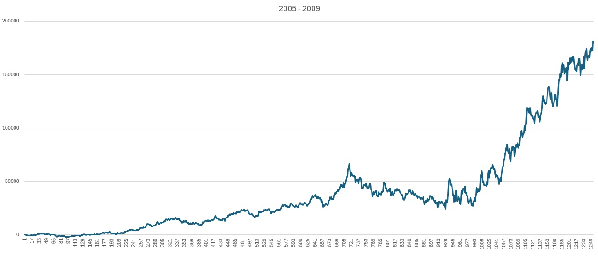
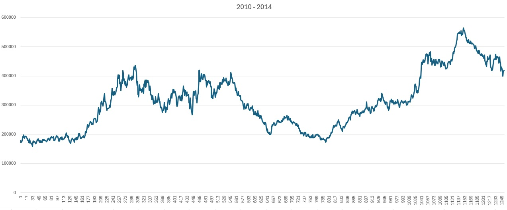
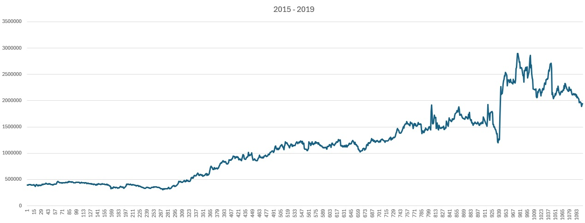
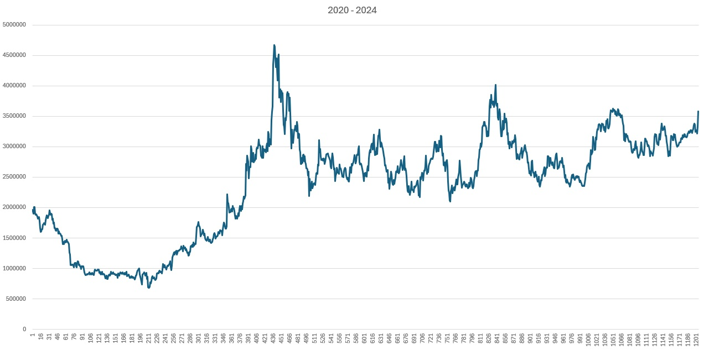
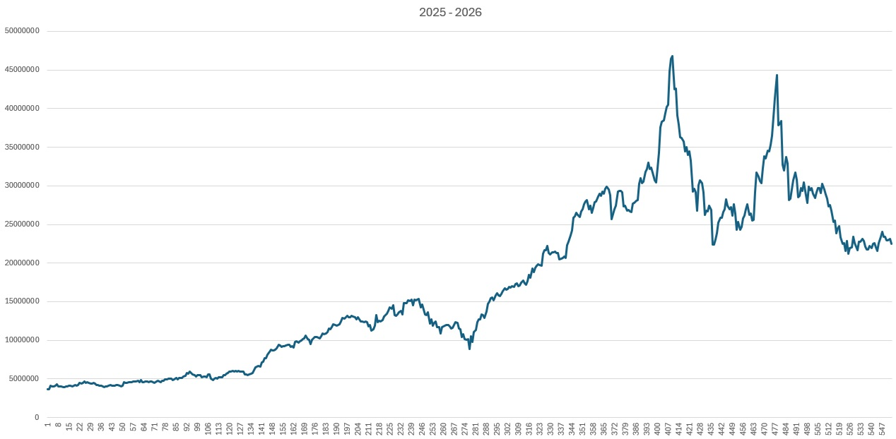

# Stock & Time-Series Demos

These demos apply the brain to financial time series — synthetic cycles, real historical price/volume
data, and sequence memorization. Stock trading is **one application** of the architecture, not its
focus; for the vision and language demos see [mnist-demos.md](mnist-demos.md) and
[text-demos.md](text-demos.md).

The included `1D` timeframe data is ready to use — **no API key needed** for these demos. To download
fresh or different data, see [Downloading Fresh Stock Data](#downloading-fresh-stock-data) at the end.

---

## Single-Channel Synthetic Cycle

A single-stock variant of the cycle test: one channel, a repeating 12-frame price/volume pattern, 20
repeats. Isolated to a single channel so you can see the brain converge on optimal actions without
multi-channel reinforcement doing any of the work.

```bash
node apps/stocks/jobs/synthetic-extended-test.js --error-mode static --error-threshold 0.3 --merge-threshold 0.9
```

**Expected output:**
```
Overall Optimal Rate: 233/240 = 97.1%
```

With the right thresholds the brain converges to 97%+ optimal action decisions on a single-channel
cyclical pattern — confirming that hierarchy and action inference work without cross-channel consensus.

---

## Multi-Channel Synthetic Cycle

The brain learns to trade 3 stocks simultaneously (KGC, GLD, SPY), each as a separate channel. A
repeating 12-day price cycle is presented 20 times — the brain discovers cross-stock patterns and
converges on optimal buy/sell timing.

```bash
node apps/stocks/jobs/multi-channel-test.js --error-mode static --error-threshold 0.3 --merge-threshold 0.9
```

**Expected output:**
```
🎯 Overall Optimal Rate: 696/720 = 96.7%
```

The brain learns when to own vs. not own each stock based on upcoming price movements, achieving 96%+
optimal trade decisions across all three channels. This demonstrates how multiple input streams
converge to improve inference — one of the architecture's core strengths.

---

## Stock Trading

The brain learns to trade stocks from historical price and volume data. Each stock is a separate
channel — the brain discovers cross-stock patterns and makes buy/sell/hold decisions optimized by
reward feedback.

```bash
node apps/stocks/jobs/test.js --symbols SO,VALE,STLD,GOOGL,MU,PLTR,UUUU,PFE,CRM,HAL,AWR,GM,EQIX,RTX,KGC,ALB,AAPL,CVX,HD,WPM,BEP,AREC,JNJ,SLB,PLD,EXK,NVDA,CAT,WFC,RGLD,WEAT,OXY,CEG,LOW,PAAS,MP,LMT,GS,COST,AG,TECK,MRK,INTC,BIP,PSA,DVN,AVAV,PEP,CDE,TSM --context-length 3 --max-positions 3 --transaction-cost 0.02 --columns 20 --spatial --spatial-error-mode conservative --spatial-merge-threshold 0.5 --temporal-error-mode static --temporal-error-threshold 0.4 --temporal-merge-threshold 0.9
```

**Expected output:**
```
🎯 Final Training Results (1 episodes):
============================================================
📈 Overall Performance:
   Starting Capital: $15000.00
   Total Net Profit: $22500477.56
   Average per Episode: $22500477.56
   Average ROI: +150003.18%
   Average Per-Frame ROI: +0.136216%
   Average Sharpe Ratio: 0.58
   Total Transaction Cost: $3034820.81 (0.02% per trade)
   Total Trades: 25999
   Average Trades per Episode: 25999.0

💰 Net Profit & ROI by Episode:
   Episode 1: $22500477.56 | ROI: +150003.18%, +0.136216%/frame, Sharpe: 0.58 (25999 trades)

📊 Base Level Accuracy by Episode:
   Episode 1: 43.43%
```

The complete frame-by-frame run log (all 5,373 days) is saved in [demo3.log](demo3.log).

The brain achieves only ~43% base-level prediction accuracy on price movements — below a coin flip — yet the
**reward-weighted action selection** still turns a profit by learning which contexts produce better outcomes. With
spatial co-activation enabled (`--spatial`), the brain trades direction accuracy for far more aggressive,
concentrated position sizing: it is wrong about direction more often than not, but sizes the contexts that pay off.

> **Reading this number honestly.** The +150,003% headline is a *total* return over ~21 years of daily data
> (~5,370 frames) — it compounds to **roughly +42%/year**, strong but far less dramatic than the raw percentage
> looks. It is also measured on a *curated* 50-symbol universe of names that survived and performed well over the
> period (a survivorship bias), with low simulated friction and hyperparameters tuned in-sample. Crucially, the
> base accuracy is **below 50%** and most of the edge comes from large, concentrated bets on a handful of volatile,
> low-priced names — restrict the universe to stable, higher-priced names (e.g. via `--min-price 10`) and the
> headline collapses to a far more sober ~+20%/year. The big number is a high-variance, in-sample artifact, not a
> reliable forward return.
>
> A more rigorous measurement uses a neutral, sector-diversified universe and a proper train/test split — train on
> the first ~80% of history, then evaluate on the **held-out final ~4.3 years** the brain never trained on.
> Out-of-sample performance peaks at **two training passes**, returning **~+20%/year at a real Sharpe of ~0.76**;
> additional passes push in-sample return higher while held-out return decays (textbook overfitting). The execution
> path has no look-ahead — the brain decides and trades at each day's close and is scored by the next day's move.

### Brain P&L through the years

Plotted on a single axis, 21 years of compounding flatten the early years into an invisible sliver, so the
trajectory is broken into five windows (net profit is cumulative, from $0 on $15,000 of capital). The single most
useful thing to know when reading these charts is **what the brain is actually holding**: this universe is
dominated by uranium (`UUUU`), precious-metals and silver miners (`EXK`, `CDE`, `AG`, `AREC`, `PAAS`, `KGC`,
`WPM`, `RGLD`), and other materials/energy (`TECK`, `MP`, `ALB`, `HAL`, `SLB`, `OXY`, `DVN`), with cyclical
semiconductors (`MU`) and a few momentum names (`PLTR`, `NVDA`) layered on top. So the brain's P&L behaves far less
like the S&P 500 and far more like **a leveraged, concentrated bet on the commodity cycle** — and almost every bump
below lines up with a commodity boom, a commodity bust, or a single concentrated position.

**2005–2009 — learning, then the first reflation**



The brain starts tiny (a few hundred neurons) with small positions, so the 2007–2008 financial crisis barely
registers — there isn't much capital at risk yet. The first real gains come in 2009, when the post-crash reflation
lifts commodities and the brain's miners/uranium with them (~$0 → ~$110K).

**2010–2014 — supercycle peak, then the commodity bear**



2010–2011 rides the commodity *supercycle* (silver ran to ~$49 in 2011) up toward ~$320K. Then comes the stretch
that looks like underperformance but isn't the brain's fault: the **2012–2015 commodity bear market.** Gold fell
from ~$1,900 (2011) toward ~$1,050, silver collapsed from ~$49 to ~$15, and mining stocks were gutted — so a
miner-heavy book simply churns sideways for years (~$240K–$300K through 2012–2013) before a 2014 bounce. The flat
patch is the sector in a multi-year drawdown, not a learning failure.

**2015–2019 — the 2016 miner rally and the 2018 Micron spike**



Two distinct events. First, the sharp **2016 precious-metals rally** (gold/silver miners doubled off the late-2015
bottom) lifts the brain on `UUUU`/`EXK`/`AG`. Then the violent strike you can see late in the window: a concentrated
**Micron (`MU`)** position during the 2017–18 memory-chip supercycle (MU ran ~$12 → ~$60) spikes P&L to ~$2.9M —
which the Q4-2018 market crash and memory-cycle bust (MU back to ~$30) then erases, ending the window near $1.7M. A
textbook concentrated-cyclical round trip.

**2020–2024 — COVID, the reflation boom, then the AI-market lull**



The COVID crash dips it to ~$0.8M, then the 2020–2021 reflation/EV-materials boom drives a sharp recovery into
`PLTR` (post-IPO moonshot), `MP` (rare earth), and uranium. The **2023–2024 stretch looks flat** for a specific
reason: that was the "Magnificent-7" mega-cap-tech market, and a commodity-tilted book was on the wrong side of it —
gold was rangebound, energy fell from its 2022 highs, lithium/materials crashed. The brain only keeps pace because
of its AI-adjacent holdings (`PLTR`, `NVDA`, and `CEG` as a nuclear/AI-power play); the resource majority caps it,
so it grinds gently up toward the mid-single-digit millions instead of exploding.

**2025–2026 — everything fires, then gives back**



The window the whole basket was built for: in 2025 uranium ripped (`UUUU` ~$5 → ~$25), gold and silver printed
records, and `PLTR` went parabolic — all at once — carrying P&L to an all-time high near **$46.8M**, helped by a
giant `AREC` position (millions of shares of a sub-$1 stock, the penny-stock lottery ticket). Then it **gives back
to ~$22.5M**: the same concentrated 2025 winners (`PLTR`, `UUUU`, `CEG`) pull back into 2026, and a book this
concentrated halves on an ordinary sector retreat. The ending value is essentially wherever the last day lands in
that volatility — which is exactly why the headline is a high-variance artifact, not a steady-state return.

The throughline: the brain is doing real, learned position-taking, but what it has *learned to ride* is the
commodity/hard-asset cycle of this particular universe. Its best years are commodity bull markets (2009–2011, 2016,
2020–2021, 2025) and its worst are commodity bears and tech-led markets where resources lag (2012–2015, 2023–2024) —
amplified at every turn by concentrated sizing.

### Random Baseline Comparison

A natural worry is that the result might come from a favorable data window rather than learned trading. To rule that
out, the same job can be run with `--random-baseline`, which replaces the brain's action inference with a coin flip:
50% chance to be fully out, 50% chance to own one stock chosen uniformly at random. Everything else — the same data,
same portfolio sizing, same execution path — is unchanged.

```bash
node apps/stocks/jobs/test.js --random-baseline
```

`--random-baseline` skips encoding, reward collection, and `brain.processFrame()` entirely, so the run is purely the
trading harness driven by random signals — no shared work with the brain path.

**Example random-baseline run:**


Random coin-flips don't just underperform the brain — they *lose money*. A representative run ends at **−$1,839.36
(−12.26% ROI, Sharpe −0.19)** over the full 5,373 days: undirected exposure drifts up and down with whatever the
basket does, pays transaction costs on every flip, and finishes underwater. Swap that random decision source for the
brain — same data, same portfolio sizing, same execution path — and the result turns solidly positive. This is the
simplest sanity check that the brain is doing real work: identical harness, identical data, only the decision source
changes — and one bleeds capital while the other compounds.

---

## Action Learning in Low Accuracy

The brain learns the best actions to perform in each situation over repeated episodes, even when base prediction
accuracy is low.

```bash
node apps/stocks/jobs/test.js --symbols SO,VALE,STLD,GOOGL,MU,PLTR,UUUU,PFE,CRM,HAL --context-length 3 --columns 20 --no-summary --episodes 5 --spatial
```

**Expected output:**
```
💰 Net Profit & ROI by Episode:
   Episode 1: $6763932.45 | ROI: +45092.88%, +0.113847%/frame, Sharpe: 0.40 (8592 trades)
   Episode 2: $119125247028800.97 | ROI: +794168313525.34%, +0.425159%/frame, Sharpe: 1.66 (8591 trades)
   Episode 3: $1.2343509826638645e+25 | ROI: +8.22900655109243e+22%, +0.900351%/frame, Sharpe: 3.07 (8084 trades)
   Episode 4: $1.135473988104428e+28 | ROI: +7.569826587362853e+25%, +1.028586%/frame, Sharpe: 3.44 (7820 trades)
   Episode 5: $5.143569772643019e+29 | ROI: +3.4290465150953454e+27%, +1.100313%/frame, Sharpe: 3.68 (7728 trades)

📊 Base Level Accuracy by Episode:
   Episode 1: 10.51%
   Episode 2: 5.66%
   Episode 3: 7.31%
   Episode 4: 8.01%
   Episode 5: 8.65%
```

The astronomical ROI is compounding over many episodes of in-sample data — a stress test of action learning, not a
forward return. The point is that even with single-digit base prediction accuracy, reward-weighted action selection
keeps improving the *actions* taken episode over episode.

---

## Stock Sequence Memorization

The brain memorizes a repeating stock price sequence across 5 episodes, reaching 60% prediction accuracy on real
market data. This demonstrates convergence on financial data — the same learning curve seen in text memorization.

```bash
node apps/stocks/jobs/test.js --no-summary --episodes 5 --symbols KGC,GOLD,SPY --context-length 3 --forget-rate 0.0005 --error-mode static --error-threshold 0.3
```

**Expected output:**
```
📊 Base Level Accuracy by Episode:
   Episode 1: 52.47%
   Episode 2: 55.46%
   Episode 3: 58.72%
   Episode 4: 59.81%
   Episode 5: 60.33%
```

The brain goes from 50% accuracy (random) to 60% in 5 episodes on 3 stocks × ~5,300 frames of real market data. The
low forget rate allows patterns to survive the full sequence. Short context (3 frames) is used because of
computation limits.

---

## Downloading Fresh Stock Data

To download new data or different timeframes, you need a free [Alpaca](https://alpaca.markets) account:

1. Sign up at [alpaca.markets](https://alpaca.markets) (free paper trading account)
2. Get your API key and secret from the dashboard
3. Add them to `apps/stocks/.env` (copy `apps/stocks/.env.example`)
4. Run the downloader for the symbols and timeframe you want

The included `1D` data covers ~21 years and is enough to reproduce every demo above without an account.
